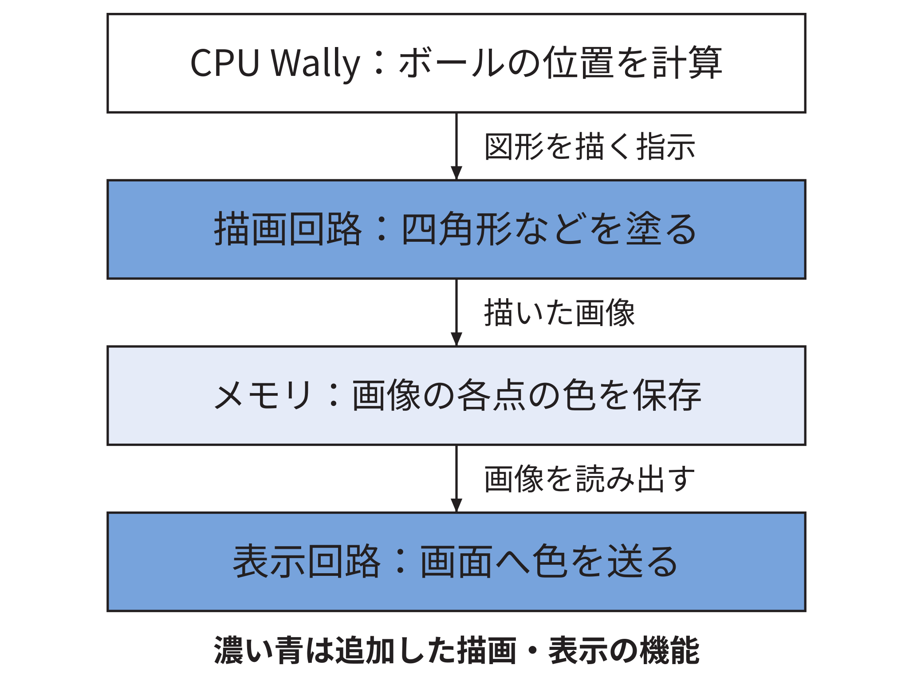
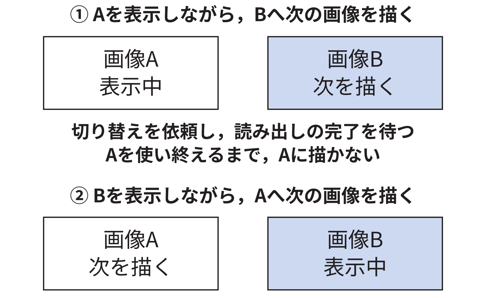

# FPGAを用いた二次元ゲーム機の設計と実装

## 1  はじめに

FPGAは，内部に作る回路の構成を設定できるチップである．本研究では，教科書RISC-V System-on-Chip Designで扱うCPUのWally[Harris26]に描画・表示機能を加え，ブロック崩しを動かした．目的は，Wallyの学習者が周辺機能を追加するときに参照できる，接続設計と動作確認の結果を示すことである．

## 2  ゲーム機の設計

基板Nexys VideoのFPGA内に，Wallyと公開設計の描画回路RasterIX[RasterIX]を組み込んだ．CPUはSDカードから読み込んだゲームを実行し，図形の位置や色を表す描画命令をメモリに用意して送る．RasterIXが画像をDDR3メモリへ保存し，表示回路が読み出してHDMI端子へ送る（図1）．基板の端子・メモリ・クロックに合わせた設定と，命令や画像を受け渡す接続を実装した．公式RasterIXの内部は変更していない．

CPUと描画側は20 MHzと100 MHzで動くため，両側のクロックに対応して命令を順番に預かるFIFOを置いた．空きがあればCPUは次の命令を送り，満杯なら待つ．また，二枚分の画像領域を用意し，一方を表示している間に他方へ描く．表示先の切り替えと古い画像の読み出し完了を確認してから，古い領域を次の描画に使う（図2）．

## 3  動作の確認

同じゲームを用い，一語ずつ受取確認を待つ接続と，16語・512語のFIFOを実機で比較した．初期状態の全体描画では，命令の書き込み中にCPUが待つ時間は，一語方式の4.393 msから512語FIFOの0.465 msへ減った．512語FIFOの保存には18 KbitのBlock RAMを1個使った．この時間はゲーム全体の処理時間ではない．

三接続方式の比較では，選んだ27条件の最終画像について，全307,200画素が正解画像と一致した．計測回路を除いた通常版では，640×480画素のブロック崩しが5分間の自動プレイを継続した．別途保存した30秒の実機映像でも，ボールの移動を確認した．一方，大きなテクスチャの描画と映像機器での認識には，未解決の条件が残った．

## 4  おわりに

CPU，描画回路，メモリ，表示を接続し，二次元ゲームを動かす構成を示した．命令の渡し方を比較し，採用した接続の待ち時間と回路量を確認した．設計理由，ソース，試験条件を公開資料にまとめ，同様の拡張の参照例とする．専用ゲームコントローラーの接続と，残る描画・映像受信の問題の検証が課題である．

## 参考文献

[Harris26] D. Harrisほか，RISC-V System-on-Chip Design，Morgan Kaufmann，2026．

[RasterIX] ToNi3141，RasterIX，https://github.com/ToNi3141/RasterIX （使用版9269a01c9bd4，参照2026-10-09）．

測定条件と詳しい結果は[論文本文](../thesis/本文.md#1310-命令接続方式の比較方法)に示す．
