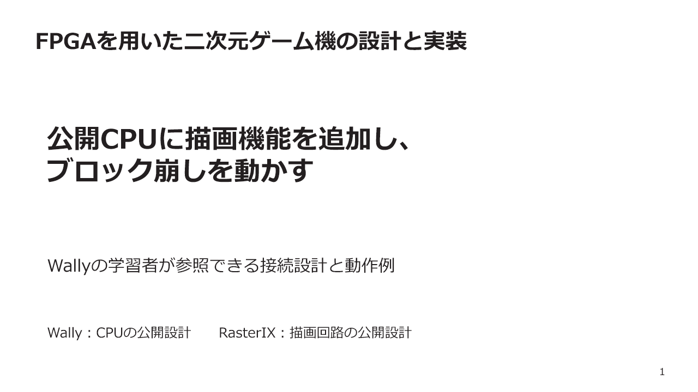
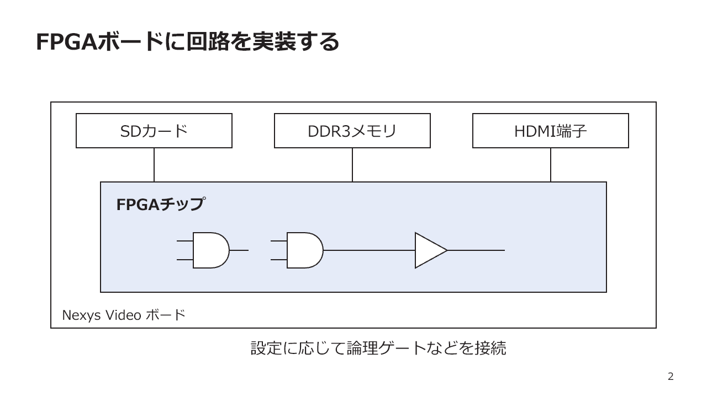
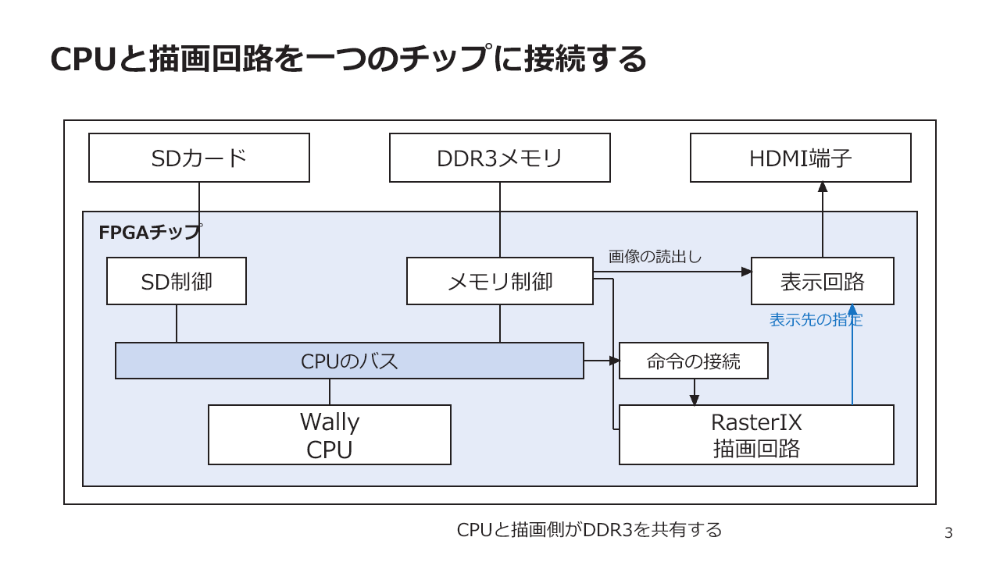
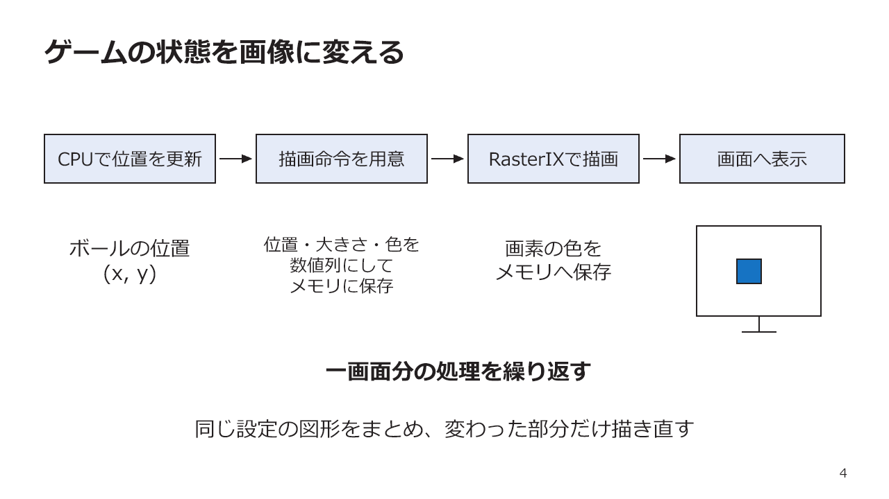
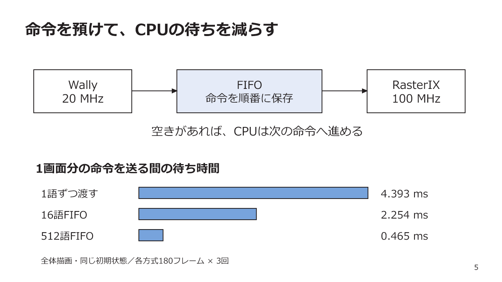
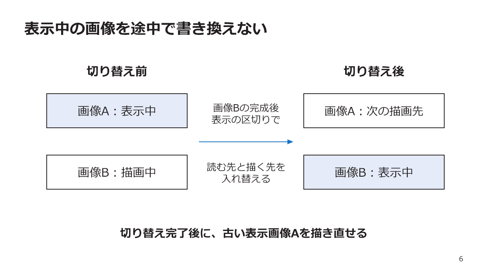
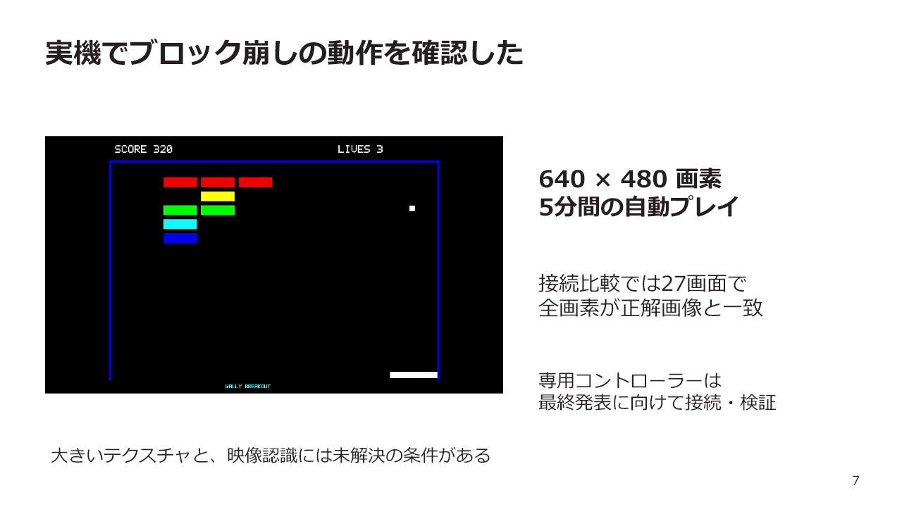
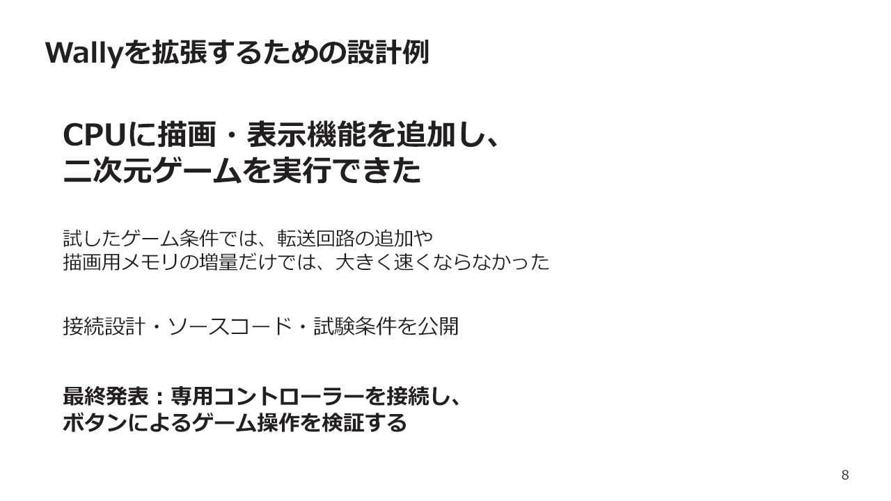

# 中間発表のスライドと発表原稿

発表時間は6分を想定し、8枚の説明を5分30秒で行う。残り30秒は図を指す時間と間に充てる。ゲーム機の接続設計と動作確認を中心に、描画の工夫と、接続や内部メモリの比較で分かった要点を説明する。専用コントローラーの接続と入力の検証は最終発表で扱う。

[PowerPoint版](中間発表_主要事項.pptx) / [アブスト](../abstract/アブスト_主要事項.md) / [論文本文](../thesis/本文.md)

## 目次

- [1. FPGAを用いた二次元ゲーム機の設計と実装](#slide-1)
- [2. FPGAボードに回路を実装する](#slide-2)
- [3. CPUと描画回路を一つのチップに接続する](#slide-3)
- [4. ゲームの状態を画像に変える](#slide-4)
- [5. 命令を預けて、CPUの待ちを減らす](#slide-5)
- [6. 表示中の画像を途中で書き換えない](#slide-6)
- [7. 実機でブロック崩しの動作を確認した](#slide-7)
- [8. Wallyを拡張するための設計例](#slide-8)

## 1. FPGAを用いた二次元ゲーム機の設計と実装

説明時間の目安：25秒

### 発表原稿

公開CPUであるWallyに、画面を描く回路を接続し、ブロック崩しを動かすゲーム機を作りました。目的は、Wallyに周辺機能を追加する学習者が、接続方法と確認方法を参照できる例を示すことです。今日は、基板の中に何を作り、どう画面を出し、何を確かめたかを説明します。
根拠：docs/thesis/本文.md 第6〜11章、第13章、第16章。実験記録 E6、E7。製品 https://github.com/SoshiroFujimori/wally-game-console/tree/261832d48832dd6e26c4971ab8893ce61200688b 。

## 2. FPGAボードに回路を実装する

説明時間の目安：35秒

### 発表原稿

FPGAボードには、FPGAチップのほかにメモリやSDカードスロット、HDMI端子があります。FPGAには、論理ゲートや記憶素子の接続を設定して、目的に合った回路を実装できます。図のゲートはそのイメージです。周辺の部品そのものをFPGAの中に作るのではなく、その部品を操作する回路を中に作ります。
根拠：docs/thesis/本文.md 第6〜11章、第13章、第16章。実験記録 E6、E7。製品 https://github.com/SoshiroFujimori/wally-game-console/tree/261832d48832dd6e26c4971ab8893ce61200688b 。

## 3. CPUと描画回路を一つのチップに接続する

説明時間の目安：50秒

### 発表原稿

このFPGAの中に、WallyとRasterIXを配置しました。前の図と、部品とチップの位置は同じです。CPUのバスにはSDカード制御回路と、描画命令を渡す接続回路をつなぎます。CPUも描画側も外のDDR3メモリを使うため、メモリへのアクセスをまとめます。RasterIXが作った画像は、表示回路が読み、HDMI端子から出します。既存のCPUと描画回路を利用し、この接続と制御を設計した部分が本研究です。
根拠：docs/thesis/本文.md 第6〜11章、第13章、第16章。実験記録 E6、E7。製品 https://github.com/SoshiroFujimori/wally-game-console/tree/261832d48832dd6e26c4971ab8893ce61200688b 。

## 4. ゲームの状態を画像に変える

説明時間の目安：50秒

### 発表原稿

CPUはSDカードから読み込んだゲームを実行します。一回の処理でボールの位置を更新し、位置や色を描画命令にしてメモリへ置きます。接続回路から命令を受けたRasterIXが画像を作り、表示回路が読み出します。これを繰り返すと動いて見えます。計測ではCPUの命令準備が大きな負担でした。そこで、同じ設定の図形をまとめ、変わった部分だけを描き直すようにしました。
根拠：docs/thesis/本文.md 第6〜11章、第13章、第16章。実験記録 E6、E7。製品 https://github.com/SoshiroFujimori/wally-game-console/tree/261832d48832dd6e26c4971ab8893ce61200688b 。

## 5. 命令を預けて、CPUの待ちを減らす

説明時間の目安：45秒

### 発表原稿

CPUとRasterIXは異なるクロックで動きます。そのため、命令の値と順番を保って渡す接続が必要です。一つの方法は、一語を保持し、相手の受取確認が戻るたびに次を送る方法です。採用したFIFOは、命令を順番に預かる待ち行列です。空きがあれば、CPUは次の命令へ進めます。同じゲームで比べたところ、この図の三方式では512語FIFOの送信待ちが最も短くなりました。この数字はゲーム全体ではなく、書き込みを待たされた時間です。
根拠：E6、第13.10〜13.13節。1語方式は4相ハンドシェイク。初期状態、全体描画、180フレームを3回、各試行平均の中央値。CPU 20 MHz、RasterIX 100 MHz。

## 6. 表示中の画像を途中で書き換えない

説明時間の目安：40秒

### 発表原稿

もう一つの接続設計が、表示する画像の切り替えです。表示回路は画像を読み続けます。その同じ画像を途中で描き換えると、新旧の画面が混ざるおそれがあります。そこで画像を二枚分用意し、一方を表示している間に、もう一方に描きます。完成後、表示の区切りで役割を交代します。また、古い画像の読み出しが残っている間は、そこへの描き直しを始めないよう、切り替え完了を確認します。
根拠：docs/thesis/本文.md 第6〜11章、第13章、第16章。実験記録 E6、E7。製品 https://github.com/SoshiroFujimori/wally-game-console/tree/261832d48832dd6e26c4971ab8893ce61200688b 。

## 7. 実機でブロック崩しの動作を確認した

説明時間の目安：40秒

### 発表原稿

640×480画素で、通常版の5分間の自動プレイと、別に30秒の実機映像を確認しました。接続を比較した三方式では、選んだ27条件の最終画像が全画素で期待画像と一致しました。すべての途中画像まで確認したわけではありません。大きなテクスチャの描画と映像認識には未解決の条件が残っています。専用コントローラーは今回の成果に含めず、最終発表に向けて接続と操作を検証します。
根拠：E6、第13.11節と13.15〜13.16節。画像：docs/thesis/figs/fifo-study-game.png。

## 8. Wallyを拡張するための設計例

説明時間の目安：45秒

### 発表原稿

Wallyへ描画・表示機能を追加し、二次元ゲームを動かす接続設計を示しました。命令を専用回路で転送する方式と、描画用メモリを増やす方式も実機で比較しました。試した条件では、前者はコピー処理を含めると速くならず、後者の改善も小さい結果でした。設計と試験条件を公開し、学習者が同様の拡張を検討するための参照例とします。最終発表では、専用コントローラーを接続し、ボタンによるゲーム操作を検証します。
根拠：docs/thesis/本文.md 第6〜11章、第13章、第16章。実験記録 E6、E7。製品 https://github.com/SoshiroFujimori/wally-game-console/tree/261832d48832dd6e26c4971ab8893ce61200688b 。

## 詳しい測定条件

FIFOの比較は[論文13.10節以降](../thesis/本文.md#s_13_10)、命令転送と内部メモリの比較は[13.17節以降](../thesis/本文.md#s_13_17)に示す。実験用の変更は標準構成と区別する。
