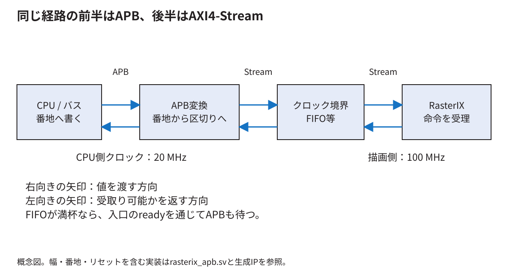
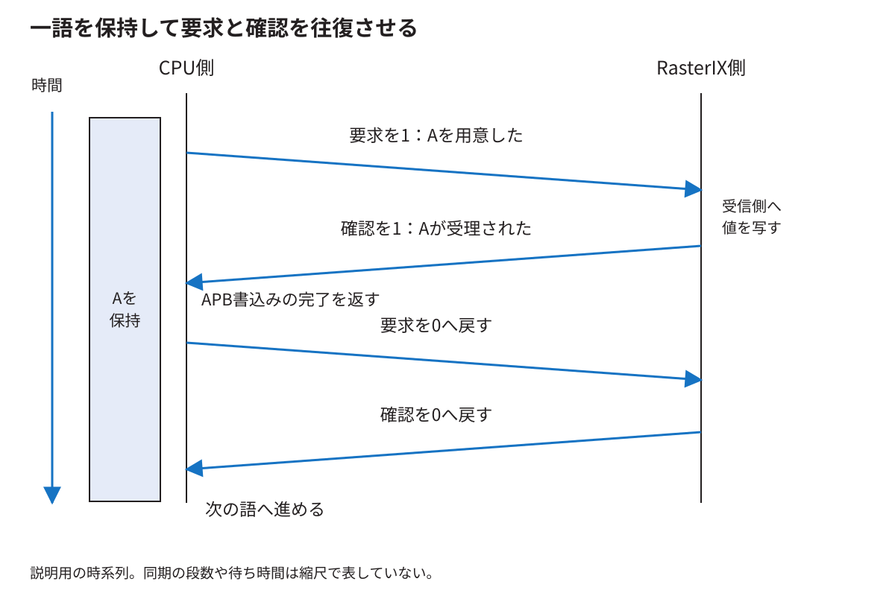

# APBとストリームとクロック間接続を一語ずつ追う

[分野別の入口](README.md) · [用語を調べる](glossary.md)

ここで答える中心の問いは「APBには待つ機能があるのに、なぜFIFOを置くのか」である。答えを先に限定すると、**待つ機能だけならFIFOは必須ではない。異なるクロックで安全に値を渡す仕組みを別に作れば、一語ずつの接続も成立する。本研究では、その接続とFIFO二種類を実際に比較した。** 以下では、この結論を信号と時間からたどる。

<!-- technical-toc:start -->
**このページの目次**

- [1 渡すものを32ビット一語に固定する](#sec-1)
- [2 APBは番地を指定する通信手順](#sec-2)
- [3 RasterIX側は番地付きAPBを直接受けない](#sec-3)
- [4 実際の変換回路を式で読む](#sec-4)
- [5 同じクロックなら待たせるだけの接続も考えられる](#sec-5)
- [6 クロックが違うと何を追加で決めるのか](#sec-6)
- [7 二段同期でできることとできないこと](#sec-7)
- [8 FIFOを使わない一語方式の全過程](#sec-8)
- [9 FIFOはどこで待つかを変える](#sec-9)
- [10 同期FIFOと非同期FIFOの違い](#sec-10)
- [11 Gray符号を使う理由を四語FIFOで考える](#sec-11)
- [12 20 MHzと100 MHzだけではFIFOの効果を決められない](#sec-12)
- [13 実験から今回どこまで言えるか](#sec-13)
- [14 何を保存し何を確認すれば接続を検証できるか](#sec-14)
<!-- technical-toc:end -->

<a id="sec-1"></a>
## 1 渡すものを32ビット一語に固定する

説明用の値`0x12345678`をCPUからRasterIXの命令入力へ渡すとする。この値が有効な描画命令だと主張しているわけではない。ここでは「同じ32ビットを一度だけ相手へ渡す」部分に注目する。

命令列の最後かどうかを表す1ビットも、32ビットと一緒に扱う。データだけ正しく渡っても、区切りが一語ずれれば、後段の命令解析が違うまとまりとして扱う可能性がある。従って、この接続で保ちたい単位はデータ32ビットと終端1ビットの組である。

<a id="sec-2"></a>
## 2 APBは番地を指定する通信手順

CPUが`0x10080000`に値を書くと、SoCの番地選択とバス変換を経て、RasterIX用のAPB回路が選ばれる。主な信号は、相手を選ぶ`PSEL`、アクセス段階を示す`PENABLE`、書込みかを示す`PWRITE`、番地`PADDR`、値`PWDATA`、完了できるかを返す`PREADY`である。

APBには準備段階とアクセス段階がある。受け側が`PREADY=0`にすると、アクセス段階を延ばせる。送り側は、待っている間、番地や値などを保持する。`PSEL`、`PENABLE`、`PREADY`がすべて1である立ち上がりが、その転送の完了になる。これは[Arm APB仕様](https://developer.arm.com/documentation/ihi0024/latest/)の基本的な受渡し規則である。

| 立ち上がり直前の状態 | PSEL | PENABLE | PREADY | その立ち上がりで書込み完了か |
|---|---:|---:|---:|---|
| 準備 | 1 | 0 | 1 | いいえ |
| アクセスだが待機 | 1 | 1 | 0 | いいえ |
| アクセスだが待機 | 1 | 1 | 0 | いいえ |
| アクセスして完了 | 1 | 1 | 1 | はい、一回だけ |

`PREADY=1`だけで完了ではない。準備段階の1や、回路が選ばれていないときの1を転送として数えてはいけない。

<a id="sec-3"></a>
## 3 RasterIX側は番地付きAPBを直接受けない

この構成のRasterIX命令入力はAXI4-Streamである。そこには、CPUが書いたAPBの番地をそのまま渡さない。値を示す`TDATA`、有効な値を提示している`TVALID`、受け取れることを示す`TREADY`、区切りの`TLAST`がある。

同じクロックの立ち上がりで`TVALID=1`かつ`TREADY=1`なら一語が渡る。`TVALID=1`、`TREADY=0`なら渡らず、送り側は値と区切りを変えずに待つ。`TVALID=0`なら`TDATA`にどんな数値が見えていても、その周期では有効な転送ではない。[Arm AXI-Stream仕様](https://developer.arm.com/documentation/ihi0051/latest/)



図では、APBからストリームへ変換する部分と、二つのクロックの間を渡す部分を分けた。「APBかStreamか」は二者択一ではない。同じ経路の異なる場所で両方を使っている。

<a id="sec-4"></a>
## 4 実際の変換回路を式で読む

[固定版rasterix_apb.sv](../thesis/再現資料/接続ソース/fpga/src/rasterix_apb.sv)では、書込みの条件を`CommandWrite`にまとめ、次の関係を作っている。

```systemverilog
assign CmdValid = CommandWrite;
assign CmdLast = PADDR[2];
assign CmdData = WriteData;
assign PREADY = CommandWrite ? CmdReady :
                ResponseRead ? RespValid : 1'b1;
```

命令を書いている間は、命令入口が受け取れるかを`PREADY`へ返す。従って、FIFOが満杯ならAPBも待つ。FIFOを置いたためにAPBの待つ機能が不要になったわけではない。

ソフトウェアは、整列した32ビットの書込みを使う。オフセット`0x00`へ書くと通常の語、`0x04`へ書くと最後の語になる。64ビットCPUの場合、`0x04`の語は64ビットバスの上側32ビットに位置する。回路は`PADDR[2]`とバイトの有効信号`PSTRB`を見て、正しい32ビットを取り出している。

ここで紹介した短い式だけを別のバスへコピーしても、完全な接続にはならない。データ幅、番地、書込みの幅、APBの保持条件、リセットを含む前提が要る。

<a id="sec-5"></a>
## 5 同じクロックなら待たせるだけの接続も考えられる

両側が同じクロックで、APBの値をアクセス中保持し、RasterIX側も正しいready/validで受け取るとする。その場合は、RasterIX側のreadyをAPBへ返し、有効な値を直接提示する接続が考えられる。受け取る立ち上がりとAPBが完了する立ち上がりを一致させればよい。

従って「受け側が一時停止する仕様を持つ」ことから、ただちに「FIFOが必要」とは導けない。必要なのは、停止中も値を失わない受渡しである。FIFOはその実現方法の一つであり、一語保持と待機による方法もある。

<a id="sec-6"></a>
## 6 クロックが違うと何を追加で決めるのか

ある信号が変わる時刻と、相手が保存する時刻が近過ぎると、受け側のFFの時間条件を満たせないことがある。出力が0か1へ落ち着くまで通常より長くかかる現象がメタステーブルである。論理シミュレーションの0/1の図だけでは、この確率を再現できない。

さらに、32ビットが別々の配線を通るので、同じ瞬間に全部が切り替わる保証はない。例えば`0111`から`1000`への変化の途中で、4ビットの一部だけ新しい値として保存されると、送り側が意図していない組合せになる。

単に「相手のクロックが速いから大丈夫」とは言えない。速いクロックほど頻繁に観察するが、信号が変わる瞬間を避ける保証にはならない。周期と位相の関係を正しく解析できる接続か、CDC用の仕組みを使う接続かを決める。

<a id="sec-7"></a>
## 7 二段同期でできることとできないこと

一つの状態信号を受け側クロックのFF二段へ通すと、一段目の出力が落ち着く時間を増やせる。これがよく使われる同期回路である。ただし失敗確率を数学的にゼロにする装置ではない。段間の配置、動作周波数、信号の変化頻度なども関係する。

32ビットをそれぞれ二段同期すれば、まとまりまで必ずそろうわけではない。あるビットは今周期、別のビットは次周期に新しい値へ変わる可能性がある。データを保持して「使ってよい」という通知を渡す方法や、位置情報だけを同期するFIFOなど、複数ビットを一組で扱う仕組みが必要になる。

また、短いパルスは相手の立ち上がりと一度も重ならず、見逃される場合がある。持続する状態信号、要求と確認、反転する通知は、それぞれ違う契約である。どの種類の信号を渡しているかから方式を選ぶ。

<a id="sec-8"></a>
## 8 FIFOを使わない一語方式の全過程

一語方式では、送り側に値を保存し、「要求あり」を1にする。受け側は同期された要求を見て、安定している値を自分の保持場所へ写す。RasterIXが受け取ったら「確認」を1にし、それを送り側へ戻す。送り側は確認を受けてAPB書込みを完了し、要求を0に戻す。受け側も確認を0に戻し、次の語を受け入れる準備ができる。



ここで二つの保持場所があるのは、異なるクロックで同じ一語を受け渡すためである。後続の別の語をいくつも受け付けているわけではない。本研究の[実験用command_mailbox.sv](../thesis/再現資料/実験記録/E6/scripts/command_mailbox.sv)は、この4相方式を使う。

受け側がすぐ受け取れても、通知の往復と元の状態へ戻る時間は必要になる。そのため、APBの待ち時間が大きいことだけから「RasterIXの描画が遅い」とは言えない。接続の通知を待っている時間も含まれる。

データの線を同期FFなしで渡すのは、無条件の直結が安全だからではない。要求が相手へ届いて値を使うまで、値を保持し、配線遅延の条件も満たすという設計である。実験では対応するXDCも保存している。

<a id="sec-9"></a>
## 9 FIFOはどこで待つかを変える

FIFOは先に入れた値から先に取り出す保存場所である。入口は空きがある限り受け取り、出口は相手が受け取れるときだけ進む。APBはRasterIX本人の受取りまで毎語待つ代わりに、FIFOへの保存ができた時点で完了できる。

例えば空きが三語あるとき、CPUはA、B、Cを順に保存できる。RasterIXがまだAを処理している間でも、BとCの置き場所は確保されている。CPUが永久に先へ進めるわけではない。満杯になればAPBが待つ。

本研究で、実機のすべての周期にこの説明例どおりのA/B/Cが並んだと測定したわけではない。これは保存場所と待機位置の原理であり、実測した待ち時間は後の節で区別して示す。

<a id="sec-10"></a>
## 10 同期FIFOと非同期FIFOの違い

同期FIFOでは入口と出口を同じクロックで管理する。何語入ったか、何語出たかを同じ立ち上がりで扱える。非同期FIFOでは入口を送り側のクロック、出口を受け側のクロックで管理し、それぞれの位置情報を相手へ伝える仕組みを持つ。

非同期FIFOが二つのクロックのずれを「なくす」わけではない。二つの時刻のまま、相手が進んだ位置を遅れて知っても、保存済みの語を順に読めるようにする。空・満杯の状態が解除されるまで何周期かかかる場合があるのは、その通知にも時間が要るためである。

[AMD PG085](https://docs.amd.com/r/1.1-English/pg085-axi4stream-infrastructure/Overview)にあるクロック変換とデータ保存のIPは、この種の境界を扱う一次資料である。本構成の`axiscdc`は生成されたIPの実体名であり、APB変換モジュールの名前ではない。

<a id="sec-11"></a>
## 11 Gray符号を使う理由を四語FIFOで考える

四語の保存場所の番号は0、1、2、3で一周する。ただし読出し位置と書込み位置が同じ番号でも、「空」と「一周して満杯」を区別する必要があるので、説明用には一周分の追加ビットを持つ3ビットの位置を考える。

通常の二進数では3→4で`011→100`となり、三ビットが変わる。Gray符号では隣の値へ進むとき変化するビットを一つにできる。`gray = binary XOR (binary >> 1)`で作る例では、3と4は`010→110`で一ビットだけ変わる。

これを同期して相手の位置を知る。位置が一歩ずつ進むこと、符号がレジスタ出力であること、ビット間の配線時間に必要な制約があることまで含めて設計する。Grayという計算式だけを足せばどんな複数ビット信号でも安全、とはならない。

相手の読出し位置を遅れて知ると、実際は空きができていても少しの間「満杯」と扱うことがある。これは余分に待つ方向の誤差である。空いていないのに空いたと判断して上書きすることとは違う。空・満杯の検出式と同期の向きを一緒に読むことが重要になる。

<a id="sec-12"></a>
## 12 20 MHzと100 MHzだけではFIFOの効果を決められない

CPUは一語を書くだけでも、メモリ読出し、ループ処理、命令実行、バス取引を行う。RasterIXも一語の受取り後に、命令の種類により異なる仕事を行う。100 MHzだから必ず一周期で一命令を終えられるわけではない。

理想的なAPBでも、準備とアクセスの二周期が必要なら20 MHzで最大1000万転送/秒、32ビットでは4000万byte/秒になる。これはCPUの命令やブリッジ等の費用を無視した上限の計算例であり、実測速度ではない。

平均して送り手が遅くても、受け側が一時的に停止すれば待ちが生じる。また一語方式は、受け側の停止がなくても確認の往復で待つ。FIFOが有効かを判断するには、この時間を区別する必要がある。

<a id="sec-13"></a>
## 13 実験から今回どこまで言えるか

E6の初期状態・全体描画では、APB待ち時間の中央値が、一語方式4.393、16語FIFO2.254、512語FIFO0.465 ms/frameだった。送信関数全体は、それぞれ11.971、9.542、7.481 ms/frameである。APB待ちは送信関数の時間に含まれる。[数値と条件](../thesis/再現資料/実験記録/E6/report/結果と判断.md)

この測定は「Wallyが20 MHzでも送信待ちは発生し、比較した方式で差が出た」根拠になる。一語方式でも動いたので、FIFOが唯一の接続方法という根拠にはならない。また、512語がすべての容量や接続方式の中で最適という根拠にもならない。

一語方式とFIFOでは「CPUに完了を返す場所」が違う。前者はRasterIX側の受取り確認が戻った時点、後者はFIFOが所有した時点である。この違いが、設計上の効果と比較結果を結び付ける。

<a id="sec-14"></a>
## 14 何を保存し何を確認すれば接続を検証できるか

入力で受理された語の列を記録する。出力で受理された語と区切りの列を記録する。リセットで破棄すると定めた期間を除き、順序、内容、回数が一致するか調べる。validが立った回数ではなく、validとreadyが同時に1の立ち上がりを数える。

停止を解除すれば最後まで進むかも確認する。語が失われないという正しさと、いつか完了するという進行の性質は別である。「受け側が永久にreadyを上げない」という環境では、送り側だけで正常完了を保証できない。

本資料の[説明用モデル](../../examples/technical-models/README.md)では、停止中に値を保持し、受理した語だけを数える例を実行できる。これはIPの電気的なCDC検証の代わりではない。実機の比較手順は[技術付録第29章](../thesis/技術付録.md#ch_29)を使う。
