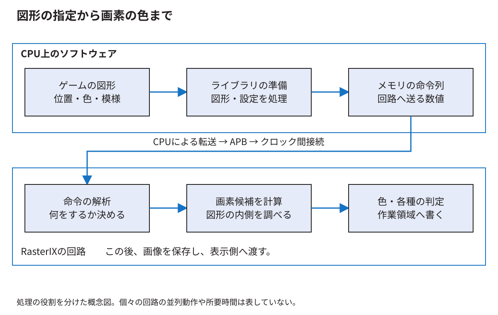

# 図形の指定がメモリ上の描画命令になるまで

[分野別の入口](README.md) · [用語を調べる](glossary.md)

「図形と設定を関連付ける」「後で回路へ渡す形式にする」を、白い四角形一個の例へ置き換える。ここでは座標や色の意味から始め、CPU側の状態、頂点、命令配列、転送までを追う。実装の基本説明は固定版RasterIX `9fdcf97a`を対象とし、E6の`9269a01c`との違いは別に示す。

<!-- technical-toc:start -->
**このページの目次**

- [1 最初に画面上で何を変えたいかを決める](#sec-1)
- [2 色を変える関数だけではまだ画面を塗らない](#sec-2)
- [3 四つの頂点を一つの四角形にする指定](#sec-3)
- [4 アプリケーションの座標を描画先へ対応付ける](#sec-4)
- [5 CPUで行う仕事とRTLで行う仕事](#sec-5)
- [6 描画命令とCPU命令は別の命令](#sec-6)
- [7 コマンドバッファはRAM上の数値列](#sec-7)
- [8 同じデータ幅でも長さの単位を確認する](#sec-8)
- [9 五本の帯と二組の命令リスト](#sec-9)
- [10 バッファを再利用してよい時点](#sec-10)
- [11 VBOを使えば同じ問題がすべて解決するか](#sec-11)
- [12 呼出しをまとめると減る仕事](#sec-12)
<!-- technical-toc:end -->

<a id="sec-1"></a>
## 1 最初に画面上で何を変えたいかを決める

横640、縦480の画面で、左上が`(100,80)`、幅16、高さ16の白い四角形を描くとする。左上という言葉を使うため、この説明ではアプリケーションの座標を「右へ行くとxが増え、下へ行くとyが増える」と決める。

四つの角は`(100,80)`、`(116,80)`、`(116,96)`、`(100,96)`になる。これらは図形の境界の位置であり、画素の番号の列そのものではない。どの画素を塗るかは、後で画素ごとの判定点を決めて求める。この区別を[画素化の章](rasterization.md)で実際に計算する。

<a id="sec-2"></a>
## 2 色を変える関数だけではまだ画面を塗らない

```cpp
glColor4ub(255, 255, 255, 255);
```

ここでは赤、緑、青、alphaの四成分を指定する。これは「以後に渡す頂点などに使う現在の色」を設定する操作であり、画面全部をその場で白へ塗る操作ではない。

CPU側のライブラリは、色などの現在の設定を状態として持つ。続いて頂点を渡すと、その時点の色やテクスチャ座標と位置を関連付ける。関連付けるとは、例えば「この角の位置は(100,80)、色は白、模様を使うなら模様の位置は(u,v)」という一組を扱うことである。

APIを「関数名の一覧」として覚えるより、設定を変えた後に何を渡すかを一緒に追うと動作を説明しやすい。

<a id="sec-3"></a>
## 3 四つの頂点を一つの四角形にする指定

```cpp
glBegin(GL_QUADS);
glVertex2f(100, 80);
glVertex2f(116, 80);
glVertex2f(116, 96);
glVertex2f(100, 96);
glEnd();
```

`GL_QUADS`があるので、渡された四頂点を一つの四角形として扱える。同じ頂点数でも、線として渡すのか、独立した点として渡すのかで図形は違う。頂点を並べるだけでは、何を作るかという情報が足りない。

後段が三角形を処理するなら、四角形を二つの三角形へ分ける。これは2Dの四角形を塗るためにも使う方法であり、奥行きのあるゲームを実装したことを意味しない。三角形にすると内外の判定と属性の補間を共通の処理で扱える。

このコードは動きを説明する抜粋である。単独でプログラムになるものではなく、描画コンテキスト、座標変換、画面の更新などの準備が必要になる。

<a id="sec-4"></a>
## 4 アプリケーションの座標を描画先へ対応付ける

固定版の[BreakoutRenderer.hpp](https://github.com/SoshiroFujimori/wally-game-console/blob/cdf907bc1752b0f300e4fc70b9a51b2bae983b7f/examples/rasterix/BreakoutRenderer.hpp)は、`glViewport`、射影行列の設定、`glOrtho`などを使って、ゲームの位置と画面の範囲を対応付ける。

`glViewport`は最終的に使う画面内の範囲を指定する。`glOrtho`は、指定した座標の範囲がどのように見えるかを決める変換を設定する。引数の上下の順を変えると、アプリケーションでyを下向きに増やす対応を作れる。

本実装には半画素の位置合わせもある。これを「とりあえず見た目を合わせた数字」として暗記せず、ライブラリの座標変換後にどの格子点で内外を判定するかと対応付ける。固定版の式を最後まで追う資料は[技術付録X](../thesis/技術付録.md#ch_X)にある。

<a id="sec-5"></a>
## 5 CPUで行う仕事とRTLで行う仕事



CPU側は、APIの設定、頂点の収集、座標変換、必要な切取り、三角形の準備、命令列の作成などを担当する。描画回路へ「C++の四角形オブジェクト」をそのまま渡しているのではない。回路が順番に解釈できる数値へ変換する。

回路側は、その数値から三角形の画素を列挙し、属性や模様の色を求め、各画素で必要な試験や混色を行い、作業領域へ書く。どこまでをCPUで行うかは構成で変わり得るので、一般のGPUと同一と仮定せず、固定版の[公式設計資料](https://github.com/ToNi3141/RasterIX/blob/9fdcf97a31b2e4247594e06d605871980cd5e9e1/design.md)とコードを対応付ける。

<a id="sec-6"></a>
## 6 描画命令とCPU命令は別の命令

RISC-Vの`sw`はCPUが理解する命令である。RasterIXへ渡す「設定を変更する」「三角形の情報が続く」といった語は、RasterIXの命令解析回路が理解する命令である。CPUはRISC-V命令を実行することで、RasterIX向けの命令を作って転送する。

コンパイル時に一度作られたCPUの機械語と、ゲームの状態に応じて実行中に作られる描画命令を分ける。ボールの位置が毎フレーム変わる場合、同じCPUプログラムが違う数値を描画命令へ入れる。

<a id="sec-7"></a>
## 7 コマンドバッファはRAM上の数値列

例えば概念上「設定を表す語」「三角形の情報が始まることを表す語」「辺の値や増分を表す語」のように並べる。これは形式を説明する模式例であり、任意の数字を並べて実行できる命令表ではない。

バッファを置くと、CPUが作った数値のまとまりを、転送処理が後から順に読める。処理を分けやすくなる一方、配列へ書く手間、メモリ容量、転送開始までの遅れが生じる。バッファという言葉だけから高速化を保証してはいけない。

実際の語の形式を調べるときは、ソフトウェアの[DisplayListAssembler](../thesis/再現資料/詳説用ソース/RasterIX/lib/gl/renderer/displaylist/RIXDisplayListAssembler.hpp)と、RTLの[RegisterAndDescriptorDefines.vh](https://github.com/ToNi3141/RasterIX/blob/9fdcf97a31b2e4247594e06d605871980cd5e9e1/rtl/RasterIX/RegisterAndDescriptorDefines.vh)を対にして読む。片側だけ読んで単位や長さを推測しない。

<a id="sec-8"></a>
## 8 同じデータ幅でも長さの単位を確認する

長さが16と書かれていても、16 byte、16語、16画素では大きさが違う。32ビット語なら16語は64 byteである。RGB565なら16画素は32 byteである。

命令ヘッダが示す長さと、ループの回数と、バスで数えた転送回数を同じ単位へ直す。最後の語の印`TLAST`も、APIの一回の呼出し、描画命令の終わり、一画面の終わりと常に一致するわけではない。どの層の区切りかを定義した箇所を読む。

<a id="sec-9"></a>
## 9 五本の帯と二組の命令リスト

固定版は640×480=307,200画素を、65,536画素の内部作業領域で扱う。`getDisplayLines()`はこの条件で5を返す。ここでのlinesは、この説明では画面の横線一本ではなく、分割して扱う帯の数として読む。

一画面分の命令を五本の帯に対して用意する。さらに、それぞれについて二組のリストを扱うので10個になる。転送用の別のバッファが一つあり、[WallyBusConnector](../thesis/再現資料/接続ソース/examples/rasterix/WallyBusConnector.hpp)の配列数は`2 * 5 + 1 = 11`となる。

「もう一組」は、同じ五本に対応する別のリスト群である。画面の別の五本が増えて計十本になるという意味ではない。表示用の画像が二枚ある話とも、別の保存場所の話である。

このコネクタは各配列を1 MiB分確保する。11 MiBは確保したデータ領域の合計であり、毎フレーム11 MiBすべてを転送するという意味ではない。実際に使った長さを渡して転送する。

<a id="sec-10"></a>
## 10 バッファを再利用してよい時点

転送前に配列を書き換えると、まだ送っていない語が別のフレームの内容になる。転送中は、必要な範囲の内容を保つ必要がある。MMIOへのコピーが終われば、そのコピー済みの語は接続側の保持場所が持つので、CPU側の元の配列を再利用できる段階になる。

しかし、配列を再利用できることと、表示用画像を描き換えてよいことは違う。後者は、表示回路がまだ読んでいないかを確かめる必要がある。「転送完了」という名前だけで、どの保存場所が自由になったかを判断しない。

<a id="sec-11"></a>
## 11 VBOを使えば同じ問題がすべて解決するか

VBOは頂点データをバッファとして扱うAPI上の仕組みである。変わらない大量の頂点の再利用などで意味を持つ。一方、コマンドバッファは回路へ渡す操作や設定の列であり、同じ種類のバッファではない。VBOを使っても、設定、図形の準備、転送、表示の待ちがすべて消えるわけではない。

今回のブロック崩しは小さな四角形と文字が中心で、実装と比較はその条件で行った。VBO方式との同条件比較は本資料の成果ではない。「常に不要」「必ず速い」のどちらも言わない。検討するなら、再利用できる頂点の量、CPU側処理、転送量、実装の対応範囲を調べて比較する。

<a id="sec-12"></a>
## 12 呼出しをまとめると減る仕事

四角形一個ごとに状態を切り替えたり、開始と終了を繰り返したりすると、図形数とは別の処理が発生する。同じ設定で描ける四角形を一回のまとまりにすれば、その繰返しを減らせる。

ただし描画順は画像の一部である。透明な図形を勝手に色順へ並べ替えると、重なった部分の色が変わることがある。固定版のRendererは、四角形の群と文字の群を扱うが、任意の透明図形群を無条件で並べ替えられる最適化ではない。

最後に、APIを一回呼んだこと、CPUが数値列を作り終えたこと、FIFOへ語が入ったこと、回路が画素を書いたこと、画面が切り替わったことを、五つの別の出来事として説明できれば、この経路の入口がつながる。
