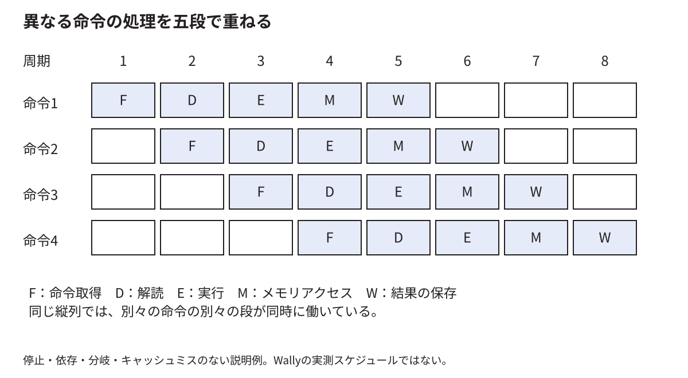

# Wallyが一つのプログラムを実行する過程

[分野別の入口](README.md) · [用語を調べる](glossary.md)

「CPUがゲームを実行する」を、命令、保存場所、計算、待ちの四つへ分解する。五段パイプラインの表は説明用モデルであり、すべてのWally命令の実行周期を予測する表ではない。実装の入口は、製品の固定版`cdf907bc`へリンクする。E6の更新版は別の版として扱う。

<!-- technical-toc:start -->
**このページの目次**

- [1 C++の一行をCPUがそのまま読んでいるわけではない](#sec-1)
- [2 CPU内部のレジスタと周辺機器のレジスタ](#sec-2)
- [3 次の命令の番地をPCが持つ](#sec-3)
- [4 五段の名前を仕事に戻す](#sec-4)
- [5 パイプラインは一命令を一瞬で終える仕組みではない](#sec-5)
- [6 前の結果が必要なら先へ進めない場合がある](#sec-6)
- [7 stallとflushは違う](#sec-7)
- [8 20 MHzでもソフトウェアの時間は一種類ではない](#sec-8)
- [9 RISC-VとWallyを分ける](#sec-9)
- [10 構成パラメータは実行中の設定とは違う](#sec-10)
- [11 割込みと例外は通常の関数呼出しとは違う](#sec-11)
- [12 実装を読むときの具体的な順序](#sec-12)
<!-- technical-toc:end -->

<a id="sec-1"></a>
## 1 C++の一行をCPUがそのまま読んでいるわけではない

```cpp
ball_x = ball_x + 3;
```

CPUが直接理解するのは、コンパイラが作った機械語の命令である。機械語は、どの演算を行い、どのレジスタや値を使うかをビット列で表す。上の一行が何命令になるかは、最適化、周辺のコード、値がすでにレジスタにあるかなどで変わる。

説明用に、メモリから位置を読み、3を足し、メモリへ戻す順を考える。レジスタ`a0`に位置の保存先の番地があるとする。

```asm
lw   t0, 0(a0)
addi t0, t0, 3
sw   t0, 0(a0)
```

`lw`は32ビットをメモリから読む、`addi`は定数を足す、`sw`は下位32ビットをメモリへ書く命令である。RV64の`lw`は読んだ32ビットを符号拡張する。この例の100や103には影響しないが、上位ビットが1の値では重要になる。[RISC-V RV64Iのload/store仕様](https://docs.riscv.org/reference/isa/v20260120/unpriv/rv64.html)

<a id="sec-2"></a>
## 2 CPU内部のレジスタと周辺機器のレジスタ

上の`t0`はCPUの整数レジスタの別名である。CPUが計算の途中値を保持する場所で、通常のメモリ番地を指定して読むものではない。一方、RasterIXの`STATUS`や`CMD`は周辺機器のレジスタと呼ばれ、特定の物理番地へのload/storeで操作する。

両方とも値を保持する回路を含み得るので同じ言葉が使われるが、アクセス方法と意味が違う。さらに`CMD`は、書いた値が単に上書き保存されるだけでなく、次の一語を送る操作になる。名前がレジスタだからといって、すべてが読み書き自由な変数ではない。

<a id="sec-3"></a>
## 3 次の命令の番地をPCが持つ

PCは命令を取りに行く番地を管理する。普通に進む場合は次の命令へ進み、分岐やジャンプでは別の番地へ変わる。RISC-Vでは構成によって16ビットの圧縮命令も使うため、常にPCへ4を足せばよいとは限らない。

命令を読むためにもメモリへの経路が要る。命令キャッシュにあれば短く済み、なければ下のメモリ階層を待つことがある。CPUがプログラムを実行するためのデータ取得と、ゲームが描画命令を送るためのデータ取得は、同じSoC内のメモリ資源を利用する。

<a id="sec-4"></a>
## 4 五段の名前を仕事に戻す

| 段 | 略号 | この説明例で行うこと |
|---|---|---|
| 命令を取る | F | PCの指す命令を用意する |
| 命令を解釈する | D | 演算や保存先を判別し、元の値を読む |
| 計算する | E | 足し算、番地計算、分岐条件などを求める |
| メモリを扱う | M | load/storeの取引を進める |
| 結果を確定する | W | 必要な結果をCPUのレジスタへ戻す |

すべての命令がすべての段で同じ量の仕事をするわけではない。足し算だけならM段でデータメモリへの読書きは行わない。例外や割込み、浮動小数点、キャッシュ待ちなどは、さらに制御を必要とする。

<a id="sec-5"></a>
## 5 パイプラインは一命令を一瞬で終える仕組みではない



待ちがなければ、命令AがE段にいる間に、BをD段、CをF段で扱える。一命令が五段を通る時間は残るが、複数命令の処理を重ねることで、全体では一周期ごとに結果を確定できる状態へ近づく。

例えば五周期かかる装置で、独立した命令10個を完全に順番に実行すれば50周期かかる。五段へ流せる理想例なら、最初の結果まで5周期、その後9周期で残りが終わり、計14周期になる。実機では待ちや依存があるので、この数字をそのままWallyの性能値にはしない。

<a id="sec-6"></a>
## 6 前の結果が必要なら先へ進めない場合がある

`addi t0,t0,3`は、直前の`lw`の結果を必要とする。まだメモリから100が戻っていないのに、古い`t0`を使えば誤った計算になる。後の命令が前の結果を必要とする関係をデータ依存と呼ぶ。

前段へ結果を直接渡す経路を用意すると、最終的なレジスタ書戻しまで待たずに使えることがある。これをforwardingという。ただし、まだ結果そのものができていない段階では渡せない。その場合は命令の進行を止める。

Wallyでは[hazard.sv](https://github.com/SoshiroFujimori/wally-game-console/blob/cdf907bc1752b0f300e4fc70b9a51b2bae983b7f/src/hazard/hazard.sv)が停止と取り消しの条件をまとめている。例えば後段が停止すれば、前段も次の値を押し込めないので停止を伝える。

<a id="sec-7"></a>
## 7 stallとflushは違う

stallは、その段の値を保持して待つことである。flushは、その段の命令を有効な仕事として先へ進めないことである。分岐先の予想が外れたとき、予想した経路から取ってしまった命令を実行し続けてはいけない。

例えば予想した経路に「描画命令口へ値を書く」という命令があった場合、間違った経路の書込みを周辺機器へ到達させると、CPUのレジスタを後で戻すだけでは取り消せない。外部への副作用を、正しい命令に限って発生させる制御が重要になる。

「pipelineに入った」と「命令の効果を確定した」は同じではない。例外、分岐、待ちを含めた制御を読む必要がある。

<a id="sec-8"></a>
## 8 20 MHzでもソフトウェアの時間は一種類ではない

一周期が50 nsだとしても、ゲーム処理が何周期かかるかは、実行する命令数と一命令当たりの平均周期数に依存する。

```text
CPU時間 = 実行命令数 × 平均CPI × クロック周期
```

CPIは一命令当たりの周期数である。説明用に10万命令、平均CPI=2、50 nsなら10 msになる。待ちで平均CPIが3になれば15 msになる。命令数もCPIも測っていないとき、この式へ都合のよい仮定を入れて実測値の原因を断定してはいけない。

また、同じCPU時間でも、OSによる待機や表示切替待ちを含む経過時間とは異なる。[測定の章](measurement.md)では、それぞれの時計が何を数えるかを説明する。

<a id="sec-9"></a>
## 9 RISC-VとWallyを分ける

RISC-Vは、命令の意味やソフトウェアから見える状態などの約束を定める。Wallyは、その約束を回路として実現する一つの設計である。同じISAを実装する別のCPUは、パイプライン、キャッシュ、実行速度が異なってよい。

RasterIXをMMIOの周辺機器として追加することは、RISC-Vに新しい描画命令を追加することとは違う。既存のload/storeを使い、特定番地の行き先と周辺回路を増やしている。本研究の中心は、このSoCの接続と構成である。

<a id="sec-10"></a>
## 10 構成パラメータは実行中の設定とは違う

Wallyの構成値は、生成する回路の幅や有無を決める。64ビットか32ビットか、どの周辺機器を含めるかといった値によって、HDLから作られる回路が変わる。ゲームプログラムが動いている途中に、すべての値を自由に変えられるわけではない。

一方、周辺機器の制御レジスタは実行中に書き換えるために設計した状態である。ビルド時に回路を作り分けることと、実行中に存在する回路へ指示することを分けると、「ソフトウェアを直すだけで変えられる範囲」が分かる。

固定版の[config/derivlist.txt](https://github.com/SoshiroFujimori/wally-game-console/blob/cdf907bc1752b0f300e4fc70b9a51b2bae983b7f/config/derivlist.txt)から派生構成を追い、[src/cvw.sv](https://github.com/SoshiroFujimori/wally-game-console/blob/cdf907bc1752b0f300e4fc70b9a51b2bae983b7f/src/cvw.sv)でパラメータの型、トップと各moduleで利用先を確認する。

<a id="sec-11"></a>
## 11 割込みと例外は通常の関数呼出しとは違う

例外は、実行中の命令で問題や特別な要求が発生した場合の制御移動である。割込みは、タイマや外部機器などからの通知をCPUが受け付ける場合の制御移動である。どの命令まで完了したか、戻り先、原因などを保存して、処理先へ移る。

Linuxが動く構成では、権限の違うモードや仮想メモリも関係する。ユーザープログラムが周辺機器の物理番地へ無条件にアクセスできるわけではない。メモリの保護とOSの準備を[メモリとバス](memory-bus.md)、[Linux](linux.md)で扱う。

<a id="sec-12"></a>
## 12 実装を読むときの具体的な順序

最初に[コアの最上位](https://github.com/SoshiroFujimori/wally-game-console/blob/cdf907bc1752b0f300e4fc70b9a51b2bae983b7f/src/wally/wallypipelinedcore.sv)で、命令取得部のIFU、整数実行部のIEU、ロード・ストア部のLSUなどがどの信号で接続されるかを見る。次に、知りたい命令か信号を一つ選ぶ。たとえばstoreなら、番地と書込み値がどこで作られ、LSUからどこへ出て、何を待って完了するかを追う。

ファイルを先頭から全部暗記する必要はない。ただし、信号名から役割を推測しただけで終えず、代入元、保存する場所、利用先、停止・取消条件まで見る。実装の詳細へ進む入口は[技術付録第II部](../thesis/技術付録.md#part_II)である。
