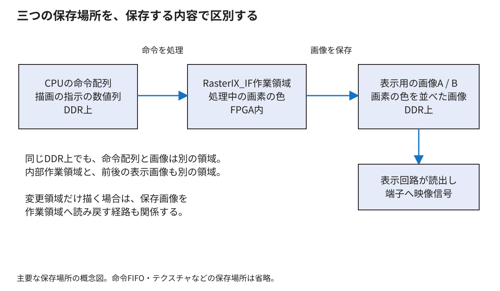
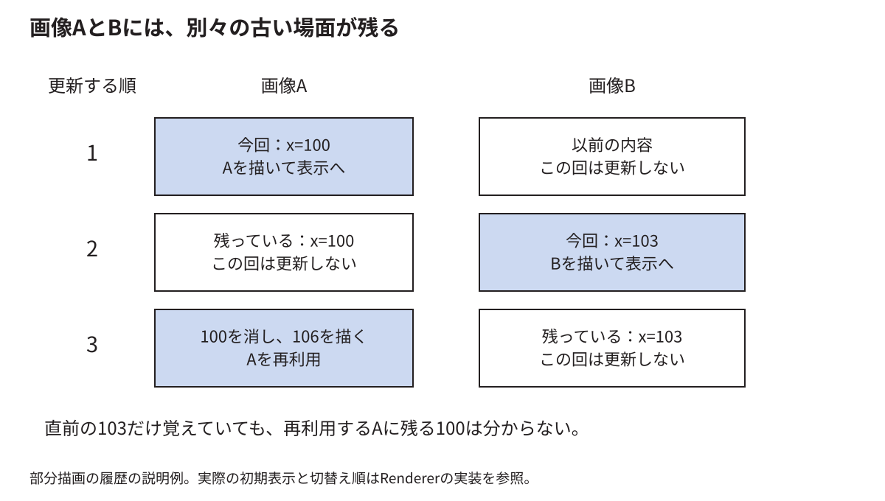

# 画像を保存して連続した映像として送り出す

[分野別の入口](README.md) · [用語を調べる](glossary.md)

描画した画像は、メモリへ保存しただけでは画面に現れない。表示回路が決まった時刻に画素を読み出し、映像の形式へ変換して送る必要がある。ここでは内部作業領域、二枚の表示用画像、部分描画、画面切替の関係を追う。

<!-- technical-toc:start -->
**このページの目次**

- [1 横幅と画素の大きさから番地を作る](#sec-1)
- [2 内部作業領域はフロントとバックの第三の場所](#sec-2)
- [3 内部領域が一画面より小さいとき](#sec-3)
- [4 IFとEFの違いをメモリへのアクセスから考える](#sec-4)
- [5 一枚だけで描画と表示を同時に行う場合](#sec-5)
- [6 AとBの名前より所有者を考える](#sec-6)
- [7 部分描画では二枚分の過去が違う](#sec-7)
- [8 古いボールを黒く塗るだけでは足りない](#sec-8)
- [9 一部を描く前に以前の内容が必要な理由](#sec-9)
- [10 表示回路はゲームの更新を待ち続けられない](#sec-10)
- [11 切替要求と古い読出しの完了](#sec-11)
- [12 色が正しくても形が横長になる場合](#sec-12)
- [13 HDMI端子と映像の送り方](#sec-13)
- [14 表示を含めて正しさを確かめる](#sec-14)
<!-- technical-toc:end -->

## 1 横幅と画素の大きさから番地を作る

一画素2 byteで横640画素なら、一行は1280 byteである。画像の先頭をB、座標を(x,y)とすると、詰めて保存する説明例での先頭byte番地は`B + (y×640+x)×2`になる。

例えば(x,y)=(3,2)なら、先頭から`(2×640+3)×2=2566` byte先である。実装によっては一行の末尾に余白を含めるので、一行進むbyte数をstrideとして扱う。一画素2 byteなら式は`B + y×stride + x×2`になる。ここでstrideはすでにbyte単位なので、さらに2倍しない。

640×480のRGB565画像一枚は614,400 byteである。二枚なら1,228,800 byteになる。これにテクスチャ、命令配列、内部作業領域などの容量が別に加わる。

## 2 内部作業領域はフロントとバックの第三の場所

RasterIX_IFの内部作業領域は、画素を計算して一時的に置く場所である。DDR3の表示用画像二枚は、完成した画面を表示したり次の画面を準備したりする場所である。CPU側の命令配列は、さらに別の場所である。

従って「内部の作業領域」と「バックバッファ」を同じものだと思うと、なぜ別に読戻しや書戻しがあるか分からなくなる。この構成では、作業領域で作った画素をDDR3の画像へ反映する段階がある。

## 3 内部領域が一画面より小さいとき

内部容量は65,536画素で、一画面307,200画素より小さい。一度に全部を置けないため、複数の帯へ分けて扱う。固定版の分割数は5である。

容量だけの割算では、横640に対して102行分まで入ると計算できる。しかし、それが実装で採る各帯の高さを自動的に決めるわけではない。分割数を求める式と、画面の高さを分ける実装を読む必要がある。今回の640×480・五分割は96行ずつとなり、各帯61,440画素で容量内に収まる。[分割と命令の詳説](../thesis/技術付録.md#s_V_6)

図形が二つの帯へまたがれば、両方の処理に関係する。帯に分けるための設定や再処理が増える一方、大きな画面全体をFPGA内部へ保存しなくて済む。

## 4 IFとEFの違いをメモリへのアクセスから考える

IFは内部の作業領域を使い、部分画像を外へ反映する。EFは外部メモリの画素を扱う構成で、内部容量による画面分割の条件が変わる。その代わり外部メモリへのアクセスの遅れや競合が性能に効く場合がある。

IFの容量を増やすことと、EFへ切り替えることは同じ変更ではない。どちらが速いかはメモリ系統、描く図形、テクスチャ、回路設定による。本研究でIFを使った結果を、EFとの実測比較をした結果として説明しない。[公式の方式説明](https://github.com/ToNi3141/RasterIX/blob/9fdcf97a31b2e4247594e06d605871980cd5e9e1/design.md)

## 5 一枚だけで描画と表示を同時に行う場合

表示回路が上から下へ画素を読んでいる最中に、同じ画像を次の場面へ書き換えるとする。上半分は古い位置のボール、下半分は新しい位置のボールという、一枚の中に二つの時刻が混ざることがある。これがtearingの一因である。

二枚を用意すれば、表示中のAを読む間にBを描き、表示の切替時点でBを使い始める設計にできる。ただし「二枚確保した」だけでは不足で、いつ切り替え、いつ古いAを再利用するかを決める必要がある。

## 6 AとBの名前より所有者を考える

ある時点でAが表示中、Bが描画中だとしても、切り替わった後はBが表示中、Aが次の描画先になる。front/backは役割の名前であり、常に同じ物理番地を指す名前とは限らない。

ソフトウェアは、次の描画先が何番地で、その場所に前回何を描いたかを把握する必要がある。最後に画面へ表示した場面だけを覚えればよいとは限らない。

## 7 部分描画では二枚分の過去が違う

三つの時刻で、ボールの位置を100、103、106とする。Aへ100を描き、次にBへ103を描き、次にAへ106を描く。Aに残っている古いボールは100である。直前に表示したBの103だけを消しても、Aの100は残る。

このため、固定版のRendererは二つの履歴を持つ。`drawn % 2`で対応する履歴を選び、その画像に残っている場面と今回の場面を比べる。起動直後は初期表示とライブラリの切替順に合わせて三回全体を描く。この「三回」は、二重バッファならどんな実装でも必要な一般則ではない。[Rendererの実装](https://github.com/SoshiroFujimori/wally-game-console/blob/cdf907bc1752b0f300e4fc70b9a51b2bae983b7f/examples/rasterix/BreakoutRenderer.hpp)

## 8 古いボールを黒く塗るだけでは足りない

古いボールの下に壁があったとする。ボールの四角を黒で消すと、壁の一部も消える。そこで、消す領域に重なる現在の物体を調べ、元の順序で描き直す必要がある。

物体全体を描き直すために領域を広げると、さらに別の物体へ重なる場合がある。固定版の[BreakoutDamage.hpp](https://github.com/SoshiroFujimori/wally-game-console/blob/cdf907bc1752b0f300e4fc70b9a51b2bae983b7f/examples/rasterix/BreakoutDamage.hpp)は、影響範囲と対象が増えなくなるまで確認を繰り返す。

この処理は「変更した場所だけなら何でも高速」という話ではない。広い範囲へ影響が広がる場面では、結局多くを描き直す。影響範囲を調べるCPUの仕事も増える。全体描画と同じ画素になることを先に確かめ、時間を別に測る。

## 9 一部を描く前に以前の内容が必要な理由

内部作業領域は、前に別の帯を描いた内容を持っているかもしれない。今回変更しない画素を残したいなら、対応するDDR3の画像を内部へ読み戻すなどして、正しい以前の内容を用意する必要がある。

全体を塗り直す場合は、消去色で初期化してから全部描けばよい。しかし一部だけ描く場合は、何も描かない画素にも正しい値が必要である。「描画しない」は「その内容が自動的に正しい」という意味ではない。

内部作業領域の初期化の不備と、二枚の画像の履歴の取り違えは、別の不具合として切り分ける。

## 10 表示回路はゲームの更新を待ち続けられない

表示回路は、選んだ映像モードの周期に合わせて画素と同期情報を送る。同じ画像が保存されたままでも、繰り返し送る必要がある。CPUのゲーム更新が毎秒10回でも、映像信号を毎秒約60画面の周期で送る構成はあり得る。

この場合、新しいゲーム状態は10回だが、同じ画像が複数回表示される。映像の走査周期、ソフトウェアの状態更新回数、表示用画像の切替回数は別の値である。

## 11 切替要求と古い読出しの完了

表示先の番地をBへ変えた瞬間に、Aへの未完了のメモリ読出しが一つも残っていないとは限らない。すでに要求を出したデータが後から戻る場合があるからである。

古い画像を上書きしてよい時点を知らせるには、新しい表示の選択と、残っている取引の扱いまで設計する必要がある。固定版の表示接続の詳細は[本文10章](../thesis/本文.md#ch_10)と[付録V](../thesis/技術付録.md#ch_V)へつながる。

`FRAME_COUNT`の増加は、その回路が定義した表示切替完了の通知を数える。モニターの光を測った回数や、キャプチャの異なる画像の枚数を直接数えているわけではない。

## 12 色が正しくても形が横長になる場合

640×480は4:3の画面である。それを1920×1080の領域いっぱいへ別々の倍率で伸ばすと、横は3倍、縦は2.25倍になる。正方形は横長になる。描画回路の頂点計算が間違っている場合とは別の原因である。

4:3を保って1080の高さへ拡大すれば、幅は1440になり、1920との差480を左右240ずつ余白にできる。画像保存前の画素数、映像出力のモード、受信後の拡大設定を分けて調べる。

## 13 HDMI端子と映像の送り方

端子の形がHDMIであっても、送る内容が映像のみのDVI互換形式か、付加情報を含むHDMI形式かで違いがある。受信機器の対応によって、同じ端子でも認識結果が変わる場合がある。

本研究では標準の製品構成と実験用の表示経路を区別して保存している。特定の取り込み機器で認識したことだけから、すべてのディスプレイで必要な修正だとは言わない。[実験記録と検証範囲](../thesis/再現資料/実験記録/E6/report/結果と判断.md)に基づいて説明する。

## 14 表示を含めて正しさを確かめる

まず保存された画像の画素値を期待値と比べる。次に実際に送った映像で形、色、比率、切替、継続動作を見る。最後にゲーム状態の進み方や入力との関係を確かめる。

画素一致はメモリ中の内容の根拠になる。録画は受信できた経路と時間範囲の根拠になる。どちらか一方だけで、すべての経路を検証したことにはならない。この区別を保つと、表示の異常をCPU、描画、メモリ、出力、受信のどこで調べるか決めやすくなる。
