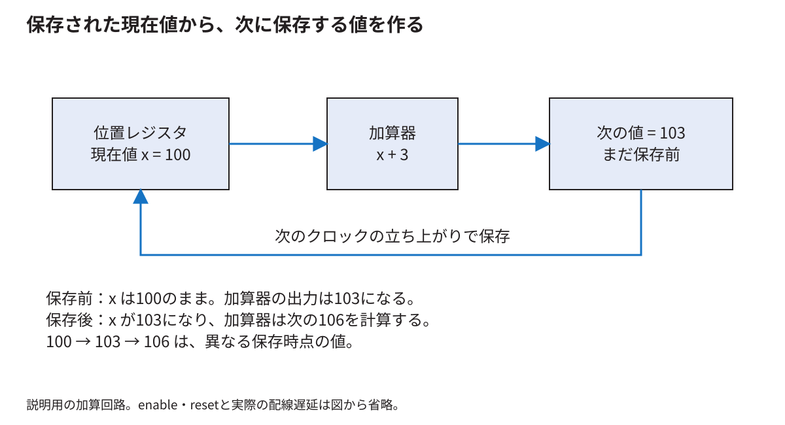

# 論理ゲートから値を覚える回路とRTLへ

[分野別の入口](README.md) · [用語を調べる](glossary.md)

この章では「ボールの横位置100に3を足し、103を保存する回路」を作る。まず値と配線を区別し、次に足す回路と覚える回路を分ける。その後でSystemVerilogを読む。コードの短さと回路の小ささが同じでない理由まで説明する。ここに示す小回路は説明用であり、Wally内部の回路をそのまま抜き出したものではない。

<!-- technical-toc:start -->
**このページの目次**

- [1 値と値を運ぶ配線は別のもの](#sec-1)
- [2 ANDゲートを知っていれば選択回路まで進める](#sec-2)
- [3 足す回路だけでは100を覚えていられない](#sec-3)
- [4 一回のクロックで何が起こるか](#sec-4)
- [5 RTLを一行ずつ回路へ戻す](#sec-5)
- [6 同じ立ち上がりでは古い値を読む](#sec-6)
- [7 保存できる範囲を超えるとどうなるか](#sec-7)
- [8 記述を短くしても回路が小さくなるとは限らない](#sec-8)
- [9 FPGAのLUTとFFとBRAMとDSP](#sec-9)
- [10 メモリの書き方を変えると何が変わるか](#sec-10)
- [11 良いRTLかどうかは三つの読み方で確かめる](#sec-11)
- [12 自分で説明して確かめる](#sec-12)
<!-- technical-toc:end -->

<a id="sec-1"></a>
## 1 値と値を運ぶ配線は別のもの

1ビットは0か1を表す。論理回路では、配線上の電圧を二つの範囲に分け、それぞれを0と1として扱う。配線が「数字の意味」を知っているわけではない。8本を一組として扱えば8ビットの値を運べる。その一組をバスと呼ぶこともある。ただし、後で扱うAPBのような「通信手順まで決まったバス」とは範囲が違う。

8ビットの`01100100`は、符号なし整数なら100である。左から128、64、32、16、8、4、2、1の重みがあり、1の位置を足すと64+32+4=100になる。同じ配線でも、色として解釈すれば色成分、命令として解釈すれば操作の指定になる。意味を決めるのは、その値を作る側と使う側の約束である。

「32ビット幅」は一度に32個の0/1を運ぶという意味である。「32個の命令を運ぶ」という意味ではない。一つの描画命令が複数の32ビット語からできていることもある。

<a id="sec-2"></a>
## 2 ANDゲートを知っていれば選択回路まで進める

ANDは両方の入力が1のとき1を出す。ORは少なくとも一方が1なら1を出し、NOTは0と1を反転する。この三つを組み合わせると、二つの入力から一方を選ぶ回路が作れる。

選択信号を`s`、候補を`a`と`b`とすると、1ビットの選択回路は次の式で表せる。

```text
y = (a AND NOT s) OR (b AND s)
```

`s=0`なら後半が0になって`a`が残る。`s=1`なら前半が0になって`b`が残る。これをマルチプレクサ、略してMUXという。8ビットを選ぶには、各ビットについて同じ選択を行う。HDLでは`assign y = s ? b : a;`と書ける。短い一行の後ろに、複数ビット分の選択回路がある。

CPUで「足し算の結果を使うか、メモリから読んだ値を使うか」を選ぶ場面にも、後で説明するFIFOで「値を更新するか、今の値を保つか」を選ぶ場面にも、この考え方が現れる。

<a id="sec-3"></a>
## 3 足す回路だけでは100を覚えていられない

加算器に100と3を入れると、しばらくして103が出る。入力を200と3へ変えれば、出力も203へ変わる。加算器は、前に100が入っていたことを覚えていない。このように現在の入力から出力が決まる回路を組合せ回路という。

ゲームには「現在の位置」を次の更新まで保つ場所が要る。その役割を持つのがレジスタである。ここでは9ビットの位置を保存するものとする。9ビットなら0〜511を表せる。



図では、位置レジスタの出力を加算器へ入れる。加算器は「今の位置+3」を作る。その結果をすぐ現在値へ戻し続けるのではなく、次のクロックの立ち上がりでレジスタに保存する。クロックは、保存する時点をそろえるための周期的な信号である。

<a id="sec-4"></a>
## 4 一回のクロックで何が起こるか

最初に位置レジスタが100を持っているとする。加算器の出力は103に落ち着く。次の立ち上がりで103を保存する。保存した出力が103に変わると、加算器は106を計算する。その106を保存するのは、さらに次の立ち上がりである。

| 時点 | 位置レジスタに保存された値 | 加算器が次に用意する値 |
|---|---:|---:|
| 初期状態 | 100 | 103 |
| 1回目の立ち上がり後 | 103 | 106 |
| 2回目の立ち上がり後 | 106 | 109 |

表は、各信号が落ち着いた時点の値を示す。現実には保存後の出力変化にも加算にも時間がかかる。したがって「立ち上がり後」のすべてが同時に瞬間変化する図ではない。この遅延を次の周期までに収める問題を[タイミングの章](timing-fpga.md)で扱う。

<a id="sec-5"></a>
## 5 RTLを一行ずつ回路へ戻す

```systemverilog
logic [8:0] position;
logic [8:0] next_position;

assign next_position = position + 9'd3;

always_ff @(posedge clk) begin
  if (reset)
    position <= 9'd100;
  else if (step)
    position <= next_position;
end
```

`logic [8:0]`は9ビットの信号を宣言する。`logic`という単語だけでは、値を覚える回路かどうかは決まらない。`next_position`は加算器の出力に相当し、`position`はクロックで更新されるレジスタに相当する。使い方が回路を決める。

`9'd3`は「9ビット幅、十進数の3」である。幅を明示することで、どこまでを計算し保存するかを読み取りやすくする。

`assign`はCPUが順に実行する命令ではない。入力が変われば、組合せ回路の出力も変わる関係を記述する。`always_ff @(posedge clk)`は、クロックの立ち上がりでレジスタが更新されることを記述する。

`reset`が1なら100を保存する。その場合は`step`が1でも100である。`reset`が0で`step`が1なら次の位置を保存する。どちらでもなければ`position`は変わらない。最後の`else`がなくても、このクロック付きの記述では「保持」という意味になる。

この`step`を毎クロック1にすると、20 MHzなら1秒間に最大2千万回位置を変える。ゲームを毎秒60回更新する用途では、更新の許可を出す頻度を別に決める必要がある。CPUのクロックとゲームの更新周期は別物である。

<a id="sec-6"></a>
## 6 同じ立ち上がりでは古い値を読む

```systemverilog
always_ff @(posedge clk) begin
  a <= input_data;
  b <= a;
end
```

立ち上がり直前に`a=10`、`b=5`、`input_data=20`だったとする。立ち上がり後は`a=20`、`b=10`になる。`b=20`ではない。右辺を古い値で評価してから、各保存先を更新するためである。

この動きが二段のパイプラインである。二つの保存場所が同時に更新されるから、入力が二段を一気に通り抜けるのではない。各段が一つ前の値を受け取る。

クロック付きの更新には通常`<=`を使い、組合せ計算には`=`を使う。単なる見た目の好みではない。シミュレーション上の評価順を、意図したレジスタの同時更新へ合わせるための書き方である。[Wallyの実際のenable付きレジスタ](https://github.com/SoshiroFujimori/wally-game-console/blob/cdf907bc1752b0f300e4fc70b9a51b2bae983b7f/src/generic/flop/flopenr.sv)でも、この形を確認できる。

<a id="sec-7"></a>
## 7 保存できる範囲を超えるとどうなるか

9ビットの符号なし値の最大は511である。510+3は数学では513だが、9ビットだけ保存すると下位9ビットの1になる。512で一周するためである。「画面の端を超えたら跳ね返る」は加算器が自動で行う動作ではない。比較と向きの変更を別に実装する。

桁上がりも確認したい場合は、計算する前に幅を一つ増やす。

```systemverilog
logic [9:0] sum;
assign sum = {1'b0, position} + 10'd3;
```

`{1'b0, position}`は、位置の左へ0を一つ付けた10ビットの値である。`sum[9]`を見ると、9ビットの範囲を超えたか分かる。右辺の途中で値を失ってから、左辺だけ広げても取り戻せない場合があるので、式の途中の幅まで見る。

符号付きの8ビットでは、`11111111`は-1を表す。同じビット列でも符号なしなら255である。比較、右シフト、幅の拡張で結果が変わる。座標に負の値を使うときは、変数だけでなく定数と中間式も含めてsigned/unsignedをそろえる。

<a id="sec-8"></a>
## 8 記述を短くしても回路が小さくなるとは限らない

四つの入力をすべて同時に足す記述は、複数の加算器を必要とする可能性がある。一つの加算器を四回使い回したいなら、途中の合計、何番目を足すか、完了したかを保存する仕組みが必要になる。

| 実現したいこと | 必要になる構造 | 主な代償 |
|---|---|---|
| 一度に四つを足す | 加算器を並べた組合せ回路 | 論理量や遅延が増える |
| 数周期かけて足す | 加算器、途中値、選択回路、状態管理 | 完了までの周期数が増える |
| 毎周期新しい四入力を受ける | 段間レジスタを持つ加算木など | レジスタと結果の遅延が増える |

HDLの`for`文も、静的な回数なら同種の回路を並べる記述になり得る。C言語のループのように一個の演算器を順番に使うとは限らない。共有したいなら「次の周期まで何を覚えるか」を設計する。

<a id="sec-9"></a>
## 9 FPGAのLUTとFFとBRAMとDSP

LUTは、小さな入力の組合せに対してどの出力を出すかを設定できる部品である。例えば二入力ANDなら、00→0、01→0、10→0、11→1という対応を保存すればよい。大きな回路は多数のLUTと配線を組み合わせて実現する。

FFは通常1ビットをクロックで保存する部品である。32ビットのレジスタには、概念上32ビット分の保存が要る。BRAMはまとまった容量を持つ専用のメモリ資源である。DSPは乗算や加算などを効率よく実現する専用の演算資源である。

HDLの配列が必ずBRAMになるわけではない。読出しを同じ瞬間に何個要求するか、クロックで読むか、全要素を同時にリセットするか、といった仕様が専用メモリに合う必要がある。合成ツールは要求と資源が合わなければLUTやFFで作ることがある。[AMDのRAM記述指針](https://docs.amd.com/r/en-US/ug901-vivado-synthesis/RAM-HDL-Coding-Techniques)は、どの記述がメモリ資源へ対応するかを確認する一次資料である。

<a id="sec-10"></a>
## 10 メモリの書き方を変えると何が変わるか

```systemverilog
logic [31:0] mem [0:255];

always_ff @(posedge clk) begin
  if (write_enable)
    mem[address] <= write_data;
  read_data <= mem[address];
end
```

この例では、アドレスで選んだ32ビットをクロックで読む。読出し要求と値を利用する時点の間に周期がある。プログラム配列のように「添字を書けば時間を考えずすぐ読める」とは扱えない。同じアドレスへ読み書きする場合の出力が古い値か新しい値かも、要求する動作と合成されたメモリ設定を確認する。

全256要素をリセット時に同時に0へするループを追加すると、専用BRAMの端子でその動きを直接実現できない場合がある。メモリ本体を逐次初期化する方法や、有効情報だけを初期化して未使用の内容を読まない方法を検討する。後者では、未初期化の内容が外へ出ないことが条件になる。

<a id="sec-11"></a>
## 11 良いRTLかどうかは三つの読み方で確かめる

まず、書いた人の意図をコードだけから追えるかを確認する。値を覚える場所、更新条件、幅、リセット値が見えることが必要である。次に、シミュレーションで入力を変え、各周期の値が意図どおりかを確認する。最後に、合成後の資源とタイミングを見て、望んだ部品と速度になったかを確認する。

例えば「BRAMを使いたい」なら、配列を書いて終わりではない。合成結果のBRAM数と読出しの周期を確認する。「速くしたい」なら、演算子を減らすだけではなく、最も遅い経路がどこへ移ったかを見る。コードの規則と測定結果を行き来できることが、RTLを設計する理解である。

<a id="sec-12"></a>
## 12 自分で説明して確かめる

問1。`a <= input_data; b <= a;`で、`b`はいつ新しい入力を受け取るか。答えは、入力を`a`が保存した次の立ち上がりである。ただし、その間にリセットや停止がない場合とする。

問2。9ビットの510へ3を足して9ビットへ保存すると何になるか。答えは1である。513の最下位9ビットが残る。境界で跳ね返すには別の条件処理が必要である。

問3。メモリ配列の全要素を同時に初期化する記述が、なぜ資源を増やすことがあるか。答えは、専用メモリが持つ少数の端子では要求された同時書込みを実現できず、別の構造が必要になるためである。

実際のWallyの書式や抽象化階層は[技術付録第I部](../thesis/技術付録.md#part_I)、次の立ち上がりまでに計算を終える条件は[クロックとFPGA実装](timing-fpga.md)へ進む。
