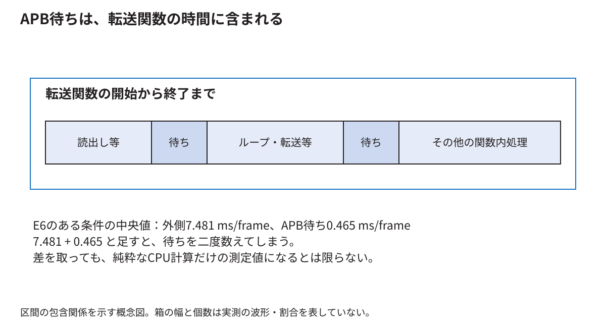

# 測定した時間から性能と設計の判断へ進む

[分野別の入口](README.md) · [用語を調べる](glossary.md)

測定の目的は、数字を増やすことではなく「何を変えると、何の仕事が、どれくらい変わるか」を確かめることである。ここでは、既存のE6データを小さな計算へ分解する。今回の文書増補で新しい実機測定を行ったという意味ではない。

<!-- technical-toc:start -->
**このページの目次**

- [1 1フレームという言葉を定義する](#sec-1)
- [2 1回の処理を仕事の区間に分ける](#sec-2)
- [3 重なった時間を足してはいけない](#sec-3)
- [4 回路の周期数をミリ秒へ直す](#sec-4)
- [5 時計の単位と測定の精度](#sec-5)
- [6 比較でそろえるものには理由がある](#sec-6)
- [7 同じ実行ファイルから方式を選ぶ理由](#sec-7)
- [8 90回と16,200フレームを区別する](#sec-8)
- [9 中央値を求める手順](#sec-9)
- [10 保存済みデータを自分で再集計する](#sec-10)
- [11 FIFOの効果と画面更新の効果](#sec-11)
- [12 上限を考えるための簡単な計算](#sec-12)
- [13 ボトルネックを言葉だけで決めない](#sec-13)
- [14 正しい結果かを性能と一緒に確かめる](#sec-14)
<!-- technical-toc:end -->

<a id="sec-1"></a>
## 1 1フレームという言葉を定義する

ゲーム状態を一回更新すること、画像を一回作ること、表示画像を一回切り替えること、映像信号が画面一枚分進むことは違う。どれを数えたかを最初に決める。

E6の性能表は表示切替の完了回数を経過時間で割った値を扱う。録画した異なる画面の枚数を数えた値ではない。1秒間に何回という単位が同じでも、測定対象が違えば比較する意味も変わる。

<a id="sec-2"></a>
## 2 1回の処理を仕事の区間に分ける

ゲームの状態更新、描画命令の準備、命令の転送、表示切替の完了待ちを考える。開始と終了のどこで時計を読むかをコードへ対応付ける。

例えば転送関数の中でCPUがRAMを読み、APBへ書き、その途中でAPBが待たされるなら、転送関数の経過時間にはAPB待ちが含まれる。「CPUの準備時間」「GPUの計算時間」という名前を付けただけで、物理的に完全分離して測れているわけではない。



<a id="sec-3"></a>
## 3 重なった時間を足してはいけない

E6の初期状態・全体描画・512語FIFOでは、送信処理全体の中央値が7.481 ms/frame、その中のAPB待ちが0.465 ms/frameだった。合計を7.946 ms/frameとするのは、同じ待ちを二度数えてしまう。

差の7.016 ms/frameも、ただちに純粋な計算時間とは呼べない。関数にはループ、load/store、その他の待ちや計測処理が含まれ得る。また、別々に中央値を取った値の差は、各試行の差の中央値と一般には同じでない。ここでは区間の包含関係を理解するために引算を示した。[元の表](../thesis/再現資料/実験記録/E6/report/結果と判断.md)

<a id="sec-4"></a>
## 4 回路の周期数をミリ秒へ直す

CPU側が20 MHzなら、1周期は50 nsである。APB待ちをW周期数え、180フレーム分の合計だったとする。

```text
1フレーム当たりの待ち時間[ms]
  = W ÷ 20,000,000 × 1000 ÷ 180
```

説明用にW=360,000なら、合計18 ms、1フレーム当たり0.1 msになる。回路カウンタは時計の読み取り時刻の差より細かく条件を絞れるが、何を数える論理にしたかが重要である。

本実験の待ちカウンタは、命令書込みのアクセス段階でreadyが0の周期を数える。準備段階、別の周辺機器へのアクセス、命令作成中の全時間は含めない。

<a id="sec-5"></a>
## 5 時計の単位と測定の精度

ナノ秒という単位で値を表示しても、実際に1 nsの差を正しく測れるとは限らない。時計の刻み、読取り処理の時間、OSによる実行の中断などが関係する。

短過ぎる処理なら、同じ処理を複数回行った合計を測る方法がある。ただし、繰返しによってキャッシュが温まるなど条件が変わる。どの条件の費用を知りたいかを決めてから測る。

計測処理そのものが動作を変えるため、ログを大量に出す版と通常版の速度を無条件で同一視しない。今回は保存された計測用コードとカウンタの条件を結果と組にして残す。

<a id="sec-6"></a>
## 6 比較でそろえるものには理由がある

FIFO容量の効果を知りたいなら、CPUの周波数やゲーム場面も同時に変えると、差の原因を分けにくい。同じ開始状態、同じ入力列、同じ描画方式、同じ実行ファイルなどをそろえる。

これは「絶対に一つの数値しか変えてはいけない」という形式的な規則ではない。FIFOを変えれば配置や配線も変わり得る。どの差を意図し、どの共通条件を確認したかを記録し、残る違いも含めて実装方式として評価する。

<a id="sec-7"></a>
## 7 同じ実行ファイルから方式を選ぶ理由

方式ごとに別ビルドすると、コンパイラ設定やライブラリ版まで違っていたという混乱が起こり得る。同じ実行ファイルの引数で描画方式を選べば、そうした差を減らせる。

それでも実行する分岐、コードの位置、キャッシュの使い方などは変わり得る。従って、測っているのはその方式として実装したプログラムの差である。「図形一個の純粋な物理コスト」だけを抽出したとは限らない。

<a id="sec-8"></a>
## 8 90回と16,200フレームを区別する

E6は、3接続×3開始状態×3描画方式×3繰返しで81回。生成済み命令の再送を各接続3回ずつ行って9回。合わせて90回である。各回で180フレームを記録したので16,200フレームになる。

16,200フレームが、16,200回の独立した電源投入を意味するわけではない。同じ起動内の連続するフレームは、場面やキャッシュなどを共有する。繰返しの単位を説明しないと、結果の安定性を過大に見せてしまう。

再書込み後の18回の補助比較は別に保存されている。これも物理的な電源の入切を繰り返した試験とは区別している。

<a id="sec-9"></a>
## 9 中央値を求める手順

三回の結果が4.2、4.4、4.9 msなら、小さい順の真ん中4.4 msが中央値である。平均は4.5 msになる。どちらも意味があるが、違う値なので表で明示する。

三回の最小値と最大値を棒の両端へ描いた図は、その三回の広がりを示す。母集団の信頼区間を自動的に表すわけではない。小さい差を見て統計的な優劣を断定するには、そのための試行設計と分析がさらに必要になる。

<a id="sec-10"></a>
## 10 保存済みデータを自分で再集計する

研究リポジトリのルートで次を実行すると、ハードウェアを操作せずに、E6の主比較の待ち時間を再計算できる。

```sh
cd docs/thesis/再現資料/実験記録/E6
python3 recalculate_wait.py
```

期待する表示は`mailbox 4.393`、`fifo16 2.254`、`fifo512 0.465 ms/frame`である。スクリプトは`report/results/runs.csv`の90行から、初期状態、全体描画、各方式の三回を選ぶ。全条件をごちゃ混ぜにした中央値ではない。

<a id="sec-11"></a>
## 11 FIFOの効果と画面更新の効果

APB待ちだけを比較すると、一語方式から512語FIFOで約89.4%減っている。計算は`(4.393-0.465)/4.393`である。これは送信待ちの減少率であり、ゲーム全体が約9倍速いという意味ではない。

同じ条件の表示切替は約11.96から14.63回/秒へ増えた。変更領域描画では約58〜60回/秒で、方式間の差は小さい。別の仕事や表示周期が残るため、一部が速くなっても全体が同じ割合で速くなるとは限らない。

<a id="sec-12"></a>
## 12 上限を考えるための簡単な計算

説明用に、全時間の40%を占める部分を完全に0へできたとしても、残り60%は残る。全体の最大の速度向上は`1/0.6 ≈ 1.67倍`である。これはAmdahlの法則として知られる考え方の簡単な形である。

現実には処理の重なりや待ちの変化があり、表の一項目を機械的に0にして予測すれば十分というわけではない。それでも「一部の高速化率」と「全体の高速化率」を分けるために役立つ。

表示切替が周期的な境界で行われる場合、少し早く終わっても同じ境界まで待つことがある。逆に、境界へ間に合うかどうかの差で更新回数が段階的に変わる場合もある。

<a id="sec-13"></a>
## 13 ボトルネックを言葉だけで決めない

長い区間を見つけるのは出発点である。その区間の何を変えれば短くなるかを確かめると、改善可能な処理へ近づく。命令作成の回数を減らす、描く範囲を減らす、接続を変えるなど、問いに合う比較を行う。

本E6のカウンタは「APBが命令書込みを待たせた時間」を示すが、各停止を描画計算、メモリ競合、表示同期へ完全に分類するものではない。分かっていない内訳を、数値の精密さで埋めたことにはしない。

<a id="sec-14"></a>
## 14 正しい結果かを性能と一緒に確かめる

処理を省けば速くなるが、ボールや文字が消えたら同じゲーム画面を作った比較にならない。E6では各条件の画面比較、転送語数、ゲーム状態の列などを対応付けた。

実装の採用理由は「この条件で正しい画像が得られ、待ちが減り、資源とタイミングも許容された」と説明する。それを「全条件で最善」と拡大しない。残る不一致と未検証の条件は、同じ結果の一部として保持する。
