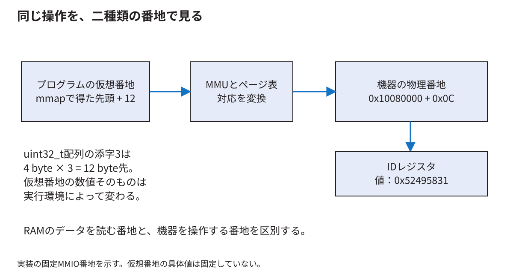

# 番地とメモリとバスを混同せずに追う

[分野別の入口](README.md) · [用語を調べる](glossary.md)

メモリという言葉には、CPUの作業用RAM、キャッシュ、画像の保存場所、回路内部の小さな保存場所が含まれる。番地にも複数の種類がある。この章では「誰が、何番地として、どの保存場所を読むか」を明確にする。

<!-- technical-toc:start -->
**このページの目次**

- [1 byte番地と32ビット語](#sec-1)
- [2 同じstoreでもRAMとMMIOでは効果が違う](#sec-2)
- [3 物理番地は行き先を選ぶ](#sec-3)
- [4 仮想番地はプログラムから見える番地](#sec-4)
- [5 TLBはデータそのものを保存するキャッシュではない](#sec-5)
- [6 キャッシュが保存するまとまり](#sec-6)
- [7 書いた値がまだDDR3へ届いていない場合](#sec-7)
- [8 このゲーム機にある三種類の保存場所](#sec-8)
- [9 共有DDR3にも同時アクセスの調整が要る](#sec-9)
- [10 DDR3の幅と回路内の幅](#sec-10)
- [11 予約領域と番地の見え方](#sec-11)
- [12 ここまで理解したか確認する](#sec-12)
<!-- technical-toc:end -->

<a id="sec-1"></a>
## 1 byte番地と32ビット語

ここで扱うCPUの通常の番地はbyte単位である。32ビットは4 byteなので、32ビットの配列の隣の要素は4番地先になる。

```text
uint32_tの配列の先頭が 0x1000 の場合
要素0: 0x1000〜0x1003
要素1: 0x1004〜0x1007
要素2: 0x1008〜0x100b
```

C++で`uint32_t* p`に対して`p[3]`と書くと、先頭から3 byte先ではなく12 byte先を読む。本研究の`regs[3]`がオフセット`0x0c`のIDを読む理由はこれである。

リトルエンディアンでは`0x12345678`を通常のメモリへ保存すると、低い番地から`78 56 34 12`というbyte列になる。値の桁の順序と、番地を小さい方から読む順序を混同しない。32ビットloadで読み戻せば元の値として扱える。

<a id="sec-2"></a>
## 2 同じstoreでもRAMとMMIOでは効果が違う

RAMへの書込みは、その番地の内容を置き換える。MMIOへの書込みは、周辺機器へ操作を依頼する場合がある。RasterIXの命令口へA、B、Cを同じ番地で連続して書くと、三つの語を順に渡す。最後のCだけが変数として残ればよい、という契約ではない。

読出しにも副作用がある。通常のRAMを二度読んでも同じ内容が得られる場合が多いが、応答FIFOの出口を二度読めば、二つの語を消費する場合がある。本構成の`RESP`はその種類の入口である。デバッグのための追加の読出しが動作を変える理由になる。

<a id="sec-3"></a>
## 3 物理番地は行き先を選ぶ

CPUの外へ出た番地を、番地選択回路が調べる。DDR3の範囲ならメモリの経路へ、UARTの範囲ならUARTへ、RasterIXの範囲なら追加の周辺回路へ送る。物理番地という言葉は、実際の配置場所の何mm先を指すという意味ではない。SoC内で取引先を選ぶ番号である。

[Wallyのuncore.sv](https://github.com/SoshiroFujimori/wally-game-console/blob/cdf907bc1752b0f300e4fc70b9a51b2bae983b7f/src/uncore/uncore.sv)で、選択信号、読出し値の戻し方、完了信号のまとめ方を読む。番地を追加したら、重複する範囲がないか、未選択時に止まり続けないか、リセット中はどうなるかまで確認する。

<a id="sec-4"></a>
## 4 仮想番地はプログラムから見える番地

Linux上のプロセスは、通常、仮想番地を使う。MMUはページテーブルなどに基づいて、仮想番地を物理番地へ変換し、アクセス権も確認する。プログラムが`0x10080000`という整数をポインタにしただけでは、同じ物理番地を必ず操作できるわけではない。



説明用に4 KiBページを考える。仮想番地`0x40001234`が属するページを物理ページ`0x90002000`へ対応付けたなら、ページ内の`0x234`を保って物理番地`0x90002234`になる。実機の特定プロセスでこの対応が使われたという値ではない。

ページは4096 byte、キャッシュラインは別の単位、RasterIXのテクスチャページも別の単位である。「ページ」という名前が同じでも、管理する主体が違う。

<a id="sec-5"></a>
## 5 TLBはデータそのものを保存するキャッシュではない

ページテーブルを毎回たどると、番地変換のためにさらにメモリを読む必要がある。TLBは、最近の番地変換と権限の情報を保存して、その手間を減らす。

データキャッシュは実際のデータの写しを保存する。TLBには「仮想ページVは物理ページPに対応する」といった情報、データキャッシュには「その場所には値Dがある」という情報がある。TLBミスとデータキャッシュミスは原因も処理も異なる。

ページテーブルを書き換えたとき、古いTLBの対応が残る問題がある。RISC-Vの`SFENCE.VMA`はこの種の番地変換の順序・同期に関係する。一般のI/O順序を扱う`FENCE`と同じ命令ではない。[RISC-V supervisor仕様](https://docs.riscv.org/reference/isa/priv/supervisor.html)

<a id="sec-6"></a>
## 6 キャッシュが保存するまとまり

説明用に「64 byteのライン、4個のセット、各セットに1ライン」の小さな直接マップキャッシュを考える。これはWallyの今回の実設定ではない。

番地`0x120`を64で割ると、ライン番号4、ライン内の位置32になる。ライン番号4を4セットで割った余りは0なのでセット0に入る。番地`0x220`もセット0に入るが、別のラインである。両方を交互に読むと、容量が空いて見えても同じセットで追い出しが起こり得る。

tagは、そのセットにどのラインが入っているかを区別する情報である。validはその内容を使ってよいか、dirtyは書き戻す必要のある変更があるかを表す。データ配列だけ見てもキャッシュの動作全体は分からない。

<a id="sec-7"></a>
## 7 書いた値がまだDDR3へ届いていない場合

書戻し型のキャッシュでは、CPUが値を書いた後、最新値がキャッシュだけにあり、DDR3は以前の値を持っている期間があり得る。CPU自身は最新値を読めても、別の機器がDDR3を直接読むと古い値を見る問題が起こり得る。

これがDMAなどで共有メモリを扱うときの整合性の問題である。順序を守る命令を置くだけで、必要な書戻しや無効化まで自動的に行われるとは限らない。一般のLinuxドライバでは、適切なDMA APIとその所有権の規則を使う。[Linux DMA mapping guide](https://docs.kernel.org/core-api/dma-api-howto.html)

今回のCPU側命令配列は、Wallyが普通のRAMから読み、MMIOへ一語ずつコピーする経路である。RasterIXがそのC++配列の仮想ポインタを直接DMA読出しする経路ではない。将来DMAへ変更するなら、この前提が変わる。

<a id="sec-8"></a>
## 8 このゲーム機にある三種類の保存場所

| 保存するもの | 主に書く主体 | 次に読む主体 | 役割 |
|---|---|---|---|
| CPU側の描画命令配列 | CPU上の描画ライブラリ | CPU上の転送コード | 回路へ渡す数値列を用意する |
| RasterIX_IFの内部作業領域 | RasterIXの画素処理 | 書戻しや後続の画素処理 | 一部の画面を描く |
| DDR3の表示用画像 | RasterIXなどのメモリ書込み経路 | 表示回路 | 画面へ繰り返し送る画像を保存する |

このほかに命令FIFO、応答FIFO、テクスチャなどもある。名前にbufferが付くからといって、同じ内容を同じ場所へ重複して保存しているわけではない。どの主体が何をいつまで持つかで分類する。

<a id="sec-9"></a>
## 9 共有DDR3にも同時アクセスの調整が要る

CPUはプログラムとデータを読み書きし、RasterIXはテクスチャや描画先を読み書きし、表示回路は画面の画素を読む。全員が同時に要求できても、DDR3の端子やコントローラの処理能力は有限である。仲介する回路が要求を選び、必要に応じて待たせる。

AXIでは読出し要求、読出しデータ、書込み番地、書込みデータ、書込み応答を別のチャネルで扱う。一つのreadyだけ見て、すべての要求が完了したと解釈しない。番地を受け付けた後、データが戻るまで複数周期かかり、その間にも別の要求を扱える実装がある。

表示用の次の画素が時間に間に合わないと、画面の連続性に影響する。平均帯域に余裕があっても、長い停止を吸収できるかという条件が残る。

<a id="sec-10"></a>
## 10 DDR3の幅と回路内の幅

FPGA外のDDR3端子が運ぶ幅と、コントローラが回路へ見せるAXIの幅は同じとは限らない。複数の転送をまとめ、異なるクロックで扱うことで、内部では広いデータを受け渡せる。

従って「AXIが64ビットだから、基板のDDR3データ端子も64本」とは言えない。MIGの設定、外部メモリの型番と配線、内部の周波数とデータ幅を別々に確認する。[技術付録のボード対応](../thesis/技術付録.md#ch_E)は、その対応を追う入口になる。

<a id="sec-11"></a>
## 11 予約領域と番地の見え方

固定版のRasterIX用device treeは、`0x9e000000`から32 MiBを予約している。32 MiBは`0x02000000` byteなので、範囲の終端直後は`0xa0000000`である。最後のbyteの番地は`0x9fffffff`になる。

この予約は、Linuxが通常の空きRAMとしてその範囲を配ってしまうことを避けるためのものだ。予約しただけで画像が消えるわけでも、GPUとCPUのすべての整合性問題が解決するわけでもない。

CPUが見るDDR3の基準と、DDRコントローラの入力に渡すオフセットが異なることもある。本構成の[rasterix.sv](../thesis/再現資料/接続ソース/fpga/src/rasterix.sv)では、DDR要求の番地の扱いを確認できる。どの基準からのオフセットかを明示しない16進数の説明は、同じ場所を別物だと思わせやすい。

<a id="sec-12"></a>
## 12 ここまで理解したか確認する

`regs[6]`のbyteオフセットは24、すなわち`0x18`である。ただし`regs`が32ビット型のポインタの場合である。

画面用メモリと命令配列は同じではない。前者には画素の色、後者には回路への指示を表す語がある。命令数byteを画面へそのまま送れば絵になるわけではない。

仮想番地を機器へ渡してはいけない理由は、機器が同じMMUの変換を使うとは限らないためである。具体的なユーザープログラムの接続は[LinuxとMMIO](linux.md)へ進む。
