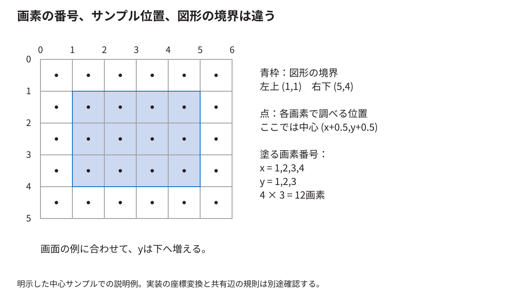

# 三角形から画素と色を求める計算

[分野別の入口](README.md) · [用語を調べる](glossary.md)

この章は、図形が画素になる途中を省略しないための数値例である。2Dの三角形を使い、内外の判定、色の補間、模様、混色を順に計算する。最初の例は原理を理解するためのもので、固定版RTLの丸め方まで完全に同一とするものではない。実装固有の数式は[付録X〜Z](../thesis/技術付録.md#ch_X)へつなぐ。

<!-- technical-toc:start -->
**このページの目次**

- [1 画素の四角と判定点を分ける](#sec-1)
- [2 三角形の内側を三本の辺で判定する](#sec-2)
- [3 一つの点を実際に計算する](#sec-3)
- [4 毎画素で掛算をし直さなくてよい理由](#sec-4)
- [5 辺の値から頂点の割合を作る](#sec-5)
- [6 四角形を二つに分けた境界](#sec-6)
- [7 固定小数点を数値から読む](#sec-7)
- [8 テクスチャ座標は模様のどこを使うか](#sec-8)
- [9 nearestと線形補間を数値で比べる](#sec-9)
- [10 文字は四角形と文字画像で作れる](#sec-10)
- [11 fragmentが最後の画素になるまで](#sec-11)
- [12 画像形式へ丸める](#sec-12)
- [13 数学とRTLと実機を別々に結ぶ](#sec-13)
<!-- technical-toc:end -->

<a id="sec-1"></a>
## 1 画素の四角と判定点を分ける

画素`(2,3)`を、xが2〜3、yが3〜4の小さな四角と考える。その中心は`(2.5,3.5)`である。画面上の連続した位置を表す座標と、整数で付けた画素番号は別である。

図形の内部かどうかを、各画素のどの点で判定するかを決める必要がある。この章の最初の説明では中心を使う。境界が判定点を通った場合の規則も後で決める。単に図形の角の数値を知るだけでは、境界画素の答えまでは定まらない。



左上`(1,1)`、右下`(5,4)`の長方形を中心判定で塗るなら、x方向は1、2、3、4、y方向は1、2、3の計12画素になる。右下の境界座標5、4を、追加の画素列5、行4まで塗るという意味にしない。

<a id="sec-2"></a>
## 2 三角形の内側を三本の辺で判定する

三角形の頂点をA=(1,1)、B=(5,1)、C=(1,4)とする。一つの辺A→Bに対して、調べる点P=(x,y)の位置を次の式で計算する。

```text
E_AB(P) = (Bx-Ax)×(y-Ay) - (By-Ay)×(x-Ax)
```

この値は、Pが辺のどちら側にあるかで符号が変わり、辺の直線上なら0になる。三本の辺の向きを一周するようにそろえ、三つとも内側の符号になっていれば三角形の内部と判定できる。

<a id="sec-3"></a>
## 3 一つの点を実際に計算する

P=(2,2)について計算すると、A→Bは`4×1-0×1=4`である。B→Cは`(-4)×1-3×(-3)=5`、C→Aは`0×(-2)-(-3)×1=3`である。三つとも正なので、この向きでは内部である。

P=(4,3)なら、B→Cの値は`(-4)×2-3×(-1)=-5`となる。一本について外側になったので三角形の外である。このように画面上の候補点を評価して、塗る場所を選ぶ。

実装では画面全部を毎回調べる必要はない。まず頂点を囲む最小の矩形などで候補を絞り、そこから辺をたどる方法を使える。本RasterIXのRTLは、辺の値と増分を使って候補を進める構造である。

<a id="sec-4"></a>
## 4 毎画素で掛算をし直さなくてよい理由

上の式でxだけ1増やすと、値の差は`-(By-Ay)`になる。yだけ1増やすと、値の差は`Bx-Ax`になる。最初の点の値と、この二つの増分を計算しておけば、隣の点へ進むたびに加算で更新できる。

辺A→Bではx方向の増分が0、y方向が4である。だから同じ高さを横へ進んでも値は変わらず、次の高さへ進むと4増える。水平な辺からの上下の関係を表していると考えると式の意味が見える。

CPU側で準備した値をRTLが増分更新する関係は、[ソフトウェアRasterizer.cpp](https://github.com/ToNi3141/RasterIX/blob/9fdcf97a31b2e4247594e06d605871980cd5e9e1/lib/gl/renderer/Rasterizer.cpp)と[RTL Rasterizer.v](https://github.com/ToNi3141/RasterIX/blob/9fdcf97a31b2e4247594e06d605871980cd5e9e1/rtl/RasterIX/Rasterizer.v)を対にして読む。

<a id="sec-5"></a>
## 5 辺の値から頂点の割合を作る

この三角形では、先ほどの三つの辺の値の合計は12である。P=(2,2)のAに対応する割合は、Aの反対側の辺B→Cから`5/12`、Bは`3/12`、Cは`4/12`となる。合計は1である。

この割合を使うと、各頂点で与えた色などを点Pで混ぜられる。Aを赤、Bを緑、Cを青とし、各成分を0〜1で表すなら、Pの色は`(5/12,3/12,4/12)`になる。全部の頂点が白なら、どの割合でも結果は白である。

この割合が重心座標、barycentric coordinatesである。言葉を覚えるだけでなく、「三頂点の値をどの割合で使うか」という役割を押さえると、色、深さ、模様の座標の補間につながる。

<a id="sec-6"></a>
## 6 四角形を二つに分けた境界

四角形を対角線で二つの三角形へ分けると、その対角線は両方の辺になる。判定点が対角線の上にあって、両方が境界を含むなら、同じ画素を二度扱う。両方が含まないなら穴ができる。

そのため、共有辺を片側にだけ所属させる規則が重要になる。不透明色を同じ色で二回書くと違いが見えにくいが、半透明なら二回混ざって違う色になる。画像が似て見えることと、処理が一回だけ行われたことは別である。

ここには実装の版による違いがある。`9fdcf97a`のRTLは三つの辺の符号ビットで判定する。一方、E6の`9269a01c`には`edge0Inclusive`などと、辺の値が0の場合を区別する処理がある。[旧版](https://github.com/ToNi3141/RasterIX/blob/9fdcf97a31b2e4247594e06d605871980cd5e9e1/rtl/RasterIX/Rasterizer.v)、[E6版](https://github.com/ToNi3141/RasterIX/blob/9269a01c9bd4c3342bfa70ef8e3cdd751c15c6d0/rtl/RasterIX/Rasterizer.v)

従って、旧版についての「共有辺を二度扱う」説明を、更新版へ無条件に当てはめてはいけない。関数名が同じでも、使うコミットを確認する。境界の包括・除外、丸め、座標変換は一組で検証する。

<a id="sec-7"></a>
## 7 固定小数点を数値から読む

小数を整数で表す方法を考える。実数を32倍して整数にすれば、小数点以下5ビット分の細かさで表せる。1.5は48、2.25は72になる。足すと120で、32で戻すと3.75になる。

掛算は倍率も掛かる。48×72=3456は32倍ではなく1024倍の結果なので、同じ32倍の形式へ戻すには32で割って108にする。108/32=3.375であり、1.5×2.25と一致する。

割り切れない値では、切捨てか丸めかを決める必要がある。負の値の右シフト、飽和させるか一周させるか、中間結果に何ビット確保するかでも変わる。`float`を使わないというだけでは数値の意味は定まらない。

RasterIXの各属性がすべてこの32倍の形式という意味ではない。上の倍率は小さな説明例である。実際の各値のビット幅と倍率は[付録Y](../thesis/技術付録.md#ch_Y)と定義を対応付ける。

<a id="sec-8"></a>
## 8 テクスチャ座標は模様のどこを使うか

テクスチャは画素の色を選ぶために使う画像である。画面上の位置(x,y)と、模様の中の位置(u,v)は別である。一つの四角形へ模様全体を貼るなら、四隅へ模様の四隅に対応する座標を与える。模様の一部を使うなら、その部分の座標を与える。

画面上の幅を二倍にしても、同じu,v範囲を使えば、同じ模様が横に二倍へ広がる。u,v範囲だけ変えれば、画面上の大きさを保ったまま使う模様の範囲を変えられる。

RasterIXでは、頂点から各画素での模様の座標を求め、Texture Mapping Unitが対応する模様の値を読む。模様の位置を「図形と組み合わせる」とは、この対応付けを各画素へ広げることである。

<a id="sec-9"></a>
## 9 nearestと線形補間を数値で比べる

隣り合う模様の明るさが0と100で、その間の左から25%の位置を読むとする。近い方を一つ選ぶ方法なら0を選ぶ。二つを距離で混ぜる線形補間なら`0×0.75+100×0.25=25`になる。

二次元では、周囲の四つを縦横の割合で混ぜる方法がある。滑らかになる一方、ピクセルの境目をくっきり見せたい文字などでは、nearestが目的に合う場合がある。どちらが「正しい」かは設定と目的による。

模様の外へ出た座標を端へ固定するか、繰り返すかも別の設定である。ぼけ、端の線、模様のずれを調べるときは、座標、フィルタ、範囲外処理、画像形式を一度に変えずに確認する。

<a id="sec-10"></a>
## 10 文字は四角形と文字画像で作れる

本ゲームでは、小さな文字をまとめた画像を用意し、その中の一文字に対応するu,v範囲を四角形へ貼る。文字の線に相当する場所はalphaを持ち、背景の部分は透明にする。

例えば字形が8×8の区画に入っていて、画面では16×16に表示したければ、画面上の四角形を二倍にする。選ぶ模様の範囲は同じでよい。文字コードから使う区画を調べる表が必要になる。

これは一般に使われる方法の一つだが、文字描画はすべてこの方式に限られるわけではない。CPUで画素を書いたり、輪郭から描いたりする方式もある。今回の実装を理解するには、字形画像の作成、区画の選択、透明部分の扱いを追う。

<a id="sec-11"></a>
## 11 fragmentが最後の画素になるまで

図形から生じた画素候補をfragmentと呼ぶ。候補には位置や色や深さなどがあるが、そのまま必ず画面へ書かれるとは限らない。alphaや深さなどの条件で捨てたり、すでにある色と混ぜたりする場合がある。

よく使う混色の例は`新しい色×alpha + 以前の色×(1-alpha)`である。黒い背景へ白をalpha=0.5で一回描くと0.5の灰色になる。同じ白をもう一回描けば`1×0.5+0.5×0.5=0.75`になる。これが、共有辺の重複や重なり順を無視できない数値上の理由である。

depthは前後関係、stencilは画素ごとの印に基づく条件に使える。2Dゲームでその機能を無効にしていても、RTLに資源が残る構成があり得る。APIで無効化することと、合成時に回路を省くことを区別する。

<a id="sec-12"></a>
## 12 画像形式へ丸める

RGB565は、赤5ビット、緑6ビット、青5ビットの16ビットで色を表す。元の各成分を0〜255で考えると、保存できる色の段階を減らす必要がある。説明用の上位ビットを使う変換なら、赤を3ビット、緑を2ビット、青を3ビット右へずらして詰める。

白は`0xffff`、赤は`0xf800`、緑は`0x07e0`、青は`0x001f`になる。同じ16ビットでもテクスチャのRGBA4444などはビット配分が違う。画素値があるのに色がおかしい場合は、色の計算だけでなく格納形式とbyte順も確認する。

<a id="sec-13"></a>
## 13 数学とRTLと実機を別々に結ぶ

数式が正しいこと、有限ビットで丸めた演算が意図どおりであること、停止中のレジスタ更新が正しいこと、実機の画像が一致することは別の検査である。

[説明用モデル](../../examples/technical-models/README.md)で、この章の辺関数、増分、固定小数点、RGB565を再計算できる。固定版固有の数学・RTL検証は[既存のrasterix-math](../../experiments/rasterix-math/README.md)を使う。説明用のPythonだけを通して、RasterIX全体を証明したとは扱わない。
