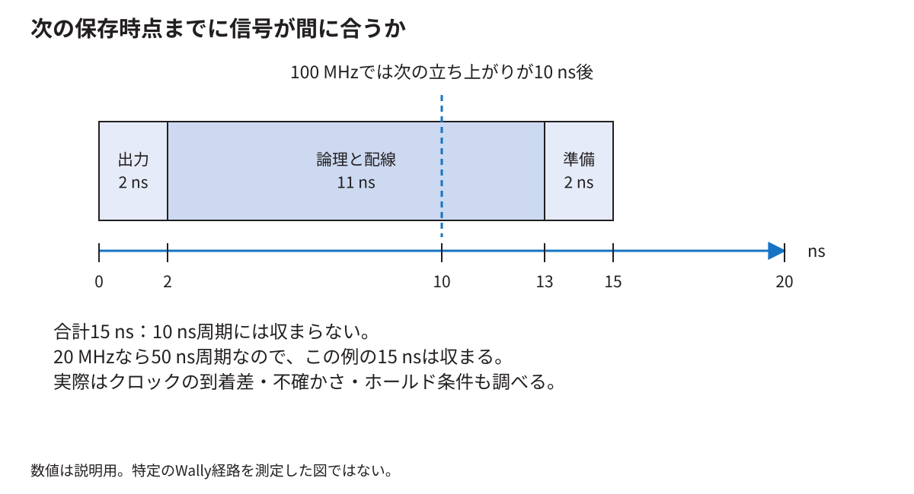
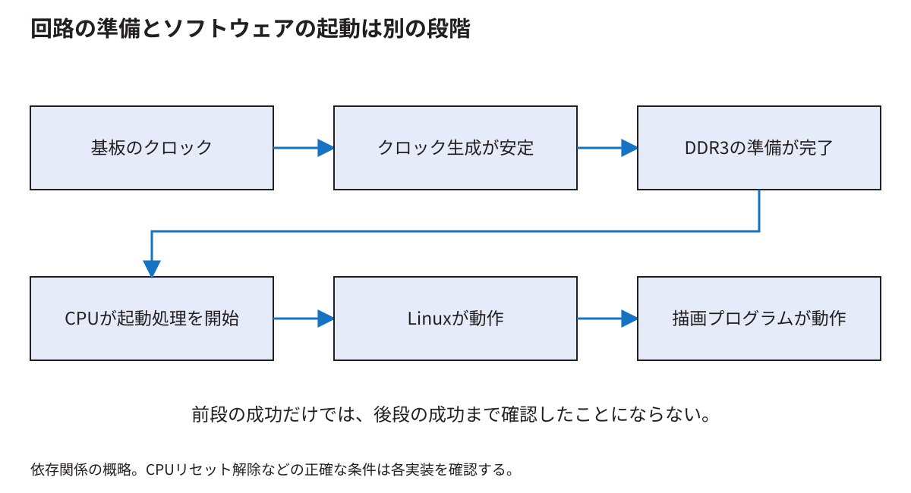

# クロックとリセットからFPGAの実装結果を読む

[分野別の入口](README.md) · [用語を調べる](glossary.md)

回路の式が正しくても、信号が次の保存時点までに到着しなければ、実物は期待どおり動かない。この章では、周波数、遅延、制約、配置配線、起動の順序を一つの時間の話としてつなぐ。数値例は、明記したものを除いて説明用である。

<!-- technical-toc:start -->
**このページの目次**

- [1 クロック周波数を時間へ直す](#sec-1)
- [2 一周期の中で信号が進む](#sec-2)
- [3 速過ぎる経路にも条件がある](#sec-3)
- [4 create_clockは発振器を作る命令ではない](#sec-4)
- [5 クロックを変換する回路と制約を分ける](#sec-5)
- [6 リセットは値を初期状態へ戻す操作](#sec-6)
- [7 起動の順序を依存関係として読む](#sec-7)
- [8 合成と配置配線は何をするか](#sec-8)
- [9 資源使用率だけでは動くか分からない](#sec-9)
- [10 タイミング報告を読む最小単位](#sec-10)
- [11 制約を直すことと回路を直すこと](#sec-11)
- [12 理解を確かめる三つの問い](#sec-12)
<!-- technical-toc:end -->

<a id="sec-1"></a>
## 1 クロック周波数を時間へ直す

20 MHzは1秒間に2千万回の周期があるという意味で、一周期は50 nsである。100 MHzなら10 nsである。計算は`周期=1/周波数`で行う。MHzの値からnsへ直す場合は、`1000/周波数[MHz]`でよい。

周波数が5倍でも、毎秒の仕事量が必ず5倍にはならない。一個の仕事が何周期必要か、待つ時間があるか、毎周期新しい仕事を受け取れるかで変わる。CPUの一命令、APBの一転送、RasterIXの一三角形は、同じ仕事の単位ではない。

<a id="sec-2"></a>
## 2 一周期の中で信号が進む

あるレジスタが立ち上がりで値を出し、その値が加算器と選択回路を通って、次のレジスタへ届くとする。最初のレジスタから値が出るまでの時間、論理演算の時間、配線を進む時間が必要になる。受け側には、立ち上がり直前に値が安定している必要時間もある。これをセットアップ時間という。



時計のずれを省いた説明例では、次の関係を満たしたい。

```text
送り側レジスタの出力遅延 + 論理と配線の遅延 + セットアップ時間
    <= クロック周期
```

例えば合計15 nsなら、周期50 nsには収まるが周期10 nsには収まらない。実際の解析では、クロックがそれぞれのレジスタへ届く時刻の差や不確かさも扱う。単に論理ゲートの段数だけを数える解析ではない。

<a id="sec-3"></a>
## 3 速過ぎる経路にも条件がある

受け側の立ち上がり直後には、以前の値を短時間保持する必要がある。これがホールド時間である。新しい値が早過ぎる時点で届くと、受け側がどちらの値を取り込むかの条件を満たせなくなる。

このため「周波数を下げればすべてのタイミング違反が直る」とは言えない。次の立ち上がりまでの余裕を増やすことと、同じ立ち上がり付近で起こるホールド条件を満たすことは違う。セットアップとホールドは別々に確認する。

<a id="sec-4"></a>
## 4 create_clockは発振器を作る命令ではない

```tcl
create_clock -period 10.000 -name BoardClock [get_ports clk]
```

この記述は、設計の`clk`入力に10 ns周期のクロックが来るという前提を解析ツールへ伝える。FPGAの端子から100 MHzの信号を新しく生成する命令ではない。基板上の発振器、配線、FPGA内のクロック生成IPは別に存在する。

XDCは、こうした時間の条件や端子の対応を記録するファイル形式である。どのXDCがビルドで読み込まれるかまで確認して初めて有効になる。別名のファイルへ書いても、プロジェクトから読まれていなければ解析に反映されない。

本研究の実ファイルを探す入口は[ボード対応の再現資料](../thesis/再現資料/ボード対応/NexysVideo対応を変更前から再現する.md)である。ファイル名、トップモジュールの端子名、生成スクリプトの読込み箇所を三点で対応付ける。

<a id="sec-5"></a>
## 5 クロックを変換する回路と制約を分ける

FPGAのMMCMやPLLなどの専用資源を使うと、基準のクロックから別の周期や位相のクロックを作れる。生成IPの設定は、実際にどういうクロックを作るかを決める。一方、制約は、その関係をタイミング解析でどう扱うかを決める。

たとえばCPU用20 MHz、描画用100 MHzを同じ基準から作っていても、すべての接続を無条件で直接つないでよいとは言えない。位相関係、生成経路、リセット中の扱い、間の回路の契約を確認する必要がある。逆に「周波数が違うから必ず無関係なクロックである」とも言えない。

本研究のE6では、二つのクロックは同じ基準に由来する。接続には既存の非同期FIFO、または比較用の一語ハンドシェイクを用いた。位相関係を利用する別の同期変換方式まで比較した結果ではない。[E6の条件](../thesis/再現資料/実験記録/E6/report/結果と判断.md)

<a id="sec-6"></a>
## 6 リセットは値を初期状態へ戻す操作

リセットで戻すのは、たとえば状態機械の状態、FIFOの位置情報、命令が有効かという印である。メモリの全画素を白にする操作まで、すべてのリセットで自動的に行われるわけではない。

同期リセットはクロックの立ち上がりで評価する。非同期リセットは、クロックの立ち上がりを待たずに状態を戻す端子を使う。どちらにも用途があり、解除するときの条件を守る必要がある。クロックが不安定なまま状態機械を動かし始めると、最初の取引から誤る可能性がある。

クロックの安定、DDR3の初期化完了、CPUのリセット解除、Linux起動、描画プログラム起動は、それぞれ別の出来事である。LEDが一個点灯しただけで、最後まで全部成功したとは判断しない。

<a id="sec-7"></a>
## 7 起動の順序を依存関係として読む

DDR3を使うCPUは、メモリコントローラが使える状態になる前にDDR3へ取引を始めてはならない。したがって、回路には「クロック生成が安定した」「DDR3の校正が終わった」などの状態を見て、動作を許可する仕組みが必要になる。



図の矢印は、前の準備を使って次へ進むという関係である。各箱に入るまでの秒数を示してはいない。UARTが無出力なら、いきなりゲームのC++を疑う前に、どの段階まで進んだかを観察する。

解除の同期回路はクロック領域ごとに用意することがある。異なるクロックの回路が同じ瞬間に一斉に動き出すことを、信号名が同じという理由だけで仮定しない。FIFOのreset-busyなど、IPが定める待ち条件も満たす。

<a id="sec-8"></a>
## 8 合成と配置配線は何をするか

合成はHDLの記述を、LUT、FF、BRAM、DSPなどの論理構造へ変換する。配置は、その部品をFPGAのどの場所へ置くかを決める。配線は、部品の端子同士をFPGA内の配線資源で結ぶ。

同じArtix-7系列でも、部品数、位置、パッケージ、速度グレード、配線の混雑が違えば、同じ回路の動作可能周波数は変わり得る。「論理ゲートの数だけが違い、速度は同じ」とは扱えない。大きいFPGAでも、長い配線や混雑で遅くなる経路はある。

合成直後の良い見積りだけで、配置配線後も成立したとは言えない。最終の設計について制約、配置配線後タイミング、DRC、生成したbitstreamの対応を確認する。

<a id="sec-9"></a>
## 9 資源使用率だけでは動くか分からない

LUTが60%、BRAMが80%だったという情報は、容量がどの程度使われたかを示す。しかし、動作可能周波数、消費電力、混雑、メモリへの同時アクセス、I/O電圧の正しさまでは示さない。

BRAMが余っていても、内部フレームバッファを増やせば必ず速くなるとは限らない。読書き回路やバスは同じままで、他の部分が制限している場合がある。容量の増加が帯の数を減らすのか、外部メモリ転送を減らすのかを先に整理し、同じ場面で比較する。

また、BRAMには利用可能な幅と深さの組合せがある。必要ビット数を総ビット数で割った値だけでは、端数やポート構成による使い切れなさが見えない。報告される実ブロック数を見る。

<a id="sec-10"></a>
## 10 タイミング報告を読む最小単位

一つの経路について、出発点、到着点、使われたクロック、必要な到着時刻、実際の到着時刻を見る。差が余裕、すなわちslackである。セットアップ解析で余裕が負なら、その条件を満たしていない。

最悪の余裕が正であっても、対象の経路が解析から外れていれば意味が違う。クロック未定義の経路、入力遅延が未設定の端子、広過ぎるfalse pathがないかを見る。false pathは「遅い経路を許すための便利な消しゴム」ではなく、そのタイミング関係で解析する必要がないと設計上説明できる経路に指定する。

実際の報告の読み方は[技術付録第I部](../thesis/技術付録.md#part_I)で詳述している。最初に問いを一つ決めると読みやすい。例えば「CPUの足し算が遅いのか」「リセットの配線が長いのか」「違うクロック間の経路を誤って通常解析しているのか」で、見る信号が変わる。

<a id="sec-11"></a>
## 11 制約を直すことと回路を直すこと

本当に一周期で計算が終わらないなら、組合せ論理を短くする、途中へレジスタを入れる、周波数を下げるなど、要求と実装の変更が必要になる。途中へレジスタを入れる場合は結果が出る周期も変わるため、validや制御信号も同じだけ遅らせる。

実際は二周期後だけ結果を使う設計なのに、解析が一周期で使うと仮定しているなら、その契約を正確な制約へ反映する余地がある。ただし「二周期でよい」は、回路のenableや受取り条件で本当に保証されていなければならない。制約だけで回路の動作は変わらない。

<a id="sec-12"></a>
## 12 理解を確かめる三つの問い

100 MHzのクロックの周期は10 nsである。20 MHzを100 MHzへ変えると、次の保存時点までの時間は40 ns減る。既存の論理が収まるかは、名前ではなく経路の遅延で判断する。

`create_clock`を書いたのに端子の信号が変わらないのは正常である。それは解析へ与える条件であり、発振器を動かす指令ではない。

CPUのリセットを解除してUARTが出たとしても、映像の正しさまで確認したことにはならない。それぞれの観察が、起動経路のどこを確かめたかを説明する。次は[異なるクロック間で値を渡す章](cdc-protocols.md)へ進める。
