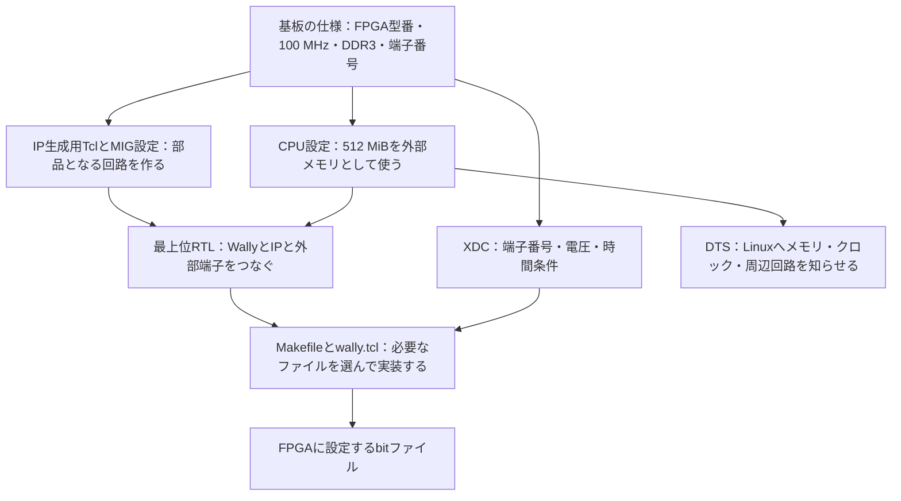
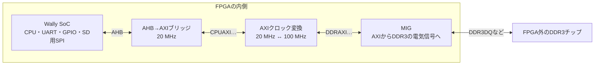

# Nexys Video対応を、変更前のWallyから再現する

2026年9月23日作成。『ゲーム機研究の理解ノート』第39章の実装演習。

**この教材の到達点は、Nexys Video対応がまだない版から、実際の対応コミットと同じ12ファイルを自分で用意できることです。** 書く場所、出発点にできる既存ファイル、変更する内容、その理由、答え合わせの方法を順に示します。

これまでの第39章には、出来上がった回路の説明はありましたが、「移植前のどこを開き、何を書き足すか」が十分にはありませんでした。また、39.27節は後日の版をビルドする手順でした。それでは、最初のNexys Video対応を自分で実装する手順にはなりません。この教材は、その不足を補うものです。

対象は、CPU、DDR3、UART、GPIO、基板上のmicroSDまでです。この時点のソースには、後日のRasterIX接続やゲーム、HDMI、SDWire3向けの処理はありません。

<a id="toc"></a>
## 目次

- [0. 何を再現するのか――出発点と完成形を固定する](#g00)
- [1. 作業場所を用意し、差分の読み方を確かめる](#g01)
- [2. 変更1：512 MiBの外部メモリをCPUの設定へ登録する](#g02)
- [3. 変更2：DigilentのDDR3設定をWally用にする](#g03)
- [4. 変更3：DDR3制御回路を生成するTclを追加する](#g04)
- [5. 変更4：必要な三つのクロックを生成する](#g05)
- [6. 変更5：AHB→AXI変換回路の設定を合わせる](#g06)
- [7. 変更6：20 MHzと100 MHzの間でAXIを受け渡す](#g07)
- [8. 変更7：最上位RTLの全233行を組み立てる](#g08)
  - [8.1 ファイル名、モジュール名、設定の読み込み](#g08-01)
  - [8.2 外へ出す端子を決める](#g08-02)
  - [8.3 内部の配線とAXIの五つの経路](#g08-03)
  - [8.4 スイッチ・UART入力とSD電源](#g08-04)
  - [8.5 MMCMと二つのリセット回路](#g08-05)
  - [8.6 既存のWally SoCを置く](#g08-06)
  - [8.7 AHB→AXI変換回路を配線する](#g08-07)
  - [8.8 AXIクロック変換回路を配線する](#g08-08)
  - [8.9 DDR3制御回路とメモリ端子を配線する](#g08-09)
  - [8.10 一回の読み書きを最後まで追う](#g08-10)
- [9. 変更8：実物の端子と時間条件をXDCに書く](#g09)
  - [9.1 ピン番号と電圧はどこから分かるか](#g09-01)
  - [9.2 create_clockは、この実装ではどこにあるか](#g09-02)
  - [9.3 false_pathとSDの時間条件は何を意味するか](#g09-03)
- [10. 変更9：Linuxへ渡すデバイスツリーを作る](#g10)
- [11. 変更10：make nexysvideoで各作業がつながるようにする](#g11)
- [12. 変更11：Vivadoが新しいRTL・IP・XDCを選ぶようにする](#g12)
- [13. 変更12：共通READMEにビルドと起動条件を書く](#g13)
- [14. 12ファイルが完成したか、コミットせずに答え合わせする](#g14)
- [15. ソースが一致した後、生成物と起動を確かめる](#g15)
- [16. 失敗した場所から、直すファイルを特定する](#g16)
- [17. 答えを写す段階から、自分で変更できる段階へ進む](#g17)
- [18. この教材で確認したことと資料の所在](#g18)

<a id="g00"></a>
## 0. 何を再現するのか――出発点と完成形を固定する

Gitのコミットは、「その時点で保存されたファイル一式」を識別する記録です。ここでは次の二つを比べます。

| 役割 | コミット | 内容 |
|---|---|---|
| 出発点 | `2345ec2ad68d9a9073b2dfec0929ce87c90cb0ce` | Nexys Video対応コミットの直前 |
| 完成形 | `f0764f003f7c55197882bc1b2f90c84132395472` | `Add Nexys Video FPGA support` |

完成形は[実際のコミット](https://github.com/SoshiroFujimori/wally-game-console/commit/f0764f003f7c55197882bc1b2f90c84132395472)です。今回はこの記録を読み直して教材を作りました。「だいたい同じ役割の回路」を別に提案しているわけではありません。

この対応には12ファイルの変更があります。教材では、内容を考えやすい順に並べ替えました。GitHubで表示される順序とは違います。

| 変更 | 対象ファイル（完成形へリンク） | 種類 | 本文 |
|---|---|---|---|
| 1 | [config/derivlist.txt](変更後/config/derivlist.txt) | 修正 | [2節](#g02) |
| 2 | [fpga/generator/xlnx_ddr3-nexysvideo-mig.prj](変更後/fpga/generator/xlnx_ddr3-nexysvideo-mig.prj) | 追加 | [3節](#g03) |
| 3 | [fpga/generator/ddr3-nexysvideo.tcl](変更後/fpga/generator/ddr3-nexysvideo.tcl) | 追加 | [4節](#g04) |
| 4 | [fpga/generator/mmcm-nexysvideo.tcl](変更後/fpga/generator/mmcm-nexysvideo.tcl) | 追加 | [5節](#g05) |
| 5 | [fpga/generator/ahbaxibridge.tcl](変更後/fpga/generator/ahbaxibridge.tcl) | 修正 | [6節](#g06) |
| 6 | [fpga/generator/clkconverter.tcl](変更後/fpga/generator/clkconverter.tcl) | 修正 | [7節](#g07) |
| 7 | [fpga/src/fpgaTopNexysVideo.sv](変更後/fpga/src/fpgaTopNexysVideo.sv) | 追加 | [8節](#g08) |
| 8 | [fpga/constraints/constraints-nexysvideo.xdc](変更後/fpga/constraints/constraints-nexysvideo.xdc) | 追加 | [9節](#g09) |
| 9 | [linux/devicetree/wally-nexysvideo.dts](変更後/linux/devicetree/wally-nexysvideo.dts) | 追加 | [10節](#g10) |
| 10 | [fpga/generator/Makefile](変更後/fpga/generator/Makefile) | 修正 | [11節](#g11) |
| 11 | [fpga/generator/wally.tcl](変更後/fpga/generator/wally.tcl) | 修正 | [12節](#g12) |
| 12 | [fpga/README.md](変更後/fpga/README.md) | 修正 | [13節](#g13) |

「追加」は、出発点にはそのファイルがないので新しく作るという意味です。「修正」は、出発点にあるファイルへ変更を加えるという意味です。**修正対象を空のファイルから作り直してはいけません。既存のほかのボードへの対応も残します。**

まず全体の関係を一枚にまとめます。



この図の矢印は、ファイルや仕様の依存関係です。回路内をデータが流れる配線図は[8節](#g08)にあります。二つを混ぜないようにします。

**資料で決まる値と、設計で選ぶ値を分けます。** 512 MiBは搭載されたメモリから決まります。一方、CPUの20 MHzはこの実装で選んだ動作周波数です。「Nexys Videoなら必ず20 MHz」という意味ではありません。変更理由を説明するときは、この違いが大切です。

| 項目 | この対応の値 | 何に基づくか |
|---|---|---|
| FPGAの型番 | `xc7a200tsbg484-1` | 基板に搭載されたFPGA。Vivado用の表記 |
| ボード定義 | `digilentinc.com:nexys_video:part0:1.2` | 既存のDigilentボードファイル |
| 基板から入るクロック | 100 MHz | 基板の発振器 |
| DDR3の容量・外部データ端子 | 512 MiB・16ビット | 基板上のDDR3とその配線 |
| CPUクロック | 20 MHz | この対応で採用した条件。最高周波数を求めた結論ではない |
| MIGの利用側クロック | 100 MHz | このMIG設定の400 MHz／4という関係 |
| AHB・AXIのデータ幅 | 64ビット | Wally側と使用する変換回路に合わせる |
| 起動プログラムのSDクロック上限 | 5 MHz | この対応で採用した条件 |
| Linux側のSDクロック上限 | 1 MHz | このDTSに記載した条件。起動前の5 MHzとは別 |

「この値を採用した」という事実はコードで確認できます。「その値が最適か」は別途比較が必要です。この教材は、存在するコミットから確認できない試行錯誤や最適性を付け足しません。

[目次へ](#toc)

<a id="g01"></a>
## 1. 作業場所を用意し、差分の読み方を確かめる

以下のシェルコマンドはUbuntuで実行するものです。編集対象のルートを、次の場所に固定します。

```text
/home/researcher/nexys-video-learning/wally-before-nexys
```

この教材作成時に、その場所へ研究用リポジトリを移動したり、接続中のFPGAを書き換えたりはしていません。手元で演習をするときに、新しく用意する場所です。すでに同名の場所がある場合は、その中身を先に確認し、既存の作業へ重ねないでください。

```bash
mkdir -p /home/researcher/nexys-video-learning
git clone --no-hardlinks --no-checkout \
  /path/to/wally-game-console \
  /home/researcher/nexys-video-learning/wally-before-nexys
cd /home/researcher/nexys-video-learning/wally-before-nexys
git checkout --detach 2345ec2ad68d9a9073b2dfec0929ce87c90cb0ce
git status --short
git rev-parse HEAD
```

`clone`は別の場所にGitの記録を用意します。`checkout --detach`は、特定のコミット時点のファイルを取り出します。研究用リポジトリのmainを過去へ戻す操作ではありません。最後の二行では、未変更であることと、出発点のハッシュを確認します。

コードを読む段階で完成形へcheckoutする必要はありません。出発点のままでも、次のように完成形を表示できます。

```bash
git show f0764f003f7c55197882bc1b2f90c84132395472:fpga/src/fpgaTopNexysVideo.sv
```

この命令は表示だけです。作業中のファイルは書き換えません。編集するファイルと、答えとして表示するファイルを分けて扱えます。

以後の編集では、各節の「書く場所」を開きます。本文のコードだけでなく、同梱した「変更後」の完全なファイルも見られます。「変更前」には元からある6ファイルを保存しています。「差分」には12ファイル分を一つずつ分けて保存しています。

差分は、次の読み方です。

```diff
 元からあり、そのまま残す行
-消す行
+追加する行
```

先頭の`+`や`-`はファイルへ入力する文字ではありません。また、`@@`で始まる行は変更位置を表す案内です。これも入力しません。Makefileのコマンド行の先頭は、空白文字ではなく**タブ**です。見た目が似ていてもmakeの解釈が違うため、同梱ファイルのタブを保ちます。

ボード設定を読むためには、出発点が指定するサブモジュールを用意します。

```bash
git submodule update --init --recursive addins/vivado-boards
```

ここで使うボード設定のコミットは`36f34ab687b7fa9c778b779d027f3bce63b3ace9`です。単に最新のボード設定を取るのでなく、出発点に記録された版を使います。同じ資料から同じ設定を導くためです。同梱した参考ファイルにも、この版の設定を保存しています。

**読む順序は「目的→編集箇所→理由→確認」です。** まだ生成していないIPを含む途中のRTLは、その時点では単独で合成できません。途中で「入力した文章が完成形と同じか」を確かめ、全12ファイルをそろえた後でビルドします。

<a id="g02"></a>
## 2. 変更1：512 MiBの外部メモリをCPUの設定へ登録する

**書く場所：** `/home/researcher/nexys-video-learning/wally-before-nexys/config/derivlist.txt`。既存ファイルを修正します。

**何が不足しているか。** 出発点には、FPGA用の共通設定と、Arty A7、Genesys2、Nexys A7などの派生設定があります。しかし`fpganexysvideo`という名前の設定はありません。そこで、既存の`fpga`設定を受け継ぐ設定を追加します。

```diff
diff --git a/config/derivlist.txt b/config/derivlist.txt
index 1dfbe70163bcbd4fced024b87f1c36a2e551936f..176a9d6c3db7774351dc4c5ae6aabdfb42b82781 100644
--- a/config/derivlist.txt
+++ b/config/derivlist.txt
@@ -71,6 +71,9 @@ EXT_MEM_RANGE       64'h7FFFFFFF
 deriv fpganexysa7 fpga
 EXT_MEM_RANGE       64'h07FFFFFF
 
+deriv fpganexysvideo fpga
+EXT_MEM_RANGE       64'h1FFFFFFF
+
 # temporary spitest configuration
 deriv spitest rv64gc
 UNCORE_RAM_RANGE    64'h0FFFFFFF
```

追加する位置は、既存の`deriv fpganexysa7 fpga`のまとまりの後、`# temporary spitest configuration`の前です。

```text
deriv fpganexysvideo fpga
EXT_MEM_RANGE       64'h1FFFFFFF
```

一行目は、このリポジトリの設定生成器が読む書式です。`deriv`は「派生設定を定義する」、`fpganexysvideo`は新しい設定名、`fpga`は受け継ぐ設定名です。SystemVerilogの文法ではありません。

共通の`fpga`設定には、外部メモリを使うこと、外部メモリの先頭が`0x80000000`であること、SD回路を有効にすること、起動ROMを読み込むことなどがすでにあります。したがって、それらを全部もう一度書く必要はありません。容量に関係する一項目だけを上書きします。

計算は次のとおりです。

```text
512 MiB = 512 × 1024 × 1024 バイト
        = 536,870,912 バイト
        = 2^29 バイト
        = 0x20000000 バイト

先頭からの最後の位置 = 容量 - 1 = 0x1FFFFFFF
物理アドレスの最後   = 0x80000000 + 0x1FFFFFFF
                     = 0x9FFFFFFF
```

このRTL側の`EXT_MEM_RANGE`は、範囲の下位ビットを表すマスクとして使われます。`0x20000000`という容量そのものを設定する項目ではありません。`64'h1FFFFFFF`の`64`は64ビットの定数、`h`は16進数で書くという意味です。

なぜCPUにも容量を教えるのでしょうか。CPUが出したアドレスに応じて、「この要求は外のDDR3へ送る」と決める回路があるためです。実物が512 MiBなのに、もっと広い範囲をDDR3だと扱うと、別の位置に見えるアドレスが同じ実物の位置へ重なるおそれがあります。最上位RTLでアドレスの下位29ビットを使う理由も、[8.9節](#g08-09)でここにつながります。

**ここでの確認。** `git diff -- config/derivlist.txt`で、新しい派生設定の3行だけが増えていることを見ます。生成後の`config/deriv/fpganexysvideo/config.vh`を直接手直しする手順ではありません。派生設定の生成は[15節](#g15)で行います。

<a id="g03"></a>
## 3. 変更2：DigilentのDDR3設定をWally用にする

**書く場所：** `/home/researcher/nexys-video-learning/wally-before-nexys/fpga/generator/xlnx_ddr3-nexysvideo-mig.prj`。新しく作ります。

**出発点にする資料：** `/home/researcher/nexys-video-learning/wally-before-nexys/addins/vivado-boards/new/board_files/nexys_video/A.0/1.2/mig.prj`。

「メモリ制御回路を作る」と言っても、DDR3の電気的な送受信回路をここで一から記述したわけではありません。AMDのMIGという生成器へ、メモリの種類・配線・利用側の接続形式を渡して生成します。`.prj`は、その生成条件を保存したXMLファイルです。

XMLは`<名前>値</名前>`のように項目と値を書きます。例えば`<DataWidth>16</DataWidth>`は、ここでは基板のメモリ側のデータ端子が16ビットという設定です。同じファイルにある`<C0_S_AXI_DATA_WIDTH>64</C0_S_AXI_DATA_WIDTH>`は、FPGAの内部で利用するAXI側のデータ幅です。**外側16ビットと内側64ビットは別の接続なので、同じ値でなくて構いません。**

最初に元のファイルをコピーします。

```bash
cd /home/researcher/nexys-video-learning/wally-before-nexys
cp addins/vivado-boards/new/board_files/nexys_video/A.0/1.2/mig.prj \
   fpga/generator/xlnx_ddr3-nexysvideo-mig.prj
```

そのうえで、下の完成形と比較します。元のボード設定と完成形を機械的に比較すると、XMLの設定に関する変更は次の9項目です。コメントと整形の違いはこの表に含めていません。

| 項目 | 元のボード設定 | この対応 | なぜそうするか |
|---|---|---|---|
| `ModuleName` | `design_1_mig_7series_0_0` | `ddr3` | Wally側の生成Tcl・最上位RTLが使う名前へ合わせる |
| `SystemClock` | `Single-Ended` | `No Buffer` | MIGには基板端子から直接でなく、別のMMCMの出力を渡す |
| `System_Clock`内の`sys_clk_i`の端子指定 | バンク34・R4 | `No connect` | MIG自身には外部端子を割り当てない。RTLでMMCMへつなぐ |
| `UIExtraClocks` | 1 | 0 | この接続ではMIGの追加クロック出力を使わない |
| AXIの読み書き調停 | `RD_PRI_REG` | `ROUND_ROBIN` | この構成で採用した読み書きの選び方。接続幅から一意に決まる値ではない |
| `C0_S_AXI_DATA_WIDTH` | 32 | 64 | Wally側の64ビットAXIに合わせる |
| `C0_S_AXI_ID_WIDTH` | 2 | 4 | 変換回路側の識別番号の幅に合わせる |
| `C0_S_AXI_SUPPORTS_NARROW_BURST` | 0 | 1 | 64ビットより小さい転送単位も扱えるようにする |
| `emrOutputDriveStrength` | `RZQ/7` | `RZQ/6` | Digilentの基板説明書の推奨値に合わせる |

DDR3の端子割り当ては**全48本とも元の設定と一致**します。行・列・バンクのアドレス幅、メモリの型、容量、基本タイミングも引き継いでいます。別の基板の端子表を流用して名前だけ変えたものではありません。

`No connect`は、「実際にクロックを接続しない」という意味ではありません。ここでは「MIGの設定で外部パッケージ端子を指定しない」という意味です。後でRTLに`.sys_clk_i(DDRSysCLK)`と書き、内部のクロック配線へ接続します。

`RZQ/6`はメモリ出力の電気的な駆動条件です。アドレスや容量の計算から決めるものではありません。基板説明書のTable 3に従います。新しいメモリや基板へ変更するなら、その基板の資料とMIGの設定画面から選び直します。[Digilentの説明書、3.1節・Table 3](https://digilent.com/reference/_media/reference/programmable-logic/nexys-video/nexysvideo_rm.pdf#page=10)

MIGファイル自身には手編集を推奨しない注意書きがあります。この教材は、すでに採用された設定ファイルを再現し、その差を読む演習です。別条件のDDR3設計を作る際には、値を推測してXMLへ足すのではなく、MIGで設定の妥当性と生成結果を確認する必要があります。

クロックの読み方も、ここで確認します。

```text
TimePeriod = 2500 ps = 2.5 ns
DDR3へ出すクロック = 1 / 2.5 ns = 400 MHz
PHYRatio = 4:1
MIGの利用側 ui_clk = 400 MHz / 4 = 100 MHz
```

DDRの信号はクロックの両側のエッジで転送しますが、「CPUが800 MHzで動く」ことにはなりません。CPU用クロックは別に20 MHzを用意します。

**ファイルの完成形、全165行：**

```xml
<?xml version="1.0" encoding="UTF-8" standalone="no" ?>
<!-- Nexys Video DDR3 profile, based on the pinned Digilent board file:
     addins/vivado-boards/new/board_files/nexys_video/A.0/1.2/mig.prj
     Physical memory timing and pin assignments are retained.
     Wally uses a 64-bit AXI port, four ID bits, and narrow transfers.
     The system and reference clocks are driven by the board wrapper MMCM.
     RZQ/6 output impedance follows the Nexys Video reference manual, Table 3. -->
<Project NoOfControllers="1">


<!-- IMPORTANT: This is an internal file that has been generated by the MIG software. Any direct editing or changes made to this file may result in unpredictable behavior or data corruption. It is strongly advised that users do not edit the contents of this file. Re-run the MIG GUI with the required settings if any of the options provided below need to be altered. -->

  <ModuleName>ddr3</ModuleName>

  <dci_inouts_inputs>1</dci_inouts_inputs>

  <dci_inputs>1</dci_inputs>

  <Debug_En>OFF</Debug_En>

  <DataDepth_En>1024</DataDepth_En>

  <LowPower_En>ON</LowPower_En>

  <XADC_En>Enabled</XADC_En>

  <TargetFPGA>xc7a200t-sbg484/-1</TargetFPGA>

  <Version>4.2</Version>

  <SystemClock>No Buffer</SystemClock>

  <ReferenceClock>No Buffer</ReferenceClock>

  <SysResetPolarity>ACTIVE LOW</SysResetPolarity>

  <BankSelectionFlag>FALSE</BankSelectionFlag>

  <InternalVref>1</InternalVref>

  <dci_hr_inouts_inputs>50 Ohms</dci_hr_inouts_inputs>

  <dci_cascade>0</dci_cascade>

  <Controller number="0">
    <MemoryDevice>DDR3_SDRAM/Components/MT41K256M16XX-125</MemoryDevice>
    <TimePeriod>2500</TimePeriod>
    <VccAuxIO>1.8V</VccAuxIO>
    <PHYRatio>4:1</PHYRatio>
    <InputClkFreq>100</InputClkFreq>
    <UIExtraClocks>0</UIExtraClocks>
    <MMCM_VCO>800</MMCM_VCO>
    <MMCMClkOut0> 4.000</MMCMClkOut0>
    <MMCMClkOut1>1</MMCMClkOut1>
    <MMCMClkOut2>1</MMCMClkOut2>
    <MMCMClkOut3>1</MMCMClkOut3>
    <MMCMClkOut4>1</MMCMClkOut4>
    <DataWidth>16</DataWidth>
    <DeepMemory>1</DeepMemory>
    <DataMask>1</DataMask>
    <ECC>Disabled</ECC>
    <Ordering>Normal</Ordering>
    <BankMachineCnt>4</BankMachineCnt>
    <CustomPart>FALSE</CustomPart>
    <NewPartName/>
    <RowAddress>15</RowAddress>
    <ColAddress>10</ColAddress>
    <BankAddress>3</BankAddress>
    <MemoryVoltage>1.5V</MemoryVoltage>
    <C0_MEM_SIZE>536870912</C0_MEM_SIZE>
    <UserMemoryAddressMap>BANK_ROW_COLUMN</UserMemoryAddressMap>
    <PinSelection>
      <Pin IN_TERM="" IOSTANDARD="SSTL15" PADName="M2" SLEW="" VCCAUX_IO="" name="ddr3_addr[0]"/>
      <Pin IN_TERM="" IOSTANDARD="SSTL15" PADName="L5" SLEW="" VCCAUX_IO="" name="ddr3_addr[10]"/>
      <Pin IN_TERM="" IOSTANDARD="SSTL15" PADName="N5" SLEW="" VCCAUX_IO="" name="ddr3_addr[11]"/>
      <Pin IN_TERM="" IOSTANDARD="SSTL15" PADName="N4" SLEW="" VCCAUX_IO="" name="ddr3_addr[12]"/>
      <Pin IN_TERM="" IOSTANDARD="SSTL15" PADName="P2" SLEW="" VCCAUX_IO="" name="ddr3_addr[13]"/>
      <Pin IN_TERM="" IOSTANDARD="SSTL15" PADName="P6" SLEW="" VCCAUX_IO="" name="ddr3_addr[14]"/>
      <Pin IN_TERM="" IOSTANDARD="SSTL15" PADName="M5" SLEW="" VCCAUX_IO="" name="ddr3_addr[1]"/>
      <Pin IN_TERM="" IOSTANDARD="SSTL15" PADName="M3" SLEW="" VCCAUX_IO="" name="ddr3_addr[2]"/>
      <Pin IN_TERM="" IOSTANDARD="SSTL15" PADName="M1" SLEW="" VCCAUX_IO="" name="ddr3_addr[3]"/>
      <Pin IN_TERM="" IOSTANDARD="SSTL15" PADName="L6" SLEW="" VCCAUX_IO="" name="ddr3_addr[4]"/>
      <Pin IN_TERM="" IOSTANDARD="SSTL15" PADName="P1" SLEW="" VCCAUX_IO="" name="ddr3_addr[5]"/>
      <Pin IN_TERM="" IOSTANDARD="SSTL15" PADName="N3" SLEW="" VCCAUX_IO="" name="ddr3_addr[6]"/>
      <Pin IN_TERM="" IOSTANDARD="SSTL15" PADName="N2" SLEW="" VCCAUX_IO="" name="ddr3_addr[7]"/>
      <Pin IN_TERM="" IOSTANDARD="SSTL15" PADName="M6" SLEW="" VCCAUX_IO="" name="ddr3_addr[8]"/>
      <Pin IN_TERM="" IOSTANDARD="SSTL15" PADName="R1" SLEW="" VCCAUX_IO="" name="ddr3_addr[9]"/>
      <Pin IN_TERM="" IOSTANDARD="SSTL15" PADName="L3" SLEW="" VCCAUX_IO="" name="ddr3_ba[0]"/>
      <Pin IN_TERM="" IOSTANDARD="SSTL15" PADName="K6" SLEW="" VCCAUX_IO="" name="ddr3_ba[1]"/>
      <Pin IN_TERM="" IOSTANDARD="SSTL15" PADName="L4" SLEW="" VCCAUX_IO="" name="ddr3_ba[2]"/>
      <Pin IN_TERM="" IOSTANDARD="SSTL15" PADName="K3" SLEW="" VCCAUX_IO="" name="ddr3_cas_n"/>
      <Pin IN_TERM="" IOSTANDARD="DIFF_SSTL15" PADName="P4" SLEW="" VCCAUX_IO="" name="ddr3_ck_n[0]"/>
      <Pin IN_TERM="" IOSTANDARD="DIFF_SSTL15" PADName="P5" SLEW="" VCCAUX_IO="" name="ddr3_ck_p[0]"/>
      <Pin IN_TERM="" IOSTANDARD="SSTL15" PADName="J6" SLEW="" VCCAUX_IO="" name="ddr3_cke[0]"/>
      <Pin IN_TERM="" IOSTANDARD="SSTL15" PADName="G3" SLEW="" VCCAUX_IO="" name="ddr3_dm[0]"/>
      <Pin IN_TERM="" IOSTANDARD="SSTL15" PADName="F1" SLEW="" VCCAUX_IO="" name="ddr3_dm[1]"/>
      <Pin IN_TERM="" IOSTANDARD="SSTL15" PADName="G2" SLEW="" VCCAUX_IO="" name="ddr3_dq[0]"/>
      <Pin IN_TERM="" IOSTANDARD="SSTL15" PADName="F3" SLEW="" VCCAUX_IO="" name="ddr3_dq[10]"/>
      <Pin IN_TERM="" IOSTANDARD="SSTL15" PADName="D2" SLEW="" VCCAUX_IO="" name="ddr3_dq[11]"/>
      <Pin IN_TERM="" IOSTANDARD="SSTL15" PADName="C2" SLEW="" VCCAUX_IO="" name="ddr3_dq[12]"/>
      <Pin IN_TERM="" IOSTANDARD="SSTL15" PADName="A1" SLEW="" VCCAUX_IO="" name="ddr3_dq[13]"/>
      <Pin IN_TERM="" IOSTANDARD="SSTL15" PADName="E2" SLEW="" VCCAUX_IO="" name="ddr3_dq[14]"/>
      <Pin IN_TERM="" IOSTANDARD="SSTL15" PADName="B1" SLEW="" VCCAUX_IO="" name="ddr3_dq[15]"/>
      <Pin IN_TERM="" IOSTANDARD="SSTL15" PADName="H4" SLEW="" VCCAUX_IO="" name="ddr3_dq[1]"/>
      <Pin IN_TERM="" IOSTANDARD="SSTL15" PADName="H5" SLEW="" VCCAUX_IO="" name="ddr3_dq[2]"/>
      <Pin IN_TERM="" IOSTANDARD="SSTL15" PADName="J1" SLEW="" VCCAUX_IO="" name="ddr3_dq[3]"/>
      <Pin IN_TERM="" IOSTANDARD="SSTL15" PADName="K1" SLEW="" VCCAUX_IO="" name="ddr3_dq[4]"/>
      <Pin IN_TERM="" IOSTANDARD="SSTL15" PADName="H3" SLEW="" VCCAUX_IO="" name="ddr3_dq[5]"/>
      <Pin IN_TERM="" IOSTANDARD="SSTL15" PADName="H2" SLEW="" VCCAUX_IO="" name="ddr3_dq[6]"/>
      <Pin IN_TERM="" IOSTANDARD="SSTL15" PADName="J5" SLEW="" VCCAUX_IO="" name="ddr3_dq[7]"/>
      <Pin IN_TERM="" IOSTANDARD="SSTL15" PADName="E3" SLEW="" VCCAUX_IO="" name="ddr3_dq[8]"/>
      <Pin IN_TERM="" IOSTANDARD="SSTL15" PADName="B2" SLEW="" VCCAUX_IO="" name="ddr3_dq[9]"/>
      <Pin IN_TERM="" IOSTANDARD="DIFF_SSTL15" PADName="J2" SLEW="" VCCAUX_IO="" name="ddr3_dqs_n[0]"/>
      <Pin IN_TERM="" IOSTANDARD="DIFF_SSTL15" PADName="D1" SLEW="" VCCAUX_IO="" name="ddr3_dqs_n[1]"/>
      <Pin IN_TERM="" IOSTANDARD="DIFF_SSTL15" PADName="K2" SLEW="" VCCAUX_IO="" name="ddr3_dqs_p[0]"/>
      <Pin IN_TERM="" IOSTANDARD="DIFF_SSTL15" PADName="E1" SLEW="" VCCAUX_IO="" name="ddr3_dqs_p[1]"/>
      <Pin IN_TERM="" IOSTANDARD="SSTL15" PADName="K4" SLEW="" VCCAUX_IO="" name="ddr3_odt[0]"/>
      <Pin IN_TERM="" IOSTANDARD="SSTL15" PADName="J4" SLEW="" VCCAUX_IO="" name="ddr3_ras_n"/>
      <Pin IN_TERM="" IOSTANDARD="LVCMOS15" PADName="G1" SLEW="" VCCAUX_IO="" name="ddr3_reset_n"/>
      <Pin IN_TERM="" IOSTANDARD="SSTL15" PADName="L1" SLEW="" VCCAUX_IO="" name="ddr3_we_n"/>
    </PinSelection>
    <System_Clock>
      <Pin Bank="Select Bank" PADName="No connect" name="sys_clk_i"/>
    </System_Clock>
    <System_Control>
      <Pin Bank="Select Bank" PADName="No connect" name="sys_rst"/>
      <Pin Bank="Select Bank" PADName="No connect" name="init_calib_complete"/>
      <Pin Bank="Select Bank" PADName="No connect" name="tg_compare_error"/>
    </System_Control>
    <TimingParameters>
      <Parameters tcke="5" tfaw="40" tras="35" trcd="13.75" trefi="7.8" trfc="260" trp="13.75" trrd="7.5" trtp="7.5" twtr="7.5"/>
    </TimingParameters>
    <mrBurstLength name="Burst Length">8 - Fixed</mrBurstLength>
    <mrBurstType name="Read Burst Type and Length">Sequential</mrBurstType>
    <mrCasLatency name="CAS Latency">6</mrCasLatency>
    <mrMode name="Mode">Normal</mrMode>
    <mrDllReset name="DLL Reset">No</mrDllReset>
    <mrPdMode name="DLL control for precharge PD">Slow Exit</mrPdMode>
    <emrDllEnable name="DLL Enable">Enable</emrDllEnable>
    <emrOutputDriveStrength name="Output Driver Impedance Control">RZQ/6</emrOutputDriveStrength>
    <emrMirrorSelection name="Address Mirroring">Disable</emrMirrorSelection>
    <emrCSSelection name="Controller Chip Select Pin">Disable</emrCSSelection>
    <emrRTT name="RTT (nominal) - On Die Termination (ODT)">RZQ/6</emrRTT>
    <emrPosted name="Additive Latency (AL)">0</emrPosted>
    <emrOCD name="Write Leveling Enable">Disabled</emrOCD>
    <emrDQS name="TDQS enable">Enabled</emrDQS>
    <emrRDQS name="Qoff">Output Buffer Enabled</emrRDQS>
    <mr2PartialArraySelfRefresh name="Partial-Array Self Refresh">Full Array</mr2PartialArraySelfRefresh>
    <mr2CasWriteLatency name="CAS write latency">5</mr2CasWriteLatency>
    <mr2AutoSelfRefresh name="Auto Self Refresh">Enabled</mr2AutoSelfRefresh>
    <mr2SelfRefreshTempRange name="High Temparature Self Refresh Rate">Normal</mr2SelfRefreshTempRange>
    <mr2RTTWR name="RTT_WR - Dynamic On Die Termination (ODT)">Dynamic ODT off</mr2RTTWR>
    <PortInterface>AXI</PortInterface>
    <AXIParameters>
      <C0_C_RD_WR_ARB_ALGORITHM>ROUND_ROBIN</C0_C_RD_WR_ARB_ALGORITHM>
      <C0_S_AXI_ADDR_WIDTH>29</C0_S_AXI_ADDR_WIDTH>
      <C0_S_AXI_DATA_WIDTH>64</C0_S_AXI_DATA_WIDTH>
      <C0_S_AXI_ID_WIDTH>4</C0_S_AXI_ID_WIDTH>
      <C0_S_AXI_SUPPORTS_NARROW_BURST>1</C0_S_AXI_SUPPORTS_NARROW_BURST>
    </AXIParameters>
  </Controller>


</Project>
```

読むときは、前半の生成条件、中央の`PinSelection`、後半のメモリ動作条件と`AXIParameters`の順に分けます。48行の端子名を暗記する必要はありません。「どの資料の端子表を引き継いだか」「利用側の何を合わせたか」を説明できることが大切です。

**ここでの確認。** ファイルの`TargetFPGA`がNexys VideoのFPGAであること、`C0_MEM_SIZE`が536870912であること、末尾のAXI設定が29・64・4・1であることを確認します。完成形との比較用には[xlnx_ddr3-nexysvideo-mig.prj](変更後/fpga/generator/xlnx_ddr3-nexysvideo-mig.prj)を用意しています。

<a id="g04"></a>
## 4. 変更3：DDR3制御回路を生成するTclを追加する

**書く場所：** `/home/researcher/nexys-video-learning/wally-before-nexys/fpga/generator/ddr3-nexysvideo.tcl`。新しく作ります。

**参考にできる既存ファイル：** `/home/researcher/nexys-video-learning/wally-before-nexys/fpga/generator/ddr3-genesys2.tcl`。MIG設定のファイル名や配置処理は、以下の完成形へ合わせます。

前節の`.prj`だけではVivadoは実行されません。今度は「その設定を使ってMIGを生成する」という操作を書きます。TclはPC上のVivadoが読む手順です。FPGAのCPUが実行するゲームプログラムではありません。

**ファイルの完成形、全27行：**

```tcl
###########################################
## ddr3-nexysvideo.tcl
## Purpose: Generate the Nexys Video DDR3 controller with a 64-bit AXI interface.
## SPDX-License-Identifier: Apache-2.0 WITH SHL-2.1
###########################################

set partNumber $::env(XILINX_PART)
set boardName $::env(XILINX_BOARD)

set ipName ddr3

create_project $ipName . -force -part $partNumber
set_property board_part $boardName [current_project]

# Use the board's DDR3 pinout and the Wally AXI data width.
create_ip -name mig_7series -vendor xilinx.com -library ip -module_name $ipName

exec mkdir -p $ipName.srcs/sources_1/ip/$ipName
exec cp ../xlnx_ddr3-nexysvideo-mig.prj $ipName.srcs/sources_1/ip/$ipName/xlnx_ddr3-nexysvideo-mig.prj

set_property -dict [list CONFIG.XML_INPUT_FILE {xlnx_ddr3-nexysvideo-mig.prj} CONFIG.RESET_BOARD_INTERFACE {Custom} CONFIG.MIG_DONT_TOUCH_PARAM {Custom} CONFIG.BOARD_MIG_PARAM {Custom}] [get_ips $ipName]

generate_target {instantiation_template} [get_files ./$ipName.srcs/sources_1/ip/$ipName/$ipName.xci]
generate_target all [get_files  ./$ipName.srcs/sources_1/ip/$ipName/$ipName.xci]
create_ip_run [get_files -of_objects [get_fileset sources_1] ./$ipName.srcs/sources_1/ip/$ipName/$ipName.xci]
launch_run -jobs 8 ${ipName}_synth_1
wait_on_run ${ipName}_synth_1
```

| 行 | 何をしているか | なぜ必要か |
|---|---|---|
| 7～10 | FPGA型番・ボード名・IP名を用意する | Makefileから受け取った対象に合わせる |
| 12～13 | `ddr3`という生成用プロジェクトを作る | 対象FPGAの情報をVivadoへ知らせる |
| 16 | MIGを`ddr3`という名前で作る | 後のRTLが`ddr3`モジュールを使えるようにする |
| 18～19 | 設定ファイルの格納先を作り、前節の`.prj`をコピーする | MIGが読み込む場所へ設定を置く |
| 21 | 使うXMLを指定する | どのメモリ配線・接続幅で生成するかを確定する |
| 23～24 | インスタンス例と必要な生成物を出す | RTLから使うための宣言例とIP本体を用意する |
| 25～27 | IP単体の合成を起動して、完了を待つ | 全体へ取り込むIPの生成を進める |

`$::env(XILINX_PART)`は、Vivadoを起動した側から渡された環境変数です。ここへFPGA型番を重複して直書きせず、Makefileの指定を受け取ります。

`set ipName ddr3`としたので、`$ipName.srcs`は`ddr3.srcs`になります。また、このTclは後で`fpga/generator/IP`を作業ディレクトリとして実行されます。そのため、`../xlnx_ddr3-nexysvideo-mig.prj`は一つ上の`fpga/generator`にあるファイルを指します。**相対パスの基準は、Tclの保存場所ではなく、実行時の作業ディレクトリです。**

Genesys2の既存ファイルには生成先の扱いがこの完成形と異なる箇所もあります。「基板名だけ一括置換すれば完了」とせず、27行の完成形で確かめます。

**ここでの確認。** 前節で作った`.prj`のファイル名と、19・21行目の名前が一致することを見ます。Vivadoで生成した後は、`/home/researcher/nexys-video-learning/wally-before-nexys/fpga/generator/IP/ddr3.srcs/sources_1/ip/ddr3/ddr3.xci`が全体設計への入力になります。

<a id="g05"></a>
## 5. 変更4：必要な三つのクロックを生成する

**書く場所：** `/home/researcher/nexys-video-learning/wally-before-nexys/fpga/generator/mmcm-nexysvideo.tcl`。新しく作ります。

**参考にできる既存ファイル：** `/home/researcher/nexys-video-learning/wally-before-nexys/fpga/generator/mmcm-nexysa7.tcl`。ただし、Nexys A7の四つの出力をそのまま使うのではなく、今回必要な三つへ変えます。

基板から入る100 MHzのクロックを、使う回路に必要な周波数へ変換します。この働きをするFPGA内の部品がMMCMです。VivadoのClocking Wizardに入出力条件を渡し、MMCMを使う回路を生成します。

| 出力端子 | 周波数 | 後で付けるRTLの配線名 | 接続先 |
|---|---:|---|---|
| `clk_out1` | 100 MHz | `DDRSysCLK` | MIGの`sys_clk_i` |
| `clk_out2` | 200 MHz | `DDRRefCLK` | MIGの`clk_ref_i` |
| `clk_out3` | 20 MHz | `CPUCLK` | WallyとCPU側のバス回路 |

MIGから戻る`ui_clk`にも100 MHzという値が出ます。これは上表の`clk_out1`と同名の線にまとめず、`DDRCLK`という別の配線にします。MIGの利用側インターフェースには、MIGが出す`ui_clk`を使うためです。周波数が同じ数字だからという理由で、出力端子の役割を交換してはいけません。

**ファイルの完成形、全33行：**

```tcl
###########################################
## mmcm-nexysvideo.tcl
## Purpose: Generate 100 MHz MIG, 200 MHz reference, and CPU clocks for Nexys Video.
## SPDX-License-Identifier: Apache-2.0 WITH SHL-2.1
###########################################

set partNumber $::env(XILINX_PART)
set boardName  $::env(XILINX_BOARD)
set SYSTEMCLOCK $::env(SYSTEMCLOCK)
set ipName mmcm

set SYSTEMCLOCK_MHz [expr $SYSTEMCLOCK/1000000.0]

create_project $ipName . -force -part $partNumber
set_property board_part $boardName [current_project]

create_ip -name clk_wiz -vendor xilinx.com -library ip -module_name $ipName

set_property -dict [list CONFIG.PRIM_IN_FREQ {100.000} \
                        CONFIG.NUM_OUT_CLKS {3} \
                        CONFIG.CLKOUT2_USED {true} \
                        CONFIG.CLKOUT3_USED {true} \
                        CONFIG.CLKOUT1_REQUESTED_OUT_FREQ {100} \
                        CONFIG.CLKOUT2_REQUESTED_OUT_FREQ {200} \
                        CONFIG.CLKOUT3_REQUESTED_OUT_FREQ $SYSTEMCLOCK_MHz \
                        CONFIG.CLKIN1_JITTER_PS {100.0} \
                       ] [get_ips $ipName]

generate_target {instantiation_template} [get_files ./$ipName.srcs/sources_1/ip/$ipName/$ipName.xci]
generate_target all [get_files  ./$ipName.srcs/sources_1/ip/$ipName/$ipName.xci]
create_ip_run [get_files -of_objects [get_fileset sources_1] ./$ipName.srcs/sources_1/ip/$ipName/$ipName.xci]
launch_run -jobs 8 ${ipName}_synth_1
wait_on_run ${ipName}_synth_1
```

7～10行目は、前節と同じく対象と名前の準備です。9行目で`SYSTEMCLOCK`を受け取り、12行目でHzをMHzへ直します。

```text
SYSTEMCLOCK = 20000000 Hz
SYSTEMCLOCK_MHz = 20000000 / 1000000.0 = 20.0 MHz
```

19～26行目が、今回決めるクロック条件です。`PRIM_IN_FREQ`が入力100 MHz、`NUM_OUT_CLKS`が出力の数、`CLKOUTn_REQUESTED_OUT_FREQ`が各出力の要求周波数です。`CLKIN1_JITTER_PS`は入力クロックの時間的な揺れを100 psとして扱う設定で、回路へ新しい揺れを作り足す命令ではありません。この100 psは本コミットの設定であり、この教材で発振器の揺れを測定した値ではありません。

27行目の`[get_ips $ipName]`は、この設定を適用するIPを取得します。Tclの`[...]`は中の命令を先に実行し、その結果を外側の命令に渡す書き方です。`set_property -dict [list ...] 対象`は、複数の設定名と値をまとめてその対象へ設定します。

**ここでの確認。** 出力順序を表と照合します。100・200・20という三つの数字が存在するだけでなく、どの出力番号にどれを割り当てたかまで合わせます。8節のRTLがこの順序で接続するからです。

<a id="g06"></a>
## 6. 変更5：AHB→AXI変換回路の設定を合わせる

**書く場所：** `/home/researcher/nexys-video-learning/wally-before-nexys/fpga/generator/ahbaxibridge.tcl`。既存ファイルを修正します。

Wallyから外へ出るメモリアクセスはAHB形式です。MIGの利用側はAXI形式です。要求を表す信号や応答の手順が異なるので、既存のAHB→AXI変換IPを使います。このIPそのものは出発点からあります。

64ビットのデータ線があっても、CPUはいつも8バイト全部を読み書きするわけではありません。1バイトや4バイト単位のアクセスもあります。そこで、Nexys Videoの構成ではAXIの狭い転送を扱う設定を明示します。

```diff
diff --git a/fpga/generator/ahbaxibridge.tcl b/fpga/generator/ahbaxibridge.tcl
index e41eed6ce883abd490a72c883aeae31f934988c0..da82f7f94680b482980dd4bcffa86bd9579ef936 100644
--- a/fpga/generator/ahbaxibridge.tcl
+++ b/fpga/generator/ahbaxibridge.tcl
@@ -12,6 +12,9 @@ if {$boardName!="ArtyA7"} {
 # really just these two lines which change
 create_ip -name ahblite_axi_bridge -vendor xilinx.com -library ip -module_name $ipName
 set_property -dict [list CONFIG.C_M_AXI_DATA_WIDTH {64} CONFIG.C_S_AHB_DATA_WIDTH {64} CONFIG.C_M_AXI_THREAD_ID_WIDTH {4}] [get_ips $ipName]
+if {[string match "digilentinc.com:nexys_video:*" $boardName]} {
+    set_property CONFIG.C_M_AXI_SUPPORTS_NARROW_BURST {1} [get_ips $ipName]
+}
 
 generate_target {instantiation_template} [get_files ./$ipName.srcs/sources_1/ip/$ipName/$ipName.xci]
 generate_target all [get_files  ./$ipName.srcs/sources_1/ip/$ipName/$ipName.xci]
```

追加するのは、既存の`C_M_AXI_DATA_WIDTH`などを指定する行の直後です。`string match`は、ボード名が`digilentinc.com:nexys_video:`で始まる場合に、この設定を適用します。末尾の`*`は残りの文字列に一致します。ほかのボードの指定を変えずに、このボードの設定を足す書き方です。

MIG側の狭い転送も[3節](#g03)で有効にしました。片側の設定だけ見て「CPUの小さいアクセスも通る」と決めず、経路の両端を合わせます。

例えば64ビットの線のうち1バイトだけ書く場合には、「この8ビットが有効」と示す信号も必要です。AXIでは`WSTRB`という8ビットの信号を使います。この既存ブリッジは、AHBのアドレスとアクセスサイズからそれを作ります。したがって、最上位RTLでWallyの`HWSTRB`を直接AXIへ接続していないことにも理由があります。

**ここでの確認。** 64ビットデータ・4ビットIDという既存設定を保ち、新しい条件分岐3行だけを加えます。小さい転送の実動作の確認は後のDDRメモリ試験に含めます。

<a id="g07"></a>
## 7. 変更6：20 MHzと100 MHzの間でAXIを受け渡す

**書く場所：** `/home/researcher/nexys-video-learning/wally-before-nexys/fpga/generator/clkconverter.tcl`。既存ファイルを修正します。

ブリッジのAXI側はCPUと同じ20 MHzで動かします。MIGのAXI側は100 MHzで動きます。そのため、両側を単に同じ線へ接続するのでなく、既存のAXIクロック変換IPを間に入れます。

このIPは、送信された要求やデータを保持し、受信側が受け取れるタイミングで渡し、応答も戻します。8.3節で出てくるアドレス・データ・応答をまとまりとして扱います。64ビットそれぞれに二段のフリップフロップを置くだけの回路ではありません。

```diff
diff --git a/fpga/generator/clkconverter.tcl b/fpga/generator/clkconverter.tcl
index e574303008010a11c44653471442273a37959b5a..198b90a78333495fd65b4403f2d72f2aa1933824 100644
--- a/fpga/generator/clkconverter.tcl
+++ b/fpga/generator/clkconverter.tcl
@@ -20,6 +20,10 @@ set_property -dict [list CONFIG.ACLK_ASYNC {1} \
       CONFIG.ID_WIDTH {4} \
       CONFIG.MI_CLK.FREQ_HZ {208333333} \
       CONFIG.SI_CLK.FREQ_HZ {10000000}] [get_ips $ipName]
+if {[string match "digilentinc.com:nexys_video:*" $boardName]} {
+    set_property -dict [list CONFIG.MI_CLK.FREQ_HZ {100000000} \
+                            CONFIG.SI_CLK.FREQ_HZ $::env(SYSTEMCLOCK)] [get_ips $ipName]
+}
 
 generate_target {instantiation_template} [get_files ./$ipName.srcs/sources_1/ip/$ipName/$ipName.xci]
 generate_target all [get_files  ./$ipName.srcs/sources_1/ip/$ipName/$ipName.xci]
```

既存の設定リストの後に、Nexys Videoの場合の上書きを追加します。

| 設定 | 値 | この接続での意味 |
|---|---:|---|
| `SI_CLK.FREQ_HZ` | `SYSTEMCLOCK`、つまり20000000 | CPU側から入ってくるAXIのクロック |
| `MI_CLK.FREQ_HZ` | 100000000 | MIGへ向けて出すAXIのクロック |

SIはこのIPが要求を受ける側、MIはこのIPが要求を出す側です。IP内での呼び方なので、受信データや書込み応答は逆向きにも流れます。

元のファイルの`ACLK_ASYNC {1}`は維持します。今回、二つのクロックは同じ基板クロックに由来しますが、接続に使うIPは非同期クロックに対応する設定です。共通の発振器があるだけで、どのクロックのどのエッジで信号を渡せるかが自動で保証されるわけではありません。

また、`FREQ_HZ`を書き換えるだけで物理的なクロック波形が生成されるわけではありません。波形は前節のMMCMやMIGから来ます。この設定は、それに合わせるIP側の情報です。

**ここでの確認。** CPU側が20 MHz、MIG側が100 MHzとなるように方向を確認します。データ64ビット、アドレス32ビット、ID4ビットという既存の幅設定は保持します。MIGへ入る直前でアドレスを29ビットにする処理はRTL側で行います。

<a id="g08"></a>
## 8. 変更7：最上位RTLの全233行を組み立てる

**書く場所：** `/home/researcher/nexys-video-learning/wally-before-nexys/fpga/src/fpgaTopNexysVideo.sv`。新しく作ります。

このファイルは、部品の中身を全部書く場所ではありません。既存のWallyと、先ほど生成条件を決めたIPを置き、それぞれの端子をつなぐ場所です。最上位とは、今回のFPGA回路全体をまとめる一番外側のモジュールという意味です。

まず、データの通り道を決めます。



クロックとリセットは別の配線です。上の矢印にクロックも含まれていると考えず、8.5節で別に接続します。

**新しいトップを作るときの材料。** 既存の`fpgaTopArtyA7.sv`や`fpgaTopNexysA7.sv`から、Wallyをインスタンス化する方法や、ブリッジ・MIGを使う構成を読めます。ただし、どちらかを丸ごとコピーして名前だけ変えても、Nexys Videoの端子数、DDR3設定、リセット、SD電源はそろいません。以下で、必要な宣言とインスタンスを順番に書きます。

各コード片は、**同じファイルの続き**です。1～233行を重複なく掲載しています。行番号の案内はコードの外にあり、ファイルに入力する文字ではありません。全部を一度に見たい場合は[fpgaTopNexysVideo.sv](変更後/fpga/src/fpgaTopNexysVideo.sv)を開いてください。

<a id="g08-01"></a>
### 8.1 ファイル名、モジュール名、設定の読み込み

最初の11行です。

```systemverilog
///////////////////////////////////////////
// fpgaTopNexysVideo.sv
// Written: SoshiroFujimori <research@example.invalid> 8 September 2026
// Purpose: Wally, DDR3, UART, GPIO, and SPI-mode microSD on the Nexys Video.
// A component of the CORE-V-WALLY configurable RISC-V project.
// SPDX-License-Identifier: Apache-2.0 WITH SHL-2.1
///////////////////////////////////////////

`include "config.vh"
import cvw::*;

```

先頭のコメントには、ファイル名、用途、著作・ライセンス情報があります。ここでは実際のコミットの内容をそのまま載せています。演習で再現する場合にも、元の表記を保ちます。

9行目の`` `include "config.vh" ``は、構成パラメータが書かれたファイルを読み込む指示です。どの`config.vh`が読まれるかは、Vivadoの読み込み先設定と、Makefileで作るコピーによって決まります。12節でその接続を確認します。

10行目の`import cvw::*;`は、`cvw`というパッケージの型などを使えるようにします。パッケージは、複数のモジュールで共通に使う定義をまとめたものです。ファイル名が同じだから自動的に取り込まれる、という仕組みではありません。

<a id="g08-02"></a>
### 8.2 外へ出す端子を決める

次は12～28行です。

```systemverilog
module fpgaTop(input logic clk, resetn,
  input  logic [7:0]  GPI,
  output logic [7:0]  GPO,
  input  logic        UARTSin,
  output logic        UARTSout,
  input  logic        SDCIn, SDCCD,
  output logic        SDCCLK, SDCCmd, SDCCS, SDCReset,
  inout  tri   [15:0] DDR3DQ,
  inout  tri   [1:0]  DDR3DQSn, DDR3DQSp,
  output logic [14:0] DDR3Addr,
  output logic [2:0]  DDR3BA,
  output logic        DDR3RASn, DDR3CASn, DDR3WEn, DDR3Resetn,
  output logic [0:0]  DDR3CKp, DDR3CKn, DDR3CKE, DDR3ODT,
  output logic [1:0]  DDR3DM);

  `include "parameter-defs.vh"

```

ファイル名は`fpgaTopNexysVideo.sv`ですが、モジュール名は`fpgaTop`です。既存のビルド手順は「選んだボードのファイルを読み込み、その中の`fpgaTop`を一番上とする」構成です。だから、ファイル名とモジュール名を同じにそろえる変更は不要です。

`input`と`output`は、FPGA側から見た方向です。`input logic [7:0] GPI`は、外から入ってくる8本の論理信号を`GPI[0]`～`GPI[7]`として扱う宣言です。`[7:0]`は8ビット、`[14:0]`は15ビットです。

| 宣言した端子 | つながる実物 | 本数をどう決めたか |
|---|---|---|
| `clk` | 基板の100 MHz発振器 | 一つの入力 |
| `resetn` | CPU RESETボタンの信号 | 一つの入力。押すと0になる |
| `GPI[7:0]` | SW0～SW7 | 8個のスイッチ |
| `GPO[7:0]` | LD0～LD7 | 8個のLED |
| `UARTSin`、`UARTSout` | 基板のUSB-UART変換回路 | 受信用と送信用を一本ずつ |
| `SDCIn`、`SDCCmd`、`SDCCS`、`SDCCLK` | microSDのDAT0・CMD・DAT3・CLK | SPIモードで使う信号 |
| `SDCCD` | カード検出信号 | 挿入の有無を読む一本 |
| `SDCReset` | スロットの電源制御信号 | このボードで給電を維持するための一本 |
| `DDR3DQ[15:0]` | メモリのデータ端子 | 基板の16ビット配線 |
| `DDR3DQSn/p[1:0]` | データストローブ | 8ビットのまとまりごとに一組の差動信号 |
| `DDR3Addr[14:0]`、`DDR3BA[2:0]` | メモリのアドレス・バンク端子 | MIGの15ビット行アドレスと3ビットバンクに対応 |
| その他の`DDR3…` | メモリのクロック・制御・マスク | MIGが要求する外部端子 |

`inout tri`は双方向の配線です。DDR3データ端子は、書込みではFPGAからメモリへ、読出しではメモリからFPGAへ流れます。その方向切替や電気的な送受信はMIG側が扱います。ここで手作りの切替回路を追加しません。

`DDR3CKp`などは`[0:0]`です。一本でも、IP側が1ビットの配列として宣言する端子に合わせてあります。`p`と`n`は差動信号の対です。一方、`resetn`の末尾の`n`は「0のとき有効」を表します。同じ文字でも、名前全体とポートの意味から読み分けます。

最後の`parameter-defs.vh`は、設定値をまとめた`P`を用意する既存の仕組みです。後で`wallypipelinedsoc #(P)`として渡します。CPUの命令セットやキャッシュなどを、このトップに一項目ずつ書き直す必要はありません。

<a id="g08-03"></a>
### 8.3 内部の配線とAXIの五つの経路

29～115行は、部品間をつなぐ配線の宣言です。まず名前の読み方を理解してからコードを見ます。

`CPUAXI…`はブリッジとクロック変換器の間、`DDRAXI…`はクロック変換器とMIGの間に置く配線です。CPUとDDRという接頭辞は、このトップで付けた名前です。AXI規格が`CPUAXI`という名前を要求するわけではありません。

AXIには、用途が異なる五つの信号のまとまりがあります。

| 記号 | 内容 | 要求元から見た主な方向 | 具体例 |
|---|---|---|---|
| `AW` | 書く場所と書込み条件 | 要求元→受信側 | アドレス`0x80000010`へ、8バイトを書く |
| `W` | 書くデータ | 要求元→受信側 | 書きたい64ビットの値 |
| `B` | 書込みに対する応答 | 受信側→要求元 | 書込み要求の結果を返す |
| `AR` | 読む場所と読出し条件 | 要求元→受信側 | アドレス`0x80000010`から、8バイトを読む |
| `R` | 読んだデータと応答 | 受信側→要求元 | メモリから読んだ64ビットの値 |

これが「五つのチャネル」の意味です。一本の64ビット線を読み書き兼用にしているのではありません。各まとまりには`VALID`と`READY`があります。

**VALIDとREADYを一回の受渡しで考える。** 送る側が「今、端子に置いている値は有効」とすると`VALID=1`、受ける側が「今なら受け取れる」とすると`READY=1`です。そのチャネルを動かすクロックの立上りで両方が1なら、一回の受渡しが成立します。送る側が`VALID=1`にしても相手がまだ`READY=0`なら、受け取られるまで有効な値を保持します。

例えば、アドレスの受渡しが成立したことと、書くデータの受渡しが成立したことは別です。AWとWは別のチャネルなので、必ず同じ瞬間に成立するとは限りません。この調整を変換IPに任せるためにも、五つのチャネルを途中で省かずにつなぎます。

| 名前の末尾 | この宣言の幅 | 何を表すか |
|---|---:|---|
| `ADDR` | 32 | バイト単位のアドレス |
| `DATA` | 64 | 読み書きするデータ |
| `ID` | 4 | 要求と応答を対応付ける識別番号 |
| `LEN` | 8 | バーストの転送回数から1を引いた値 |
| `SIZE` | 3 | 一回の転送サイズ。例えば値3は2³＝8バイト |
| `BURST` | 2 | 続く転送のアドレスの進め方など |
| `STRB` | 8 | 書込みデータの8バイトそれぞれを有効にするか |
| `LAST` | 1 | そのバーストの最後のデータか |
| `RESP` | 2 | 成功・エラーなどの応答 |
| `LOCK`、`CACHE`、`PROT` | 1・4・3 | アクセス属性。ブリッジが出したものを経路の先へ渡す |
| `VALID`、`READY` | 各1 | そのチャネルの受渡し条件 |

ここで行うのは、AXIを一から実装する作業ではなく、既存IPが持つこれらのポートへ同じ意味の配線をつなぐ作業です。信号名の似た部分だけで判断せず、`AW`なのか`AR`なのか、`DATA`なのか`ADDR`なのかを確認します。

```systemverilog
  logic               CPUCLK, DDRCLK, DDRRefCLK, DDRSysCLK;
  logic               ClockLocked, DDRCalibComplete, DDRSyncReset;
  logic               CPUReset, CPUResetn, DDRResetn;
  logic [31:0]         GPIOIN, GPIOOUT;
  logic [3:0]          SDCCSAll;
  logic [P.PA_BITS-1:0] HADDR;
  logic [P.AHBW-1:0]   HWDATA, HRDATAEXT;
  logic               HWRITE, HREADY, HREADYEXT, HRESPEXT, HSELEXT;
  logic [2:0]          HSIZE, HBURST;
  logic [3:0]          HPROT;
  logic [1:0]          HTRANS;
  (* ASYNC_REG = "TRUE" *) logic [9:0] BoardInputMeta, BoardInputSync;

  // 20 MHz CPU clock domain; 64-bit AXI data throughout.
  logic [3:0]   CPUAXIAWID;
  logic [31:0]  CPUAXIAWADDR;
  logic [7:0]   CPUAXIAWLEN;
  logic [2:0]   CPUAXIAWSIZE;
  logic [1:0]   CPUAXIAWBURST;
  logic         CPUAXIAWLOCK;
  logic [3:0]   CPUAXIAWCACHE;
  logic [2:0]   CPUAXIAWPROT;
  logic         CPUAXIAWVALID;
  logic         CPUAXIAWREADY;
  logic [63:0]  CPUAXIWDATA;
  logic [7:0]   CPUAXIWSTRB;
  logic         CPUAXIWLAST;
  logic         CPUAXIWVALID;
  logic         CPUAXIWREADY;
  logic [3:0]   CPUAXIBID;
  logic [1:0]   CPUAXIBRESP;
  logic         CPUAXIBVALID;
  logic         CPUAXIBREADY;
  logic [3:0]   CPUAXIARID;
  logic [31:0]  CPUAXIARADDR;
  logic [7:0]   CPUAXIARLEN;
  logic [2:0]   CPUAXIARSIZE;
  logic [1:0]   CPUAXIARBURST;
  logic         CPUAXIARLOCK;
  logic [3:0]   CPUAXIARCACHE;
  logic [2:0]   CPUAXIARPROT;
  logic         CPUAXIARVALID;
  logic         CPUAXIARREADY;
  logic [3:0]   CPUAXIRID;
  logic [63:0]  CPUAXIRDATA;
  logic [1:0]   CPUAXIRRESP;
  logic         CPUAXIRLAST;
  logic         CPUAXIRVALID;
  logic         CPUAXIRREADY;

  // 100 MHz DDR3 user-interface clock domain; 64-bit AXI data throughout.
  logic [3:0]   DDRAXIAWID;
  logic [31:0]  DDRAXIAWADDR;
  logic [7:0]   DDRAXIAWLEN;
  logic [2:0]   DDRAXIAWSIZE;
  logic [1:0]   DDRAXIAWBURST;
  logic         DDRAXIAWLOCK;
  logic [3:0]   DDRAXIAWCACHE;
  logic [2:0]   DDRAXIAWPROT;
  logic         DDRAXIAWVALID;
  logic         DDRAXIAWREADY;
  logic [63:0]  DDRAXIWDATA;
  logic [7:0]   DDRAXIWSTRB;
  logic         DDRAXIWLAST;
  logic         DDRAXIWVALID;
  logic         DDRAXIWREADY;
  logic [3:0]   DDRAXIBID;
  logic [1:0]   DDRAXIBRESP;
  logic         DDRAXIBVALID;
  logic         DDRAXIBREADY;
  logic [3:0]   DDRAXIARID;
  logic [31:0]  DDRAXIARADDR;
  logic [7:0]   DDRAXIARLEN;
  logic [2:0]   DDRAXIARSIZE;
  logic [1:0]   DDRAXIARBURST;
  logic         DDRAXIARLOCK;
  logic [3:0]   DDRAXIARCACHE;
  logic [2:0]   DDRAXIARPROT;
  logic         DDRAXIARVALID;
  logic         DDRAXIARREADY;
  logic [3:0]   DDRAXIRID;
  logic [63:0]  DDRAXIRDATA;
  logic [1:0]   DDRAXIRRESP;
  logic         DDRAXIRLAST;
  logic         DDRAXIRVALID;
  logic         DDRAXIRREADY;

```

最初のAHB側の幅には`P.PA_BITS`と`P.AHBW`が使われます。これらはWallyの設定値です。AXIのアドレス側は32ビットなので、後の接続では`HADDR[31:0]`を使います。この版では、基板上のDDR3へ割り当てたアドレスが32ビット以内にあります。

宣言しただけの`logic`が、すべてフリップフロップになるわけではありません。モジュール間をつなぐ配線にも`logic`を使えます。実際に状態を保持する処理は、次の`always_ff`や、各IP内部に記述されています。

<a id="g08-04"></a>
### 8.4 スイッチ・UART入力とSD電源

116～128行です。

```systemverilog
  // Synchronize asynchronous inputs before the GPIO enable and UART loopback muxes.
  // ASYNC_REG keeps these stages together during placement.
  always_ff @(posedge CPUCLK) begin
    BoardInputMeta <= {UARTSin, SDCCD, GPI};
    BoardInputSync <= BoardInputMeta;
  end
  assign GPIOIN = {23'b0, BoardInputSync[8:0]};
  assign GPO = GPIOOUT[7:0];
  assign SDCCS = SDCCSAll[0];

  // Drive the board's active-high SD_RESET low to power the microSD slot.
  assign SDCReset = 1'b0;

```

`{UARTSin, SDCCD, GPI}`は、信号を横へ連結する書き方です。UARTの1ビット、カード検出の1ビット、スイッチの8ビットを合わせ、10ビットにします。そのため`BoardInputMeta`と`BoardInputSync`の宣言は`[9:0]`でした。

`always_ff @(posedge CPUCLK)`の中は、CPUCLKの立上りで値を取り込む回路です。`<=`を使った二つの代入は、上から順に値を書き換える普通のプログラムの処理とは違います。二段目が受け取るのは、その立上りより前に一段目が保持していた値です。

例えば、スイッチを0から1へ変えた後を簡単に考えます。

| CPUCLKの立上り | 一段目が取り込む値 | 二段目が取り込む値 |
|---|---:|---:|
| 変化後の最初の立上り | 1 | 一段目の以前の0 |
| その次の立上り | 1 | 一段目に入っていた1 |

実際には、外部信号が取り込み時刻のすぐ近くで変わると、一段目の状態がすぐに確定しないことがあります。二段目を設けるのは、その影響を内部へ広げにくくするためです。`ASYNC_REG`は、この目的のレジスタとしてツールへ知らせます。スイッチの接点が細かく振動する現象を除く「チャタリング除去」まで行う回路ではありません。

次に幅をそろえます。

```text
BoardInputSync[9]   = UARTの入力
BoardInputSync[8]   = カード検出
BoardInputSync[7:0] = SW0～SW7

GPIOIN[31:9] = 0
GPIOIN[8]    = カード検出
GPIOIN[7:0]  = スイッチ
```

WallyのGPIOは32ビットなので、使わない上位23ビットを0にします。`23'b0`は「23ビット幅の0」です。LEDにはGPIO出力の下位8ビットをつなぎます。したがって、このコミットではLD7がクロック安定を示す、といった特別な診断表示にはしていません。

`SDCCSAll`はWally側の4本のチップ選択信号ですが、基板上のスロットは一つなので、その0番を`SDCCS`へつなぎます。

最後の`assign SDCReset = 1'b0;`は、基板の`SD_RESET`を0に保つ接続です。この信号は1にするとカードの電源を切るため、通常利用では0にします。CPUのリセットと同じ波形をそのままつなぐ必要はありません。このコミットでは、FPGA構成後のCPUリセット中もスロットを給電したままにします。

この一本が必要なのは、基板側の起動時の動作にも理由があります。基板の補助マイコンは、FPGAの設定が終わるとSDの制御をFPGAへ渡し、その際にスロットを無給電にします。したがって、SPIの信号線だけつないで電源制御を放置すると、カードを使えません。FPGA側から0を出して給電するところまでが、このボードへの接続です。[Digilentの説明書、12節](https://digilent.com/reference/_media/reference/programmable-logic/nexys-video/nexysvideo_rm.pdf#page=22)

`SDCIn`はこの二段入力回路に含めていません。UARTやスイッチとは異なり、こちらから出すSPIクロックに対するカードの戻りデータなので、SD回路と9節の時間条件に従う経路として扱います。すべての入力に同じ二段回路を機械的に足した設計ではありません。

<a id="g08-05"></a>
### 8.5 MMCMと二つのリセット回路

129～146行です。

```systemverilog
  mmcm mmcm(
    .clk_in1(clk), .reset(~resetn), .locked(ClockLocked),
    .clk_out1(DDRSysCLK), .clk_out2(DDRRefCLK), .clk_out3(CPUCLK));

  // Each AXI endpoint has reset deassertion synchronized to its own clock.
  // The CPU cannot access DDR3 until calibration has completed.
  sysrst cpureset(
    .slowest_sync_clk(CPUCLK), .ext_reset_in(~resetn | DDRSyncReset | ~ClockLocked),
    .aux_reset_in(1'b0), .mb_debug_sys_rst(1'b0), .dcm_locked(DDRCalibComplete),
    .mb_reset(), .bus_struct_reset(CPUReset), .peripheral_reset(),
    .interconnect_aresetn(), .peripheral_aresetn(CPUResetn));

  sysrst ddrreset(
    .slowest_sync_clk(DDRCLK), .ext_reset_in(DDRSyncReset), .aux_reset_in(~resetn),
    .mb_debug_sys_rst(1'b0), .dcm_locked(ClockLocked),
    .mb_reset(), .bus_struct_reset(), .peripheral_reset(),
    .interconnect_aresetn(), .peripheral_aresetn(DDRResetn));

```

まず、インスタンス化の文法を一つだけ詳しく読みます。

```systemverilog
mmcm mmcm(
  .clk_in1(clk), .reset(~resetn), .locked(ClockLocked),
  .clk_out1(DDRSysCLK), .clk_out2(DDRRefCLK), .clk_out3(CPUCLK));
```

最初の`mmcm`は部品の種類であるモジュール名、二つ目はこの場所へ置いた部品の名前です。同じ綴りですが、役割が異なります。

`.clk_in1(clk)`の左側は**部品が持っている端子名**、かっこの中は**このトップの配線名**です。したがって「MMCMの`clk_in1`端子へ、トップの`clk`という線をつなぐ」と読めます。`.clk_out3(CPUCLK)`は「MMCMの3番目のクロック出力を、CPUCLKという線へつなぐ」です。関数を呼んで値を計算しているのではありません。

次にリセットです。リセットには「1で有効」と「0で有効」が混在しています。

| 名前 | リセット中の値 | 用途 |
|---|---:|---|
| 基板の`resetn` | 0 | CPU RESETボタンから入る |
| MMCMの`reset` | 1 | MMCMをリセットする入力 |
| `CPUReset` | 1 | Wallyをリセットする |
| `CPUResetn` | 0 | CPU側のAXI回路をリセットする |
| `DDRResetn` | 0 | DDR側のAXI回路をリセットする |

だからMMCMへは`~resetn`を渡します。`~`はビットを反転する演算子です。ボタンが押されて`resetn=0`なら、`~resetn=1`になります。

`sysrst`は、出発点からあるProcessor System Reset IPの生成名です。同じ種類の回路を`cpureset`と`ddrreset`の二つ置きます。二つあるのは、CPU側20 MHzとDDR利用側100 MHzで、リセット解除をそれぞれのクロックへ合わせるためです。生成用の`sysrst.tcl`自体は今回変更しません。

CPU側の解除条件を日本語へ直すと、次のようになります。

1. ボタンが押されている間は解除しない。
2. MMCMがクロック安定を示すまでは解除しない。
3. MIGが利用側のリセット中だと示している間は解除しない。
4. DDR3の初期調整が完了するまではCPUを動かさない。

136行目のOR式は、前三つのうち一つでも当てはまるとリセット要求を1にします。137行目の`.dcm_locked(DDRCalibComplete)`にはDDR3調整完了を入れます。IPの端子名は`dcm_locked`ですが、この接続では「DDR3が利用可能になった」という条件を与えています。名前だけから、MMCMのlockedが必ず直結すると決めないでください。

MIGのシステムリセットには、後で`.sys_rst(resetn & ClockLocked)`をつなぎます。このMIG設定は0でリセットです。ボタン解除かつMMCM安定なら1、どちらかが成立しなければ0になります。

DDR側のリセット回路をCPUの解除完了に依存させてはいません。「CPUはDDRの準備待ち、DDRはCPUの起動待ち」という循環した条件を作らず、DDRの準備が進んだ後にCPUが動き始められるようにしています。

`.mb_reset()`などの空のかっこは、その**出力**を今回は使わないという接続です。入力を勝手に空にしてよいという意味ではありません。使わない入力は、`aux_reset_in(1'b0)`のようにIPの役割に合う固定値へつなぎます。

<a id="g08-06"></a>
### 8.6 既存のWally SoCを置く

147～154行です。

```systemverilog
  wallypipelinedsoc #(P) wallypipelinedsoc(
    .clk(CPUCLK), .reset_ext(CPUReset), .reset(), .ExternalStall(1'b0),
    .HRDATAEXT, .HREADYEXT, .HRESPEXT, .HSELEXT, .HCLK(), .HRESETn(),
    .HADDR, .HWDATA, .HWSTRB(), .HWRITE, .HSIZE, .HBURST, .HPROT, .HTRANS,
    .HMASTLOCK(), .HREADY, .TIMECLK(1'b0), .GPIOIN, .GPIOOUT, .GPIOEN(),
    .UARTSin(BoardInputSync[9]), .UARTSout, .SPIIn(1'b1), .SPIOut(), .SPICS(), .SPICLK(),
    .SDCIn, .SDCCmd, .SDCCS(SDCCSAll), .SDCCLK, .PWMGPIO());

```

`wallypipelinedsoc`は、CPUだけでなくGPIOやUARTなども含んだ既存のSoCモジュールです。ここへ`#(P)`で構成パラメータを渡します。Nexys Videoへ移すためにCPUの命令実行回路を新しく書いてはいません。

`.HRDATAEXT`のようにかっこがない書き方は、同名接続の省略記法です。`.HRDATAEXT(HRDATAEXT)`と同じ意味です。最初の名前は部品の端子、二つ目はトップ側の配線です。

| 接続 | この接続の意味 |
|---|---|
| `.clk(CPUCLK)`、`.reset_ext(CPUReset)` | CPU側のクロックとリセットを与える |
| `.ExternalStall(1'b0)` | このトップから外部停止要求は出さない |
| `HADDR`～`HREADYEXT`など | 外部メモリ用のAHBをブリッジへつなぐ |
| `.UARTSin(BoardInputSync[9])` | 二段で取り込んだUART信号を与える |
| `.GPIOIN`、`.GPIOOUT` | スイッチ・カード検出・LEDをGPIOへつなぐ |
| `.SDCCS(SDCCSAll)`など | 既存のSD用SPI回路を基板のスロットへつなぐ |
| `.SPIIn(1'b1)`、`.SPIOut()`など | 別にある一般用途SPIはここでは外へ接続しない |
| `.TIMECLK(1'b0)` | この版では独立した外部時刻クロックを使わない |
| `.PWMGPIO()`など | 今回利用しない出力を未接続とする |

`TIMECLK=0`だからLinuxの時計も止まる、とはなりません。この版のCLINTの`MTIME`は、実際にはバス側のクロックで増加します。DTSの時刻基準を20 MHzとする根拠は、その既存の実装とCPU側クロックの接続です。入力名だけから動作を推定せず、[clint_apb.sv](参考_変更しない既存コード/src/uncore/clint_apb.sv)の`MTIME`更新箇所を確認できます。

また、UART信号をつなぐ先はFPGAボードのUSBコネクタのD+/D−ではありません。基板にあるUSB-UART変換チップのUART側です。USBの通信処理までこのRTLが新しく実装するわけではありません。

<a id="g08-07"></a>
### 8.7 AHB→AXI変換回路を配線する

155～176行です。

```systemverilog
  // Wally selects only 0x80000000-0x9fffffff on this external AHB port.
  // The vendor bridge derives AXI byte strobes from HSIZE and HADDR.
  ahbaxibridge ahbaxibridge(
    .s_ahb_hclk(CPUCLK), .s_ahb_hresetn(CPUResetn), .s_ahb_hsel(HSELEXT),
    .s_ahb_haddr(HADDR[31:0]), .s_ahb_hprot(HPROT), .s_ahb_htrans(HTRANS),
    .s_ahb_hsize(HSIZE), .s_ahb_hwrite(HWRITE), .s_ahb_hburst(HBURST),
    .s_ahb_hwdata(HWDATA), .s_ahb_hready_out(HREADYEXT), .s_ahb_hready_in(HREADY),
    .s_ahb_hrdata(HRDATAEXT), .s_ahb_hresp(HRESPEXT), .m_axi_awid(CPUAXIAWID),
    .m_axi_awaddr(CPUAXIAWADDR), .m_axi_awlen(CPUAXIAWLEN), .m_axi_awsize(CPUAXIAWSIZE),
    .m_axi_awburst(CPUAXIAWBURST), .m_axi_awlock(CPUAXIAWLOCK),
    .m_axi_awcache(CPUAXIAWCACHE), .m_axi_awprot(CPUAXIAWPROT),
    .m_axi_awvalid(CPUAXIAWVALID), .m_axi_awready(CPUAXIAWREADY), .m_axi_wdata(CPUAXIWDATA),
    .m_axi_wstrb(CPUAXIWSTRB), .m_axi_wlast(CPUAXIWLAST), .m_axi_wvalid(CPUAXIWVALID),
    .m_axi_wready(CPUAXIWREADY), .m_axi_bid(CPUAXIBID), .m_axi_bresp(CPUAXIBRESP),
    .m_axi_bvalid(CPUAXIBVALID), .m_axi_bready(CPUAXIBREADY), .m_axi_arid(CPUAXIARID),
    .m_axi_araddr(CPUAXIARADDR), .m_axi_arlen(CPUAXIARLEN), .m_axi_arsize(CPUAXIARSIZE),
    .m_axi_arburst(CPUAXIARBURST), .m_axi_arlock(CPUAXIARLOCK),
    .m_axi_arcache(CPUAXIARCACHE), .m_axi_arprot(CPUAXIARPROT),
    .m_axi_arvalid(CPUAXIARVALID), .m_axi_arready(CPUAXIARREADY), .m_axi_rid(CPUAXIRID),
    .m_axi_rdata(CPUAXIRDATA), .m_axi_rresp(CPUAXIRRESP), .m_axi_rlast(CPUAXIRLAST),
    .m_axi_rvalid(CPUAXIRVALID), .m_axi_rready(CPUAXIRREADY));

```

AHBの信号は、次の対応を確認してつなぎます。

| Wally側の線 | ブリッジの端子 | 意味 |
|---|---|---|
| `HSELEXT` | `s_ahb_hsel` | このアクセスは外部メモリ宛てか |
| `HADDR[31:0]` | `s_ahb_haddr` | アドレス |
| `HWRITE` | `s_ahb_hwrite` | 書込みか読出しか |
| `HSIZE` | `s_ahb_hsize` | 1回で扱うデータの大きさ |
| `HTRANS` | `s_ahb_htrans` | 有効な転送の種類など |
| `HWDATA` | `s_ahb_hwdata` | 書くデータ |
| `HRDATAEXT` | `s_ahb_hrdata` | 読めたデータをWallyへ返す |
| `HREADY` | `s_ahb_hready_in` | AHB全体の進行条件をブリッジへ渡す |
| `HREADYEXT` | `s_ahb_hready_out` | ブリッジが完了・待ちをWally側へ返す |
| `HRESPEXT` | `s_ahb_hresp` | エラーなどの応答 |

`HREADY`と`HREADYEXT`は、名前が似ていますが同じ方向の入力ではありません。161行目で入力と出力が分かれています。この二本を取り違えると、待ち時間を正しく扱えなくなります。

AHBはアドレスを出す段階とデータを扱う段階が重なる形式です。「アドレスが出た瞬間のHWDATAを、そのままそのアドレスのデータとして保存する」といった単純な配線だけでは変換できません。その手順を既存のブリッジが処理します。このトップでAHBの変換ロジックを書き直す必要はありません。

AXI側は、8.3節で用意した`CPUAXI…`へつなぎます。例えば`.m_axi_awaddr(CPUAXIAWADDR)`は書込み先のアドレス、`.m_axi_rdata(CPUAXIRDATA)`は戻ってくる読出しデータです。`m_axi`という名前でも、すべてが出力ではない点に注意します。

<a id="g08-08"></a>
### 8.8 AXIクロック変換回路を配線する

177～207行です。

```systemverilog
  clkconverter clkconverter(
    .s_axi_aclk(CPUCLK), .s_axi_aresetn(CPUResetn), .s_axi_awregion(4'b0),
    .s_axi_arregion(4'b0), .s_axi_awqos(4'b0), .s_axi_arqos(4'b0), .s_axi_awid(CPUAXIAWID),
    .s_axi_awaddr(CPUAXIAWADDR), .s_axi_awlen(CPUAXIAWLEN), .s_axi_awsize(CPUAXIAWSIZE),
    .s_axi_awburst(CPUAXIAWBURST), .s_axi_awlock(CPUAXIAWLOCK),
    .s_axi_awcache(CPUAXIAWCACHE), .s_axi_awprot(CPUAXIAWPROT),
    .s_axi_awvalid(CPUAXIAWVALID), .s_axi_awready(CPUAXIAWREADY), .s_axi_wdata(CPUAXIWDATA),
    .s_axi_wstrb(CPUAXIWSTRB), .s_axi_wlast(CPUAXIWLAST), .s_axi_wvalid(CPUAXIWVALID),
    .s_axi_wready(CPUAXIWREADY), .s_axi_bid(CPUAXIBID), .s_axi_bresp(CPUAXIBRESP),
    .s_axi_bvalid(CPUAXIBVALID), .s_axi_bready(CPUAXIBREADY), .s_axi_arid(CPUAXIARID),
    .s_axi_araddr(CPUAXIARADDR), .s_axi_arlen(CPUAXIARLEN), .s_axi_arsize(CPUAXIARSIZE),
    .s_axi_arburst(CPUAXIARBURST), .s_axi_arlock(CPUAXIARLOCK),
    .s_axi_arcache(CPUAXIARCACHE), .s_axi_arprot(CPUAXIARPROT),
    .s_axi_arvalid(CPUAXIARVALID), .s_axi_arready(CPUAXIARREADY), .s_axi_rid(CPUAXIRID),
    .s_axi_rdata(CPUAXIRDATA), .s_axi_rresp(CPUAXIRRESP), .s_axi_rlast(CPUAXIRLAST),
    .s_axi_rvalid(CPUAXIRVALID), .s_axi_rready(CPUAXIRREADY), .m_axi_aclk(DDRCLK),
    .m_axi_aresetn(DDRResetn), .m_axi_awregion(), .m_axi_arregion(), .m_axi_awqos(),
    .m_axi_arqos(), .m_axi_awid(DDRAXIAWID), .m_axi_awaddr(DDRAXIAWADDR),
    .m_axi_awlen(DDRAXIAWLEN), .m_axi_awsize(DDRAXIAWSIZE), .m_axi_awburst(DDRAXIAWBURST),
    .m_axi_awlock(DDRAXIAWLOCK), .m_axi_awcache(DDRAXIAWCACHE), .m_axi_awprot(DDRAXIAWPROT),
    .m_axi_awvalid(DDRAXIAWVALID), .m_axi_awready(DDRAXIAWREADY), .m_axi_wdata(DDRAXIWDATA),
    .m_axi_wstrb(DDRAXIWSTRB), .m_axi_wlast(DDRAXIWLAST), .m_axi_wvalid(DDRAXIWVALID),
    .m_axi_wready(DDRAXIWREADY), .m_axi_bid(DDRAXIBID), .m_axi_bresp(DDRAXIBRESP),
    .m_axi_bvalid(DDRAXIBVALID), .m_axi_bready(DDRAXIBREADY), .m_axi_arid(DDRAXIARID),
    .m_axi_araddr(DDRAXIARADDR), .m_axi_arlen(DDRAXIARLEN), .m_axi_arsize(DDRAXIARSIZE),
    .m_axi_arburst(DDRAXIARBURST), .m_axi_arlock(DDRAXIARLOCK),
    .m_axi_arcache(DDRAXIARCACHE), .m_axi_arprot(DDRAXIARPROT),
    .m_axi_arvalid(DDRAXIARVALID), .m_axi_arready(DDRAXIARREADY), .m_axi_rid(DDRAXIRID),
    .m_axi_rdata(DDRAXIRDATA), .m_axi_rresp(DDRAXIRRESP), .m_axi_rlast(DDRAXIRLAST),
    .m_axi_rvalid(DDRAXIRVALID), .m_axi_rready(DDRAXIRREADY));

```

つなぐ規則は、次の二つです。

```text
clkconverterの s_axi_… へ CPUAXI… をつなぐ
clkconverterの m_axi_… へ DDRAXI… をつなぐ
```

ただし、クロックとリセットも側ごとに分けます。`s_axi_aclk`はCPUCLK、`m_axi_aclk`はDDRCLKです。`s_axi_aresetn`はCPUResetn、`m_axi_aresetn`はDDRResetnです。データ側だけ分けて、クロックを両方CPUCLKへつなぐと、このMIG設定と合わなくなります。

`awregion`・`arregion`・`awqos`・`arqos`には0を与えています。今回、ブリッジから特別な領域指定やサービス品質の優先値を渡していないためです。出力側の同種の端子は使わず空にしています。MIG側のQoS入力も後で0へ接続します。これらを未定義の入力のまま残しているわけではありません。

**二つの部品をつなげたかを、一本で確かめる。** ブリッジ側の`.m_axi_awaddr(CPUAXIAWADDR)`と、クロック変換器側の`.s_axi_awaddr(CPUAXIAWADDR)`を探します。かっこの中が同じ線なので接続されています。同じ方法をAW、W、B、AR、Rの各チャネルへ適用します。

全配線を暗記する代わりに、「同じ意味・同じ幅の線が、出力元と入力先の二か所に現れるか」を確認します。AXIの五つのチャネルを省かないための具体的な見方です。

<a id="g08-09"></a>
### 8.9 DDR3制御回路とメモリ端子を配線する

最後の208～233行です。

```systemverilog
  // Dropping address bits [31:29] converts the selected physical address to a
  // byte offset in the 512 MiB device. Narrow AXI transfers remain enabled in MIG.
  ddr3 ddr3(
    .ddr3_dq(DDR3DQ), .ddr3_dqs_n(DDR3DQSn), .ddr3_dqs_p(DDR3DQSp), .ddr3_addr(DDR3Addr),
    .ddr3_ba(DDR3BA), .ddr3_ras_n(DDR3RASn), .ddr3_cas_n(DDR3CASn), .ddr3_we_n(DDR3WEn),
    .ddr3_reset_n(DDR3Resetn), .ddr3_ck_p(DDR3CKp), .ddr3_ck_n(DDR3CKn), .ddr3_cke(DDR3CKE),
    .ddr3_dm(DDR3DM), .ddr3_odt(DDR3ODT), .sys_clk_i(DDRSysCLK), .clk_ref_i(DDRRefCLK),
    .ui_clk(DDRCLK), .ui_clk_sync_rst(DDRSyncReset), .aresetn(DDRResetn),
    .sys_rst(resetn & ClockLocked), .init_calib_complete(DDRCalibComplete), .mmcm_locked(),
    .app_sr_req(1'b0), .app_ref_req(1'b0), .app_zq_req(1'b0), .app_sr_active(),
    .app_ref_ack(), .app_zq_ack(), .device_temp(), .s_axi_awqos(4'b0), .s_axi_arqos(4'b0),
    .s_axi_awid(DDRAXIAWID), .s_axi_awaddr(DDRAXIAWADDR[28:0]), .s_axi_awlen(DDRAXIAWLEN),
    .s_axi_awsize(DDRAXIAWSIZE), .s_axi_awburst(DDRAXIAWBURST), .s_axi_awlock(DDRAXIAWLOCK),
    .s_axi_awcache(DDRAXIAWCACHE), .s_axi_awprot(DDRAXIAWPROT),
    .s_axi_awvalid(DDRAXIAWVALID), .s_axi_awready(DDRAXIAWREADY), .s_axi_wdata(DDRAXIWDATA),
    .s_axi_wstrb(DDRAXIWSTRB), .s_axi_wlast(DDRAXIWLAST), .s_axi_wvalid(DDRAXIWVALID),
    .s_axi_wready(DDRAXIWREADY), .s_axi_bid(DDRAXIBID), .s_axi_bresp(DDRAXIBRESP),
    .s_axi_bvalid(DDRAXIBVALID), .s_axi_bready(DDRAXIBREADY), .s_axi_arid(DDRAXIARID),
    .s_axi_araddr(DDRAXIARADDR[28:0]), .s_axi_arlen(DDRAXIARLEN),
    .s_axi_arsize(DDRAXIARSIZE), .s_axi_arburst(DDRAXIARBURST), .s_axi_arlock(DDRAXIARLOCK),
    .s_axi_arcache(DDRAXIARCACHE), .s_axi_arprot(DDRAXIARPROT),
    .s_axi_arvalid(DDRAXIARVALID), .s_axi_arready(DDRAXIARREADY), .s_axi_rid(DDRAXIRID),
    .s_axi_rdata(DDRAXIRDATA), .s_axi_rresp(DDRAXIRRESP), .s_axi_rlast(DDRAXIRLAST),
    .s_axi_rvalid(DDRAXIRVALID), .s_axi_rready(DDRAXIRREADY));

endmodule
```

前半はメモリチップへ出る端子です。例えば`.ddr3_dq(DDR3DQ)`は、MIGのデータ端子をトップの双方向データ端子へつなぎます。そのトップの端子がFPGAのどの足に出るかは、MIG設定内の端子表が与えます。

`sys_clk_i`と`clk_ref_i`はMMCMからの入力、`ui_clk`はMIGからの出力です。`DDRCLK`という線はここで駆動され、クロック変換器のMIG側とDDR側リセット回路へ戻ります。

**29ビットだけを渡す理由を数値で確認します。**

```text
CPUから見たアドレス      MIGへ渡す下位29ビット
0x80000000              0x00000000
0x80000010              0x00000010
0x9FFFFFF8              0x1FFFFFF8
```

512 MiBの中のバイト位置は29ビットで表せます。そのため、MIGのAXIアドレス入力は29ビットです。Wally側の外部メモリ選択で`0x80000000`～`0x9FFFFFFF`に絞った後、下位29ビットを渡すと、メモリ先頭からの位置になります。

この方法が成立するのは、範囲の先頭と大きさがこの配置だからです。「どんなメモリアドレスでも、上位ビットを捨てればよい」という一般則ではありません。例えば範囲外の`0xA0000010`も下位29ビットだけ見ると`0x10`になるため、範囲外を先に除くCPU側の設定が必要です。

`app_sr_req`、`app_ref_req`、`app_zq_req`は、利用側から特別なメモリ制御を要求する端子です。このトップでは要求を出さないので0にしています。`app_ref_req=0`は、DDR3に必要な通常のリフレッシュを全面的に止める意味ではありません。通常のメモリ維持はMIG側の設定と制御に任せます。

`device_temp`や各確認出力は、この基本構成では使いません。`init_calib_complete`だけはCPU解除条件に必要なので、`DDRCalibComplete`へ必ずつなぎます。

最後の`endmodule`で、この最上位モジュールを閉じます。ここまでが全233行です。

<a id="g08-10"></a>
### 8.10 一回の読み書きを最後まで追う

ここまでの接続が何を実現するかを、CPUがDDR3へ8バイトを書き、同じ場所を読む場面で追います。これは信号の役割を理解するための例です。キャッシュを使う通常プログラムの一つのstore命令が、必ずそのまま一つの外部バス転送になると主張するものではありません。

1. Wallyの外部バスに、`0x80000010`への8バイト書込み要求が出ます。
2. 設定した外部メモリ範囲内なので、`HSELEXT`がこの要求を選びます。
3. ブリッジはAHBの手順に従って要求を受け取り、AXIの書込みアドレスとデータを出します。
4. その情報は`CPUAXI…`を通り、クロック変換器へ渡ります。
5. クロック変換器が保持・受渡しを行い、100 MHz側の`DDRAXI…`からMIGへ渡します。
6. アドレスは下位29ビットの`0x10`になり、MIGはDDR3の該当位置へ書き込む処理を行います。
7. AXIの書込み応答が、MIG→クロック変換器→ブリッジへ戻ります。ブリッジがAHB側の完了を扱います。
8. 次の読出しではARチャネルに読出し先が渡り、Rチャネルに読めたデータが戻ります。最後に`HRDATAEXT`からWallyへ入ります。

「AXIへつないだ」だけでなく、**要求を渡す向きと、データ・完了を返す向きの両方を説明できること**が、このファイルを理解する一つの確認になります。

<a id="g09"></a>
## 9. 変更8：実物の端子と時間条件をXDCに書く

**書く場所：** `/home/researcher/nexys-video-learning/wally-before-nexys/fpga/constraints/constraints-nexysvideo.xdc`。新しく作ります。

RTLに`UARTSin`という名前を書いても、それだけではFPGAのV18番の足へつながりません。Vivadoへその対応を伝えるのがXDCです。XDCには端子番号のほかに、電気的な規格やタイミング解析の条件も書きます。

<a id="g09-01"></a>
### 9.1 ピン番号と電圧はどこから分かるか

出発点の資料は[DigilentのNexys Video用Master XDC](https://github.com/Digilent/digilent-xdc/blob/master/Nexys-Video-Master.xdc)です。基板資料の端子名を、今回のトップの端子名へ対応させます。例えば基板資料でUARTのFPGA受信側がV18へつながっているなら、今回の入力`UARTSin`へV18を割り当てます。信号の送受信方向はFPGAから見て確認します。

```tcl
set_property -dict {PACKAGE_PIN V18 IOSTANDARD LVCMOS33} [get_ports UARTSin]
```

`get_ports UARTSin`はトップの外部端子を取得します。`PACKAGE_PIN V18`は物理的な足、`IOSTANDARD LVCMOS33`は3.3 Vの入出力規格です。ここで3.3 Vを指定しても、基板の電源回路の電圧を変更するわけではありません。実物の電圧に一致させる設定です。

この基板ではすべての端子が3.3 Vではありません。今回、スイッチの端子は既定のVADJ=1.2 V、LEDは2.5 V、CPU RESETは1.5 Vとして扱います。違うバンクの設定を、同じ論理値0・1だからという理由で統一しません。

DDR3の端子はMIG設定に含めたので、このXDCに同じ端子表をもう一度書きません。非DDR端子はこのXDC、DDR端子とDDR固有の時間条件はMIGの生成物、という役割です。

<a id="g09-02"></a>
### 9.2 create_clockは、この実装ではどこにあるか

前の小さなLED演習では、MMCMのIPを使わず基板クロックをそのまま使うため、`blink.xdc`に次の制約を書きました。

```tcl
create_clock -period 10.000 -name BoardClock [get_ports clk]
```

これは10 ns＝100 MHzで解析するための情報です。発振器やMMCMを作る命令ではありません。

**今回再現するNexys Video対応のXDCには、この行を追加しません。** 今回はClocking Wizardを生成し、そこで入力周波数を100 MHzにしています。そのIPが必要なクロック制約も生成する構成です。実際のXDCの10行目にも、その方針をコメントで書いています。[AMD Clocking Wizardの入力設定](https://docs.amd.com/r/en-US/pg065-clk-wiz/Configuring-Input-Clocks)、[必要な制約](https://docs.amd.com/r/en-US/pg065-clk-wiz/Required-Constraints)

小さい演習の一行を、どの設計へも無条件に足す手順にはしません。実装後の`reports/clocks.rpt`と生成されたIPのXDCを見て、入力100 MHzと必要な生成クロックが認識されていることを確認します。ツールやIPの版が変わった場合も、この生成結果を確認する必要があります。

<a id="g09-03"></a>
### 9.3 false_pathとSDの時間条件は何を意味するか

ファイルの後半にある`set_false_path`は、指定した経路を通常の同期タイミング解析の対象から外す命令です。回路の不具合を直す命令ではありません。

例えば、スイッチは人が好きな時刻に変えます。「このCPUクロックの何ns前に必ずスイッチが変わる」という同期関係を仮定できません。このトップでは外部入力を二段で取り込むため、非同期入力の経路にその前提に合う例外を置きます。例外を書くことと、二段回路を実装することは別の作業です。

LEDやUART出力の相手には、CPUCLKと同期した受信クロックをこのXDCで定義していません。そこで通常の外部同期タイミングの対象から外しています。UARTの通信速度が正しいかなどは、UART回路と実際の通信で確認する別の項目です。

一方、SDの戻りデータ`SDCIn`はCPU側で作るSPI動作と関係するため、入力遅延の条件を置きます。このコミットでは、CPU20 MHzに対して、入力到着の最大35 ns、出力へのデータ経路最大10 nsなどの予算を採用しています。

50 nsのCPU周期の中で35 nsが外側の到着に使われると考えると、残りは単純計算で15 nsです。そこから実際の内部遅延、セットアップ時間、不確かさなどを考えて解析します。この説明は予算の読み方であり、全カードが35 ns以内で応答することを測定した結果ではありません。

`set_output_delay -max 0.0`も、現物の出力遅延をゼロにする意味ではありません。解析へ渡す外部条件です。FPGA内部からSD端子までの経路には、別に`set_max_delay -datapath_only 10.0`を置いています。元のコメントにある「カード・基板からの戻り25 ns」は採用した予算であり、手元の全SDカードについて保証できる一般値ではありません。

**ファイルの完成形、全68行：**

```tcl
###########################################
## constraints-nexysvideo.xdc
## Purpose: Nexys Video Rev. A board I/O for the Wally-only design.
## Pin source: Digilent/digilent-xdc, Nexys-Video-Master.xdc.
## DDR3 pin locations and PHY timing come from the MIG profile.
## SPDX-License-Identifier: Apache-2.0 WITH SHL-2.1
###########################################

set_property -dict {PACKAGE_PIN R4 IOSTANDARD LVCMOS33} [get_ports clk]
# The Clocking Wizard supplies the 100 MHz primary clock constraint.
set_property -dict {PACKAGE_PIN G4 IOSTANDARD LVCMOS15} [get_ports resetn]

# VADJ is left at the board's default 1.2 V; do not use LVCMOS33 on these pins.
set_property IOSTANDARD LVCMOS12 [get_ports {GPI[*]}]
set_property PACKAGE_PIN E22 [get_ports {GPI[0]}]
set_property PACKAGE_PIN F21 [get_ports {GPI[1]}]
set_property PACKAGE_PIN G21 [get_ports {GPI[2]}]
set_property PACKAGE_PIN G22 [get_ports {GPI[3]}]
set_property PACKAGE_PIN H17 [get_ports {GPI[4]}]
set_property PACKAGE_PIN J16 [get_ports {GPI[5]}]
set_property PACKAGE_PIN K13 [get_ports {GPI[6]}]
set_property PACKAGE_PIN M17 [get_ports {GPI[7]}]

set_property IOSTANDARD LVCMOS25 [get_ports {GPO[*]}]
set_property PACKAGE_PIN T14 [get_ports {GPO[0]}]
set_property PACKAGE_PIN T15 [get_ports {GPO[1]}]
set_property PACKAGE_PIN T16 [get_ports {GPO[2]}]
set_property PACKAGE_PIN U16 [get_ports {GPO[3]}]
set_property PACKAGE_PIN V15 [get_ports {GPO[4]}]
set_property PACKAGE_PIN W16 [get_ports {GPO[5]}]
set_property PACKAGE_PIN W15 [get_ports {GPO[6]}]
set_property PACKAGE_PIN Y13 [get_ports {GPO[7]}]

# UART signal directions are from the FPGA's point of view.
set_property -dict {PACKAGE_PIN V18 IOSTANDARD LVCMOS33} [get_ports UARTSin]
set_property -dict {PACKAGE_PIN AA19 IOSTANDARD LVCMOS33} [get_ports UARTSout]

# microSD: DAT0 = MISO, CMD = MOSI, DAT3 = chip select.
set_property -dict {PACKAGE_PIN V19 IOSTANDARD LVCMOS33} [get_ports SDCIn]
set_property -dict {PACKAGE_PIN W20 IOSTANDARD LVCMOS33} [get_ports SDCCmd]
set_property -dict {PACKAGE_PIN U18 IOSTANDARD LVCMOS33} [get_ports SDCCS]
set_property -dict {PACKAGE_PIN W19 IOSTANDARD LVCMOS33} [get_ports SDCCLK]
set_property -dict {PACKAGE_PIN T18 IOSTANDARD LVCMOS33} [get_ports SDCCD]
set_property -dict {PACKAGE_PIN V20 IOSTANDARD LVCMOS33} [get_ports SDCReset]
set_property PULLUP true [get_ports {SDCIn SDCCmd SDCCS SDCCD UARTSin}]
set_property SLEW SLOW [get_ports {GPO[*] UARTSout SDCCmd SDCCS SDCCLK SDCReset}]
set_property DRIVE 8 [get_ports {GPO[*] UARTSout SDCCmd SDCCS SDCCLK SDCReset}]

# Asynchronous controls and UART are synchronized before use.
set_false_path -from [get_ports {resetn GPI[*] UARTSin SDCCD}]
set_false_path -to [get_ports {GPO[*] UARTSout SDCReset}]
# MIG sequences the asynchronous DDR3 reset independently of data transfers.
set_false_path -to [get_ports DDR3Resetn]

# SPI edges are generated on CPU clock edges. Use conservative single-cycle budgets
# at 20 MHz: 10 ns for FPGA output, 25 ns for card/PCB return, 35 ns input arrival.
# The selected card must meet this return budget at the configured <=5 MHz SPI rate.
# Vendor IP supplies the internal AXI CDC and DDR3 timing exceptions.
set cpuClock [get_clocks -of_objects [get_pins mmcm/clk_out3]]
set_input_delay -clock $cpuClock -max 35.0 [get_ports SDCIn]
set_input_delay -clock $cpuClock -min 0.0 [get_ports SDCIn]
set_output_delay -clock $cpuClock -max 0.0 [get_ports {SDCCmd SDCCS SDCCLK}]
set_output_delay -clock $cpuClock -min 0.0 [get_ports {SDCCmd SDCCS SDCCLK}]
set_max_delay -datapath_only 10.0 -to [get_ports {SDCCmd SDCCS SDCCLK}]

set_property CONFIG_VOLTAGE 3.3 [current_design]
set_property CFGBVS VCCO [current_design]
set_property BITSTREAM.GENERAL.COMPRESS true [current_design]
```

`PULLUP`は入力などを弱く高い側へ引く設定、`SLEW SLOW`は出力の変化を遅い側の設定にする指定、`DRIVE 8`は出力駆動の設定です。これらもこの実装の選択であり、データの処理速度やCPU周波数そのものの指定ではありません。

最後の`CONFIG_VOLTAGE`と`CFGBVS`はFPGAのコンフィギュレーションに関する電圧設定、`BITSTREAM.GENERAL.COMPRESS`は生成する設定データの圧縮です。DDR3の画像やLinuxファイルを圧縮する設定ではありません。

**ここでの確認。** `get_ports`で使っている名前が、8節で宣言したトップの名前と一致することを見ます。例えばRTLが`resetn`なのにXDCが`reset`なら、意図した端子に制約が付きません。端子番号の答え合わせと、RTLの名前の答え合わせを両方行います。

<a id="g10"></a>
## 10. 変更9：Linuxへ渡すデバイスツリーを作る

**書く場所：** `/home/researcher/nexys-video-learning/wally-before-nexys/linux/devicetree/wally-nexysvideo.dts`。新しく作ります。

**出発点にできる既存ファイル：** `/home/researcher/nexys-video-learning/wally-before-nexys/linux/devicetree/wally-artya7.dts`。

FPGAの回路を変更しても、Linuxがその構成をすべて自動で知るわけではありません。使えるメモリの場所と大きさ、UARTやSD制御回路のアドレス、時間基準などを知らせるファイルを用意します。人が編集する`.dts`を`dtc`というツールで`.dtb`へ変換し、起動時に渡します。

まず既存DTSをコピーできます。

```bash
cd /home/researcher/nexys-video-learning/wally-before-nexys
cp linux/devicetree/wally-artya7.dts linux/devicetree/wally-nexysvideo.dts
```

ただし、メモリの数字を一つ変えるだけではこのコミットと一致しません。元のArty A7用DTSとの違いを、目的ごとに整理します。

| 変更する内容 | 具体的な編集 | 理由 |
|---|---|---|
| 機械の名前 | ルートの`compatible`と`model`を変更 | この機械をNexys Video上のWallyとして記述する |
| RAM容量 | `0x10000000`→`0x20000000` | 256 MiBから512 MiBへ合わせる |
| 起動引数 | 既存の`root=/dev/vda ro`を外す | この構成にない仮想ディスクを固定指定しない |
| 固定initrdアドレス | `linux,initrd-start/end`を外す | この起動イメージについて根拠のない固定アドレスを引き継がない |
| CPU周波数の位置 | `cpus`直下から`cpu@0`へ | CPUノードの情報として記述する |
| 割込みコントローラ参照 | 数値の`phandle`指定から`&cpu_intc`・`&plic`へ | 参照先をラベルで明示する |
| `compatible`の複数文字列 | `\0`を埋め込んだ表記から文字列のリストへ | 同じ互換性情報を分かりやすいDTS表記で記述する |
| 固定クロック | `refclk`をルートへ移す | アドレスを持つ周辺回路とは分けて、クロック源を記述する |
| 割込みノードの補足 | 必要な`#address-cells = <0>`を追加 | 子や割込み参照のアドレス表現を明示する |
| SD検出の説明 | GPIO bit 8のコメントに変更 | 実際につないだカード検出ビットと合わせる |
| ヘッダと改行 | ライセンス・用途を追加し、長いISA列を改行 | ファイルの出自と読みやすさを整える |

ISAの拡張一覧や周辺回路の基本アドレスは、引き継いだWally構成の記述です。Nexys VideoにしたことでCPUの命令セットを別のものへ変更した、という編集ではありません。

メモリの部分を丁寧に読みます。

```dts
memory@80000000 {
  device_type = "memory";
  reg = <0x00 0x80000000 0x00 0x20000000>;
};
```

この場所では、アドレスを32ビットの数二つ、サイズも二つで表します。したがって、最初の二つが`0x00000000_80000000`という先頭アドレス、後ろの二つが`0x00000000_20000000`という容量です。4個のメモリ領域を列挙しているわけではありません。

2節のRTL設定では範囲マスク`0x1FFFFFFF`、ここでは容量`0x20000000`です。一字違いに見えても、項目の意味が違います。

UARTの`clock-frequency = <20000000>`は通信速度115200そのものではありません。UART回路に入る基準クロックの値です。Linuxのドライバはその値を使って、目的の通信速度に必要な分周設定を計算します。基準クロックの記述を誤ると、同じ115200を指定したつもりでも文字が正しく伝わらなくなることがあります。

`timebase-frequency`は時刻カウンタの進み方です。このWallyのCLINTはCPU側のクロックでカウントするので20 MHzと記述します。時間の計算とCPUの演算速度は概念としては別ですが、この構成では同じ数字になっています。

SDの`spi-max-frequency`は1 MHzです。一方、後のMakefileの`MAXSDCCLOCK`は5 MHzです。前者はLinuxのドライバ向け、後者はLinuxより前に動くZSBL向けです。別々のプログラムに渡す上限なので、このコミットには両方が存在します。数値が違うだけで誤記と判断して統一しません。

また、GPIO bit 8へカード検出を接続したことと、LinuxのSDドライバがそのGPIOを検出に使うよう設定したことは同じではありません。このDTSではそのGPIOを検出用として指定せず、SPI側で状態を確認する構成です。

**ファイルの完成形、全121行：**

```dts
// SPDX-License-Identifier: Apache-2.0 WITH SHL-2.1
// Wally on Nexys Video: 20 MHz CPU/timebase/UART, 512 MiB DDR3.
// Based on wally-artya7.dts; peripheral addresses and ISA match the fpga derivative.
/dts-v1/;

/ {
  #address-cells = <0x02>;
  #size-cells = <0x02>;
  compatible = "openhwgroup,wally-nexys-video", "wally-virt";
  model = "Wally on Digilent Nexys Video";

  chosen {
    bootargs = "console=ttyS0,115200 loglevel=7";
    stdout-path = "/soc/uart@10000000";
  };

  memory@80000000 {
    device_type = "memory";
    reg = <0x00 0x80000000 0x00 0x20000000>;
  };

  cpus {
    #address-cells = <0x01>;
    #size-cells = <0x00>;
    timebase-frequency = <20000000>;

    cpu@0 {
      device_type = "cpu";
      clock-frequency = <20000000>;
      reg = <0x00>;
      status = "okay";
      compatible = "riscv";
      riscv,isa-base = "rv64i";
      riscv,isa-extensions = "i", "m", "a", "f", "d", "c", "sstc",
        "svade", "svadu", "svinval", "svnapot", "svpbmt", "zba", "zbb", "zbc",
        "zbs", "zca", "zcb", "zcd", "zfa", "zfh", "zkn", "zkt", "zicbom", "zicboz", "zicntr",
        "zicond", "zicsr", "zifencei", "zihpm";
      riscv,cboz-block-size = <64>;
      riscv,cbom-block-size = <64>;
      mmu-type = "riscv,sv48";

      cpu_intc: interrupt-controller {
        #interrupt-cells = <0x01>;
        interrupt-controller;
        compatible = "riscv,cpu-intc";
        #address-cells = <0>;
      };
    };
  };

  refclk: refclk {
    #clock-cells = <0>;
    compatible = "fixed-clock";
    clock-frequency = <20000000>;
    clock-output-names = "xtal";
  };

  soc {
    #address-cells = <0x02>;
    #size-cells = <0x02>;
    compatible = "simple-bus";
    ranges;

    gpio0: gpio@10060000 {
      compatible = "sifive,gpio0";
      interrupt-parent = <&plic>;
      interrupts = <3>;
      reg = <0x00 0x10060000 0x00 0x1000>;
      reg-names = "control";
      gpio-controller;
      #gpio-cells = <2>;
      #address-cells = <0>;
      interrupt-controller;
      #interrupt-cells = <2>;
    };

    uart@10000000 {
      interrupts = <0x0a>;
      interrupt-parent = <&plic>;
      clock-frequency = <20000000>;
      reg = <0x00 0x10000000 0x00 0x100>;
      compatible = "ns16550a";
    };

    plic: plic@c000000 {
      riscv,ndev = <0x35>;
      reg = <0x00 0xc000000 0x00 0x210000>;
      interrupts-extended = <&cpu_intc 11 &cpu_intc 9>;
      interrupt-controller;
      compatible = "sifive,plic-1.0.0", "riscv,plic0";
      #interrupt-cells = <0x01>;
      #address-cells = <0x00>;
    };

    spi@13000 {
      compatible = "sifive,spi0";
      interrupt-parent = <&plic>;
      interrupts = <0x14>;
      reg = <0x0 0x13000 0x0 0x1000>;
      reg-names = "control";
      clocks = <&refclk>;

      #address-cells = <1>;
      #size-cells = <0>;
      mmc@0 {
        compatible = "mmc-spi-slot";
        reg = <0>;
        spi-max-frequency = <1000000>;
        voltage-ranges = <3300 3300>;
        disable-wp;
        // Use SPI polling; GPIO bit 8 also exposes the active-low card detect pin.
      };
    };

    clint@2000000 {
      interrupts-extended = <&cpu_intc 3 &cpu_intc 7>;
      reg = <0x00 0x2000000 0x00 0x10000>;
      compatible = "sifive,clint0", "riscv,clint0";
    };
  };
};
```

**ここでの確認。** `.dts`を書いた段階ではLinuxへ渡る`.dtb`はまだありません。15節の`dtc`で変換します。元ファイルと完成形の詳しい比較も、同梱の「参考_ArtyA7からDTSを変更した差分.diff」に保存しています。

<a id="g11"></a>
## 11. 変更10：make nexysvideoで各作業がつながるようにする

**書く場所：** `/home/researcher/nexys-video-learning/wally-before-nexys/fpga/generator/Makefile`。既存ファイルを修正します。

ここまでで部品の設定と接続を書きました。次に、そのファイルを使う入口を作ります。Makefileに`nexysvideo`というターゲットを追加し、`make nexysvideo`から必要な作業が呼ばれるようにします。

**変更の全体です。** 先頭のタブと、行末のバックスラッシュも含めて合わせます。

```diff
diff --git a/fpga/generator/Makefile b/fpga/generator/Makefile
index cce80f832103e42b59fe8f8a9daa6d514db13d95..f667f5e71beb1edfa960ebe78ac1e1bfa223d6ca 100644
--- a/fpga/generator/Makefile
+++ b/fpga/generator/Makefile
@@ -2,7 +2,7 @@ dst := IP
 
 all: ArtyA7
 
-.PHONY: ArtyA7 vcu118 vcu108 genesys2 nexysa7
+.PHONY: ArtyA7 vcu118 vcu108 genesys2 nexysa7 nexysvideo
 
 ArtyA7: export XILINX_PART := xc7a100tcsg324-1
 ArtyA7: export XILINX_BOARD := digilentinc.com:arty-a7-100:part0:1.1
@@ -39,13 +39,20 @@ nexysa7: export SYSTEMCLOCK := 20000000
 nexysa7: export MAXSDCCLOCK  :=  10000000
 nexysa7: FPGA_NEXYSA7
 
+nexysvideo: export XILINX_PART := xc7a200tsbg484-1
+nexysvideo: export XILINX_BOARD := digilentinc.com:nexys_video:part0:1.2
+nexysvideo: export board := nexysvideo
+nexysvideo: export SYSTEMCLOCK := 20000000
+nexysvideo: export MAXSDCCLOCK  :=  5000000
+nexysvideo: FPGA_NEXYSVIDEO
+
 # variables computed from config
 EXT_MEM_BASE = $(shell grep 'EXT_MEM_BASE' ../../config/deriv/fpga$(board)/config.vh | sed 's/.*=.*h\([[:alnum:]]*\);/0x\1/g')
 
 EXT_MEM_RANGE = $(shell grep 'EXT_MEM_RANGE' ../../config/deriv/fpga$(board)/config.vh | sed 's/.*=.*h\([[:alnum:]]*\);/\1/g' | sed 's/\(.*\)/base=16;\1+1/g' | bc | sed 's/\(.*\)/0x\1/g')
 
 
-.PHONY: FPGA_Arty FPGA_VCU
+.PHONY: FPGA_Arty FPGA_VCU FPGA_NEXYSVIDEO
 FPGA_Arty: PreProcessFiles IP_Arty zsbl
 	vivado -mode tcl -source wally.tcl 2>&1 | tee wally.log
 FPGA_VCU: PreProcessFiles IP_VCU zsbl
@@ -57,8 +64,11 @@ FPGA_GENESYS2: PreProcessFiles IP_GENESYS2 zsbl
 FPGA_NEXYSA7: PreProcessFiles IP_NEXYSA7 zsbl
 	vivado -mode tcl -source wally.tcl 2>&1 | tee wally.log
 
+FPGA_NEXYSVIDEO: PreProcessFiles IP_NEXYSVIDEO zsbl
+	vivado -mode tcl -source wally.tcl 2>&1 | tee wally.log
+
 # Generate IP Blocks
-.PHONY: IP_Arty IP_VCU
+.PHONY: IP_Arty IP_VCU IP_NEXYSVIDEO
 IP_VCU: $(dst)/sysrst.log \
 	MEM_VCU \
 	$(dst)/clkconverter.log \
@@ -81,8 +91,14 @@ IP_NEXYSA7: $(dst)/sysrst.log \
 	$(dst)/clkconverter.log \
 	$(dst)/ahbaxibridge.log
 
+IP_NEXYSVIDEO: $(dst)/sysrst.log \
+	MEM_NEXYSVIDEO \
+	$(dst)/mmcm-nexysvideo.log \
+	$(dst)/clkconverter.log \
+	$(dst)/ahbaxibridge.log
+
 # Generate Memory IP Blocks
-.PHONY: MEM_VCU MEM_Arty
+.PHONY: MEM_VCU MEM_Arty MEM_NEXYSVIDEO
 MEM_VCU:
 	$(MAKE) $(dst)/ddr4-$(board).log
 MEM_Arty:
@@ -94,6 +110,9 @@ MEM_GENESYS2:
 MEM_NEXYSA7:
 	$(MAKE) $(dst)/ddr2-$(board).log
 
+MEM_NEXYSVIDEO:
+	$(MAKE) $(dst)/ddr3-$(board).log
+
 # Copy files and make necessary modifications
 .PHONY: PreProcessFiles
 PreProcessFiles:
@@ -117,6 +136,8 @@ zsbl:
 	SYSTEMCLOCK=$(SYSTEMCLOCK) EXT_MEM_BASE=$(EXT_MEM_BASE) EXT_MEM_RANGE=$(EXT_MEM_RANGE) $(MAKE) -C ../zsbl
 
 # Generate Individual IP Blocks
+$(dst)/ddr3-nexysvideo.log: xlnx_ddr3-nexysvideo-mig.prj
+
 $(dst)/%.log: %.tcl
 	mkdir -p IP
 	cd IP;\
```

変更を一つずつ読みます。

**① `nexysvideo`という入口を登録する。** `.PHONY`に名前を足します。これは「同名ファイルがあっても、ファイルの作成時刻ではなく作業の名前として扱う」というmakeへの指定です。

**② その入口から呼ぶ作業へ、ボード条件を渡す。**

```make
nexysvideo: export XILINX_PART := xc7a200tsbg484-1
nexysvideo: export XILINX_BOARD := digilentinc.com:nexys_video:part0:1.2
nexysvideo: export board := nexysvideo
nexysvideo: export SYSTEMCLOCK := 20000000
nexysvideo: export MAXSDCCLOCK  :=  5000000
nexysvideo: FPGA_NEXYSVIDEO
```

`nexysvideo:`の後に書いた変数は、そのターゲットと、そこから必要になる作業へ適用されます。`export`によって、起動するVivadoなどのプロセスへ環境変数として渡します。だからTclから`$::env(SYSTEMCLOCK)`と読めました。

`board`はファイル名選択などに使う短い名前です。`XILINX_BOARD`はVivadoのボード定義名です。表記が`nexysvideo`と`nexys_video`で違いますが、それぞれ利用先が違います。見た目を統一するためだけに書き換えると、選択できなくなる場合があります。

**③ 全体生成のターゲットを追加する。**

```make
FPGA_NEXYSVIDEO: PreProcessFiles IP_NEXYSVIDEO zsbl
	vivado -mode tcl -source wally.tcl 2>&1 | tee wally.log
```

このターゲットは、ソースと設定のコピーを用意する`PreProcessFiles`、IP生成の`IP_NEXYSVIDEO`、起動ROM用プログラムの`zsbl`を必要とします。その後、`wally.tcl`で全体のVivado処理を実行します。上のコードのコマンド行は実際のタブで始まります。

この古いMakefileの依存関係には、生成設定を前段で作ることに頼る箇所があります。教材で最初に全体ビルドするときは`make nexysvideo`とし、make自体へ`-j`を付けません。IPやVivado内部で設定されているジョブ数とは別です。全体の並列ビルドへの改善は、このコミットの再現に混ぜません。

**④ 必要なIPを列挙する。** `IP_NEXYSVIDEO`には、`sysrst`、DDR3、Nexys Video用MMCM、AXIクロック変換器、AHB→AXIブリッジを並べます。単にTclファイルを保存しただけでは使われないので、この列挙が必要です。

**⑤ メモリ種類の呼び分けを追加する。** `MEM_NEXYSVIDEO`は`ddr3-$(board).log`を要求します。ここで`board=nexysvideo`なので、`ddr3-nexysvideo.log`になります。

**⑥ 共通ルールがどのTclを読むかを追う。** 出発点からある次のルールは、そのまま使います。

```make
$(dst)/%.log: %.tcl
	mkdir -p IP
	cd IP;\
	vivado -mode batch -source ../$*.tcl | tee $*.log
```

`dst=IP`、`%=ddr3-nexysvideo`なら、生成したいのは`IP/ddr3-nexysvideo.log`、元になるTclは`ddr3-nexysvideo.tcl`です。IPディレクトリへ移動してVivadoを起動するため、4節の相対パスがその場所を基準に書かれていました。

`.log`はここでは処理済みかを判断するためにも使われています。しかし、ログというファイルが存在するだけではIP生成の成功証明になりません。エラーの有無と、必要な`.xci`などの生成を確認します。

**⑦ MIG設定ファイルの依存を追加する。**

```make
$(dst)/ddr3-nexysvideo.log: xlnx_ddr3-nexysvideo-mig.prj
```

DDR3生成はTclだけでなく`.prj`にも依存します。この行があれば、`.prj`が新しくなったことをmakeが判定できます。これを書かないと、Tclを変えずにメモリ設定だけ直した場合に、以前の生成物を再利用してしまう原因になります。

ただし、ボードを切り替えた場合や環境変数の値だけ変えた場合まで、すべての再生成をこの仕組みが自動で判定するわけではありません。共通READMEに`cleanIP`の案内を追加した理由につながります。最初の演習は新しい作業場所で行います。

**ZSBLのソースは、今回のコミットでは変更していません。** 既存の起動プログラムを新しい条件でビルドし直します。データが渡る道筋は次です。

```text
derivlist.txt
  ↓ 既存のderivgen.pl
config/deriv/fpganexysvideo/config.vh
  ↓ Makefileが値を読む
EXT_MEM_BASE = 0x80000000
EXT_MEM_RANGE = 0x20000000   ← この段階では範囲マスクに1を足した容量
  ↓ ZSBLのコンパイル時に渡す
EXT_MEM_END = 0xA0000000
FDT_ADDRESS = 0x9F000000
```

同名の`EXT_MEM_RANGE`でも、RTL設定ではマスク、ZSBLに渡す段階では容量に変換されています。Makefileの既存の式に`+1`があるためです。`system.h`の既存計算を使うと、デバイスツリーを置くアドレスなども512 MiBの配置に合わせて決まります。

**ここでの確認。** 追加したボード名から、派生設定`fpganexysvideo`、Tcl`ddr3-nexysvideo.tcl`、`mmcm-nexysvideo.tcl`へ名前がつながることを確かめます。`setup.sh`や独自の`nexys_repo`変数を新たに変更する作業は、この12ファイルにはありません。通常どおり`WALLY`を使います。

<a id="g12"></a>
## 12. 変更11：Vivadoが新しいRTL・IP・XDCを選ぶようにする

**書く場所：** `/home/researcher/nexys-video-learning/wally-before-nexys/fpga/generator/wally.tcl`。既存ファイルを修正します。

Makefileが必要な部品を用意しても、全体生成のスクリプトが新しいファイルを読み込まなければ回路は作れません。このTclに、Nexys Videoの場合の選択を追加します。

```diff
diff --git a/fpga/generator/wally.tcl b/fpga/generator/wally.tcl
index ca7aeb3bd31d31e0230847c1b9789972601d7946..fb206e3bb81a0a54ee047e0d8f7a606c139f1eda 100644
--- a/fpga/generator/wally.tcl
+++ b/fpga/generator/wally.tcl
@@ -32,6 +32,8 @@ if {$board=="ArtyA7"} {
     add_files  {../src/fpgaTopGenesys2.sv}
 } elseif {$board=="nexysa7"} {
     add_files  {../src/fpgaTopNexysA7.sv}
+} elseif {$board=="nexysvideo"} {
+    add_files  {../src/fpgaTopNexysVideo.sv}
 } else {
     add_files  {../src/fpgaTop.sv}
 }
@@ -41,7 +43,7 @@ import_ip IP/sysrst.srcs/sources_1/ip/sysrst/sysrst.xci
 import_ip IP/ahbaxibridge.srcs/sources_1/ip/ahbaxibridge/ahbaxibridge.xci
 import_ip IP/clkconverter.srcs/sources_1/ip/clkconverter/clkconverter.xci
 
-if {$board=="ArtyA7" || $board=="genesys2"} {
+if {$board=="ArtyA7" || $board=="genesys2" || $board=="nexysvideo"} {
     import_ip IP/ddr3.srcs/sources_1/ip/ddr3/ddr3.xci
     import_ip IP/mmcm.srcs/sources_1/ip/mmcm/mmcm.xci
 } elseif {$board=="nexysa7" } {
@@ -72,7 +74,7 @@ report_compile_order -constraints > reports/compile_order.rpt
 #synth_design -rtl -name rtl_1  -flatten_hierarchy none
 
 # apply timing constraint after elaboration
-if {$board=="ArtyA7" || $board=="genesys2" || $board=="nexysa7" } {
+if {$board=="ArtyA7" || $board=="genesys2" || $board=="nexysa7" || $board=="nexysvideo"} {
     add_files -fileset constrs_1 -norecurse ../constraints/constraints-$board.xdc
     set_property PROCESSING_ORDER NORMAL [get_files  ../constraints/constraints-$board.xdc]
 } else {
@@ -100,6 +102,7 @@ report_utilization -hierarchical                                        -file re
 report_cdc                                                              -file reports/cdc.rpt
 report_clock_interaction                                                -file reports/clock_interaction.rpt
 
+file mkdir sim
 write_verilog -force -mode funcsim sim/syn-funcsim.v
 
 if {$board=="ArtyA7"} {
@@ -110,6 +113,8 @@ if {$board=="ArtyA7"} {
     source ../constraints/small-debug.xdc
 } elseif {$board=="nexysa7"} {
     source ../constraints/small-debug.xdc
+} elseif {$board=="nexysvideo"} {
+    # No on-chip logic analyzer in the base Nexys Video design.
 } else {
     #source ../constraints/vcu-small-debug.xdc
     #source ../constraints/small-debug.xdc
@@ -122,6 +127,11 @@ if {$board=="ArtyA7"} {
 #set_property "steps.place_design.args.directive" "RuntimeOptimized" [get_runs impl_1]
 #set_property "steps.route_design.args.directive" "RuntimeOptimized" [get_runs impl_1]
 
+if {$board=="nexysvideo"} {
+    set_property STEPS.POST_ROUTE_PHYS_OPT_DESIGN.IS_ENABLED true [get_runs impl_1]
+    set_property STEPS.POST_ROUTE_PHYS_OPT_DESIGN.ARGS.DIRECTIVE Explore [get_runs impl_1]
+}
+
 launch_runs impl_1 -jobs 16
 wait_on_run impl_1
 launch_runs impl_1 -to_step write_bitstream
```

この差分の各まとまりは、次の意味です。

| 変更箇所 | 具体的に選ぶもの・行うこと | 変更しないと何が困るか |
|---|---|---|
| 最上位RTLの分岐 | `fpgaTopNexysVideo.sv` | 別ボード用のトップが選ばれてしまう |
| DDR3＋MMCMを取り込む分岐 | 生成した`ddr3.xci`・`mmcm.xci` | 今回生成したメモリ・クロック回路が使われない |
| ボード用XDCの分岐 | `constraints-nexysvideo.xdc` | 違う名前や別ボードの端子制約を読む経路になる |
| `file mkdir sim` | 合成後の出力先を先に作る | 初回の書き出し時に保存先がない場合がある |
| デバッグ回路の分岐 | 基本構成ではILAを挿入しない | 他ボード向けのデバッグ接続を持ち込んでしまう |
| 配置配線後の最適化 | Post-route physical optimizationを有効化 | このコミットで採用した実装条件にならない |

`add_files`は設計ファイルをプロジェクトへ追加する命令です。`import_ip`は先に作ったIPを取り込みます。この二つは、HDLの`include`とは別の階層の操作です。Vivadoへファイル一式を教える作業と、RTL内で定義を読み込む作業を分けて考えます。

XDCの`PROCESSING_ORDER NORMAL`は、IPが持つ制約とボード側の制約を読み込む順序にも関係します。9節のXDCが`mmcm/clk_out3`のクロックを取得するため、IPが存在し、そのクロック情報を参照できる状態で解釈される必要があります。

ILAはFPGA内へ入れる観測用の回路です。この基本対応では挿入しないので、何も読み込まない分岐を置いています。「デバッグの記述だから全部無視してよい」と考えて既存のelseへ落とすと、他ボード用の観測回路が追加されます。

最後の設定を読みます。

```tcl
if {$board=="nexysvideo"} {
    set_property STEPS.POST_ROUTE_PHYS_OPT_DESIGN.IS_ENABLED true [get_runs impl_1]
    set_property STEPS.POST_ROUTE_PHYS_OPT_DESIGN.ARGS.DIRECTIVE Explore [get_runs impl_1]
}
```

これは、FPGA内の配置と配線が決まった後に、遅延などを改善する実装処理を追加する指定です。CPUの命令セットやクロックを勝手に変更する処理ではありません。コミットメッセージにも、Artix-7 200Tでタイミングを満たすための設定として記録されています。

ただし、この二行があればどんなソースでも必ずタイミングを満たす、という意味ではありません。完成した実装のレポートで確認します。また、20 MHzが最大速度だと示す比較実験も、この教材ではしていません。

**ここでの確認。** `board=nexysvideo`を各`if`へ代入したつもりでたどり、トップ、DDR3、MMCM、XDCがすべて今回のものに選ばれることを確かめます。ファイルを作っただけでなく「使う側までつないだか」を確認する作業です。

<a id="g13"></a>
## 13. 変更12：共通READMEにビルドと起動条件を書く

**書く場所：** `/home/researcher/nexys-video-learning/wally-before-nexys/fpga/README.md`。既存ファイルを修正します。

ほかのボードと同じREADMEの中に、新しいボードを使うための条件を足します。Nexys Video専用の別READMEや、SDWire3操作スクリプトを新たにリポジトリへ追加する内容ではありません。

````diff
diff --git a/fpga/README.md b/fpga/README.md
index 33f001a5f6777d2ed61bcfe0f7182a5cfb3bc85e..c79665ef676547ec1139764ebea09e4be2b2c804 100644
--- a/fpga/README.md
+++ b/fpga/README.md
@@ -3,6 +3,7 @@ Wally supports the following boards
 1. ArtyA7
 2. vcu108
 3. vcu118 (Do not recommend.)
+4. Nexys Video (`nexysvideo`)
 
 # Quick Start
 
@@ -18,12 +19,16 @@ Example:
 make vcu108
 ```
 
+For Nexys Video, use `make nexysvideo`. The CPU runs at 20 MHz and uses the
+onboard 512 MiB DDR3. Run `make cleanIP` before switching between boards, since
+the generated IP directory is shared.
+
 ## Make flash card image
 `ls /dev/sd*` or `ls /dev/mmc*` to see which flash card devices you have.
 Insert the flash card into the reader and `ls /dev/sd*` or `/dev/mmc*` again.  The new device is the one you want to use.  Make sure you select the root device (i.e. `/dev/sdb`) not the partition (i.e. `/dev/sdb1`).
 
 ```bash
-cd $WALLY/linux/sd-card
+cd $WALLY/linux/sdcard
 ```
 
 This following script requires root.
@@ -40,12 +45,19 @@ Example with vcu108, buildroot installed to `/opt/riscv/buildroot`, and the flas
 
 Wait until the the script completes then remove the card.
 
+For Nexys Video, pass the compiled `wally-nexysvideo.dtb` to `flash-sd.sh` with
+`-d`. It describes 512 MiB of RAM and a 20 MHz CPU, timebase, and UART clock.
+
 ## FPGA setup
 
 For the Arty A7 insert the PMOD daughter board into the right most slot and insert the sd card.
 
 For the VCU108 and VCU118 boards insert the PMOD daughter board into the only PMOD slot on the right side of the boards.
 
+For Nexys Video, use the onboard microSD slot and the 12 V power supply. Connect
+USB PROG (J12) for JTAG and the separate USB UART connector (J13) for the console.
+Leave VADJ at its default 1.2 V and select JTAG configuration on JP4.
+
 Power on the boards. For Arty A7 just plug in the USB connector. For the VCU boards make sure the power supply is connected and the two usb cables are connected. Flip on the switch.
 The VCU118's on board UART converter does not work. Use a spark fun FTDI usb to UART adapter and plug into the mail PMOD on the right side of the board.  Also the level sifters on the
 VCU118 do not work correctly with the digilent sd PMOD board.  We have a custom board which works instead.
@@ -59,6 +71,10 @@ Open the design in the current directory `WallyFPGA.xpr`.
 
 Then click "Open Target" under "PROGRAM AND DEBUG".  Then Program the device.
 
+On Nexys Video, LD0-LD7 connect directly to GPIO output bits 0-7. SW0-SW7 connect
+to GPIO input bits 0-7; input bit 8 is active-low card detect. CPU RESET restarts
+the system. The microSD slot stays powered while the FPGA is configured.
+
 ## Connect to UART
 
 In another terminal `ls /dev/ttyUSB*`. One of these devices will be the UART connected to Wally. You may have to experiment by the running the following command multiple times.
````

追加する情報は、対応ボード一覧、`make nexysvideo`、CPU20 MHzとDDR3容量、ボードを切り替えるときのIP再生成、DTSの指定、基板の接続、GPIOの割当てです。

USB PROGとUSB UARTは別のコネクタです。前者がFPGAへ回路を書き込むJTAG、後者がWallyから文字を受け取るUARTです。JTAGで書き込めたことと、UARTが開けたことは別に確認します。

READMEには、VADJを既定の1.2 Vとすることも書きます。XDCのスイッチ端子をLVCMOS12としているので、実物の条件もそれに合わせる必要があるためです。

既存の`linux/sd-card`というディレクトリ表記を`linux/sdcard`へ直す変更もあります。これは今回の差分に含まれているので、厳密な再現では省きません。ボード対応そのものの回路変更とは別ですが、手順の所在を実際のリポジトリへ合わせる修正です。

**ここでの確認。** READMEを読む人が、どのmakeターゲット、DTB、USBコネクタ、GPIOビットを使うか判断できることを確認します。説明文も英語の完成形へ合わせます。この日本語教材は研究資料側に置いてあり、CVW側に追加するものではありません。

<a id="g14"></a>
## 14. 12ファイルが完成したか、コミットせずに答え合わせする

ここまでで6ファイルを追加し、6ファイルを修正しました。ビルドより先に、編集対象を確認します。

```bash
cd /home/researcher/nexys-video-learning/wally-before-nexys
git rev-parse --show-toplevel
git rev-parse HEAD
git status --short
```

最初は学習用ディレクトリ、二つ目は出発点`2345ec2ad…`になる必要があります。追加した6ファイルが`??`で出るのは、まだGitが変更の一部として登録していないためです。この状態では、通常の`git diff`だけだと新規ファイルの中身を比較できません。

新規ファイルを差分へ含めるため、学習用コピーで次を実行します。

```bash
git add -N \
  fpga/constraints/constraints-nexysvideo.xdc \
  fpga/generator/ddr3-nexysvideo.tcl \
  fpga/generator/mmcm-nexysvideo.tcl \
  fpga/generator/xlnx_ddr3-nexysvideo-mig.prj \
  fpga/src/fpgaTopNexysVideo.sv \
  linux/devicetree/wally-nexysvideo.dts
git diff --check
git diff --stat
git diff --exit-code f0764f003f7c55197882bc1b2f90c84132395472 --
```

`git add -N`は「このファイルも追加予定として差分に表示する」という登録です。コミットする操作ではありません。`git commit`や`git push`はこの演習にはありません。

最後の比較で何も表示されず、終了コードが0なら、完成形との追跡ファイルの差はありません。差が出た場合は、その行が手元の編集と完成形で違います。Windowsのエディタで編集した場合は、改行をLF、文字コードをUTF-8に保ちます。コメントや空行まで含めて同一にする再現では、整形だけの違いも比較に現れます。

`git diff --stat`の期待値は次です。

```text
12 files changed, 711 insertions(+), 7 deletions(-)
```

これは変更量の確認です。同じ行数なら正しいとは限らないので、完成形との内容比較も行います。新規の関係ないファイルがないかは`git status --short`で別に見ます。

**同梱した差分の使い方。** 「差分」フォルダーには12個のパッチ、「対応全体.patch」にはコミット全体のパッチがあります。これらは答え合わせ用です。編集内容を理解する前に全体パッチを適用すると、入力作業は終わりますが、どの判断でその変更にしたかは学べません。手作業の説明と、完全な正解データを両方用意してあります。

この教材の作成時には、独立した確認用Git領域に出発点の全ファイル情報を読み込み、12個のパッチを順に適用しました。完成後のGit treeは、対象コミットのtreeと一致しました。

```text
対象コミットのtree : 1f5076d73be3b3a13b7842c84379a5b6f317ac4e
再現したtree       : 1f5076d73be3b3a13b7842c84379a5b6f317ac4e
```

treeは、追跡されたファイル名・内容・モードなどをまとめた識別情報です。12ファイルだけの行数ではなく、ほかのファイルが変わっていないことも含む一致を確認しています。ただし、サブモジュール内のビルド環境や、生成されたbitファイルまで同じだと示すものではありません。検証記録は[再現確認.json](再現確認.json)にあります。

<a id="g15"></a>
## 15. ソースが一致した後、生成物と起動を確かめる

ここからは、編集したソースを使って回路や起動データを生成する手順です。教材作成時に新たに実行したのは、ソースの再現確認とDTSのコンパイルまでです。以下のVivado全体ビルド、FPGAへの書込み、メモリ実機試験は、この改訂で再実行していません。

**① 既存の道具と依存ファイルを用意する。**

```bash
cd /home/researcher/nexys-video-learning/wally-before-nexys
git submodule update --init --recursive addins/vivado-boards addins/verilog-ethernet
source setup.sh
printf '%s\n' "$WALLY"
command -v vivado
command -v riscv64-unknown-elf-gcc
command -v elf2hex
command -v dtc
```

`WALLY`は学習用ディレクトリを指す必要があります。`setup.sh`は既存のリポジトリのものをそのまま使います。Vivado、Artix-7用のデバイス情報、RISC-V用コンパイラなどのインストールは、Nexys Video対応の12ファイルとは別の前提です。上の道具が見つからない段階は、まだこのRTLの正否を調べる段階ではありません。

VivadoのTcl Consoleでは、次の問い合わせで、型番とボード定義が利用できるか調べられます。これはUbuntuのbashへそのまま入力する命令ではありません。

```tcl
get_parts xc7a200tsbg484-1
get_board_parts digilentinc.com:nexys_video:part0:1.2
```

ボード定義が見つからない場合には、既存のRVSOCのVivado・ボードファイル設定手順を確認します。FPGA型番を別の型へ変更して警告を消す手順にはしません。

**② 派生設定が意図した値になるか確かめる。**

```bash
make -C "$WALLY/sim" deriv
rg 'EXT_MEM_(SUPPORTED|BASE|RANGE)|SDC_SUPPORTED' \
  "$WALLY/config/deriv/fpganexysvideo/config.vh"
```

外部メモリ有効、先頭`64'h80000000`、範囲`64'h1FFFFFFF`、SD回路有効になることを確認します。設定生成の入口は既存の`sim/Makefile`で、そこから`derivgen.pl`を呼びます。

**③ 全体を生成する。**

```bash
cd "$WALLY/fpga/generator"
make nexysvideo
```

ここでは、後日の版にある`RASTERIX=0`や`CONFIG=...`は付けません。再現対象のコミットでは、この`nexysvideo`ターゲットがWally単体を選びます。

| 順序 | 生成されるもの | 確認する内容 |
|---|---|---|
| ソース準備 | `fpga/src/CopiedFiles_do_not_add_to_repo/` | 派生設定とFPGA向けのソースがコピーされたか |
| IP生成 | `fpga/generator/IP/`の各IP、`.xci`、ログ | DDR3、MMCM、リセット、二つのバス変換が生成されたか |
| ZSBL | `fpga/zsbl/bin/boot.memfile`など | 新しいクロック・メモリ容量で起動コードをビルドできたか |
| 合成 | `WallyFPGA.runs/synth_1/`とレポート | モジュール名・ポート幅・IP参照に誤りがないか |
| 配置配線 | `WallyFPGA.runs/impl_1/`とレポート | 選んだFPGAへ配置・配線できるか |
| 書込み用データ | 同ディレクトリの`.bit` | 最終段階まで完了したか |

この表の相対位置は、すべて学習用ルート`/home/researcher/nexys-video-learning/wally-before-nexys`の中です。コピーされたソースを直すのでなく、今回説明した元ファイルを直します。

**④ タイミングと配線の診断を見る。** 合成後の`reports/clocks.rpt`でクロックが認識されていることを見ます。`reports/cdc.rpt`と`reports/clock_interaction.rpt`では、クロックの境界や想定外の交差を確認します。IP由来の項目もあるため、警告の数だけで合否を決めず、どの経路かを読みます。

配置配線後には、`reports/imp_check_timing.rpt`と`reports/imp_timing_WORST_10.rpt`などを確認します。この版のスクリプトが出す最大遅延のレポートだけで全種類の時間条件を見たことにはならないため、Vivadoで実装を開いた状態で次も出します。

```tcl
open_run impl_1
report_timing_summary -delay_type min_max -report_unconstrained \
  -file reports/learning_timing_summary.rpt
report_drc -file reports/learning_drc.rpt
```

これは確認用のレポートを作る操作であり、再現するコミットへスクリプトを追加する変更ではありません。セットアップ側とホールド側の違反、未制約の経路、端子や電気条件の問題を見ます。単にbitファイルが存在するだけで合格にしません。

**⑤ Linuxへ渡すDTBを生成する。**

```bash
mkdir -p /home/researcher/nexys-video-learning/ch39-generated
dtc -I dts -O dtb \
  -o /home/researcher/nexys-video-learning/ch39-generated/wally-nexysvideo.dtb \
  /home/researcher/nexys-video-learning/wally-before-nexys/linux/devicetree/wally-nexysvideo.dts
```

この変換は教材作成時にも同じ完成形で実行し、診断出力なしで成功しました。できたDTBは2453バイトでした。ただし、異なるdtcの版でも同じファイルサイズになることを合格条件にする必要はありません。記述内容と変換成功を確認します。

**⑥ 起動の順序を、配置するファイルと対応させる。**

```text
FPGAにbitファイルを設定
  ↓ MMCMとDDR3が準備を進める
CPUのリセット解除
  ↓
FPGA内の起動ROMの命令を実行（ZSBL）
  ↓ UART初期化、SDカードを読み込む
SDのGPTにあるDTB・OpenSBI・Linuxを所定の場所へロード
  ↓
OpenSBIへ実行を渡す
  ↓
LinuxがDTBを使って構成を知り、起動する
```

このZSBLは、SDカードへ単にファイルを置いたどんな構成でも自動で見つけるプログラムではありません。既存のGPT配置と読み込み方に合うSDイメージが必要です。対応する手順は学習用コピーの`/home/researcher/nexys-video-learning/wally-before-nexys/linux/sdcard/flash-sd.sh`と共通READMEにあります。SDの装置名は接続状況で変わるため、この教材には固定の書込み先を埋め込みません。既存の実験用カードへの書込みは、ソースの再現作業とは分けて扱います。

**⑦ 実機では、何が分かる試験かを分ける。**

| 実機で行う確認 | 分かること | それだけでは分からないこと |
|---|---|---|
| JTAGで対象FPGAを認識し、bitを書き込む | FPGA設定まで到達できる | Wallyが正しく起動したか |
| USB UARTを115200、8N1で開き、CPU RESET後のログを保存 | ROMとUARTが動き始めたか | DDR全域やSDの読み込みが正しいか |
| SDから読み込み、Linuxの起動ログを保存 | 起動経路が一通り機能するか | メモリの全ビット・全アドレスの健全性 |
| 書いた値と読んだ値が一致するメモリ試験 | 試した範囲・転送幅でのDDR経路の正しさ | すべての動作条件での保証 |
| GPIOの出力と各LED、入力と各スイッチを対応させる | 端子番号とビット位置が合っているか | CPUやDDRの性能 |
| SD上の既知データを読み、元データと照合 | 試したカード・速度で正しく読み込めるか | 別のSDカードでも同じ条件で使えるか |

メモリ試験では、少なくとも異なるアドレスへ異なる値を書くこと、アクセス幅を変えることが今回の設計と関係します。同じ値を全域へ書くだけでは、二つのアドレスが同じ実物の位置を指していても見落とすことがあります。狭いアクセスを試すのは、MIGとブリッジで有効にした設定が実際に働くことを確かめるためです。

以上は、再現した回路を評価するときの順序です。この教材のソース一致という結果へ、未実施の実機試験を含めてはいません。

<a id="g16"></a>
## 16. 失敗した場所から、直すファイルを特定する

「動かない」だけだと、12ファイルすべてを疑うことになります。どの処理まで到達したかを見て、関連する設定へ戻ります。

| 症状・観察 | 最初に照合するところ | なぜそこを見るか |
|---|---|---|
| `make nexysvideo`というターゲットがない | 11節のMakefile、作業ディレクトリ | 別版・別場所でmakeを実行した可能性がある |
| FPGA・ボード定義が見つからない | Makefileの型番・ボード名、Vivadoのインストール | 論理回路を読む前の対象選択で止まっている |
| MIG設定が見つからない | 3・4節のファイル名とコピー先 | Tcl実行時の相対パスが一致していない可能性がある |
| `ddr3`や`mmcm`が未定義 | IP生成ログと12節の`import_ip` | 生成した部品を全体設計へ渡せていない |
| `get_ports`の対象が存在しない | 8.2節のポート名と9節のXDC | ファイル間で名前が一致していない |
| 29/32/64ビットの幅が合わない | MIGのAXI設定、8.3・8.9節 | メモリ側・利用側・アドレス側の幅を混同した可能性がある |
| CPU用クロックが違う | 5節の出力番号、Makefile、生成済みIP | 設定した値とつないだ線が違う可能性がある |
| UARTが文字化けする | UARTピン、20 MHzの設定、ZSBLとDTS、端末の設定 | 配線のほか、クロック情報と通信速度の不一致もある |
| CPUがリセットから出ない | 8.5節の条件とMIG初期調整 | DDR準備完了などの解除条件を待っている可能性がある |
| 1バイト書込みだけ不正 | 狭い転送の設定、サイズ・ストローブの経路 | 64ビット全部の転送では隠れる条件がある |
| 離れたメモリアドレスで値が重なる | 2節の範囲、MIG容量、下位29ビット | 実物より広い領域を同じメモリへ割り当てた可能性がある |
| Linux以前でSDを読めない | SD端子・SD電源、ZSBLの速度とSD配置 | DTSが使われる前の問題なので、DTSだけ直しても解決しない |
| Linux移行後にSDや時刻が不正 | 10節のDTSと読み込んだDTB | Linuxが参照する構成情報が実物と違う可能性がある |

この表は原因の断定ではありません。「次に何を観察すると原因を分けられるか」を決めるための入口です。例えばUARTが無出力でも、UARTピンが原因とは限りません。CPUが解除されていない場合もあります。クロック・リセット・ROM・UARTの順に、動作した証拠を探します。

<a id="g17"></a>
## 17. 答えを写す段階から、自分で変更できる段階へ進む

12ファイルを一致させられたら、次の問いで「なぜそう書いたか」を確認します。答えを読む前に、直すファイルを自分で選んでみてください。これらの変更は演習の検討用で、再現対象のコミットに追加する指示ではありません。

**問い1：CPUを25 MHzで試すなら、Makefileの数字だけ直せばよいか。**

Makefileの`SYSTEMCLOCK`はMMCM生成とクロック変換器、ZSBLへ渡るので重要な入口です。しかしDTSのCPU・時刻・UART・固定クロックも実際の構成へ合わせる必要があります。さらに、XDCで採用したCPU20 MHz前提のSD時間予算を見直し、IPとROMを再生成し、配置配線後のタイミングを確かめます。25 MHzで動くかは、数字を書いた段階では分かりません。DDR3を400 MHzから変更する必要があるかは別問題で、この接続ではCPUだけの変更と分けて考えられます。

**問い2：Linuxに使わせるRAMを256 MiBまでに制限したい場合、MIGのメモリ型も256 MiBへ変えるか。**

基板にある物理メモリは512 MiBのままです。Linuxの利用範囲を制限する話と、物理的なメモリチップの種類を変える話を分けます。Wally側の許可範囲まで変えるか、ZSBLとDTBをどこへ置くかも設計として決めます。単に全ファイルの`512`を`256`へ置き換える作業にはなりません。

**問い3：基板のLEDを一つ増やしたい。GPOを9ビットにすればよいか。**

この基板の対象のユーザーLEDは8個なので、9本目につながる実物の出力先をまず決める必要があります。外部にLEDを足すなら、使うコネクタ・端子・電圧を確認し、トップのポートとXDCへ反映します。論理上の幅だけ増やしても実物のLEDは増えません。

**問い4：ボタンを押すとCPUだけでなくmicroSDの電源も切りたい。`SDCReset=CPUReset`へ変えれば同じ起動になるか。**

現在のコミットはスロットの給電を維持する設計です。カードを電源から再起動させるなら、電源が戻ってカードが利用可能になるまでの時間や、再初期化の順序が変わります。信号一本の変更でも、起動手順まで確認する必要があります。

**問い5：MIGのAXIを32ビットへ戻せば、そのまま資源を減らせるか。**

そのままでは、ブリッジとクロック変換器の64ビット設定、トップの配線幅と合いません。幅変換を加えるか、経路の設定をそろえる必要があります。リソースが減るか、速度がどう変わるかも、生成・測定前には決められません。

**問い6：クロック制約が不足していたので、`set_false_path`で警告を消してよいか。**

不足しているのが実際に同期して動く回路のクロック情報なら、必要なクロックを定義する方を調べます。`set_false_path`はその経路を検査対象から外す操作なので、時間条件を満たしたことの証明にはなりません。非同期入力など、対象外にする理由がある経路と区別します。

**自分で再現できるかの最終確認。** 完成形を閉じた状態で、以下を説明・実行できるか確かめます。

1. 新規6ファイルと修正6ファイルを選べる。
2. 512 MiBから`0x1FFFFFFF`と29ビットを導ける。
3. MIG設定の物理側とAXI側を区別し、引き継ぐ項目を選べる。
4. CPUのAHBからMIGへ至る要求と応答の線を追える。
5. クロックとリセットを、各IPの端子へ接続できる。
6. 新しいファイルをMakefileとVivadoの読み込み手順へ登録できる。
7. Linuxへ知らせる値と、起動ROMをビルドする値を合わせられる。
8. ソースの一致、生成成功、実機での正しさを別々に確かめられる。

ここで止まった項目が、次に補うべき具体的な箇所です。例えば「AXIの名前を読むところで止まる」と分かれば、FPGA全般を最初から勉強し直すのでなく、8.3節の五つの経路と、8.7～8.9節の実際の配線を対応させるところを深められます。

<a id="g18"></a>
## 18. この教材で確認したことと資料の所在

**2026年9月23日に、この教材の作成で確認した内容。**

- 出発点と対象コミットを実際のGitから取得し、新規6・修正6のファイルを保存した。
- 12個のファイル別パッチを出発点へ順に適用し、追跡ファイル全体のGit treeが対象コミットと一致した。
- コピー元のDigilent MIG設定と比較し、DDR端子48本が同一であることと、設定の9項目の変更を確認した。
- 完成形のDTSをdtcで変換し、診断出力なしで成功した。
- 研究用リポジトリのHEADと変更状態が、教材作成前後で変わっていないことを確認した。

Vivadoでの合成・配置配線と実機試験は、この改訂では実行していません。教材のコマンドに、それらを新しく成功させたという意味は含めていません。

**同じフォルダーに置いたもの。**

| 資料 | 使い方 |
|---|---|
| `変更前` | 元からある6ファイルを確認する |
| `変更後` | 追加・修正した12ファイルの完成形を見る |
| `差分` | 教材の変更1～12に対応するパッチを見る |
| `参考_変更しない既存コード` | 他ボードの実装、ZSBL、CLINT、Digilentの元設定などを読む |
| `source-manifest.json` | 各ファイルの版とハッシュを確認する |
| `mig-setting-differences.json` | 元のMIG設定との9項目の差を確認する |
| `再現確認.json` | tree一致とdtcの実行結果を確認する |

これらはリポジトリへ追加するファイルではなく、ノート側の学習資料です。

**根拠として使った資料。**

- [対応コミットそのもの](https://github.com/SoshiroFujimori/wally-game-console/commit/f0764f003f7c55197882bc1b2f90c84132395472)。今回再現する変更の正解。
- [直前の版](https://github.com/SoshiroFujimori/wally-game-console/tree/2345ec2ad68d9a9073b2dfec0929ce87c90cb0ce)。何を引き継ぎ、何を追加したかの比較元。
- [固定したDigilentのMIG設定](https://github.com/Digilent/vivado-boards/blob/36f34ab687b7fa9c778b779d027f3bce63b3ace9/new/board_files/nexys_video/A.0/1.2/mig.prj)。DDR3の型・端子・基本設定の出発点。
- [Nexys Video Reference Manual](https://digilent.com/reference/_media/reference/programmable-logic/nexys-video/nexysvideo_rm.pdf)。3.1節のメモリ設定、5節のクロック、9節のI/O、12節のmicroSDなどを照合する資料。
- [Clocking Wizard PG065：Required Constraints](https://docs.amd.com/r/en-US/pg065-clk-wiz/Required-Constraints)。IPが生成するクロック制約を確認する資料。
- [手元のRVSOC第23章](https://www.ddcabook.com/rvsoc)。RVSOC 23.2.3節が挙げるボード定義、トップ、メモリ制御、クロック・時間条件、I/O端子、DTS・ZSBLという作業区分を、この版の実際の12ファイルへ具体化した。

RVSOCの本文に出てくる一部のファイル名は、このリポジトリの版とは異なります。この教材の編集先は本の名前を推測で転記せず、対象コミットのファイル名を確認して記載しています。

[目次へ](#toc)

