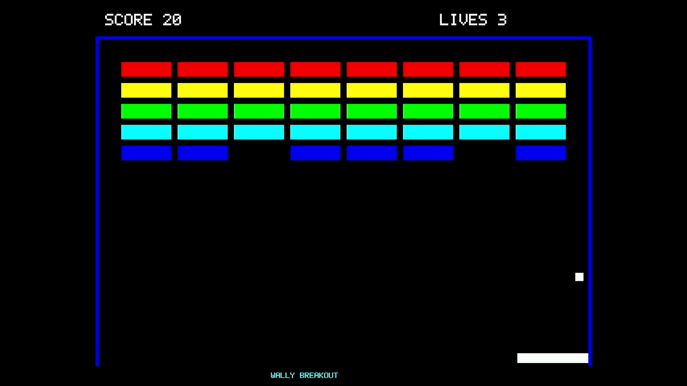

# コミットと追加検証

2026年9月13日。必要な追加確認を実施し、Codex <codex@openai.com>名義の英語メッセージで、mainに5コミットをpushした。GitHub上のmainと手元のHEADが一致し、作業ツリーに未コミット変更がないことを確認した。

| 順序 | コミット | 内容 |
|---|---|---|
| 1 | [1749fe0ef](https://github.com/SoshiroFujimori/wally-game-console/commit/1749fe0ef2f5c2dc759fd91abb59d1a8a7ed7e5d) | 起動時の画像初期化を修正 |
| 2 | [4b4e986b1](https://github.com/SoshiroFujimori/wally-game-console/commit/4b4e986b1325dc026b474264839c3affc0183830) | 全体描画のブロック崩しを追加 |
| 3 | [71364d8b2](https://github.com/SoshiroFujimori/wally-game-console/commit/71364d8b2a178da59678247d1f82079973a15f91) | 同じ設定の描画呼び出しを統合 |
| 4 | [46968347e](https://github.com/SoshiroFujimori/wally-game-console/commit/46968347e249884e596f7bcde3bba00936a59840) | 変更領域だけを描き直す処理を追加 |
| 5 | [d3e181ac4](https://github.com/SoshiroFujimori/wally-game-console/commit/d3e181ac434a01a1f174549b5fbc7ee03a8875b4) | 画面切り替え完了をsleepなしで確認 |

最適化前のゲームと各改善段階を別々のコミットにした。各コミットのソースを個別にビルドしてから実機確認している。公式RasterIXのサブモジュールは9fdcf97a31b2e4247594e06d605871980cd5e9e1のままで、内部に変更はない。今回の差分はexamples/rasterix以下の7ファイルのみ。実験用720p HDMI回路、hdl-util/hdmi、SDWire3の操作、テスト用コード、測定データはコミットに含めていない。

## 追加した起動時の修正

短い描画例を1～2画面で終えた場合、終了後に表示される2枚目の画像領域に前の内容が残り得た。以前の版で「緑を描画→赤を1画面で終了」を実行し、表示された2枚目の307,200画素が赤の期待値と不一致になることを再現した。修正版では、要求された画面数を描く前に両方の領域を初期化する。

ゲームも、起動直後の終了指示で初期化を途中で打ち切らないようにした。初期化の前半にSIGINTを送る実機試験で、ゲームを進めずに正常終了し、表示中の画像領域の全画素と端末設定の復元を確認した。

## 実施した確認

- 5段階を別々にReleaseビルド。すべて成功。テストした最終ソースとコミットしたソースのハッシュも一致。
- ゲーム規則のホスト側10項目を確認。20,000ステップの再実行を含む。
- 部分描画の21,000画面について、独立したCPU側の描画実装と全画素を照合。クリアとゲームオーバーも含む。
- 修正前の短時間終了の不具合を実機で再現し、修正版の1・2・3画面終了では、2枚とも307,200画素の不一致0。
- ゲームの全体描画版と最終版で、起動直後のSIGINTと端末設定の復元を確認。
- ゲーム4段階をそれぞれ80秒間自動操作。すべて400点・残り3でクリアし、各最終画像307,200画素が期待値と一致。
- 既存の三角形描画例を60画面実行。OpenGLエラーと画面切り替えタイムアウトなし。

| ゲームの段階 | 完了数 | ゲーム更新数 | 実行時間 | 最終画素不一致 |
|---|---:|---:|---:|---:|
| 全体描画のブロック崩しを追加 | 1293 | 4798 | 80.020秒 | 0 |
| 同じ設定の描画呼び出しを統合 | 1432 | 4798 | 80.020秒 | 0 |
| 変更領域だけを描き直す処理を追加 | 3956 | 4799 | 80.000秒 | 0 |
| 画面切り替え完了をsleepなしで確認 | 4654 | 4799 | 80.002秒 | 0 |

この表は動作確認の記録であり、アブストの性能比較表とは別である。通常版は実時間に合わせてゲームを進めるため、一定の状態列を1画面ずつ進めた比較実験の値とは混ぜない。

## 今回の映像確認

今回のFPGAは、公開リポジトリの既存DVI出力回路とソースを照合したものを使用した。実験用HDMI回路への再書き込みは行っていない。起動済みのFPGAに対してOBSをバックグラウンドで起動したところ、今回はDVI出力から映像を取得できた。以前の特定条件での認識失敗の記録を否定したり、すべての再起動で認識できると結論づけたりはしない。

キャプチャ入力の1280×720への拡大で生じる横伸びは、録画中だけOBS内の配置を1440×1080、左右240画素の余白に設定して補正した。FPGAの640×480画素の内容は変更していない。Windowsのマウス・キー・画面切り替えは操作せず、OBSのローカルWebSocketで映像入力だけを記録した。

約94.97秒、5,697録画フレームを全デコードし、エラー0。ゲームが見えている5,389フレームすべてで両側の壁を確認でき、走査線欠落の疑いは検出されなかった。検出したボール位置は4,381種類で、10～20秒、30～40秒、50～60秒、70～78秒の各区間で動きを確認した。代表画像で縦横比と表示内容も確認した。

録画と同時に実行した最終版は80.002秒で4,654回の画面切り替え完了（約58.17回/秒）。400点・残り3で終了し、最終画像も全画素一致した。この値は今回のDVI回路での追加確認であり、アブストにある過去の6起動の中央値58.34回/秒とは別の記録である。録画の60 HzはアプリケーションのFPS測定値ではない。

録画（当時の資料。公開版には未収録：`verification/game-dvi.mp4`）／[クリア画面](verification/game-clear.png)／[全録画フレームの解析](verification/hdmi-all-frames.csv)

## 確認中に生じた補助ツールの問題

- SDWire3のWindows共有ドライバーは、許可された管理者操作で対象機器のみ再登録して復旧した。SDカードの起動用3領域は書き込み前後のハッシュが一致し、新しいテスト用フォルダだけを追加した。
- 11本のプログラムを読み込む最初の待ち時間240秒が不足した。ボード側の処理は続いていたため、完了まで追跡し、全11本のハッシュ一致とSDのアンマウントを確認してから試験を開始した。
- ボードにodコマンドがなく、最初の周波数の表示確認は成立しなかった。後からCPUとタイマのデバイスツリー値そのものをSHA-256で照合し、双方20,000,000 Hzであることを確認した。
- 録画自体は成功したが、OBSの配置を戻すとき、無効な枠サイズ0をAPIに渡して復元処理が拒否された。配置は、同じ入力UUIDの保存済み720p設定を参照して復元した。直前の配置は例外で保存できていなかったため、直前の全設定との完全一致を確認したとは扱わない。録画先と音声ミュートは録画直前の値と一致した。今回起動したOBSは、録画・配信が停止していることを確認して正常終了した。

## 保存状態と範囲

ボードのゲームプロセスは終了しており、Linuxの端末は待機状態、SDカードはアンマウント済み。FPGAの電源と回路は維持している。FPGA本体の物理的な電源の入れ直し、他のディスプレイ、電気的規格適合、専用コントローラ、音声、3Dは今回追加した確認の対象外。今回新たにFPGAの配置配線を行ったという意味ではなく、既存の回路ソース31ファイルとの一致を確認したビットストリームを使用した。

回路ファイルSHA-256：f7bc0386db7da40077f04691feb45e50df4118d513bbe4985a84e00a07d29a13。最終ゲームの実機用実行ファイルSHA-256：1dd85a62193d6f06692843e1bbe70fa3d4bf1c6e52cb2add3717000d164417d8。

詳細は[コミット記録](verification/commits.json)、[実機確認](verification/board-dvi-acceptance/results.json)、[録画と同時の実行結果](verification/board-dvi-visual/result.json)、[ファイルハッシュ一覧](verification-manifest.json)を参照。アブストに用いた根拠は[草案の根拠と測定条件](草案の根拠と測定条件.md)に分けている。
