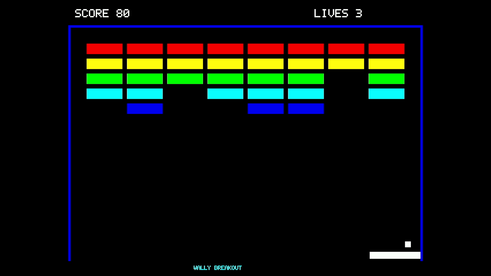
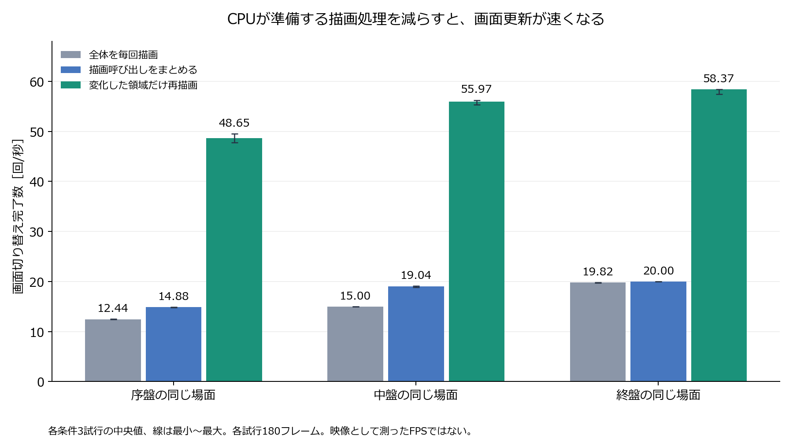
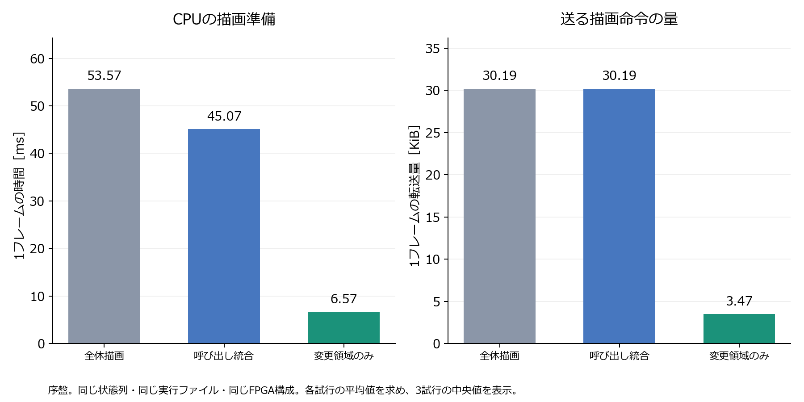
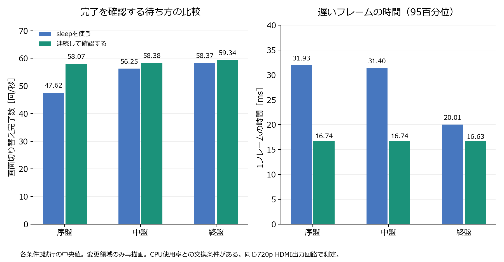
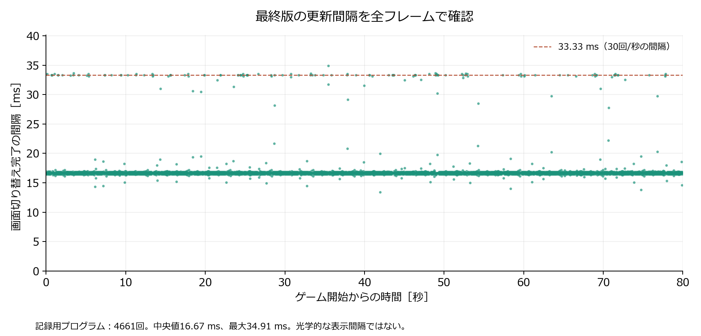

# WallyとRasterIXによる2Dゲームの成果

Nexys Video上のWallyと、公式のRasterIXを組み合わせ、2Dのブロック崩しを動作させた。CPUの回路や20 MHzの周波数を変えず、描画ソフトウェアを改善した。

通常版の80秒間の自動プレイを、FPGAを書き込み直した6回の起動で確認した。6回とも400点・残り3でクリアし、画面切り替え完了数の中央値は**58.34回/秒**、範囲は58.28～58.42回/秒だった。別に15分間の連続動作を録画し、途中の29区間すべてでボールの動きを確認した。

「回/秒」は回路から画面切り替え完了の応答が返った回数である。録画の設定値60 Hzや、画面を光学的に測るFPSとは区別する。実際の映像が動くことは録画で別に確認した。

## 研究として確かめたこと

問いは「描画のためにCPUが準備する仕事を減らすと、同じゲームをどれだけ速く表示できるか」である。ゲームを作ったことに加えて、同じ場面・同じ画像になる条件をそろえ、改善前後を比較した点が研究の成果になる。

改善は次の3段階で行った。

1. 同じ設定で描ける四角形をまとめ、描画の呼び出し回数を減らした。
2. 二つの描画先それぞれに残っている画像を管理し、変わった領域だけを描き直した。
3. 画面切り替え完了の確認にsleepを使わず、次の処理を早く開始した。

起動時には、表示中の画像を初期化処理で上書きしないようにした。これと描画内容の初期化順序の修正によって、再起動時に前の画像の帯が残る問題にも対処した。

## 描画方法を同じ条件で比較

3種類の描き方×3つの場面×各3回の計27試行を行った。各試行は30フレームの準備後、180フレームを測定した。すべて同じ実行ファイルと今回のFPGA回路を使用し、完了の待ち方を固定した。以下は試行単位の中央値で、隣接フレームを独立した試行としては扱っていない。

ここでは同じ状態列を比較するため、描画ごとにゲームを1ステップ進める測定用プログラムを使った。実時間に合わせて進行する完成版の通常プレイとは分けて示す。

| 場面 | 毎回全体を描画 | 呼び出しを統合 | 変更領域だけ描画 | 全体描画に対する倍率 |
|---|---:|---:|---:|---:|
| 序盤 | 12.44 | 14.88 | 48.65 | 3.91倍 |
| 中盤 | 15.00 | 19.04 | 55.97 | 3.73倍 |
| 終盤 | 19.82 | 20.00 | 58.37 | 2.95倍 |

単位は画面切り替え完了数［回/秒］。全4,860個の測定状態について条件間の状態列が一致し、各試行の最終画像307,200画素も期待値と一致した。

序盤のCPUによる描画準備は53.57 msから6.57 msに減った（87.7%減）。転送する描画命令は1フレーム平均30912バイトから3558バイトに減った。

描画準備時間は、描画APIと命令生成の経過時間から、その中に含まれる転送時間を一度だけ引いた値である。転送時間にはCPU・バス・回路の待ちが含まれるので、GPU単体の処理時間とは呼ばない。この結果は、試した場面でCPU側の準備が大きな負担だったことと、それを減らす方法の効果を示す。すべての命令やキャッシュの遅れを完全に特定したという意味ではない。

## 完了の待ち方とCPU使用率

変更領域だけを描く方式で、sleepと連続確認を18試行で比較した。各場面・各方式3回ずつ、同じ実行ファイルを使い、順序を入れ替えて測定した。全3,240個の測定状態と、18枚の最終画像の全画素の確認を通過した。

| 場面 | sleep［回/秒］ | 連続確認［回/秒］ | sleepの95百分位［ms］ | 連続確認の95百分位［ms］ |
|---|---:|---:|---:|---:|
| 序盤 | 47.62 | 58.07 | 31.93 | 16.74 |
| 中盤 | 56.25 | 58.38 | 31.40 | 16.74 |
| 終盤 | 58.37 | 59.34 | 20.01 | 16.63 |

95百分位は、各試行の遅い側5%の境界を求め、その3試行の中央値を示したもの。連続確認はCPUを使い続ける。プロセス全体のCPU使用率は、場面によりsleepで85.3～87.3%、連続確認で99.07～99.13%だった。初期化や最終画像の読み出しも含む値で、ゲーム中だけのCPU使用率ではない。消費電力は測っていない。

## ゲームの動作確認

| 確認 | 結果 |
|---|---|
| FPGAの再書き込みから起動 | 6回すべてで映像を確認。OBSプロセスと入力設定は同じ |
| アプリだけの再起動 | 3回。全5,763録画フレームで両側の壁を確認。重複した帯を検出せず |
| 記録用プログラム | 4,799状態を再実行で確認。最終307,200画素の不一致0 |
| UARTからの操作 | 移動・停止・発射・再開・自動操作切り替え・終了の14入力と映像を確認 |
| ゲームオーバー | 残り0とGAME OVERの表示を確認 |
| 既存の描画例 | 三角形を60フレーム描画 |
| 改善前と途中段階 | 全体描画版、呼び出し統合版もクリアまで動作 |
| 連続動作 | 900.000秒、52,322回の切り替え完了。29区間で継続した動きを確認 |

記録用プログラムの切り替え完了間隔は中央値16.67 ms、95百分位17.01 ms、99百分位33.34 ms、最大34.91 msだった。記録による負担があるので、通常版の測定とは分けて示す。

状態の再実行は製品と同じゲーム更新コードをホストで動かす確認であり、規則を独立に二重実装した検証ではない。画素比較には、別のCPU側の描画実装を使った。詳しい確認範囲は[METHODS.md](METHODS.md)に記す。

## HDMIの問題をどう切り分けたか

以前は映像を認識できず「Video Format Not Supported」になる起動があった。OBSの再起動だけでは再発を防げなかったため、失敗した録画も保存した。

同一の試験回路で、送信を15秒停止してからHDMI方式とDVI方式を切り替えた8試行では、HDMIが4回中4回認識され、DVIは4回中0回だった。一方、いったん映っている状態で方式だけを切り替えると、どちらでも映像を維持できた。この接続先での「新しく映像を認識する処理」に、HDMI固有の信号形式が関係することを示す。特定の情報パケット一つだけが原因とまでは言えない。

最終候補では、[公式のhdl-util/hdmi](https://github.com/hdl-util/hdmi)を変更せず使用し、1280×720のHDMI信号を出力した。640×480のゲーム画像は縦横同じ1.5倍で960×720に拡大し、左右に160画素の黒帯を入れた。OBS側でも縦横同じ倍率で取り込むので、図形が横に伸びない。

今回の回路はVivado 2025.2で通常のCVWビルドから生成した。セットアップ余裕は0.066 ns、ホールド余裕は0.008 ns。全115,981本の配線が完了し、配線エラーとDRCエラーは0、内部の未制約終点は0だった。警告の内訳と確認内容は別の記録に保存した。シミュレーションと、実際に画面が出ることの確認は別々に実施した。

シリアライザーの元のRTLをそのままシミュレーションした場合には、外部出力が未駆動になる問題が残った。その結果も保存し、合成後の回路をAMDのプリミティブモデルで確認した。さらに配置配線後の4本の出力接続と実機映像を確認した。元のRTLシミュレーションも成功した、とは扱っていない。

## 発表で言えることと残る範囲

中間発表では「試した2D描画でCPUの命令準備が大きな負担になっていることを、時間の内訳と処理の変更によって特定した」と説明できる。過去の中間測定と今回の数値は、プログラムや表示回路の条件を明記して分けて示す。

中間発表の根拠には、別に保存した[CPUの描画命令準備に関する追加実験](../../E5/results-ja.md)を使える。そこでは図形と転送量を保って呼び出し回数を変える比較と、呼び出し回数を保って図形数を変える比較を行った。その時点のHDMI未確認という記録は書き換えず、今回のHDMI復旧・実演確認を別の成果として追加する。

最終発表では「同じ画像・状態になる条件で描画方法を比較し、変更領域の再描画などによって更新を高速化し、実際の2Dゲームの動作を確認した」と説明できる。試作・測定・改善・再検証が対応しているので、実装の報告にとどまらない構成になる。

この成果は、接続したWindowsのキャプチャ機器と2Dゲームの範囲である。FPGA本体の物理的な電源入れ直し、別の表示機器、HDMIの電気的規格適合、音声、Wiiコントローラー、人が操作したときの使いやすさ、3Dゲーム性能は検証していない。より高度なCPUが必須という結論も、この実験からは導かない。

## ソースと変更の扱い

公式RasterIXはコミット9fdcf97a31b2e4247594e06d605871980cd5e9e1から変更していない。HDMIコアも公式83b1c9543a91b776671a44e68e130f81cae437b7を使用した。テスト・録画・SDWire操作用のスクリプトはリポジトリの外にある。変更はHDMI出力、起動処理、ゲーム追加、呼び出し統合、部分描画、完了待ちの6つのパッチに分け、順方向・逆方向の適用を確認した。

コミット、push、ステージングは行っていない。新しいHDMI依存のチェックアウトと.gitmodulesは準備済みだが、gitlinkをインデックスへ記録する操作は、コミットが許可された時点に残している。

回路ファイルSHA-256: `3f7cdbfc5402e05761b4d503295064e9831844b2c3b5152b4a82e01f4d0e299f`

生成日時（UTC）: 2026-09-11T01:14:26.302011+00:00
