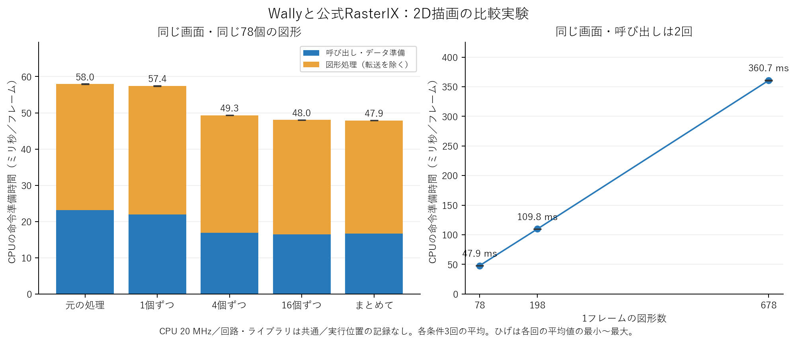

# CPUの描画命令準備に関する追加実験

前回の「命令準備に約57.6ミリ秒かかる」という結果に対して、具体的に何を変えると時間が減るかを調べた。今回確認できた制約は、**細かい描画呼び出しを繰り返す負担**と、**図形ごとに頂点や描画命令を準備する負担**である。

Wallyの20 MHz、元のFPGA回路、公式RasterIXを保ち、リポジトリ外の比較用アプリケーションだけを変更した。2Dのブロック崩しを使用した。既知の文字テクスチャ問題を避けるため、フォントは前回と同じ1ページのものを使用した。その不具合への公式RTLの修正は行っていない。前回の結果ファイルは更新していない。

## 1. 同じ画面を、まとめて渡す

78個の四角形、312頂点、画素の色、描画順を保ったまま、glBegin/glEndで図形を渡す回数を変えた。図形と文字は、それぞれ同じ描画設定の範囲内でまとめた。各条件は30フレームの準備後に180フレームを測定し、3回繰り返した。表は3回の平均で、括弧内は各回の平均値の最小–最大である。

| 渡し方 | 呼び出し回数/フレーム | 命令準備 ms/フレーム | 画面更新 回/秒 |
|---|---:|---:|---:|
| 元の処理 | 78 | 57.958（57.843–58.117） | 11.962 |
| 比較用の処理で1個ずつ | 78 | 57.444（57.261–57.537） | 11.959 |
| 4個ずつ | 21 | 49.305（49.247–49.361） | 14.470 |
| 16個ずつ | 6 | 48.043（47.940–48.102） | 14.724 |
| まとめて渡す | 2 | 47.883（47.818–48.004） | 14.707 |

元の処理からまとめる処理への変更で、命令準備は57.96 msから47.88 msへ短縮した（17.4%減）。画面更新は22.9%増えた。比較のための書き直しによる影響を分けるために設けた「1個ずつ」の条件から見ても、命令準備は16.6%減った。

この比較では、描画回路へ送る量は全条件で34332バイト/フレームだった。転送量を削減せず、CPU側で図形を渡す回数を減らすことで改善した。一方、16個ずつからさらにまとめても大きな差はなく、まとめるだけでは負担の大部分が残った。呼び出し回数とともにコードやキャッシュの使われ方も変わり得るため、1回の呼び出し固有の時間を厳密に測ったとは解釈しない。

## 2. 渡す回数を保ち、図形数を変える

ブロックを複数の小さい四角形に分割した。画面の見た目と解像度は同じで、描画を呼び出す回数も2回のままである。198個と678個の条件は、30フレームの準備後に120フレームを測定し、各3回繰り返した。

| 図形数/フレーム | 呼び出し回数 | 命令準備 ms/フレーム | 画面更新 回/秒 |
|---|---:|---:|---:|
| 78 | 2 | 47.883 | 14.707 |
| 198 | 2 | 109.816 | 7.015 |
| 678 | 2 | 360.655 | 2.320 |

渡す回数を減らした後にも、図形数に応じて命令準備の時間が大幅に増えた。変わらないブロックまで毎フレーム処理し直すことが、改善すべき具体的な負担と考えられる。この実験では頂点数と三角形数も同時に増えるため、それぞれ単独の費用は分離していない。また、転送量も増えるが、上表の命令準備からは測定した転送処理の区間を除いている。

## 3. 動くゲームでも確認する

各場面を同じゲーム状態から開始し、30フレームの準備後に180フレームを測定した。各組み合わせは1回の測定であり、ゲーム全体の平均性能ではない。

| 場面 | 元の命令準備 ms | まとめた命令準備 ms | 元の画面更新 回/秒 | まとめた画面更新 回/秒 |
|---|---:|---:|---:|---:|
| 序盤 | 54.001 | 44.583 | 12.275 | 14.891 |
| 中盤 | 43.579 | 35.810 | 14.956 | 18.956 |
| 終盤 | 33.072 | 27.309 | 19.643 | 19.939 |

全6条件の途中のゲーム状態は、合計1080フレームで既存のホスト側の状態記録と一致した。序盤・中盤では画面更新にも改善が見られた。終盤では準備が短くなっても画面更新の差は小さく、表示完了を待つ区間などの影響が残った。ゲームは自動操作で、描画1フレームにつき設計上の1ステップだけ進む方式を保っている。

## 4. どのコードを実行していたか

公式コードでは、glEndからVertexPipeline::drawObjが呼ばれ、描画設定の確認、要素ごとの設定データの受け渡し、頂点ごとの処理が続く。CPU上のWorkerでは、VertexTransformerCalc::pushVertex、図形の組み立て、Rasterizer::rasterizeや描画命令の作成が行われる。該当する公式ソースとコミット・行番号を[source-evidence.json](source-evidence.json)に保存した。

実行位置の記録は、対象コードを絞る補助資料として使用した。細かい7 msの記録は命令準備を約26.2%遅くしたため、その方式による本測定は実施していない。別の計画で記録間隔を広げ、記録なしの対照条件と各3回比較した。

| 記録間隔の指定値 | 命令準備 ms | 記録なしからの増加 | 記録数 |
|---|---:|---:|---:|
| 記録なし | 57.768 | +0.00% | 0 |
| 41 ms | 59.942 | +3.76% | 951 |
| 73 ms | 58.956 | +2.06% | 528 |
| 113 ms | 58.522 | +1.31% | 337 |

記録の回数は、各関数が使った正確な時間の割合を意味しない。タイマーの粒度、通知の遅れ、計測による影響があるため、関数単位の厳密な寄与率は断定しない。区間時間と、図形の渡し方・数を変える実験を組み合わせて判断する。関数名と記録数の全結果は[analysis.json](analysis.json)に含めた。

## 5. 確認範囲と、まだ断定できないこと

今回の3つの本測定計画は合計39回で、各回の最終307200画素がソフトウェアの期待画像と一致した。途中の状態ハッシュは合計6660フレームで照合した。SD経由で回収した93ファイルのハッシュが一致し、各回のCSVはUART経由の保存内容とも一致した。代表7枚の実機フレームバッファは、ホスト側で生成した画像とも全画素一致した。

測定に使ったboot12では、HDMIキャプチャが「Video Format Not Supported」を表示した。回路の再起動、USBの再初期化、OBSの形式指定でも、この時点では解消していない。今回の画素の正しさと画面更新数は、フレームバッファの読み戻しと回路の完了カウンタで確認したものである。測定中の正常なHDMI映像を確認したとは扱わない。最終復帰時の状態は[final-restoration.json](final-restoration.json)に別途記録する。

測定データの回収後、CPUやRasterIXを使わないHDMI専用の試験回路でも、同じ形式エラーが再現した。CPUによる描画命令準備を行わない状態でも再現しており、共通の映像出力回路、ケーブル、受信機のどこに原因があるかは未確定である。[capture-observations.json](capture-observations.json)に記録した。

CPUのキャッシュミスや命令ごとの停止時間、各関数の厳密な時間寄与までは測っていない。また、単純に高速なCPUへ交換する必要があるという結論は、この結果だけからは導けない。

## 中間発表と最終発表へのつなげ方

中間発表では「CPUによる描画命令の準備が主な制約となり、描画呼び出しの繰り返しと図形数に依存する処理が負担であることを比較実験で確認した」と説明できる。

最終発表では、変わらない部分の描画データを再利用する、または変化した部分を中心に更新するなど、毎フレーム準備する図形の量を減らす方法が候補になる。今回の結果からの提案であり、それらの方法によるゲームとしての性能向上は今後の検証事項である。

詳しい条件・区間の定義は[METHODS.md](METHODS.md)、各回の結果は[cases.csv](cases.csv)を参照。CVWと公式RasterIXのリポジトリに実験用の変更・コミット・プッシュは加えていない。
