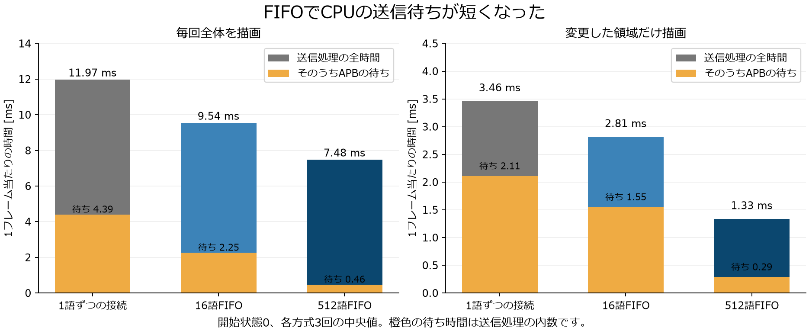
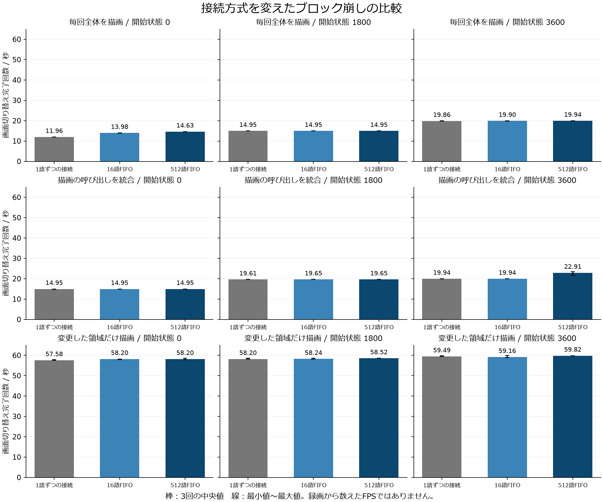
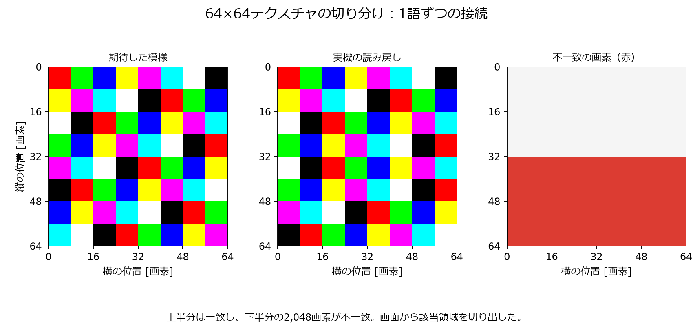
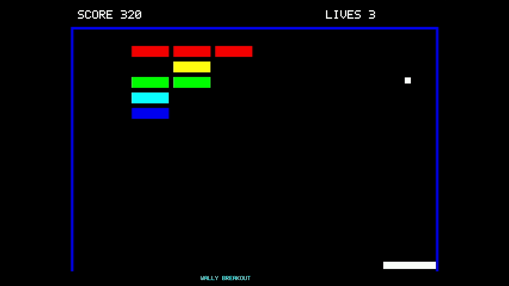

# FIFOの比較実験：結果と判断

2026年10月8日の実機測定。中断後に再開し、通常版でもLinux起動、全307,200画素の一致、5分間の連続動作とその後の画面一致を確認した。FIFOの主比較90回は完了している。各回路の再書き込み後にも18回・3,240フレームの補助比較を行い、検査した6画面が全画素で一致した。生成済みIPを使い回さずに通常版を再生成し、検査済み回路とFPGAの設定データが完全一致することを確認した。新規生成ファイルでのLinux起動と画像一致も確認した。30秒の実機動画も保存・検査した。大きいテクスチャの問題と、映像を受信できる場合とできない場合がある問題は残っている。

## 先に結論

今回作った「1語を渡し、受け取り通知が戻るまでAPBを待たせる接続」でも、ブロック崩しは動いた。したがって、**FIFOがなければ接続できない、という説明は適切ではない。** クロックをまたぐ受け渡しを正しく設計すれば、別の接続方法も使える。

一方、実際の20 MHzのWallyでも、FIFOによってCPUの送信待ちが減った。512語FIFOは、今回比べた3方式の中で送信待ちが最も短く、回路の追加費用も小さかった。この結果は、現状の512語FIFOを採用し続ける根拠になる。ただし、512語があらゆる条件で最適であることや、すべてのFIFOなし接続より速いことを示した実験ではない。

さらに、公式RasterIXの命令解析回路に、入力の間隔と受け取り停止が重なると値を重複して扱う問題を再現した。これはFIFOの原理上の必要性とは別問題である。512語FIFOでも、繰り返し試験中の大きいテクスチャで画素不一致が発生した。ブロック崩しの性能比較には、画像検査を通過した結果だけを採用した。

## 1. 何を変えたか

CPUからRasterIXへ描画命令を渡す部分だけを、次の三つに取り替えた。逆方向の応答用FIFOは512語のままとした。

| 方式 | APBへの書き込みが終わる条件 | 保持できる命令 |
|---|---|---|
| 1語ずつの接続 | RasterIX側が受け取ったという通知がCPU側へ戻る | 受け渡し中の1語。後続の待ち行列はない |
| 16語FIFO | FIFOに空きがあり、値を入れられる | 最大16語 |
| 512語FIFO | FIFOに空きがあり、値を入れられる | 最大512語 |

1語は32ビットである。命令列の区切りを表す1ビットも同時に渡す。1語ずつの接続にも、その値を安定して保持するレジスタと、通知信号を同期する回路はある。「何も保持しない接続」ではない。

1語ずつの接続では、要求と確認を上げ、その後下げる4相ハンドシェイクを使った。これは安全な接続の一例であり、最速の方式として選んだものではない。2相の通知、複数語の同時転送、位相関係を利用した接続などは、今回の比較対象ではない。

CPUは20 MHz、RasterIXは100 MHz。両方のクロックは同じ基準クロックに由来する。「周波数が違えば必ず非同期FIFOが必要」とは結論しない。今回の比較では、既存の非同期FIFOと、それに代わる安全な受け渡しを、同じシステムに組み込んだ。

## 2. どう公平に比べたか

三つの方式で同じ実行ファイルを使った。CPU、RasterIX、画面サイズ、SDカードの起動領域、ゲームの入力列をそろえた。計測用カウンタは三つに共通で、製品リポジトリの外に置いた。各回路について、配置・配線後のタイミング、DRC、CDCを確認してから実機へ書き込んだ。 既存のRTL・設定・制約280ファイルも照合し、共通部分の違いは命令の接続先と、読み出し専用の実験識別値だけであることを確認した。16語FIFOの生成設定、1語ずつの受け渡し回路とその制約は、明示的な追加ファイルとして管理した。

ゲームの開始状態は、初期状態、1,800回進めた状態、3,600回進めた状態の三つ。各状態から30フレームの慣らし運転をし、その後180フレームを計測した。全体描画、呼び出しの統合、変更領域の描画をそれぞれ3回実行し、方式の実行順を回ごとに変えた。

ゲームの比較は3接続方式×3状態×3描画方式×3回＝81回。これに、生成済みの同じ命令列を送り直す試験を各接続方式3回、計9回加えた。合計90回、16,200フレームを計測した。命令列の再送は、通常のゲーム実行とは区別する。

各接続方式の各状態・描画方式の初回、合計27条件で、最終画面の307,200画素すべてを、別に用意した正解画像と比較した。すべて一致した。全90回で、ゲームの状態列、各フレームの転送量、ハードウェアが数えた転送語数を照合した。3回の繰り返しは各回路の1回の起動内であり、独立した3回の電源投入ではない。

## 3. CPUの送信待ちは減ったか

次は初期状態から毎回全体を描いた場合の、3回の中央値である。

| 1フレーム当たり | 1語ずつの接続 | 16語FIFO | 512語FIFO |
|---|---:|---:|---:|
| 送信処理の全時間 [ms] | 11.971 | 9.542 | 7.481 |
| そのうちAPBの待ち時間 [ms] | 4.393 | 2.254 | 0.465 |

送信処理は、CPUがメモリ上の命令を読み、周辺機器のレジスタへ順に書く処理である。APBの待ち時間は、その書き込みが回路側の都合で待たされている時間だけを数えた。後者は前者に含まれるので、二つを足してはいけない。

512語FIFOは、1語ずつの接続に比べ、APBの待ちを約89%減らした。ただし、1語ずつの接続の待ちには、描画回路の停止だけでなく、クロックをまたいで受け取り通知が往復する時間も含まれる。

16語FIFOと512語FIFOのどちらでも、実機ゲーム中に待ちが発生した。したがって、「Wallyは遅いので、送信側が待つ場面はない」とは、この実測に反する。ただし、このカウンタだけでは、個々の停止を描画処理、メモリ転送、表示同期に分類できない。「RasterIXの計算能力がCPUより低い」という意味でもない。

## 4. ゲーム全体はどれくらい速くなったか

表は画面切り替え完了回数／秒の中央値である。HDMI映像を録画して数えたFPSではない。

| 開始状態 | 描画方式 | 1語ずつの接続 | 16語FIFO | 512語FIFO |
|---:|---|---:|---:|---:|
| 0 | 毎回全体 | 11.964 | 13.982 | 14.628 |
| 0 | 呼び出しを統合 | 14.953 | 14.953 | 14.953 |
| 0 | 変更領域のみ | 57.579 | 58.202 | 58.202 |
| 1800 | 毎回全体 | 14.953 | 14.953 | 14.954 |
| 1800 | 呼び出しを統合 | 19.611 | 19.647 | 19.648 |
| 1800 | 変更領域のみ | 58.202 | 58.241 | 58.521 |
| 3600 | 毎回全体 | 19.864 | 19.902 | 19.938 |
| 3600 | 呼び出しを統合 | 19.938 | 19.938 | 22.907 |
| 3600 | 変更領域のみ | 59.488 | 59.161 | 59.819 |

初期状態の全体描画では、約11.96回／秒から14.63回／秒へ増えた。一方、変更領域のみの描画では約58〜60回／秒で、FIFOの違いによる差は小さい。

CPUの送信が早く終わっても、表示回路が次の画面へ切り替えられる時刻まで待つ場合がある。今回の数値でも、送信時間の減少が、そのまま同じ割合の更新回数の増加にはなっていない。「送信待ちを減らす効果」と「ゲーム全体を速くする効果」を分ける必要がある。

図の線は3回の最小値〜最大値で、信頼区間ではない。全値は `results/runs.csv` に保存した。差が小さい条件について、3回の測定だけから普遍的な優劣や統計的有意差を主張しない。

生成済み命令列の再送では、1語ずつ47.85、16語58.52、512語58.84回／秒だった。この試験は命令を作る処理を省くため、ゲーム全体の速度として示してはいけない。

### 4.1 回路の再書き込み後の確認

主比較の3回の繰り返しは、それぞれ一度の起動中で行った。その条件だけに結果が依存していないかを確かめるため、512語、1語ずつ、16語の順にFPGAを書き込み直し、Linuxを起動し直した。SDから同じ実行ファイルを読み、ハッシュを確認したうえで、初期状態の全体描画と変更領域の描画を各3回測った。FPGA本体の電源を物理的に入れ直した試験ではない。

追加分は18回、3,240フレーム。すべてでゲームの状態列、転送量、ハードウェアの転送語数、画面切り替えの連番を確認した。各方式・描画方法の初回、計6画面を全画素比較し、すべて一致した。主比較90回の集計はそのまま保持し、追加分と混ぜて中央値を取り直してはいない。

初期状態の全体描画について、次の表の左側が主比較、右側が再書き込み後の中央値である。

| 方式 | APBの待ち [ms] | 送信処理全体 [ms] | 画面切り替え完了回数／秒 |
|---|---:|---:|---:|
| 1語ずつ | 4.393 → 4.387 | 11.971 → 11.931 | 11.964 → 11.963 |
| 16語FIFO | 2.254 → 2.267 | 9.542 → 9.564 | 13.982 → 13.424 |
| 512語FIFO | 0.465 → 0.469 | 7.481 → 7.419 | 14.628 → 14.628 |

FIFOによる送信待ちの減少は再現した。一方、16語FIFOの更新回数は、追加の3回の中でも13.03〜13.87回／秒に変動した。ログでは、各画面の更新間隔が約66.9 ms（表示4周期）または83.6 ms（5周期）となり、その比率が変わっていた。送信時間はほぼ同じでも、画面切り替えを待つ時間まで同じになるわけではない。どの割り込みやキャッシュの状態が変動を引き起こしたかまでは、この試験では区別していない。

変更領域だけを描く場合は、追加試験の中央値が3方式とも約58.20回／秒となった。従って、小さい更新回数の差を常に生じる優劣として扱わず、CPUの送信待ちと回路資源を採用判断の主な根拠とする。追加結果は `results/reconfiguration`、生ログとフレーム別CSVは実験ルートの `board-reconfiguration` に保存した。

### 4.2 連続動作と計測の影響

512語FIFO版では、製品ゲームを自動入力で300.011秒連続実行し、17,841回の画面更新処理を完了した。その後の起動し直しでも、初期状態の画面は全307,200画素が一致した。これは映像を録画して確認した結果ではない。

主比較は詳細な時間計測を有効にしている。時計を読む処理の負担を確かめるため、途中の計測を減らし、フレーム全体だけを測る設定でも補助試験を行った。初期状態の全体描画は14.688回／秒、変更領域の描画は58.202回／秒で、どちらも全画素が一致した。主比較の中央値14.628、58.202回／秒と大きく食い違わなかった。ただし、この補助試験は各1回なので、計測の影響を厳密に推定したとは扱わない。

## 5. 回路の費用

次はCPUからRasterIXへの接続モジュールだけの、配置・配線後の使用量である。計測用カウンタやシステム全体の使用量ではない。

| 接続モジュール | LUT合計 | フリップフロップ | 18 Kbit BRAM |
|---|---:|---:|---:|
| 1語ずつの接続 | 15 | 80 | 0 |
| 16語FIFO | 85 | 178 | 0 |
| 512語FIFO | 96 | 165 | 1 |

16語FIFOは一部をLUTメモリとして実装し、512語FIFOはBRAMを使う。このため容量が増えても、フリップフロップ数まで単調に増えるわけではない。LUT数にはメモリとして使われるLUTも含む。

参考として、検査済み通常版のシステム全体はLUTの49.90%、BRAMの58.90%、DSPの8.24%を使用した（`latest/qualification-synth-retime/utilization.rpt`）。FIFOの18 Kbit BRAM 1個は、ボードのBRAM容量の約0.14%に相当する。これは容量としての負担が小さいという意味であり、未使用資源が多ければ動作周波数にも余裕がある、という意味ではない。

少ない回路で接続するなら1語ずつの方式に利点がある。CPUの待ちを減らすなら、今回の3方式では512語FIFOに利点がある。現在のボードに対しては、追加のBRAM 1個とLUT数の差を払って512語FIFOを維持する判断が妥当と考える。ただし、32語、64語、128語などの最小十分容量までは調べていない。

## 6. 更新で直した設定の食い違い

Wally公式の `2064ca2bb8a88e3e3ec43753be93d00bef49345b` と、RasterIX公式の `9269a01c9bd4c3342bfa70ef8e3cdd751c15c6d0` を取り込んだ。コミット・プッシュはしていない。RasterIX公式サブモジュールのファイル自体は変更していない。

更新後のRasterIX回路は、画像を2,048バイトごとのページに分けて扱う。一方、ソフトウェアの既定値は4,096バイトだった。そのままでは文字の一部が欠け、307,200画素中519画素が正解と違った。Wally側の `examples/rasterix/CMakeLists.txt` に `RIX_CORE_TEXTURE_PAGE_SIZE=2048` を明記し、同じ16語FIFOのビットストリームで再試験したところ、全画素が一致した。今回の比較は、その修正後の同一実行ファイルで行った。

既存のCMakeビルドフォルダーには以前のキャッシュ値が残ることがある。再現時は新しいビルドフォルダーを使うか、設定時に `-DRIX_CORE_TEXTURE_PAGE_SIZE=2048` を明示する。画像が違っていた修正前の速度は、性能比較から除外した。

### 6.1 更新後のCPUの補助確認

接続方式の比較とは別に、Wallyに用意されている既存の命令テストも実行した。RV64Iの50件に加え、乗除算13件、不可分操作18件、圧縮命令37件、単精度浮動小数点139件、倍精度浮動小数点150件が成功した。追加分357件の正解データは、公式テストのソースとSail参照モデルから生成した。

これはVerilator上のRV64GC構成の検査であり、全命令・全条件や、FPGAの配置・配線まで保証するものではない。最初の試行では追加分の正解データがなかったため実行できなかった。その記録も残し、データ生成後の成功と区別している。詳細は実験フォルダーの `extended-cpu-tests.json` にある。

### 6.2 通常版の回路生成と起動

計測用カウンタを入れていない通常版も、CPU 20 MHz、RasterIX 100 MHz、画素クロック25.2 MHzのままで生成した。合成時のレジスタの再配置を有効にし、配置と配線の最適化設定を見直した。セットアップ余裕は0.018 ns、ホールド余裕は0.014 nsで、タイミング条件を満たした。配線エラー、DRCエラー、内部の未制約端点は0だった。余裕が大きいという意味ではない。

この設定を `fpga/generator/wally.tcl` に記録した。細かな回路の位置を固定する試行も実験用コピーで行ったが、製品リポジトリには採用していない。公式RasterIXのソースは変更していない。

通常版のビットストリームを実機へ書き込み、SDカードからLinuxが起動し、rootでログインできた。中断後の再開時には、同じ回路を再書き込みして起動とソフトウェアのハッシュを確認し、ブロック崩しの全307,200画素が正解と一致した。さらに製品ゲームを300.011秒間連続実行し、17,853回の画面更新処理を完了した。終了後に描画プログラムを起動し直しても全画素が一致した。これは計測用カウンタを入れていない通常版での結果であり、90回の主比較とは別に記録した。

続いて、現在の製品リポジトリのソースから新しい作業フォルダーを作り、生成済みIPをコピーせず、`make nexysvideo-rasterix` をIP生成から実行した。この通常の生成手順でも、セットアップ余裕0.018 ns、ホールド余裕0.014 nsでタイミング条件を満たした。配線エラー、DRCエラー、内部の未制約端点は0。CDCの警告分類は先の検査済み回路と一致し、内容を確認した。配置場所を固定する追加制約や、生成後の手動修正は使っていない。

新しく生成したビットストリームを実機へ書き込み、Linuxの起動と実行ファイルのハッシュを確認した。初期状態の全体描画、1,800ステップ後の呼び出し統合、3,600ステップ後の変更領域描画の3条件で、画面の全307,200画素が一致した。全条件でゲーム状態列・転送量・画面切り替え連番も主比較の対応条件と照合した。

新規生成ファイルは、生成日時などのヘッダーを除くFPGAの設定データ5,703,276バイトが、先に300.011秒・17,853回の連続動作を確認した通常版と完全一致した。ハッシュだけでなく、設定データ全体をバイト単位で比較した。そのため同一回路の5分間試験は重複実行せず、既存の連続動作の証拠を対応付けた。新規ファイルの書き込み後には、上の3条件に加え、描画プログラムを初期状態の変更領域描画で起動し直し、全画素一致を確認した。

現在の実機には、この新規生成した通常版を書き込んでいる。上記はメモリ上の画素と画面切り替えの検査であり、これとは別にHDMI経由の実機動画を30秒間保存・検査した。映像については7.3節に示す。

新規生成版の検査は `fresh-product/qualification`、実機ログは `board-fresh-product` に保存し、要約をこの文書の `results/product-qualification.json` と `results/product-board-validation.json` にコピーした。ビットストリームのSHA-256は `16173de97a91e711cd7bc5389acd9739807adebedf192efc29fe78f5b96c0acf`。

通常版の検査結果は `latest/qualification-synth-retime/qualification.json`、再開後の起動記録は `resumed-product-boot-result.json`、描画と連続動作は `board-v2/latest` に保存した。連続動作の最初の確認スクリプトは、ゲームとは異なる測定プログラム用の完了文字列を期待して止まったが、ゲーム自体は300.011秒後に終了コード0で完了していた。実際の完了文字列とUARTの終了コードを確認するように直し、ゲームを再実行せず、その後の画面検査へ進んだ。このスクリプト上の誤りも記録した。

## 7. 追加試験で見つかった未解決の問題

### 7.1 大きいテクスチャの描画

32×32、64×64、256×256の色付きタイル画像を描き、画面全体を正解画像と比較する試験を追加した。16語FIFOと1語ずつの接続では、64×64で不一致が出た。512語FIFOでは最初の3回は全サイズが一致したが、4回目の256×256で9,216画素が不一致になった。512語FIFOで隠れることがあっても、問題が解消したわけではない。

命令解析を行う公式の `CommandParser.v` だけを切り出し、入力がときどき途切れ、受信先がときどき待たせる状況を作った。入力はVALIDとREADYの両方が1になるまで値を変えない、正しい送信手順である。それでも、ページ番号0,1,2,3…に対し、0,1,1,2…と重複する現象が再現した。12条件中6条件で失敗した。

この回路には、まだ受け取っていない値を一時保存・処理してしまう箇所がある。受け取り成立を確認する修正候補を、リポジトリ外のコピーだけに適用すると、同じ12条件が成功した。これにより原因を絞れたが、修正候補を実機やあらゆる条件で検証したわけではない。公式ソースへの適用や、開発者への送信はしていない。

この命令解析回路は、更新前の固定版にも同じ内容で存在した。今回の公式更新で初めて入り込んだコードではない。実機の画像の崩れ方も、解析回路だけの再現結果と整合する。ただし、実機で修正前後を比較して因果関係を確定する試験はまだ行っていない。

ブロック崩しの画像一致と、大きいテクスチャをいつでも正しく描けることは別である。論文では、一般的な描画全体の正しさまで確認したとは書かない。再現コードと修正候補は実験フォルダーの `upstream-reproducer` にある。 FPGAを使わずに追試できる一式も [再現試験ZIP](results/command-parser-reproducer.zip) にまとめ、Verilator 5.026で実行を確認した。ZIP内の `python3 reproduce.py` で、公式版の6件の失敗と修正候補の12件の通過を再現できる。開発者への送信はしていない。

### 7.2 表示周期

表示回路の設定名は60 Hzだが、公式DVI回路は横0〜800、縦0〜525まで数える。1周期は801×526＝421,326画素クロックとなり、25.2 MHzでは16.7193 ms、約59.811 Hzとなる。実測の切り替え間隔の中央値約16.719 msと整合した。

生ログの `late_60hz` は厳密な1/60秒を基準にしているため、表示周期に追従しているフレームも遅れとして数えてしまう。今回の結論に、この件数は使わない。この周期のずれがキャプチャ不具合の原因だと確定したわけではない。

### 7.3 HDMI経由の動作確認と残る制限

再開直後には、通常版を書き込んでもキャプチャ機器の画像が「Video Format Not Supported」だった。その後、新規生成した通常版で実機検査を終えた時点では、同じキャプチャ機器でブロック崩しの映像を受信できた。前後の通常版はFPGAの設定データが完全に同じで、HDMI形式へ変更する回路修正もしていない。従って、「現行のDVI出力では映像を受信できない」という以前の記述は訂正する。一方、今回は受信できたことだけから、毎回安定して受信できる問題まで解決したとは言えない。受信できたりできなかったりする原因は未確定である。

更新後の通常版で製品ゲームを自動プレイし、75.003秒で4,398回の画面更新処理を完了した。終了コードは0。実行途中の映像を、WindowsのOBSのバックグラウンドAPIで40秒間録画した。録画の終わりにはゲームの指定実行時間が尽きた後の静止画が含まれるため、ゲーム動作中の先頭30秒を、再圧縮せずに取り出した。元の40秒録画とUARTログも保存した。

[通常版ブロック崩しの実機動画（30秒）](results/video/breakout-latest-30s.mp4)

30.017秒・1,801フレームの動画全体をデコードし、全フレームでゲーム画面の青い壁と白いボールを検出した。連続する1,800組のうち1,749組でボールの位置が変化し、長く静止し続ける現象はなかった。1、8、15、22、29秒の静止画も保存し、代表画像を目視確認した。これは映像としてゲームが動くことの確認であり、1,801枚すべての画素を正解画像と照合した検査ではない。全画素一致の検査は、別途読み出したフレームバッファに対して行っている。

ゲームの画像は640×480で、縦横比は4:3である。キャプチャ機器が返す1280×720の画像では横に伸びるため、録画時だけOBS上で1440×1080に整え、左右に黒い余白を置いた。FPGAの描画内容は変更していない。録画後は、OBSの配置、保存先、音声のミュート設定を元に戻した。PCのマウス・キーボードは操作していない。

動画ファイルの記録形式は毎秒60枚だが、これはゲームが毎秒60回更新したことを示す値ではない。性能比較の数値には、前節までの画面切り替え完了カウンタを使う。映像の入力は自動プレイであり、物理コントローラの試験ではない。検査結果は `results/video/validation.json`、フレームごとの位置は `results/video/motion.csv` に保存した。

## 8. 研究ではどう書けるか

> CPUと描画回路の接続方式として、受け取り完了までCPU側を待たせる方式と、16語・512語のFIFOを比較した。同じゲーム状態と実行ファイルを用いて、画面の一致、処理時間、バス待ち時間、回路資源を評価した。FIFOによりCPUの送信待ちは減少したが、変更領域だけを描く場合は表示周期に近く、画面更新回数への影響は小さかった。これらの結果から、本構成では小さい資源増加でCPUの余裕を確保できる512語FIFOを維持した。

「FIFOは必須だった」と主張する必要はない。別の接続でも動くことを確かめ、採用した方式の利点と費用を示したことが、設計の判断を裏付ける。大きいテクスチャの未解決問題と、映像を毎回安定して受信できるかは未確認である点も、検証範囲として併記する。

## 9. データと追試用のファイル

実験全体：`\\wsl.localhost\Ubuntu\home\researcher\nexys-video-tests\fifo-study-20261008`

- `results/runs.csv`：90回の集計値。この文書と同じフォルダーのコピー。
- `results/summary.json`：条件別の中央値、最小値、最大値。
- `results/reconfiguration`：再書き込み後の18回の補助比較。主比較とは別集計。
- `board-v2/{fifo16,mailbox,fifo512}`：フレームごとのCSVとUARTログ。
- `scripts/run-game-matrix-v2.py`：同一実行ファイルを使う実機測定手順。
- `scripts/analyze-v2.py`：状態列、転送語数、画面切り替え連番の照合と集計。
- `scripts/plot-results.py`：図の生成。
- `payload-v2/manifest.json`：実行ファイルのSHA-256。
- `variants/*/qualification*`：回路、配置・配線後の検査結果、ビットストリーム。
- `upstream-reproducer`：命令解析回路の再現試験。
- `fresh-product/qualification` と `board-fresh-product`：通常の生成手順を最初から実行した回路と実機検証。
- `results/command-parser-reproducer.zip`：FPGA不要の単体再現試験一式。
- `resumed-runtime-dependencies.json`：今回の主要ツール・ソース・出力先の実体とマウント先。
- `baseline` と `board`：元の版と、性能比較から除外した画像不一致の記録。

試験・SDWireの操作スクリプト・計測回路は、製品リポジトリに追加していない。SDカードの起動用3領域は変更前後のハッシュが一致している。
