# 二次元ゲーム機の設計を再現するための技術付録

[資料全体の入口](README.md) ｜ [本文を開く](本文.md) ｜ [図と数値例で読む技術詳説](../technical/README.md)

## ジャンプできる目次

- [この付録の使い方](#h0001)
- [分野別案内](#h0008)
- [第I部 HDLとFPGAによるデジタル回路設計](#part_I)
  - [第1章 Wally開発者が使う抽象化階層](#ch_1)
    - [1.1 この本編の到達目標](#s_1_1)
    - [1.2 仕様から実機までの六層](#s_1_2)
    - [1.3 ISAとマイクロアーキテクチャを分ける](#s_1_3)
    - [1.4 動作記述、RTL、構造記述の関係](#s_1_4)
    - [1.5 RTL、論理合成、ゲートレベルという語](#s_1_5)
    - [1.6 一つの信号を六層で追う](#s_1_6)
    - [1.7 説明の確度を三段階に分ける](#s_1_7)
  - [第2章 SystemVerilogから回路を読み取る](#ch_2)
    - [2.1 moduleは回路の境界である](#s_2_1)
    - [2.2 logic、net、変数、driver](#s_2_2)
    - [2.3 assignとalways_comb](#s_2_3)
    - [2.4 always_ffとclock edge](#s_2_4)
    - [2.5 blocking代入とnonblocking代入](#s_2_5)
    - [2.6 resetの種類と優先順位](#s_2_6)
    - [2.7 FSMを状態registerと次状態論理へ分ける](#s_2_7)
    - [2.8 構造記述と暗黙port接続](#s_2_8)
    - [2.9 parameter、package、cvw_t P](#s_2_9)
    - [2.10 generateとprocedural forを区別する](#s_2_10)
    - [2.11 幅、符号、式の途中のbit数](#s_2_11)
    - [2.12 XとZを異常の手掛かりにする](#s_2_12)
    - [2.13 合成可能な記述とtestbench専用記述](#s_2_13)
  - [第3章 資源効率を決めるRTL設計](#ch_3)
    - [3.1 「好ましい書き方」の意味](#s_3_1)
    - [3.2 MUXとpriority論理](#s_3_2)
    - [3.3 演算子と専用資源](#s_3_3)
    - [3.4 bit幅は面積と遅延の設計値である](#s_3_4)
    - [3.5 memoryをBRAMへ推論させる](#s_3_5)
    - [3.6 register enableとclock gating](#s_3_6)
    - [3.7 hardwareの並列化と資源共有](#s_3_7)
    - [3.8 fanout、logic depth、routing](#s_3_8)
    - [3.9 hierarchyを保つ理由とflattenする理由](#s_3_9)
    - [3.10 resource reportを読む](#s_3_10)
    - [3.11 最適化の前後で保存する証拠](#s_3_11)
  - [第4章 Timing closureとpipeline設計](#ch_4)
    - [4.1 register間pathの時間予算](#s_4_1)
    - [4.2 setupとholdを分ける](#s_4_2)
    - [4.3 WNS、TNS、failing endpoint](#s_4_3)
    - [4.4 pipeline化が変えるもの](#s_4_4)
    - [4.5 WallyのF、D、E、M、W](#s_4_5)
    - [4.6 stallは保持、flushは無効化](#s_4_6)
    - [4.7 forwardingとload-use hazard](#s_4_7)
    - [4.8 critical pathをreportから読む](#s_4_8)
    - [4.9 timing修正の順序](#s_4_9)
    - [4.10 latency、throughput、clock frequencyを区別する](#s_4_10)
    - [4.11 timing closureの完了条件](#s_4_11)
  - [第5章 FPGAへ実装されるまで](#ch_5)
    - [5.1 Artix-7の主な資源](#s_5_1)
    - [5.2 build flowの各段階](#s_5_2)
    - [5.3 compile orderとpackage](#s_5_3)
    - [5.4 合成後netlistと配置配線後netlist](#s_5_4)
    - [5.5 XDCはpin表だけではない](#s_5_5)
    - [5.6 primary clockとgenerated clock](#s_5_6)
    - [5.7 input/output delay](#s_5_7)
    - [5.8 false pathとasynchronous clock group](#s_5_8)
    - [5.9 utilizationと配置可能性](#s_5_9)
    - [5.10 bitstreamとsoftware imageを区別する](#s_5_10)
    - [5.11 build結果の保存単位](#s_5_11)
  - [第6章 Clock domain crossingとreset設計](#ch_6)
    - [6.1 clock domainを先に色分けする](#s_6_1)
    - [6.2 metastabilityはsimulationだけでは見えない](#s_6_2)
    - [6.3 一bit levelの二段synchronizer](#s_6_3)
    - [6.4 pulse、toggle、handshake](#s_6_4)
    - [6.5 複数bitを個別同期しない](#s_6_5)
    - [6.6 reset assertionとdeassertion](#s_6_6)
    - [6.7 resetで初期化すべき状態](#s_6_7)
    - [6.8 clock enableと新しいclock domain](#s_6_8)
    - [6.9 本構成の主な境界](#s_6_9)
    - [6.10 CDC review checklist](#s_6_10)
  - [第7章 検証を層に分ける](#ch_7)
    - [7.1 test caseより先にpropertyを書く](#s_7_1)
    - [7.2 lintとelaboration](#s_7_2)
    - [7.3 module simulation](#s_7_3)
    - [7.4 assertion](#s_7_4)
    - [7.5 formal verification](#s_7_5)
    - [7.6 core-levelとISA test](#s_7_6)
    - [7.7 differential verificationとRVVI](#s_7_7)
    - [7.8 integration simulation](#s_7_8)
    - [7.9 合成後・配置配線後の確認](#s_7_9)
    - [7.10 FPGA実機とILA](#s_7_10)
    - [7.11 coverage](#s_7_11)
    - [7.12 bug reportを再現可能にする](#s_7_12)
  - [第8章 Wally開発者の設計・実装規律](#ch_8)
    - [8.1 先にinterface契約を書く](#s_8_1)
    - [8.2 小さい変更単位を作る](#s_8_2)
    - [8.3 Wallyのcoding styleを使う](#s_8_3)
    - [8.4 commentには理由と契約を書く](#s_8_4)
    - [8.5 parameter化し過ぎない](#s_8_5)
    - [8.6 warningを設計情報として扱う](#s_8_6)
    - [8.7 generated fileとsource of truth](#s_8_7)
    - [8.8 変更前に影響範囲を描く](#s_8_8)
    - [8.9 optimizationは測定可能な仮説にする](#s_8_9)
    - [8.10 review可能なcommit](#s_8_10)
    - [8.11 upstreamへ出せる変更の条件](#s_8_11)
    - [8.12 開発者が残す設計記録](#s_8_12)
  - [付録K 回路とFPGAの基礎](#ch_K)
    - [K.1 0と1で値を表す](#s_K_1)
      - [bitとbyteと16進数を小さな数で読む](#h0301)
    - [K.2 論理ゲートをつないで回路にする](#s_K_2)
      - [論理ゲートをつなぐと何ができるか](#h0315)
    - [K.3 値を覚える回路](#s_K_3)
      - [計算する回路と覚える回路を組み合わせる](#h0325)
    - [K.4 CPUがプログラムを実行する](#s_K_4)
    - [K.5 FPGAの中へ回路を作る](#s_K_5)
      - [論理式がFPGAの中へ入るまで](#h0342)
      - [CPUをFPGAに作った後、ゲームのfor文はどこで動くか](#h0347)
    - [K.6 FPGAチップと基板を区別する](#s_K_6)
- [第II部 Wally CPUとSoCアーキテクチャ](#part_II)
  - [第9章 Wallyの階層と構成を読む](#ch_9)
    - [9.1 core、SoC、board topを区別する](#s_9_1)
    - [9.2 wallypipelinedcoreの主要unit](#s_9_2)
    - [9.3 cvw_tは構成契約である](#s_9_3)
    - [9.4 configurationから回路が生成されるまで](#s_9_4)
    - [9.5 interfaceから階層を理解する](#s_9_5)
    - [9.6 IFUを読む観点](#s_9_6)
    - [9.7 IEUを読む観点](#s_9_7)
    - [9.8 LSU、cache、MMUを読む観点](#s_9_8)
    - [9.9 privileged unitを読む観点](#s_9_9)
    - [9.10 新しい機能をどこへ置くか](#s_9_10)
  - [第10章 命令pipelineとarchitectural state](#ch_10)
    - [10.1 一命令の流れを最後まで追う](#s_10_1)
    - [10.2 architectural stateと一時状態](#s_10_2)
    - [10.3 control hazardと分岐予測](#s_10_3)
    - [10.4 data hazardとforwarding priority](#s_10_4)
    - [10.5 structural hazard](#s_10_5)
    - [10.6 precise trapとcommit](#s_10_6)
    - [10.7 CSR、interrupt、exception](#s_10_7)
    - [10.8 performance counterを解釈する](#s_10_8)
    - [10.9 pipeline変更のreview表](#s_10_9)
  - [第11章 Memory systemとon-chip bus](#ch_11)
    - [11.1 addressは相手を選ぶ契約である](#s_11_1)
    - [11.2 cache line、tag、index、offset](#s_11_2)
    - [11.3 write policyとdirty data](#s_11_3)
    - [11.4 IFU・LSUからEBUへ](#s_11_4)
    - [11.5 AHBのaddress phaseとdata phase](#s_11_5)
    - [11.6 address decoderの正しさ](#s_11_6)
    - [11.7 AHBからAPBへのbridge](#s_11_7)
    - [11.8 APB peripheralのregister map](#s_11_8)
    - [11.9 valid/readyとbackpressure](#s_11_9)
    - [11.10 FIFOの必要性を速度だけで説明しない](#s_11_10)
    - [11.11 memory ordering、volatile、fence](#s_11_11)
    - [11.12 cache coherenceと共有DDR](#s_11_12)
    - [11.13 bandwidth、latency、outstanding数](#s_11_13)
  - [第12章 Wallyを変更する実践課題](#ch_12)
    - [12.1 課題の進め方](#s_12_1)
    - [12.2 読出し専用APB識別register](#s_12_2)
    - [12.3 read/write control register](#s_12_3)
    - [12.4 counter peripheralとinterrupt](#s_12_4)
    - [12.5 pipelineへ一つの演算を加える思考実験](#s_12_5)
    - [12.6 cache parameter変更](#s_12_6)
    - [12.7 critical pathを一つ改善する](#s_12_7)
    - [12.8 CDC interfaceを設計する](#s_12_8)
    - [12.9 WallyとRasterIXの接続を再説明する](#s_12_9)
    - [12.10 開発者レベルの自己確認](#s_12_10)
  - [第13章 Wallyの構成値が回路になるまで](#ch_13)
    - [13.1 構成値は単なる一覧ではない](#s_13_1)
    - [13.2 derivlist.txtからconfig.vhが生まれる](#s_13_2)
    - [13.3 cvw_tは型付きの構成契約である](#s_13_3)
    - [13.4 BASEとRANGEの読み方](#s_13_4)
    - [13.5 構成値と生成条件を混同しない](#s_13_5)
    - [13.6 同じ値をhardwareとsoftwareへ二重に書く危険](#s_13_6)
    - [13.7 parameter変更の影響範囲を調べる](#s_13_7)
    - [13.8 この章を使った自己確認](#s_13_8)
  - [第14章 IFUと命令取得を深く読む](#ch_14)
    - [14.1 IFUの責務](#s_14_1)
    - [14.2 PCはどこから選ばれるか](#s_14_2)
    - [14.3 圧縮命令と境界をまたぐ命令](#s_14_3)
    - [14.4 branch predictorの予測と学習](#s_14_4)
    - [14.5 命令cacheとuncached access](#s_14_5)
    - [14.6 instruction-side MMU](#s_14_6)
    - [14.7 stall中とflush時の命令](#s_14_7)
    - [14.8 一命令をsourceで追う手順](#s_14_8)
  - [第15章 IEUとpipeline hazardを深く読む](#ch_15)
    - [15.1 IEUの役割を四つへ分ける](#s_15_1)
    - [15.2 decodeはbit列から意味を取り出す](#s_15_2)
    - [15.3 register fileとx0](#s_15_3)
    - [15.4 ALU sourceとimmediate](#s_15_4)
    - [15.5 forwardingの必要性](#s_15_5)
    - [15.6 load-use hazardだけは待つ場合がある](#s_15_6)
    - [15.7 long-latency unitとstructural hazard](#s_15_7)
    - [15.8 branch、trap、stallの優先順位](#s_15_8)
    - [15.9 CPIを原因別に考える](#s_15_9)
  - [第16章 LSUとmemory hierarchyを深く読む](#ch_16)
    - [16.1 loadとstoreの入口](#s_16_1)
    - [16.2 access size、alignment、byte lane](#s_16_2)
    - [16.3 TLB hitとpage table walk](#s_16_3)
    - [16.4 PMAとPMP](#s_16_4)
    - [16.5 cache hit、miss、eviction](#s_16_5)
    - [16.6 MMIOとcacheを分ける](#s_16_6)
    - [16.7 atomic命令とLR/SC](#s_16_7)
    - [16.8 共有DDR3と二つのmaster](#s_16_8)
    - [16.9 memory問題を切り分ける観察点](#s_16_9)
  - [第17章 特権機構、trap、interruptを深く読む](#ch_17)
    - [17.1 三つのprivilege mode](#s_17_1)
    - [17.2 CSR read-modify-write](#s_17_2)
    - [17.3 exceptionとinterrupt](#s_17_3)
    - [17.4 delegationとOpenSBI](#s_17_4)
    - [17.5 timerとCLINT](#s_17_5)
    - [17.6 PLICと外部interrupt](#s_17_6)
    - [17.7 trapとpipeline flush](#s_17_7)
    - [17.8 Linux system callをCPU側から見る](#s_17_8)
    - [17.9 trap問題の切り分け](#s_17_9)
  - [第18章 EBU、uncore、周辺回路拡張を深く読む](#ch_18)
    - [18.1 coreとuncoreの境界](#s_18_1)
    - [18.2 EBUの仲裁](#s_18_2)
    - [18.3 AHB-Liteの一transfer](#s_18_3)
    - [18.4 address decodeと重複](#s_18_4)
    - [18.5 AHBからAPBへの変換](#s_18_5)
    - [18.6 外部APB portの設計意図](#s_18_6)
    - [18.7 RasterIX adapterが守る三つの契約](#s_18_7)
    - [18.8 register mapはhardwareとsoftwareのABIである](#s_18_8)
    - [18.9 周辺回路を追加する完全な影響範囲](#s_18_9)
    - [18.10 開発者としての読解課題](#s_18_10)
- [第III部 Linuxとシステムソフトウェア](#part_III)
  - [第19章 開発用PCからFPGA上のprocessまでを分ける](#ch_19)
    - [19.1 softwareは一つの場所で動いていない](#s_19_1)
    - [19.2 五つの実行環境](#s_19_2)
    - [19.3 source、build directory、生成物、配置先](#s_19_3)
    - [19.4 buildと実行を証拠で結ぶ](#s_19_4)
    - [19.5 hardwareとsoftwareの境界を契約として読む](#s_19_5)
    - [19.6 「Linuxが動く」の中身](#s_19_6)
  - [第20章 cross compile、ELF、ABIを深く理解する](#ch_20)
    - [20.1 compilerはsourceを別CPUの命令へ変える](#s_20_1)
    - [20.2 前処理、compile、assembly、link](#s_20_2)
    - [20.3 ELFに入るもの](#s_20_3)
    - [20.4 ISA optionとABI](#s_20_4)
    - [20.5 static linkとdynamic link](#s_20_5)
    - [20.6 C++ object lifetimeとresource](#s_20_6)
    - [20.7 optimization optionを正しく比較する](#s_20_7)
    - [20.8 Buildroot toolchainとapplication toolchain](#s_20_8)
    - [20.9 reproducible buildの最低条件](#s_20_9)
  - [第21章 SDカードからLinuxが起動するまで](#ch_21)
    - [21.1 bitstreamを書いただけではLinuxは始まらない](#s_21_1)
    - [21.2 ZSBLの役割](#s_21_2)
    - [21.3 SD SPI初期化](#s_21_3)
    - [21.4 GPT partitionとload address](#s_21_4)
    - [21.5 OpenSBIの役割](#s_21_5)
    - [21.6 Linux kernelの初期化](#s_21_6)
    - [21.7 initramfsとBusyBox](#s_21_7)
    - [21.8 Buildrootの入力と出力](#s_21_8)
    - [21.9 boot failureを段階で判断する](#s_21_9)
  - [第22章 Linuxのprocess、仮想memory、system call](#ch_22)
    - [22.1 processが見るaddressと物理address](#s_22_1)
    - [22.2 virtual memoryの目的](#s_22_2)
    - [22.3 kernel modeへ入る三つの経路](#s_22_3)
    - [22.4 file descriptorとdevice](#s_22_4)
    - [22.5 page faultは常にbugではない](#s_22_5)
    - [22.6 schedulingとgameの時間](#s_22_6)
    - [22.7 signalと終了処理](#s_22_7)
  - [第23章 device treeをhardwareとLinuxの契約として読む](#ch_23)
    - [23.1 device treeは回路を作らない](#s_23_1)
    - [23.2 rootのcell数](#s_23_2)
    - [23.3 memory node](#s_23_3)
    - [23.4 reserved-memoryとno-map](#s_23_4)
    - [23.5 compatibleとdriver binding](#s_23_5)
    - [23.6 clockとtimebase](#s_23_6)
    - [23.7 interrupt記述](#s_23_7)
    - [23.8 DTSからDTBを作り、戻して比較する](#s_23_8)
    - [23.9 DTの検証表](#s_23_9)
  - [第24章 MMIO、mmap、volatile、fenceを深く理解する](#ch_24)
    - [24.1 MMIOとは何か](#s_24_1)
    - [24.2 固定版のmapping](#s_24_2)
    - [24.3 register indexとbyte offset](#s_24_3)
    - [24.4 volatileが保証すること](#s_24_4)
    - [24.5 RISC-V fence](#s_24_5)
    - [24.6 pollingとtimeout](#s_24_6)
    - [24.7 /dev/memを使う理由と限界](#s_24_7)
    - [24.8 専用driverへ移すなら](#s_24_8)
  - [第25章 RasterIXのsoftware stackを深く追う](#ch_25)
    - [25.1 一つのOpenGL風呼出しは直接register一語ではない](#s_25_1)
    - [25.2 API stateとdraw call](#s_25_2)
    - [25.3 ThreadedVertexTransformerと本構成](#s_25_3)
    - [25.4 command用buffer](#s_25_4)
    - [25.5 二層のpacket](#s_25_5)
    - [25.6 software処理とhardware処理の分担](#s_25_6)
    - [25.7 RIXGL instanceと初期化](#s_25_7)
    - [25.8 errorの伝わり方](#s_25_8)
    - [25.9 sourceを追う具体的な入口](#s_25_9)
  - [第26章 game loop、入力、時間、描画を深く理解する](#ch_26)
    - [26.1 一frameの仕事](#s_26_1)
    - [26.2 固定timestep](#s_26_2)
    - [26.3 render frameとdisplay refresh](#s_26_3)
    - [26.4 inputのsampling](#s_26_4)
    - [26.5 game stateとrender state](#s_26_5)
    - [26.6 全体描画、呼出し統合、部分描画](#s_26_6)
    - [26.7 text rendering](#s_26_7)
    - [26.8 game loopの単体試験](#s_26_8)
  - [第27章 softwareとhardwareを層ごとに診断する](#ch_27)
    - [27.1 最初に同じ版を動かしているか確かめる](#s_27_1)
    - [27.2 hostで確認するcommand](#s_27_2)
    - [27.3 target Linuxで確認するcommand](#s_27_3)
    - [27.4 UART logの読み方](#s_27_4)
    - [27.5 register canary](#s_27_5)
    - [27.6 waveformとsoftware logを時刻で結ぶ](#s_27_6)
    - [27.7 error injection](#s_27_7)
    - [27.8 assertionとsoftware invariant](#s_27_8)
    - [27.9 診断記録の書式](#s_27_9)
  - [第28章 hardware software協調で性能を測る](#ch_28)
    - [28.1 end-to-end latencyを分解する](#s_28_1)
    - [28.2 timestampの置き場所](#s_28_2)
    - [28.3 throughputとlatency](#s_28_3)
    - [28.4 Littleの法則とqueue](#s_28_4)
    - [28.5 因果を示す比較](#s_28_5)
    - [28.6 正しさを性能と同時に守る](#s_28_6)
    - [28.7 CPU最適化とhardware最適化](#s_28_7)
    - [28.8 報告する最小dataset](#s_28_8)
    - [28.9 この技術付録で到達する理解](#s_28_9)
- [第IV部 RasterIXと描画システム](#part_IV)
  - [付録B 信号とコードを数値で追う](#ch_B)
    - [B.1 命令の書き込みを一行ずつ読む](#s_B_1)
    - [B.2 64 bitバスの中から32 bitを選ぶ](#s_B_2)
    - [B.3 三つの命令データを送る具体例](#s_B_3)
    - [B.4 完了回数を使う理由](#s_B_4)
    - [B.5 未完了の読み出しを数える例](#s_B_5)
  - [付録G RasterIXとの接続を自分で組み立てる](#ch_G)
    - [G.1 この付録で再現する設計と答え合わせの場所](#s_G_1)
    - [G.2 最初に部品同士の約束を表にする](#s_G_2)
    - [G.3 外部I/OをWallyの構成に追加する](#s_G_3)
    - [G.4 アドレス判定からAPBの戻り値までを配線する](#s_G_4)
    - [G.5 APBの変換回路を三部分に分けて書く](#s_G_5)
    - [G.6 配線する前に受け渡しの試験を置く](#s_G_6)
    - [G.7 命令と応答のクロック境界を作る](#s_G_7)
    - [G.8 共有メモリと表示の接続を完成させる](#s_G_8)
    - [G.9 ソフトウェアが送る単位と受け側の単位をそろえる](#s_G_9)
    - [G.10 ビルドに追加したファイルを読み込ませる](#s_G_10)
    - [G.11 段階ごとに期待する結果を決める](#s_G_11)
  - [付録H 設定を変えるための計算と設計判断](#ch_H)
    - [H.1 内部作業領域を増やす案を計算する](#s_H_1)
    - [H.2 画面の大きさを変えるときの落とし穴](#s_H_2)
    - [H.3 CPUを速くしたいときに一緒に見る場所](#s_H_3)
    - [H.4 アドレスを変える場合の三者の一致](#s_H_4)
    - [H.5 理解できたかを確認する課題と解答](#s_H_5)
  - [付録I 命令の受け渡しとクロック境界を設計する](#ch_I)
    - [I.1 まず保存する場所と接続の約束を分ける](#s_I_1)
    - [I.2 一語と一命令と一枚の画像は大きさが違う](#s_I_2)
    - [I.3 APBで一回の書き込みが終わる瞬間](#s_I_3)
    - [I.4 AXI4-Streamでは有効と受取可の両方を見る](#s_I_4)
    - [I.5 FIFOの出口が止まっても入口はすぐには止まらない](#s_I_5)
    - [I.6 20 MHzと100 MHzだけでは処理の速さを比べられない](#s_I_6)
    - [I.7 公式RasterIXに受け取りを止める処理がある](#s_I_7)
    - [I.8 同期FIFOは一つの時計で入口と出口を管理する](#s_I_8)
    - [I.9 遅い側の信号を速い側へ直結すると何が足りないか](#s_I_9)
    - [I.10 一ビットを二段で受けるだけでは一語を守れない](#s_I_10)
    - [I.11 非同期FIFOは何を同期するのか](#s_I_11)
      - [保存位置が一周したときの空と満杯](#h1137)
    - [I.12 周波数が違えば非同期FIFOだけが正解なのか](#s_I_12)
    - [I.13 実装した設定を一行ずつ読む](#s_I_13)
    - [I.14 容量512語とFIFOそのものの採用理由を分ける](#s_I_14)
    - [I.15 同じ機能を作る別の方法と比べる](#s_I_15)
    - [I.16 ソースで分かることと実験で確かめること](#s_I_16)
    - [I.17 接続を変更するなら何を試すか](#s_I_17)
    - [I.18 自分の言葉で採用理由を説明する](#s_I_18)
  - [付録J 設計を変更できる理解へ進む](#ch_J)
    - [J.1 部品の仕様から接続で守る条件を取り出す](#s_J_1)
    - [J.2 クロックとリセットは別々の仕事をする](#s_J_2)
    - [J.3 番地と所有者とキャッシュを三つに分ける](#s_J_3)
    - [J.4 volatileとfenceだけで描画完了は分からない](#s_J_4)
    - [J.5 メモリ共有では平均帯域と待ち時間を分ける](#s_J_5)
    - [J.6 AXIの一件の要求はすぐに一件の応答にならない](#s_J_6)
    - [J.7 表示の通知は一回の要求に一回の返事を対応させる](#s_J_7)
    - [J.8 描画の速さと映像の速さとゲーム時間を分ける](#s_J_8)
    - [J.9 FPGA資源の余りと動作周波数の余裕は違う](#s_J_9)
    - [J.10 起動の失敗をどの層で調べるか](#s_J_10)
    - [J.11 計測で原因を絞るとは何をすることか](#s_J_11)
    - [J.12 設定変更を一つ選び影響を最後まで追う](#s_J_12)
    - [J.13 説明できるかを確認する課題と解答](#s_J_13)
  - [付録N RasterIXを開発者の視点で読むための地図](#ch_N)
    - [N.1 この付録でいう「開発者並みの理解」](#s_N_1)
    - [N.2 説明の基準版と、変わり得る箇所](#s_N_2)
    - [N.3 RasterIX_IFとRasterIX_EFは何が違うか](#s_N_3)
    - [N.4 上位から見たモジュール階層](#s_N_4)
    - [N.5 ソフトウェアとRTLの分担](#s_N_5)
    - [N.6 データ、制御、保存場所を混ぜない](#s_N_6)
    - [N.7 二次元ゲームでも三角形の回路を使う理由](#s_N_7)
    - [N.8 読解を始める実際のコマンド](#s_N_8)
    - [N.9 この後の読み方](#s_N_9)
  - [付録O 一つの二次元四角形を画素まで追う](#ch_O)
    - [O.1 追跡する具体例](#s_O_1)
    - [O.2 glColor3fは現在色を変える](#s_O_2)
    - [O.3 glBeginとglEndの間で起きること](#s_O_3)
    - [O.4 VertexPipeline::drawObjが行う順序](#s_O_4)
    - [O.5 四頂点が二三角形になる](#s_O_5)
    - [O.6 行列変換とviewportは二次元でも通る](#s_O_6)
    - [O.7 CPU側Rasterizerが記述子を作る](#s_O_7)
    - [O.8 TriangleStreamCmdが内側の命令を作る](#s_O_8)
    - [O.9 DeviceDataUploaderが外側の命令を付ける](#s_O_9)
    - [O.10 WallyがAPBレジスタへ一語ずつ書く](#s_O_10)
    - [O.11 FPGA内で画素が生まれる](#s_O_11)
    - [O.12 内部Framebufferから画面へ出る](#s_O_12)
    - [O.13 この経路を自分で追う課題](#s_O_13)
  - [付録P 三層の命令とbit配置を読む](#ch_P)
    - [P.1 「描画命令」を一種類だと思わない](#s_P_1)
    - [P.2 Wally側APBレジスタの役割](#s_P_2)
    - [P.3 外側の転送ヘッダ](#s_P_3)
    - [P.4 FrameStreamingCoreの状態機械](#s_P_4)
    - [P.5 内側の描画命令の共通形式](#s_P_5)
    - [P.6 設定registerは「物理アドレス」ではない](#s_P_6)
    - [P.7 FEATURE_ENABLEのbitを読む](#s_P_7)
    - [P.8 FRAMEBUFFER命令のbit](#s_P_8)
    - [P.9 三角形記述子の語数](#s_P_9)
    - [P.10 TLASTとsizeは別の役割を持つ](#s_P_10)
    - [P.11 一つの具体的な転送を分解する](#s_P_11)
    - [P.12 命令列が壊れたときの症状](#s_P_12)
    - [P.13 命令形式を変更するときの原則](#s_P_13)
  - [付録Q CPU側で三角形記述子を作る](#ch_Q)
    - [Q.1 CPU側処理を理解する理由](#s_Q_1)
    - [Q.2 OpenGLのstate machineとして読む](#s_Q_2)
    - [Q.3 RenderObjが配列の読み方を保存する](#s_Q_3)
    - [Q.4 頂点一個に付随する値](#s_Q_4)
    - [Q.5 座標が通る空間](#s_Q_5)
    - [Q.6 primitive assemblyを詳しく読む](#s_Q_6)
    - [Q.7 画素中心と固定小数点座標](#s_Q_7)
    - [Q.8 辺関数の意味](#s_Q_8)
    - [Q.9 一画素ごとに掛け算し直さない](#s_Q_9)
    - [Q.10 bounding boxの役割](#s_Q_10)
    - [Q.11 barycentric weightと属性補間](#s_Q_11)
    - [Q.12 texture座標とperspective correctionの準備](#s_Q_12)
    - [Q.13 浮動小数点から固定小数点への変換](#s_Q_13)
    - [Q.14 画面を帯に分けるときの記述子調整](#s_Q_14)
    - [Q.15 display listを二組持つ理由](#s_Q_15)
    - [Q.16 CPU側で異常を切り分ける方法](#s_Q_16)
    - [Q.17 記述子dumpを照合するときの手順](#s_Q_17)
  - [付録R RTL全体の制御と停止を読む](#ch_R)
    - [R.1 hardware pipelineの全体順序](#s_R_1)
    - [R.2 CommandParserの三状態](#s_R_2)
    - [R.3 なぜ前の仕事の終了を待つのか](#s_R_3)
    - [R.4 ValueTrackが防ぐread-after-write衝突](#s_R_4)
    - [R.5 stream broadcastとconcat](#s_R_5)
    - [R.6 validとreadyの受渡し](#s_R_6)
    - [R.7 ceは低位pipelineの時計を止める許可](#s_R_7)
    - [R.8 skid bufferが必要な場面](#s_R_8)
    - [R.9 TLASTとhidden flush fragment](#s_R_9)
    - [R.10 performance信号の意味](#s_R_10)
    - [R.11 pipeline latencyとthroughputを分ける](#s_R_11)
    - [R.12 reset時に確認する状態](#s_R_12)
    - [R.13 control変更の試験観点](#s_R_13)
    - [R.14 一つの命令をcycleごとに追う](#s_R_14)
    - [R.15 制御変更時に置くassertion](#s_R_15)
  - [付録S hardware Rasterizerと属性補間](#ch_S)
    - [S.1 CPU側RasterizerとRTL側Rasterizerの違い](#s_S_1)
    - [S.2 RTL Rasterizerの二つの状態機械](#s_S_2)
    - [S.3 内側判定](#s_S_3)
    - [S.4 PUSHとPOPの役割](#s_S_4)
    - [S.5 framebuffer indexとy座標](#s_S_5)
    - [S.6 AttributeInterpolationXの増分更新](#s_S_6)
    - [S.7 固定小数点のrangeとprecision](#s_S_7)
    - [S.8 遠近補正を段階に分ける](#s_S_8)
    - [S.9 色とdepthのclamp](#s_S_9)
    - [S.10 Wally構成が使う補間器](#s_S_10)
    - [S.11 2D一様色で各段はどうなるか](#s_S_11)
    - [S.12 Rasterizerのsoftware試験とRTL試験](#s_S_12)
    - [S.13 数値を追う練習](#s_S_13)
  - [付録T textureとPixel Pipeline](#ch_T)
    - [T.1 textureとは何を保存するものか](#s_T_1)
    - [T.2 textureがhardwareへ届くまで](#s_T_2)
    - [T.3 page方式を使う理由](#s_T_3)
    - [T.4 一つのTMUの内部順序](#s_T_4)
    - [T.5 なぜ四texelを同時に読むか](#s_T_5)
    - [T.6 TextureBufferのmemory構成](#s_T_6)
    - [T.7 wrapとclamp](#s_T_7)
    - [T.8 mipmapとLOD](#s_T_8)
    - [T.9 TexEnvが色を組み合わせる](#s_T_9)
    - [T.10 一つのTMUを使う本構成](#s_T_10)
    - [T.11 fogの位置](#s_T_11)
    - [T.12 TMU無効時のbypass](#s_T_12)
    - [T.13 RGB565とtexture format](#s_T_13)
    - [T.14 texture異常の見分け方](#s_T_14)
    - [T.15 texture変更の検証順](#s_T_15)
  - [付録U Per-Fragment Pipelineで最終色を決める](#ch_U)
    - [U.1 fragmentはまだ画面に書かれたpixelではない](#s_U_1)
    - [U.2 新しい値と既存値をそろえる](#s_U_2)
    - [U.3 三つの試験と色の演算](#s_U_3)
    - [U.4 alpha test](#s_U_4)
    - [U.5 depth test](#s_U_5)
    - [U.6 stencil testと三種類のoperation](#s_U_6)
    - [U.7 blending](#s_U_7)
    - [U.8 logic operation](#s_U_8)
    - [U.9 color、depth、stencilのwrite mask](#s_U_9)
    - [U.10 処理の並列性](#s_U_10)
    - [U.11 Pipelineを停止するce](#s_U_11)
    - [U.12 二次元文字の具体例](#s_U_12)
    - [U.13 重なる四角形の具体例](#s_U_13)
    - [U.14 PerFragment変更の単体試験](#s_U_14)
  - [付録V 内部Framebuffer、DDR3、表示まで](#ch_V)
    - [V.1 三種類のbufferを分ける](#s_V_1)
    - [V.2 InternalFramebufferの二port](#s_V_2)
    - [V.3 color、depth、stencilは別々のmemory](#s_V_3)
    - [V.4 MEMSET、READ、COMMIT、SWAP](#s_V_4)
    - [V.5 部分描画でREADが必要になる理由](#s_V_5)
    - [V.6 640×480を五帯へ分ける計算](#s_V_6)
    - [V.7 一つの図形を帯ごとに扱う](#s_V_7)
    - [V.8 external color bufferと二重buffering](#s_V_8)
    - [V.9 起動直後に両bufferを初期化する](#s_V_9)
    - [V.10 commitのmemory転送](#s_V_10)
    - [V.11 readのmemory転送](#s_V_11)
    - [V.12 表示切替handshake](#s_V_12)
    - [V.13 DVI送信とRasterIXの境界](#s_V_13)
    - [V.14 memory帯域を概算する](#s_V_14)
    - [V.15 内部Framebuffer sizeを増やす判断](#s_V_15)
    - [V.16 IFからEFへ変える場合](#s_V_16)
  - [付録W RasterIXを変更・検証できる開発手順](#ch_W)
    - [W.1 読んだことと確認したことを分ける](#s_W_1)
    - [W.2 公式unit testを実行する](#s_W_2)
    - [W.3 どの試験がどのmoduleを扱うか](#s_W_3)
    - [W.4 一つの変更を小さく定義する](#s_W_4)
    - [W.5 開発の確認loop](#s_W_5)
    - [W.6 waveformで最初に見る信号](#s_W_6)
    - [W.7 ready停止を意図的に入れる](#s_W_7)
    - [W.8 新しいrender config registerを追加する例](#s_W_8)
    - [W.9 blend modeを追加する例](#s_W_9)
    - [W.10 texture formatを追加する例](#s_W_10)
    - [W.11 internal framebuffer sizeを変える例](#s_W_11)
    - [W.12 TMUを二個へ増やす例](#s_W_12)
    - [W.13 performanceを調べるcounter](#s_W_13)
    - [W.14 simulationと実機のreferenceをそろえる](#s_W_14)
    - [W.15 合成後に確認すること](#s_W_15)
    - [W.16 実機での段階的な成功条件](#s_W_16)
    - [W.17 source変更をしない理解確認](#s_W_17)
    - [W.18 開発者向けの症状別入口](#s_W_18)
    - [W.19 本研究の構成parameter一覧](#s_W_19)
    - [W.20 公式sourceの索引](#s_W_20)
    - [W.21 理解を確認する総合課題](#s_W_21)
    - [W.22 本付録の限界と次の一次資料](#s_W_22)
  - [付録X 座標、境界、辺関数を数式と実装で一致させる](#ch_X)
    - [X.1 この章でいう「厳密」の範囲](#s_X_1)
    - [X.2 記号と単位を固定する](#s_X_2)
    - [X.3 object座標からclip座標まで](#s_X_3)
    - [X.4 Breakoutの半画素移動を最後まで計算する](#s_X_4)
    - [X.5 clippingが扱う六つの不等式](#s_X_5)
    - [X.6 perspective divideとviewport](#s_X_6)
    - [X.7 float座標からQ5整数への正確な変換](#s_X_7)
    - [X.8 bounding boxの整数化](#s_X_8)
    - [X.9 辺関数を展開する](#s_X_9)
    - [X.10 一画素増分を導出する](#s_X_10)
    - [X.11 三つの辺関数の和とbarycentric weight](#s_X_11)
    - [X.12 RTLが採用するsample格子](#s_X_12)
    - [X.13 4×4四角形を画素集合まで追う](#s_X_13)
    - [X.14 top-left規則がなく共有辺を二度生成する](#s_X_14)
    - [X.15 scissorは二段階で働く](#s_X_15)
    - [X.16 32 bit辺関数が正しいための範囲](#s_X_16)
    - [X.17 座標段階で守るべき前提](#s_X_17)
  - [付録Y 固定小数点、補間、texture、混色の数値を追う](#ch_Y)
    - [Y.1 Q形式をbit列から読む](#s_Y_1)
    - [Y.2 float-to-fixed変換の語ごとの動作](#s_Y_2)
    - [Y.3 右shift量0の境界と極小値aliasを4値simulationと合成後回路で分ける](#s_Y_3)
    - [Y.4 属性のincrement更新は有限bitの漸化式である](#s_Y_4)
    - [Y.5 affine補間の開始値と増分](#s_Y_5)
    - [Y.6 textureのperspective-correct interpolation](#s_Y_6)
    - [Y.7 CPU側のw正規化が比を変えない理由](#s_Y_7)
    - [Y.8 逆数器の精度と入力前提](#s_Y_8)
    - [Y.9 colorとdepthの出力clamp](#s_Y_9)
    - [Y.10 texture座標S16.15からtexel addressを作る](#s_Y_10)
    - [Y.11 repeatとclamp-to-edge](#s_Y_11)
    - [Y.12 線形filterの整数式](#s_Y_12)
    - [Y.13 ColorMixerの式をbit sliceまで読む](#s_Y_13)
    - [Y.14 alpha blendの具体例](#s_Y_14)
    - [Y.15 test、stencil、logic operationを区別する](#s_Y_15)
    - [Y.16 量子化誤差を一つの数字へまとめない](#s_Y_16)
    - [Y.17 二次元だから不要になる処理と残る処理](#s_Y_17)
  - [付録Z 数学、source、試験を結び付けた検証記録](#ch_Z)
    - [Z.1 完璧という語を検証可能な主張へ分解する](#s_Z_1)
    - [Z.2 固定したsourceと変更禁止範囲](#s_Z_2)
    - [Z.3 公式software試験](#s_Z_3)
    - [Z.4 公式Verilator試験](#s_Z_4)
    - [Z.5 公式C++を呼ぶsource-level監査](#s_Z_5)
    - [Z.6 独立したRTL Rasterizer監査](#s_Z_6)
    - [Z.7 FloatToIntの4値RTLとArtix-7合成後監査](#s_Z_7)
    - [Z.8 独立した数理監査](#s_Z_8)
    - [Z.9 主張からsourceと試験への対応表](#s_Z_9)
    - [Z.10 今回訂正した説明](#s_Z_10)
    - [Z.11 再実行手順](#s_Z_11)
    - [Z.12 まだ証明していないこと](#s_Z_12)
    - [Z.13 RTL Rasterizer監査で固定したものと残る拡張](#s_Z_13)
    - [Z.14 「正しい画像」と「正しい内部処理」を分ける](#s_Z_14)
    - [Z.15 本研究で採用できる最終的な主張](#s_Z_15)
- [第V部 Nexys Videoへの統合、実験、再現](#part_V)
  - [付録A 変更を自分で再現するための案内](#ch_A)
    - [A.1 コミットの段階を固定する](#s_A_1)
    - [A.2 Nexys Video対応の12ファイル](#s_A_2)
    - [A.3 値を一つ変更するときの練習](#s_A_3)
    - [A.4 最上位回路を読む順番](#s_A_4)
    - [A.5 実際の差分と答え合わせ](#s_A_5)
    - [A.6 RasterIX導入のファイルを役割で分ける](#s_A_6)
  - [付録C 試験を再実行し、記録を読み直す](#ch_C)
    - [C.1 再現資料の配置](#s_C_1)
    - [C.2 APBの最小試験を実行する](#s_C_2)
    - [C.3 測定プログラムの引数を読む](#s_C_3)
    - [C.4 CSVから時間を再集計する](#s_C_4)
    - [C.5 画素比較と動画の比較の違い](#s_C_5)
    - [C.6 新しい実験を記録する書式](#s_C_6)
  - [付録D 用語を図の中の役割で覚える](#ch_D)
    - [D.1 回路とソフトウェアの用語](#s_D_1)
    - [D.2 画像に関する用語](#s_D_2)
    - [D.3 理解を確かめる小さな課題](#s_D_3)
  - [付録E Nexys Video対応をファイルごとに組み立てる](#ch_E)
    - [E.1 この演習で作る段階と、ファイルの開き方](#s_E_1)
    - [E.2 CPUへ512 MiBの範囲を知らせる](#s_E_2)
    - [E.3 実物のDDR3に合うMIG設定を用意する](#s_E_3)
    - [E.4 DDR3制御回路を生成する手順を書く](#s_E_4)
    - [E.5 必要な三つのクロックを作る](#s_E_5)
    - [E.6 AHBとAXIの受け渡し条件を合わせる](#s_E_6)
    - [E.7 20 MHzと100 MHzの間をつなぐ](#s_E_7)
    - [E.8 最上位回路で部品を配線する](#s_E_8)
    - [E.9 XDCで基板の端子と時間条件を指定する](#s_E_9)
    - [E.10 Linuxへ実機の構成を伝える](#s_E_10)
    - [E.11 makeの入口とVivadoの読込先を追加する](#s_E_11)
    - [E.12 READMEと答え合わせまでを含める](#s_E_12)
  - [付録F 発表の前に、理由を含めて答える練習](#ch_F)
    - [F.1 「結局、何を自分で作ったのですか」](#s_F_1)
    - [F.2 「FPGAでなければならないのですか」](#s_F_2)
    - [F.3 「OpenGLなら全部自動でつながるのですか」](#s_F_3)
    - [F.4 「命令を送り終わったら、その画像がもう見えていますか」](#s_F_4)
    - [F.5 「部分描画は、描くものを省いているのですか」](#s_F_5)
    - [F.6 「測定結果のどこまでが確かなのですか」](#s_F_6)
  - [付録L 設計ファイルと開発手順](#ch_L)
    - [L.1 開発用パソコンで行うこと](#s_L_1)
    - [L.2 ファイルの種類](#s_L_2)
      - [ファイルと回路部品と信号の名前を区別する](#h2225)
    - [L.3 回路をFPGAへ入れるまで](#s_L_3)
      - [同じビルドという言葉で二種類の生成を呼んでいる](#h2238)
    - [L.4 Linuxとゲームを準備する](#s_L_4)
    - [L.5 同じソースの版を使う](#s_L_5)
    - [L.6 ソースを直したのに回路が変わらない理由](#s_L_6)
    - [L.7 どのコードを自分が設計するのか](#s_L_7)
    - [L.8 一つの変更を、編集から実機まで追う](#s_L_8)
  - [付録M 同じゲーム機を作り直す手順](#ch_M)
    - [M.1 再現の二つの進め方](#s_M_1)
    - [M.2 必要な機器と道具](#s_M_2)
    - [M.3 固定したソースを取得する](#s_M_3)
    - [M.4 開発用の道具を準備する](#s_M_4)
    - [M.5 FPGAの回路を生成する](#s_M_5)
    - [M.6 実装レポートを保存する](#s_M_6)
    - [M.7 Linuxとデバイスツリーを用意する](#s_M_7)
    - [M.8 SDカードへ起動データを入れる](#s_M_8)
    - [M.9 FPGAを書き込み、文字端末で起動を見る](#s_M_9)
    - [M.10 ゲームをクロスコンパイルする](#s_M_10)
    - [M.11 実機でゲームを動かす](#s_M_11)
    - [M.12 正しさの確認を段階的に行う](#s_M_12)
    - [M.13 性能比較をやり直すときの順番](#s_M_13)
    - [M.14 動かないとき、どこへ戻るか](#s_M_14)
      - [ログが出た場所から、動いている部分を一つずつ確定する](#h2339)
    - [M.15 FPGAの書き込みからゲーム開始までの起動経路](#s_M_15)
    - [M.16 デバイスツリーの四つの数字を読む](#s_M_16)
    - [M.17 エラーを一つの部品へ絞っていく実例](#s_M_17)
  - [第29章 接続方式を取り替えて評価する](#ch_29)
    - [29.1 問いと比較の範囲を決める](#s_29_1)
    - [29.2 ソースの版と実験記録を対応付ける](#s_29_2)
    - [29.3 三方式の受け取り条件を読む](#s_29_3)
    - [29.4 1語を渡す四つの通知を順番に追う](#s_29_4)
    - [29.5 データ保持とクロック制約とリセット](#s_29_5)
    - [29.6 APBの待ち時間を回路で数える](#s_29_6)
    - [29.7 ソフトウェアで測る時間との関係](#s_29_7)
    - [29.8 同じ条件を繰り返す具体的な手順](#s_29_8)
    - [29.9 正解画像と動画は別々に確認する](#s_29_9)
    - [29.10 主比較の全条件を読む](#s_29_10)
    - [29.11 再書き込み後の結果と表示周期](#s_29_11)
    - [29.12 ページサイズの不一致をどう切り分けたか](#s_29_12)
    - [29.13 命令解析回路の重複を単体で再現する](#s_29_13)
    - [29.14 FPGAなしで単体再現試験を動かす](#s_29_14)
    - [29.15 通常版の再生成と実機確認を結ぶ](#s_29_15)
    - [29.16 保存した数値を再集計する](#s_29_16)
    - [29.17 E6の通常版ソースをそろえる](#s_29_17)
    - [29.18 実験から説明できることをまとめる](#s_29_18)
  - [第30章 メモリから描画命令を読む方式を検証する](#ch_30)
    - [30.1 CPUが転送する方式とDMAの違い](#s_30_1)
    - [30.2 RasterIXの二つのDMA経路を区別する](#s_30_2)
    - [30.3 DMAへ渡す番地とデータの見え方](#s_30_3)
    - [30.4 転送が終わる前に命令列を書き換えない](#s_30_4)
    - [30.5 転送回路だけを試す](#s_30_5)
    - [30.6 描画回路全体の試験に何を含めたか](#s_30_6)
    - [30.7 互いを待って止まった経路](#s_30_7)
    - [30.8 DMA読み出し側へバッファを置く理由](#s_30_8)
    - [30.9 テクスチャの問題は別に残った](#s_30_9)
    - [30.10 結果の表を読む](#s_30_10)
    - [30.11 試験を再実行する](#s_30_11)
    - [30.12 実機の性能評価へ進む条件](#s_30_12)
    - [30.13 CPUが一語ずつ送る処理を軽くする](#s_30_13)
    - [30.14 比較する処理と計測の範囲をそろえる](#s_30_14)
    - [30.15 ソフトウェア比較の結果を読む](#s_30_15)
    - [30.16 DMAが動くことと、高速化になることを分ける](#s_30_16)
    - [30.17 内部作業領域を2倍にする比較](#s_30_17)
    - [30.18 DMAの読み出しと命令解析の変更を分けて確かめる](#s_30_18)
- [参考文献と実験記録](#h2600)
  - [外部資料と公開ソース](#h2602)
  - [本研究で保存した実験記録](#h2624)


公開用資料では、個人情報を除去し、参照先を本研究リポジトリの配置へ対応付けた。`再現資料`はこの文書と同じフォルダーにある。`../../experiments`はリポジトリ直下の補足実験を指す。`RESEARCH_ROOT`は取得した研究リポジトリの絶対パスとして設定する。保存物の一覧と旧参照先の対応は[参照先の一覧](../references.md)にある。


<a id="h0001"></a>
## この付録の使い方

この技術付録は、同梱の本文「FPGAを用いた二次元ゲーム機の設計と実装」を読み、実装を自分で組み立て、設計変更の影響を調べるための詳説である。本文は研究の目的、接続の設計、動作確認、測定結果を扱う。こちらではファイル、信号、計算、試験手順を深く追う。両冊の図表は、各冊内の本文から参照する。

この冊子は学習順ではなく、知りたい分野へ直接移れる五部構成とした。[第I部](#part_I)はHDLとFPGA、[第II部](#part_II)はWally、[第III部](#part_III)はLinuxとシステムソフトウェア、[第IV部](#part_IV)はRasterIX、[第V部](#part_V)はNexys Videoへの統合、実験、再現を扱う。各部では、用語の定義だけで終わらず、具体例、データまたは信号の流れ、固定版ソースの入口、確認方法、説明からは断定できない範囲まで示す。

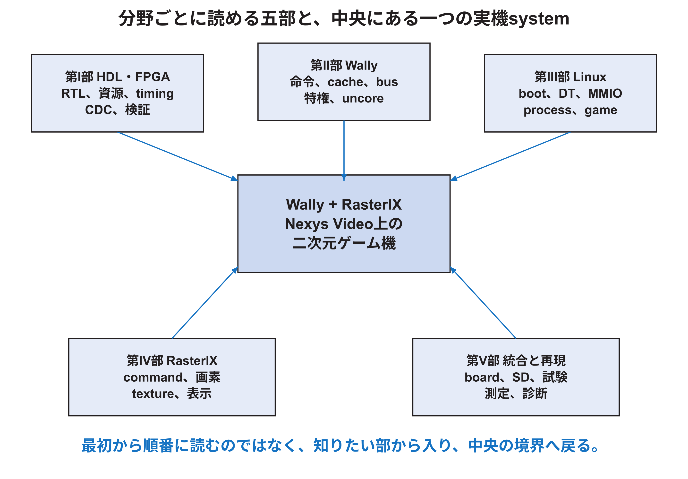

ハードウェアは、SystemVerilogから推論される回路、LUT・FF・BRAM・DSP、組み合わせ経路、pipeline、clock、reset、CDC、bus、Wally内部、RasterIX内部、映像出力まで扱う。ソフトウェアは、cross compile、ELF、ZSBL、OpenSBI、Linux kernel、device tree、仮想memory、MMIO、C++の描画API、ゲームloop、診断方法まで扱う。hardwareとsoftwareを別々に覚えるだけでなく、C++の一回の書込みがCPU命令、cacheとbus、周辺register、command FIFO、描画pipeline、framebuffer、映像信号へ変わる境界を追えることを目標とする。

[付録A](#ch_A)〜Zの文字は既存の参照を壊さないために維持している。分野別に配置したため、冊子内ではアルファベット順に並ばない。例えばFIFOとclock境界は[第IV部](#part_IV)の[付録I](#ch_I)、Nexys Video対応の再現は[第V部](#part_V)の[付録A](#ch_A)にある。章番号は本技術付録内、単に「[第7章](本文.md#ch_7)」のように本文中で示す従来の表記は同梱の研究本文を指す。Word版の目次と内部リンクから移動できる。

固定版、実験条件、引用の意味は本文と共通である。従来の解説と再現演習は初期の固定版を対象とし、2026年10月8日の更新版とFIFO比較E6は、[第V部](#part_V)の[技術付録第29章](#ch_29)にまとめた。特に、FIFO比較が未実施だった時点の説明を更新し、ソースから分かることと実測したことを区別する。説明用の周期数や小さなFIFOと、実機で採用した値を区別する。試験計画と書いた部分は未実施であり、保存済みの測定結果へ加えない。将来のオンライン公開へ向け、図、資料、相対リンクを同じフォルダで扱える形にしている。

<a id="h0008"></a>
## 分野別案内

| 読みたい分野 | 入口 | 扱う範囲 |
|---|---|---|
| HDL・FPGA・デジタル回路 | [第I部](#part_I) | RTL、合成資源、timing、実装flow、CDC、reset、検証 |
| Wally CPU・SoC | [第II部](#part_II) | 構成parameter、pipeline、hazard、cache、MMU、特権、bus、変更方法 |
| Linux・ソフトウェア | [第III部](#part_III) | Buildroot、boot、ELF、device tree、仮想memory、MMIO、ゲームprogram、診断 |
| RasterIX・画像生成 | [第IV部](#part_IV) | API、command、FIFO、頂点、rasterization、texture、depth、blend、framebuffer、表示 |
| 本研究の設計と再現 | [第V部](#part_V) | Nexys Video対応、接続差分、SD起動、実験、固定commit、実機確認 |
| FIFO比較と公式更新後の追試 | [技術付録第29章](#ch_29) | 1語方式、待ちの計数、画像照合、版の再現、命令解析の問題 |

一つの処理を端から端まで追いたい場合は、[第III部](#part_III)のMMIO、[第II部](#part_II)のmemoryとbus、[第IV部](#part_IV)の命令経路と表示、[第V部](#part_V)の固定版実装を対応付ける。最初から全冊を読む必要はない。分からない境界へ戻り、図、表、source path、確認commandを使って局所的に掘り下げる。

<a id="part_I"></a>
## 第I部 HDLとFPGAによるデジタル回路設計

SystemVerilogの記述を回路として読み、LUT、FF、BRAM、DSPへの合成、timing、clock、reset、CDC、検証までを一つの設計活動として扱う。WallyやRasterIXに依存しない原理と、固定版ソースで確認できる具体例を対応付ける。

<a id="ch_1"></a>
### 第1章 Wally開発者が使う抽象化階層

<a id="s_1_1"></a>
#### 1.1 この本編の到達目標

この本編の目標は、SystemVerilogの文法を暗記することではない。Wallyへ変更を加える際に、要求を回路へ落とし、生成された回路が意図と一致するかを検証し、資源・速度・正しさの結果から設計を修正できる状態を目指す。対象は固定コミット`d3e181ac434a01a1f174549b5fbc7ee03a8875b4`であり、一般論と固定版の事実を区別する。[Console26](#ref_Console26)[Wally](#ref_Wally)

開発者レベルの理解には、次の問いへ別々に答えられる必要がある。

| 問い | 主に使う資料 | 答えとして必要なもの |
|---|---|---|
| 何を実現するのか | ISA、周辺回路仕様、要求表 | 入出力、状態、例外、完了条件 |
| どの構造で実現するのか | ブロック図、module階層 | 所有者、interface、clock domain |
| 各cycleで何が起きるのか | RTL、波形 | register更新条件と組み合わせ論理 |
| 何の資源になったか | 合成netlist、utilization report | LUT、FF、BRAM、DSP、clock資源 |
| 指定周期で動くか | timing report、XDC | startpoint、endpoint、slack、制約 |
| 仕様どおりか | test、assertion、実機記録 | 前提、刺激、観測値、期待値 |

最後の列を説明できない場合、「コードを読んだ」ことと「設計を理解した」ことを分ける。例えば`+`を見て加算だと分かっても、幅、符号、overflow、前後のregister、合成先、critical pathへの影響を確認していなければ、その加算器を安全に変更できる理解には達していない。

<a id="s_1_2"></a>
#### 1.2 仕様から実機までの六層

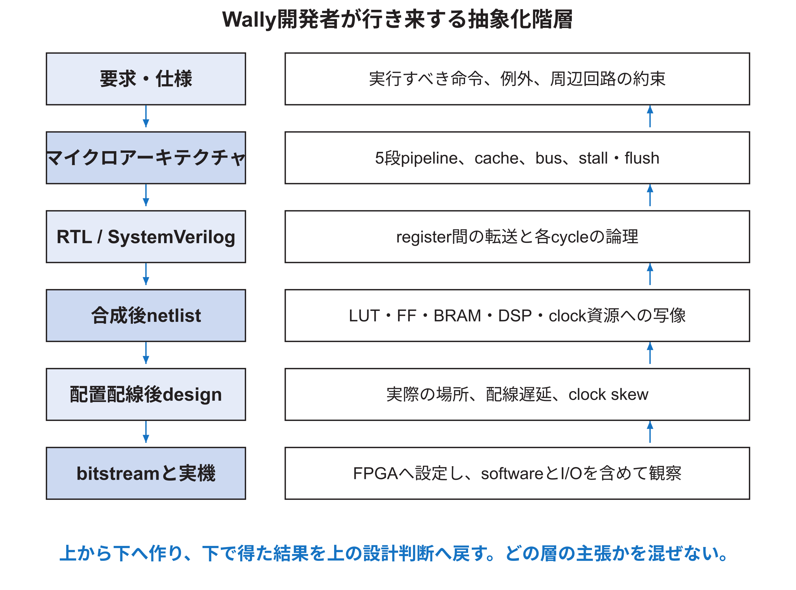

上から下へ進むほど実物に近づく。要求・仕様は、外から観察できる約束を定める。マイクロアーキテクチャは、その約束をpipeline、cache、bus、FSMなどの構造で実現する方法である。RTLは、その構造をclock edge間の転送として記述する。合成後netlistは、RTLをFPGAのLUT、flip-flop、BRAM、DSPなどへ写した論理構造である。配置配線後designには、素子の場所と配線遅延が入る。bitstreamは、その配置配線結果をFPGAへ設定するデータである。[Harris26](#ref_Harris26)[AMD901](#ref_AMD901)[AMD949](#ref_AMD949)

一つの層で得た結果を、別の層の証明として使い過ぎてはならない。RTL simulationの成功は、与えた入力に対するRTLの動作を示す。配置配線後の正のslackは、指定したclockと例外条件の下でtimingを満たしたことを示す。bitstreamを書き込んでUARTが動くことは、少なくともclock、reset、CPU、UART、software起動経路の一部が実機で働いたことを示す。どれも、別の層すべてを単独で証明しない。

<a id="s_1_3"></a>
#### 1.3 ISAとマイクロアーキテクチャを分ける

RISC-V ISAは、命令の意味、register、例外など、softwareから見えるarchitectural stateの約束を定める。同じ命令列を正しく実行するCPUでも、単cycle、5段pipeline、out-of-orderなど内部構造は異なり得る。WallyのIFU、IEU、LSU、cache、分岐予測器はマイクロアーキテクチャであり、ISAそのものではない。[RISCVUnpriv26](#ref_RISCVUnpriv26)[RISCVPriv26](#ref_RISCVPriv26)[Harris26](#ref_Harris26)

この区別は周辺回路追加でも重要である。RasterIXをmemory-mapped I/Oとして接続しても、RISC-V命令の意味を変えたわけではない。既存のload/store命令が特定の物理addressへ到達したとき、uncoreがRasterIXを選ぶようにSoCのaddress mapを拡張した。したがって変更箇所は主にSoC integrationであり、命令decodeへ独自命令を追加した変更とは異なる。

<a id="s_1_4"></a>
#### 1.4 動作記述、RTL、構造記述の関係

「動作記述」と「構造記述」は、必ずしも別言語や排他的な二分類ではない。`assign y = a + b;`は、望む動作を演算子で書いた動作寄りの記述であり、合成可能で、register間に置けばRTL設計の一部になる。別のmoduleを実体化して端子を結ぶ記述は構造寄りである。一つの設計は通常、両方を含む。[Harris26](#ref_Harris26)

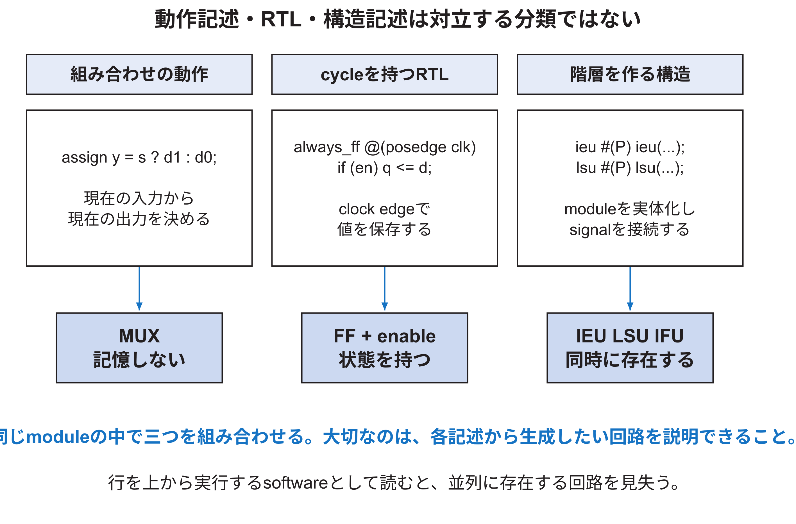

RTLは「使用した構文名」よりも、registerとregisterの間で、どの値が、どのclock edgeに、どの条件で移るかを明確にする設計の抽象度である。ゲート一個ずつを手で接続する必要はない。一方、任意のsoftware algorithmを書けば望む回路になるわけでもない。設計者は、書いた式が加算器、MUX、priority encoder、memory、FSMのどれを推論させるかを予測する。

<a id="s_1_5"></a>
#### 1.5 RTL、論理合成、ゲートレベルという語

論理合成は、合成可能なRTLを論理networkへ変換し、等価変形と最適化を行い、対象technologyの部品へ写す。ASICならNAND、NOR、flip-flopなどを含むstandard cell libraryへmappingする。FPGAではLUT、carry chain、FF、BRAM、DSP、I/O bufferなどのprimitiveへmappingする。このためFPGAの「gate-level netlist」は、文字どおり二入力AND gateだけが並ぶとは限らない。[Harris26](#ref_Harris26)[AMD901](#ref_AMD901)

Vivadoの`write_verilog -mode funcsim`で得る合成後netlistは、元のmodule名や式が最適化され、primitiveと接続へ変換された姿を確認する資料である。`write_verilog -mode timesim`とSDFは配置配線後の遅延simulationに使える。ただし、netlistを人が最初から最後まで読むことが通常の設計方法ではない。元RTL、schematic、階層別utilization、timing pathを対応付け、疑わしい箇所へ絞る。

<a id="s_1_6"></a>
#### 1.6 一つの信号を六層で追う

例として`StallW`を追う。仕様上は、writeback stageを進められない原因があるとき、pipelineを止める必要がある。マイクロアーキテクチャ上は、後段の停止を前段へ伝える。RTLでは`hazard.sv`が`StallW`を求め、`StallM`、`StallE`、`StallD`、`StallF`へ連鎖させる。合成後は論理式を実現するLUTと配線になる。配置配線後には、そのfanoutと配線距離が遅延へ加わる。実機ではcache missや外部stallなどの条件でpipelineの進行が止まる。

この追跡は「信号名の意味」だけでなく、発生源、利用先、clock domain、assertされる期間、解除条件、timing pathを含む。新しいstall原因を足すなら、論理式へORするだけでなく、flushとの優先順位、進行中bus transaction、例外のprecise性、coverageを再検討する。

<a id="s_1_7"></a>
#### 1.7 説明の確度を三段階に分ける

設計文書では、次の三種類を明示する。

1. **仕様またはsourceから直接読めること**: module port、式、状態遷移、parameter値など。
2. **toolで確認したこと**: 合成資源、timing、CDC、simulation結果など。tool版と入力版を固定する。
3. **設計案または予想**: pipeline追加で速くなる、BRAMへ移せる、という未検証の案。

「一般にこうなる」と「この固定版でそうなった」を混ぜない。特に資源推論とtimingは、RTL、target device、tool版、constraint、最適化optionで変わる。好ましいidiomはあるが、最終判断はreportで行う。

<a id="ch_2"></a>
### 第2章 SystemVerilogから回路を読み取る

<a id="s_2_1"></a>
#### 2.1 moduleは回路の境界である

SystemVerilogの`module`は、softwareの関数呼出しとは異なる。実体化したmoduleは回路として常に存在し、入力が変わると組み合わせ論理が反応し、clock edgeで内部状態が更新される。portは、その回路境界を越えるsignalの方向と幅を定める。[Harris26](#ref_Harris26)

Wallyでは`wallypipelinedcore.sv`がIFU、IEU、LSU、privileged unit、hazard unitなどを実体化する。ここで`ieu(...)`の記述が先にあり、`lsu(...)`が後にあることは、IEUを実行し終えてからLSUを呼ぶ意味ではない。両者は同時に存在し、signalで接続される。

module境界を設計するときは、責務、clock/reset、要求と応答、data幅、backpressure、error、所有する状態を表にする。port名を増やし続ける前に、二つのmoduleを分ける境界が安定しているかを考える。

<a id="s_2_2"></a>
#### 2.2 `logic`、net、変数、driver

`logic`は4値の変数型で、0、1、X、Zを表せる。SystemVerilogでは連続代入や一つのprocedural blockから駆動する多くのsignalに`logic`を使える。しかし`logic`と書いたからregisterになるわけではない。何が駆動するかで回路が決まる。

複数の回路が同じsignalを同時に駆動すると、意図しないmultiple driverになる。chip内部で複数の出力を直接短絡して選択する設計は避け、MUXで一つを選ぶ。Wallyの`uncore.sv`が複数の読出しdataをselect signalでまとめる式は、この考え方を明示している。

<a id="s_2_3"></a>
#### 2.3 `assign`と`always_comb`

現在の入力だけで出力が決まり、過去を覚えない回路が組み合わせ論理である。単純な式は`assign`で表す。複数の条件、`case`、一時値を順に計算したい場合は`always_comb`を使う。`always_comb`内では、通常、blocking代入`=`を用いる。[Harris26](#ref_Harris26)

```systemverilog
always_comb begin
  NextState = CurrState;
  PREADY    = 1'b0;
  case (CurrState)
    IDLE: if (PSEL) NextState = ACCESS;
    ACCESS: begin
      PREADY = Done;
      if (Done) NextState = IDLE;
    end
    default: NextState = IDLE;
  endcase
end
```

冒頭のdefault代入は、すべての経路で値を定義する。代入されない経路があると、前の値を保持する必要が生じ、latchを推論する可能性がある。latchが仕様なら明示するが、Wallyの同期設計では通常、意図しないlatchを残さない。

<a id="s_2_4"></a>
#### 2.4 `always_ff`とclock edge

`always_ff @(posedge clk)`は、正のclock edgeで値を保存するflip-flopを表す。Wallyの`flopenr.sv`はenable付き同期reset registerを次の形で記述する。[Wally](#ref_Wally)

```systemverilog
always_ff @(posedge clk)
  if (reset)   q <= '0;
  else if (en) q <= d;
```

`en`が0のとき代入がないのは、`q`を保持するという順序回路の仕様である。これは`always_comb`で値を代入し忘れる場合と違う。`reset`はclock edgeで評価される同期resetであり、`reset`が変化した瞬間に非同期で`q`を変える記述ではない。

<a id="s_2_5"></a>
#### 2.5 blocking代入とnonblocking代入

組み合わせ計算にはblocking代入`=`、clocked register更新にはnonblocking代入`<=`を用いる。nonblocking代入では、右辺はedge時点の古い値で評価され、左辺の更新はまとめて反映される。この規則により、pipeline registerを同じblockへ並べても、一つのedgeでdataが複数stageを飛び越えない。

```systemverilog
always_ff @(posedge clk) begin
  InstrD <= InstrF;
  InstrE <= InstrD;
end
```

この記述で`InstrE`へ入るのはedge直前の`InstrD`であり、同じedgeで`InstrF`から更新された新しい`InstrD`ではない。blocking代入を使うとsimulation上の意味が変わり、合成意図が読みにくくなる。

<a id="s_2_6"></a>
#### 2.6 resetの種類と優先順位

resetには同期・非同期、High active・Low activeがある。どれを使うかは、device、clock起動、IP、system要求に依存する。重要なのは、assertとdeassertの条件、各domainでの解除時刻、data path enableとの優先順位を一貫させることである。

resetをすべてのdata registerへ無条件に配ると、高fanout routingを増やし、SRLやBRAMの推論を妨げる場合がある。一方、control state、valid bit、外部へ見える状態を未初期化のままにすると、起動が不定になる。data本体をresetせずvalid bitで無効化できるか、仕様から判断する。資源節で、memory初期化との関係を扱う。[AMD901](#ref_AMD901)[AMD949](#ref_AMD949)

<a id="s_2_7"></a>
#### 2.7 FSMを状態registerと次状態論理へ分ける

FSMは少なくとも、現在状態を保存するregister、次状態を決める論理、出力論理からなる。Wallyの`busfsm.sv`では列挙型`CurrState`と`NextState`を使い、`always_ff`で状態を更新し、`always_comb`の`case`でAHB transactionの進行を決める。[Wally](#ref_Wally)

列挙型は、bit patternより状態名で考えられる利点がある。状態追加時は、全遷移、reset state、illegal stateからの回復、各状態の出力、待ち条件を確認する。`default`で初期状態へ戻すだけでは、なぜillegal stateに入ったかを検証しなくてよい意味にはならない。

<a id="s_2_8"></a>
#### 2.8 構造記述と暗黙port接続

Wallyでは`.clk`のような短縮表記を多く使う。これはport名`clk`へ同名のsignalを接続する記法である。簡潔だが、同名のsignalが期待する幅・domain・極性かをmodule宣言で確認する必要がある。異名接続は`.ReadDataW(ReadDataW[P.XLEN-1:0])`のように明示される。

構造記述を読む順番は、module種類、instance名、parameter、clock/reset、要求方向、応答方向である。大量のportを上から眺めるより、interfaceの契約ごとにまとまりを付ける。

<a id="s_2_9"></a>
#### 2.9 parameter、package、`cvw_t P`

Wallyは、global macroの衝突を避け、構成を一つの型として階層へ渡すため、`src/cvw.sv`にpacked structure `cvw_t`を定義する。`P.XLEN`、`P.BUS_SUPPORTED`、cache容量、peripheral addressなどをmodule parameterとして使う。[Harris26](#ref_Harris26)[Wally](#ref_Wally)

parameterは実行中に変わるregisterではない。elaboration時に値が決まり、幅、generate分岐、配列数、回路の有無を変える。`if (P.BUS_SUPPORTED) begin : ebu`は、条件が真ならEBU回路を生成し、偽なら代替の定数接続を生成する。softwareの実行時ifとは異なる。

<a id="s_2_10"></a>
#### 2.10 `generate`とprocedural `for`を区別する

generateは、elaboration時にmoduleや接続を複数作る。procedural `for`は`always_comb`や`always_ff`の内部で、静的な反復範囲なら通常、複数の論理へ展開される。どちらもCPUが一回ずつloopを実行する意味ではない。

例えば64 bitの各bitへ同じ論理を適用するloopは、64個分の回路を生み得る。反復回数を倍にするとsimulation行数はほぼ変わらなくても、面積が倍に近づくことがある。順番に一個の演算器を再利用したいなら、FSM、counter、register、完了signalを設計する。

<a id="s_2_11"></a>
#### 2.11 幅、符号、式の途中のbit数

HDLの算術では、入力幅、signed/unsigned、定数の幅、式の自己決定幅が結果へ影響する。`logic [7:0] a, b; logic [7:0] y; assign y = a + b;`では9 bit目のcarryは`y`に保存されない。carryが必要なら出力を広げ、operandも意図した幅へ拡張する。

比較でもsignednessを確認する。二の補数の負値をunsignedとして比較すると、上位bitが1の大きな正値として扱われる。castは警告を消すためではなく、仕様上の解釈を明示するために使う。幅警告を一括で無効化せず、切捨て、符号拡張、zero拡張が意図どおりか一件ずつ判断する。

<a id="s_2_12"></a>
#### 2.12 XとZを異常の手掛かりにする

4値simulationのXは、未初期化、競合、範囲外index、case未定義などを表し得る。Xを0として見なす2値simulationだけでは、設計上の穴を見逃す場合がある。前章で監査したRasterIXの`number[shiftSize-1]`は、`shiftSize=0`で範囲外を読み、4値simulationがXを露出させた例である。

Zは高impedanceを表し、主に外部tri-state I/Oで使う。FPGA内部の共有busは通常MUXへ変換される。Xを消すために無条件の初期値や`casex`を足す前に、原因が実回路でも危険か、simulationだけのmodelかを分ける。

<a id="s_2_13"></a>
#### 2.13 合成可能な記述とtestbench専用記述

`#10`のdelay、任意のfile I/O、simulationを停止する`$finish`、時刻を進めるtestbench clock generatorなどは、通常のhardwareとして合成しない。`initial`も用途とtargetで扱いが異なり、FPGA memory初期値として使える場合と、ASICで回路にならない場合を分ける。Wallyのtestbenchにある`$value$plusargs`やELF file読込みはsimulation環境であり、CPU内部に文字列処理回路を作っているわけではない。

<a id="ch_3"></a>
### 第3章 資源効率を決めるRTL設計

<a id="s_3_1"></a>
#### 3.1 「好ましい書き方」の意味

資源効率のよいRTLには、単一の万能な書式はない。望むhardwareを明確に暗示し、target deviceが持つ専用資源へtoolが推論でき、timing制約と機能要求を満たす書き方が好ましい。可読性だけ、行数だけ、LUT数だけで決めない。[Harris26](#ref_Harris26)[AMD901](#ref_AMD901)[AMD949](#ref_AMD949)

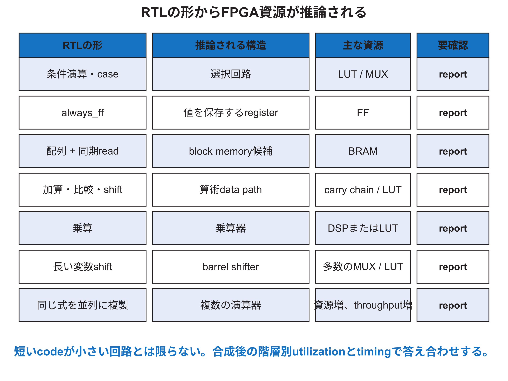

最適化前に、baselineの機能、clock、utilization、timing、power条件を保存する。変更後は同じ条件で比較する。異なるVivado版、strategy、constraintを混ぜると、RTL変更の効果とtool設定の効果を分離できない。

<a id="s_3_2"></a>
#### 3.2 MUXとpriority論理

三項演算子や`case`はMUXを推論する。互いに排他的な選択なら平衡したMUXになりやすい。長い`if`/`else if` chainは先頭条件に優先順位を与え、priority chainを作る可能性がある。優先順位が仕様なら正しいが、不要な優先順位はlogic depthを増やし得る。

one-hot selectをORでまとめる場合は、本当に同時に一つしか立たないことをassertする。Wallyのuncore読出しMUXはaddress decodeの選択を前提に複数dataをまとめる。decoderとMUXを別々に読むだけでなく、選択の排他性、未選択時のready、errorを一組で確認する。

<a id="s_3_3"></a>
#### 3.3 演算子と専用資源

加算・減算はFPGAのcarry chainを使いやすい。定数shiftは配線変更だけで済むことが多いが、可変shiftはMUX段を持つbarrel shifterになり得る。乗算は幅や設定によりDSPへmappingされるかLUTへ実装される。除算は組み合わせで大きな回路にするか、複数cycleの反復器にするかで面積とlatencyが大きく異なる。

演算子を手作りgateへ展開すれば必ず小さくなるわけではない。合成toolは既知の演算構造を認識して最適化する。専用資源を使いたい場合は、AMDの推論template、synthesis report、technology schematicを照合する。[AMD901](#ref_AMD901)

<a id="s_3_4"></a>
#### 3.4 bit幅は面積と遅延の設計値である

data幅を64 bitから32 bitへ減らせば、加算器、MUX、register、配線の多くは小さくなる。ただし、architectureが64 bitを要求する経路を狭めれば機能を壊す。address全体、data全体、index、offset、counterなど、必要範囲を別々に求める。

counterが0から999までなら10 bitで足りるが、将来parameterを増やすなら`$clog2`の境界、値1、power-of-two、最大値を確認する。`$clog2(1)`が0になる状況で0幅vectorを作らないよう、最小幅を定める。

<a id="s_3_5"></a>
#### 3.5 memoryをBRAMへ推論させる

大きな配列をFFで作ると資源を大量に使う。Vivadoは特定の同期read/write idiomからblock RAMを推論できる。非同期read、port数、byte enable、read-during-writeの意味、reset方法がprimitiveの能力と合わない場合、distributed RAMやFFへ崩れることがある。[AMD901](#ref_AMD901)

Wallyの`src/generic/mem`には、用途別のmemory wrapperがある。設計者は個々のmoduleで独自配列を乱立させず、必要なport、latency、byte enable、初期化、ASIC/FPGA差をwrapperへ集約する。memoryの出力だけをresetできる場合と、配列全bitをresetしようとしてBRAM推論を失う場合を区別する。

<a id="s_3_6"></a>
#### 3.6 register enableとclock gating

値を更新しないcycleでは、`if (en) q <= d;`というclock enableを使う。FPGAのFFにはenable機能があり、合成toolが利用できる。一般RTLで`clk & en`を作り、それを新しいclockとして配ると、glitch、skew、未制約clockを招く。clockを止める必要がある場合は専用clocking resourceと設計methodologyを使う。

enableにもcostがある。多数のregisterへ一つのenableを配るとhigh fanout netになる。data側MUXと専用enableのどちらになるか、fanout、placement、powerをreportで確認する。

<a id="s_3_7"></a>
#### 3.7 hardwareの並列化と資源共有

二つの演算を同じcycleに実行するなら、原則として二つ分の演算資源が必要になる。一つの乗算器を二cycleで共有すれば面積を減らせるが、MUX、FSM、registerが増え、latencyとthroughputが変わる。資源共有は「同時に必要でない」ことをscheduleとして設計する作業である。

CPU pipelineでは、各stageが異なる命令を同時処理する。ALUを別stageの処理と安易に共有すると、structural hazardが生じる。共有するならstall条件と性能影響まで設計する。

<a id="s_3_8"></a>
#### 3.8 fanout、logic depth、routing

一つのsignalが数千のendpointを駆動すると、driverの複製や長いroutingが必要になる。RTL上の論理段数が少なくても、routing delayがcritical pathの大半になる場合がある。reset、stall、global enable、wide decodeはhigh fanoutになりやすい。

対策には、階層ごとのlocal decode、register複製、pipeline、物理的に近い階層分割がある。ただし手動複製は等価性と更新の同時性を守る。まずtiming reportでlogic delayとnet delay、fanoutを確認し、想像だけで複製しない。[AMD906](#ref_AMD906)[AMD949](#ref_AMD949)

<a id="s_3_9"></a>
#### 3.9 hierarchyを保つ理由とflattenする理由

module階層は理解、再利用、局所検証に役立つ。一方、強い階層境界が最適化を妨げることもある。Vivadoは階層をflattenまたはrebuiltし、境界を越えて最適化できる。debugしやすさ、incremental build、OOC IP、timing最適化のtrade-offを考える。

source上のmodule名が合成後に残るとは限らない。階層別utilizationを比較したい場合は、同じflatten方針とreport条件を固定する。

<a id="s_3_10"></a>
#### 3.10 resource reportを読む

総使用率だけでなく、階層別のLUT、LUTRAM、FF、BRAM、DSP、BUFGを読む。利用率が低くてもtimingは失敗し得る。逆に高利用率でも、配置可能でslackが正なら動作し得るが、routing congestionや将来拡張の余裕は小さい。

LUT数が減ってFF数が増えるpipeline化、BRAMが増えてLUTRAMが減るmemory推論など、一種類だけの増減で優劣を決めない。目的が最高clock、最低面積、最低latency、最低powerのどれかを明示する。

<a id="s_3_11"></a>
#### 3.11 最適化の前後で保存する証拠

| 種類 | 最低限保存するもの | 比較時の注意 |
|---|---|---|
| source | commitとdiff | generated fileだけを比較しない |
| 機能 | 同じtestと結果 | 入力seed、parameterを固定する |
| 合成 | utilization階層表 | target device、strategyを固定する |
| timing | worst path、WNS、TNS | clockとexceptionを固定する |
| 実機 | bitstream hash、条件、log | 古いbitstreamとの取り違えを防ぐ |

「資源効率がよい」と主張するなら、少なくとも機能が同じであることと、比較したresource指標を示す。「高速化した」と主張するなら、timing closureと実行性能のどちらを意味するかを分ける。

<a id="ch_4"></a>
### 第4章 Timing closureとpipeline設計

<a id="s_4_1"></a>
#### 4.1 register間pathの時間予算

同期回路の代表的なsetup条件は、概念的に次である。

```text
Tclock >= Tcq + Tlogic + Troute + Tsetup + Tskew/uncertainty
```

送信FFがclock edge後に出力を変える時間、組み合わせ論理、配線、受信FFのsetup要求、clock差とuncertaintyを合計し、次の有効edgeまでに収める。Vivadoのslackはrequired timeとarrival timeの差としてreportされ、setupでは負なら指定周期を満たさない。[AMD906](#ref_AMD906)

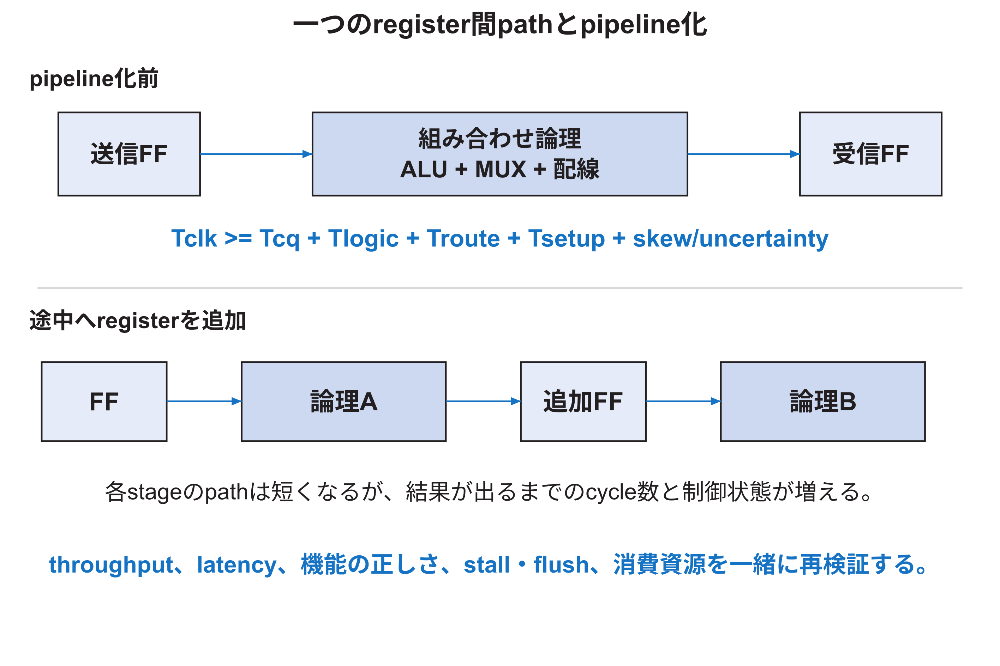

式は理解用の分解であり、実際のreportではclock path、data path、uncertainty、clock pessimismなどをtoolの定義で読む。単にRTLの演算子数を数えてdelayを決めない。

<a id="s_4_2"></a>
#### 4.2 setupとholdを分ける

setup checkはdataが遅すぎないかを見る。hold checkは、同じedge直後にdataが早く変わり過ぎ、受信FFが古い値を保持すべき時間を破らないかを見る。clockを遅くすればsetupは改善しやすいが、holdは単純にclock周期を長くしても解決しない。

implementation toolはhold修正のためdata pathへdelayを加える場合がある。その変更がsetupを悪化させ得るため、max delayとmin delayの両方を見る。WNSだけを見て「timing成功」とせず、unconstrained path、clock interaction、hold violationも確認する。[AMD903](#ref_AMD903)[AMD906](#ref_AMD906)

<a id="s_4_3"></a>
#### 4.3 WNS、TNS、failing endpoint

WNSは最悪pathのslack、TNSは負slackの総和である。一つのpathだけ大きく違反する場合と、多数のpathが少しずつ違反する場合では対策が異なる。endpoint数とclock groupを併記する。

達成可能な最大周波数を一回のWNSから断定しない。配置配線はstrategyやseedで変動し、異なるclock groupもある。固定条件で複数runを比較し、完全にrouteしたdesignの結果を使う。[AMD949](#ref_AMD949)

<a id="s_4_4"></a>
#### 4.4 pipeline化が変えるもの

組み合わせ論理の途中にregisterを入れると、一stageのpathを短くできる。しかし出力までのcycle数が増え、valid、stall、flush、exception、feedback loopを変更する。throughputが一cycle一件のままでもlatencyは増える。依存する命令やprotocolが追加latencyを許さない場合、bypassや待ち制御が必要になる。

pipeline化はtiming修正であると同時に機能変更である。registerだけを追加してtestが通るとは限らない。各stageの「data」と「そのdataが有効であるというcontrol」を一緒に遅らせる。

<a id="s_4_5"></a>
#### 4.5 WallyのF、D、E、M、W

Wallyの基本pipelineはFetch、Decode、Execute、Memory、Writebackの五段で読む。IFUがPCと命令取得、IEUがdecode・整数演算、LSUがload/store、privileged unitがCSRとtrap、hazard unitがstall/flushを調整する。[Harris26](#ref_Harris26)[Wally](#ref_Wally)

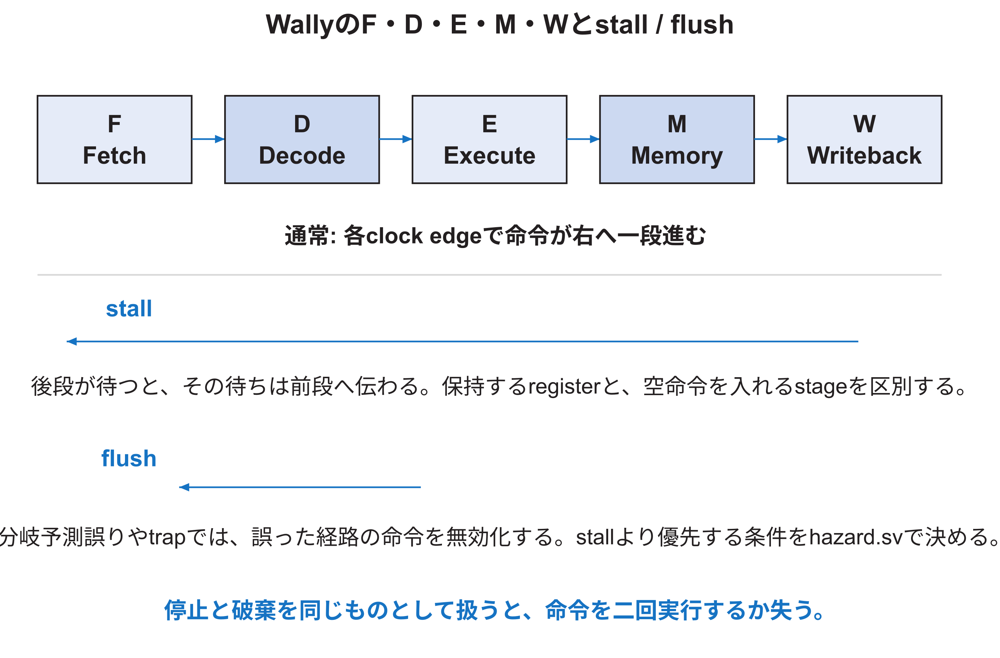

stage suffixを手掛かりに、`InstrD`はDecode、`PCE`はExecute、`ReadDataW`はWritebackの値として読む。ただしすべてのsignalが単純に一stageだけに属するとは限らない。exception原因、cache stall、分岐予測情報は複数stageをまたぐため、宣言と接続を追う。

<a id="s_4_6"></a>
#### 4.6 stallは保持、flushは無効化

stallはstageの内容を保持して進行を待つ。flushはそのstageの命令を無効化し、後でarchitectural stateへ影響しないようにする。Wallyの`hazard.sv`は、後段stallを前段へ伝え、最初に進めるstageへbubbleを入れる規則と、trap・return・CSR write・branch mispredictionによるflushをまとめる。[Wally](#ref_Wally)

同じcycleにstallとflush原因がある場合の優先順位が重要である。例えば誤った経路の除算命令、cache miss中のtrap、WFIの割込みなどは、単純な全段clearでは扱えない。既存コメント、式、testを読み、変更前の不変条件を列挙する。

<a id="s_4_7"></a>
#### 4.7 forwardingとload-use hazard

前の命令の結果がregister fileへ書き戻される前に、後の命令が必要とする場合がdata hazardである。ALU結果は後段からforwardできる場合がある。load dataはmemory access完了まで得られないため、直後の依存命令を一cycle以上stallする場合がある。

forwarding pathは性能を上げる一方、operand MUXと比較論理を増やし、Execute stageのcritical pathになり得る。新しい結果sourceを追加するときは、正しさ、priority、x0除外、valid、timingを同時に検討する。

<a id="s_4_8"></a>
#### 4.8 critical pathをreportから読む

critical pathでは、startpoint、endpoint、clock group、logic level、cell delay、net delay、fanoutを読む。source fileの長さや、目立つ大きなmoduleだけで原因を推測しない。よく現れるcellやnetが複数のworst pathへ共通するかも調べる。[AMD906](#ref_AMD906)[AMD949](#ref_AMD949)

Wallyを20 MHzで動かしてtimingに余裕があっても、別domainの100 MHz RasterIXやpixel clockのpathは別groupである。また、unconstrained pathは「余裕がある」のではなく、正しく検査されていない可能性がある。

<a id="s_4_9"></a>
#### 4.9 timing修正の順序

1. clockとgenerated clock、I/O delay、clock relationが正しいか確認する。
2. false pathやmulticycle pathが本当に仕様上成立するか確認する。
3. worst pathの論理とfanoutを特定する。
4. 不要なpriority、幅、重複計算を直す。
5. 必要ならpipeline、register複製、memory latency変更を設計する。
6. place/route strategyやphysical optimizationを比較する。
7. 同じ機能testとtiming reportで再確認する。

制約を緩めて赤いreportを消すことは、回路を高速化したことではない。false pathは、そのpathを機能上決してcaptureしないことを説明できる場合にだけ使う。multicycle pathは、受信側が何cycle後のedgeでcaptureするかをprotocolとして保証する必要がある。[AMD903](#ref_AMD903)

<a id="s_4_10"></a>
#### 4.10 latency、throughput、clock frequencyを区別する

clock frequencyは一秒あたりのcycle数、latencyは一件の開始から完了まで、throughputは定常状態で一秒または一cycleに完了できる件数である。100 MHzの回路が20 MHzの回路より常に五倍速いとは限らない。100 MHz側が一件に100 cycle、20 MHz側が一件に1 cycleなら結果は逆になる。

本研究の命令FIFOでも、CPU 20 MHzとRasterIX 100 MHzだけから満杯・空を予測できない。一命令当たりの語数、CPUのstore間隔、RasterIXの命令種類、memory stall、display operationを測る。

<a id="s_4_11"></a>
#### 4.11 timing closureの完了条件

| 確認 | 失敗時に意味すること |
|---|---|
| `check_timing`に重大な未制約がない | 検査対象が欠けている可能性 |
| setup/hold slackが全groupで非負 | 指定条件のtiming違反 |
| `report_clock_interaction`が意図と一致 | clock関係またはexceptionの誤り |
| `report_cdc`の違反を説明できる | CDC構造の不足または認識漏れ |
| 機能testが変更前後で一致 | pipeline・reset・制約変更の機能破壊 |
| 実機で持続動作する | board、電源、温度、I/Oを含む問題 |

正slackだけで完了とせず、正しいconstraintの下で正slackであることを確認する。

<a id="ch_5"></a>
### 第5章 FPGAへ実装されるまで

<a id="s_5_1"></a>
#### 5.1 Artix-7の主な資源

Nexys VideoのArtix-7には、組み合わせ論理を実装するLUT、状態を保存するFF、分散memory、block RAM、乗算・積和に向くDSP、clock管理、I/O buffer、serializerなどがある。DDR3 controllerのPHYやclocking wizardはdevice固有資源とvendor IPを使う。[NexysVideo](#ref_NexysVideo)[AMD901](#ref_AMD901)

同じ論理機能でも、どの資源へmappingされるかで面積、速度、powerが変わる。sourceの演算子名から最終資源を断定せず、synthesis reportとschematicを確認する。

<a id="s_5_2"></a>
#### 5.2 build flowの各段階

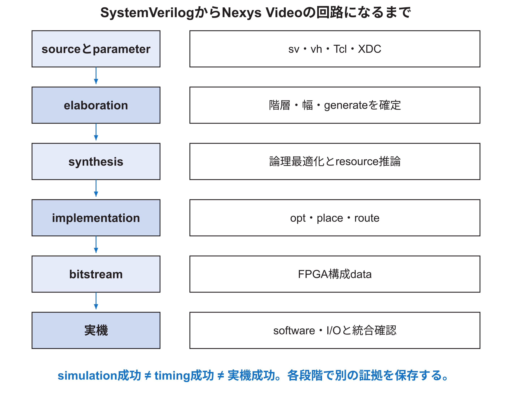

elaborationはparameter、generate、幅、階層を確定する。synthesisはRTLを論理netlistへ変換する。optimizationは定数伝搬、不要論理削除などを行う。placementはcellの場所、routingは配線を決める。bitstream generationは配置配線結果をFPGA設定dataへする。[AMD901](#ref_AMD901)[AMD949](#ref_AMD949)

`fpga/generator/wally.tcl`はsource/IP/constraintを読み、compile orderを更新し、synthesisとimplementationを実行し、timing、utilization、CDC report、simulation netlist、bitstreamを生成する。どの段階で失敗したかをlogから分ける。[Console26](#ref_Console26)

<a id="s_5_3"></a>
#### 5.3 compile orderとpackage

SystemVerilog packageやtypedefは、利用するmoduleより先にcompileする必要がある。`include_dirs`はfileを自動でcompileする指定ではなく、`` `include ``の探索場所を定める。fileを置いただけではVivado projectへ入らない。

同名moduleを別libraryに置く場合、どのinstanceがどのlibraryを参照するかを管理する。RasterIX sourceを別libraryへ置く処理は、Wally側の同名dependencyとの衝突を避けるためである。compile order reportを保存する。

<a id="s_5_4"></a>
#### 5.4 合成後netlistと配置配線後netlist

合成後netlistはlogical optimizationとtechnology mapping後の構造で、まだ最終配線遅延を持たない。配置配線後netlistは実際の配置・配線を反映する。functional simulation netlistは論理動作、timing simulationはSDF遅延を用いる。

timing simulationを行っても、analog signal integrity、電源noise、温度全範囲、外部deviceの全挙動を完全には再現しない。STA、CDC、simulation、実機試験を役割分担する。

<a id="s_5_5"></a>
#### 5.5 XDCはpin表だけではない

XDCにはpackage pin、IOSTANDARD、drive、slew、clock、I/O delay、timing exception、physical constraintが入る。XDC commandはTclとして順に評価されるため、対象objectが存在する時点とfile orderが重要である。[AMD903](#ref_AMD903)

Nexys Videoの`constraints-nexysvideo.xdc`ではboard pinと電気規格、非同期input、SD I/O delay、TMDS出力などを指定する。誤ったIOSTANDARDは機能不良だけでなく電気的問題を起こし得る。board manualとbank voltageを照合する。

<a id="s_5_6"></a>
#### 5.6 primary clockとgenerated clock

外部oscillatorへ`create_clock`を与え、MMCM/PLL出力はgenerated clockとして関係をtoolへ伝える。vendor IPが制約を生成する場合、同じclockへ重複・矛盾した定義を加えない。`report_clocks`と`report_clock_interaction`で認識結果を確認する。[AMD903](#ref_AMD903)

RTLのsignal名が`clk100`だから100 MHzとしてtiming解析されるわけではない。constraint objectがperiodとsource relationを定義する。

<a id="s_5_7"></a>
#### 5.7 input/output delay

外部deviceとの同期interfaceでは、board上の相手がいつdataを出し、いつcaptureするかを基準clockに対して指定する。`set_input_delay`はFPGA pinまでの外部arrival、`set_output_delay`は外部receiverの要求を表す。値はFPGA内部delayを手入力するためのものではない。

UARTのような非同期signalはsynchronizerとprotocol samplingで扱う。SD SPIのようにCPU clockからedgeを作る経路では、card/PCBのreturn budgetと内部pathを分けてconstraintする。仮の数値を「規格保証」として扱わない。

<a id="s_5_8"></a>
#### 5.8 false pathとasynchronous clock group

metastabilityを受けるsynchronizerの最初のFFまでのpathなど、通常の同期captureとして解析できないpathへ例外を置く場合がある。しかしexceptionはCDC回路を作らない。false pathを付けても、dataが安全に渡るわけではない。

clock間をasynchronousと宣言すると、それらの通常timing解析を止める。代わりにsynchronizer/FIFO構造、`report_cdc`、protocol testで安全性を確認する。domain内pathは引き続きtiming解析する。

<a id="s_5_9"></a>
#### 5.9 utilizationと配置可能性

device全体のLUT使用率が50%でも、特定clock regionやBRAM columnへ偏ればroutingが混雑する。hierarchical utilization、pblock、congestion、clock regionを読む。RasterIXとCPUを同時実装した構成では、全体量だけでなくmemory、wide bus、display経路の物理分布が重要になる。

place directiveで結果が改善しても、原因をRTL変更と混同しない。strategyは再現条件として保存する。

<a id="s_5_10"></a>
#### 5.10 bitstreamとsoftware imageを区別する

bitstreamはFPGA回路を設定する。Linux kernel、device tree、OpenSBI、game executableはsoftware imageであり、SDまたはmemoryへ置かれる。RTLだけ直して古いbitstreamを使う、device treeだけ直して古いSDを使う、といった取り違えをhashで防ぐ。

board上のCPUが同じでも、bitstreamが違えばperipheral mapやclockが変わる。softwareは実機のhardware構成と一致する情報を使う必要がある。

<a id="s_5_11"></a>
#### 5.11 build結果の保存単位

保存すべきものは、source commit、submodule commit、Vivado版、target part、environment、Tcl/XDC、strategy、主要report、bitstream hashである。generated IPをGitへ含めるか再生成するかはproject方針で決めるが、再生成手順とtool版を失わない。

<a id="ch_6"></a>
### 第6章 Clock domain crossingとreset設計

<a id="s_6_1"></a>
#### 6.1 clock domainを先に色分けする

一つのclock edgeで更新されるregister群をclock domainとして考える。Wally CPU clock、RasterIX clock、pixel clock、DDR user clockなどをブロック図で色分けする。各interfaceにsource domain、destination domain、data性質、更新頻度、resetを記録する。

clock周波数が同じでも、位相関係が保証されなければasynchronous crossingである。逆に同じMMCMから生成され、関係をtoolへ伝えられるclockはsynchronousに解析できる場合がある。

<a id="s_6_2"></a>
#### 6.2 metastabilityはsimulationだけでは見えない

非同期signalがFFのsetup/hold window付近で変化すると、FF出力が一定時間0/1の中間状態になり得る。digital RTL simulationは通常このanalog現象を再現しない。synchronizerはmetastabilityの発生を0にするのではなく、次段へ伝わる確率を下げる。

MTBFはclock、data toggle rate、device特性、解決時間に依存する。二段FFという形だけで、任意の安全要求を自動達成するとは限らない。

<a id="s_6_3"></a>
#### 6.3 一bit levelの二段synchronizer

一定時間保持されるenableやstatus levelは、destination clockで二段以上のFFを通す典型方式がある。最初のFFがmetastableになっても、二段目で使うまでに解決時間を与える。source側の短いpulseは、destinationが一度もsampleせず消える可能性があるため、この方式だけでは不十分である。

<a id="s_6_4"></a>
#### 6.4 pulse、toggle、handshake

短いeventはsource側でtoggle bitを反転し、destination側で同期後の変化を検出できる。eventが次々に来る場合、前の変化をdestinationが観測する前に再反転すると失う。request/acknowledge handshakeなら一件ずつ確実に渡せるが、往復latencyがある。

event lossを許すか、複数件を数えるか、sourceを待たせられるかで方式を選ぶ。

<a id="s_6_5"></a>
#### 6.5 複数bitを個別同期しない

複数bit busを各bitの二段FFへ入れると、各bitの解決時刻が異なり、存在しなかった組合せを受ける可能性がある。ゆっくり変わる設定値なら、sourceで値を保持し、同期したrequestを渡し、destinationでまとめてcaptureし、ackを返す。

連続streamには非同期FIFOを用い、data memoryとpointer同期で順序を守る。Gray codeはpointer更新時に変化するbit数を一つへ抑えるが、CDC constraintと同期FFが不要になるわけではない。

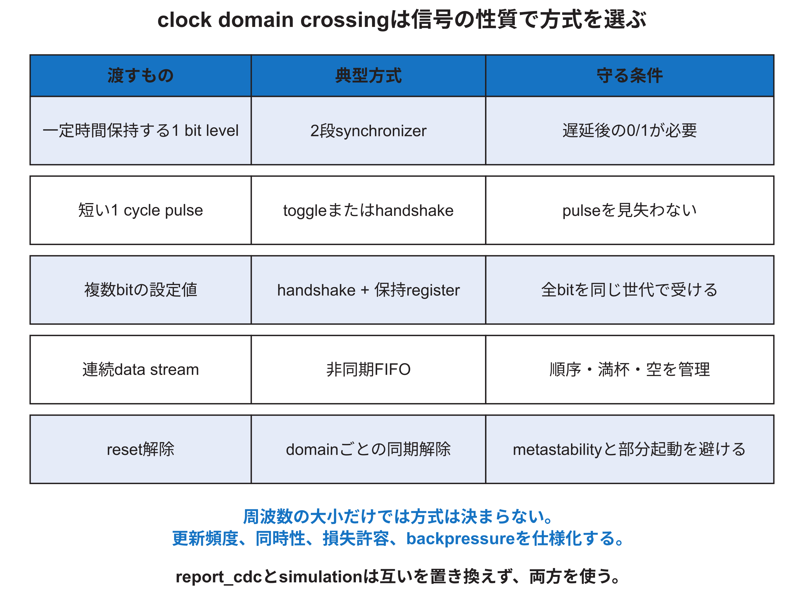

<a id="s_6_6"></a>
#### 6.6 reset assertionとdeassertion

外部resetを非同期assertし、clockが安定した後に各domainで同期deassertする方式がよく使われる。assertを早く効かせつつ、解除edgeをdomain clockへそろえるためである。複数domainが通信する場合、片側だけ先に動いて要求を出さないようstartup protocolを設ける。

`ClockLocked`やDDR calibration完了をCPU reset解除へ使う場合、それらのdomainと同期、glitch、再lock時の挙動を確認する。LED表示は観測補助であり、reset sequenceの形式的保証ではない。

<a id="s_6_7"></a>
#### 6.7 resetで初期化すべき状態

control FSM、valid bit、FIFO pointer、protocol stateは既知状態が必要である。data array全体はvalidが0なら読まれない設計にできる場合がある。大きなmemoryを一cycleで全clearする記述は物理的に実現できず、FFへ展開されるか、複数cycle clear FSMが必要になる。

起動時のframebuffer初期化では、resetで全画素を同時clearするのではなく、commandまたはCPUが領域を書き、完了を待つ。制御stateのresetと画像dataの初期化を分ける。

<a id="s_6_8"></a>
#### 6.8 clock enableと新しいclock domain

低速動作が必要なだけなら、元clockでcounter enableを作り、registerを一部cycleだけ更新する方が、新しいlogic-generated clockを作るより安全なことが多い。新しいclock domainを作ると、clock buffer、constraint、CDC、resetが増える。

外部protocolが特定edgeを要求する場合や、pixel serializerのように専用clockが必要な場合は、MMCM/PLLとclocking resourceを使う。

<a id="s_6_9"></a>
#### 6.9 本構成の主な境界

| 境界 | 運ぶもの | 採用する仕組み |
|---|---|---|
| CPU→RasterIX | 32 bit commandと終端 | AXI4-Stream非同期FIFO |
| RasterIX→CPU | status/response | response経路と同期 |
| GPU→pixel | frame切替要求・address | handshake型制御 |
| DDR user clock間 | memory transaction | vendor AXI clock converter/IP |
| 外部button/UART | 一bit非同期入力 | synchronizerとprotocol sampling |

名称だけで安全とせず、source/destination clock、reset、full/empty、request/ackの各signalを固定版sourceで確認する。

<a id="s_6_10"></a>
#### 6.10 CDC review checklist

1. すべてのregisterをclock domainへ分類したか。
2. crossing signalのbit数と意味を分類したか。
3. pulseを失う可能性を評価したか。
4. busの同時性を守る仕組みがあるか。
5. backpressure時にdataを保持するか。
6. reset中と片側だけ起動した状態を扱うか。
7. `report_cdc`のwarningを一件ずつ説明したか。
8. 非同期位相を変えたsimulationまたはformal propertyがあるか。

「二段FFを入れた」だけを完了条件にしない。

<a id="ch_7"></a>
### 第7章 検証を層に分ける

<a id="s_7_1"></a>
#### 7.1 test caseより先にpropertyを書く

propertyは常に守るべき条件、test caseは特定の入力例である。例えばvalid/ready interfaceでは「validが1でreadyが0の間、dataとlastを保持する」がpropertyである。readyを3cycle下げる試験はその一例である。

要求をpropertyへ変換すると、正常例だけでなく境界と停止条件が見える。入力範囲、reset、同時event、overflow、illegal accessを列挙する。

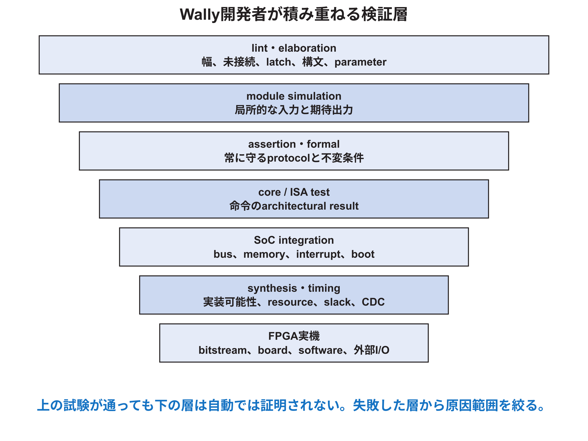

<a id="s_7_2"></a>
#### 7.2 lintとelaboration

lintは未使用signal、幅変換、multiple driver、latch、unreachable code、coding styleなどを早期に見つける。elaborationはparameterとgenerateを確定し、存在しないportや幅不一致を検出する。warningを数で無視せず、新規warningがない状態を保つ。

lint cleanは機能正しさを証明しないが、後段debugのnoiseを減らす。意図的な例外は狭い範囲で理由をコメントし、全体disableを避ける。[AMD901](#ref_AMD901)[AMD949](#ref_AMD949)

<a id="s_7_3"></a>
#### 7.3 module simulation

小さなmoduleへ直接入力し、全分岐と境界を試す。combinational moduleなら全入力を総当たりできる場合がある。FSMなら各状態・遷移・wait・resetを試す。random testは広い探索に有効だが、seedと失敗入力を保存する。

clocked interfaceでは、値だけでなくcycleとhandshakeを検査する。dataが正しくても一cycle早い、wait中に変化する、二回side effectを起こす場合は失敗である。

<a id="s_7_4"></a>
#### 7.4 assertion

assertionはsimulation中またはformal toolでproperty違反を検出する。例として、streamの停止中にdataを保持するpropertyは次の考え方になる。

```systemverilog
assert property (@(posedge clk) disable iff (reset)
  valid && !ready |=> valid && $stable({data, last}));
```

実際に導入するときは、protocolがvalid取消しを許すか、reset極性、unknown値、連続stallを仕様と照合する。assertionをtestbenchだけに置くかinterface近くへbindするかもproject方針で決める。

<a id="s_7_5"></a>
#### 7.5 formal verification

formalは、定めた前提の下で全状態・全入力についてpropertyの反例を探索できる。小さなdecoder、arbiter、FIFO control、算術等価性に有効である。state explosionがあるため、SoC全体を無条件に証明するより、境界を分ける。

「solverがunsat」とは、model化した論理式と前提の範囲で反例がない意味である。RTL全体、synthesis、analog、softwareまで自動で証明した意味に広げない。[付録Z](#ch_Z)はこの範囲分けを実例で示す。

<a id="s_7_6"></a>
#### 7.6 core-levelとISA test

ISA testは命令のarchitectural動作を調べる。Wally testbenchはELFを読み、構成に応じたtest群を選び、結果を照合する。新しいmicroarchitecture最適化では、対応する命令testと回帰testを実行する。[Wally](#ref_Wally)

ISA testが通っても、未試験のinterrupt timing、cache競合、peripheral integration、Linux workloadは残る。coverageとsystem testを追加する。

<a id="s_7_7"></a>
#### 7.7 differential verificationとRVVI

reference modelとretired instruction traceを比較すると、同じ命令列でarchitectural stateが一致するかを確認できる。内部pipeline timingは異なってよい。比較interfaceは、PC、instruction、register write、memory effect、trapなど、commit時の情報を正確に対応付ける。

reference model自身の構成、ISA extension、未定義動作をそろえる。差分が出た最初のretire位置から原因を絞る。

<a id="s_7_8"></a>
#### 7.8 integration simulation

core、uncore、memory、peripheralを接続し、address decode、bridge、interrupt、bootを試す。周辺回路追加では、ID read、read/write register、wait state、illegal access、reset、interruptを段階化する。RasterIXではAPB wrapper単体、FIFO、display swap、共有DDR、実gameの順に広げた。

一度にLinux bootだけを試すと、失敗原因が広過ぎる。小さなbare-metal testでregister accessを確認してからOSへ進む。

<a id="s_7_9"></a>
#### 7.9 合成後・配置配線後の確認

RTL simulationと合成結果が異なる原因には、Xの扱い、初期値、範囲外index、複数driver、unsupported constructがある。必要な境界では合成後functional simulationを行う。timing simulationは遅延を含むが、実行時間が長く、全system回帰の代わりにはしにくい。

本研究のFloatToInt監査では、未変更RTLの4値simulationとArtix-7合成後functional netlistで結果が異なった。これは、どちらか一方だけで全入力の正しさを主張してはいけない例である。

<a id="s_7_10"></a>
#### 7.10 FPGA実機とILA

実機はclock、reset、DDR calibration、board pin、外部device、softwareを含む統合証拠を与える。内部signalを観測するILAは有効だが、probe追加でplacement/timingが変わる可能性がある。trigger条件、capture depth、clock domainを記録する。

LEDやUARTは低costの観測点である。意味をsourceと対応付け、点灯だけから未観測の内部全体を正常と断定しない。

<a id="s_7_11"></a>
#### 7.11 coverage

code coverageはline、branch、toggle、FSM stateなど、simulationが通った場所を示す。functional coverageは仕様上の組合せを定義する。100% code coverageでもassertionが不十分ならbugは残る。未到達codeがdeadなのかtest不足かを判断する。

parameter構成ごとに存在するhardwareが違うため、一構成のcoverageを全構成へ一般化しない。

<a id="s_7_12"></a>
#### 7.12 bug reportを再現可能にする

最低限、commit、submodule、tool版、parameter、test名、seed、command、期待値、実測値、最初の失敗cycle、logを残す。実機ならboard、bitstream hash、SD image、接続、電源投入順も含める。

「たまに止まる」から、例えば「reset解除後の第127回commandで`valid=1, ready=0`中に`data`が変化する」まで狭めると、修正と回帰testを作れる。

<a id="ch_8"></a>
### 第8章 Wally開発者の設計・実装規律

<a id="s_8_1"></a>
#### 8.1 先にinterface契約を書く

moduleを実装する前に、port表、clock/reset、transaction成立条件、latency、backpressure、error、reset中の出力を決める。契約が曖昧なまま両側を同時に書くと、片側がvalidをpulseと考え、片側がlevel保持と考えるような不一致が起きる。

既存interfaceへ接続する場合は、独自に意味を作らず、仕様と既存sourceを読む。信号名が似ていても、AHBの`HREADY`とAXI4-Streamの`TREADY`はprotocol上の役割が異なる。

<a id="s_8_2"></a>
#### 8.2 小さい変更単位を作る

board対応、peripheral接続、software driver、performance最適化を一つの巨大diffへ混ぜない。各段階でbuild・test可能な境界を作る。後で`git bisect`でき、reviewerが変更理由を一つずつ確認できる。

一時的な測定codeやSDWire3操作scriptは研究資料側へ置き、公開repositoryの製品sourceと分ける。repositoryへ残すものは、利用者がbuild・利用するために必要な変更へ絞る。

<a id="s_8_3"></a>
#### 8.3 Wallyのcoding styleを使う

RVSOCが説明するWally styleでは、明確な同期式設計、`always_ff`と`always_comb`、parameter化、短く責務の明確なmodule、揃えたport宣言、名前によるstage表示などを重視する。[Harris26](#ref_Harris26)

styleは外見だけではない。latch、multiple clock、暗黙幅変換、巨大moduleを減らし、reviewしやすいhardwareを作る。既存fileへ変更するときは、その周囲のindent、命名、comment、license headerへ合わせる。

<a id="s_8_4"></a>
#### 8.4 commentには理由と契約を書く

codeを英語へ読み替えるだけのcommentより、なぜそのlatency、priority、exceptionが必要かを書く。例えば「registerを追加」の代わりに「DDR responseを一cycle遅らせ、AHB data phaseのselectとそろえる」と書く。

一方、事実と違う古いcommentは危険である。RTL変更時にcomment、diagram、test、parameter説明を同じcommitで更新する。

<a id="s_8_5"></a>
#### 8.5 parameter化し過ぎない

複数構成で実際に使う幅や機能はparameter化に向く。将来使うか不明な全信号をparameter化すると、組合せ爆発と未試験構成が増える。合法値、依存条件、default、test matrixを定める。

`P`のfield追加では、型定義、parameter生成、全構成の値、利用module、無効構成の代替接続を更新する。default 0でcompileが通るだけでは、全派生構成の意図を保証しない。

<a id="s_8_6"></a>
#### 8.6 warningを設計情報として扱う

unused signal、truncation、latch、undriven、CDC warningはbugの手掛かりである。既知で安全なwarningは局所的に抑制し、理由を残す。directory全体のwarningを無効化すると、新しいbugを隠す。

tool更新でwarning種類が変わるため、baselineとの差分を見る。warning数ゼロだけでなく、抑制一覧もreviewする。

<a id="s_8_7"></a>
#### 8.7 generated fileとsource of truth

Vivado IPの`.xci`、生成Tcl、出力RTL、bitstreamのどれをsource of truthとするか決める。人が編集するTclから再生成する設計で、生成済みfileだけを手修正すると次回buildで消える。

本構成ではboard用MIG/MMCM/FIFOの生成条件をTclに置き、`wally.tcl`がIPをimportする。tool版差で生成物が変わり得るため、再生成環境を記録する。

<a id="s_8_8"></a>
#### 8.8 変更前に影響範囲を描く

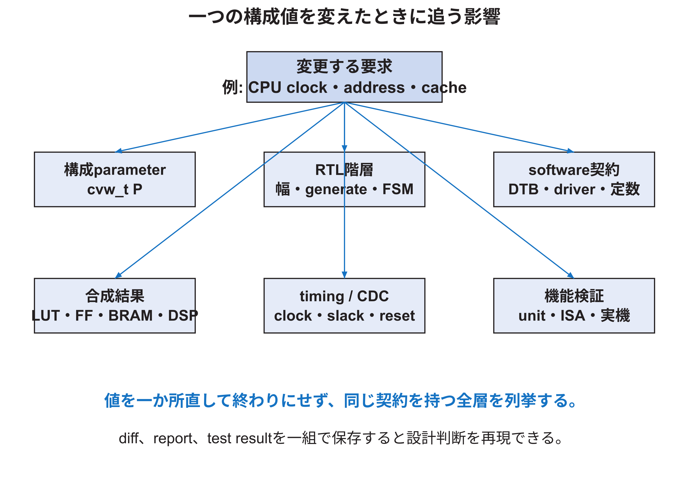

CPU clockを変える例では、MMCM、timing constraint、UART divisor、SD clock、AHB/AXI converter、device tree、performance測定が関係する。addressを変える例ではdecoder、PMA、device tree、driver、testが関係する。値の検索結果を並べるだけでなく、各表現がhardwareを作るのか、softwareへ知らせるのかを分類する。

<a id="s_8_9"></a>
#### 8.9 optimizationは測定可能な仮説にする

「MUXが遅そう」ではなく、「Execute stageのworst pathでoperand MUXがlogic delayの何%を占める。選択段数を一段減らせばWNSが改善する」という仮説にする。変更後に同じpath groupと機能testで比較する。

期待どおり改善しなかった結果も保存する。placement変動か、別pathがcriticalになったか、logic削減がrouting増加へ変わったかを調べる。

<a id="s_8_10"></a>
#### 8.10 review可能なcommit

一commitには一つの目的を持たせ、messageは命令形の短い要約とする。生成物、測定資料、機能変更を区別する。公開前に`git diff --check`、対象test、build、report差分、license、submodule pointerを確認する。

AIが作ったcodeでも責任は同じである。設計者本人がinterface、state、timing、testを説明でき、reviewで指摘された場合に修正できる状態へする。

<a id="s_8_11"></a>
#### 8.11 upstreamへ出せる変更の条件

upstreamの一般利用者に必要で、既存boardや構成を壊さず、repositoryのstyleに合い、再現可能なtestがあり、外部機器固有の一時scriptを含まないことが基本である。研究環境だけの測定codeは別資料に置く。

公式RasterIXをsubmoduleで使う場合、局所forkの変更を隠して「公式」と呼ばない。必要な修正があれば、upstream版、patch理由、互換性、testを明示する。

<a id="s_8_12"></a>
#### 8.12 開発者が残す設計記録

設計判断記録には、問題、制約、候補、採用案、棄却理由、根拠source、test、残るriskを書く。結果だけでなく理由を残すと、後から別のclockやboardへ移す際に再評価できる。

<a id="ch_K"></a>
### 付録K 回路とFPGAの基礎

<a id="s_K_1"></a>
#### K.1 0と1で値を表す

デジタル回路は、電気信号を0と1の二つの状態として扱う。実際の電圧は基板や端子の規格によって異なるが、論理の説明では0と1に整理する。一つの0または1をビットと呼ぶ。八つのビットをまとめた単位がバイトである。

二つのビットなら00、01、10、11の四通りを区別できる。数字に対応させれば0、1、2、3を表せる。三つなら八通り、八つなら256通りになる。一般にnビットで区別できる組合せは2のn乗通りである。32ビットの信号とは、32本分の0または1を同時に扱うまとまりである。

同じ32ビットでも、位置、色、命令、住所に相当する番号など、意味は用途によって違う。回路は名前から意味を理解するのではなく、設計した決まりに従ってそのビット列を処理する。送信側と受信側が同じ決まりを使うことが必要になる。

<a id="h0301"></a>
##### bitとbyteと16進数を小さな数で読む

bitは0か1を入れる一桁である。二桁なら00、01、10、11の四通りを区別できる。三桁なら八通り、八桁なら256通りを区別できる。8 bitをまとめた単位が1 byteである。32 bitは4 byte、64 bitは8 byteになる。

ソース中の0xは「後ろの数を16進数で読む」という印である。16進数は0〜9の次にA、B、C、D、E、Fを使い、その次に桁が上がって10になる。したがって0x10は十進数の16であり、十進数の10ではない。先頭の0x自体は数値に含めない。

| 十進数 | 4 bitの二進数 | 16進数 | この論文での例 |
|---:|---|---|---|
| 0 | 0000 | 0x0 | 最初の要素や通常命令口 |
| 4 | 0100 | 0x4 | 32 bit一個分のbyte数 |
| 8 | 1000 | 0x8 | 状態レジスタまでの差 |
| 12 | 1100 | 0xc | 識別値レジスタまでの差 |
| 15 | 1111 | 0xf | 4 bitをすべて1にした値 |

16進数の一桁は4 bitに対応する。0x04の下位4 bitを二進数で書くと0100なので、右端をbit 0として数えたbit 2が1になる。この関係を使い、[付録B](#ch_B)では0x00と0x04の操作で64 bitデータのどちら半分を選ぶかを説明する。

図K.1は、0x04を8 bitで書き直したものである。箱一個をbit一桁とし、右端から番号を付けている。薄い青の箱は1が入った桁であり、その桁の値を読む。

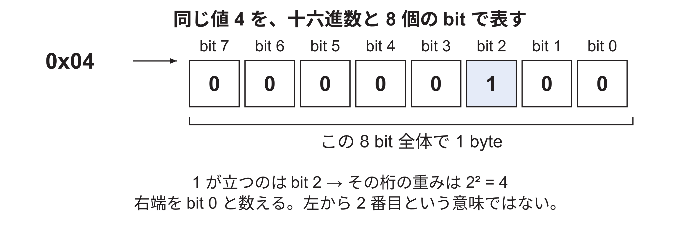

この図では、1が入っているのはbit 2だけなので、値は2の2乗で4になる。左側の0は、桁をそろえるために表示している。例えばbit 2を取り出す回路は、数値の「2」を取り出すのではなく、この列の特定の一桁を取り出す。


容量のKiBとMiBは、それぞれ1,024 byteと1,048,576 byteを単位にする。例えば512 MiBは512×1,048,576 byteである。「512」という数字だけでは、画素数かbyte数か回路の個数か分からないため、単位まで一緒に読む。

<a id="s_K_2"></a>
#### K.2 論理ゲートをつないで回路にする

ANDゲートは、二つの入力が両方1のときだけ1を出す。NOTゲートは0を1へ、1を0へ反転する。例えば、「指示がある」と「受け取れる」が両方1なら受け渡す、という条件はANDで表せる。このように、複数の信号から条件を計算する回路を組み合わせ回路と呼ぶ。

入力が変われば出力も変わるが、現実の回路には変化が伝わる時間がある。たくさんのゲートを順につなぐと、その時間が積み重なる。後で説明するクロックを速くしすぎると、計算結果が安定する前に次の回路が値を読み取る可能性がある。

```systemverilog
assign Transfer = Valid & Ready;
```

これはSystemVerilogという回路記述言語の例である。Validは「渡したいデータがある」、Readyは「受け取れる」を表す信号名として使っている。&はビットごとのANDであり、ここでは二つが両方1ならTransferを1にする。assignは、この関係を持つ回路の接続を表す。プログラムの一行が一度だけ実行される、という意味ではない。

<a id="h0315"></a>
##### 論理ゲートをつなぐと何ができるか

「書き込み要求がある」と「受け取る場所が空いている」を、それぞれ1 bitの信号で表す。要求をValid、空きをReadyと名付けると、両方が1のときだけ転送を成立させたい。その条件を計算するのがANDゲートである。

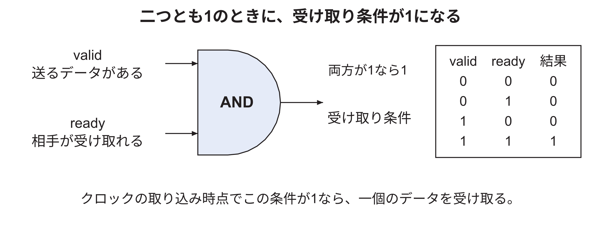

図K.2の左側二本は別の信号であり、右側は条件を計算した結果である。入力が1と0なら右側は0、1と1なら右側は1になる。ここで計算しているのは「今回受け取るか」であり、描画命令の32 bitデータそのものではない。実際の接続には、条件を伝える信号と、中身を運ぶ信号の両方がある。

`assign Transfer = Valid & Ready;`は、そのANDの関係を回路として書いた記述である。CPUがこの一行を繰り返し実行して条件を調べる、という意味ではない。FPGAには入力の組合せに応じて出力が変わる回路が用意される。

<a id="s_K_3"></a>
#### K.3 値を覚える回路

ゲームには前の位置が必要であり、接続回路にも前に受け取った命令を覚える場所が必要である。そこで、値を保持する回路を使う。ある決めたタイミングで入力を取り込み、その後は次の取り込み時点まで値を保つ回路がフリップフロップである。複数のビットをまとめて保持する部分をレジスタと呼ぶことがある。

```systemverilog
always_ff @(posedge clk)
  if (reset) Count <= 0;
  else if (Transfer) Count <= Count + 1;
```

この説明用回路は、転送回数を覚える。clkが0から1へ変わる時点をposedgeと書く。その時点でresetが1ならCountを0にする。resetが0でTransferが1なら、前のCountに1を加えた値を保存する。それ以外では前の値を保つ。<=は、この取り込み時点で次の値を記憶するための記法である。

ここまでを組み合わせると、「いつ受け渡しが起こるかをANDで決め、その回数をレジスタへ覚える」という回路を作れる。後で登場する表示切り替えの回数も、同じように出来事を数えた値である。

<a id="h0325"></a>
##### 計算する回路と覚える回路を組み合わせる

ANDゲートのように、現在の入力から現在の出力を決める部分を組合せ回路と呼ぶ。それだけでは「さっき何回受け取ったか」を覚えられない。回数を覚えるには記憶素子が必要になる。クロックに合わせて値を記憶するものを、この論文ではレジスタと呼ぶ。

例えばCountが4を覚えているとき、組合せ回路で4+1=5を求める。受け取り条件Transferが1なら、次のクロックの立ち上がりで5をCountへ保存する。Transferが0なら4を保持する。次のクロックでは、保持された値から再び次の候補を計算する。

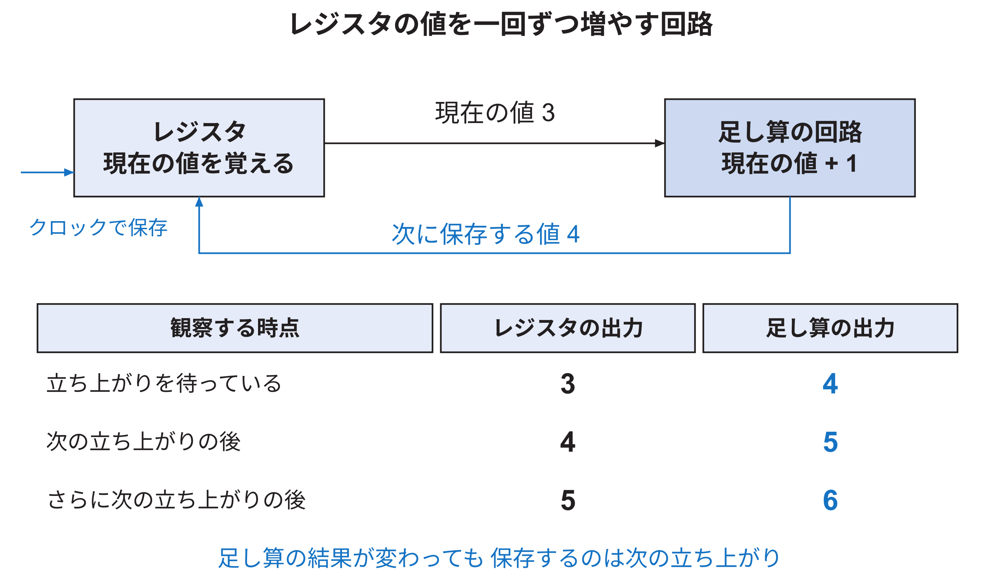

図K.3の箱のCountが現在の値、足し算の先が次の候補である。矢印で戻っているのは、記憶した値を次の計算へ使うためである。時計の一回の合図で一回保存するので、足し算の出力ができた瞬間に何度も増え続ける回路ではない。

`always_ff @(posedge clk)`は「clkが0から1へ変わるときに記憶を更新する」と読む。`Count <= Count + 1`の右辺は更新前の値、左辺は次に保存する値である。`<=`をここでは大小比較と読まない。`if`は、次に保存する候補をどちらから選ぶかを決める。

一つのalways_ffの中で、Countと別のレジスタを更新していても、記述した順に古い値が順次上書きされるC言語の代入と同じには扱えない。本稿の回路例では、立ち上がり直前の値から、立ち上がり後に保持する値を考える。

<a id="s_K_4"></a>
#### K.4 CPUがプログラムを実行する

[第2章](本文.md#ch_2)では「CPUがballXへ3を加える」と説明した。CPUの中にも、前節で扱った値を覚える回路と、足し算などを行う回路がある。CPUは、メモリから読み出した機械語命令に従って、どの値を読み、何を計算し、どこへ結果を残すかを選ぶ。

例えばballXが100のときは、値100をCPU内で使える場所へ読み、3を加え、得られた103を次の計算で使えるように保存する。CPU内で少量の値を覚える場所をレジスタという。よく使う値を毎回外部メモリから取り出す代わりに、レジスタに置いたまま計算を続ける場合もある。したがって、C++の一行が必ず一回の外部メモリ読み出しと書き込みになるわけではない。

C++をCPU用の機械語命令へ変換する道具がコンパイラである。CPU自身がC++の文章を読んで解釈するのではなく、変換後の命令列を実行する。同じように、描画ライブラリのglVertex2fという関数も、実行時にはCPUの命令列になる。「関数を一回呼ぶ」とは、CPUがその関数の中の処理へ進み、必要な計算をして戻ることであり、一つの論理ゲートだけを動かすことではない。

ここでいうCPUの機械語命令と、[第2章](本文.md#ch_2)の描画命令は別のものである。CPUは機械語命令を実行して計算やメモリへの保存を行う。その処理によって、描画回路へ渡すための描画命令をデータとして作る。後で描画命令を受け取って実行するのは描画回路である。「命令」という語を読むときは、どちらの回路に対する指示なのかを区別する。

RISC-Vは、この機械語命令やレジスタの使い方などの決まりの名前である。Wallyは、その決まりに従って命令を実行する具体的な回路設計である。FPGAは、そのWallyの回路を組み立てる場所になる。RISC-V、Wally、FPGAは同じ物の別名ではなく、それぞれ「命令の決まり」「CPUの設計」「回路を実現する部品」を指している。

<a id="s_K_5"></a>
#### K.5 FPGAの中へ回路を作る

FPGAには、論理機能、値を覚える回路、内部メモリ、配線を切り替える仕組みなどが用意されている。設定データによって、それらをどのようにつなぐかを決める。この設定によってCPUや描画回路を構成する。CPUという別の物理チップをFPGAへ載せる操作ではない。

論理機能を作る主な部品がLUTである。LUTは入力の組合せに対する出力を記憶する表のように働く。例えば二入力ANDなら、00、01、10には0、11には1を対応させればよい。実際のFPGAのLUTはもっと多くの入力を扱えるが、必要な論理を小さな表へ割り当てるという考え方は同じである。

Block RAM、略してBRAMは、FPGA内にあらかじめ用意されたメモリのまとまりである。多くの値を保存する用途に使う。DSPは乗算などの計算に使える専用回路である。これらの使用率は、FPGAに用意された数のうち、作った回路がどれだけ使ったかを表す。

<a id="h0342"></a>
##### 論理式がFPGAの中へ入るまで

FPGAには、組合せの計算に使うLUT、値を覚えるレジスタ、まとまった量を覚えるBlock RAM、配線の接続を選ぶ仕組みなどが用意されている。LUTは、入力の組合せに対する答えを保持する小さな表として理解できる。先ほどのANDなら、00、01、10には0、11には1という答えを設定する。

Vivadoは、回路ソースに書かれた計算や記憶を、これらの実物の部品へ割り当てる。この対応付けの大枠を作る処理が合成である。さらに、どの場所の部品を使い、どの配線を通るかを決める処理が配置配線である。最後に、その設定をFPGAへ送るbitstreamを作る。

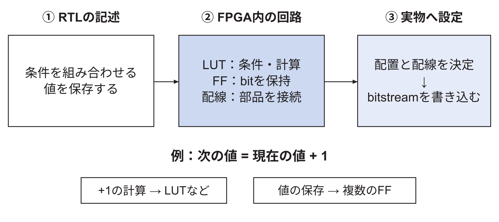

図K.4は、説明用の小さな回路を資源へ対応させる考え方である。一つのANDが必ず一個のLUTになるという個数の予測図ではない。Vivadoは複数の式をまとめたり、不要な計算を消したりできる。実際に使った個数は[第13章](本文.md#ch_13)の配置配線後のレポートで確かめる。

<a id="h0347"></a>
##### CPUをFPGAに作った後、ゲームのfor文はどこで動くか

FPGAへWallyの回路を設定すると、FPGA内に機械語命令を読んで実行するCPUができる。そのCPUが、SDカードから起動したLinux上でゲームの実行ファイルを動かす。ゲームのfor文やwhile文は、このCPUが繰り返し命令を実行することで進む。本研究では、ゲームのC++を直接、ボール専用の論理回路へ変換しているわけではない。

一方、描画回路の信号の接続やFIFOの容量は、FPGAへ設定する回路の一部である。ゲームを終了して別のゲームを起動しても、この配線や容量は変わらない。変えるには回路の設定ファイルを作り直す。ここが、ゲームのプログラムを変更する場合と、ゲーム機そのものの回路を変更する場合の違いである。

20 MHzというCPUのクロックは、毎秒2,000万回、回路の値を更新するための基準が来ることを示す。一回の基準でゲーム画面が一枚できるという意味ではない。CPUは多数の命令を実行し、メモリや周辺回路を待つこともある。そのためゲームの描画回数は、CPUのクロックの数字だけからは求められない。

<a id="s_K_6"></a>
#### K.6 FPGAチップと基板を区別する

Nexys Videoは、FPGAチップの周りにDDR3メモリ、microSDスロット、映像端子、スイッチ、LEDなどを載せた基板である[NexysVideo](#ref_NexysVideo)。DDR3は基板上の別のメモリ部品であり、FPGA内のBRAMとは別である。画像を保存する大きな領域にはDDR3を使い、描画途中の作業などにはBRAMも使う。


図のゲートは、回路をつなぐという考え方を示した小さな例である。実際のCPUを数個のゲートだけで実装したという意味ではない。FPGAの外側の部品と、内側の制御回路を分けて描いている。基板上の配線は製造時に決まっており、設計者はその配線につながるFPGAの端子を使う。

<a id="part_II"></a>
## 第II部 Wally CPUとSoCアーキテクチャ

RISC-Vのsoftware-visibleな仕様から、Wallyの構成parameter、五段pipeline、hazard、cache、MMU、privileged unit、uncore、bus、検証へ降りる。Wallyへ機能を追加するときに、変更場所と影響範囲を判断できることを目標とする。

<a id="ch_9"></a>
### 第9章 Wallyの階層と構成を読む

<a id="s_9_1"></a>
#### 9.1 core、SoC、board topを区別する

`wallypipelinedcore`は命令を実行するcoreである。`wallypipelinedsoc`はcoreとuncoreを組み合わせ、memoryやperipheralへ接続する。FPGA最上位はboardのpin、clock生成、DDR controller、reset、Wally SoCを結ぶ。これらをすべてCPUと呼ぶと、変更場所を誤る。[Wally](#ref_Wally)[Console26](#ref_Console26)

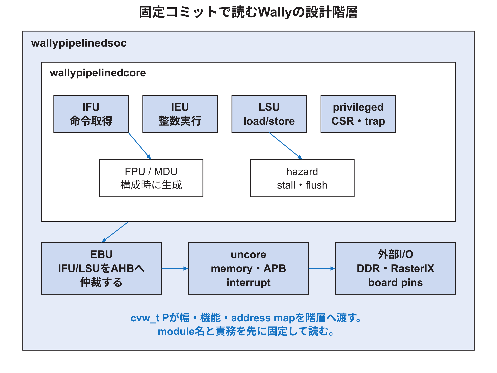

RasterIX追加では、RISC-V命令実行器の内部へ描画pipelineを入れたのではない。uncoreの外部APB interfaceとboard topに描画回路を接続した。ゲームsoftwareは通常のstoreで命令語を送り、RasterIXはCPUと並列に動く。

<a id="s_9_2"></a>
#### 9.2 `wallypipelinedcore`の主要unit

| unit | 主な責務 | 入口となるsource |
|---|---|---|
| IFU | PC、命令取得、予測、I-cache | `src/ifu/ifu.sv` |
| IEU | decode、register file、ALU、control | `src/ieu/ieu.sv` |
| LSU | load/store、D-cache、MMUとの接続 | `src/lsu/lsu.sv` |
| privileged | CSR、trap、interrupt、権限 | `src/privileged/privileged.sv` |
| HZU | stallとflush | `src/hazard/hazard.sv` |
| FPU | 浮動小数点演算 | `src/fpu/fpu.sv` |
| MDU | 乗算・除算 | `src/mdu/mdu.sv` |
| EBU | IFU/LSU要求を外部busへ | `src/ebu/ebu.sv` |

moduleを読むときは、全signalを一度に暗記しない。責務ごとにportを分け、要求data、応答data、valid/ready、stall/flush、exception、configurationに色分けする。

<a id="s_9_3"></a>
#### 9.3 `cvw_t`は構成契約である

`src/cvw.sv`の`cvw_t`にはXLEN、ISA extension、cache形状、TLB、address map、peripheralの有無などがまとまる。各moduleは`#(parameter cvw_t P)`を受け、`P.XLEN`などを参照する。構成をpackageへ集めることで、global macroの名前衝突と、階層ごとのばらばらな値を減らす。[Wally](#ref_Wally)[Harris26](#ref_Harris26)

ただし値を一か所へ集めただけで整合が自動保証されるとは限らない。boardのDDR容量、device tree、boot software、C++定数など、SystemVerilog外にも同じ事実の表現がある。変更影響を列挙し、生成物を更新する。

<a id="s_9_4"></a>
#### 9.4 configurationから回路が生成されるまで

`config/derivlist.txt`などの派生構成から`config.vh`とparameter定義が作られ、testbenchやFPGA buildが`P`を組み立てる。`P.F_SUPPORTED`や`P.BUS_SUPPORTED`はgenerate条件として使われ、不要unitを物理回路から除ける。

実行時にfeature bitを0へ書けば回路が消えるわけではない。compile/elaboration時parameterと、softwareから書き換えるcontrol registerを区別する。前者はbitstreamを作り直す必要がある。

<a id="s_9_5"></a>
#### 9.5 interfaceから階層を理解する

大きなmoduleを読む順番は次である。

1. parameterとclock/resetを読む。
2. 入出力を機能別に分ける。
3. 内部signalのstage suffixと幅を確認する。
4. submodule instanceをブロック図へ置く。
5. 各submodule間の要求・応答を一経路ずつ追う。
6. generateの有効・無効両方で未駆動がないか確認する。

`wallypipelinedcore.sv`を先頭から逐語的に読むより、IFU→IEU→LSU→EBU、privileged→hazardという経路を選んだ方が理解しやすい。

<a id="s_9_6"></a>
#### 9.6 IFUを読む観点

IFUは次に取得するPCを選び、instruction memoryまたはI-cacheへ要求し、得た命令をDecodeへ渡す。branch predictionが有効なら、予測PCと後で判明した正しいPCを比較する。compressed instruction対応では、16 bit単位の境界と命令の組立ても関係する。

確認する状態は、PC register、fetch buffer、cache/TLB state、予測器stateである。stall時にPCを保持する条件、flush時に次PCを切り替える条件、instruction access faultがどのstageへ届くかを追う。

<a id="s_9_7"></a>
#### 9.7 IEUを読む観点

IEUは命令fieldをdecodeし、register fileからoperandを読み、immediateを生成し、ALU・branch・CSR・load/store制御を作る。Decodeで決めるcontrolと、Execute/Memoryへpipeline registerで運ぶcontrolを分ける。

data path変更では、値だけでなく、結果を選ぶMUX、write enable、destination register番号、exception条件、forwarding sourceを追う。新しい演算をALUへ加えても、decodeとwriteback selectionがなければarchitectural resultへ届かない。

<a id="s_9_8"></a>
#### 9.8 LSU、cache、MMUを読む観点

LSUはeffective address、byte/half/wordのalignment、loadの符号拡張、store byte mask、atomic、D-cache、address translation、PMP/PMA、bus requestを結ぶ。単にmemoryを読むmoduleではない。

virtual addressからphysical addressへの変換、cacheableか、alignment違反か、access権があるかを順に区別する。Linux構成でpage faultとbus errorを同じ原因として扱わない。cache missではpipeline stallとline refillが起こり、uncached MMIOでは周辺回路のreadyを待つ。

<a id="s_9_9"></a>
#### 9.9 privileged unitを読む観点

privileged unitはCSR、現在のprivilege mode、interrupt、exception、trap vector、returnを扱う。RISC-V privileged specificationはsoftwareから見える動作を定め、Wally RTLはそれをpipelineへ統合する。[RISCVPriv26](#ref_RISCVPriv26)

precise exceptionでは、trapより前の命令は完了し、後の命令はarchitectural stateを変更してはならない。exceptionを検出したstage、CSRへ記録するPCと原因、pipeline flush、進行中memory operationを対応付ける。

<a id="s_9_10"></a>
#### 9.10 新しい機能をどこへ置くか

| 要求 | 通常の配置候補 | 避けるべき混同 |
|---|---|---|
| 新しいRISC-V命令 | decode、data path、CSR、test | 周辺register追加と同一視する |
| memory-mapped peripheral | uncore、APB、address map | ALUへ直接置く |
| 高bandwidth accelerator | bus/stream、DMA、memory契約 | APB registerだけでdata全量を送る |
| board pin追加 | FPGA top、XDC、I/O回路 | core RTLへboard名を埋め込む |
| software-only機能 | driver/application | 不要なhardware stateを増やす |

責務の近い階層へ置けば、coreの再利用性と検証範囲を保ちやすい。RasterIXのようなacceleratorでも、control path、command path、bulk memory path、display pathを別々に設計する。

<a id="ch_10"></a>
### 第10章 命令pipelineとarchitectural state

<a id="s_10_1"></a>
#### 10.1 一命令の流れを最後まで追う

一つの`add x5, x6, x7`を例にする。Fetchで命令を読み、Decodeでopcodeとregister番号を読み、register fileからx6とx7を得る。Executeで加算し、Memoryではload/storeでないため結果を通し、Writebackでx5へ書く。各stage間のregisterはdataとcontrolを同じ命令として運ぶ。

追跡時はPC、命令word、source値、ALU control、結果、destination番号、write enableを表にする。波形で一つだけstageがずれていれば、別命令のcontrolで値を書き込む重大な誤りになる。

<a id="s_10_2"></a>
#### 10.2 architectural stateと一時状態

general-purpose register、PC、CSR、memoryのsoftware-visible内容はarchitectural stateである。pipeline register、予測器counter、cache tag、FIFO pointerはmicroarchitectural stateである。microarchitectural stateは実装により違ってよいが、最終的にISAで許されるarchitectural結果を作る必要がある。[RISCVUnpriv26](#ref_RISCVUnpriv26)[RISCVPriv26](#ref_RISCVPriv26)

debug時にpipeline内部の一時値が違うだけでISA違反とは限らない。retireした命令列とarchitectural stateを比較する。逆に、最終画面が同じでも例外順序やmemory side effectが違えば、CPUとして正しいとは限らない。

<a id="s_10_3"></a>
#### 10.3 control hazardと分岐予測

branchの行先はFetch時には未確定である。予測器は先にPCを選び、後段で条件とtargetが確定したとき、誤りなら若い命令をflushする。予測は性能機能であり、誤予測してもarchitectural結果は正しくなければならない。

予測器変更ではaccuracyだけでなく、誤予測回復、RAS、BTB、instruction class予測、flush stageを確認する。予測情報の更新がsquashされた命令で行われないかも検討する。

<a id="s_10_4"></a>
#### 10.4 data hazardとforwarding priority

複数の後段stageが同じsource registerの新しい値を持つ場合、最も新しい命令の結果を選ぶ。Memory stageとWriteback stageの両方が一致したときのpriorityを明示する。x0は常に0であり、x0へのwrite予定をforward sourceとして扱わない。

load-useではdataが得られる時刻を確認する。cache hit、uncached bus、miss refillでlatencyが違う場合、固定一cycleの想定だけでは不十分になる。valid/readyまたはstallで完了まで保持する。

<a id="s_10_5"></a>
#### 10.5 structural hazard

二つの処理が同じhardwareを同cycleに必要とするとstructural hazardになる。単一port memoryをinstructionとdataが同時に使う、一つのdividerへ別命令を投入する、共有busへIFUとLSUが要求する場合が例である。

対策は資源複製、port追加、仲裁、stall、schedule変更である。面積と性能のtrade-offを測る。WallyのEBUはIFUとLSU要求を外部AHBへ仲裁するため、bus側の完了とpipeline stallが結び付く。

<a id="s_10_6"></a>
#### 10.6 precise trapとcommit

trap発生時に、どこまでを完了した命令と見なすかがcommit境界である。storeが外部へ出た後で命令をflushしても、周辺回路のside effectは取り消せない。このためbus transaction開始条件と、interruptを受けられる安全な時点を設計する。

`BusCommitted`のようなsignalは、進行中memory operationがありinterruptで中断すべきでない期間を示す。名前だけで意味を推測せず、assert条件、解除条件、trap logicでの利用先を追う。

<a id="s_10_7"></a>
#### 10.7 CSR、interrupt、exception

CSR instructionは通常のregister fileとは別のarchitectural stateを読み書きする。interruptは外部またはtimerなどの非同期的な出来事を、instruction境界でtrapとして扱う。exceptionは実行中命令に起因するillegal instruction、page fault、misalignmentなどである。

同じtrap経路を使っても原因と再開PCは異なる。`mepc`、`mcause`、`mtval`などへ何を記録するかを仕様とtestで照合する。device interrupt追加では、peripheralのpending、PLIC source、CSR enable、global enable、handlerまで全経路を確認する。[RISCVPriv26](#ref_RISCVPriv26)

<a id="s_10_8"></a>
#### 10.8 performance counterを解釈する

cycle、retired instruction、cache miss、branch mispredictionなどのcounterは、性能原因を分解する材料になる。CPIはcycle/instructionである。clock frequencyとCPIを組み合わせて実行時間を考える。

counterの定義、増えるevent、reset、overflow、privilege accessを確認する。softwareの区間計測では、計測前後のfence、compiler最適化、warm-up、OS割込みを考える。counter一個だけで「GPUが遅い」「CPUが遅い」と断定しない。

<a id="s_10_9"></a>
#### 10.9 pipeline変更のreview表

| 観点 | 確認質問 |
|---|---|
| data | 新しい値はどのstageで生成されるか |
| control | その値のvalidと選択信号は同じstageか |
| hazard | forwarding、stall、flushへ何を足すか |
| exception | fault時にside effectを止められるか |
| timing | どのregister間pathが長くなるか |
| verification | 依存命令、branch、trap、stallを試したか |

pipeline registerを一個足す変更でも、この全項目を確認する。

<a id="ch_11"></a>
### 第11章 Memory systemとon-chip bus

<a id="s_11_1"></a>
#### 11.1 addressは相手を選ぶ契約である

CPUが出すaddressは、DRAMのbyte位置だけを表すとは限らない。physical address spaceの範囲ごとに、RAM、ROM、CLINT、PLIC、UART、SD、外部I/Oなどが割り当てられる。memory-mapped I/Oでは、通常のload/store命令が周辺registerのread/writeになる。[Harris26](#ref_Harris26)[Wally](#ref_Wally)

address mapにはbaseとrange、alignment、access size、read/write可否、cacheability、side effectが必要である。RTL decoder、PMA/PMP、device tree、software定数の値を一致させる。baseだけ一致しrangeが違う場合、隣のdeviceと重なるか、未選択領域が生じる。

<a id="s_11_2"></a>
#### 11.2 cache line、tag、index、offset

cacheはmemoryの一部をline単位で保持する。addressをtag、set index、line内offsetへ分ける。hitはvalidでtagが一致することを意味する。set associative cacheでは複数wayを並列比較し、replacement stateでmiss時のwayを選ぶ。[Harris26](#ref_Harris26)

cache容量だけで性能は決まらない。line size、way数、miss penalty、access pattern、BRAM port、clock frequencyが関係する。way数を増やすとconflict missを減らせる可能性があるが、tag比較とMUXが増え、timingと資源へ影響する。

<a id="s_11_3"></a>
#### 11.3 write policyとdirty data

write-throughはstoreを下位memoryへも送る。write-backはcache lineをdirtyにし、追出し時に書き戻す。Wallyの固定構成で採用したpolicyはsourceとparameterで確認する。一般論だけで「cacheの値は直ちにDDRへ書かれる」と決めない。

memory-mapped I/Oをcacheすると、read side effectやcontrol writeが遅延・統合される危険がある。PMAでuncacheable領域として扱い、ordering要求を守る。RasterIXのcontrol registerと共有framebufferでは、register access、CPU cache、DMA相当の外部master、reserved memoryを分ける。

<a id="s_11_4"></a>
#### 11.4 IFU・LSUからEBUへ

IFUはinstruction fetch、LSUはdata accessを要求する。両方が同時に外部busを必要とする場合、EBUが仲裁する。仲裁はどちらを先に進めるかを決め、選ばれなかった側へstallを返す。long-latency accessでは、要求を出した側と応答を受ける側の対応を保持する。

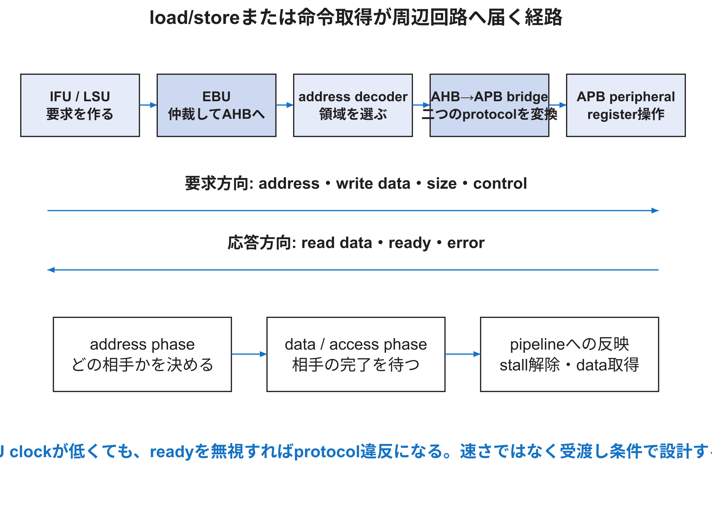

`src/ebu/ebu.sv`、`busfsm.sv`、`controllerinput.sv`を組にして読む。FSMだけでは、address/data MUXとpipelineへのstallが見えない。

<a id="s_11_5"></a>
#### 11.5 AHBのaddress phaseとdata phase

AHBはaddress/control phaseとdata phaseを重ねられる。現在のaddressが選んだperipheralと、次cycleのdata/readyが対応するため、selectをregisterで遅らせる必要がある。Wallyの`uncore.sv`は`HSELRegions`を`HREADY`でenableされたregisterへ保持し、read dataとreadyのMUXに使う。[Wally](#ref_Wally)[Harris26](#ref_Harris26)

peripheralが`HREADY`を下げる間、controllerはtransactionを保持する。addressが次へ進んでも、完了していないdata phaseの相手を失ってはならない。波形では、単一cycleの縦断面だけでなく、連続する二つ以上のtransactionを追う。

<a id="s_11_6"></a>
#### 11.6 address decoderの正しさ

decoderは`address`と各領域のbase/rangeからone-hot selectを作る。確認すべき性質は、正しい範囲で選ばれる、異なる領域が同時選択されない、未定義addressでbusが永久停止しない、access属性が一致することである。

範囲をthermometer maskとして表す設計では、任意のサイズを指定できるとは限らない。base alignmentとrange形式を構成生成時に検査する。新しいperipheralを追加するときはdecoder bit、select vector幅、read/ready MUX、interrupt sourceを一組で増やす。

<a id="s_11_7"></a>
#### 11.7 AHBからAPBへのbridge

APBはsetup phaseとaccess phaseを持つ。setupでは`PSEL`、address、write control、write dataを準備し、accessでは`PENABLE`を上げる。peripheralは完了まで`PREADY`を0にできる。bridgeはAHB側の要求をAPBの二phaseへ変換し、完了をAHBへ返す。[Harris26](#ref_Harris26)

APBは単純だが、`PSEL & PENABLE`のlevelを毎cycle新しい書込みとして数えると、wait中にside effectを複数回発生させる。実際の受渡しは`PSEL & PENABLE & PREADY`が成立した完了cycleとして設計する。

<a id="s_11_8"></a>
#### 11.8 APB peripheralのregister map

周辺回路を設計する前に、offset、幅、read/write、reset値、side effectを表にする。

| offset | 名前 | access | 意味 | side effect |
|---:|---|---|---|---|
| 0x00 | ID | R | 固定識別値 | なし |
| 0x04 | CONTROL | R/W | enable、mode | write時に更新 |
| 0x08 | STATUS | R | busy、error | なし |
| 0x0C | DATA | W | command data | 完了時にFIFOへ投入 |

reserved bitのread値、部分writeの`PSTRB`、illegal offset、連続accessを決める。read-clearやwrite-one-to-clearは便利だが、softwareが読むだけで状態が変わるため明記する。

<a id="s_11_9"></a>
#### 11.9 valid/readyとbackpressure

valid/ready interfaceでは、transferは両方が1のcycleだけ成立する。送り手はvalidを上げた後、readyになるまでdataを保持する。受け手は受け取れるときreadyを上げる。readyが0だからdataが無効になるわけではない。

APBからAXI4-Streamへbridgeする場合、APBの`PREADY`をstream側`TREADY`と関係付ける。FIFOが満杯ならCPU accessを待たせるか、明示的なerrorを返す。silent dropはcommand列を壊す。

<a id="s_11_10"></a>
#### 11.10 FIFOの必要性を速度だけで説明しない

FIFOは、到着と処理の一時的なずれを、空き容量の範囲で吸収する。平均して到着が処理より速い状態が続けば、有限のFIFOはいずれ満杯になり、処理能力の不足そのものは解消しない。受け取り停止への対応はAPBの待ちでも実現でき、クロック間の受け渡しにもFIFO以外の方法がある。E6では1語ずつ渡す4相方式、16語FIFO、512語FIFOを実装して比べ、512語FIFOでCPUのAPB待ちが短くなることを確認した。全候補中の最適性や512語すべての必要性を示した実験ではない。詳しい回路と計測は[技術付録第29章](#ch_29)にある。[E6](#ref_E6)

FIFO採用理由は「受け手が永久に遅い」ではなく、readyが一時的に下がってもprotocolを守り、二つのclock domain間でdataと順序を保つことである。容量理由は別に、最大burst、停止時間、通知遅延から評価する。[付録I](#ch_I)でこの設計を詳しく扱う。

<a id="s_11_11"></a>
#### 11.11 memory ordering、`volatile`、fence

`volatile`はcompilerへaccessを省略・統合しないよう伝えるが、CPU、cache、bus、deviceの完了を単独で保証しない。RISC-Vのmemory ordering、I/O属性、fence、device-specific statusを組み合わせる。[RISCVUnpriv26](#ref_RISCVUnpriv26)

commandを書き終えたこと、RasterIXがcommandを受理したこと、描画を完了したこと、displayが新frameを読み始めたことは別の時点である。software APIは必要な完了段階を明示する。単なる固定`usleep`は、完了を観察せず時間を推測している。

<a id="s_11_12"></a>
#### 11.12 cache coherenceと共有DDR

CPU cacheと、CPU cacheを経由しないhardware masterが同じDDR領域を共有すると、古いcache lineを読む問題が生じる。解決はhardware coherence、uncached mapping、cache clean/invalidate、所有権移譲protocolなどである。採用方式をsourceとOS設定で確認する。

本研究のreserved-memoryはLinuxの通常allocatorから領域を除外するが、それだけでcache coherenceやhardware protectionを作らない。誰がいつ書き、誰がいつ読むかという所有権と、可視化の操作を別に設計する。

<a id="s_11_13"></a>
#### 11.13 bandwidth、latency、outstanding数

bandwidthは単位時間に運べるdata量、latencyは一要求の応答時間である。wide busでも、一要求ずつ完了を待てばlatencyに支配される。split transactionや複数outstanding requestはlatencyを隠せるが、IDと順序管理を増やす。

測定では、payload byteだけでなくprotocol overhead、burst長、wait、clock crossing、DDR効率を含める。理論最大値は上限であり、applicationの達成値ではない。

<a id="ch_12"></a>
### 第12章 Wallyを変更する実践課題

<a id="s_12_1"></a>
#### 12.1 課題の進め方

各課題は、仕様、ブロック図、RTL、simulation、合成、report、実機の順に進める。いきなり完成sourceを写さず、自分のinterface表と期待波形を先に作る。元repositoryは別worktreeまたは別cloneで保持する。

<a id="s_12_2"></a>
#### 12.2 読出し専用APB識別register

最初の課題は、固定値を返すread-only registerである。base addressを選び、offset 0で32 bit IDを返し、それ以外は0または定義したerror値にする。zero-waitならaccess phaseで`PREADY=1`とする。

成功条件は、未選択時にbusへ影響しない、readでIDが一致する、writeで状態が変わらない、部分access方針が明確、reset前後で同じ値、既存peripheral testが通ることである。

<a id="s_12_3"></a>
#### 12.3 read/write control register

次にenable bitを持つregisterを加える。`PSEL & PENABLE & PWRITE & PREADY`の完了時だけ更新し、`PSTRB`に従う。readbackを実装する。reset値を仕様化する。

wait stateを挿入したtestを作り、access phaseが複数cycle続いても一回だけ更新されることを確認する。back-to-back read/writeも試す。

<a id="s_12_4"></a>
#### 12.4 counter peripheralとinterrupt

clockごとに増えるcounter、compare register、pending bitを作る。pendingのsetとclearが同cycleに起きたpriorityを決める。interruptをPLICへ追加するならsource ID、enable、priority、claim/complete、device tree、handlerまで追う。

softwareがinterruptを受けた回数だけでなく、pendingが保持され、clear後に再発できることを波形で確認する。

<a id="s_12_5"></a>
#### 12.5 pipelineへ一つの演算を加える思考実験

独自命令を実装する前に、既存ALU operationを一つ選び、decodeからwritebackまで追跡する。opcode、control、operand、ALU、result MUX、destination、forwarding、illegal instruction、test vectorを表にする。

新命令追加ではRISC-V custom encodingの扱い、assembler、compiler、ISA test、privilege、exceptionを含む。授業演習であっても、既存標準encodingと衝突させない。

<a id="s_12_6"></a>
#### 12.6 cache parameter変更

way sizeやline lengthを変更し、index/tag幅、memory wrapper、refill burst、LRU、address alignment、utilization、timing、benchmarkを比較する。parameterがcompileするだけで完了とせず、境界addressとconflict patternを試す。

性能向上を主張するなら、同じworkload、warm-up、clock、software、measurement区間でmiss率と実行時間を示す。

<a id="s_12_7"></a>
#### 12.7 critical pathを一つ改善する

固定runのworst pathを選び、startpointからendpointまでをschematicとsourceへ対応付ける。logic delay、route delay、fanoutを記録し、候補を一つ選ぶ。RTL変更前後で機能test、WNS/TNS、resourceを比較する。

pipeline registerを足す場合は、latency、valid、stall、flushまで変更する。constraintだけを変えた場合は、回路改善とは別結果として扱う。

<a id="s_12_8"></a>
#### 12.8 CDC interfaceを設計する

一bit level、pulse、複数bit設定、連続streamの四種類について、適切な方式を選び、誤った方式では何が失われるかを説明する。非同期位相と異なる周波数を変えたsimulation、reset途中、backpressureを試す。

FIFOなら、full/empty、overflow/underflow、順序、TLAST、reset後のpointer、片側停止をpropertyにする。容量の採用理由を最大burstと停止時間から計算する。

<a id="s_12_9"></a>
#### 12.9 WallyとRasterIXの接続を再説明する

次の一文を、最低でも十個の具体的な段階へ分解する。

> CPUがRasterIXへ命令を送り、RasterIXが画像を表示する。

address decode、APB transfer、command FIFO、CommandParser、Rasterizer、fragment pipeline、内部framebuffer、DDR transfer、display swap、pixel出力を順に説明する。各段階でclock、data、完了条件、確認方法を一つ書く。[付録G](#ch_G)〜Zを答え合わせに使う。

<a id="s_12_10"></a>
#### 12.10 開発者レベルの自己確認

次の質問へsourceとreportを示して答えられれば、概要説明から設計判断へ進んでいる。

1. `always_comb`の代入漏れがなぜlatchになるのか。
2. 同じ`for`でも、software loopと回路複製をどう区別するか。
3. BRAM推論を失うRTL変更の例は何か。
4. WNSが正でもtimingを信用できない場合は何か。
5. stallとflushが同時に起きるとき何を守るか。
6. `PREADY=0`中にAPB masterとperipheralは何を保持するか。
7. 二段synchronizerで複数bit busを安全に渡せない理由は何か。
8. `cvw_t P`の値を変えたとき、SystemVerilog外の何を確認するか。
9. ISA test、module test、実機testがそれぞれ証明しないものは何か。
10. 最適化前後で機能同一性とPPAをどう比較するか。

答えに迷った場合は、該当章を読み直し、固定版sourceの一例へ結び付ける。用語の定義だけでなく、変更、予想される回路、確認report、失敗条件まで説明する。

<a id="ch_13"></a>
### 第13章 Wallyの構成値が回路になるまで

<a id="s_13_1"></a>
#### 13.1 構成値は単なる一覧ではない

Wallyは、同じRTLからRV32またはRV64、cacheの有無、仮想memoryの方式、周辺回路、分岐予測器などが異なるprocessorを作れる。これを可能にするのが構成値である。しかし、構成値をsoftwareの設定fileと同じだと思うと不十分である。値によってbit幅が変わり、`generate`でmoduleそのものが存在しなくなり、address decoderの論理も変わる。すなわち、構成値はelaboration時に作る回路を決める設計入力である。[Harris26](#ref_Harris26)[Console26](#ref_Console26)

固定版では、Nexys Video単体の派生構成が`fpganexysvideo`、RasterIXを加える派生構成が`fpganexysvideo_rasterix`である。後者は前者を継承し、`EXT_IO_SUPPORTED`だけを追加で有効化する。この分離により、基板対応と、特定の外部周辺回路の接続を同じ変更として扱わずに済む。

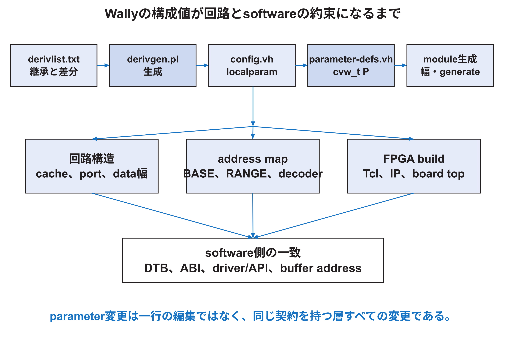

<a id="s_13_2"></a>
#### 13.2 `derivlist.txt`から`config.vh`が生まれる

構成のsource of truthは`config/derivlist.txt`である。`deriv fpganexysvideo fpga`は、`fpga`の値を受け継いでNexys Video固有の変更を加える関係を表す。`deriv fpganexysvideo_rasterix fpganexysvideo`は、その上へRasterIX接続に必要な値を加える。

`bin/derivgen.pl`はこの継承関係を読み、`config/deriv/<名前>/config.vh`を生成する。生成物を直接直すと、次にderivgenを実行したとき変更が消える。したがって、値を永続的に変える入口は`derivlist.txt`または基底構成であり、生成済み`config.vh`は答え合わせの対象である。

```bash
cd "$WALLY"
perl bin/derivgen.pl
grep -n 'EXT_IO_SUPPORTED\|EXT_MEM_RANGE' \
  config/deriv/fpganexysvideo_rasterix/config.vh
```

成功条件は、選んだ派生構成の生成fileに意図した値が一度だけ現れ、親から受け継ぐ値も保持されることである。生成時刻だけを見ず、`git diff -- config/deriv`で意図しない派生構成まで変わっていないか確認する。

<a id="s_13_3"></a>
#### 13.3 `cvw_t`は型付きの構成契約である

`src/cvw.sv`は`cvw_t`というpacked structを定義する。そこには`XLEN`、`PA_BITS`、cacheのway数とline長、各ISA extension、各memory領域のBASEとRANGE、周辺回路の有効値などが入る。`config/shared/parameter-defs.vh`は、`config.vh`のlocalparamを同じfieldへ詰め、`localparam cvw_t P = '{ ... };`を作る。

各moduleは`import cvw::*; #(parameter cvw_t P)`として同じ契約を受け取る。例えば`P.XLEN`はdata pathの幅、`P.PA_BITS`は物理addressの幅、`P.EXT_IO_SUPPORTED`は外部APB portを生成するかを決める。structへまとめる利点は、数十個のparameterをmoduleごとに別順序で渡さず、field名で意味を固定できることである。

一方、`P`の値がすべてruntimeに保存されたregisterになるわけではない。多くはelaboration時の定数であり、使われない分岐を合成前に消す。値を読み出すsoftware用registerが必要なら、別途RTLで実装しなければならない。

<a id="s_13_4"></a>
#### 13.4 BASEとRANGEの読み方

Wallyのaddress領域は`BASE`と`RANGE`で表す。`src/cvw.sv`のcommentが示すように、RANGEは下位bitが連続して1になるthermometer codeを想定する。例えば32 MiBならサイズは`0x02000000`、RANGEはその一つ下の`0x01ffffff`である。decoderは、addressの可変部分をmaskし、BASEと一致するかを調べる。

`BASE + RANGE`は含まれる最後のaddressであり、領域のbyte数は`RANGE + 1`である。`0x10080000`をBASE、`0x000000ff`をRANGEにすると、`0x10080000`から`0x100800ff`までの256 byteを選ぶ。softwareの`mmap`長4096 byteと、hardware register領域256 byteは別の値である。

address範囲を変えるときは、次の四者を比較する。

| 層 | 具体的な場所 | 一致させる内容 |
|---|---|---|
| Wally構成 | `config/derivlist.txt` | BASE、RANGE、有効値 |
| RTL接続 | `uncore.sv`とboard top | decoderで選ばれる相手 |
| OSの説明 | `.dts`の`reg` | 物理addressと長さ |
| application | `mmap`のoffset、register index | accessするaddressと幅 |

<a id="s_13_5"></a>
#### 13.5 構成値と生成条件を混同しない

`EXT_IO_SUPPORTED=1`は、Wally SoCの外へAPB信号を出す回路を有効にする。これだけでRasterIXは生成されない。board buildでは`RASTERIX=1`も使い、RasterIXのsourceとIPを読み、board topで外部APB portへ接続する。つまり、Wally側interfaceの存在と、接続相手の存在は別条件である。

固定版の`fpga/generator/Makefile`にある`nexysvideo-rasterix` targetは、`CONFIG=fpganexysvideo_rasterix`と`RASTERIX=1`を組み合わせる。`wally.tcl`は選択した`config.vh`を調べ、RasterIX buildなのに外部APBが無効ならerrorにする。この検査は、片方だけ有効にした不完全なbitstreamを早い段階で止める。

<a id="s_13_6"></a>
#### 13.6 同じ値をhardwareとsoftwareへ二重に書く危険

CPU clock 20 MHzは、Clocking Wizardが作る物理clock、UART divisorの計算、device treeの`clock-frequency`と`timebase-frequency`に関係する。DDR3 512 MiBは、MIGの実物設定、Wallyの外部memory範囲、device treeのmemory node、boot imageの配置に関係する。一つの値でも、hardwareを作る記述と、softwareへhardwareを説明する記述がある。

device treeを20 MHzと書いても、実際のclockは変わらない。Clocking Wizardだけを25 MHzへ変え、device treeを20 MHzのままにすると、LinuxのtimekeepingやUARTの想定が現実とずれる。二重記述を完全に消せない場合は、build時のassertion、生成script、表による照合で不一致を検出する。

<a id="s_13_7"></a>
#### 13.7 parameter変更の影響範囲を調べる

値を変える前に、定義、参照、生成物、software契約を検索する。例えば`EXT_IO_BASE`なら次を実行する。

```bash
rg -n 'EXT_IO_BASE' config src fpga linux examples
```

検索結果を、定義、structへの格納、address decode、software記述、documentへ分類する。文字列が現れない経路にも注意する。C++側では数値`0x10080000`が直接書かれており、field名では検索できない。数値表記も検索する。

変更後は、elaboration成功だけで完了にしない。addressの境界値、無効構成、重複領域、softwareからのID read、既存周辺回路への非干渉を確認する。構成値の意味が広いほど、試験も複数層にまたがる。

<a id="s_13_8"></a>
#### 13.8 この章を使った自己確認

次の問いにsource pathを添えて答える。

1. `fpganexysvideo_rasterix`は何を継承し、何だけを追加するか。
2. `EXT_IO_SUPPORTED=1`だけではRasterIXが存在しないのはなぜか。
3. `RANGE=0xff`が256 byteになる理由は何か。
4. `P.XLEN`を変えたとき、port幅だけでなくsoftware ABIも調べる必要があるのはなぜか。
5. generated `config.vh`を直接編集しない理由は何か。

答えは値の定義だけで終えず、その値が生成する回路、softwareから見える約束、検証方法まで含める。

<a id="ch_14"></a>
### 第14章 IFUと命令取得を深く読む

<a id="s_14_1"></a>
#### 14.1 IFUの責務

Instruction Fetch Unitは、次に実行するPCを選び、そのaddressから命令bitを得て、decode stageへ渡す。単にmemoryを一回読むだけではない。分岐予測、圧縮命令、命令cache、仮想address変換、access権、bus待ち、例外、stallとflushを一つの流れへ統合する。[Harris26](#ref_Harris26)[RISCVUnpriv26](#ref_RISCVUnpriv26)[RISCVPriv26](#ref_RISCVPriv26)

固定版の入口は`src/ifu/ifu.sv`である。外側からは`StallF`、`FlushD`、privilegeとSATP、PMP設定を受け、EBUへ`IFUHADDR`、`IFUHTRANS`などを出す。decode側へは`InstrD`、`InstrValidD`、PC関連値、fault情報を渡す。

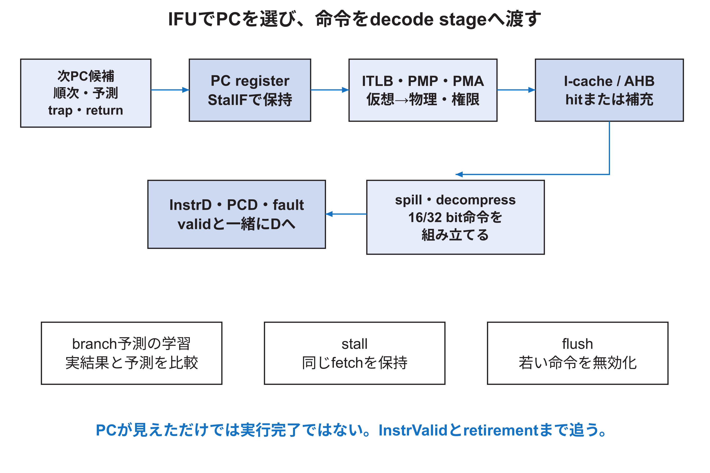

<a id="s_14_2"></a>
#### 14.2 PCはどこから選ばれるか

通常の次PCは、現在の命令長を足した値である。RISC-V C extensionがあると命令は16 bitまたは32 bitなので、常にPC+4ではない。分岐予測が有効なら予測先、execute stageで予測誤りが分かれば正しいbranch先、trapならtrap vector、returnならEPCを選ぶ。

PC selectionはpriorityが重要である。trapを処理すべきcycleに予測器の値を選べば、architectural control flowを失う。sourceを読むときはMUXの入力名だけでなく、select条件の優先順位と、それぞれが確定するpipeline stageを見る。

<a id="s_14_3"></a>
#### 14.3 圧縮命令と境界をまたぐ命令

16 bit命令を許すと、32 bit命令がfetch wordの境界をまたぐ場合がある。`src/ifu/spill.sv`は、前回fetchした一部と次の一部を組み合わせる。`src/ifu/decompress.sv`は16 bit compressed instructionを、後段が扱う32 bit形式へ展開する。

ここで「memoryから32 bit読めば一命令」とは限らない。fetch単位、cache line、bus beat、ISA上の命令長は異なる。PCの下位bit、前半の保持、access faultがどの半分で起きたかを追う必要がある。

<a id="s_14_4"></a>
#### 14.4 branch predictorの予測と学習

`src/ifu/bpred`には方向予測、Branch Target Buffer、Return Address Stack、命令class予測などがある。予測器はarchitectural stateではない。予測が外れても、誤った命令をretireさせず、正しいPCからやり直せばISA上の結果は同じである。

方向予測はbranchを取るか、BTBは予測先address、RASは関数return先を予測する。executeまたはmemory stageで実際の結果と比較し、`BPWrongE`などを作る。`hazard.sv`はその信号を使って後続命令をflushする。

性能評価では予測精度だけでなく、誤予測一回のpenalty、predictorのaccess timing、storage量を見る。精度が高くてもcritical pathを延ばしclockを下げれば、全体性能が悪化し得る。

<a id="s_14_5"></a>
#### 14.5 命令cacheとuncached access

命令cache hitなら、必要なwordを短い経路で返す。missならcache lineを外部memoryから補充し、その間`IFUStallF`でpipelineを止める。PMAでcacheableではない領域なら、cacheを迂回してbus accessする。

cache lineは複数命令を含む。tagはどのmemory blockか、indexはどのsetか、offsetはline内の位置かを示す。hit判定、valid bit、replacement、refillのFSMを分けて読む。cacheを大きくする変更はhit率だけでなくBRAM数、tag比較、配線、refill時間へ影響する。

<a id="s_14_6"></a>
#### 14.6 instruction-side MMU

Linuxのuser processが使うPCは仮想addressである。instruction TLBに変換があれば物理addressへ直す。TLB missならHardware Page Table Walkerがpage tableをmemoryから読み、PTEを調べる。permissionやPTE不正ならinstruction page faultを発生させる。

仮想address変換とPMP/PMAは目的が違う。page tableはOSが作る仮想から物理への対応とpermission、PMPはmachine modeが物理領域への権限を制限する仕組み、PMAはその物理領域がmemoryかI/Oか、cache可能かなどの属性である。順序を混ぜず、最終的な物理addressとfault原因を追う。

<a id="s_14_7"></a>
#### 14.7 stall中とflush時の命令

stallはstage registerを保持する。flushはそのstageの命令を無効にする。IFUがbus待ちでも、同じcycleに古い命令がtrapを起こす可能性がある。固定版の`hazard.sv`は、IFU stallをflush原因でgateする条件を持ち、trapやbranch correctionを優先できるようにする。

波形ではPCの数値だけを見ず、`InstrValidD`、`StallF/D`、`FlushD/E`、fault signalを一緒に見る。同じPCが数cycle続くことはstallなら正常であり、同じ命令が複数回retireすることとは異なる。

<a id="s_14_8"></a>
#### 14.8 一命令をsourceで追う手順

1. 逆assemblyで対象命令のPCとbit列を得る。
2. IFUでPC selectionとcache/TLB pathを確認する。
3. `InstrD`と`InstrValidD`へ入るcycleを波形で探す。
4. branchなら予測値と実際値、loadなら後続LSU pathへつなぐ。
5. RVVIまたはretirement logでarchitectural resultを確認する。

`InstrD`が見えたことは、その命令が実行完了した証拠ではない。flushされた可能性がある。最後にretireまたはarchitectural stateの更新へ到達したかを確認する。

<a id="ch_15"></a>
### 第15章 IEUとpipeline hazardを深く読む

<a id="s_15_1"></a>
#### 15.1 IEUの役割を四つへ分ける

Integer Execution Unitは、命令decode、register fileのread/write、immediate生成、ALUとbranch判定、pipeline registerとforwardingを扱う。固定版の入口は`src/ieu/ieu.sv`、controlは`controller.sv`、data pathは`datapath.sv`、演算は`alu.sv`や`shifter.sv`などに分かれる。

「命令を解読する」と「値を計算する」を分ける。controllerはopcodeやfunct fieldからcontrol signalを作る。datapathはregister値とimmediateを選び、ALUへ渡し、結果を後段へ運ぶ。control signalも同じpipeline stageへ遅延させないと、別の命令のdataへ作用する。

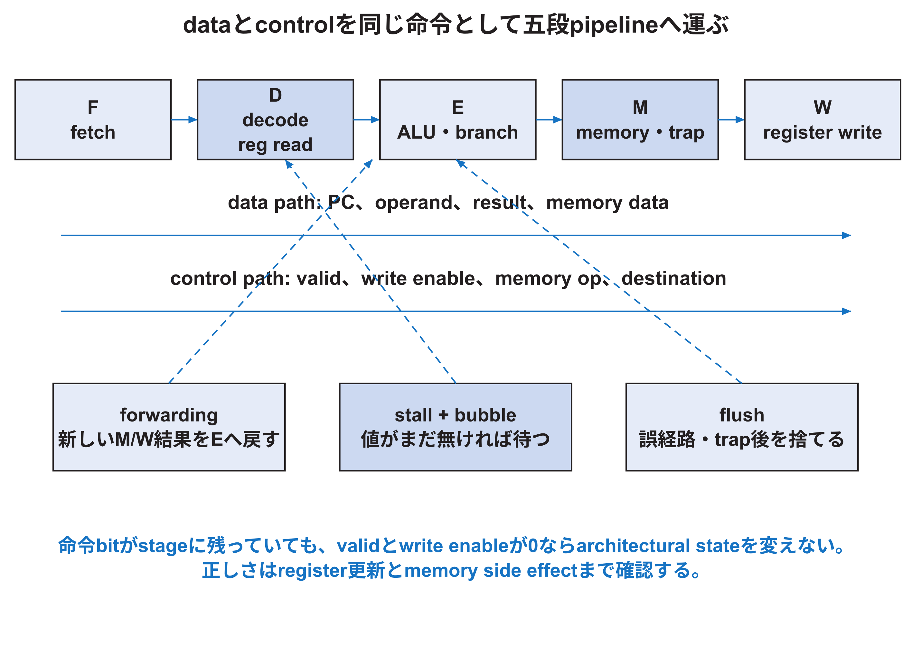

<a id="s_15_2"></a>
#### 15.2 decodeはbit列から意味を取り出す

32 bit命令にはopcode、rd、funct3、rs1、rs2、funct7などのfieldがある。命令形式により同じbit位置の用途が変わる。controllerはcase表でALU source、register write、memory read/write、branch、CSRなどを決める。未対応encodingはillegal instructionとして扱う。

decodeを変更するときは、似たopcodeとの重なり、extensionの有効条件、RV32/RV64差、compressed命令の展開後形式を確認する。`casex`やwildcardで広く一致させると、将来extensionまたはreserved encodingを誤って受け入れる危険がある。

<a id="s_15_3"></a>
#### 15.3 register fileとx0

RISC-V integer registerは32本で、x0はreadすると常に0、writeは無視される。decode stageでrs1とrs2を読み、writeback stageでrdへ書く。readとwriteが同じcycleに同じregisterを指す場合の値は、register file実装とbypassで定義する。

architectural register fileと、pipeline registerを区別する。x5の値はarchitectural stateだが、`RdE`や`RdM`は「現在そのstageにいる命令のdestination番号」という一時的な制御状態である。flushされた命令は、その一時状態がbitとして残っていてもwrite enableを無効化し、architectural stateを変えてはならない。

<a id="s_15_4"></a>
#### 15.4 ALU sourceとimmediate

ALUの入力Aはrs1、PC、0など、入力Bはrs2、immediateなどから選ぶ。immediateはI/S/B/U/J形式ごとに命令bitを並べ直し、XLENへsign extensionする。branch offsetの下位0やJALのbit順は連続していないため、図とcodeを照合する。

bit幅とsignednessは回路の意味を変える。signed less-thanとunsigned less-than、算術右shiftと論理右shiftは同じbit列でも結果が違う。SystemVerilogの暗黙castに任せず、operandの型と必要なextensionを確認する。

<a id="s_15_5"></a>
#### 15.5 forwardingの必要性

次の二命令を考える。

```text
add x5, x1, x2
sub x6, x5, x3
```

二命令目がdecodeでx5を読む時点では、一命令目がまだwritebackしていない可能性がある。しかし結果はexecuteまたはmemory stageに既にある。forwarding MUXは、その新しい結果をregister file read値の代わりにALU入力へ渡す。

priorityは最も新しいproducerを選ぶ必要がある。同じrdへ連続writeする場合、W stageよりM stageの結果が新しい。x0、write enable、命令valid、結果が利用可能になるstageを条件へ含める。

<a id="s_15_6"></a>
#### 15.6 load-use hazardだけは待つ場合がある

loadのdataはmemory stageの後半まで得られない。直後の命令がexecute stageでその値を必要とすると、通常のforwardingだけでは間に合わない。そのため一cycle stallし、後続命令を待たせる。これはdata依存があるすべての組合せを止めるのではなく、結果の利用可能時点とconsumerの必要時点が合わない場合である。

stall時にはF/Dを保持し、Eへbubbleを入れる必要がある。すべてを単に保持するとload命令自体も進まず、deadlockになり得る。`hazard.sv`の「次stageがstallなら前もstall」「最初にstallしていないstageをflush」という規則は、このbubble生成を一般化する。

<a id="s_15_7"></a>
#### 15.7 long-latency unitとstructural hazard

divisionや一部FPU操作は一cycleで終わらない。execute stageのunitがbusyなら、そこへ新しい命令を入れず、前段をstallする。二つの命令が同じhardware resourceを同時に必要とする場合はstructural hazardである。

resourceを複製すればthroughputを上げられる場合があるが、LUT/DSP/配線が増える。共有すれば資源は減るが、arbitrationとstallが増える。正しい選択はworkloadとtarget clockを測って決める。

<a id="s_15_8"></a>
#### 15.8 branch、trap、stallの優先順位

branch mispredictionはexecute stageで分かり、若い命令をflushする。trapはmemory stageで確定し、より広い範囲をflushする。division中、WFI、IFU/LSU stallが同時に起こる場合もある。priorityを局所moduleごとにばらばらに決めると、あるFSMだけがstallを見続けるなどの不整合が起きる。

固定版`hazard.sv`はflush causeとstall causeを分け、各stageの最終信号を作る。reviewでは真理値表またはpropertyを用意し、trap時に誤ったstoreがcommitしない、branch修正時にdivideを不正に捨てない、stall解除後に一回だけ進むことを確認する。

<a id="s_15_9"></a>
#### 15.9 CPIを原因別に考える

理想的な五段pipelineは、充填後に一cycle一命令をretireできる。しかしcache miss、load-use、branch misprediction、division、I/O waitがbubbleを作る。実行時間は概ね次の関係で考えられる。

```text
実行時間 = 命令数 × CPI × clock周期
CPI = 1 + 各stall・flushが加えるcycle / retired命令数
```

clockを高くする変更がCPIを悪化させる場合も、命令数を減らすsoftware変更がcache miss率を変える場合もある。一つのcounterだけで原因を断定せず、命令数、cycle、各event、wall timeを同じ区間で測る。

<a id="ch_16"></a>
### 第16章 LSUとmemory hierarchyを深く読む

<a id="s_16_1"></a>
#### 16.1 loadとstoreの入口

Load Store Unitは、IEUが計算したeffective addressを受け、alignment、仮想address変換、permission、PMA/PMP、cacheまたはbus access、subword処理、atomic操作を行う。固定版の入口は`src/lsu/lsu.sv`である。

load/store命令のaddressは通常`rs1 + sign-extended immediate`で作る。softwareがC++で`regs[3]`を読む場合も、compilerはbase addressへoffsetを足すload命令を生成する。その物理addressが最終的にRasterIX registerを選ぶまで、LSUとuncoreを通る。

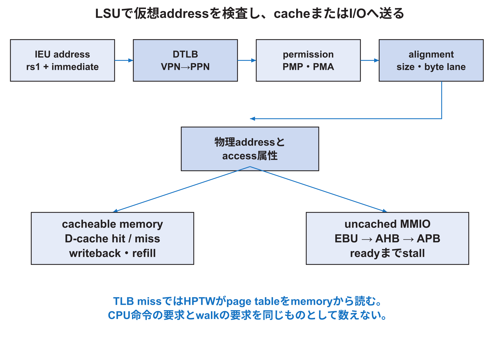

<a id="s_16_2"></a>
#### 16.2 access size、alignment、byte lane

load/storeはbyte、halfword、word、doublewordなどのsizeを持つ。address下位bitはbusのどのbyte laneを使うかを決め、store strobeは有効なbyteを示す。loadは読んだbus wordから対象byteを選び、符号付きならsign extensionする。

misaligned accessをhardwareで分割して扱うか、exceptionにするかは構成とISA条件による。MMIO registerは32 bit aligned accessだけを許す設計が多い。RasterIX側はaligned 32 bit wordを契約としているため、8 bit storeを勝手に一commandとして扱わない。

<a id="s_16_3"></a>
#### 16.3 TLB hitとpage table walk

LinuxのU-mode processは仮想addressを使う。DTLBはVPNからPPNへの最近の変換を保持する。hitならpermissionを確認して物理addressを作る。missならHPTWが`SATP`からpage table rootを得て、PTEを段階的に読む。

Sv48では仮想addressを複数のVPN segmentへ分ける。各levelのPTE addressは、前levelが示すPPNと次のVPN indexから計算する。leaf PTEでR/W/XやU、A、Dなどを確認する。invalid、permission違反、misaligned superpageなどはpage faultになる。[RISCVPriv26](#ref_RISCVPriv26)

HPTW自身もmemoryを読むため、通常のload/store pathとbusを共有する。`SelHPTW`のような選択信号を追い、CPU命令の要求とwalk要求を混同しない。

<a id="s_16_4"></a>
#### 16.4 PMAとPMP

Physical Memory Attributeは、物理領域がmain memory、I/O、cacheable、idempotent、atomic対応など、platformとして持つ性質を表す。Physical Memory Protectionは、M-modeが物理address範囲とR/W/X権限を設定する機構である。

RasterIX register領域は通常memoryのように投機的に何度も読んだりcacheしたりしてはいけない。readにside effectがなくてもwrite commandはnon-idempotentである。同じstoreを二度出せば二語送信される。このためaddress decodeだけでなく、PMA上のI/O属性とsoftware mappingを一致させる。

<a id="s_16_5"></a>
#### 16.5 cache hit、miss、eviction

data cache accessでは、indexでsetを選び、各wayのtagと比較する。hitしたwayのdataを読む。store hitではwrite policyに従ってlineとdirty bitを更新する。miss時に置換対象がdirtyならwritebackし、その後新しいlineをrefillする。

cache FSMは複数cycleにわたりbus transferを行う。`LSUStallM`はpipelineへ未完了を伝える。HREADYが一度0になっただけでerrorではない。要求のaddress/controlをprotocolどおり保持し、responseが完了してから命令を進める。

<a id="s_16_6"></a>
#### 16.6 MMIOとcacheを分ける

MMIOはload/store命令を使うが、通常RAMとは性質が異なる。cacheへ入れると、command writeがdeviceへ届かなかったり、status readが古い値になったりする。PMAとaddress regionでuncached pathへ送る。

software側の`volatile`はcompilerによる省略や統合を制限する。hardware cacheability、CPUのI/O ordering、device完了は別問題である。固定版`WallyBusConnector.hpp`は`volatile uint32_t*`でregisterへaccessし、送信後にRISC-V `fence iorw, iorw`を置く。ただしfenceは描画完了を待つ命令ではなく、必要なorderingを作る。display swapの完了はframe counterを観察する。

<a id="s_16_7"></a>
#### 16.7 atomic命令とLR/SC

A extensionではAMOとLR/SCを扱う。LRはaddressへのreservationを作り、SCはreservationが有効ならstoreする。interrupt、別access、cache eventなどでreservationが失われ得る。AMOはread-modify-writeを不可分に実行する。

MMIO peripheralがatomicを意味ある形で支えるとは限らない。PMAで許可されない領域へAMOを行えばaccess faultとすべきである。software lockにatomic命令を使う話と、device registerにatomic commandを書く話を分ける。

<a id="s_16_8"></a>
#### 16.8 共有DDR3と二つのmaster

本構成ではWallyとRasterIXがDDR3を共有する。CPUはLinux、program、dataに使い、RasterIXはtextureとdisplay bufferを使う。AXI interconnectが要求を仲裁するが、address領域を予約しただけでcache coherenceが自動的に生まれるわけではない。

device treeの`reserved-memory`と`no-map`は、Linuxの通常allocatorと標準mappingから領域を外す。RasterIXへ渡すbuffer addressを他のprocessが使わないために重要である。一方、hardwareが誤addressへ書くことを防ぐ境界検査ではない。address計算、buffer size、owner切替を別に検証する。

<a id="s_16_9"></a>
#### 16.9 memory問題を切り分ける観察点

| 観察点 | 分かること | まだ分からないこと |
|---|---|---|
| load/storeの仮想address | applicationが何を要求したか | 物理address、device到達 |
| TLB/HPTW結果 | 変換とpermission | cache/bus完了 |
| cache hit/miss | local memory path | DDR dataの正しさ全体 |
| AHB request/response | core外へ出たtransfer | APB peripheral内部 |
| APB handshake | register access成立 | RasterIX描画完了 |
| framebuffer readback | memory上の画素 | 外部映像の受理 |

一つの段階で期待値と比較し、最初に異なる境界を探す。画面が出ないという最終症状だけでcache、DDR、displayのどれかを選ばない。

<a id="ch_17"></a>
### 第17章 特権機構、trap、interruptを深く読む

<a id="s_17_1"></a>
#### 17.1 三つのprivilege mode

RISC-VのM-modeは最も高い権限を持ち、OpenSBIが動く。S-modeはLinux kernel、U-modeはgameなどのprocessが動く。固定版の`src/privileged/privileged.sv`はCSR、trap、privilege mode、interrupt、PMPなどをまとめる。[RISCVPriv26](#ref_RISCVPriv26)

modeはsoftwareの肩書きではなく、実行できる命令、access可能なCSR、page table permission、trapの委譲先へ影響するarchitectural stateである。Linux processが直接`mstatus`を書けないのは、compilerの制限ではなくCPUが権限を検査するためである。

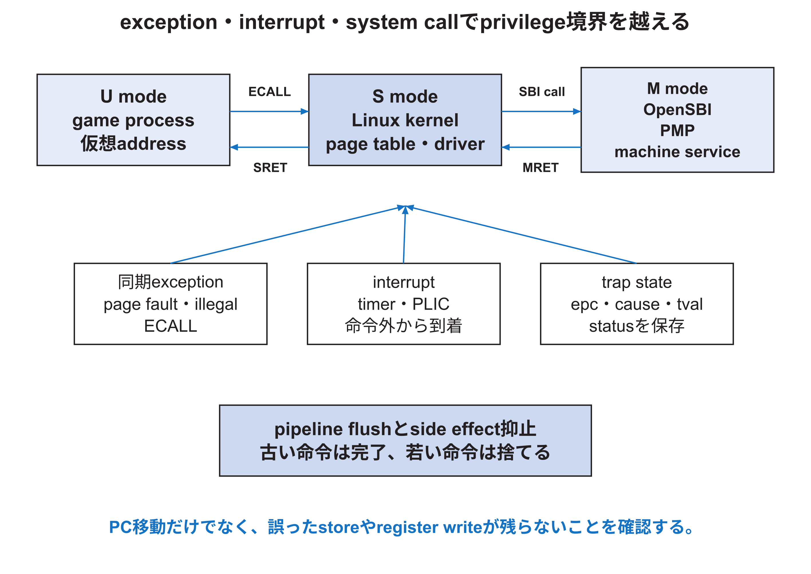

<a id="s_17_2"></a>
#### 17.2 CSR read-modify-write

CSR命令は、指定CSRを読み、registerまたはimmediateと組み合わせて書き戻す。readだけに見える命令でもrdやsourceがx0かでside effect条件が変わる。`src/privileged/csr.sv`と`privdec.sv`でaddress、権限、read/write、illegal条件を追う。

CSRは単一の大きなregister fileとは限らない。machine、supervisor、counter、interruptなどのsubmoduleに分かれ、read dataをMUXする。write enableは命令valid、trap、privilege、read-only属性を含めて決める。

<a id="s_17_3"></a>
#### 17.3 exceptionとinterrupt

exceptionは実行中の命令に同期して起こる。illegal instruction、page fault、access fault、ECALLなどが例である。interruptはtimerや外部deviceなど、命令列の外から到着する。どちらもtrapを起こすが、原因の記録と再開PCの意味が異なる。

trap時にはcause、faultに関係する値、戻りPCをCSRへ保存し、statusのinterrupt enableとprevious privilegeを更新し、trap vectorへPCを移す。正確な例外では、faulting instructionより古い命令は完了し、若い命令はarchitectural effectを残さない。

<a id="s_17_4"></a>
#### 17.4 delegationとOpenSBI

M-modeは一部のexceptionやinterruptをS-modeへ委譲できる。Linuxが直接扱うべきpage faultやsupervisor timer interruptなどはdelegation CSRでS-modeへ送る。platform固有のM-mode serviceはSBI callとしてOpenSBIへ依頼する。

OpenSBIはLinuxより前に起動し、hardwareを初期化し、delegationやPMPを設定し、S-modeへ移る。LinuxがM-modeを「置き換える」のではない。実行中もSBI callやM-mode trapでOpenSBIへ入る場合がある。

<a id="s_17_5"></a>
#### 17.5 timerとCLINT

`uncore.sv`のCLINTは`MTIME`、timer compare、software interruptを提供する。`MTIME`はCPU pipeline clockと別のTIMECLKを使い得るため、CSR側へ値を渡す同期も重要になる。device treeの`timebase-frequency`は、このcounterが一秒に何回進むかをLinuxへ伝える。

clockを20 MHzから変えたのにtimebase-frequencyを変えないと、timer tickや時刻換算がずれる。UARTと同様に、「hardwareの実周波数」と「softwareへ伝えた周波数」を照合する。

<a id="s_17_6"></a>
#### 17.6 PLICと外部interrupt

PLICは複数の外部interrupt sourceを受け、priority、pending、enable、thresholdを用いてhartへ通知する。softwareはclaim registerでsource IDを取得し、device側の原因を処理し、completeを書き戻す。

interrupt lineがlevelでassertされ続けるdeviceでは、PLICをcompleteしてもdevice原因をclearしなければ再度pendingになる。逆に先にdeviceをclearする必要がある場合もある。新しいcontroller回路をinterrupt化するなら、RTL line、PLIC source ID、device tree、kernel driver、handlerのclear順を一つの契約にする。

<a id="s_17_7"></a>
#### 17.7 trapとpipeline flush

trapはmemory stageで確定する信号を含む。既にW stageにある古い命令はcommitできるが、若い命令は捨てる。faulting storeのwrite enableが外部busへ出た後にtrapを決める設計ではprecise性を壊すため、side effectの成立時点とexception確定時点を揃える。

波形では`TrapM`、`EPCM`、`TrapVectorM`、`FlushD/E/M/W`、register write、memory writeを同時に見る。trap vectorへPCが移っただけでは、若いside effectが抑止された証明にならない。

<a id="s_17_8"></a>
#### 17.8 Linux system callをCPU側から見る

U-mode programが`write`などを呼ぶと、C libraryがargumentをABIでregisterへ置き、ECALL命令を実行する。CPUはenvironment call exceptionを起こし、LinuxのS-mode trap handlerへ入る。kernelはsystem call番号とargumentを読み、検査して処理し、`sret`でU-modeへ戻る。

`/dev/mem`の`open`と`mmap`もsystem callを通る。mapping後の`regs[0]=word`は通常のsystem callを毎回呼ぶのではなく、processのpage tableへdevice physical pageを対応付けた後、CPUのstore命令として実行される。この違いはMMIO性能と権限を理解するうえで重要である。

<a id="s_17_9"></a>
#### 17.9 trap問題の切り分け

CSR値、faulting PC、instruction bit、virtual/physical address、privilege mode、delegation、page table entryを保存する。Linux logだけで不明なら、逆assemblyとRVVI traceを対応させる。hardware faultかsoftware bugかを「Linuxが止まった」という症状だけで決めない。

<a id="ch_18"></a>
### 第18章 EBU、uncore、周辺回路拡張を深く読む

<a id="s_18_1"></a>
#### 18.1 coreとuncoreの境界

`wallypipelinedcore.sv`の外側には一組のAHB-Lite master interfaceがある。IFUとLSUはそれぞれ要求を持つが、EBUが仲裁し、core外へ一つのbusとして出す。`wallypipelinedsoc.sv`はcoreとuncoreを実体化し、board topはその外でDDR controllerやRasterIXへつなぐ。

uncoreは「重要でない外側」という意味ではない。boot ROM、RAM、CLINT、PLIC、UART、GPIO、SPI、SD controller、PWM、外部memory、外部APB interfaceを持ち、CPUがsystemとして動くためのhardwareを提供する。

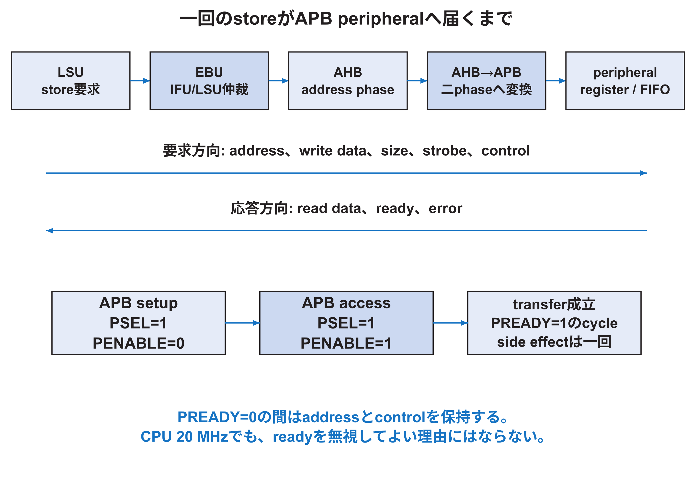

<a id="s_18_2"></a>
#### 18.2 EBUの仲裁

IFUは命令fetch、LSUはload/storeまたはpage table walkのmemory requestを出す。同じ外部busを同時に使えない場合、EBUはpriorityとownershipを決める。選ばれなかった側はreadyが戻るまでstallする。

仲裁では要求を途中で切り替えない。AHBのaddress phaseとdata phaseが重なるため、現在のresponseがどのmasterの要求かを保持する。HREADYが0の間にowner、address、controlを変えると別要求のresponseとして解釈する危険がある。

<a id="s_18_3"></a>
#### 18.3 AHB-Liteの一transfer

masterはaddress、HTRANS、HWRITE、HSIZEなどをaddress phaseへ出す。次cycleのdata phaseでwrite dataまたはread dataとresponseを扱う。slaveはHREADYを0にしてwait stateを追加できる。address phaseとdata phaseがpipelineされるため、現在busに見えるaddressと、返っているread dataが同じtransferとは限らない。

`uncore.sv`はaddress decoderのselectをregisterへ保存する。commentにあるように、response MUXのselectはdata phaseの要求に対応しなければならず、wait中は古いselectを保持する。これは単なる一cycle遅延ではなく、protocolのphase対応を守る状態である。

<a id="s_18_4"></a>
#### 18.4 address decodeと重複

`src/mmu/adrdecs.sv`は物理addressを各BASE/RANGEと比較し、region selectを作る。`uncore.sv`はそのvectorをRAM、boot ROM、external memory、APB bridgeなどへ分解する。

二領域が重なると、複数selectが同時に1になり、read dataのOR MUXやready logicが壊れる。未割当領域ではHSELNoneDを使いbusを固めない設計になっているが、返す値やerror方針は仕様として確認する。新領域を足したら、BASE、終端、隣接境界、未選択、重複をtestする。

<a id="s_18_5"></a>
#### 18.5 AHBからAPBへの変換

APBはsetupとaccessの二phaseで、周辺回路向けに単純化されている。`ahbapbbridge.sv`はAHB transferを受け、setup cycleでPSELとaddress/controlを出し、access cycleでPENABLEを1にする。peripheralがPREADYを返すまでaccessを保持し、完了をAHBのHREADYへ返す。

transfer成立は`PSEL && PENABLE && PREADY`である。PREADY=0のcycleにもPSELとPENABLEは1のままなので、side effectを`PSEL && PENABLE`だけで起こすと同じwriteを複数回実行する。周辺register更新、FIFO push、clear-on-readは完了eventへ結び付ける。

<a id="s_18_6"></a>
#### 18.6 外部APB portの設計意図

固定版は、RasterIX固有のportを`wallypipelinedsoc`へ直接多数追加せず、一般的な外部APB interfaceを一組出す。`uncore.sv`はPADDR、PWDATA、PSTRB、PWRITE、PENABLE、PSELを外へ出し、PRDATAとPREADYを受ける。

この境界により、Wally coreとuncoreは特定deviceの内部command形式を知らない。board topまたはadapterがAPBをRasterIX command streamへ変換する。将来別のAPB peripheralを接続できるが、同時に複数deviceを置くなら外側にdecoderまたはbusを追加する必要がある。

<a id="s_18_7"></a>
#### 18.7 RasterIX adapterが守る三つの契約

第一はAPB契約である。aligned 32 bit access、PREADYによる待機、read data、side effectの成立cycleを守る。第二はcommand stream契約である。data、valid、ready、TLASTの順序を守る。第三はclock domain crossing契約である。20 MHz側で成立したwordを100 MHz側へ順番どおり一度だけ渡す。

非同期FIFOは三契約のうちCDCとbufferingを担当する。APB handshakeを正しく作る責任や、RasterIX command packetの意味までは自動で保証しない。層を分けてassertionとtestbenchを置く。

<a id="s_18_8"></a>
#### 18.8 register mapはhardwareとsoftwareのABIである

RasterIX adapterはoffset 0x00をcommand word、0x04をTLAST付きcommand、0x08をstatus、0x0cをID、0x10をswap count、0x14をacknowledged framebuffer addressとしている。offset、幅、read/write、side effect、reset値はC++とRTLの双方が共有するABIである。

ID `0x52495831`を最初に読むことで、間違ったbitstreamまたはaddressを早く検出する。ID一致はcommand path全体の動作証明ではないが、少なくともCPU load、address decode、APB read、adapter read dataの往復を確認するcanaryになる。

<a id="s_18_9"></a>
#### 18.9 周辺回路を追加する完全な影響範囲

新しいperipheralを追加する場合、次を確認する。

| 領域 | 必要な設計 |
|---|---|
| address | BASE、RANGE、重複検査、PMA属性 |
| RTL | interface、register/FIFO、reset、error、interrupt |
| bus | APB/AHB protocol、wait、幅、byte strobe |
| clock | domain、CDC、generated clock constraint |
| board | pin、I/O standard、外部device timing |
| OS | device tree、reserved memory、driverまたはmapping |
| application | API、ordering、timeout、error処理 |
| verification | unit、bus、CDC、SoC、timing、実機 |

「uncoreへmoduleを一個置いた」だけではsystem integrationは完了しない。この表の各行にsourceと試験を一つずつ対応させる。

<a id="s_18_10"></a>
#### 18.10 開発者としての読解課題

`WallyBusConnector::writeData`の一回の`regs[0]=data[i]`を選び、次を説明する。

1. compilerが生成するstore命令とaddress。
2. U-mode page tableから物理addressへの変換。
3. LSUのuncached accessとEBUの仲裁。
4. AHB address/data phase。
5. uncore decoderとAHB-APB bridge。
6. APB完了条件とPREADY wait。
7. async FIFOへのpush。
8. RasterIX側のvalid/ready transfer。
9. どの段階までをstore命令完了が保証するか。
10. 描画またはdisplay swap完了を別にどう観察するか。

これを説明できれば、softwareの一行とhardwareの信号を別世界として扱わず、一つのsystem動作として追えている。

<a id="part_III"></a>
## 第III部 Linuxとシステムソフトウェア

開発用PCでのcross buildから、ZSBL、OpenSBI、Linux kernel、BusyBox、device tree、仮想memory、MMIO、C++ゲームプログラムまでを追う。hardwareの存在をsoftwareへ伝え、user processから安全に操作し、問題を層ごとに診断する。

<a id="ch_19"></a>
### 第19章 開発用PCからFPGA上のprocessまでを分ける

<a id="s_19_1"></a>
#### 19.1 softwareは一つの場所で動いていない

本研究には、開発用PCのUbuntuで動くprogram、FPGAの起動ROMで動くZSBL、M-modeで動くOpenSBI、S-modeで動くLinux kernel、U-modeで動くBusyBoxとgameがある。すべてC/C++またはassemblyで書かれていても、実行するCPU、利用できるservice、address、compiler、file formatが違う。

hostはx86-64 Windows/WSL環境、targetはNexys Video上のRISC-V Wallyである。hostで生成したRISC-V executableはhostでは直接実行できない。逆にhost用`cmake`やVivadoをSDカードへコピーしてもWallyで動かない。

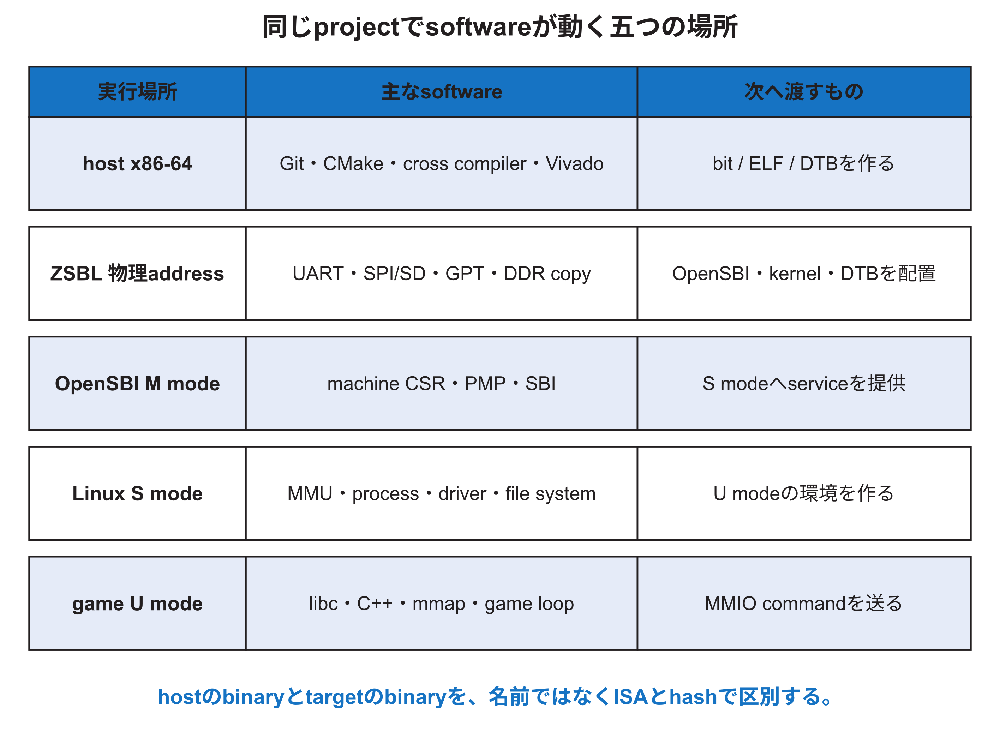

<a id="s_19_2"></a>
#### 19.2 五つの実行環境

| 実行環境 | 代表例 | 使える機能 | 主な出力 |
|---|---|---|---|
| host user space | Git、CMake、compiler、dtc、Vivado | host OS、file system、network | bitstream、ELF、DTB |
| ZSBL | `fpga/zsbl` | UART、SPI/SD、DDRへの直接access | imageをDDRへcopy |
| OpenSBI M-mode | `fw_jump.bin` | machine CSR、PMP、SBI service | Linuxへ制御を渡す |
| Linux S-mode | `Image` | process、virtual memory、driver、system call | U-mode環境 |
| target U-mode | BusyBox、`rasterix-breakout` | libc、file、`/dev/mem` mapping | game処理とMMIO |

同じ「load」でも、ZSBLではpagingなしで物理addressを読むことが多く、U-mode processでは仮想addressをpage tableで変換する。同じUART出力でも、ZSBLのregister access、OpenSBI console、Linux driver、user processの`printf`では経路が違う。

<a id="s_19_3"></a>
#### 19.3 source、build directory、生成物、配置先

source treeへ生成物を混ぜると、どのfileが人間の入力か分からなくなる。CMakeは`-S`でsource、`-B`でbuild directoryを分ける。Buildrootは`output/build`へ展開source、`output/host`へhost toolchain、`output/images`へtarget imageを置く。[Buildroot](#ref_Buildroot)

生成物はさらに、hostに存在する場所と、SDカードまたはtarget root filesystem上の場所を区別する。hostの`rasterix-build/rasterix-breakout`を更新しても、SDカード側のcopyを更新しなければ実機は古いbinaryを実行する。

<a id="s_19_4"></a>
#### 19.4 buildと実行を証拠で結ぶ

次の値を保存すると取り違えを減らせる。

```bash
git rev-parse HEAD
git submodule status
sha256sum fpga/generator/*.bit
sha256sum rasterix-build/rasterix-breakout
file rasterix-build/rasterix-breakout
```

targetでも可能なら`sha256sum`を実行し、hostのbinaryと比較する。実行logにはcommit、build type、compiler version、DTB名、bitstream hash、command lineを残す。「sourceを変更した」と「その変更を含むbinaryを実機で実行した」を分ける。

<a id="s_19_5"></a>
#### 19.5 hardwareとsoftwareの境界を契約として読む

softwareからhardwareへ渡る主な契約は、ISA、ABI、memory map、device tree、register map、interrupt、DMA/shared memory layoutである。hardwareが同じでもABIが違えばprogramは動かず、softwareが同じでもregister offsetが違えば別機能へ書く。

契約ごとにownerを決める。

| 契約 | hardware側 | software側 |
|---|---|---|
| ISA | decodeとexecution | compilerの`-march` |
| ABI | register、stack、exception support | compilerの`-mabi`、libc |
| memory map | decoder、PMA/PMP | linker、DT、mapping |
| register map | peripheral RTL | header/API |
| shared buffer | memory master、address幅 | allocator、reserved-memory、offset |
| completion | status/counter/interrupt | poll、timeout、handler |

<a id="s_19_6"></a>
#### 19.6 「Linuxが動く」の中身

Linux promptが表示された場合、CPUが多くの命令を実行し、DDR、UART、timer、interrupt、privilege、virtual memory、kernelとroot filesystemの少なくとも一部が動いたことを示す。しかしRasterIX register、shared DDR、display経路までは証明しない。

逆にgameが失敗してもLinux全体が壊れたとは限らない。ID read、command send、frame counter、framebuffer、videoの順に境界を確認する。softwareの層を分ける目的は用語を増やすことではなく、失敗範囲を小さくすることである。

<a id="ch_20"></a>
### 第20章 cross compile、ELF、ABIを深く理解する

<a id="s_20_1"></a>
#### 20.1 compilerはsourceを別CPUの命令へ変える

cross compilerはhost上で動き、target ISAのmachine codeを生成する。`riscv64-buildroot-linux-gnu-g++`はRISC-V 64 bit Linux向けC++ compilerである。`riscv64-unknown-elf-gcc`は主にbare-metal用で、Linux user program用libcやdynamic loaderを前提としない。名前が似ていても出力環境が違う。[Buildroot](#ref_Buildroot)

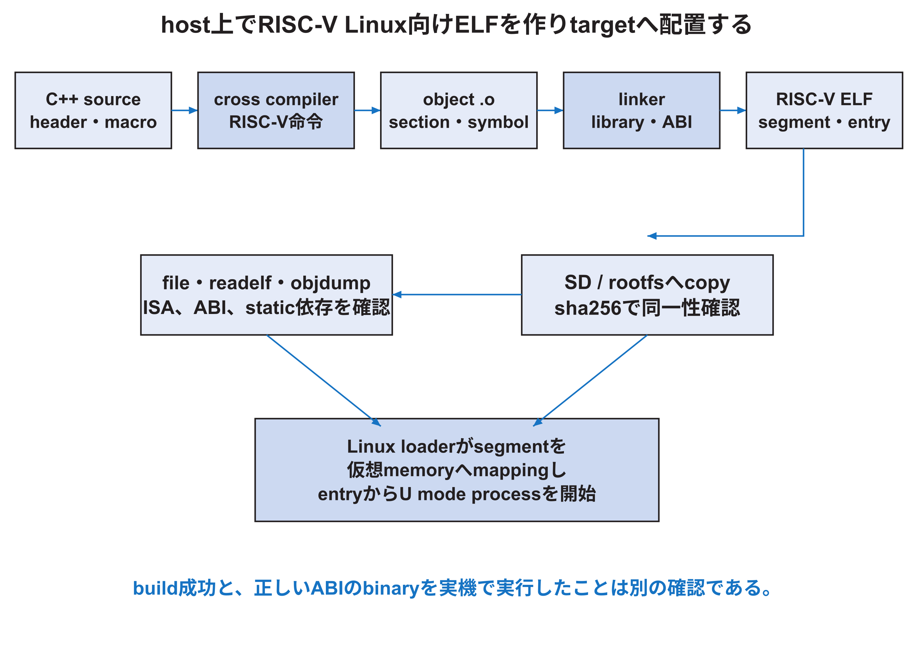

<a id="s_20_2"></a>
#### 20.2 前処理、compile、assembly、link

C/C++ buildは概念上、前処理、compile、assembly、linkへ分かれる。headerとmacroを展開し、言語を中間表現とassemblyへ変換し、object fileを作り、最後にlibraryと結合してELF executableを作る。

```bash
riscv64-buildroot-linux-gnu-g++ -E breakout.cpp -o breakout.ii
riscv64-buildroot-linux-gnu-g++ -S -O2 breakout.cpp -o breakout.s
riscv64-buildroot-linux-gnu-g++ -c -O2 breakout.cpp -o breakout.o
```

実際のprojectではCMakeがinclude path、define、library順、link optionを組み立てる。問題調査では`cmake --build ... --verbose`で最終commandを確認する。

<a id="s_20_3"></a>
#### 20.3 ELFに入るもの

ELFはmachine codeだけでなく、entry point、program header、section、symbol、relocation、ABI情報を持つ。`.text`は実行code、`.rodata`はread-only data、`.data`は初期値付きwritable data、`.bss`はzero初期化領域である。program headerはloaderがmemoryへどうmappingするかを示す。

```bash
file rasterix-build/rasterix-breakout
riscv64-buildroot-linux-gnu-readelf -h -l -S rasterix-build/rasterix-breakout
riscv64-buildroot-linux-gnu-objdump -drC rasterix-build/rasterix-breakout | less
```

`file`でRISC-V 64 bitか、staticまたはdynamicかを確認する。`readelf -l`でinterpreterが必要か、segmentのR/W/X、entryを確認する。`objdump -d`はC++ symbolを`-C`でdemangleすると関数名を追いやすい。

<a id="s_20_4"></a>
#### 20.4 ISA optionとABI

`-march`は使ってよい命令extension、`-mabi`は関数call、register、data型、浮動小数点argumentなどの約束を決める。例えばRV64GCとLP64Dの組合せでは64 bit integer registerとdouble-precision FP calling conventionを使う。

CPUが対応しないextensionをcompilerが使うとillegal instructionになる。CPUがF/Dを持っていても、libraryとapplicationのABIが一致しなければlinkまたは実行時に問題が起こる。kernel、OpenSBI、rootfs、applicationを別toolchainで作る場合は、ISA/ABIの共通部分を確認する。[RISCVABI](#ref_RISCVABI)

<a id="s_20_5"></a>
#### 20.5 static linkとdynamic link

固定版の`examples/rasterix/CMakeLists.txt`は既定で`-static`を付ける。static executableは必要なlibrary codeを一つのfileへ含めるため、target rootfsに同じC++ runtimeやshared libraryがなくても動かしやすい。その代わりfileが大きくなり、library更新は再linkが必要である。

dynamic executableは小さく、複数programでlibrary pageを共有できるが、targetにdynamic loaderと互換shared libraryが必要である。`readelf -d`、`readelf -l`、targetの`ldd`で依存を確認する。staticならhardwareに近いという意味ではなく、deployment方法の選択である。

<a id="s_20_6"></a>
#### 20.6 C++ object lifetimeとresource

`WallyBusConnector`はconstructorで`/dev/mem`を開いて`mmap`し、IDを確認する。destructorは`munmap`する。copyを削除しているため、同じmappingを二objectが所有して二重解放するのを防ぐ。

`breakout.cpp`はRasterIX contextをdeviceやtransportより先に破棄する必要があるため、local `Context` structのdestructorで`RIXGL::destroy()`と`device.deinit()`を呼ぶ。C++ではlocal objectは逆順に破棄される。正常終了だけでなくexception経路でもresourceを解放するRAIIの例である。

<a id="s_20_7"></a>
#### 20.7 optimization optionを正しく比較する

`Release` buildは通常最適化を有効にし、debug symbolやassertionの扱いが変わる場合がある。`-O0`と`-O2`では命令数、inlining、memory access、timingが変わる。source上の一行とassemblyの一対一対応も崩れる。

性能比較ではcompiler version、flags、link方式を固定する。原因調査では`-g`を付けても最適化は可能だが、変数が消えることがある。正しさを比較するとき、未定義動作が最適化で表面化する可能性も考える。

<a id="s_20_8"></a>
#### 20.8 Buildroot toolchainとapplication toolchain

WallyのBuildroot configはkernel、OpenSBI、BusyBox、rootfs、host toolchainを同じ構成から生成する。applicationをその`output/host/bin`のcompilerで作ると、target rootfsとのABI整合を取りやすい。

ただし固定版の`wally_defconfig`ではC++ toolchain生成が無効になっている版もある。C++ exampleをbuildするには、C++を有効にした互換Buildroot toolchainを使うか、同じISA/ABIとlibcを持つtoolchainを用意する。compiler commandが存在することだけで互換性を断定せず、`file`、`readelf`、実機実行で確認する。

<a id="s_20_9"></a>
#### 20.9 reproducible buildの最低条件

source commit、submodule commit、compilerとBuildroot版、CMake cache、build type、command、生成物hashを残す。build directoryを使い回した場合は古いcacheが影響し得るため、再現確認では空のbuild directoryから作る。

```bash
cmake -S "$WALLY/examples/rasterix" -B rasterix-build-clean \
  -DCMAKE_SYSTEM_NAME=Linux -DCMAKE_SYSTEM_PROCESSOR=riscv64 \
  -DCMAKE_C_COMPILER=riscv64-buildroot-linux-gnu-gcc \
  -DCMAKE_CXX_COMPILER=riscv64-buildroot-linux-gnu-g++ \
  -DCMAKE_BUILD_TYPE=Release
cmake --build rasterix-build-clean --parallel --verbose
```

binary hashが毎回一致しない場合でも直ちに機能不一致ではない。timestamp、build ID、path埋込みなどを調べる。再現性の主張はbit-identicalか、機能同一かを明示する。

<a id="ch_21"></a>
### 第21章 SDカードからLinuxが起動するまで

<a id="s_21_1"></a>
#### 21.1 bitstreamを書いただけではLinuxは始まらない

bitstreamはFPGA内部の回路と一部memory初期値を設定する。Wallyがreset vectorから実行を始めた後、SDカードにあるdevice tree、OpenSBI、Linux kernelをDDR3へ移し、段階的に権限と実行環境を整える必要がある。

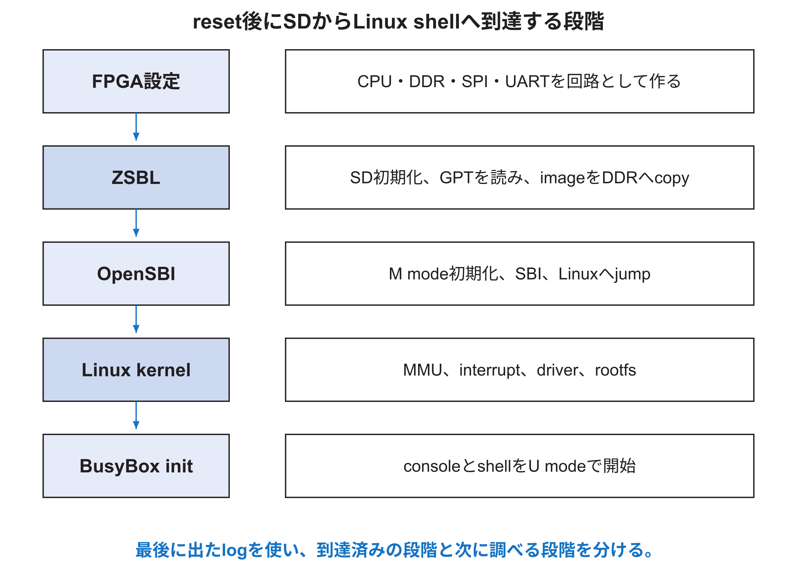

<a id="s_21_2"></a>
#### 21.2 ZSBLの役割

Zero Stage Boot Loaderは小さく、`fpga/zsbl`にある。`bios.S`はstackやregisterを準備しC codeへ入り、`boot.c`はUARTとSDを初期化する。`gpt.c`はGUID Partition Tableを読み、最初の三partition entryをdevice tree、OpenSBI、Linux kernelとして扱う。

固定版ではdevice treeを`FDT_ADDRESS`、OpenSBIを`EXT_MEM_BASE`、kernelを`0x80200000`へcopyする。copy後、assemblyがOpenSBIへjumpする。ZSBLはfile system名でfileを探すのではなく、GPT partitionのLBA範囲をraw blockとして読む。

<a id="s_21_3"></a>
#### 21.3 SD SPI初期化

SDカードはpower-on後に特定command sequenceでSPI modeへ入り、低いclockから開始する。`sd.c`はcommand、response、CRC、token、multi-block readを実装する。chip select、dummy clock、timeoutを守る必要がある。

SDに一度読めた経験があっても、最大clockを上げればsignal integrityまたはcard差で失敗し得る。boot logの「initializing」「partition」「loading」のどこまで出たかで、UART、SD initialization、GPT parse、DDR copyを分ける。

<a id="s_21_4"></a>
#### 21.4 GPT partitionとload address

GPT headerはLBA1、partition entryは後続LBAにある。`gpt_load_partitions`はentryのfirst LBAとlast LBAからsector数を計算し、512 byte単位でDDRへcopyする。partition順を変えると別imageを別addressへloadするため、flash scriptとbootloaderの期待を揃える。

load先領域が重なると、後からcopyしたimageが前のimageを壊す。kernel size、device tree address、OpenSBI領域、stack、reserved RasterIX領域をmemory map上で確認する。512 MiBの上端32 MiBをRasterIXに予約している構成では、通常のLinux配置がそこへ入らないことを確かめる。

<a id="s_21_5"></a>
#### 21.5 OpenSBIの役割

OpenSBIはM-mode firmwareで、machine-level初期化、hart、timer、IPI、consoleなどのstandard SBI serviceをS-modeへ提供する。`fw_jump.bin`は指定addressの次段へjumpする形式で、device tree addressをLinuxへ渡す。[OpenSBI](#ref_OpenSBI)

OpenSBI bannerが出ればZSBLからのjump、DDR上のfirmware fetch、UART出力が進んだと分かる。Linux bannerが出ない場合は、kernel load address、DTB pointer、ISA extension、PMP、delegation、kernel entry付近を調べる。

<a id="s_21_6"></a>
#### 21.6 Linux kernelの初期化

kernelはS-modeへ入り、初期page tableを作り、`satp`を書いてvirtual memoryを有効にする。物理addressとlink時のvirtual addressが異なるため、切替直後のPCとmappingを理解する。trap vector、timer、memory allocator、driver、scheduler、VFSを初期化する。

kernelはDTBを読み、memory容量、CPU clock、UART、PLIC、CLINT、SPI/SDなどを発見する。device treeが間違っていてもhardware回路は変わらないが、kernelが誤ったaddressまたはclockでdriverを動かす。

<a id="s_21_7"></a>
#### 21.7 initramfsとBusyBox

Buildrootは`rootfs.cpio`を作り、kernelがinitramfsとして展開する。root filesystemにはdevice node、library、BusyBox、設定file、shellが入る。最初のU-mode processである`init`が`/etc/inittab`を読み、consoleやserviceを開始する。

BusyBoxは多くのcommandを一つのbinaryで提供する。`ls`、`mount`、`dmesg`などが同じbinaryへのlinkになっていても正常である。promptが出るまでには、kernelがU-modeへ遷移し、rootfsとconsoleが使える必要がある。

<a id="s_21_8"></a>
#### 21.8 Buildrootの入力と出力

固定版`linux/Makefile`はBuildroot 2026.02.xを取得し、`linux/br2-external-tree/configs/wally_defconfig`を適用する。custom Linux config、BusyBox config、rootfs overlay、post-image scriptを使い、`Image`、`fw_jump.bin`、`fw_jump.elf`、`rootfs.cpio`、`vmlinux`、`busybox`を生成する。

| file | 性質 | 主な用途 |
|---|---|---|
| `Image` | raw kernel image | bootloaderがDDRへcopy |
| `vmlinux` | symbol付きELF kernel | debug、objdump |
| `fw_jump.bin` | raw OpenSBI | boot |
| `fw_jump.elf` | ELF OpenSBI | symbol、debug |
| `rootfs.cpio` | archive | initramfs |
| `.dtb` | flattened device tree | hardware description |

<a id="s_21_9"></a>
#### 21.9 boot failureを段階で判断する

| 最後に見えた表示 | 到達した範囲 | 次に調べる入口 |
|---|---|---|
| 何もない | reset、clock、UART以前を含む | LED、bitstream、UART wiring |
| ZSBL banner | CPU、ROM、UART | SD初期化log |
| SD initialized | SPI/SD基本動作 | GPTとpartition image |
| OpenSBI banner | DDRとfirmware jump | DTB pointer、kernel entry |
| Linux banner | kernel entry | DT、memory、driver、rootfs |
| shell prompt | U-modeとrootfs | applicationとdevice mapping |

各段階はそれ以前すべてを完全証明するわけではないが、原因候補を大幅に減らす。

<a id="ch_22"></a>
### 第22章 Linuxのprocess、仮想memory、system call

<a id="s_22_1"></a>
#### 22.1 processが見るaddressと物理address

U-mode processのpointerは仮想addressである。MMUはpage tableとTLBを使い、物理pageへ変換する。同じ仮想addressを別processが使っても、別物理pageへ対応できる。kernelはprocessごとにaddress space、register、file descriptorなどを管理する。

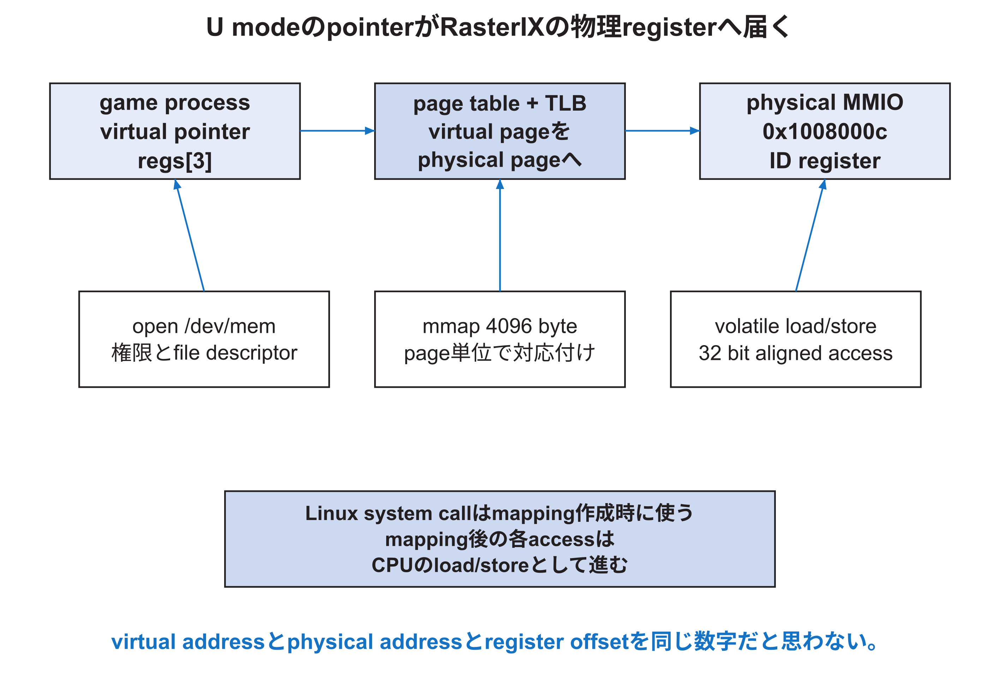

<a id="s_22_2"></a>
#### 22.2 virtual memoryの目的

virtual memoryは、process間の隔離、連続したaddress空間、共有、copy-on-write、file mapping、permissionを提供する。page単位でread/write/execute/userなどを設定する。CPUのTLBは最近の変換をcacheし、miss時にpage tableをたどる。

address変換があるからprogramはhardwareから完全に独立するわけではない。device MMIOをmappingすれば、そのvirtual pageへのload/storeが物理deviceへ届く。mappingのcache属性とpermissionを正しく選ぶ必要がある。

<a id="s_22_3"></a>
#### 22.3 kernel modeへ入る三つの経路

U-modeからS-modeへは主にsystem call、exception、interruptで入る。system callはECALL、exceptionはpage faultやillegal instruction、interruptはtimerやexternal deviceである。kernelはtrap frameへregisterを保存し、原因を判定する。

system callはfunction callと違いprivilege boundaryを越える。argument検査、pointerのuser access、schedulerによるcontext switchが起こり得る。`open`や`mmap`はsystem callだが、mapping後の各MMIO storeは通常kernel functionを毎回呼ばない。

<a id="s_22_4"></a>
#### 22.4 file descriptorとdevice

Linuxではregular file、terminal、deviceなどをfile descriptorで表す。`open("/dev/mem", O_RDWR | O_SYNC)`はphysical memory accessを提供するcharacter deviceを開く。成功には通常root権限とkernel設定が必要である。

file descriptor自体はaddressではない。`mmap`が指定physical offsetのpageをprocess virtual addressへ対応付け、その戻りpointerを使ってload/storeする。`close(fd)`後もmappingは`munmap`するまで残るため、固定版constructorはmmap後にfdを閉じられる。

<a id="s_22_5"></a>
#### 22.5 page faultは常にbugではない

processがまだmappingされていない合法virtual pageへ初めてaccessすると、demand pagingのためpage faultが起き、kernelがpageを用意して再実行することがある。permission違反や存在しないaddressならSIGSEGVになる。

MMIO mappingでSIGBUSまたはmachine checkになる場合は、physical region、access width、hardware responseを調べる。virtual pointer値だけを見てdevice physical addressだと思わない。`/proc/<pid>/maps`とpage offsetを確認する。

<a id="s_22_6"></a>
#### 22.6 schedulingとgameの時間

Linuxは複数processをtime sliceで実行する。20 MHzのsingle-core Wallyでは、kernel workやinterruptがgameを中断する。`steady_clock`で測るwall timeには、そのprocessが実行されていない時間も含まれる。

CPU time、wall time、frame completion intervalを区別する。game simulationは固定60 Hz tickをaccumulateし、render回数が減ってもsimulation stepを飛ばさない設計になっている。これは描画throughputとgame speedを分離する。

<a id="s_22_7"></a>
#### 22.7 signalと終了処理

Ctrl-Cはterminal driverからSIGINTをprocessへ送る。固定版handlerは`sig_atomic_t` flagだけを更新し、main loopが安全な場所で終了する。signal handler内で複雑なC++処理や非async-signal-safe functionを呼ばない。

正常終了とsignal終了の両方でRasterIX context、device、mappingを正しい順序で破棄する。強制電源断ではdestructorが走らないため、hardware側も次回起動時に初期化できる設計が必要である。

<a id="ch_23"></a>
### 第23章 device treeをhardwareとLinuxの契約として読む

<a id="s_23_1"></a>
#### 23.1 device treeは回路を作らない

Device Tree Sourceは、存在するhardwareをOSへ説明するdataである。node名、`compatible`、`reg`、clock、interrupt、memoryなどを記述し、`dtc`がbinary DTBへ変換する。DTBを書き換えてもFPGAのdecoderやpin接続は変わらない。[LinuxDT](#ref_LinuxDT)

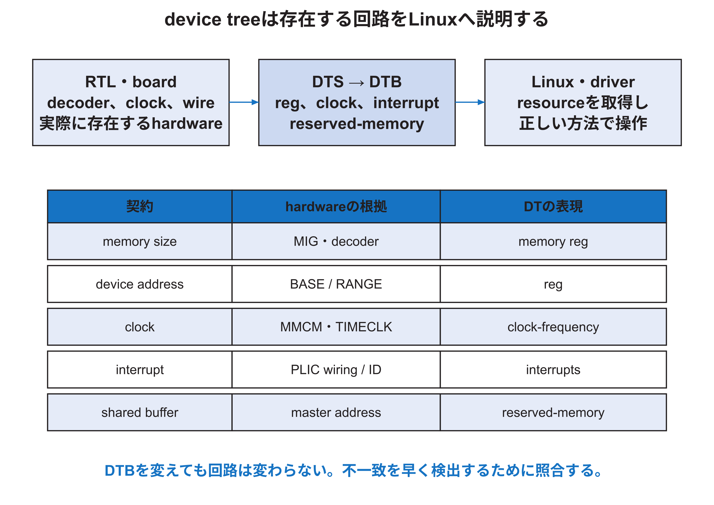

<a id="s_23_2"></a>
#### 23.2 rootのcell数

`#address-cells = <2>`と`#size-cells = <2>`なら、childの`reg`はaddress二cellとsize二cellで一組を表す。一cellは32 bitである。

```dts
reg = <0 0x9e000000 0 0x02000000>;
```

これはaddress `0x000000009e000000`、size `0x0000000002000000`、すなわち32 MiBである。四つの独立値や開始・終了の組ではない。parent nodeごとにcell数が異なり得るため、対象nodeのparentを確認する。

<a id="s_23_3"></a>
#### 23.3 memory node

Nexys Videoの`memory@80000000`は開始`0x80000000`、size`0x20000000`、すなわち512 MiBをLinuxへ伝える。kernelのphysical page allocatorはこの範囲を基礎にする。

MIGが実際に512 MiBへ接続されていないのにDTだけ512 MiBにすると、kernelは存在しないmemoryを使いfaultする。逆に実物より小さく書けば未使用領域ができる。hardware、Wally構成、DTを一致させる。

<a id="s_23_4"></a>
#### 23.4 reserved-memoryと`no-map`

RasterIX用DTSは最後の32 MiB、`0x9e000000`から`0x9fffffff`をreserved-memoryにする。Linuxの通常allocatorがkernel pageやprocess pageへ使わないためである。`no-map`はOSに標準のvirtual mappingを作らないよう指示する。

この予約はIOMMUやhardware firewallではない。RasterIXが範囲外へ書くのを止めず、applicationのoffset計算も検査しない。shared buffer allocatorとRTL address幅を別に検証する。

<a id="s_23_5"></a>
#### 23.5 `compatible`とdriver binding

`compatible`はdriverが対応deviceを選ぶ文字列である。一般に具体的な文字列から互換fallbackへ並べる。RasterIX nodeは`openhwgroup,wally-rasterix`を持つが、固定版applicationは専用kernel driverではなく`/dev/mem`を使うため、この文字列から自動でgame APIが生成されるわけではない。

将来platform driverを作る場合、`of_match_table`でcompatibleを照合し、`reg` resource、reserved memory、interruptを取得する。DT nodeだけを追加してdriverがない状態も合法であり、kernelが操作するとは限らない。

<a id="s_23_6"></a>
#### 23.6 clockとtimebase

CPU nodeの`clock-frequency`はCPU clock、`timebase-frequency`はRISC-V timer counterの周波数を伝える。本構成ではともに20 MHzだが、概念上は別である。UART nodeにも入力clockがあり、baud divisor計算に使う。

値が一致していることを、Clocking Wizardの出力、CLINT/TIMECLK接続、UART RTL、DTSで確認する。softwareが表示するMHzだけでhardware clockを測定したことにはならない。

<a id="s_23_7"></a>
#### 23.7 interrupt記述

`interrupt-parent`はどのinterrupt controllerへ接続するか、`interrupts`はcontroller固有のsource番号やflagsを表す。PLIC node自身はCPU interrupt controllerへの`interrupts-extended`を持つ。

RTLでsource IDを変えたらDTSも変える。DTSだけ変えてもwireは付け替わらない。driverがclaimしたID、PLIC設定、device pending、CPU trap causeを一続きで確認する。

<a id="s_23_8"></a>
#### 23.8 DTSからDTBを作り、戻して比較する

```bash
dtc -I dts -O dtb -i "$WALLY/linux/devicetree" \
  -o wally-nexysvideo-rasterix.dtb \
  "$WALLY/linux/devicetree/wally-nexysvideo-rasterix.dts"
dtc -I dtb -O dts wally-nexysvideo-rasterix.dtb \
  -o decoded.dts
```

include後の最終内容はdecoded側で確認できる。実機Linuxでは`/sys/firmware/fdt`や`/proc/device-tree`からboot時DTを確認できる環境もある。hostで作ったDTBと実機が受け取ったDTBをhashまたは内容で照合する。

<a id="s_23_9"></a>
#### 23.9 DTの検証表

| property | RTLまたは基板側の根拠 | softwareでの確認 |
|---|---|---|
| memory `reg` | MIG容量、decoder | boot logのmemory |
| CPU clock | MMCM出力 | timekeeping、DTS dump |
| UART clock/address | UART RTL、decoder | console、driver resource |
| RasterIX `reg` | EXT_IO BASE/RANGE | ID read |
| reserved-memory | framebuffer配置 | `/proc/iomem`、DT dump |
| interrupt | PLIC wiring/ID | `/proc/interrupts`、handler |

<a id="ch_24"></a>
### 第24章 MMIO、`mmap`、`volatile`、fenceを深く理解する

<a id="s_24_1"></a>
#### 24.1 MMIOとは何か

Memory-mapped I/Oは、load/storeのphysical address範囲をRAMではなくdevice registerへ割り当てる方式である。CPU命令の形はmemory accessだが、readでstatusを得たり、writeでFIFOへcommandを投入したりする。

普通のmemoryと違い、read/writeにside effectがあり、同じaccessの繰返しが同じ結果になるとは限らない。cache、speculation、reordering、access幅をdevice契約へ合わせる。

<a id="s_24_2"></a>
#### 24.2 固定版のmapping

`WallyBusConnector`は`/dev/mem`を`O_RDWR | O_SYNC`で開き、physical `0x10080000`から4096 byteを`PROT_READ | PROT_WRITE`、`MAP_SHARED`でmappingする。戻り値を`volatile uint32_t*`へ変換する。

4096 byteはpage mappingの単位であり、hardware registerが4096 byteある意味ではない。DTSのregister regionは256 byteである。C++側は定義したindexだけをaccessする。

<a id="s_24_3"></a>
#### 24.3 register indexとbyte offset

`regs`は`uint32_t*`なので、`regs[n]`のbyte offsetは`4n`である。`regs[3]`はoffset 0x0cのID、`regs[4]`は0x10のframe countである。

```text
virtual_base + 4 × index
   ↓ page table mapping
0x10080000 + 4 × index
   ↓ Wally address decode
APB peripheral register
```

pointer arithmeticをbyte単位と誤解すると四倍違うregisterへaccessする。RTLのPADDR sliceとC++ indexを表で照合する。

<a id="s_24_4"></a>
#### 24.4 `volatile`が保証すること

`volatile` accessは、そのC++ abstract machine上でcompilerがread/writeを不要と判断して消したり、一つにまとめたりするのを制限する。status polling loopで毎回loadを生成させるために必要である。

しかし`volatile`は次を単独では保証しない。

- CPU hardwareによるmemory orderingすべて。
- cacheabilityまたはdevice属性。
- bus transferの完了後にdevice内部処理が完了したこと。
- 複数thread間のC++ data race防止。
- DMAとのcache coherence。

<a id="s_24_5"></a>
#### 24.5 RISC-V fence

`fence iorw, iorw`は先行するI/Oとmemory accessが、後続accessよりordering上先になるよう制約する。固定版はMMIO command wordを書き終えた後に実行する。compiler barrierの`"memory"` clobberも、compilerが周辺memory operationを跨いで動かすのを抑える。

fence完了はRasterIXが全triangleをrasterizeし、framebufferをDDRへcommitし、displayがswapしたことを意味しない。それぞれ別のqueueと状態を持つ。必要な完了段階に対応するstatusまたはcounterを待つ。

<a id="s_24_6"></a>
#### 24.6 pollingとtimeout

status pollingは、条件が成立するまでregisterを繰り返し読む。sleepを入れないbusy waitは反応が速いがCPUを占有する。低速single-coreでは他processのscheduleにも影響する。timeoutがなければhardware停止時に永久loopになる。

固定版は30秒deadlineを使い、responseとdisplay swapを待つ。timeout値は正常性能の保証値ではなく、異常を有限時間で報告する保護である。性能測定区間ではtimeout判定用clock readのcostも分けて考える。

<a id="s_24_7"></a>
#### 24.7 `/dev/mem`を使う理由と限界

研究用prototypeでは、小さなC++ connectorでregisterを直接操作でき、kernel driver実装を省ける。ID、status、commandを早く検証するには有効である。

一方、root権限が必要で、process間の排他、buffer管理、interrupt、security、power management、DMA mappingをkernelが管理しない。公開する一般systemなら、platform driverとcharacter deviceまたはDRMなどのsubsystemを検討する。固定版の選択はprototypeの範囲に対するもので、最終的なproduction APIの最適解を意味しない。

<a id="s_24_8"></a>
#### 24.8 専用driverへ移すなら

driverはDTのresourceを取得し、`ioremap`でregisterをmappingし、accessorでread/writeする。user APIは`ioctl`、`write`、`mmap`、poll、interrupt completionなどから選ぶ。shared bufferはDMA APIまたはreserved memoryの管理を使う。

driver化してもhardware protocolは同じである。利点は権限、lifetime、排他、error、cache属性を一箇所へ集められることだ。overheadと複雑さも増えるため、研究の目的と利用者を明確にする。

<a id="ch_25"></a>
### 第25章 RasterIXのsoftware stackを深く追う

<a id="s_25_1"></a>
#### 25.1 一つのOpenGL風呼出しは直接register一語ではない

gameは`glBegin`、`glVertex`、`glColor`などのAPIを使う。RasterIXのsoftware側はcurrent state、頂点配列、matrix、primitive assembly、clipping、triangle descriptor、display listを処理し、最終的に32 bit word列を`IBusConnector`へ渡す。

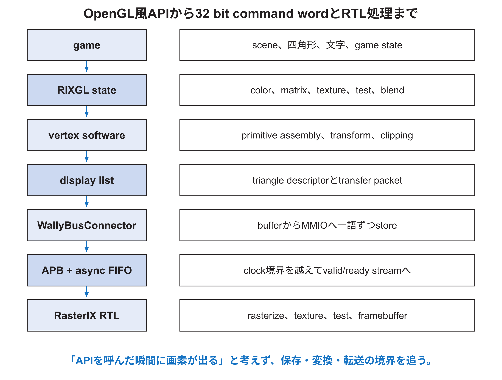

<a id="s_25_2"></a>
#### 25.2 API stateとdraw call

OpenGLのimmediate modeでは、`glColor`は以後の頂点に関連付くcurrent colorを変える。`glBegin`はprimitive種別を開始し、`glVertex`は頂点を蓄え、`glEnd`でまとまりを処理する。関数名一つがその場でpixelを塗るとは限らない。

matrix、viewport、texture enable、depth test、blendなどもstateである。draw時に現在stateと頂点を組み合わせ、hardware commandへ変換する。state changeの順序が描画結果を変える。

<a id="s_25_3"></a>
#### 25.3 `ThreadedVertexTransformer`と本構成

upstream softwareはworkerとtransfer runnerを抽象化し、並列実行可能な構造を持つ。本構成はsingle-core Wallyで`NoThreadRunner`を使い、処理と転送を順次実行する。class名にThreadedとあっても、実際に別threadが走るかは渡したrunnerで決まる。

この選択は正しさと初期統合を単純にする。将来thread化しても20 MHz single-coreでは同時実行のhardware coreが増えるわけではなく、context switchと同期costがある。測定して判断する。

<a id="s_25_4"></a>
#### 25.4 command用buffer

`WallyBusConnector`は複数の`std::vector<uint32_t>`を持ち、upstreamからwrite bufferを要求されたときspanを返す。softwareはまずhost-side bufferへword列を作り、`writeData`でMMIOへ順番に送る。

これは「GPUがC++ vectorを直接読む」方式ではない。vectorはWallyのprocess memoryにあり、connectorが各wordをAPB registerへstoreする。最後のwordだけoffset 0x04へ書きTLASTを示す。buffer index、size、offsetは範囲と4 byte alignmentを検査する。

<a id="s_25_5"></a>
#### 25.5 二層のpacket

RasterIXには、device data uploadなどを扱う外側のtransfer framingと、rasterizerが解釈する内側のrender commandがある。word列を観察するときは、どのlayerのlength、type、TLASTかを区別する。

一語欠けると後続wordの境界までずれる可能性がある。色だけがおかしい場合、triangle descriptorのfieldかもしれないが、全commandが停止するならpacket length、TLAST、ready/validを先に疑う。

<a id="s_25_6"></a>
#### 25.6 software処理とhardware処理の分担

固定版RasterIXでは、頂点変換や一部triangle setupをsoftware側が行い、RTL側はdescriptorからpixel/fragmentを生成し、texture、test、blend、framebuffer処理を行う。したがって「RasterIXはすべてのOpenGL処理をhardwareで行う」ではない。

性能を調べるとき、CPU側command preparation、MMIO transfer、GPU execution、DDR commit、display waitを分ける。本研究で測定した準備時間は、software側のdraw call数やcommand作成方法で変わる。

<a id="s_25_7"></a>
#### 25.7 `RIXGL` instanceと初期化

`RIXGL::createInstance`はdeviceとsoftware stackを結び、OpenGL風APIのcontextを用意する。resolution変更前後には内部display listがflushされるため、固定版gameはclearを先に実行し、その後resolutionを設定する。これは起動時に古い内部pixelが残る問題と関係する。

初期化順は偶然ではない。transport、uploader、runner、device、contextの依存方向を図にし、破棄は逆順にする。constructorが途中でexceptionを投げた場合も既に獲得したresourceが解放されるか確認する。

<a id="s_25_8"></a>
#### 25.8 errorの伝わり方

MMIO mapping失敗、ID不一致、response timeout、display timeoutはC++ exceptionとしてmainへ伝わり、stderrへ表示して非zero終了する。OpenGL state errorは`glGetError`で確認する。

hardwareが返すerror bit、transport timeout、API misuseを同じ文字列にまとめない。error code、stage、address、last command countを記録できると診断しやすい。prototypeでもsilent failureを避ける。

<a id="s_25_9"></a>
#### 25.9 sourceを追う具体的な入口

1. `examples/rasterix/breakout.cpp`の`present` lambda。
2. `BreakoutRenderer.hpp`のdraw sequence。
3. upstream `RIXGL`とvertex pipeline。
4. `DeviceDataUploader`とdisplay list。
5. `WallyBusConnector::writeData`。
6. APB adapterのregister map。
7. async FIFOと`RasterIX_IF`。
8. CommandParser、Rasterizer、PerFragmentPipeline。

各段階でinput型、output型、所有するstate、完了条件を書く。関数名だけを矢印で結ばず、一つの四角形について実際の頂点値とword数を追う。

<a id="ch_26"></a>
### 第26章 game loop、入力、時間、描画を深く理解する

<a id="s_26_1"></a>
#### 26.1 一frameの仕事

game loopは概ね、時間取得、入力、simulation update、scene作成、描画command生成、送信、表示完了確認を繰り返す。これらを一つの「描画時間」にまとめると、どこを改善したか説明できない。

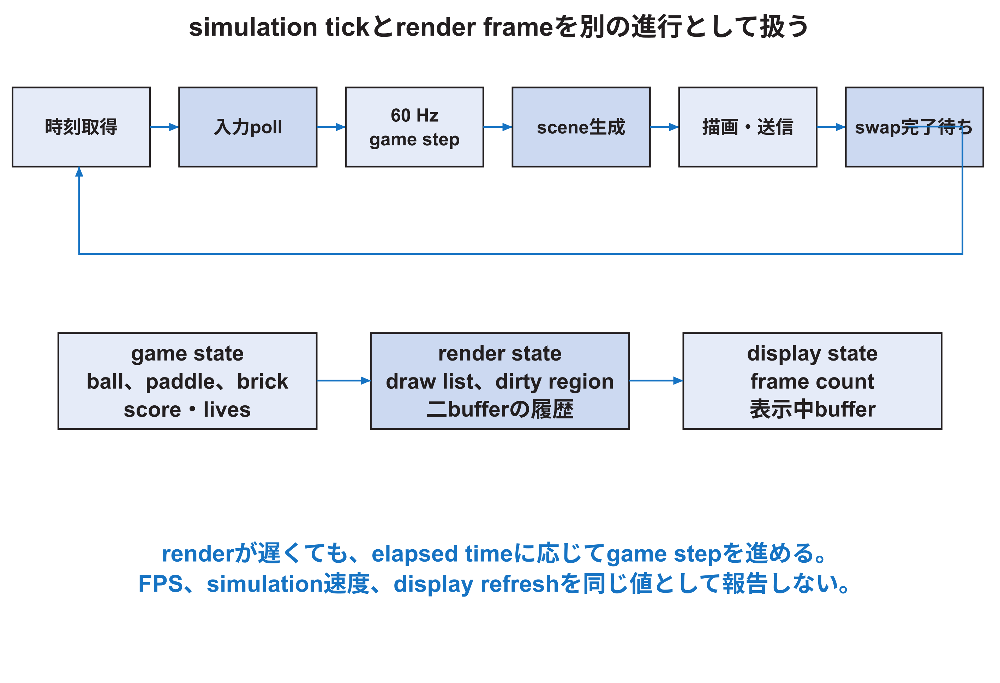

<a id="s_26_2"></a>
#### 26.2 固定timestep

固定版はelapsed nanosecondsへ60を掛けてaccumulatorへ加え、10億以上になるごとにgameを一step進める。これは一tickを1/60秒とし、整数除算による周期丸めを避ける方法である。

```text
accumulated += elapsed_ns × 60
while accumulated >= 1,000,000,000:
    game.step(input)
    accumulated -= 1,000,000,000
```

renderが10 FPSでも、時間に応じて複数tickを進めるためgame speedを概ね実時間へ保つ。ただし処理が長時間追いつかないと、catch-up loopが増えてさらにrenderが遅れるspiral of deathが起こり得る。最大step数やoverload方針を設計する。

<a id="s_26_3"></a>
#### 26.3 render frameとdisplay refresh

gameが一枚分のcommandを生成した回数、RasterIXがframebufferへcommitした回数、displayがbuffer swapを認めた回数、HDMI receiverが映像を取得した回数は同じとは限らない。計測名を区別する。

固定版`present`はsceneをdrawし、swap前のframe countを読み、`swapDisplayList`を呼び、counterが変わるまで待つ。これにより同じbufferを表示側が読む前に再利用する競合を避ける。counter増加はdisplay handshakeの観察であり、cameraで測るvisual FPSとは別である。

<a id="s_26_4"></a>
#### 26.4 inputのsampling

現行gameはterminalをnonblockingでpollし、A/D/S/Spaceなどをinput stateへ変換する。movementは停止または反対入力まで保持し、launchは一回だけ使うeventとして`takeInput`後にclearする。

controllerを追加する場合も、raw I2C byteからbutton/axis、debounce/calibration、game actionへ層を分ける。hardware read周期と60 Hz game tickが違う場合、最新stateを保持し、短いeventを失わない方法を決める。

<a id="s_26_5"></a>
#### 26.5 game stateとrender state

ball position、paddle position、brick alive、score、livesはgame stateである。vertex list、color、dirty rectangle、二つのframebufferごとの過去sceneはrender stateである。同じものに見えても責務が違う。

game logicを一step進めず何度renderしても、同じsceneになるべきである。逆にrenderをskipしてもgame stateは時間に従って進められる。この分離はtestを容易にし、描画最適化がgame判定を変えないことを確認できる。

<a id="s_26_6"></a>
#### 26.6 全体描画、呼出し統合、部分描画

全体描画は毎frame背景と全objectを描くため単純で、初期正解として使える。呼出し統合は、同じstateの四角形をまとめてdraw call数とcommand準備を減らす。部分描画は、前frameから変わった領域だけを消し、重なるobjectを正しい順で描き直す。

部分描画では二つのdisplay bufferそれぞれの過去状態を管理する。現在画面に見えているbufferと、次に描くbufferが交互に変わるため、一つ前のframeだけを覚えると消し残しが出る。起動時は履歴がないため両bufferを全体描画で初期化する。

<a id="s_26_7"></a>
#### 26.7 text rendering

一般的なreal-time graphicsではglyph atlas textureを使い、各文字をtexture付きquadとして描くことが多い。固定版の文字も複数の小図形またはtextureとして表現できる。重要なのは、文字一個を一draw callにするとcommand preparation costが増える点である。

文字の見た目、font data生成、glyph placement、draw batchingを分ける。文字化けまたは欠けが性能問題とは限らない。glyph geometry、buffer lifetime、state change、clippingを検査する。

<a id="s_26_8"></a>
#### 26.8 game loopの単体試験

hardwareなしでも、同じinput sequenceでball、collision、scoreが期待値になるかをtestできる。rendererはsceneから生成したprimitive数、dirty region、draw orderを検査できる。transportはfake connectorでword列を保存し、expected packetと比較できる。

実機testだけにすると、game bug、software rendering bug、bus bug、RTL bug、display bugが同時に候補になる。純粋なlogicから外側へtestを重ねる。

<a id="ch_27"></a>
### 第27章 softwareとhardwareを層ごとに診断する

<a id="s_27_1"></a>
#### 27.1 最初に同じ版を動かしているか確かめる

診断前に、source commit、submodule、bitstream、DTB、kernel、rootfs、applicationを固定する。古いSD copyを動かした状態では、codeを直しても症状が変わらない。実機起動logとbinary hashを試行ごとに保存する。

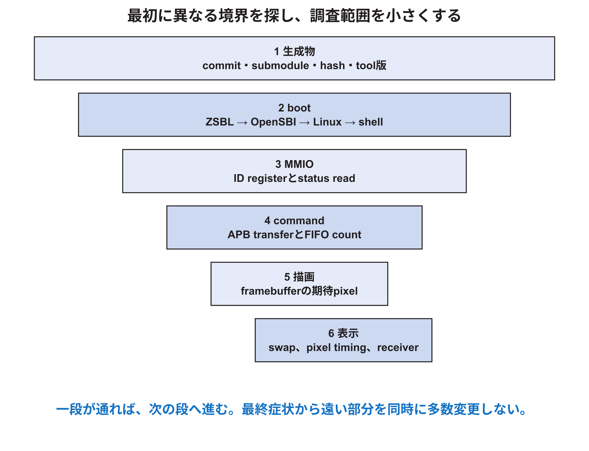

<a id="s_27_2"></a>
#### 27.2 hostで確認するcommand

```bash
git status --short
git rev-parse HEAD
git submodule status
file rasterix-build/rasterix-breakout
riscv64-buildroot-linux-gnu-readelf -h rasterix-build/rasterix-breakout
dtc -I dtb -O dts wally-nexysvideo-rasterix.dtb -o decoded.dts
```

Vivado reportではutilization、timing、clock、CDC、DRCを保存する。build successだけでWNSやunconstrained pathを見落とさない。

<a id="s_27_3"></a>
#### 27.3 target Linuxで確認するcommand

環境に存在する範囲で次を使う。

```bash
uname -a
cat /proc/cpuinfo
cat /proc/iomem
cat /proc/interrupts
dmesg | tail -n 100
sha256sum ./rasterix-breakout
```

BusyBox構成では一部commandやoptionがない場合がある。command不在をhardware failureと解釈せず、rootfs configを確認する。

<a id="s_27_4"></a>
#### 27.4 UART logの読み方

UARTはboot初期から使え、画面が出ない場合にも役立つ。logへtimestampまたは段階名を入れ、ZSBL、OpenSBI、kernel、applicationを区別する。binary dataや大量traceを低速UARTへ出すとsystem timingを大きく変える。

文字化けはbaud、input clock、data bit、parity、line endingを確認する。何も出ない場合はTX pin、USB port、reset、bitstream、terminal deviceの順に分ける。

<a id="s_27_5"></a>
#### 27.5 register canary

ID register readは小さいend-to-end testである。期待値が返れば、process mapping、MMU、LSU、bus、decoder、APB read、adapterの一部が通った。次にstatus、単一command、frame countへ段階を進める。

ID不一致でtriangle codeを直しても意味がない。最初に失敗した境界より後の処理をいったん候補から外す。

<a id="s_27_6"></a>
#### 27.6 waveformとsoftware logを時刻で結ぶ

simulationまたはILAではAPB handshake、FIFO write/read、AXI stream、DDR request、swap handshakeを見る。software logにはcommand sequence番号やframe countを出す。共通counterまたはtrigger eventで両者を対応付ける。

logic analyzerを入れるとresourceとtimingが変わることがある。debug buildの結果をproduction buildの性能値として使わず、観察用構成を明記する。

<a id="s_27_7"></a>
#### 27.7 error injection

PREADYを数cycle下げる、FIFOを小さくする、TLASTを一度欠かす、DTB addressを意図的にずらすなど、制御されたfaultを入れるとerror detectionを確認できる。元sourceと実験branchを分け、必ず戻せるようにする。

timeoutが働くか、silent dropしないか、reset後に回復するか、error messageが原因stageを示すかを見る。正常caseだけの試験ではbackpressureやrecoveryは確認できない。

<a id="s_27_8"></a>
#### 27.8 assertionとsoftware invariant

hardwareでは「FIFO full時にwriteしない」「valid中readyまでdataを保持」「APB writeは一回だけpush」などをassertionにする。softwareではbuffer index、sizeの4 byte alignment、address range、context lifetimeをcheckする。

両側の検査は重複ではない。hardwareは悪いsoftwareからも内部整合を守り、softwareはerrorを早く説明可能にする。

<a id="s_27_9"></a>
#### 27.9 診断記録の書式

一試行ごとに、目的、固定版、変更一つ、予想、command、入力、観察、結果、artifact pathを書く。成功画像だけでなく、UART log、counter、report、hashを保存する。予想と異なった結果も削除せず、次の仮説の根拠にする。

<a id="ch_28"></a>
### 第28章 hardware software協調で性能を測る

<a id="s_28_1"></a>
#### 28.1 end-to-end latencyを分解する

一frameの時間は、game update、CPU側描画準備、MMIO転送、RasterIX実行、DDR commit、display swap待ちに分けられる。重なって実行できる区間もあるため、単純に足し算できるかを先に確認する。

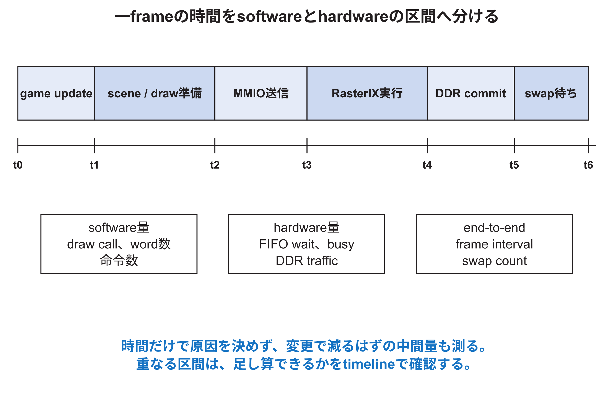

<a id="s_28_2"></a>
#### 28.2 timestampの置き場所

区間の境界に`steady_clock` timestampを置く。関数全体だけでなく、scene構築前後、display list生成前後、MMIO write前後、swap request前後を測る。hardware counterがあればCPU timestampと併用する。

clock readにもcostがあり、非常に短い区間では影響が大きい。同じ区間を多数回測り、空の測定、warm-up、中央値や分布を見る。nanosecond型で返ることとnanosecond精度があることは別である。

<a id="s_28_3"></a>
#### 28.3 throughputとlatency

command一語のlatencyが長くてもpipelineで連続wordを一cycleごとに受けられればthroughputは高い。逆に最初の応答が速くても、一wordごとにsoftwareが完了待ちすればthroughputは低い。

FPSはend-to-end throughputである。command words/s、triangles/s、fragments/s、DDR bytes/sを別に測る。どのrateが飽和したかで改善対象が変わる。

<a id="s_28_4"></a>
#### 28.4 Littleの法則とqueue

安定したqueueでは、平均滞留数L、到着率λ、平均滞留時間Wに`L = λW`の関係がある。FIFO occupancy、command rate、wait timeを同時に測れば、bufferがburstを吸収しているのか、長期的に処理が追いついていないのかを考えられる。

FIFOを深くしても、平均consumer rateがproducer rateより低ければ最終的にfullになる。深さは一時burstと停止時間を吸収する設計値であり、計算能力そのものを増やさない。

<a id="s_28_5"></a>
#### 28.5 因果を示す比較

同じgame state、resolution、compiler、clock、bitstreamで、一要因だけを変える。全体描画、呼出し統合、部分描画を同じexecutableのoptionで選べばbuild差を減らせる。命令数、command word数、MMIO時間、frame timeを合わせて保存する。

時間が減っただけで原因を決めず、変更によって減ると予想した中間量も測る。draw call統合ならcall数とword数、部分描画なら更新面積とprimitive数、wait改善ならsleep時間とcounter待ち時間を見る。

<a id="s_28_6"></a>
#### 28.6 正しさを性能と同時に守る

速くなっても、brickが消える、二重bufferの片方に残像が出る、game tickが遅くなるなら同じ処理の改善ではない。固定inputとstate、framebuffer hash、選択frameのpixel比較、game resultを使う。

pixel完全一致が必要な比較と、見た目同等でよい比較を区別する。blendやfixed-point順序を変える最適化では、許容誤差を先に定義する。

<a id="s_28_7"></a>
#### 28.7 CPU最適化とhardware最適化

CPU側ではdraw call削減、data structure、allocation削減、compiler最適化、batchingがある。hardware側ではclock、parallelism、pipeline、memory width、cache、FIFO、RasterIX parameterがある。software変更でCPU準備が支配的でなくなれば、次のbottleneckがhardwareへ移る。

最適化は一度で終わらない。測定、支配区間の特定、変更、正しさ確認、再測定を繰り返す。ただし研究発表では、探索したすべてではなく、主張を支える比較と限界を示す。

<a id="s_28_8"></a>
#### 28.8 報告する最小dataset

| 種類 | 保存する値 |
|---|---|
| 固定条件 | commit、bitstream、DTB、binary hash、clock、resolution |
| workload | game state、実行時間、input、描画方式 |
| software | command準備、call数、word数、CPU time |
| hardware | FIFO wait、busy、swap count、memory traffic |
| end-to-end | frame interval、完了frame数、visual確認 |
| correctness | state、pixel/hash、error、timeout |

<a id="s_28_9"></a>
#### 28.9 この技術付録で到達する理解

hardware側では、RTLの記述からresourceとtimingを予想し、Wallyの命令・memory・bus・privilegeを追い、CDCと周辺回路を設計し、reportと波形で確認する。software側では、cross build、boot、kernel、virtual memory、MMIO、RasterIX API、game loopを追い、実行binaryとhardwareの契約を検証する。

最終目標は用語を暗記することではない。新しいcontroller、表示方式、resolution、clock、cache構成を提案されたとき、変更箇所、守る契約、起こり得るfailure、必要なtest、性能と資源のtrade-offを自分で列挙できる状態である。

<a id="part_IV"></a>
## 第IV部 RasterIXと描画システム

OpenGL風APIから命令列、転送protocol、RTL pipeline、rasterization、texture、depth、blend、framebuffer、映像出力までを追う。Wallyとの接続に必要な境界と、公式RasterIX内部の動作を区別して扱う。

<a id="ch_B"></a>
### 付録B 信号とコードを数値で追う

<a id="s_B_1"></a>
#### B.1 命令の書き込みを一行ずつ読む

次は`rasterix_apb.sv`の抜粋であり、単独で完結するモジュールではない。接続全体は7.2〜[7.8](本文.md#s_7_8)節で説明した。

```systemverilog
assign CmdValid = CommandWrite;
assign CmdLast = PADDR[2];
assign CmdData = WriteData;
```

CommandWriteは、この回路が選ばれた書き込みのアクセス段階で、必要な4 byteが有効、かつ命令用番地であるときに1になる。三行はそれぞれ「有効な語がある」「最後の語か」「語の値」を出す。受け取りはCmdValidとCmdReadyが両方1の立ち上がりで一度だけ成立し、同時にCPUへPREADYを返す。

| CmdValid | CmdReady | そのクロックでの動作 |
|---:|---:|---|
| 0 | 0 | 命令は渡らない |
| 0 | 1 | 受け取り側に空きがあるが、命令は渡らない |
| 1 | 0 | 命令とその値を保持して待つ |
| 1 | 1 | 命令を一つ受け取る |

<a id="s_B_2"></a>
#### B.2 64 bitバスの中から32 bitを選ぶ

CPU側のPWDATAは64 bit、RasterIXへ送る一語は32 bitである。次の条件演算は、PADDR[2]が1なら上半分、0なら下半分を選ぶ。

```systemverilog
assign WriteData = PADDR[2] ? PWDATA[63:32] : PWDATA[31:0];
```

0x10080000のbit 2は0、0x10080004では1である。したがって図B.1のように、通常命令は下位、最後の命令は上位から取り出す。濃い青の「選択」がこの条件演算で、出力CmdDataはどちらも32 bitとなる。

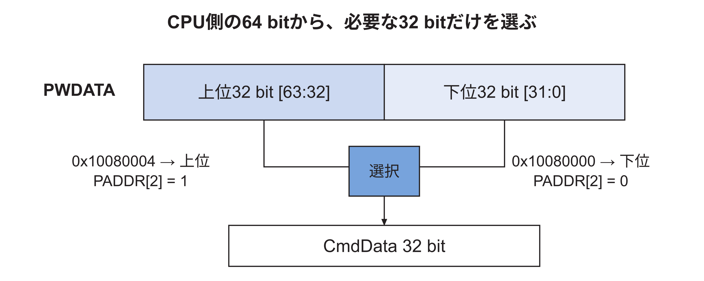

PSTRBは各byteが有効かを示す。選ぶ32 bitの4 byteすべてが有効であることも、[7.7](本文.md#s_7_7)節のWordWriteの式で確かめる。ソフトウェアの32 bit単位・4 byte境界という約束と、この回路の選択を対応させる。

<a id="s_B_3"></a>
#### B.3 三つの命令データを送る具体例

説明用に0x11111111、0x22222222、0x33333333という三つの32 bit値を考える。実際の有効な描画命令の内容ではなく、転送の順番を示すための値である。

| 書く順序 | CPUが書く実アドレス | データ | CmdLast |
|---|---|---|---:|
| 1 | 0x10080000 | 0x11111111 | 0 |
| 2 | 0x10080000 | 0x22222222 | 0 |
| 3 | 0x10080004 | 0x33333333 | 1 |

最初の二回は同じアドレスへ書く。通常の配列へ保存するように、アドレスを4ずつ増やして並べる操作ではない。同じ命令口が毎回データを受け取り、FIFOの中へ順番に並べる。最後だけ終端を表す別の命令口へ書く。

C++のregsとの対応は7.6節の表に示した。一要素は4 byteなので、regs[3]が先頭+12、すなわち識別値の0x0cを指す。

<a id="s_B_4"></a>
#### B.4 完了回数を使う理由

一瞬だけ1になる信号をCPUが直接読むと見逃し得るため、完了のたびに増える回数を回路側で保持する。例えば送信前が125なら、切り替え依頼後も125の間は待ち、126へ変わると新しい完了が分かる。アプリケーションは一回のpresentごとに確認し、旧画像を再利用する区切りにする。

回数が示すのは10.5〜[10.6](本文.md#s_10_6)節の回路内の条件であり、ディスプレイの画素を光学的に数えたものではない。

<a id="s_B_5"></a>
#### B.5 未完了の読み出しを数える例

メモリへ出す要求は、受け付けられる時点と返事が戻る時点が異なる。表示回路が古い画像に対して二件の要求を出していて、どちらの返事も終わっていないとする。このときOutstandingは2である。

次に新しい画像の先頭を読む要求が受け付けられる。同じクロックで返事の完了がないなら、待つべき件数は2 + 1 = 3になる。旧画像の二件と新画像の最初の一件が完了するまで待つ。新しい要求が出たという事実だけで、旧画像を再利用してはいけない。

| 出来事 | 残る返事の数 | 表示切り替えの完了を返すか |
|---|---:|---|
| 新画像の最初の要求を受理 | 3 | まだ返さない |
| 旧画像の一件目が完了 | 2 | まだ返さない |
| 旧画像の二件目が完了 | 1 | まだ返さない |
| 新画像の最初の一件が完了 | 0 | 返す |

実装の式には、同じクロックで返事が一件完了した場合の引き算もある。Remaining <= Outstanding + 1 - ReadCompletedという関係で、追加した一件と同時完了の一件を両方反映する。ここを省くと、一件余分に待ったり、早く完了を返したりする。

この数え方は、使用している表示側の要求と応答の順序に合わせた制御である。任意のAXI接続へ条件を確認せず流用できる一般的な完了判定として扱わない。


図B.2は、上の表を時間順に並べ直したものである。

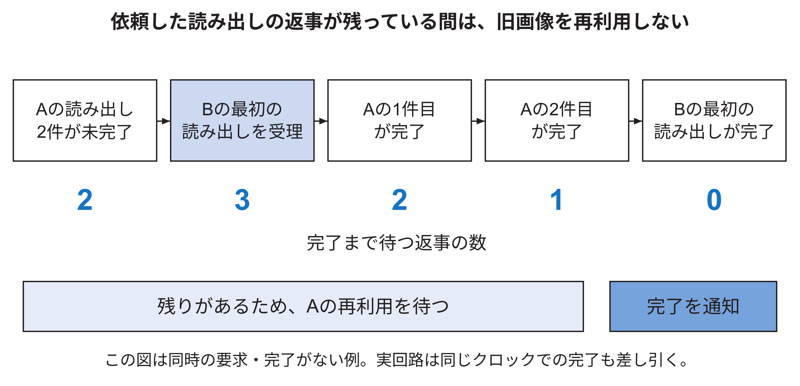

青い箱の時点で新しい画像の要求が一つ加わり、返事を待つ件数が2から3に増える。その後、返事が終わるたびに3、2、1、0と減る。この例では最後の0で切り替え完了を通知する。図は説明用の一例であり、同時に要求と返事が成立する場合は、本文の式どおり増減を同時に計算する。

<a id="ch_G"></a>
### 付録G RasterIXとの接続を自分で組み立てる

<a id="s_G_1"></a>
#### G.1 この付録で再現する設計と答え合わせの場所

本付録は、Nexys Video上でWallyが起動するところから、公式RasterIXを接続する設計を再現するための説明である。CPU自体のRTLや、公式RasterIXの内部の描画算法を一から書き直す課題ではない。設計する対象は、両者の間の接続、共有メモリ、表示切り替え、ソフトウェアの送信口である。

完成版の主な値は、CPU20 MHz、RasterIX100 MHz、画面640×480、内部作業領域65,536画素、命令ポート0x10080000、画像用予約領域32 MiBである。まずこの組み合わせを再現し、動く基準ができてから値を変える。理由を理解せずに複数の値を同時に変えると、どの約束が崩れたか判断しにくい。

付属の`再現資料/詳説用ソース/Wally`には、固定した完成版から取得したファイルを置いた。`RasterIX`フォルダには、解説に使った公式サブモジュールのファイルを置いた。`manifest.json`で取得元コミットと各ファイルのSHA-256を確認できる。これらのソースは説明用にコメントを書き換えた版ではなく、指定版の内容を保持した資料である。

`RasterIX導入.patch`は導入コミット5b6adcd97の差分であり、初期の完成版d3e181ac4までの全変更ではない。導入後に行った画像初期化やゲーム追加などの変更は、[付録A](#ch_A)のコミット表と区別して読む。導入時点の再現と、論文が評価する完成版の再現を混ぜない。

<a id="s_G_2"></a>
#### G.2 最初に部品同士の約束を表にする

回路を書く前に、入口、出口、クロック、待ち方を決める。入口の名前を決めるだけでは足りない。例えば「CPUが書ける」と決めても、データが何bitで、FIFOが満杯ならどうなるかを決めていなければ、回路を最後まで配線できない。

| 決める対象 | 本設計の約束 | その約束を満たす場所 |
|---|---|---|
| CPUからの命令 | 整列した32 bit書き込み | WallyBusConnectorとrasterix_apb |
| 転送の終わり | 最後の一語を+0x04へ書く | CmdLastとAXI StreamのTLAST |
| 受け側が満杯 | APBの完了を待たせる | PREADYとCmdReady |
| CPUと描画器の速度差 | 非同期FIFOを通す | axiscdc |
| 画像の保存先 | Linuxと重ならない予約領域 | dtsとCMakeLists |
| 切り替え完了 | 新画像の最初の読出し返却まで待つ | rasterixdisplay |
| 公式コードとの境界 | 公式の入口を使い、外側で変換 | IBusConnectorとRTLラッパー |

この表の各行について、「別の値にすると、どのファイルを一緒に変えるか」を答えられれば、設定を暗記した段階から一歩進める。例えば命令ポートの番地は、CPU側のアドレス判定だけでなく、mmapとデバイスツリーも同じ値にそろえる必要がある。

<a id="s_G_3"></a>
#### G.3 外部I/OをWallyの構成に追加する

Wallyは構成値を一つのファイルだけで完結させず、構成ファイルの値をパラメータ構造体へ渡して各回路で使う。このため、新しい外部I/Oを追加するときも、その受け渡し経路へ値を通す。[Console26](#ref_Console26)

本導入では`EXT_IO_SUPPORTED`、`EXT_IO_BASE`、`EXT_IO_RANGE`を追加した。SUPPORTEDは外部I/Oを使うか、BASEは先頭アドレス、RANGEはその範囲を定める。通常の構成では無効を既定にし、`fpganexysvideo_rasterix`という派生構成で有効にする。これは、描画回路を使わない既存のボードまで常に同じ周辺回路を要求することを避けるためである。

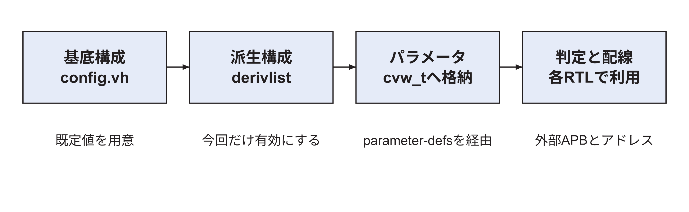

具体的には、`config/rv64gc/config.vh`などの基底構成、`config/derivlist.txt`、`src/cvw.sv`、`config/shared/parameter-defs.vh`を対応させる。構造体のメンバだけを増やして各構成の値を用意しなければ、別構成の生成で未定義や値の不一致が出る可能性がある。今回、描画に使わないrv32系の構成ファイルにも追加があるのは、このパラメータの入口をそろえるためである。

読み方は、まずderivlistで選んだ構成を見て、生成されるconfig.vhの値を確認し、その値がparameter-defsからcvw_tへ入ることを追う。Vivado側ではwally.tclが選択済み構成のEXT_IO_SUPPORTEDを確認している。外部I/Oを無効にした構成でRasterIXを生成しようとすると、ここでエラーにする。

<a id="s_G_4"></a>
#### G.4 アドレス判定からAPBの戻り値までを配線する

CPUが0x10080000へアクセスしても、その番地を選ぶ回路がなければRasterIXには届かない。`adrdecs.sv`で外部I/Oの領域を判定し、`uncore.sv`へその選択結果を渡す。`uncore.sv`ではAPBブリッジが扱う周辺回路の数を8にし、外部I/OをPSELのbit 7へ対応させる。[Console26](#ref_Console26)

書き込み要求を外へ出す線だけでは不十分である。CPUへ返すPRDATAと、その転送を完了してよいかを示すPREADYも戻す。PREADY=0なら待ち、1ならその転送を完了できる。もしPREADYを常に1に結線すると、FIFOが満杯でもCPUが次へ進み、命令を受け取れなかった事実を伝えられない。

```systemverilog
if (P.EXT_IO_SUPPORTED) begin : extio
  assign PSELEXT = PSEL[7];
  assign PREADY[7] = PREADYEXT;
  assign PRDATA[7] = PRDATAEXT;
end else begin : extio
  assign PSELEXT = 1'b0;
  assign PREADY[7] = 1'b1;
  assign PRDATA[7] = '0;
end
```

この抜粋は`uncore.sv`の外部I/Oの分岐である。有効な場合は外部回路の返事を使い、無効なら外部選択を0にする。未使用の入力が不定のまま残らないよう、戻り値の扱いも決めている。

外へ出すAPB信号は、`wallypipelinedsoc.sv`を通してFPGAの最上位回路へ出す。そのため、既存のテストベンチや他ボードの最上位回路にも、追加したポートの接続を反映する。RasterIXを実装しないところでは、未使用として結線する。特定のゲームの信号名をCPU内部へ直接追加するより、汎用の外部APBとして出す方が、別の周辺回路にも用途を広げやすい。

<a id="s_G_5"></a>
#### G.5 APBの変換回路を三部分に分けて書く

`rasterix_apb.sv`は、データの選択、受け渡しの条件、読出しと状態保存、の三部分に分けて読む。データの選択は7.7節の上半分・下半分の選択である。受け渡し条件は、アクセス段階にあり、32 bitすべてが有効で、命令用番地であることを調べる。

```systemverilog
assign CommandWrite = PSEL & PENABLE & PWRITE & WordWrite
                      & (PADDR[7:3] == 5'b0);
assign ResponseRead = PSEL & PENABLE & ~PWRITE
                      & (PADDR == 8'h18);
assign CmdValid = CommandWrite;
assign CmdLast = PADDR[2];
assign CmdData = WriteData;
```

原ソースの式を、紙面に収まるように改行した抜粋である。PADDRの上位5 bitが0という条件は、下位8 bitで0x00から0x07に相当する。ソフトウェアはこの範囲に対して0x00と0x04の整列した書き込みだけを使う。PADDR[2]で通常語か最後の語かが決まる。

```systemverilog
assign PREADY = CommandWrite ? CmdReady :
                ResponseRead ? RespValid : 1'b1;
assign PRDATA = {(XLEN/32){ReadData}};
```

PREADYへの代入は、命令書込みならFIFOの空き、応答読出しなら応答の有無に合わせて待つことを表す。それ以外のアクセスでは待たせない。PRDATAへの代入は、32 bitの読出し値をXLEN/32個並べる。64 bit構成なら同じ32 bitを上下へ複製し、どちらのレーンから32 bitを取り出しても同じ値になるようにする。

状態を保存する部分では、FrameDoneを受けたらFrameCountを1増やし、そのときのFrameAddrをDisplayAddrへ保存する。リセット中なら両方を0にする。この部分はクロックに合わせて値を覚える処理なので`always_ff`を使う。一方、アドレスに応じて読出し値を選ぶ部分は`always_comb`である。C言語のようにファイルの上から毎回順番に実行すると考えず、同時に存在する選択回路とレジスタとして読む。

図G.2の各行は、rasterix_apb.svの異なる役割を表している。上段ではデータのどちら半分を使うか、中段では今のアクセスを待たせるか、下段では完了回数など何を覚えるかを読む。

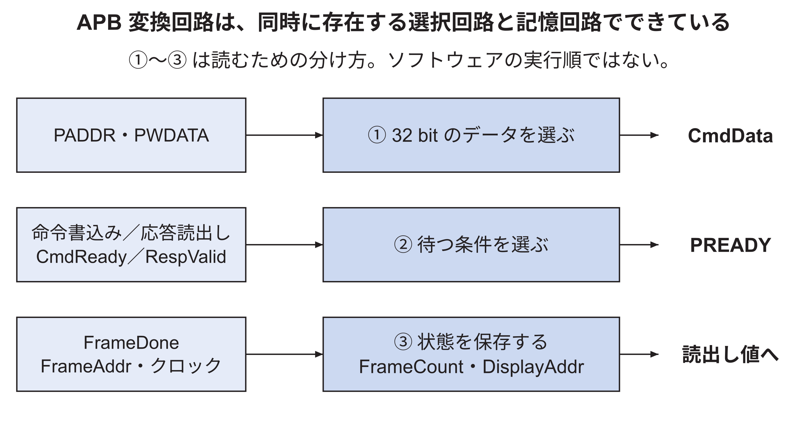

三つの行は、CPUが上から順に呼び出す三つの関数ではない。FPGA内では、入力に応じた選択回路と、クロックで値を覚える回路が同時に存在する。FrameCountの更新にはクロックが関係する一方、PREADYは現在のアクセス条件と受け側の状態から選ばれる。


<a id="s_G_6"></a>
#### G.6 配線する前に受け渡しの試験を置く

APB回路だけを試す場合、CPU全体やDDR3を用意する必要はない。試験コードがCPU側の信号を代わりに出し、FIFO側のReadyを意図的に止める。これにより、設計した「待つ」条件を短い試験で確認できる。

付属の`tb_apb.sv`は、上半分と下半分の書き込み、FIFO側の待ち、応答読出しの待ち、識別値、完了回数を確認する。例えば下のassertは、受け側を待たせた間、PREADYが上がらず、データも終端の印も維持されることを確かめる。[E1](#ref_E1)

```systemverilog
assert(!Ready && CmdValid && CmdData==expected
       && CmdLast==address[2])
  else $fatal(1,"command changed during backpressure");
```

assertは条件が成立するかを試験中に検査する記述である。失敗すると、ここでは$fatalにより試験を停止する。assertが通ったという結果は、書いた条件と試した入力で成立したことを意味する。例えば部分byte書込みや任意のクロック比を網羅した試験ではないので、試していない性質までこの結果に含めない。

[付録C](#ch_C)のスクリプトを使うと同じ最小試験を実行できる。編集前に保存版が通ることを確認し、自分の実装へ差し替えた後も同じ受信語と回数になるかを見る。この段階を通してから、FIFOや描画器をつなぐと、停止箇所を絞りやすい。

<a id="s_G_7"></a>
#### G.7 命令と応答のクロック境界を作る

`axiscdc.tcl`で生成するFIFOは、データ4 byte、深さ512、非同期クロック、有効なTLASTを持つ。必要な情報は32 bitデータと終端の印なので、byteごとの有効信号TKEEPとTSTRBは使わない。[Console26](#ref_Console26)

```tcl
set_property -dict [list CONFIG.TDATA_NUM_BYTES {4} \
    CONFIG.FIFO_DEPTH {512} CONFIG.IS_ACLK_ASYNC {1} \
    CONFIG.HAS_TLAST {1} CONFIG.HAS_TKEEP {0} \
    CONFIG.HAS_TSTRB {0}] [get_ips $ipName]
```

同じIPの生成結果を、命令用と応答用の二か所に置く。命令用では入口がCPUCLK、出口がDDRCLK、応答用では入口がDDRCLK、出口がCPUCLKとなる。クロックの向きだけでなく、入口側のリセットにどの領域のリセットを渡すかも見る。

FIFOの512という値は、画面の横幅や命令リストの大きさではない。32 bitの語を512個置くため、データ部分だけなら2048 byteであり、別途終端の印なども保持する。C++側で確保する1 MiBのリストは、このFIFOへ一度に丸ごと入る必要はない。受け側が順に消費する間、CPUは空きを待ちながら続きを送る。

<a id="s_G_8"></a>
#### G.8 共有メモリと表示の接続を完成させる

CPU、描画器、表示器がDDR3を使う構成では、CPUの外部メモリ経路を共有接続回路のS00へつなぎ、GPUをS01、表示器をS02へつなぐ。RasterIXの接続を追加した後も、CPUのSD起動や通常のメモリ読書きが必要である。GPUだけがDDR3へつながれば完成、とはならない。

`rasterix.sv`は多数のAXI信号を持つが、最初は五種類のまとまりとして読む。AWが書込み先、Wが書込みデータ、Bが書込み応答、ARが読出し先、Rが読出しデータである。VALIDとREADYが各まとまりの受け渡しを決める。例えばARのアドレスをつないでもRの返り道がなければ、CPUやGPUは読出しを完了できない。

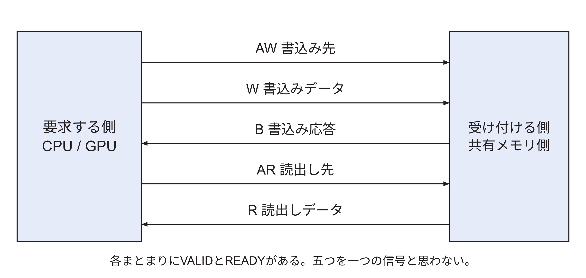

図G.3では一本の矢印に一群の信号をまとめた。AWとWは別のまとまりなので、任意のAXI相手でいつでも同じ周期に受理されるとは限らない。本構成の表示設定の小さな制御接続は、採用したDVI部品の受理方法を前提にしている。汎用のAXI-Lite制御器を新しく設計したと説明するものではない。

表示切り替えは10.5〜[10.6](本文.md#s_10_6)節の約束で組み立てる。特に「FrameDoneをどの条件で出すか」を決めてからソフトウェアの待ち方を実装する。意味が曖昧な完了信号を先に配線すると、ソフトウェアが画面を早く再利用しても、どちら側の設計が誤っているか判断しにくい。

<a id="s_G_9"></a>
#### G.9 ソフトウェアが送る単位と受け側の単位をそろえる

`writeData`のsizeとoffsetはbyte単位で受け取る。一方、内部のバッファはuint32_tの配列なので、offset/4で開始要素を求め、size/4回の書き込みを行う。例えばsize=12、offset=8なら、配列の要素2、3、4を送り、最後の要素4だけをCMD_LASTへ書く。[Console26](#ref_Console26)

| ループ内のi | 読む要素 | 書くレジスタ | その語の意味 |
|---:|---:|---|---|
| 0 | 2 | regs[0] | 通常の語 |
| 1 | 3 | regs[0] | 通常の語 |
| 2 | 4 | regs[1] | 今回の転送の最後 |

最後の語の印は、「一画面の描画がすべて終了した」という印ではない。あくまでライブラリがwriteDataで依頼したこの転送の終端である。画像一枚を作るために複数の転送が行われることもある。

`checkRange`は、バッファ番号が範囲内か、sizeとoffsetが4の倍数か、offsetからsize byteが領域内へ収まるかを調べる。サイズの単位を間違え、12語のつもりでsize=12を渡すと、実際には3語しか送られない。逆にbyte数をさらに4倍すれば、意図した範囲の外まで読んでしまう。送信口を自分で作るときは、単位を関数ごとに書き出す。

図G.4は、offsetが8 byte、sizeが12 byteの場合を線で追ったものである。左の配列では要素[2]から三語を読む。右では最初の二語が同じCMDへ入り、最後の一語だけCMD_LASTへ入る。

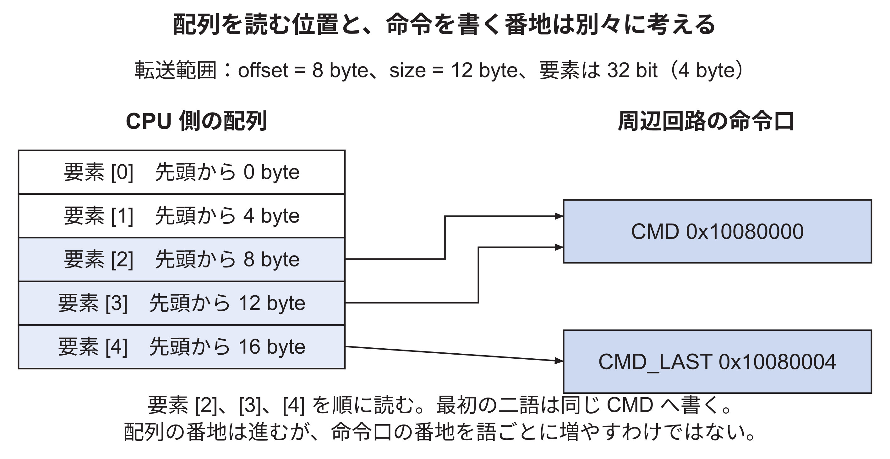

一語ごとに配列の添字が増えるので、転送先の番地も増やすと誤解しやすい。しかしCMDは命令を入れる入口である。先ほど書いた語はFIFOへ進むため、次の語も同じ入口へ書ける。最後の印はこの転送範囲の終わりを示し、一画面の表示完了を表すものではない。


<a id="s_G_10"></a>
#### G.10 ビルドに追加したファイルを読み込ませる

ソースファイルを置いただけではVivadoに読まれない。`wally.tcl`でラッパーRTL、公式RTL、IP、制約、共有メモリの設計を追加する。パッケージ定義を使うSystemVerilogは、定義を先に読み込めるようにコンパイル順序を整える。`include_dirs`は、includeされたファイルを探す場所を指定する。[Console26](#ref_Console26)

公式RasterIXに含まれるAXI用部品と、Wally側の別依存関係にある同名の部品が衝突しないよう、RasterIX由来のファイルはライブラリ`rasterix`へ入れている。これは、描画算法を変更する処理ではなく、Vivadoがどのモジュールを採用するかを整理する処理である。

Makefileでは`nexysvideo-rasterix`が、ボード名、派生構成、RasterIX有効化、必要なIPをそろえて選ぶ。回路の最上位だけ有効にし、IP生成の依存関係を追加し忘れると、モジュールが見つからず生成できない。逆に古いIPが残った場所では、一見通っても別の条件を使っている可能性があるため、14章で示した新規クローンからの再現が役立つ。

<a id="s_G_11"></a>
#### G.11 段階ごとに期待する結果を決める

接続を設計したら、最後にゲーム画面だけを見て終わらせず、段階ごとに確認する。下表の結果は再現時に読者が確かめる項目であり、この原稿改訂で再測定した結果ではない。

| 段階 | 実施する確認 | 成功時に言えること |
|---|---|---|
| 構成を生成 | 展開されたパラメータと読込ファイルを照合 | 意図した回路を生成対象にした |
| APB単体 | 待ち、32 bitレーン、受信回数を試験 | 試験した条件で語を正しく渡した |
| 表示制御単体 | 古い読出しを残してAckを監視 | 試験した条件で早過ぎる完了を出さない |
| 配置配線 | クロック、タイミング、CDC、DRCを確認 | 指定した実装条件の結果を得た |
| 実機起動 | DDR利用、UART、Linux起動 | CPU側の起動経路が動いた |
| 描画と表示 | メモリの画素比較と映像確認 | 計算結果と外部出力を別々に確認した |
| ゲーム | 入力、進行、衝突、終了を確認 | 対象のゲームとして進行した |

各段階の結果を、ソースのコミット、bitstream、dtb、実行ファイルの識別情報と一緒に保存する。古いbitstreamでの成功と、新しいソースの状態を結び付けてしまうと、第三者は同じ結果を作れない。どの設計を確かめたかを残すことも、再現可能な設計の一部になる。

<a id="ch_H"></a>
### 付録H 設定を変えるための計算と設計判断

<a id="s_H_1"></a>
#### H.1 内部作業領域を増やす案を計算する

現在の内部作業領域は2の16乗で65,536画素である。これを2の17乗、131,072画素へ増やす案を考える。307,200画素の画面を収めるために必要な帯は切り上げて3本、各帯は480÷3=160行となる。一帯は102,400画素で、131,072画素に収まる。コネクタのバッファ数は2×3+1=7個になる。

| 項目 | 現構成LG=16 | 検討例LG=17 |
|---|---:|---:|
| 内部作業領域 | 65,536画素 | 131,072画素 |
| 必要な帯数 | 5 | 3 |
| 一帯の高さ | 96行 | 160行 |
| 一帯の画素数 | 61,440 | 102,400 |
| コネクタの1 MiBバッファ | 11個 | 7個 |

この表はコードと寸法から求めた計算値である。内部メモリを増やせばFPGA内の資源が必要になる。命令の準備量が減る可能性があっても、配置配線の混雑や周波数の条件が変わるため、速くなることまではこの表だけで分からない。接続比較版を用いて容量17の回路を実装し、画像と性能を比較した実験結果は30.17節に示す。計算による予想と実機の結果を対応付けて読む。

変更する場合は、RTLの`FRAMEBUFFER_SIZE_IN_PIXEL_LG`とCMakeの`RIX_CORE_FRAMEBUFFER_SIZE_IN_PIXEL_LG`を一致させる。片方だけ変えると、ソフトウェアが一帯に描けると思う画素数と、実際の内部メモリの容量が食い違う。回路生成後にはBRAMの合計、階層別使用量、タイミングを調べ、同じ画像と状態列で速度を比較する。[RasterIX](#ref_RasterIX)[Console26](#ref_Console26)

<a id="s_H_2"></a>
#### H.2 画面の大きさを変えるときの落とし穴

640×480を320×240へ変える案では、76,800画素なのでLG=16の内部作業領域でも2本の帯が必要になる。一帯は120行で38,400画素になる。これだけを計算して「解像度変更は終わり」としてはいけない。描画の寸法、表示回路の寸法、画素クロック、フレームバッファの行の幅、ゲームの座標が一致する必要がある。

例えば表示回路が引き続き一行640画素を読むのに、ソフトウェアが一行320画素分だけ保存すると、表示側は隣の行を続けて読んでしまう。これはGPUの描画速度以前に、メモリ中の画像の並び方が合っていない問題である。

また、公式Dispatcherは高さを帯数で整数除算する。別の解像度を選ぶ場合、最後の帯をどう扱うかを実装から確かめる必要がある。本構成の480行は5で割り切れるが、すべての高さがそうなるわけではない。「画素数が内部容量以下に分割できる」という計算だけでは、すべての行を扱える保証にはならない。[RasterIX](#ref_RasterIX)

図H.1は、横320と640の違いを、見やすい横4と8の違いに置き換えた模式図である。画素の番号0〜7がメモリに順に並ぶ点は同じだが、どこまでを一行と数えるかが異なる。

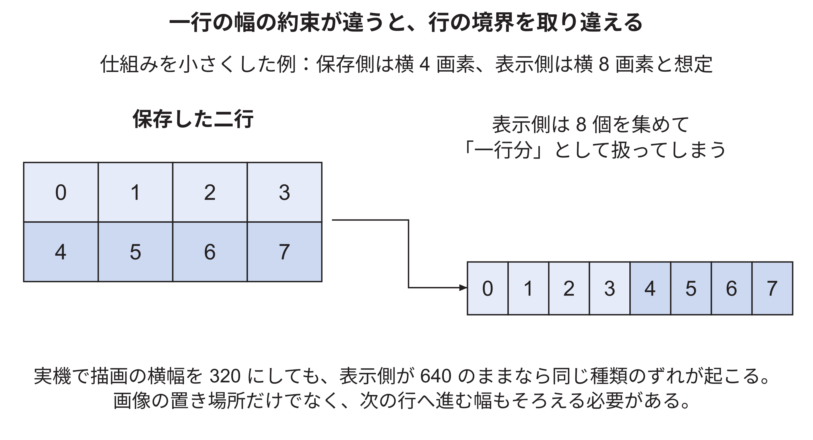

保存側が4画素で次の行へ進んだつもりでも、表示側が8画素を一行として読むと、元の二行を一行につなげてしまう。先頭アドレスが正しくても、行を進める幅が一致しなければ画像は崩れる。このため解像度の変更では、描画側と表示側の両方を確認する。


<a id="s_H_3"></a>
#### H.3 CPUを速くしたいときに一緒に見る場所

CPUを20 MHzから別の周波数へ変える場合、最初に変える対象はMMCMの出力と、そのクロックを使う接続条件である。[6.3](本文.md#s_6_3)節のcreate_clockの例で解析上の周期だけを変えても、基板から来る100 MHzや、CPUへ実際に届くクロックの周期は変わらない。この例のBoardClockという名前を、完成版のXDCに書かれた設定だと解釈しない。本構成の入力クロック制約はClocking Wizardが生成する。実際のクロックを作る設定と、解析へその条件を伝える制約の両方を合わせる必要がある。

さらに、起動用プログラムはSYSTEMCLOCKを使ってUARTやSDの速度を設定する。ここを古い20 MHzのままにすると、回路が動作していてもUARTの通信速度がずれ、文字化けする場合がある。Linuxへ渡すクロック情報、クロック変換IPの条件、CPU領域を含む時間解析もそろえる必要がある。[Console26](#ref_Console26)

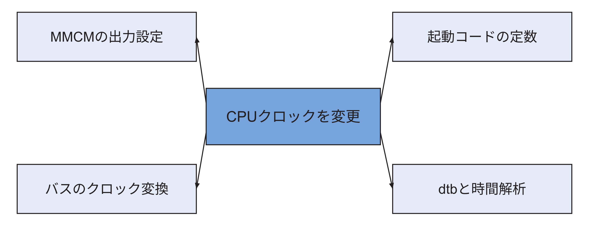

新しい周波数でbitstreamが生成できても、時間条件を満たしたとは限らない。まず負の時間余裕や未制約の経路がないか調べ、その後、起動とゲームを確認する。性能を比較するときは、解像度や描画方式を同じにし、クロックを変えたことでどの処理時間が変わったかを見る。

読み終わったら、次の変更を実行せずに考えてみる。CPUを25 MHzにする場合、Makefileの数字だけでなく、クロック生成、時間条件、UART、時刻計数、DTSをどのようにそろえる必要があるか。実物のメモリ容量を変えないままEXT_MEM_RANGEだけ増やしたら何が起こるか。この二つを理由付きで説明できれば、既存設定の写し方だけでなく、設定同士のつながりを理解できている。

<a id="s_H_4"></a>
#### H.4 アドレスを変える場合の三者の一致

命令ポートの基点を変える場合、回路のEXT_IO_BASE、Linuxへ伝えるdtsのreg、アプリケーションのmmapをそろえる。さらに既存のUARTやSDなどの番地と重ならないか調べる。空いているように見える値を一か所へ書くだけでは、接続先を変更したことにならない。

画像用領域を変える場合は、GRAM_MEMORY_LOC、色・深度・ステンシルのオフセット、予約領域の開始と大きさを対応させる。例えば本設定の色画像の一つは、基点0x9e000000とオフセット0x01e00000を足して0x9fe00000となる。オフセットをすでに物理アドレスだと思って渡すと、基点を二度加えた誤った値になり得る。

| 値の種類 | 現構成の例 | 意味 |
|---|---|---|
| I/Oの物理アドレス | 0x10080000 | 命令レジスタがある場所 |
| GPU用メモリの基点 | 0x9e000000 | 予約領域の開始 |
| 色画像のオフセット | 0x01e00000 | 予約領域の開始からの距離 |
| 色画像の物理アドレス | 0x9fe00000 | CPU側の番地として表す画像位置 |
| DDR3内のオフセット | 0x1fe00000 | DDR3先頭0x80000000からの距離 |

これらの値はすべて「アドレスに関係する数」だが、基準にする開始位置が違う。設計を変更するときは、変数名だけでなく、どこから測った値なのかを式で確認する。

図H.3では、画像Aの物理アドレス0x9fe00000を固定し、二つの先頭からの距離を別々に計算する。下段の値は、画像が二か所に複製されたことを意味しない。同じ場所を異なる基準から数えている。

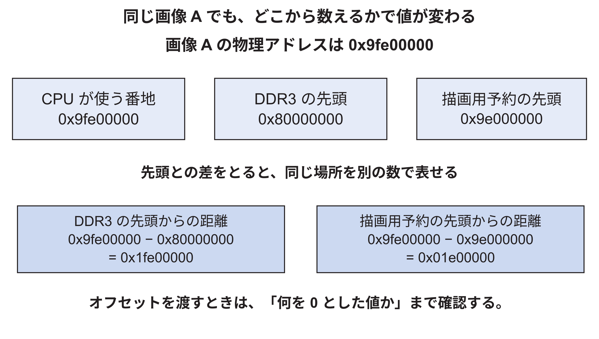

DDR3制御側へ渡す距離なら0x80000000を基準とし、描画用領域の先頭からの画像オフセットなら0x9e000000を基準とする。どちらもオフセットと呼ばれるため、変数名だけで判断せず、何の先頭を加え戻すと物理アドレスになるかを確認する。


<a id="s_H_5"></a>
#### H.5 理解できたかを確認する課題と解答

課題1は、32 bitの最後の一語を送るとき、regsの添字と物理アドレスを答えることである。解答は添字1、0x10080004である。根拠は、uint32_t一要素が4 byteで、CMD_LASTが+0x04だからである。CPU自体が64 bitだから添字を8倍する、という計算はしない。

課題2は、FIFOが3クロック満杯で、4番目の立ち上がりで空いた場合、受け取る語数を答えることである。解答は1語である。最初の3回はValidが1でもReadyが0なので受理しない。4回目に両方1となって初めて受理する。同じ語を4回送ったとは数えない。

課題3は、幅640のRGB565画像で(x,y)=(3,2)の画素の位置を計算することである。先頭からの画素番号は2×640+3=1283、byteのオフセットは2566=0x0a06である。画面Aなら0x9fe00a06から2 byteを使う。横座標と縦座標を逆にすると、別の行の画素を書いてしまう。

課題4は、完了回数を読む値が42で、新しい切り替え後に43になったとき、何が分かったかを説明することである。解答は、回路で定めた切り替え完了が一回通知された、である。画像の全画素が正しいことや、ディスプレイの描画が終了したことまでは、この値だけでは分からない。

課題5は、古いボールを黒で消したときに文字の一部まで消えた場合、どの処理を確認するかを答えることである。解答は、変更領域に重なる文字も描き直し対象へ含めたか、元の描画順を守ったか、対象バッファに対応する履歴を使ったか、である。新しいボールだけを描けばよいという方法では、消した文字は復元されない。

課題6は、CPUを速くした後にUARTが文字化けした場合、何を疑うかを答えることである。解答の一つは、起動コードやLinuxが計算に使うクロック値と、実際のCPUクロックが合っていない可能性である。ただし配線や端末設定でも文字化けするため、これだけを原因と断定せず、変更前後の条件を照合する。

答えの数値だけでなく、その値を確認するファイルと信号を指せるかを確かめる。分からなかった項目は、[第7章](本文.md#ch_7)、10章、11章、14章と[付録G](#ch_G)へ戻る。単語を言えることより、どこで値が変わり、どこで受け渡しが完了するかを追えることが、同じ接続を設計するための理解になる。

<a id="ch_I"></a>
### 付録I 命令の受け渡しとクロック境界を設計する

この付録では、CPUの一回の書き込みを出発点にして、APB、AXI4-Stream、FIFO、非同期FIFOの関係を説明する。到達点は、名前を覚えることではなく、配線を変えたときに「どの条件を保たなければ命令を失うか」を説明できることである。本文7章の概要から入り、[I.1](#s_I_1)〜[I.8](#s_I_8)で動作を追い、[I.9](#s_I_9)以降で採用理由と確認方法を検討する。

<a id="s_I_1"></a>
#### I.1 まず保存する場所と接続の約束を分ける

まず、描画命令の三語D0、D1、D2が、CPUの使うメモリに並んでいる場面を考える。CPUはD0を読み、MMIOの命令口へ書く。接続回路はその書き込みをFIFOへ渡す。D0はそこで一時的に保存され、FIFOの出口からRasterIXへ渡る。次にD1、D2も同じ道を進む。ここでD0などは、具体的な命令値を省いて順番だけを表す名前である。

この道の途中で、CPUが使うメモリの保存場所をコマンドバッファ、回路側の順序付きの保存場所をFIFOと呼んでいる。APBやAXI4-Streamは保存場所の名前ではなく、その場所の間で語を渡す規則の名前である。まず、保存する物と、渡すための信号を分けて読めばよい。

CPUのメモリにある命令バッファ、CPUとRasterIXの間にあるFIFO、RasterIX内部の画素用作業領域は、どれもデータを保存するが、同じものではない。命令バッファには、CPUが用意した描き方の数値列が入る。FIFOには、CPUが送信した数値列のうち、まだ次へ渡していない語が入る。画素用作業領域には、描画処理によって計算した色などが入る。

一方、APBとAXI4-Streamは保存場所の名前ではない。「どの信号を出し、どの瞬間に一回の受け渡しが成立するか」という接続の約束である。箱をFIFO、箱の入口と出口で使う受け渡し方法をAXI4-Streamと考えると、同じ経路に両方の名前が出ても矛盾しない。


図I.1の黒い矢印は命令データが進む向き、青い矢印は受け取り可否が戻る向きである。淡い青の領域はCPUCLKで動く部分、中間の青の領域はDDRCLKで動く部分を表す。色の違いは速い回路と遅い回路の優劣ではない。どのクロックの立ち上がりで受け渡しを数えるかが違うことを表している。

Wallyの既存のバス変換を経て、CPUの要求はAPBで`rasterix_apb`へ届く。この追加回路が、番地と書き込みデータをAXI4-Streamのデータ・有効・終端へ変換する。FIFOを出た先は、公式RasterIXの命令入力である。RasterIXがDDR3へ画像を書き出すAXIメモリ接続は、図の命令の道とは別に存在する。

<a id="s_I_2"></a>
#### I.2 一語と一命令と一枚の画像は大きさが違う

この接続の一語は32 bit、すなわち4 byteである。一回の書き込みは、その一語を運ぶ。一つの描画操作を指定するために必要な語数は操作により異なる。一語を受け取ったから一個の図形を描き終えた、とは限らない。さらに、一個の図形を描くと多数の画素が変わる。

説明用に、命令列がA、B、Cという三語からなる場合を考える。Aなどの文字は32 bitの値に付けた名前であり、実機に送れる命令コードではない。CPUはメモリからAを読み、命令レジスタへ書く。次にBを読み書きし、最後のCは終端用レジスタへ書く。三語は順にFIFOへ入る。受け側は同じ順で取り出し、意味を解釈する。

`WallyBusConnector.hpp`の`writeData`は、この読み出しと書き込みをループで行う。CPUが完成済みの命令列を送る区間と、描く図形から命令列を作る区間は別である。本研究のプログラムは`NoThreadRunner`を使うため、「CPUが常に次フレームの命令を作りながら前フレームを描いている」とは説明しない。回路の並行動作と、プログラムの実行順は分けて確認する。

<a id="s_I_3"></a>
#### I.3 APBで一回の書き込みが終わる瞬間

APBでは、最初に対象回路、番地、書き込みデータを提示する準備段階がある。その後、`PENABLE`を1にするアクセス段階へ進む。アクセス段階で対象が選ばれ、`PREADY`も1になったクロックの立ち上がりで、その転送が成立する。`PREADY`が0なら、送り手は同じ要求を保って待つ。

今回の変換回路は、命令への書き込み中、FIFOの`CmdReady`を`PREADY`へ返す。したがってCPUに「書き込みが終わった」と返す瞬間と、FIFOがその一語を受け取る瞬間が対応する。受け取っていないのに完了を返すと、その語を失う。受け取った後も同じ転送を何回も成立させると、語が重複する。この対応を守ることが変換回路の重要な役割である。

`CmdValid`は、有効な命令書き込みのアクセス段階で1になる。待っている間も1のままでよい。1である時間の長さだけで受け取った回数を決めるのではなく、次節の成立条件で数えるからである。APB試験では、`CmdReady`を意図的に0にしてもデータと終端が保たれることを確認している。

<a id="s_I_4"></a>
#### I.4 AXI4-Streamでは有効と受取可の両方を見る

AXI4-Streamのこの接続では、データを`TDATA`、有効を`TVALID`、受取可を`TREADY`、列の終端を`TLAST`で表す。送り手はデータを用意したら有効を1にし、受け渡しが成立するまでデータと終端を保持する。受け手は、受け取れるときに受取可を1にする。[AMDAXI](#ref_AMDAXI)

同じクロックの立ち上がりで、有効と受取可がともに1なら一語を渡す。片方が0なら渡さない。例えば下表で、Bを提示する時間は長いが、Bの転送回数は一回である。次の立ち上がりに別の語を用意し、有効と受取可が1なら、続けて別の一語を渡せる。

| 立ち上がり | データ | 有効 | 受取可 | この瞬間に渡る語 |
|---|---|---:|---:|---|
| 1 | A | 1 | 1 | A |
| 2 | B | 1 | 0 | なし |
| 3 | B | 1 | 0 | なし |
| 4 | B | 1 | 1 | B |
| 5 | C | 1 | 1 | C |

この表は受け渡し規則を説明する例であり、実機波形を測定した表ではない。また、FIFOの入口で成立した転送と出口で成立した転送は別々に数える。入口で受け取ったBが、同じ瞬間に出口からも出るとは限らない。

<a id="s_I_5"></a>
#### I.5 FIFOの出口が止まっても入口はすぐには止まらない

FIFOは、先に入れた語から取り出す記憶回路である。説明用に四語入るFIFOを考える。中にAとBがあり、RasterIX側が受け取りを止めると、Aを出口に提示したまま保持する。その間も空きがあればCとDを入口から受け取れる。四語とも埋まった後でEを入れようとすると、入口側も受取可を0にする。

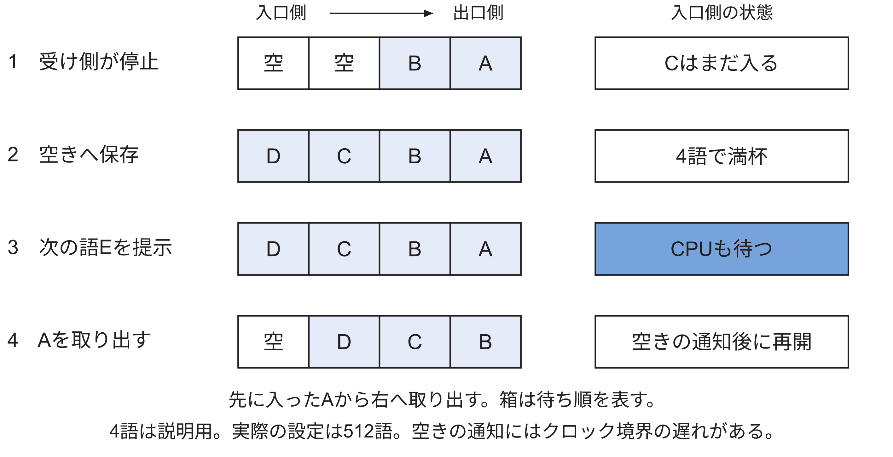

図I.2では、右端が次に取り出す語である。箱は待ち順を表す。描画回路の停止、FIFOの空き、CPUが待つ時点を分けた。実機の設定は512語である。四語という数は動きを図に収めるために選んだ。描画回路が再びAを受け取ると、空きが増える。ただし非同期FIFOでは、その空きの情報が入口側に伝わるまで時間があるため、CPUが同じ瞬間に再開するとは限らない。

受け手から送り手へ、受け取れないことを伝えて止める仕組みをバックプレッシャーと呼ぶ。この仕組みがあれば、受け手が一時停止しても保存容量を超えて書き込まない。永久に停止した場合は永久に処理が進まない可能性が残る。データを失わないことと、必ず有限時間で完了することは別の性質である。

<a id="s_I_6"></a>
#### I.6 20 MHzと100 MHzだけでは処理の速さを比べられない

20 MHzのクロックは50 nsに一回、100 MHzのクロックは10 nsに一回立ち上がる。しかしCPUが一周期ごとにAPBへ新しい一語を書けるわけではない。メモリから値を読み、番地を計算し、繰り返し条件を調べ、バス転送を行う。キャッシュ、命令の依存、バスの待ちも関係する。

描画回路についても、一周期ごとに一枚の画像を描き終えるわけではない。例えば画像を一色で消去する仕事は、短い指示で多数の画素を書き換える。説明用に一周期に一画素を処理する回路を考えると、64画素を塗るには64周期分の仕事になる。この64周期はRasterIXの実測値でも、その実装の正確な周期数でもない。「短い指示に長い仕事が対応し得る」ことを示すための例である。

したがって、CPUの方が低い周波数だから受取可を無視できる、とは言えない。反対に、この説明だけでCPUが実際にFIFOを満杯にした、とも言えない。初期の記録E1〜E5には、実機のFIFO入口で待たされた時間の計測はなかった。追加実験E6では、命令書き込み中に入口の受取可が0だった周期を数え、16語と512語の両方で待ちを確認した。全占有量の時系列や、内部の停止原因ごとの時間は未計測である。この一般説明だけから満杯を想像することと、E6の実測結果を使うことを区別する。

<a id="s_I_7"></a>
#### I.7 公式RasterIXに受け取りを止める処理がある

固定した公式版の`CommandParser.v`には、フレームバッファ操作を受けた際に受取可を0にし、`WAIT_FOR_IDLE`という状態へ移る処理がある。その状態では、描画処理、フレームバッファ、テクスチャ処理などが完了したかを調べてから先へ進む。`InternalFramebufferCommandHandler.v`の消去処理も、対象アドレスを進めながら作業する。[RasterIX](#ref_RasterIX)

これは「遅いかもしれない」という推測だけで作った根拠ではない。公式回路に停止条件があることをソースで確認した根拠である。ただし、このパーサの前には別の処理や保持段もある。パーサの受取可が0になった同じ周期に、最上位の命令入力やCPUまで必ず止まる、という意味ではない。停止は途中の空きと制御に応じて伝わる。

読み直すときは、公式版`9fdcf97a31b2e4247594e06d605871980cd5e9e1`の`rtl/RasterIX/CommandParser.v`で`OP_FRAMEBUFFER`、`WAIT_FOR_IDLE`、`s_cmd_axis_tready`を検索する。その後、`RasterIX_IF.v`と`FrameStreamingCore.v`で、最上位の命令入力からパーサへ至る接続を追う。停止条件の存在、外部へ伝わる時刻、CPUの実測待ち時間を、別々の問いとして扱う。

<a id="s_I_8"></a>
#### I.8 同期FIFOは一つの時計で入口と出口を管理する

例えば入口からAを入れ、出口から前の語を出す処理を、すべて同じクロックの立ち上がりで決める。こうして入った数と出た数が分かれば、いま何語残っているかも更新できる。これが同期FIFOの基本である。

入口だけが別の時計で勝手に書き始めると、管理側の立ち上がりの間に何が起きたかを、そのままでは同じ規則で数えられない。非同期FIFOでは、入口側と出口側がそれぞれ数を管理し、相手の進み具合を安全に受け取る仕組みを加える。単に保存領域を二つの時計へ配線する、という違いではない。

回路の時計であるクロックは、値を記憶するタイミングを決める。同期FIFOは、入口で語を保存する処理と、出口で語を取り出す処理を、同じクロックで管理する。書いた位置と読んだ位置を同じ時計で比べられるので、空きや残りを決めやすい。

非同期FIFOは、入口を動かすクロックと出口を動かすクロックが別々でよいFIFOである。CPU側はCPUCLKの立ち上がりで一語を渡し、RasterIX側はDDRCLKの立ち上がりで一語を取り出す。二つの立ち上がりがいつ重なるかに依存せず、語の順番を保つように管理する。


「非同期」は、回路が時計を使わないという意味ではない。両側はそれぞれ自分の時計で動く。「FIFO」は保存の順序を表し、「同期・非同期」は入口と出口の時計の扱いを表す。保存容量を大きくしても、一つの時計用に作られた管理回路が自動的に二つの時計へ対応するわけではない。

<a id="s_I_9"></a>
#### I.9 遅い側の信号を速い側へ直結すると何が足りないか

ここでは、誤った接続を説明用に考える。CPUの一周期だけ1になる書き込み許可信号を、100 MHzで動く回路の書き込み許可信号へ、そのままつなぐ。CPUの一周期は50 nsあり、その間に100 MHz側には複数の立ち上がりが来る。受け側が各立ち上がりで書けば、同じ語を複数回保存してしまい得る。

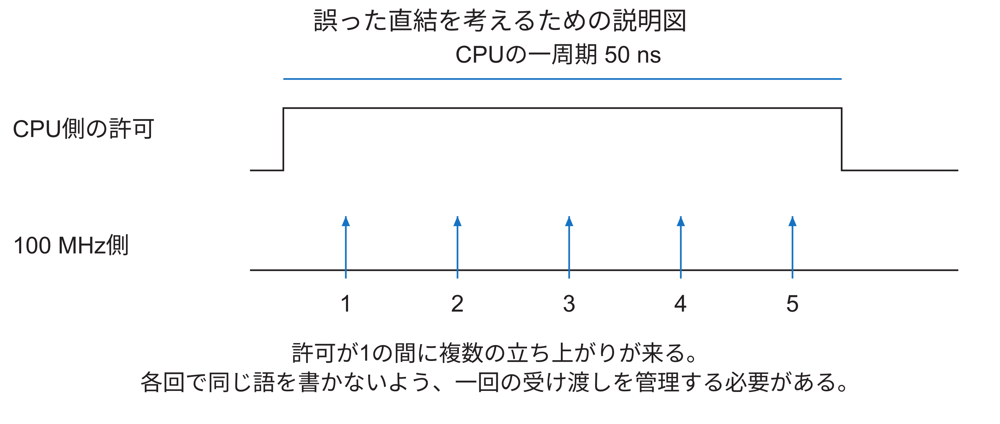

図I.4は、CPU側の一周期分の幅に、高速側の複数の立ち上がりが入る模式図である。実際のAPB要求をこの図のように直結しているわけではなく、図の失敗を実機で観測したわけでもない。直結する場合には「一回だけ」を保証する追加の受け渡し制御が必要だと分かる例である。

もう一つの問題は、データが変わる瞬間と受け取る瞬間が近い場合である。レジスタには、立ち上がりの前後に入力を安定させておく時間条件がある。その条件を守れないと、出力がどちらの値に決まるか遅れることがある。これをメタステーブル状態という。低速側は変更回数が少なくても、変更する瞬間が高速側の立ち上がりに近付かない保証にはならない。

<a id="s_I_10"></a>
#### I.10 一ビットを二段で受けるだけでは一語を守れない

一ビットの状態を別クロックへ伝えるとき、受け側に二段以上のレジスタを置く方法がある。最初の段が不安定になった場合にも、次の段が取り込むまでに落ち着く時間を設ける。失敗確率を十分小さくするための設計であり、物理的な不安定さを数学的にゼロにする操作ではない。

32 bitのデータすべてへ独立に同じ二段を置くだけでは、語のまとまりは保証できない。説明用に二ビットを01から10へ変える場合、二本が同時に受け側へ反映されなければ、途中で00や11に見えることがある。各ビットが最終的に正しい値へ落ち着くことと、同じ更新に属する二ビットをまとめて読むことは別である。

したがって、まとまった語では「値を安定に保存してから、その語が利用可能だと知らせる」方法が必要になる。非同期FIFOは、そのような管理を連続する多数の語に対して行う部品である。一つの値だけを、返事が来るまで保持して渡すハンドシェイクも別の選択肢になる。

<a id="s_I_11"></a>
#### I.11 非同期FIFOは何を同期するのか

入口側の係が保存場所0へAを書き、出口側の係がそのAを読む、と考える。出口側が必要なのは「入口の時計と同じ速さで動くこと」ではなく、「場所0のAは書き終わっていて、読んでよい」と知ることである。入口側が次に場所0を使い直すには、「出口側はAを読み終わった」と知る必要がある。

この二つの通知が逆向きに進む。書込み済みの位置は入口から出口へ、読出し済みの位置は出口から入口へ伝える。データの各ビットを別々に届いたことにする代わりに、保存を終えたまとまりを読めるよう管理する。以下の模式図では、この管理情報とデータ本体を別の矢印で示す。

理解用に四つの保存位置0〜3を描く。入口側は次に書く位置を覚え、出口側は次に読む位置を覚える。入口側でAを書き終えた後、その進み具合を出口側へ安全に知らせる。出口側はAが利用可能だと認識してから読む。読んだ位置の進み具合も入口側へ戻し、上書きしてよい場所を判断する。


図I.5は一般的な非同期FIFOを理解する模式図であり、使用したAMD IPの内部回路をすべて再現した図ではない。データを保存する記憶部と、書き込み・読み出しの進み具合を交換する管理部がある、と分けて読む。今回、これらを自作したのではなく、AMDのAXI4-Stream Data FIFOを利用した。[AMD085](#ref_AMD085)

一般的な実装では、位置情報をグレイ符号へ変換して同期する方法が使われる。例えば二ビットの順序を00、01、11、10とすれば、隣へ進むときに変わるのは一ビットである。普通の二進数01から10では二ビットが変わるため、位置情報をそのまま別クロックで受ける問題を避ける工夫である。ただしグレイ符号にしただけで配線条件や同期回路が不要になるわけではない。[AMDGray](#ref_AMDGray)

入口が一語を書いてから、出口が利用可能と認識するまでには遅れがある。出口が読んで空きを作ってから、入口が空きを認識するまでにも遅れがある。そのため、一瞬だけ空きの利用を待つことはある。これはクロックを同じ位相へそろえた結果ではなく、違う時計のまま安全に情報を渡した結果である。

<a id="h1137"></a>
##### 保存位置が一周したときの空と満杯

四つの保存位置では、0、1、2、3まで書くと、次の位置は0へ戻る。このように同じ場所を順に使い回す。空のときに書く位置も読む位置も0であり、まだ一語も読まないまま四語を書いた後も、位置だけなら両方0に見える。位置番号だけでは、空と満杯を区別できないのである。

そのため、一般的な管理では一周したことを区別する情報も持つ。説明用に、リセットから何語書いたかと何語読んだかを数えると、差が保存中の語数になる。実回路のカウンタは有限の幅なので、周回を含めて比較できる幅と方法が必要になる。表では分かりやすく総数を用い、AMD IPの内部信号名としては扱わない。

| 操作の後 | 書いた総数 | 読んだ総数 | 保存中の語数 |
|---|---:|---:|---:|
| 初期状態 | 0 | 0 | 0 |
| A、Bを書く | 2 | 0 | 2 |
| C、Dも書く | 4 | 0 | 4 |
| Aを読む | 4 | 1 | 3 |
| 空いた位置へEを書く | 5 | 1 | 4 |

実際の非同期FIFOでは、入口が読む側の最新の総数を直ちに知ることはできない。逆も同じである。この表の差を、二つのクロックの信号へ直接組合せ回路で計算すればよいわけではない。相手の進み具合を安全に受け取ってから、書いてよいか、読んでよいかを各側で判断する点が重要になる。

<a id="s_I_12"></a>
#### I.12 周波数が違えば非同期FIFOだけが正解なのか

周波数の違いだけで、非同期FIFOが唯一の解になるわけではない。同じクロックから作った整数比のクロックで、立ち上がりの関係を設計上保証し、タイミング制約も与えられる場合は、同期式のクロック変換を使える。AMDのPG085も、位相がそろった整数比の条件で同期式の変換を説明している。[AMD085](#ref_AMD085)

逆に、二つの発振器がどちらも100 MHzという仕様であっても、立ち上がりの位置やわずかな周波数差を管理できなければ、同じクロックとして扱えない。必要なのは周波数の数値だけでなく、どの信号を、どの時間関係を前提として受け渡すかである。

今回のCPUCLKはClocking Wizardの出力、DDRCLKはMIGの`ui_clk`である。どちらも基板のクロック生成系に属するので、「物理的に無関係な二つの発振器」とは説明しない。`axiscdc.tcl`はこの接続を`IS_ACLK_ASYNC=1`で生成しており、命令の受け渡しでは特定の位相関係を前提としない構成を採っている。同期式へ変えられるかを調べるなら、両クロックの生成、位相関係、IPの対応条件、経路の時間条件をまとめて確認する必要がある。

<a id="s_I_13"></a>
#### I.13 実装した設定を一行ずつ読む

次は保存した`fpga/generator/axiscdc.tcl`の設定と同じ値である。見やすく改行している。この設定からVivadoがIPを生成し、`rasterix.sv`が生成された回路を接続する。

```tcl
create_ip -name axis_data_fifo -vendor xilinx.com \
    -library ip -module_name axiscdc
set_property -dict [list \
    CONFIG.TDATA_NUM_BYTES {4} \
    CONFIG.FIFO_DEPTH {512} \
    CONFIG.IS_ACLK_ASYNC {1} \
    CONFIG.HAS_TLAST {1} \
    CONFIG.HAS_TKEEP {0} \
    CONFIG.HAS_TSTRB {0}] [get_ips axiscdc]
```

4 byteは一語のデータ幅である。512は保存できる語数で、データだけなら512×4=2,048 byteとなる。実際の回路には終端や管理の情報もあるため、これをIP全体の物理メモリ使用量と同一視しない。非同期を1にして二つのクロックを用い、`TLAST`も各語と一緒に保存する。`TKEEP`と`TSTRB`は、このストリームでは使わない。APB側の`PSTRB`まで存在しないという意味ではない。

命令用のインスタンスでは入口がCPUCLK、出口がDDRCLKである。応答用では逆になる。逆方向もFIFOを置くのは、CPUが応答を読む時点とRasterIXが応答を出せる時点を、それぞれの時計で扱うためである。FIFOにデータだけを入れて終端を別に直結すると、データと終端の対応が崩れ得るため、一緒に運ぶ設定が必要になる。

<a id="s_I_14"></a>
#### I.14 容量512語とFIFOそのものの採用理由を分ける

公式RasterIXのNexys Video用接続例にも、命令入力の前へ深さ512のAXI4-Stream FIFOを置いた構成がある。ただし、その例は同じクロックで接続されている。公式の例にFIFOがある事実と、今回二つのクロック間に非同期FIFOを置いた判断は分けて説明する。公式例の存在だけでは、本研究の512語が最適だとは言えない。

容量を考えるときには、一時的な到着量と処理量の差を見る。説明用に受け取りが停止した間に10語が到着し、そこに6語の空きしかなければ、6語を入れた後は送り手を待たせる。正しい待ち制御があれば、容量を超える4語を捨てる必要はない。容量が大きいほど待ちを吸収できる場面は増えるが、回路資源を使い、設計によっては遅延も変わる。

定常的に到着する方が処理より速ければ、有限のFIFOはいずれ満杯になる。大きくすることは根本の処理能力を増やすことと同じではない。今回の512語は当初の採用値であり、E6で16語と1語方式を比較して維持を判断した。最大占有量や中間容量まで調べて決めた最適値という主張はしない。FIFOを採用すること、正しく止めること、容量を最適化することは、それぞれ違う設計・評価の問題である。

<a id="s_I_15"></a>
#### I.15 同じ機能を作る別の方法と比べる

| 方法 | 必要な仕組み | 主な性質 |
|---|---|---|
| 二つのクロックを同じにする | 回路全体の周波数と時間条件の再検討 | この境界のCDCは消せるが他の条件が変わる |
| 一語ずつ保持して返事を待つ | データ保持と要求・応答の同期 | 構造を追いやすいが往復を待つ |
| 同期FIFOと別の変換回路 | FIFOの外で安全なクロック変換 | 同期FIFOだけでは境界は解決しない |
| 非同期FIFO | 二つの時計と正しいリセット・制約 | 複数語を保存しながら境界を渡せる |

今回の非同期FIFOは、既存IPで順序を保つ受け渡しと二つのクロックへの対応をまとめて得られる選択である。この表は設計候補の整理である。そのうち、1語ずつ保持する4相方式と、16語・512語の非同期FIFOについては、E6で同条件の実装比較を追加した。比較していない候補まで含めて「これが最も小さく速い」とは主張しない。

<a id="s_I_16"></a>
#### I.16 ソースで分かることと実験で確かめること

| 問い | 現在の根拠 | ここからは言えないこと |
|---|---|---|
| CPU側がAPBなのか | `rasterix_apb.sv`の信号と接続 | 外側までAPBで統一されているとは限らない |
| FIFOが非同期設定なのか | `axiscdc.tcl`と二つのクロック配線 | 設定だけで全接続の安全が証明されたとは言えない |
| 受け側が停止する設計なのか | 公式CommandParserの状態と条件。E6ではCPU入口の待ちも実測 | パーサ単体の停止時間や全占有量の時系列 |
| APBが待ちを正しく返すか | E1の変換回路試験と、E6の実IPを含む接続試験 | 任意のクロックやリセットに対する網羅的保証 |
| 512語が必要十分なのか | E6で1語方式・16語・512語を比較 | 未比較の容量や方式まで含む最適性 |

E1のAPB試験は、FIFOから来るはずの`CmdReady`を試験側で操作する。実際の非同期FIFOを満杯にしているのではない。変換回路の試験と、生成IPを含むクロック境界全体の試験を同じものとして記述しない。配置配線後のCDCレポートも、検出した構造を調べる根拠であって、任意の動作について命令の順序と内容が必ず正しいという万能の証明ではない。

<a id="s_I_17"></a>
#### I.17 接続を変更するなら何を試すか

今後FIFOの容量や方式を変更する場合には、実IPを含めた試験で、入力として受理された語と出力として受理された語をそれぞれ記録する。入力側では`valid && ready`の瞬間だけ一覧へ追加する。出力側でも同じ条件の瞬間だけ比較し、順序、内容、終端の一致を調べる。提示したが受け取られていない語を一覧へ加えてはいけない。

受け側を長く停止させて満杯へ到達させ、満杯中にCPU側が同じ値を保持し、再開後に全語が一回ずつ出ることを確認する。時計の開始位相をずらす、異なる周波数の組を使う、空と満杯の境界を何度も通る、といった条件を与える。リセット中の語は別扱いにし、リセットをまたいだ保存を契約していないなら、破棄する範囲を決めてから比較する。

この方針に基づき、E6では1語方式の単体試験、生成したAMD FIFOを含む順序・停止・リセット試験、実機の画像・時間・資源比較を追加した。実施した条件は[技術付録第29章](#ch_29)と保存ログに示す。全占有量の時系列やすべての容量を試したわけではない。今後さらに小さいFIFOで同じ性能を得られると主張する場合には、その容量の回路を作り、同じ条件で正しさと性能を確かめる必要がある。

通常のRTLシミュレーションは0と1の動きを扱うため、実際のレジスタのアナログ的な不安定さをそのまま再現するわけではない。シミュレーションで順序と停止・再開を調べ、CDC解析で受け渡し構造を調べ、タイミング解析とIPの制約で物理的な時間条件を調べる。それぞれ違う種類の誤りを探しているため、一つの試験の成功だけで他を省略しない。

<a id="s_I_18"></a>
#### I.18 自分の言葉で採用理由を説明する

「CPUが20 MHzだからGPUより速くデータを作る」と説明する必要はない。今回の理由は、「APBの書き込みを公式RasterIXの命令ストリームへ変換し、CPUCLKからDDRCLKへ一語ずつ順序を保って渡すため、非同期FIFOを使った。受取可が0のときは受け渡しを成立させず、FIFOも満杯ならAPBを待たせる」である。さらに現在は、「同じクロック条件で1語方式と16語FIFOも比べ、512語FIFOでCPUの送信待ちを減らせた。追加資源が小さかったため維持した」と、E6の結果を添えて説明できる。

この説明ができた後、別の設計を考える練習をする。例えば、FIFOを100 MHzだけの同期FIFOに交換すると何が足りなくなるか。答えは、CPUCLK側の一回を出口側の一回へ正しく対応付けるクロック変換である。保存容量を増やすだけでは補えない。逆に、両側を本当に同じクロックで動かす構成へ変えたなら、同じ理由で非同期FIFOが必須とは言えない。

<a id="ch_J"></a>
### 付録J 設計を変更できる理解へ進む

この付録は、各部品の名前を知った後に、ゲーム機全体をどう設計し、どこを確かめるかを説明する。専門家が設計を検討するときには、正常に動く一例だけでなく、停止、再起動、設定変更の条件も扱う。ここでいう理解の目標は、本構成の入力、出力、状態、所有者、完了条件を示し、変更によって影響する場所と確認方法を選べることである。CPU全命令やDDR3 PHYの内部を一から設計する知識まで、このゲーム機の再現に必須とするわけではない。

<a id="s_J_1"></a>
#### J.1 部品の仕様から接続で守る条件を取り出す

部品Aの出力を部品Bの入力につなぐ前に、「何が運ばれるか」「何bitか」「どの時計か」「どの条件で受け取ったことになるか」「止められるか」「リセットすると何を失うか」を書き出す。線の名前だけが似ていても、この六点が一致しなければ、そのまま接続できるとは限らない。

例えばCPUのAPB書き込みは、番地を伴う操作である。一方、RasterIXの命令入力は語の列を受け取る。ここには形式の変換が必要である。さらに両者の時計も違うため、形式を変換しただけでは接続は完成しない。このように、互換でない点を一つずつ埋めると、追加した回路の理由を説明できる。

| 境界 | 運ぶもの | 守るべき条件 | 実装を読む入口 |
|---|---|---|---|
| CPUから命令入口 | 32 bitの命令語 | 一回の書き込みと一回の受理の一致 | `rasterix_apb.sv` |
| CPUCLKからDDRCLK | 命令語と終端 | 順序とまとまりの保持 | `axiscdc.tcl` |
| 描画から表示 | 画像の物理番地 | 古い画像の読出し完了まで再利用しない | `rasterixdisplay.sv` |
| OSと描画用メモリ | 利用できる番地範囲 | OSが画像を別用途へ割り当てない | デバイスツリーと`RenderConfigs.hpp` |

<a id="s_J_2"></a>
#### J.2 クロックとリセットは別々の仕事をする

クロックは状態を更新する時刻を決め、リセットは状態を出発点へ戻す。例えばFIFOがどこまで書かれたか、表示がどの画像を読んでいるかは状態である。リセットを解除しても、DDR3に以前保存した画像の全画素が自動で消えるとは限らない。制御用レジスタを初期状態へ戻す処理と、画像の内容を塗り直す処理は別に必要になる。

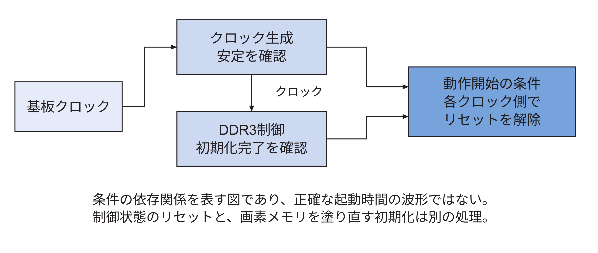

図J.1は起動条件の依存関係である。時間を正確な長さで描いた波形ではない。基板クロックからClocking WizardとDDR3制御を準備し、クロック安定やDDR3初期化完了を見て、利用する回路を動かす。実配線の信号名と極性は本文6.5節にある。`resetn`のような名前の末尾のnは、0でリセットとなる信号を読む手掛かりになるが、名前だけで決めず代入式を確認する。

非同期の解除を各クロックへそろえる必要があるのは、同じ状態機械のレジスタの一部だけが先に動き始める状況を避けるためである。また、非同期FIFOを使う場合はIPのリセット仕様も満たす必要がある。片側だけの再起動で途中の語がどう扱われるかを決めずに、一語も失わないことを期待してはいけない。保存したリセット試験が扱った条件と、今後追加する途中リセットの試験は区別する。

<a id="s_J_3"></a>
#### J.3 番地と所有者とキャッシュを三つに分ける

例として、次の画像を置く範囲Bを考える。まず「Bはどの番地からどこまでか」を決めなければ、読書きする場所を指定できない。次に「今は描画回路がBを書いてよいか」を決める必要がある。表示回路がBを読んでいる間なら、番地が正しくても、そのまま書き換えてよいとは限らない。

さらにCPUがBへ何かを書いた場合、その値がCPUのキャッシュだけに残り、別の回路が読むDDR3まで届いているかという問題がある。「場所が正しい」「今そこを使ってよい」「別の回路にも新しい中身が見える」は、それぞれ別に確かめる。ここで所有者という語は、その時点で領域を更新・再利用してよい主体を表し、ファイルの著作権などを意味しない。

同じ番地の数字を使っていても、CPUのプログラムが扱う仮想番地と、外部回路がDDR3へ出す物理番地は別である。`mmap`によってプログラム内に得たポインタを、そのまま描画回路の物理番地として渡せるとは限らない。今回のMMIO入口は物理番地`0x10080000`を対応付け、その対応先へ32 bit単位で書いている。

メモリの所有者も考える。Linuxが通常のプログラムへ自由に配る領域と、描画回路が画像を置く領域が重なると、双方は自分の正しい操作のつもりで相手のデータを壊せる。デバイスツリーで画像用領域を予約するのは、この割り当ての衝突を防ぐためである。

ただし、領域を予約することはキャッシュの内容を一致させることと同じではない。一般にCPUのキャッシュに新しい値が残り、DDR3に古い値が残っていれば、外部回路は古い方を読む可能性がある。その場合は、非キャッシュの対応付け、キャッシュの書き戻し・無効化、ハードウェアの一貫性機構など、構成に合う方法が必要になる。

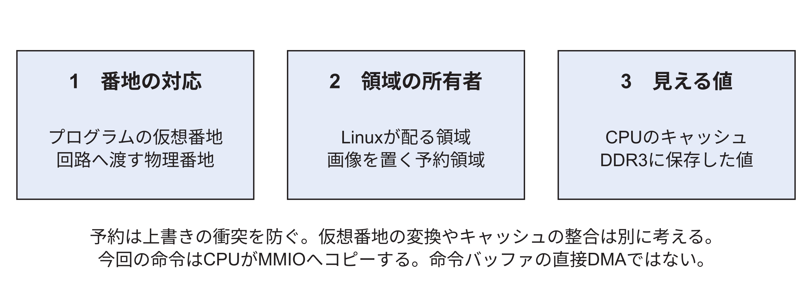

今回の描画命令は、CPUが通常メモリから値を読み出してMMIOへコピーする。RasterIXがCPUの命令バッファを直接DMAで読む方式ではない。この違いがあるため、「命令バッファの番地を教えるだけで送信が終わる」という説明は当てはまらない。もしDMA方式へ変更するなら、番地変換、キャッシュ、バッファの寿命、完了通知を新たに検討する。

<a id="s_J_4"></a>
#### J.4 volatileとfenceだけで描画完了は分からない

`volatile`は、コンパイラに対して、その場所へのアクセスを通常の不要な読み書きのように省略しないことを求めるために使う。`fence`は、CPUのメモリアクセスやI/Oの順序を扱う命令である。どちらも、その先のGPUが全画素を描き終えたことや、ディスプレイが画素を表示したことを直接返す機能ではない。

今回の送信関数は、一語ずつのMMIO書き込みを完了し、その順序を整えてから返る。これにより元の命令バッファの内容を送信用に保持し続ける段階を終えられる。一方、描画回路や表示回路には続きの仕事がある。アプリが次へ進める時点は、表示切り替え完了の回数など、目的に対応した通知で判断する。

この違いを理解すると、「関数が返った」「回路が受け取った」「画像が完成した」「古い画像を再利用できる」「人の目に届いた」を一つの完了へまとめずに説明できる。本文7.11節の表は、この区別を本構成の観測点へ対応させている。

<a id="s_J_5"></a>
#### J.5 メモリ共有では平均帯域と待ち時間を分ける

CPU、描画回路、表示回路はDDR3への要求を共有する。表示回路は、画面を送り続けるために画素を読みたい。描画回路は、新しい画像を書いたりテクスチャを読んだりしたい。CPUは命令やデータを必要とする。接続回路は、同時に来た要求を順に処理できるように調整する。

平均的な転送量がDDR3の能力より小さくても、必要な時刻までに表示用のデータが来なければ困る。例えば、表示用FIFOに十分な画素が蓄えられていれば一時的な待ちを吸収できるが、蓄えが尽きるほど長く待たされると映像の生成に間に合わない。この考え方は命令FIFOと似ているが、表示側には送り出す時刻の制約がある。

本構成の有効な画像だけを60回/秒読み出す量は、640×480×2×60=36,864,000 byte/秒となる。これはRGB565の画素データ量を計算した値であり、実測したDDR3使用帯域ではない。メモリ要求の粒度、空き時間、他の要求、キャッシュ、コマンドの負担を含んでいない。この計算だけで帯域に十分余裕があるとは結論しない。

<a id="s_J_6"></a>
#### J.6 AXIの一件の要求はすぐに一件の応答にならない

メモリへ「この番地から読んでほしい」と伝える時刻と、読んだデータが返る時刻は違う。例えば要求1を受け付けても、DDR3の読出しや他の要求の処理に時間がかかり、返事が後になる。その間に要求2を受け付けることもある。したがって、要求1の受付を見ただけでは、要求1の読出しが終わったとは判断できない。

AXIの読出しでは、番地の要求を受け取った後、データは別の信号で後から返る。一度の要求で複数のデータを返すまとまりをバーストという。最後のデータには`RLAST`が付く。要求が成立した回数から、最後のデータを受け取った回数を引くと、まだ完了していないバーストの数が分かる。

表示先の番地をAからBへ変更しても、既に受け付けられたAへの読出しが残る場合がある。ここで描画側にAを書かせると、表示回路が必要としているAの内容を途中で変えてしまう。従って、設定レジスタを書き換えたことだけでAを再利用してはいけない。

`rasterixdisplay.sv`は未完了の読出しを数え、新しい画像からの読出しを検出した後、その応答まで確認して完了を通知する。これは、接続している表示回路の読出し順序と応答の扱いを前提とする設計である。将来、複数IDで応答順序が変わる構成へ変更するなら、数だけを引き継いでよいか再検討が必要になる。詳細な現在の計算例は本文10.5節と[付録B.5](#s_B_5)にある。

<a id="s_J_7"></a>
#### J.7 表示の通知は一回の要求に一回の返事を対応させる

表示切り替えでは、GPU側が新しい画像の番地を保持し、要求を出す。画素クロック側が要求を受け取り、表示回路へ設定し、必要な読出し完了を待って返事を出す。GPU側が返事を受け取った後に要求を下げ、相手が返事を下げたことを見て次の要求へ進む。

表示変換回路の入力名は`GPUCLK`で、外側から`DDRCLK`を接続している。別の新しい周波数のクロックを作ったという意味ではない。ソースを読むときは、部品の入力名と、その入力へ接続された外側の信号名を区別する。

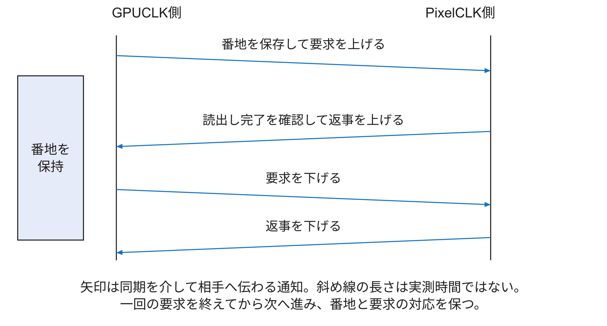

この手順では、番地そのものを毎周期書き換えない。要求を出す前に用意し、相手が受け取って処理を終えるまで保持する。要求や返事の一ビットを同期させる方法と、番地を安定して置いておく方法が組み合わさっている。多ビットのすべてを独立な同期器へ通す方法とは違う。

CPUへ完了を伝える経路では、完了に応じて値を反転させ、CPUCLK側で反転を検出する。速いクロックの一周期だけのパルスを遅い側が見逃す問題を避ける考え方である。ただし、反転方式ならどんな頻度のイベントも無制限に運べるわけではない。受け側が確認する前に二回反転すれば元に戻る。今回の一回ずつ進める切り替えの手順と通知の頻度を併せて考える。

<a id="s_J_8"></a>
#### J.8 描画の速さと映像の速さとゲーム時間を分ける

ボールの位置を60回/秒更新すること、一秒間に58枚の描画を完了すること、表示回路が約60 Hzで信号を送ることは別である。ゲーム状態の更新は位置を計算し、描画はその時点の状態を画素へ変え、表示は完成画像を繰り返し読む。新しい画像が間に合わなければ、表示回路は前の画像を送ることがある。

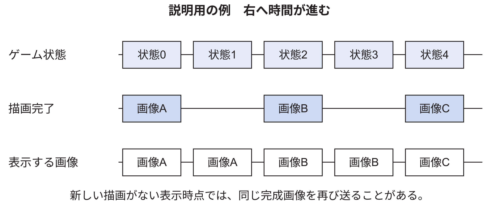

図J.4は関係を示す説明用の時系列であり、保存した映像や実機の波形を写した図ではない。研究の数値を説明する際は、どの列を数えたかを述べる。`FRAME_COUNT`から得た切り替え完了数を、そのまま人の目で数えた異なる画像の数と呼ばない。

部分描画は状態更新を省く操作ではなく、前に残っている画像を利用して、同じ次の画像を少ない書き換えで作る操作である。このため、同じゲーム状態を与える比較と、画像の一致の確認が必要になる。本文11.6節の二枚別の履歴は、描画先ごとに残っている画像を正しく把握するためにある。

<a id="s_J_9"></a>
#### J.9 FPGA資源の余りと動作周波数の余裕は違う

LUTやBRAMの使用率は、使った部品の量である。タイミング余裕は、信号が次の記憶時刻に間に合うかという時間の量である。部品が空いていても、長い配線や複雑な組合せ計算を一周期で通す経路があれば、周波数を上げられない。逆に、レジスタを追加して処理を何段かに分ければ、資源を少し多く使いながら周波数を上げられる場合もある。

ただし段を増やせば、入力から出力までの周期数や、停止したときに保持すべきデータも変わる。回路へレジスタを追加するだけで既存のプロトコルが保たれるとは限らない。変更後に、有効信号、データ、終端が同じ処理に対応して遅れるかを確認する。

タイミングレポートの正の余裕は、指定された制約に対する結果である。解析されていない経路が残っていないか、例外指定が広過ぎないかも読む。特にCDCの経路を時間解析から除外する指定は、安全な受け渡し回路を作る代わりにはならない。今回の保存結果と警告件数は本文13.3節に明示している。

<a id="s_J_10"></a>
#### J.10 起動の失敗をどの層で調べるか

FPGAへbitstreamを書き込めたこと、Wallyが命令を実行できること、Linuxが起動すること、ゲームが命令を送れること、映像が見えることは段階が違う。一番外側の「画面が黒い」だけでは、どの段階が失敗したか決められない。

まず使用したbitstreamとソースの版を一致させ、クロックとリセット、DDR3初期化の条件を見る。次にUARTに起動ログが出るか、Linuxが必要なメモリ範囲を認識しているかを確認する。アプリではMMIOの識別値を読む。ここで期待する値が返らなければ、描く四角形の座標より先に、アドレス判定、ビルド設定、マッピングを調べる。

識別値が読めた後は、小さな既知の画像、表示先の番地、切り替え完了数、映像信号の順に観察する。各段階で入力と期待結果を決めると、別の層の不具合を推測し続けずに済む。詳しいコマンドと成功の判断は[付録M](#ch_M)にある。SDWire3や取り込み機器は実験を助ける道具であり、公開設計の機能とは分ける。

<a id="s_J_11"></a>
#### J.11 計測で原因を絞るとは何をすることか

長い処理区間が見つかっただけでは、その区間の中で何を減らせばよいかは分からない。保存したE5では、まず画像と図形数を保って描画呼び出しのまとめ方を変えた。次に呼び出しのまとまりを固定して図形数を変えた。この二つの操作で、繰り返す呼び出しと、図形に伴う準備量を改善対象として選んだ。

これはCPUのすべての命令の費用を測ったことではない。例えばキャッシュミスの回数を計測していなければ、残りの時間をすべてキャッシュのせいだと決められない。専門的な説明では、測った量、操作した条件、その結果から言える範囲をそろえる。分解していない原因を認めても、得た比較の価値がなくなるわけではない。

結果を再集計する人は、平均の速さだけでなく、対象の状態列、ウォームアップ、試行数、代表値、時間区間の定義を見る。さらに、標準DVI構成と実験用HDMI構成を混ぜない。本文12・13章に方法と結果を分けて示し、[付録C](#ch_C)には再集計へ戻る入口を置いた。

<a id="s_J_12"></a>
#### J.12 設定変更を一つ選び影響を最後まで追う

例えば画像の幅を640から別の値へ変えたい場合、画面上の座標だけを変更して終わらない。一行のbyte数、画素番地、フレームバッファ容量、内部作業領域へ入る行数、帯の数、命令バッファ数、映像のタイミングを順に確認する。幅×高さ×2という計算はRGB565の画像一枚の必要量であり、深度やテクスチャ、管理領域まで含めた総量ではない。

CPU周波数の変更なら、生成クロックだけでなくUARTなどの時間を決める設定、ソフトウェアへ知らせる値、タイミング解析、各クロック間の接続を確認する。MMIO番地の変更なら、CPU側の判定、外部I/Oの属性、ソフトウェアのマッピングをそろえる。[付録H](#ch_H)には現在の値を使った計算がある。

設計を理解できたかは、「どの一行を直すか」だけでなく、「他のどこを合わせ、何を観測すれば誤りを見つけられるか」まで答えて確かめる。これは新しい変更を直ちに実機へ入れる指示ではない。まず固定した動作基準と比較できる別の作業場所で検討する。

<a id="s_J_13"></a>
#### J.13 説明できるかを確認する課題と解答

問1。FIFOが空いているがRasterIXが受取可を0にしたとき、CPUの次の書き込みは必ず止まるか。答えは、必ずは止まらない。FIFOの入口に空きがあり入口側が受取可を返せば、CPUは一語を保存して先へ進める。停止がCPUまで伝わる条件は、出口の停止と入口の空きを分けて考える。

問2。Linux用領域から画像用領域を除外すれば、どんなCPUキャッシュ構成でもGPUに最新値が見えるか。答えは、除外だけでは保証できない。割り当ての衝突と、保存された値の一貫性は別だからである。今回の命令のCPUコピー方式と、将来のDMA方式も分ける。

問3。画像AからBへ表示設定を書き換えた直後、Aへ描画してよいか。答えは、古い読出しが残っていないことを本接続の完了条件で確認する必要がある。設定の変更と要求済みデータの受信は別の時刻に起こる。

問4。LUTが半分近く空いていれば、CPUを二倍の周波数にできるか。答えは、使用率からは判断できない。遅い経路、配線、クロック条件、IPの対応範囲を調べ、変更後の時間解析と動作を確認する。

問5。画素の最終一致が0不一致なら、ゲーム中の全画面を検査済みか。答えは、最終画像だけの比較からは言えない。保存した結果が扱った画像の枚数と時点を述べる。途中の画像すべてについて主張するには、その時点に対応した比較が必要である。

問6。今回の方式が唯一の正解か。答えは、そうではない。CPU直描き、別の転送方式、同期式の変換などの候補はある。本研究の到達点は、採用した方式をソースと動作条件に結び付けて説明し、保存した確認結果の範囲で成立を示すことである。

<a id="ch_N"></a>
### 付録N RasterIXを開発者の視点で読むための地図

<a id="s_N_1"></a>
#### N.1 この付録でいう「開発者並みの理解」

RasterIXの開発者並みに理解するとは、全ソースを暗記することではない。ある画面上の現象から関係する処理段を選び、入力、内部状態、出力をソースで確認し、変更した場合の影響を予測し、試験で確かめられることである。本付録では、少なくとも次の七つを自分で行える状態を目標とする。

| 能力 | できること | 本付録の入口 |
|---|---|---|
| 経路を追う | `glVertex2f`からFramebufferの書込みまで追う | [付録O](#ch_O) |
| 命令を読む | 32 bitの語がどの層の何を意味するか判定する | [付録P](#ch_P) |
| 数式とRTLを結ぶ | 辺関数、増分、固定小数点を信号へ対応させる | [付録Q](#ch_Q)・[付録S](#ch_S) |
| 制御を読む | 状態機械とvalid／readyによる停止を説明する | [付録R](#ch_R) |
| 色の決定を追う | texture、fog、alpha、depth、blendを追う | [付録T](#ch_T)・[付録U](#ch_U) |
| 画像の保存を追う | 内部BRAM、DDR3、表示切替を区別する | [付録V](#ch_V) |
| 安全に変更する | 変更単位、試験、波形、実機確認を選ぶ | [付録W](#ch_W) |

「名前を知っている」だけでは、この目標を満たさない。例えばRasterizerという名前を知るだけでなく、入力される`TriangleDescX`のどの値を使い、どの状態で座標を動かし、出力の`tindex`をどう作るかまで説明できる必要がある。一方で、すべてのVerilog文を一度に読む必要もない。図N.1の順に、データの姿が変わる境界で止まりながら読む。

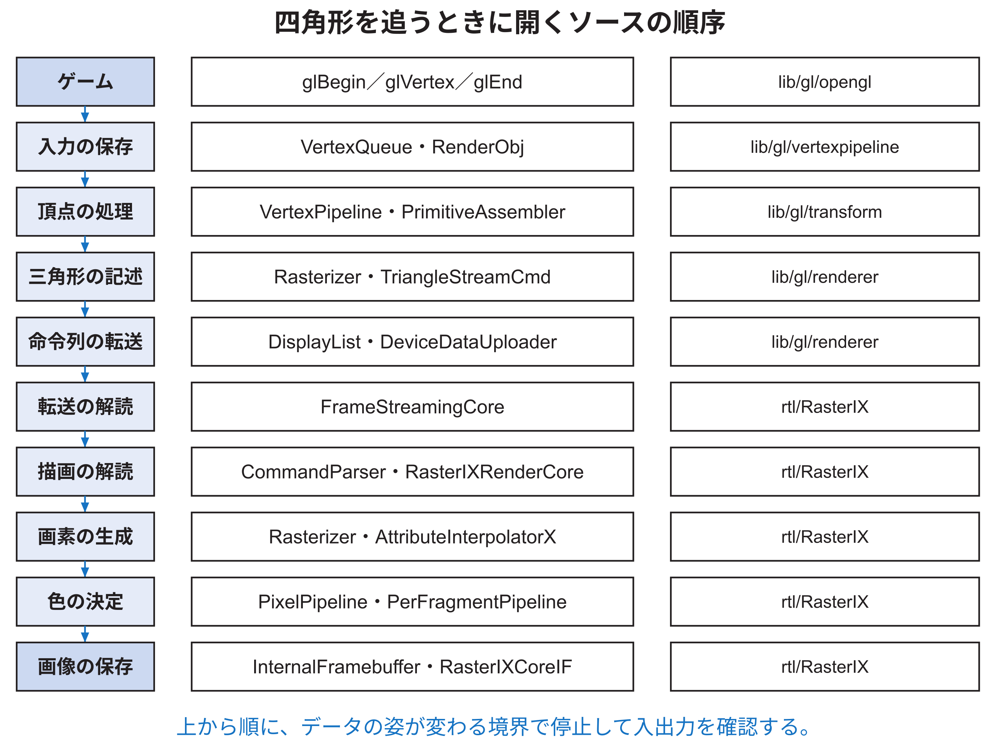

<a id="s_N_2"></a>
#### N.2 説明の基準版と、変わり得る箇所

本付録が説明する公式RasterIXは、サブモジュールで固定したコミット`9fdcf97a31b2e4247594e06d605871980cd5e9e1`である。Wally側は本研究の基準版[Console26](#ref_Console26)である。開発中の`main`ブランチは将来変わり得るため、行番号よりも、モジュール名、クラス名、信号名、固定コミットを手掛かりにする。[RasterIX](#ref_RasterIX)

公式RasterIXのソース自体には変更を加えていない。したがって本付録では、次の二種類を明確に分ける。

| 種類 | 例 | 読む場所 |
|---|---|---|
| 公式RasterIXの設計 | Rasterizer、TMU、内部Framebuffer | `addins/rasterix` |
| 本研究で追加した結合 | APBレジスタ、非同期FIFO、DDR3共有、表示切替 | `fpga/src`と`examples/rasterix` |

公式の内部設計を説明する箇所で、本研究がその回路を新規設計したかのようには書かない。本研究で設計したのは、Wallyから公式RasterIXを利用できる接続と、その構成で二次元ゲームを動かすソフトウェアである。

<a id="s_N_3"></a>
#### N.3 RasterIX_IFとRasterIX_EFは何が違うか

公式RasterIXには、主に`RasterIX_IF`と`RasterIX_EF`という二つの構成がある。末尾のIFはInternal Framebuffer、EFはExternal Framebufferを指す。本研究が採用したのは`RasterIX_IF`である。

`RasterIX_IF`は、描画中の色、深度、StencilをFPGA内部のメモリへ置く。内部領域より画面が大きいときは、画面を横長の帯へ分け、一帯ずつ内部で描いてDDR3へ書き出す。内部メモリは低遅延で、画素パイプラインへ毎cycleデータを供給しやすい。一方で、同じ図形を各帯について処理する場合があり、textureも帯ごとに読み込む可能性がある。

`RasterIX_EF`は、色、深度、Stencilを最初から外部メモリに置く。画面全体を一度に扱いやすく、同じtextureの再読込みを減らせる可能性がある。しかし、各fragmentについて外部メモリの読書きを待つため、メモリ系が追いつかないとパイプラインが停止する。公式`design.md`も、理論上の利点に対して実際にはメモリ供給不足で停止しやすいと説明している。[RasterIX](#ref_RasterIX)

| 観点 | RasterIX_IF | RasterIX_EF |
|---|---|---|
| 描画中の画素保存 | FPGA内部メモリ | 外部システムメモリ |
| 大きな画面 | 帯へ分割 | 画面全体を直接扱う |
| 画素アクセスの遅延 | 小さく予測しやすい | 外部メモリの混雑に依存 |
| 必要なFPGA内メモリ | 多い | 少ない |
| 本研究 | 採用 | 不採用 |

この選択は、「IFが常に優れている」という評価ではない。Nexys Video上で、公式の内部Framebuffer構成を保ち、640×480の二次元画像を確実に作るという条件に合う構成を選んだ。

<a id="s_N_4"></a>
#### N.4 上位から見たモジュール階層

`RasterIX_IF.v`は外部に、命令stream、応答stream、Framebuffer切替、AXIメモリmasterを見せる。その内側には、転送を扱う`FrameStreamingCore`、内部画像を管理する`RasterIXCoreIF`、三角形からfragmentを作る`RasterIXRenderCore`がある。図N.2は所有範囲を示す。

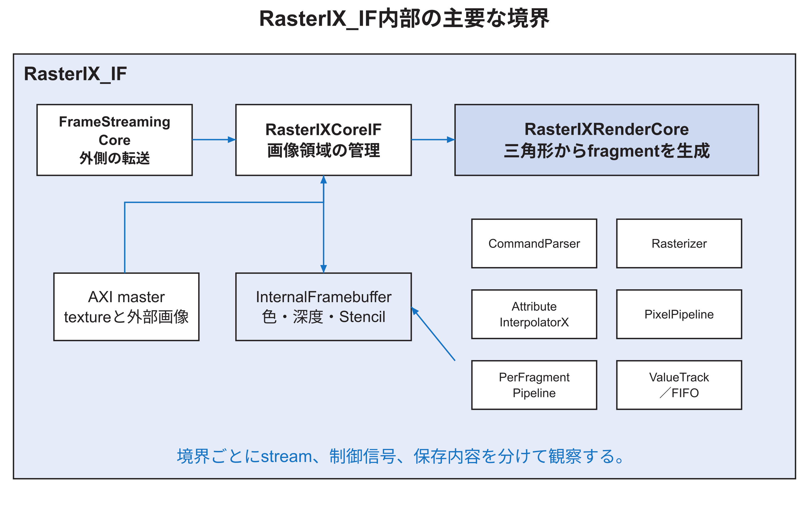

| 階層 | 主な責務 | 代表ファイル |
|---|---|---|
| `RasterIX_IF` | 外部streamとAXIをまとめる | `rtl/RasterIX/RasterIX_IF.v` |
| `FrameStreamingCore` | stream間・メモリ間の転送を解読する | `rtl/RasterIX/FrameStreamingCore.v` |
| `RasterIXCoreIF` | 内部Framebufferと外部画像の受渡し | `rtl/RasterIX/RasterIXCoreIF.v` |
| `RasterIXRenderCore` | 描画命令を画素へ変換する | `rtl/RasterIX/RasterIXRenderCore.v` |
| `CommandParser` | 内側の描画命令を解読する | `rtl/RasterIX/CommandParser.v` |
| `Rasterizer` | 三角形内の画素座標を列挙する | `rtl/RasterIX/Rasterizer.v` |
| `AttributeInterpolatorX` | 色、深度、texture座標を補間する | `rtl/RasterIX/AttributeInterpolatorX.v` |
| `PixelPipeline` | textureとfogを適用する | `rtl/RasterIX/PixelPipeline.v` |
| `PerFragmentPipeline` | 各試験、blend、logic opを行う | `rtl/RasterIX/PerFragmentPipeline.v` |
| `InternalFramebuffer` | 色、深度、Stencilを保存する | `rtl/RasterIX/InternalFramebuffer.v` |

上位モジュールを読むときは、すべてのportを一度に理解しようとしない。まず命令stream、fragment stream、Framebuffer、AXIメモリという四群に色分けする。その後、各群の`valid`、`ready`、`data`、`last`を追う。

<a id="s_N_5"></a>
#### N.5 ソフトウェアとRTLの分担

RasterIXは、すべてをRTLで処理するGPUではない。CPU側のC++とFPGA側のRTLが仕事を分担する。特に、頂点の行列変換、primitiveの組立て、三角形の辺関数や属性増分の準備は、構成に応じてCPU側で行う。RTLは、その準備済みパラメータを使い、各画素を高速に列挙して色を決める。

| 処理 | 主に担当する側 | 本設定での意味 |
|---|---|---|
| OpenGL APIの状態管理 | CPU上のC++ | 現在色、texture設定などを保持 |
| 頂点の収集 | CPU上のC++ | 四角形の四頂点を配列へ保存 |
| primitive組立て | CPU上のC++ | 四角形を二三角形へ変換 |
| 行列・clipping・viewport | CPU上のC++ | 画面座標まで変換 |
| 辺関数の初期値と増分 | CPU上のC++ | `TriangleDesc`を作る |
| 内側画素の列挙 | FPGA上のRTL | `Rasterizer.v`が実行 |
| 属性補間 | FPGA上のRTL | 色、深度、texture座標を更新 |
| texture、fog、各試験 | FPGA上のRTL | 各fragmentの最終値を決定 |
| 画像保存と外部転送 | FPGA上のRTL | BRAMとDDR3を使用 |

この分担を知らずに「RasterIXが三角形を描く」とだけ覚えると、CPU側の処理時間が大きい理由を理解できない。CPUは四頂点を渡した直後に仕事を終えるのではなく、描画回路が使える記述子を作り、命令列として送信する。

<a id="s_N_6"></a>
#### N.6 データ、制御、保存場所を混ぜない

一つのモジュールを読むとき、信号を三種類に分けると理解しやすい。

**データ**は、色、座標、命令語、texture、アドレスなど、処理対象そのものである。**制御**は、`valid`、`ready`、`last`、`apply`、`busy`、`ce`など、いつ受け取り、いつ進めるかを決める。**保存場所**は、register、FIFO、texture buffer、color buffer、DDR3など、時間をまたいで値を保持する部分である。

例えば`m_frag_tcolor`だけを追っても、`m_frag_tvalid=0`ならそのcycleの色は有効ではない。逆に`valid=1`でも`ready=0`なら、その値はまだ次段へ受け取られておらず、同じ値を保持しなければならない。データと制御を一緒に読む必要がある。

<a id="s_N_7"></a>
#### N.7 二次元ゲームでも三角形の回路を使う理由

三角形は三次元専用ではない。画面上の四角形は、対角線で二つの三角形へ分けられる。ボール、パドル、ブロック、背景、文字の一文字を載せる長方形も同じである。RasterIX内部を理解するためにtexture座標や遠近補正も説明するが、本研究の成果を三次元ゲームの研究として扱うわけではない。

二次元の場合、多くの値は単純になる。頂点のzを同じ値にし、qも一定にすれば、深度や遠近補正の変化はほとんどない。それでも同じ汎用パイプラインを通る。したがって、二次元ゲームで観察した処理時間には、汎用的な設定管理や三角形記述の費用が含まれる。

<a id="s_N_8"></a>
#### N.8 読解を始める実際のコマンド

基準版を確認し、上位階層と主要クラスを検索するには次を使う。

```bash
cd /path/to/wally-game-console
git submodule status addins/rasterix
cd addins/rasterix
git rev-parse HEAD
rg -n "module RasterIX_IF|module RasterIXRenderCore|module Rasterizer" rtl/RasterIX
rg -n "class VertexPipeline|class Renderer|class DeviceDataUploader" lib/gl
```

期待するRasterIXのHEADは`9fdcf97a31b2e4247594e06d605871980cd5e9e1`である。異なる版を読む場合、本付録のモジュール名やbit配置が一致するとは限らない。

この内部解説は上記の固定版に対応する。2026年10月8日の更新版E6では、ページサイズの一致を追加確認し、命令解析回路の入力間隔と受信停止の組合せで重複を再現した。技術付録29.12〜[29.14](#s_29_14)節に、更新版の条件と単体試験を示す。旧版のソースも同じ命令解析回路を含んでいたため、この解説を任意の入力に対する正しさの保証として読まない。

<a id="s_N_9"></a>
#### N.9 この後の読み方

最初に[付録O](#ch_O)を読み、一つの四角形だけを最後まで追う。その後、疑問に応じて[付録P](#ch_P)以降へ移る。命令が分からなければ[付録P](#ch_P)、三角形の数値が分からなければ[付録Q](#ch_Q)と[付録S](#ch_S)、色が分からなければ[付録T](#ch_T)と[付録U](#ch_U)、メモリが分からなければ[付録V](#ch_V)を読む。最初から全モジュールを横断すると、同名の`Rasterizer`クラスと`Rasterizer` RTL、外側と内側のcommand、内部と外部のFramebufferが混ざりやすい。

<a id="ch_O"></a>
### 付録O 一つの二次元四角形を画素まで追う

<a id="s_O_1"></a>
#### O.1 追跡する具体例

例として、左下が`(100, 80)`、右上が`(180, 120)`の赤い長方形を考える。説明を単純にするため、texture、fog、blend、depth test、stencil testを無効にし、四頂点の色を同じ赤とする。概念上の呼出しは次のようになる。

```cpp
glColor3f(1.0f, 0.0f, 0.0f);
glBegin(GL_QUADS);
glVertex2f(100.0f,  80.0f); // P0
glVertex2f(180.0f,  80.0f); // P1
glVertex2f(180.0f, 120.0f); // P2
glVertex2f(100.0f, 120.0f); // P3
glEnd();
```

このコードから、CPUが8,000画素へ赤を書き込むわけではない。四頂点が二三角形へ変わり、各三角形の境界と色の規則が命令列になる。FPGA側が三角形の内側にある画素を列挙し、各画素へ赤を書き込む。図O.1に全体を示す。

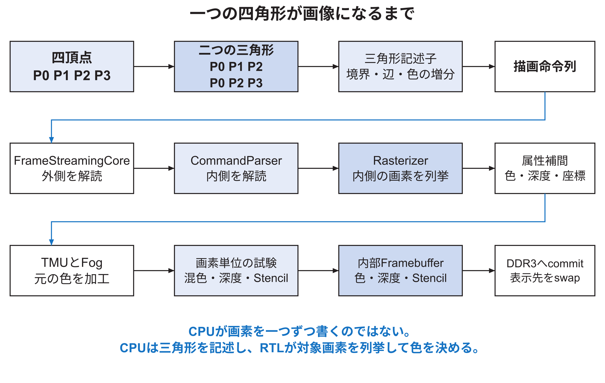

<a id="s_O_2"></a>
#### O.2 `glColor3f`は現在色を変える

`glColor3f`は、その瞬間に画面を赤くしない。RIXGL内部の「現在色」を更新する。続く`glVertex2f`が頂点を追加するとき、その頂点には現在色が関連付けられる。したがって、頂点ごとに`glColor`を変えれば、三角形の三頂点へ異なる色を持たせられる。

`VertexQueue`は、位置だけでなく、その時点の法線、texture座標、色を対応する配列へ追加する。公式`lib/gl/vertexpipeline/VertexQueue.hpp`では、`addVertex`が`m_vertexBuffer`、`m_normalVertexBuffer`、`m_textureVertexBuffer`、`m_colorVertexBuffer`へ値を追加する。ここで「渡された値を保持する」とは、後で使うためにこれらのC++配列へコピーすることを指す。[RasterIX](#ref_RasterIX)

<a id="s_O_3"></a>
#### O.3 `glBegin`と`glEnd`の間で起きること

`glBegin(GL_QUADS)`は、頂点をどの規則で組み立てるかを`QUADS`へ設定し、頂点配列を空にする。各`glVertex2f`は、二次元の`x`と`y`に加えて、既定の`z`と`w`を持つ四成分の頂点として保存される。`glEnd`は、それまでの配列を`RenderObj`として整え、頂点パイプラインへ渡す。

この段階の主な保存場所はCPUの通常メモリである。まだRasterIXの命令FIFOやFramebufferへは入っていない。したがって、`glVertex2f`の呼出し回数が増えれば、CPU側で配列へ追加し、後段で各頂点を処理する仕事も増える。

<a id="s_O_4"></a>
#### O.4 `VertexPipeline::drawObj`が行う順序

`lib/gl/vertexpipeline/VertexPipeline.cpp`の`drawObj`は、概ね次の順で進む。

1. 頂点配列が有効か確認する。
2. 行列や照明など、変更された大域状態を更新する。
3. Pixel pipeline側の設定を命令列へ反映する。
4. primitiveの種類と頂点数を設定する。
5. 有効なTMUを局所状態へ記録する。
6. 新しい描画要素の開始を通知する。
7. 頂点を一つずつ`pushVertex`する。

ここでいうPixel pipelineはC++側の設定管理クラスとRTL側の`PixelPipeline.v`の両方に同じ語が現れる。C++側は「どの機能を有効にするか」を命令へまとめ、RTL側は実際のfragmentへtextureやfogを適用する。ファイル拡張子と階層で区別する。

<a id="s_O_5"></a>
#### O.5 四頂点が二三角形になる

`lib/gl/transform/PrimitiveAssembler.cpp`の`QUADS`処理は、最初の三頂点から`P0,P1,P2`を作り、次に保存した`P0`と残る`P2,P3`から`P0,P2,P3`を作る。四角形を二つの三角形にする対角線は`P0`と`P2`を結ぶ線である。

| 生成順 | 三頂点 | 長方形で覆う部分 |
|---|---|---|
| 三角形0 | P0, P1, P2 | 右下側 |
| 三角形1 | P0, P2, P3 | 左上側 |

一般的なRasterizerでは、二三角形の共有辺をどちらか一方だけに含める規則を設けることが多い。しかし、固定したRasterIX sourceでは三辺とも`w >= 0`なら辺上を含め、top-left規則を実装していない。公式sourceを呼び出す独立試験では、半画素移動後の4×4四角形は16個の異なる画素を覆う一方、共有対角線上の4画素を両三角形が生成し、fragmentは合計20個になった。一様な不透明色では最終色が同じでも、blendやstencilを有効にすると共有辺へ二度作用し得る。[付録X.14](#s_X_14)、[付録Z.5](#s_Z_5)、[付録Z.6](#s_Z_6)で、入力、software画素集合、RTL照合、適用範囲を示す。

<a id="s_O_6"></a>
#### O.6 行列変換とviewportは二次元でも通る

OpenGL風APIへ渡した座標が、そのままFramebufferの画素番号になるとは限らない。頂点はmodel-view行列、projection行列、clipping、perspective divide、viewport変換を通って画面座標になる。二次元ゲームでは、正投影行列を使い、ゲーム座標と画面画素を分かりやすく対応させることが多い。

正投影を適切に設定し、`(100,80)`が画面上の同じ位置へ写る場合でも、経路そのものは残る。これは汎用APIを利用する費用の一部である。本研究の描画準備時間には、この頂点処理、状態管理、命令列の構築が含まれる。

<a id="s_O_7"></a>
#### O.7 CPU側Rasterizerが記述子を作る

公式C++の`lib/gl/renderer/Rasterizer.cpp`は、三角形を直接塗らない。RTLのRasterizerが使う`TriangleDesc`を作る。主な内容は次である。

| 値 | 意味 |
|---|---|
| `bbStartX`, `bbStartY` | 調べ始める境界箱の左下側 |
| `bbEndX`, `bbEndY` | 調べ終える境界箱の右上側 |
| `wInit[0..2]` | 開始位置における三辺の辺関数 |
| `wXInc[0..2]` | 一画素右へ進むときの辺関数の増分 |
| `wYInc[0..2]` | 一行進むときの辺関数の増分 |
| `color` | 開始位置のRGBA |
| `colorXInc`, `colorYInc` | 右・次行へ進むときの色増分 |
| `depthZw`と増分 | depthとwの開始値・増分 |
| `texStq`と増分 | texture座標s,t,qの開始値・増分 |

四頂点が同じ赤なら、各三角形の色増分は原理上0に近く、開始色は赤になる。RTLは画素ごとに複雑な重み付き和を最初から計算せず、開始値へ一定の増分を加えていく。

<a id="s_O_8"></a>
#### O.8 `TriangleStreamCmd`が内側の命令を作る

`TriangleStreamCmd`は、先頭に「三角形stream」というoperationを置き、その後へ`TriangleDesc`の語を並べる。`RIXDisplayListAssembler`は、設定命令、Framebuffer命令、三角形命令を順番にdisplay listへ書く。

display listは、画面に表示する一覧という意味ではない。描画回路が順に実行する命令とデータの列である。CPUメモリ上に一度まとめるため、作成側と送信側の速度差を吸収し、複数の命令を一括して転送できる。

<a id="s_O_9"></a>
#### O.9 `DeviceDataUploader`が外側の命令を付ける

内側のdisplay listだけでは、`FrameStreamingCore`は、その列を描画器へ渡すのかDDR3へ保存するのか判断できない。`DeviceDataUploader`は、転送先、転送元、バイト数、必要ならメモリアドレスを持つ外側のヘッダを追加する。display listを描画器へ送る場合、外側は`OP_STREAM`となる。

この外側の命令は、[付録P](#ch_P)で説明する`FrameStreamingCore`用である。そのペイロードに、`CommandParser`が読む内側の命令が入る。図P.1の三層を混同しない。

<a id="s_O_10"></a>
#### O.10 WallyがAPBレジスタへ一語ずつ書く

本研究の`WallyBusConnector.hpp`は、転送列を32 bit語に分け、RasterIX用APB領域の`CMD`または`CMD_LAST`へ書く。通常の語は`CMD`、転送の最後の語は`CMD_LAST`へ書く。最後を別レジスタにすることで、`TLAST`に相当する境界をRTLへ伝える。

CPU側20 MHzとRasterIX側100 MHzの間には非同期FIFOがある。FIFOが一時的に満杯ならAPBの`PREADY`を下げ、CPUの書込み完了を待たせる。したがって、CPUが書込み命令を実行したことと、RasterIXがその語を解読し終えたことは同じ時刻ではない。

<a id="s_O_11"></a>
#### O.11 FPGA内で画素が生まれる

外側の`FrameStreamingCore`がpayloadをrenderer用streamへ渡し、内側の`CommandParser`が三角形streamを`Rasterizer`用入力へ送る。`Rasterizer`は境界箱を走査し、三辺の辺関数が内側を示す画素について、座標、index、補間器への制御を出す。

`AttributeInterpolatorX`は、その画素の色、深度、texture座標を増分で更新する。本例ではtextureなどが無効なので、`PixelPipeline`は元の赤をほぼそのまま次へ渡す。`PerFragmentPipeline`では無効な試験を通過し、赤がcolor bufferへ書かれる。

<a id="s_O_12"></a>
#### O.12 内部Framebufferから画面へ出る

本構成では、一つの帯を内部Framebufferへ描く。帯が完成すると`COMMIT`によりDDR3上の外部color bufferへ書き出す。五帯がそろって一枚の640×480画像となる。`SWAP`命令は、その外部画像を次の表示先にするよう依頼する。

表示回路はDDR3からRGB565の画素を読み、DVI形式の映像信号をHDMI OUT端子へ送る。RasterIXが画素を書き終えた時点と、表示回路が新しい画像へ切り替えた時点と、ディスプレイがその画素を発光した時点は異なる。

<a id="s_O_13"></a>
#### O.13 この経路を自分で追う課題

次の順でソースを開き、各段で「入力の型」「出力の型」「保存場所」を一行ずつ記録する。

```text
VertexQueue.hpp
  ↓
VertexPipeline.cpp
  ↓
PrimitiveAssembler.cpp
  ↓
Rasterizer.cpp
  ↓
TriangleStreamCmd.hpp
  ↓
RIXDisplayListAssembler.hpp
  ↓
DeviceDataUploader.cpp
  ↓
FrameStreamingCore.v
  ↓
CommandParser.v
  ↓
Rasterizer.v
  ↓
AttributeInterpolatorX.v
  ↓
PixelPipeline.v
  ↓
PerFragmentPipeline.v
  ↓
InternalFramebuffer.v
```

答え合わせでは、単にファイル名が並んでいるかを見ない。例えば`Rasterizer.cpp`の出力は画素列ではなく三角形記述子、`Rasterizer.v`の出力は画素位置を伴うstreamである、と役割の違いを言えることが重要である。

<a id="ch_P"></a>
### 付録P 三層の命令とbit配置を読む

<a id="s_P_1"></a>
#### P.1 「描画命令」を一種類だと思わない

本システムでは、少なくとも三種類の命令が連続して現れる。図P.1の①はWallyが実行するRISC-V機械命令、②はRasterIXの転送器が解読する外側の命令、③は描画器が解読する内側の命令である。

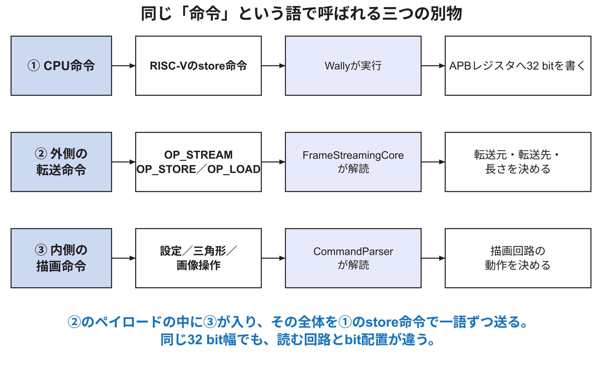

例として、C++の配列にあるdisplay listを描画器へ送る場合を考える。Wallyは①の`store`を繰り返し、APBレジスタへ32 bit語を書く。その列の最初には②の`OP_STREAM`ヘッダがある。そのペイロードの先頭には③の設定命令や三角形命令がある。①、②、③はすべて32 bitの語を含み得るが、解読する回路とbit配置が異なる。

<a id="s_P_2"></a>
#### P.2 Wally側APBレジスタの役割

本研究の`rasterix_apb`は、RasterIXのstreamをCPUから扱えるよう、次のレジスタを持つ。offsetはRasterIX用APB領域の先頭からの距離である。

| offset | 名前 | CPU操作 | 意味 |
|---:|---|---|---|
| `0x00` | CMD | write | 通常の命令語をFIFOへ入れる |
| `0x04` | CMD_LAST | write | 最後の語を入れ、`TLAST`を付ける |
| `0x08` | STATUS | read | command受付可、response有、busyを読む |
| `0x0c` | ID | read | 識別値`RIX1`を読む |
| `0x10` | FRAME_COUNT | read | 表示切替完了回数を読む |
| `0x14` | FRAME_ADDR | read | 現在の表示用アドレスを読む |
| `0x18` | RESPONSE | read | 応答FIFOの先頭を取り出す |

`STATUS`を読むだけでは応答FIFOを消費しない。`RESPONSE`を読むと、その値をCPUへ返すと同時に先頭を取り出す。この違いは[付録I](#ch_I)の図I.6で説明した。

<a id="s_P_3"></a>
#### P.3 外側の転送ヘッダ

`DeviceDataUploader`とRTLの`FrameStreamingCore`は、データをどこからどこへ何byte運ぶかを共有する。先頭32 bitは、送信先channel、送信元channel、byte数を含む。メモリが関係する操作では、次の32 bitが先頭addressになる。その後にpayloadが続く。

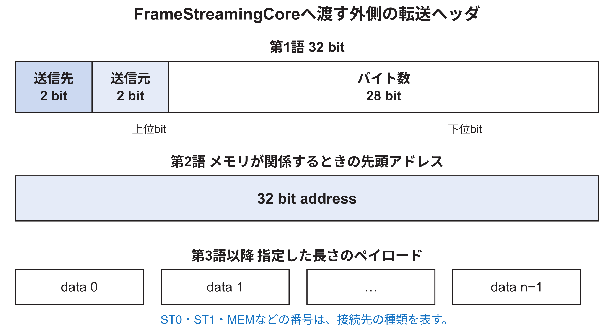

公式実装では、上位nibbleで用途を区別する定数として`OP_STORE`、`OP_LOAD`、`OP_STREAM`が使われる。概念上の関係は次である。

| 外側operation | 転送の向き | 代表用途 |
|---|---|---|
| `OP_STREAM` | stream入力から別streamへ | display listをrendererへ渡す |
| `OP_STORE` | stream入力からメモリへ | textureや命令用データをDDRへ保存する |
| `OP_LOAD` | メモリからstream出力へ | DDRのデータを読み出す |

channel番号には内部経路、stream 0、stream 1、memoryなどが割り当てられる。Wallyから入るraw streamはST0で受け、renderer側のST1へ流す。定数名だけで向きを推測せず、`DeviceDataUploaderCommands.hpp`と`FrameStreamingCore.v`のsource／destination選択を照合する。

<a id="s_P_4"></a>
#### P.4 `FrameStreamingCore`の状態機械

`FrameStreamingCore`は、概ね`IDLE`、`COMMAND`、`ADDR`、`STREAM`を進む。転送先が受け取れないときは`STREAM_PAUSED`相当の状態で未転送の一語を保持する。

| 状態 | 読むもの | 決めること |
|---|---|---|
| IDLE | 転送開始 | 新しい転送を始めるか |
| COMMAND | 第1語 | source、destination、長さ |
| ADDR | 第2語 | memory先頭address |
| STREAM | payload | 指定先へ何語転送したか |
| STREAM_PAUSED | 保持中の一語 | destination再開まで待つ |

長さを32 bit語数だけでなくbyte数として持つのは、memory busの幅や末尾の有効byteを扱うためである。AXI側では`LinearAddressGenerator`がburstを作る。公式構成はAXI3互換の制限も考慮し、境界をまたぐ転送を分割する。

<a id="s_P_5"></a>
#### P.5 内側の描画命令の共通形式

`CommandParser`が読む内側の命令は、32 bitの上位4 bitをoperation、下位28 bitをimmediateとする。operationごとに、immediateの意味と後続語数が異なる。

```text
bit 31                         bit 28 bit 27                    bit 0
+-----------------------------------+------------------------------+
|           operation 4 bit         |       immediate 28 bit       |
+-----------------------------------+------------------------------+
```

| operation | 名前 | 後続データ |
|---:|---|---|
| 0 | NOP | なし |
| 1 | RENDER_CONFIG | register値一語 |
| 2 | FRAMEBUFFER | immediate内の制御bit |
| 3 | TRIANGLE_STREAM | 三角形記述子 |
| 4 | FOG_LUT_STREAM | fog用table |
| 5 | TEXTURE_STREAM | texture page情報 |

operation番号は`rtl/RasterIX/RegisterAndDescriptorDefines.vh`を基準にする。C++側では`lib/gl/renderer/commands/Op.hpp`と各command classが同じ約束を作る。一方だけを変更すると、C++が送る意味とRTLが読む意味がずれる。

<a id="s_P_6"></a>
#### P.6 設定registerは「物理アドレス」ではない

`RENDER_CONFIG`のimmediateには、RasterIX内の設定register番号が入る。続く一語が設定値である。これはWallyのAPB addressではない。APB addressは命令streamへ語を入れる入口、render config registerはそのstreamの中で指定する描画器内部の宛先である。

基準版の設定項目は次のように分類できる。

| 分類 | 主なregister | 何を決めるか |
|---|---|---|
| 機能有効化 | FEATURE_ENABLE | fog、blend、depth、alpha、stencil、scissor、TMU、logic op |
| 初期化値 | COLOR_CLEAR、DEPTH_CLEAR | clear時に入れる値 |
| fragment処理 | FRAGMENT_PIPELINE、STENCIL | 比較関数、参照値、mask、blend、logic op |
| 画面範囲 | SCISSOR_START／END、Y_OFFSET、RESOLUTION | 対象範囲、帯の位置、横幅・高さ |
| texture | TMU_CONFIG、TMU_ENV、TMU_COLOR | 大きさ、wrap、filter、format、合成式 |
| memory | COLOR／DEPTH／STENCIL_ADDR | 外部bufferのaddress |

公式定義には19個の設定registerがある。各bit位置は`RegisterAndDescriptorDefines.vh`にまとまっている。設定を追加するときは、C++側のcommand生成、RTL側のregister bank、初期値、試験を同時に変更する。

<a id="s_P_7"></a>
#### P.7 FEATURE_ENABLEのbitを読む

FEATURE_ENABLEは、各機能を一つずつ有効化する。代表的にはfog、blend、depth test、alpha test、stencil test、scissor、TMU0、TMU1、logic opがある。`1`なら必ず最終画像が変わるとは限らない。例えばblendを有効にしても、blend factorがsourceのみを選ぶ設定なら見た目は変わらない。

回路では、機能を無効にしたときに段全体を取り除くparameterと、実行時にその機能をbypassするregisterがある。前者は合成時に回路規模を変え、後者は同じbitstream上で動作を変える。二つを区別する。

<a id="s_P_8"></a>
#### P.8 FRAMEBUFFER命令のbit

FRAMEBUFFER命令は、immediateの各bitで複数の操作を指定する。

| bit | 意味 | 本構成での代表例 |
|---:|---|---|
| 0 | COMMIT | 内部の帯をDDR3へ書き出す |
| 1 | MEMSET | 内部領域をclearする |
| 2 | SWAP | 完成した外部画像を表示先へ依頼する |
| 3 | READ | DDR3の帯を内部へ読み戻す |
| 4 | COLOR_SELECT | color bufferへ命令を適用 |
| 5 | DEPTH_SELECT | depth bufferへ命令を適用 |
| 6 | STENCIL_SELECT | stencil bufferへ命令を適用 |
| 7 | VSYNC_ENABLE | 表示同期を待つ指定 |
| 8以降 | SIZE | 対象画素数 |

複数のbufferを同時にclearする場合、COLOR、DEPTH、STENCILの選択bitを組み合わせる。SWAPは内部BRAMの前後を入れ替える操作ではなく、外部color bufferの表示切替要求と結び付く。

<a id="s_P_9"></a>
#### P.9 三角形記述子の語数

三角形streamの後続データは、固定部分30語と、TMU一個につき9語からなる。公式が最大二TMUを扱う形では48語、Wally構成の`TMU_COUNT=1`では39語になる。したがって、「三角形は常に48語」と覚えると本設定とずれる。

| 部分 | 32 bit語数 | 内容 |
|---|---:|---|
| reserved | 1 | alignment用 |
| bounding box | 2 | 四つの16 bit境界値 |
| 三辺の初期値 | 3 | w0, w1, w2 |
| 三辺のX増分 | 3 | 一画素右への増分 |
| 三辺のY増分 | 3 | 一行への増分 |
| 色の開始・X増分・Y増分 | 12 | RGBAを三組 |
| depthの開始・X増分・Y増分 | 6 | zとwを三組 |
| texture一個 | 9 | s,t,qを三組 |

実際のbyte数は`sizeof(TriangleDescX)`と構成parameterから決まる。C++の構造体は`#pragma pack`を使い、RTLのregister配置と一致させる。compilerや型を変える場合は、構造体のpaddingを必ず確認する。

<a id="s_P_10"></a>
#### P.10 `TLAST`とsizeは別の役割を持つ

sizeは何語または何byteを処理するかを示し、`TLAST`はstream上の一まとまりの終端を示す。正常な列では両者が一致するよう生成するが、意味は同じではない。sizeが間違えばstate machineが早く終わるか余分な語を待つ。`TLAST`が間違えばpacket境界の扱いが崩れる。

Wally側では、最後の語だけ`CMD_LAST`へ書くことで非同期FIFOの`tlast`を1にする。ここを単にすべて`CMD`へ書くと、32 bit値自体は届いても終端情報が失われる。

<a id="s_P_11"></a>
#### P.11 一つの具体的な転送を分解する

三角形一個を描くdisplay listが、設定命令二語と三角形command一語、Wally構成の記述子39語からなると仮定する。内側は合計42語、168 byteである。外側の`OP_STREAM`は、この168 byteをST0からrenderer側ST1へ送ると指定する。CPUは外側のヘッダと内側42語を、APBへ順に書く。

ここで数えた42語は説明用の最小例である。実際のdisplay listにはFramebuffer操作、複数三角形、状態変更などが入る。また外側のヘッダ形式によってaddress語の有無も変わる。計測では、推定語数と実際のbus write回数を分けて記録する。

<a id="s_P_12"></a>
#### P.12 命令列が壊れたときの症状

| 症状 | 最初に疑う層 | 確認するもの |
|---|---|---|
| IDは読めるが描画が始まらない | APBから外側stream | CMD write、FIFO valid／ready、TLAST |
| memory転送だけ失敗 | 外側命令 | source、destination、address、length |
| 一個目は描けるが次で停止 | 内側のsize／終端 | CommandParser state、streamCounter |
| 色設定だけ無視される | render config | register番号と続く値 |
| 三角形の形が壊れる | descriptor配置 | C++構造体size、固定小数点、語順 |
| swapだけ終わらない | FRAMEBUFFER命令 | swap bit、`fb_swapped`、表示handshake |

症状から一つの層へ絞り、そこで入力と出力を観察する。すべてのsignalを一度に波形へ追加すると、重要な境界を見失う。

<a id="s_P_13"></a>
#### P.13 命令形式を変更するときの原則

新しいrender registerを追加する場合、少なくとも次を同じ変更単位として扱う。

1. `RegisterAndDescriptorDefines.vh`へbit位置またはregister番号を追加する。
2. C++側の対応定義とcommand生成を追加する。
3. `CommandParser`またはregister bankが値を受け取るようにする。
4. 使用するmoduleへ信号を配線する。
5. reset時の既定値を決める。
6. C++のcommand encode試験とRTLのdecode試験を加える。
7. 古い命令列との互換性が必要か決める。

番号を一方でずらすだけの変更は、合成には成功しても画面を壊す。命令はソフトウェアとRTLのABIであると考える。

<a id="ch_Q"></a>
### 付録Q CPU側で三角形記述子を作る

<a id="s_Q_1"></a>
#### Q.1 CPU側処理を理解する理由

RasterIXのRTLだけを読んでも、入力される数値がなぜその値なのかは分からない。辺関数の初期値、色の増分、textureの`s,t,q`は、CPU側のC++が頂点から計算している。RTLの挙動を変更するには、どこまでが事前計算で、どこからがhardware計算かを理解する必要がある。

本設定では、C++側の主な流れは次である。

```text
OpenGL風API
  → VertexQueue
  → RenderObj
  → VertexPipeline
  → PrimitiveAssembler
  → 頂点変換・clipping・viewport
  → Rasterizer.cpp
  → TriangleStreamCmd
  → DisplayList
```

<a id="s_Q_2"></a>
#### Q.2 OpenGLのstate machineとして読む

OpenGL風APIは、各関数が独立した完全な命令ではなく、「現在の状態」を更新しながら頂点へ関連付けるstate machineである。現在色、現在のtexture座標、行列、blend設定などが保持され、後の描画に使われる。

例えば次の二つは結果が異なる。

```cpp
glColor3f(1, 0, 0);
glVertex2f(0, 0);
glColor3f(0, 0, 1);
glVertex2f(100, 0);
```

最初の頂点は赤、次の頂点は青を持つ。三角形の第三頂点を緑にすれば、内部のfragmentは三頂点の色を補間したgradientになる。「色の関数を呼んだ場所に色が描かれる」のではなく、その後に追加する頂点の属性が変わる。

<a id="s_Q_3"></a>
#### Q.3 `RenderObj`が配列の読み方を保存する

`RenderObj`は、頂点値だけでなく、配列が有効か、要素数、型、stride、pointer、indexの有無、描画modeを持つ。strideは、一頂点分進むと次の同種属性まで何byte移動するかを表す。0なら実装が要素sizeから連続配置として扱う。

この抽象化により、`glBegin`／`glEnd`で作った内部配列と、client vertex arrayから渡した配列を同じ`VertexPipeline::drawObj`へ流せる。VBOを使う場合も、最終的にこの実装がどこから頂点をfetchし、CPU上の変換をどこまで残すかを確認しなければ性能を判断できない。

<a id="s_Q_4"></a>
#### Q.4 頂点一個に付随する値

`VertexPipeline::fetch`は、position、normal、color、point size、各TMUのtexture coordinateを一つの`VertexParameter`へまとめる。positionだけを処理しているわけではない。

| 属性 | 代表的な成分 | 二次元長方形での例 |
|---|---|---|
| position | x, y, z, w | xとyを変え、zとwは一定 |
| color | r, g, b, a | 四頂点を同じ赤 |
| normal | x, y, z | lighting無効なら結果へ影響しない |
| texture | s, t, r, q | textureなしならTMU無効 |
| point size | 大きさ | QUADSでは未使用 |

無効な機能の属性も型には存在するが、実行時のfeature enableにより後段でbypassできる。型に存在することと、回路がそのframeで有効に使うことを分ける。

<a id="s_Q_5"></a>
#### Q.5 座標が通る空間

頂点位置は、一般に次の空間を順に通る。

| 空間 | 主な変換 | 何を表すか |
|---|---|---|
| object | model座標 | 部品自身の基準位置 |
| eye | model-view | cameraから見た位置 |
| clip | projection | 視野範囲と同次座標 |
| normalized device | wで除算 | おおむね−1から1の範囲 |
| window | viewport | 画面上のx、y、depth |

二次元ゲームでは、object座標を画面画素に近い値として使い、正投影でwindow座標へ対応させられる。しかしclippingは依然必要である。画面外へはみ出した長方形をそのまま巨大なbounding boxとしてRasterizerへ渡すと、範囲外addressを作る危険がある。頂点pipelineは、視野内に残る部分を作ってから画面座標へ移す。

<a id="s_Q_6"></a>
#### Q.6 primitive assemblyを詳しく読む

`PrimitiveAssemblerCalc`は、queueへ入った頂点を、三角形、線、点へ組み立てる。`TRIANGLES`は三頂点ごと、`TRIANGLE_STRIP`は新しい一頂点ごと、`TRIANGLE_FAN`は最初の頂点を共有して三角形を作る。`QUADS`は四頂点ごとに二三角形を作る。

`TRIANGLE_STRIP`で偶数・奇数ごとに頂点順を入れ替えるのは、表裏を決めるwindingの向きをそろえるためである。辺関数の符号は頂点順に依存する。本実装は最終的にareaの符号を正規化するが、primitive組立て側も一貫した順を保つ。

<a id="s_Q_7"></a>
#### Q.7 画素中心と固定小数点座標

CPU側`Rasterizer.cpp`は、画面座標を小数部5 bitの固定小数点へ変換する。1画素は32という整数差で表され、0.5画素は16で表される。ただし、「各画素の中心へ常に0.5を足して辺関数を評価する」という実装ではない。辺関数の開始点は整数画素座標`(bbStartX×32, bbStartY×32)`であり、0.5画素の定数16は主にbounding boxの整数化へ使われる。Breakout側は別に`glTranslatef(-0.5, 0.5, 0)`を適用し、アプリケーション上の半画素中心とRasterIXの整数sample格子を合わせている。

固定小数点は、「小数が使えない」という意味ではない。整数の下位bitを小数部と決める表現である。例えば小数部5 bitなら次となる。

| 実数 | 保存整数 | 解釈 |
|---:|---:|---|
| 0.0 | 0 | 0÷32 |
| 0.5 | 16 | 16÷32 |
| 1.0 | 32 | 32÷32 |
| 3.25 | 104 | 104÷32 |

この形式により、RTLは多くの位置計算を整数加算として実装できる。浮動小数点からの変換式は、実装上`static_cast<int32_t>(value×32+0.5)`である。C++の整数変換は0方向へ切り捨てるため、正数の四捨五入と同じ規則を負数へ対称に適用したものではない。例えば`-1.0→-31`、`-0.5→-15`、`-1/32→0`となる。[付録X.7](#s_X_7)で、この非対称性と影響範囲を表にする。

<a id="s_Q_8"></a>
#### Q.8 辺関数の意味

二点AとBが作る向き付きの辺に対し、点Pがどちら側にあるかを次で調べる。

```text
E(A,B,P) = (Px − Ax)(By − Ay) − (Py − Ay)(Bx − Ax)
```

三角形の三辺についてEを求め、頂点順に合わせて符号を正規化すると、三つが0以上の点を内側として扱える。E=0は辺上である。実装では三辺の値を`w0,w1,w2`と呼ぶ。

三角形の向きを逆にすると、すべての符号が逆になる。CPU側は三頂点からareaを求め、その符号に応じて`sign`を選び、areaと各辺関数を同じ向きへそろえる。areaが0なら三点が一直線上などの退化三角形なので描画しない。

<a id="s_Q_9"></a>
#### Q.9 一画素ごとに掛け算し直さない

辺関数はxとyに関する一次式である。Pを一画素右へ動かしたときの変化量は常に同じで、次の行へ動かしたときの変化量も常に同じになる。CPU側は三辺について`wXInc`と`wYInc`を一度計算する。RTLは開始位置の`wInit`へ増分を加える。

```text
w(x + 1, y) = w(x, y) + wXInc
w(x, y + 1) = w(x, y) + wYInc
```

これが、CPU側で辺関数を事前計算する主な理由である。RTLに三頂点を渡して毎画素の乗算をさせるより、加算器で一画素ずつ進めやすい。

<a id="s_Q_10"></a>
#### Q.10 bounding boxの役割

三角形が画面全体を覆わない場合、全画素で辺関数を試す必要はない。三頂点の最小x、最大x、最小y、最大yから外接する長方形を作り、その範囲だけを走査する。これがbounding boxである。

bounding box内にも三角形外の画素はあるため、範囲を作るだけで塗る画素が確定するわけではない。各位置で三辺の判定を行う。CPU側の`Rasterizer.cpp`は、scissorと全く重ならない三角形を早期に捨てるが、`TriangleDesc`へ既に保存したbounding boxをscissor範囲へ書き換えない。画素単位の半開区間`start <= p < end`による除外は、後段のRTL `FramebufferScissor.v`が行う。したがって、「CPU側が記述子のbounding boxをscissorへ切り詰める」という説明は正しくない。

<a id="s_Q_11"></a>
#### Q.11 barycentric weightと属性補間

三辺の辺関数を三角形areaで割ると、各頂点の影響割合として使える。ここでは`λ0, λ1, λ2`と書く。三つの和は概ね1になる。各頂点の赤成分を`R0,R1,R2`とすると、点Pの赤は次で求められる。

```text
R(P) = λ0 R0 + λ1 R1 + λ2 R2
```

色だけでなく、depthやtexture用の値も同じ考え方で補間する。CPU側はbounding box開始位置における値と、x・y方向の増分を作る。図Q.1は、値を毎画素の増分で更新する考えを示す。

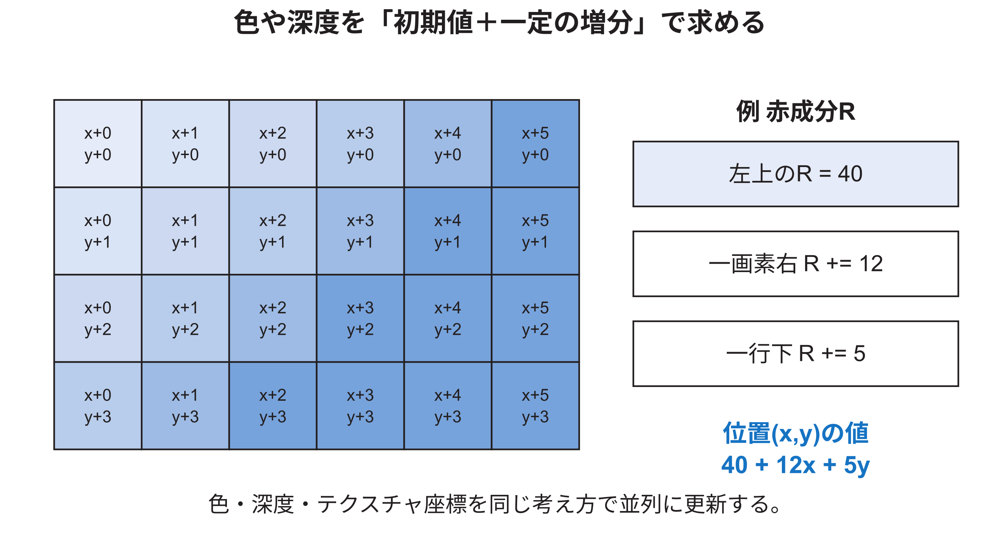

四頂点が同じ赤の長方形では、三角形内の三頂点色も同じなので、色のX増分とY増分は0になる。異なる色ならgradientになる。

<a id="s_Q_12"></a>
#### Q.12 texture座標とperspective correctionの準備

画面上でsとtをそのまま線形補間すると、遠近のある面でtextureが不自然に歪む。perspective divide後の頂点第四成分を`r_i=1/w_clip,i`、同次texture座標を`(s_i,t_i,q_i)`、画面上のbarycentric weightを`λ_i`と書く。CPU側は各頂点で`(s_i r_i, t_i r_i, q_i r_i)`を作り、RTLはそれぞれを線形補間する。fragmentで使う座標は次である。

```text
s_fragment = Σ(λ_i s_i r_i) / Σ(λ_i q_i r_i)
t_fragment = Σ(λ_i t_i r_i) / Σ(λ_i q_i r_i)
```

`glTexCoord2f`では`q_i=1`なので、標準的なperspective-correct interpolationになる。RTLの`q`はtexture座標の第四成分とclip-space wの両方を含む値であり、単に頂点のwそのものではない。

二次元正投影で各頂点の`r_i`と`q_i`が同じなら、分子と分母の共通倍率が消え、結果はsとtの通常の線形補間になる。しかし同じ汎用回路を通るため、固定小数点変換や逆数pipelineは構成上残る。固定小数点経路ではCPU側が三頂点の`r_i`ベクトルをEuclidean normで正規化するが、その共通倍率も上式の分子と分母で相殺される。

<a id="s_Q_13"></a>
#### Q.13 浮動小数点から固定小数点への変換

CPU側の`TriangleDesc`は浮動小数点成分を持つ形があり、Wally構成のhardwareは固定小数点補間器を使う。`TriangleStreamF2XConverter`は、streamされた値をhardwareの形式へ変換する。代表的な形式は次である。

| 値 | 入力形式 | 意味 |
|---|---|---|
| texture s,t,q | S3.28 | 符号1、整数部3相当、小数部28 |
| depth z,w | S1.30 | 小数精度を多く持つ |
| color r,g,b,a | S7.24 | 補間中の範囲に余裕を持つ |

表記中のSはsignedを表す。本付録では、例えばS3.28を「符号1 bit、整数3 bit、小数28 bit、合計32 bit」と読む。このとき範囲は`-8`から`8−2^-28`、刻みは`2^-28`である。S1.30は`-2`から`2−2^-30`、S7.24は`-128`から`128−2^-24`となる。

`TriangleStreamF2XConverter.v`はtexture、color、depthについてそれぞれoffset `-28`、`-24`、`-30`を`FloatToInt.v`へ渡す。変換器は最初に捨てるbitが1なら絶対値へ1を足し、その後に負号を適用する。これはties-to-evenではない。表現範囲を越えた場合は飽和せず0を出す。固定小数点化後の属性更新も32 bitであり、加算overflowを検出して飽和する回路はない。正しい結果には、入力と増分が範囲内に収まるという前提が必要である。

さらに、右shift量が0のとき、公式sourceは存在しない`shiftSize-1`番bitを丸めbitとして読む。未変更RTLの4値simulationでは不定値が現れたが、Nexys Videoと同じArtix-7へVivado 2025.2で合成した後のshift 0代表値は期待値と一致した。これとは別に、非常に小さい正規化floatでは真のshift量が5 bitへ切り詰められ、仮数bitを誤って丸めbitにする。正負の例は合成後にも±1となった。Breakout相当の単色四角形と文字の代表descriptorはこの極小値域へ入らなかった。式、入力下限、case、再実行手順は[付録Y.3](#s_Y_3)と[付録Z.7](#s_Z_7)に示す。

正規化有限値の不偏指数を`e`、出力の小数bit数を`F`、`p=e+F`と置くと、全24 bit仮数に対してsource算術を形式確認できた範囲は`-8<=p<=22`と`24<=p<=30`である。`p=23`は上記のshift 0境界、`p<-8`は極小値alias、`p>=31`は0を返すoverflow経路になる。この区分は「固定小数点形式の最大・最小だけを守れば十分」という意味ではなく、変換器固有の入力契約も必要であることを示す。

<a id="s_Q_14"></a>
#### Q.14 画面を帯に分けるときの記述子調整

RasterIX_IFは、画面の一部の帯だけを内部Framebufferへ描く。三角形が現在の帯と重ならなければ、その帯のdisplay listへ入れない。上の帯から続く三角形なら、帯の開始行まで進んだ分だけ`wInit`、color、depth、textureの開始値をY増分で更新する。

`Rasterizer::increment`は、この調整を行う。例えば三角形のbounding boxがy=70から140までで、現在の帯がy=96から191なら、26行分のY増分を開始値へ加える。これにより、内部Framebufferの先頭行から描き始めても、画面全体でy=96の属性値になる。

<a id="s_Q_15"></a>
#### Q.15 display listを二組持つ理由

Threaded構成では、CPU側が次のdisplay listを作る間に、前のdisplay listを転送・実行できるよう、各帯について二組のbufferを使う。これは画面のfront bufferとback bufferとは別である。display list bufferは命令列を保存し、color bufferは完成画素を保存する。

一組目と二組目の意味は、同じ帯の命令列を交互に作るためであり、帯が十本あるという意味ではない。五帯×二組に転送用領域を加えた構成は[付録H](#ch_H)と本文[第9章](本文.md#ch_9)で説明した。

<a id="s_Q_16"></a>
#### Q.16 CPU側で異常を切り分ける方法

RTLへ送る前の`TriangleDescX`を記録できれば、画像異常をCPU側とRTL側へ分けやすい。

| 観察値 | 正常条件の例 | 異常なら疑う場所 |
|---|---|---|
| bounding box | 画面変換後の三頂点を囲む候補範囲（scissorによる画素maskの前） | viewport、clipping、固定小数点化 |
| area | 0でない | 頂点重複、頂点順、変換 |
| w初期値・増分 | 画素移動で一貫して変化 | edge function計算 |
| 一様色の増分 | おおむね0 | color配列、補間準備 |
| 一定q | 二次元正投影なら頂点間で同じ | projection、wの扱い |
| command size | 構成の構造体sizeと一致 | pack、TMU_COUNT、compiler ABI |

同じ記述子をsoftware rasterizerとRTL simulationへ入力し、両者の画素集合を比較すると、境界規則の差を検出できる。

<a id="s_Q_17"></a>
#### Q.17 記述子dumpを照合するときの手順

CPU側の記述子を保存するだけでは、まだ「正しい数値か」を判断できない。まず一様色でtextureを使わない小さな三角形を一つだけ送り、C++が生成した各fieldを、送信した32 bit語と対応付ける。次にRTL simulationの`CommandParser`が同じ語を同じregisterへ格納したかを見る。この二段階で一致すれば、CPU側の構造体からstream、streamからRTL registerまでのbit配置が一致したと判断できる。

確認順序は次のとおりである。

1. `TriangleDescX`の各field名、bit幅、符号の有無を表にする。
2. C++側でfieldの値と、送信直前の32 bit語列を16進数で記録する。
3. RTL側で、各handshake時の`data`、語番号、格納先registerを記録する。
4. 一つのfieldが複数語にまたがる場合は、上位・下位の順序を確認する。
5. signed値は16進数だけでなく、符号拡張後の十進値でも比較する。
6. 一致後にだけ、複数TMU、texture、gradientなどfield数の多い入力へ広げる。

この照合で、C++側の`sizeof`が合うことだけを根拠にしない。構造体padding、TMU数、parameterで無効になったfield、Verilog側のslice位置のいずれかが違っていても、全体sizeが偶然一致する可能性がある。field単位の既知値を使うと、語順の入替えも見つけられる。

<a id="ch_R"></a>
### 付録R RTL全体の制御と停止を読む

<a id="s_R_1"></a>
#### R.1 hardware pipelineの全体順序

`RasterIXRenderCore.v`は、描画器の中心である。固定小数点補間を使うWally構成では、概ね次の順にfragmentが進む。

```text
CommandParser
  → triangle register bank／F2X converter
  → Rasterizer
  → ValueTrackとstream broadcast
  → AttributeInterpolatorX
  → PixelPipeline
  → 既存color／depth／stencilとのStreamConcatFifo
  → PerFragmentPipeline
  → color／depth／stencil framebuffer write
```

texture dataは別経路から`TextureBuffer`へ入り、`PixelPipeline`内のTMUが読む。render configも別のregister bankへ入り、複数段の制御入力となる。

<a id="s_R_2"></a>
#### R.2 `CommandParser`の三状態

`CommandParser`には、主に`WAIT_FOR_IDLE`、`COMMAND_IN`、`EXEC_STREAM`がある。図R.1は役割を簡略化したものである。

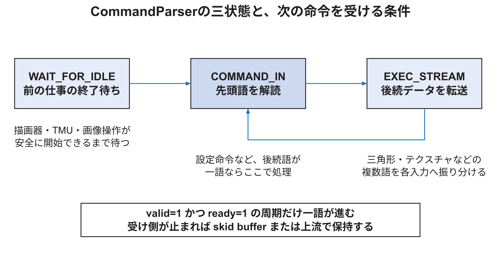

`WAIT_FOR_IDLE`では、前の三角形、framebuffer操作、TMUの準備などが終わるのを待つ。`COMMAND_IN`でoperationを解読する。三角形やtextureのように後続streamがある場合、`EXEC_STREAM`で指定先へpayloadを渡す。payloadが終わると次のcommandへ戻る。

<a id="s_R_3"></a>
#### R.3 なぜ前の仕事の終了を待つのか

次の三角形のregisterを上書きした時点で、前の三角形のfragmentがまだpipelineに残っていると、前の画素が新しい色や増分を使う危険がある。またFramebufferをclear中にfragmentを書けば、clearと描画の順序が壊れる。

そのため`CommandParser`は、Rasterizerだけでなく、pipeline内の未完了画素、Framebuffer command、texture準備の状態も見て開始を制御する。単に「CPUが遅いから待たなくてよい」とは言えない。CPUが次のcommandをいつ送れるかと、内部pipelineに前の仕事が残るかは別問題である。

<a id="s_R_4"></a>
#### R.4 `ValueTrack`が防ぐread-after-write衝突

同じ画素へ連続して二三角形が描かれる場合、後の三角形がFramebufferの古い色やdepthを読んだ後、前の三角形の書込みが遅れて到着すると、順序が逆転する可能性がある。`ValueTrack`はpipeline内の画素数を追跡し、新しい三角形の開始条件を制御する。

これはCPUのregister hazardに似ているが、対象は画素のFramebuffer readとwriteである。公式`design.md`は、前のtriangleのpixelがpipelineを流れている間に次のtriangleを開始するread-before-write conflictを避けるためと説明している。[RasterIX](#ref_RasterIX)

<a id="s_R_5"></a>
#### R.5 stream broadcastとconcat

Rasterizerから出た一つのfragment情報は、属性補間器と、color、depth、stencilの読出しへ分岐する。後段では、新しいfragmentの色・depthと、三つの既存値を同じ画素について再結合する必要がある。

`StreamConcatFifo`は、必要な入力がそろうまで待ち、対応する一組として`PerFragmentPipeline`へ渡す。無効にしたbufferの入力はbypassされる。内部Framebufferのread port自体には自由なbackpressureを掛けられないため、read結果を受けるFIFOが必要になる。

<a id="s_R_6"></a>
#### R.6 validとreadyの受渡し

高位module間では、送信側が`valid`、受信側が`ready`を出し、両方が1のcycleに一要素が移る。

| valid | ready | 意味 |
|---:|---:|---|
| 0 | 0または1 | 送信側に有効データがない |
| 1 | 0 | データは提示中だが未受領。保持する |
| 1 | 1 | このcycleに一要素を受け渡す |

受信側が停止すると`ready=0`が上流へ戻る。各段は処理中のfragmentを失わず保持する。図R.2では、右端のFramebuffer側の停止が左へ伝わる。

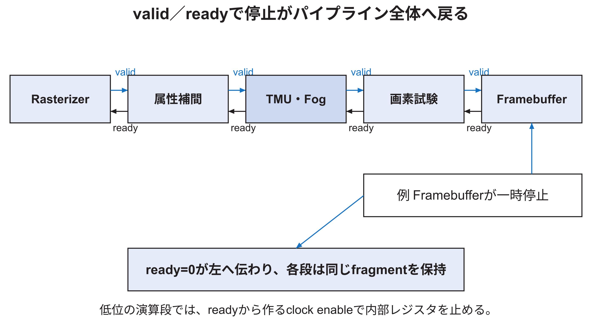

<a id="s_R_7"></a>
#### R.7 `ce`は低位pipelineの時計を止める許可

高位のvalid／readyを、各演算段内部ではclock enableの`ce`へ変換する。`ce=0`のcycleでは、pipeline registerを更新せず同じ中間値を保持する。物理clockそのものを停止しているのではなく、registerが次の値を取り込まないようにする。

逆数計算や乗算など、複数cycleのpipelineを途中で停止するとき、dataだけでなくvalid、座標、index、lastも同じcycle数だけそろえて停止しなければならない。一つだけ進むと、色と画素addressが別のfragmentの組合せになる。

<a id="s_R_8"></a>
#### R.8 skid bufferが必要な場面

readyが0へ変わる情報には組合せ経路の遅延がある。送信側が停止を認識する直前に一語を出していた場合、その一語を一時保存する場所が必要になる。`CommandParser`はskid bufferを持ち、destinationが受け取れない一語を保持する。

skid bufferは大量の待ち行列ではなく、readyの変化を安全に受ける小さな弾力性である。非同期FIFOと目的が異なる。skid bufferは同じclock領域内の即時停止、非同期FIFOはclock領域間のdata transferと短期bufferingを担当する。

<a id="s_R_9"></a>
#### R.9 `TLAST`とhidden flush fragment

各triangleの最後を示す`last`は、pipelineのすべての段を通る。Rasterizerは、内部pipelineに残る値を最後まで押し出すため、画素として書かない`tkeep=0`の終端要素を出す場合がある。`valid=1`でも`keep=0`なら、その要素はcontrolを進めるがFramebufferへ有効画素を書かない。

したがって、simulationで出力要素数を数えるとき、`valid`だけで画素数としない。`valid && ready && keep`を有効画素の受渡しとして数える。終端確認には`last`も見る。

<a id="s_R_10"></a>
#### R.10 performance信号の意味

上位には`perfBusy`、`perfTriangleRendering`、`perfRasterizerStall`などがある。

| 信号 | 分かること | 分からないこと |
|---|---|---|
| `perfBusy` | command処理がidleでない期間 | どの段が原因か単独では不明 |
| `perfTriangleRendering` | triangle処理が進行中か | 画面全体のFPSではない |
| `perfRasterizerStall` | Rasterizer出力validに対しreadyが0 | downstreamのどの段が根因か |

一つのperformance信号だけでボトルネックを断定しない。例えばRasterizer stallは、TMU、Framebuffer、AXI、またはさらに先の停止がbackpressureで戻った結果かもしれない。段ごとのvalid／readyと一緒に観察する。

<a id="s_R_11"></a>
#### R.11 pipeline latencyとthroughputを分ける

あるfragmentが入力から出力まで進むcycle数をlatency、一度pipelineが満たされた後に一cycle当たり何fragmentを受けられるかをthroughputと呼ぶ。17 cycleの補間器でも、各段がpipeline化されていれば、毎cycle一fragmentを受けられる場合がある。

公式コメントには、固定小数点の属性補正約17 cycle、TMU各部の複数段、PerFragment約4 cycleなどの深さが記されている。ただし機能parameter、bypass、stallで実効latencyは変わる。各数を単純加算して「一画素に何cycle」と評価しない。

<a id="s_R_12"></a>
#### R.12 reset時に確認する状態

state machine、valid register、FIFO pointer、framebuffer commandの`applied`は、reset解除時に一貫したidle状態でなければならない。Wally構成ではCPU、DDR、pixelのclock領域ごとにresetがある。RasterIX本体はDDR側100 MHzで動く。

reset問題を調べるときは、次を順に確認する。

1. DDR clockが安定している。
2. RasterIX側resetが同期して解除された。
3. command FIFOの両側が空を示す。
4. `CommandParser`が`COMMAND_IN`へ入る。
5. Framebuffer commandが未適用状態に残っていない。
6. 最初のcommand受渡しでvalid／readyが同時に1になる。

<a id="s_R_13"></a>
#### R.13 control変更の試験観点

状態機械を変更した場合、正常に連続データを流す試験だけでは足りない。次の停止を挿入する。

| 停止条件 | 期待すること |
|---|---|
| command入力validが途切れる | 受領済みcounterを保持し再開する |
| destination readyが0 | 未転送の語を保持する |
| framebuffer readが遅れる | fragmentと既存値の対応を保つ |
| 最後の一語でstall | lastとdataを保持する |
| resetがpacket途中に入る | 規定のidleへ戻り、古いvalidを出さない |

backpressure試験を行わず、常にready=1だけで通すと、実機の混雑時だけ起きるdata lossを見逃す。

<a id="s_R_14"></a>
#### R.14 一つの命令をcycleごとに追う

状態機械を理解するときは、波形全体を眺めるのではなく、一つの短い命令について「そのcycleで所有権が移ったか」を表にする。次は、header一語とpayload二語を持つ命令を、二語目の直前で受信側が一cycle停止する例である。

| cycle | state | input valid | input ready | input data | destination ready | 起きること |
|---:|---|---:|---:|---|---:|---|
| 0 | `COMMAND_IN` | 1 | 1 | header | 1 | headerを受領し、長さと送信先を記録 |
| 1 | `EXEC_STREAM` | 1 | 1 | payload 0 | 1 | 一語目を転送し、counterを一つ減らす |
| 2 | `EXEC_STREAM` | 1 | 0 | payload 1 | 0 | handshakeなし。dataとlastを保持 |
| 3 | `EXEC_STREAM` | 1 | 1 | payload 1 | 1 | 二語目を転送し、最後として完了 |
| 4 | `COMMAND_IN` | 0 | 1 | ― | 1 | 次のheaderを待つ |

cycle 2で`valid=1`でも`ready=0`なので、payload 1はまだ受領されていない。counterを減らしたり、dataを次へ進めたりしてはいけない。cycle 3で`valid && ready`になった瞬間にだけ、同じ語の所有権が次段へ移る。この原則を入力、出力、Framebuffer read responseの各streamで適用する。

<a id="s_R_15"></a>
#### R.15 制御変更時に置くassertion

目視波形だけでは、低頻度のstallで壊れる条件を見落とす。simulationでは、少なくとも次の不変条件をassertionまたはtestbenchの検査として置く。

| 不変条件 | 検出できる不具合 |
|---|---|
| `valid && !ready`の間、`data`、`keep`、`last`が変化しない | stall中の語の上書き |
| counterは`valid && ready`のときだけ進む | 未受領語の消失、二重転送 |
| packet最後の受渡しと`last`が同じcycleになる | packet境界の一語ずれ |
| `keep=0`の要素でcolor／depthを書かない | flush要素を画素として保存 |
| reset後、古い`valid`と未完了commandが残らない | reset跨ぎの幽霊転送 |
| concatした各streamのindexが一致する | 別fragmentの新旧値の混合 |

assertionが失敗したら、まず失敗cycleの直前から、原因となった最初のhandshakeを見る。後段に現れた壊れた色だけを追うと、数十cycle前の停止条件まで戻ることになり、原因を見失いやすい。

<a id="ch_S"></a>
### 付録S hardware Rasterizerと属性補間

<a id="s_S_1"></a>
#### S.1 CPU側RasterizerとRTL側Rasterizerの違い

同じ`Rasterizer`という名前が二箇所にある。

| 実装 | 入力 | 出力 | 主な仕事 |
|---|---|---|---|
| `lib/gl/renderer/Rasterizer.cpp` | 変換済み三頂点 | `TriangleDesc` | 辺関数・属性の初期値と増分を計算 |
| `rtl/RasterIX/Rasterizer.v` | 固定小数点の記述子 | fragment座標stream | 三角形内の画素を列挙 |

CPU側が設計図を作り、RTL側がその設計図に従って画素を歩く、と考える。CPU側の出力が誤っていればRTLは正しく誤った図形を描く。RTL側が誤っていれば同じ記述子をsoftware rasterizerへ渡した結果とずれる。

<a id="s_S_2"></a>
#### S.2 RTL Rasterizerの二つの状態機械

RTLには、全体のcommandを管理する主state machineと、三角形の辺を歩くedge walker state machineがある。主なedge状態は`INIT`、`SEARCH_LEFT`、`WALK_OUT`、`WALK`、`YINC`、`SEARCH_RIGHT`である。

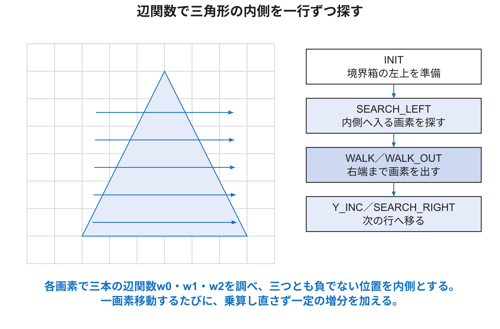

最初に境界箱の一行で左から内側を探し、内側へ入った位置を保存する。右へ進みながら有効fragmentを出し、外へ出たら次の行へ移る。三角形の形に応じて、前の行の左端付近から探すことで、毎行を境界箱の端から完全に探し直す費用を減らす。

<a id="s_S_3"></a>
#### S.3 内側判定

三つの辺関数`w0,w1,w2`はsigned値である。CPU側で向きをそろえた後、符号bitが一つも立っていなければ内側または辺上と判定する。さらにxとyがbounding box内にあることを確認する。

```text
inside = (w0 >= 0) and (w1 >= 0) and (w2 >= 0)
         and x in bounding box and y in bounding box
```

固定したRTLでは`isInTriangle = !(w0[31] | w1[31] | w2[31])`であり、三辺すべてが0以上なら内側とする。0に等しい辺を辺の向きで除外するtop-left規則はない。公式C++記述子生成器とsoftware rasterizerをそのまま呼んだ4×4四角形では、共有対角線の`(0,0)`、`(1,1)`、`(2,2)`、`(3,3)`を二三角形が両方生成した。異なる画素は16個、重複を含むfragmentは20個である。

この結果から言えるのは、「この入力と固定commitでは共有辺が二重に生成される」である。すべての図形で必ず二重になるとは限らず、頂点の固定小数点化とsample格子に依存する。見た目の隙間がないことと、fragmentが一度だけ生成されることも別である。

<a id="s_S_4"></a>
#### S.4 `PUSH`と`POP`の役割

Rasterizerは、属性補間器へ単なる座標だけでなく、増分をどう適用するかのcommandを送る。`RasterizerCommands.vh`には`INIT`、`X_INC`、`X_DEC`、`Y_INC`、`PUSH`、`POP`などがある。

| command | 補間器に求める操作 |
|---|---|
| INIT | 三角形の開始値を読み込む |
| X_INC | x方向増分を加える |
| X_DEC | x方向増分を引く |
| Y_INC | y方向増分を加える |
| PUSH | 現在の左端状態を保存する |
| POP | 保存した左端状態へ戻す |

一行を左端から右端まで描いた後、右端の属性値から次行左端を求めるより、左端で保存した状態へ戻してY増分を加える方が単純である。`PUSH`と`POP`は、この行開始状態の保存・復元を表す。

<a id="s_S_5"></a>
#### S.5 framebuffer indexとy座標

OpenGLの画面座標は左下を原点とする考え方を使う。一方、linearly保存する画像や表示回路は上から下へ読むことが多い。RTL Rasterizerは、概念上次のようにyを反転して一列のindexを作る。

```text
index = ((resolutionY − 1) − y) × resolutionX + x
```

例えば640×480でOpenGL座標`(0,0)`は、memory上では最下行側のoffsetになる。画像が上下反転した場合、頂点変換だけでなく、このindex規則、帯のy offset、表示回路の行順を確認する。

<a id="s_S_6"></a>
#### S.6 `AttributeInterpolationX`の増分更新

`AttributeInterpolationX`は、color、depth、textureの各componentについて、現在値、X増分、Y増分、保存値を持つ。Rasterizer commandに従い、同じcycleで並列に更新する。

```text
INIT  : current = initial
X_INC : current = current + xIncrement
X_DEC : current = current − xIncrement
Y_INC : current = current + yIncrement
PUSH  : saved = current
POP   : current = saved
```

RGBAの四成分、depthのzとw、TMUごとのs,t,qが同じ移動commandを受ける。これにより、画素座標と属性値がずれない。

<a id="s_S_7"></a>
#### S.7 固定小数点のrangeとprecision

固定小数点には、表せる最大範囲と最小刻みのtrade-offがある。32 bitのうち小数部を増やすと細かな値を表せるが、大きな整数を表すbitが減る。RasterIXは属性ごとに異なる形式を選ぶ。

| 属性 | 代表形式 | 重視すること |
|---|---|---|
| texture補間 | S3.28 | 小数精度 |
| depth補間 | S1.30 | 0から1付近の高精度 |
| color補間 | S7.24 | gradient精度と一時的な範囲 |
| 補正後texture座標 | S16.15 | texel index範囲と小数割合 |

形式を変えると、C++変換、descriptor width、RTL slice、乗算結果のshift、test期待値が連鎖して変わる。一つのparameterだけで自由に精度を増やせるとは限らない。

<a id="s_S_8"></a>
#### S.8 遠近補正を段階に分ける

`AttributePerspectiveCorrectionX`は、補間されたqの逆数を近似し、補間済みのs×q、t×qに掛けてsとtを復元する。図S.2は役割だけを示す。

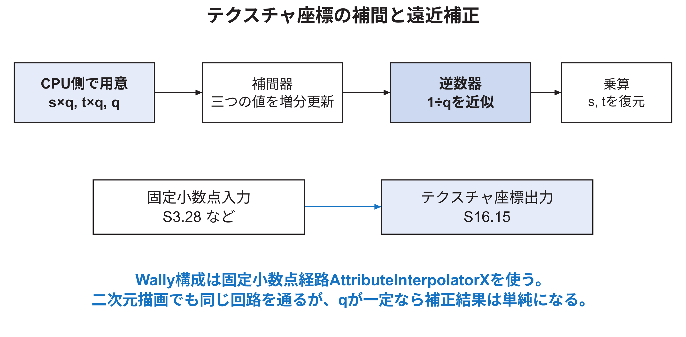

公式RTLのコメントでは、この固定小数点補正pipelineは17 cycleで、最初の段が逆数計算、次が乗算とformat変換を行う。`XRecip`は反復回数を持つ近似回路であり、数学の無限精度の除算ではない。入力qが0または範囲外のときの扱いは、clippingと入力制約を含めて確認する。

<a id="s_S_9"></a>
#### S.9 色とdepthのclamp

補間途中の色は0未満または最大値より大きくなる可能性がある。出力段では負値を0、上位bitが立つ過大値を最大へclampし、画素色のbit幅へ落とす。depthも16 bitへ変換する。

wrap-aroundで255の次が0になると、三角形端に不自然な色が出る。clampはそれを防ぐ。ただし、どの段で何bitを捨てるかによりrounding errorが生じる。gradientのbandingを調べる場合、最終RGB565だけでなく、この中間量子化も見る。

<a id="s_S_10"></a>
#### S.10 Wally構成が使う補間器

`RasterIX_IF`のparameter`RASTERIZER_ENABLE_FLOAT_INTERPOLATION`は既定で0であり、本研究はoverrideしていない。そのためWally構成は`AttributeInterpolatorX`という固定小数点経路を使う。浮動小数点版`AttributeInterpolator`がsource treeにあっても、本bitstreamの実行経路ではない。

「sourceに存在する」ことと「現在のparameterで生成される」ことを区別するため、`RasterIXRenderCore.v`の`generate`条件と、Wally側`rasterix.sv`のinstance parameterを両方確認する。

<a id="s_S_11"></a>
#### S.11 2D一様色で各段はどうなるか

赤い長方形で四頂点の色、z、wが同じ場合、色・depth・wのX増分とY増分は0になる。Rasterizerは多数の画素を列挙するが、補間器は同じ値を次へ渡す。textureが無効ならs,t,qは最終色に使われない。

この簡単な入力はhardware試験に適している。形が壊れればRasterizer、gradientだけ壊れれば補間器、textureを有効にしたときだけ壊れればTMU以降、と段階的に切り分けられる。

<a id="s_S_12"></a>
#### S.12 Rasterizerのsoftware試験とRTL試験

公式unit testには、software rasterizerについて、単一画素、2×2の四角形、水平・垂直、空三角形、退化境界箱、負の辺関数、index、y offset、帯境界、対角pattern、境界上などの例がある。固定commitでsoftware CTest 9件を実行し、全件成功した。[RasterIX](#ref_RasterIX)

一方、`unittest/verilator/cpp/sim_rasterizer.cpp`は実質的に空の`main`で、VerilatorのCTestへRTL `Rasterizer.v`単体試験として登録されていない。Verilator CTest 31件は全件成功し、属性補間、遠近補正、float-to-fixed変換、TextureSampler、FramebufferScissorなどは含むが、RTL Rasterizerの画素集合そのものを網羅する試験にはならない。したがって、本付録では「RTL Rasterizerも公式試験済み」とは主張しない。

これらの試験は、Wallyとの統合全体を証明するものではない。しかし辺関数と走査規則の変更を行うとき、実機だけで異常を探すより小さな反例を早く見つけられる。

<a id="s_S_13"></a>
#### S.13 数値を追う練習

三頂点`A=(0,0)`、`B=(4,0)`、`C=(0,3)`を考える。まずareaを計算し、点`P=(1,1)`について三辺のEを求める。次にPを`(2,1)`へ動かした差が、計算したX増分と一致するか確かめる。最後に、Aが赤、Bが緑、Cが青の場合のbarycentric colorを計算する。

この手計算の目的は、大きなtriangle全体を描くことではない。符号、頂点順、一画素の増分、属性の重みという四点を、RTL信号へ対応できるようにすることである。計算結果がsoftware testと一致した後に波形を見る。

<a id="ch_T"></a>
### 付録T textureとPixel Pipeline

<a id="s_T_1"></a>
#### T.1 textureとは何を保存するものか

textureは、図形の表面へ対応付ける画像である。画像の一要素をpixelと区別してtexelと呼ぶ。pixelは画面上の位置、texelはtexture画像内の位置である。一つのpixelを決めるとき、texture座標`s,t`から一つまたは周囲のtexelを読み、その色を頂点色などと組み合わせる。

文字もtextureで描ける。一文字分のbitmapをtextureへ置き、文字を表示する長方形に貼る。複数文字を一枚のtexture atlasへ並べ、各文字の`s,t`範囲だけを選ぶ方法も一般的である。本研究の文字描画でtextureを使うことは、三次元表示を意味しない。

<a id="s_T_2"></a>
#### T.2 textureがhardwareへ届くまで

textureの元画像はCPU側でformat変換され、texture memory managerがdevice memory上のpageを割り当てる。`DeviceDataUploader`は`OP_STORE`によりtexture dataをDDR3へ置く。描画時、texture stream commandは使用するpage addressの列をhardwareへ伝える。

`PagedMemoryReader`はpage addressに従ってAXI readを発行し、現在使うtextureを`TextureBuffer`へ読み込む。`TextureBuffer`はTMUごとに一つあり、一つのtexture全体を保持する設計である。公式説明では代表的に256×256×16 bitで128 KiBとなる。[RasterIX](#ref_RasterIX)

| 段階 | 保存場所 | 内容 |
|---|---|---|
| 元画像 | CPU memory／SD card | PNGなどから得た画素 |
| device texture memory | DDR3 | page単位で配置したtexture data |
| TextureBuffer | FPGA内部memory | 現在TMUがsampleするtexture |
| filter出力 | pipeline register | 一fragment分のtexture色 |

<a id="s_T_3"></a>
#### T.3 page方式を使う理由

textureを連続する大領域だけで管理すると、異なる大きさの追加・削除で空き領域が断片化しやすい。page方式では、一定sizeのpageを複数割り当て、texture commandがpage addressを列挙する。hardwareは必要なpageを順に読む。

page size、最大texture size、page数はC++設定とhardware構成の両方に関係する。`RenderConfigs.hpp`は、最大textureのbyte数とmipmap分を考慮して必要page数を計算する。本研究のCMake設定は`NUMBER_OF_TEXTURE_PAGES=4096`、`NUMBER_OF_TEXTURES=256`であるが、これは同時に4096枚のtextureを内部保持する意味ではない。 更新版E6では、1ページ当たりのバイト数を2,048へそろえた。このページサイズと、確保するページの個数4096は別の設定である。

<a id="s_T_4"></a>
#### T.4 一つのTMUの内部順序

`TextureMappingUnit.v`は、概ね次の四段を持つ。

1. `LodCalculator`がmipmap levelを選ぶ。
2. `TextureSampler`が周囲の四texelを読む。
3. `TextureFilter`が必要なら四色を混ぜる。
4. `TexEnv`がtexture色と前段色などを組み合わせる。

公式コメントの代表的なpipeline depthは、LOD 1 cycle、sample 5 cycle、filter 4 cycle、TexEnv 4 cycleで、合計14 cycleである。機能を無効にした場合のgenerateやbypassにより実効経路は変わる。

<a id="s_T_5"></a>
#### T.5 なぜ四texelを同時に読むか

線形filterでは、座標を囲む左上、右上、左下、右下の四texelを使う。整数部が左上texelの場所を、小数部が横・縦の混合割合を決める。

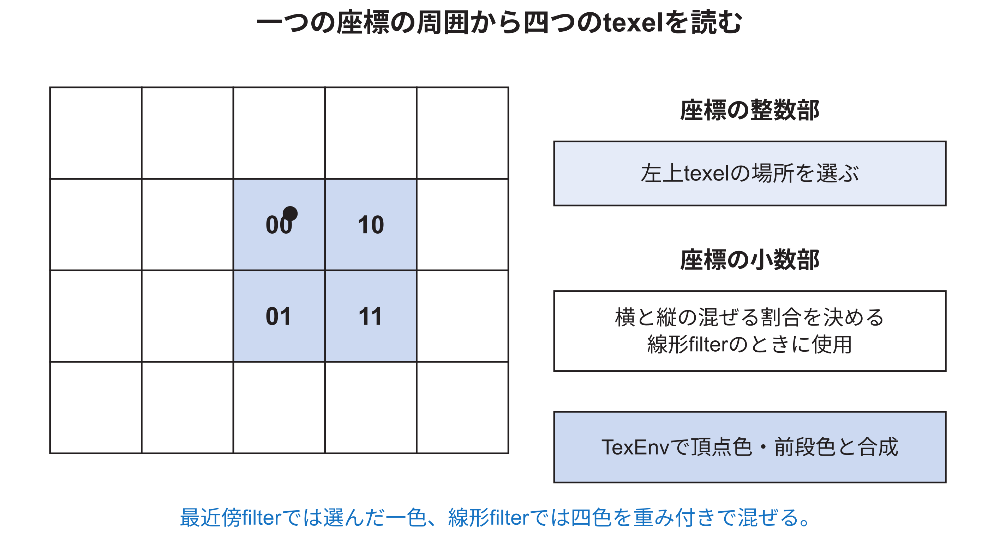

texture座標がちょうどtexel中心なら一色の影響が大きい。二texelの中間なら両方をほぼ半分ずつ混ぜる。最近傍filterでは小数部に応じて一色を選ぶ。線形filterは滑らかになるが、乗算・加算と複数read portが必要になる。

<a id="s_T_6"></a>
#### T.6 `TextureBuffer`のmemory構成

一cycleに四texelを得るには、一portの単純RAMを四回読むだけでは毎cycleのthroughputを保てない。`TextureBuffer`と下位RAMは、bankingまたは複数のmemory配置を使い、2×2のtexel quadをまとめて取り出せるようにする。具体的なaddress bitとbank選択は`TextureBuffer.v`、`MipmapOptimizedRam.v`、`TextureSampler.v`で追う。

変更時には、論理上のtexture addressと、各BRAM bankのaddressを分ける。偶数・奇数のs,tによるbank選択を誤ると、縞模様や2画素周期の入れ替わりが生じる。

<a id="s_T_7"></a>
#### T.7 wrapとclamp

texture座標が範囲外へ出たとき、端のtexelに固定するclampと、反対側へ繰り返すrepeatがある。texture widthとheightは2の冪として設定され、maskや上位bitを使ったaddress生成を簡単にする。

四texel samplingでは、右端または下端で隣のtexelを読む場合もwrap／clampを適用する必要がある。中心座標だけを範囲内へ直し、隣接addressをそのまま増やすと、端で別行や別memory領域を読む。

<a id="s_T_8"></a>
#### T.8 mipmapとLOD

mipmapは、元textureを段階的に縮小した画像群である。画面上でtextureが小さく見えるとき、元の高解像度から少数sampleを選ぶとaliasingが出る。LODは、どの縮小levelを使うかを決める値である。

RasterIXの`LodCalculator`は、現在のtexture座標と画面上で一画素ずらした位置の座標差から変化量を推定する。mipmap機能を無効にした構成では、この計算をbypassできる。二次元の等倍spriteではlevel 0だけで足りる場合が多いが、拡大縮小を行うならfilterとLODの見た目を確認する。

<a id="s_T_9"></a>
#### T.9 `TexEnv`が色を組み合わせる

sampleしたtexture色をそのまま出すとは限らない。`TexEnv`は、texture色、頂点から補間したprimary color、前のTMUの色、constant colorをsourceとして、replace、modulate、addなどの演算を行う。

例えば白い文字glyphのalphaをtextureに持ち、頂点色を赤にすると、texture alphaで形を決め、RGBは赤にできる。逆にtexture RGBをそのままreplaceすれば、元画像の色を使う。

<a id="s_T_10"></a>
#### T.10 一つのTMUを使う本構成

Wally側のinstanceは`TMU_COUNT=1`である。`PixelPipeline`はTMU0を通り、二個目のTMU経路は構成に応じて生成されないかbypassされる。C++側も同じ`RIX_CORE_TMU_COUNT=1`でbuildする必要がある。

hardwareだけ2、softwareだけ1にすると、descriptor語数、register、texture状態の解釈がずれる。TMU数は性能・資源だけでなく、software／hardware ABIに関わる構成値である。

<a id="s_T_11"></a>
#### T.11 fogの位置

`PixelPipeline`はTMUの後にfogを適用する。fogはdepthまたはdistanceに応じ、現在色とfog colorを混ぜる。二次元ゲームでは通常無効にするが、pipeline上のbypass条件とlatencyには関係する。

fog LUTは専用stream commandで更新される。単なる一個のregisterではなく、複数entryのtableであるため、command parserがfog用streamへpayloadを振り分ける。

<a id="s_T_12"></a>
#### T.12 TMU無効時のbypass

公式設計ではTMUが無効なら、計算したtexture色ではなく前段の色を転送する。これは「黒を出す」動作ではない。textureを使わない一様色の長方形は、補間された頂点色がそのままfogまたはper-fragment段へ進む。

無効機能のbypassにも、valid、last、keep、座標、indexを同じlatencyで渡す必要がある。data colorだけをbypassし、controlが別の遅延になると画素がずれる。

<a id="s_T_13"></a>
#### T.13 RGB565とtexture format

外部color bufferはRGB565を使う。texture側は設定したpixel formatに応じてRGBやalphaを展開し、内部のsubpixel幅へ変換する。RGB565は赤5 bit、緑6 bit、青5 bitで、alphaを持たない。

| component | bit数 | 段階数 |
|---|---:|---:|
| red | 5 | 32 |
| green | 6 | 64 |
| blue | 5 | 32 |

薄いgradientでは色段差が見える可能性がある。texture sampleの誤りと最終RGB565量子化を分けるため、単色pattern、原色、段階gradientを使う。

<a id="s_T_14"></a>
#### T.14 texture異常の見分け方

| 見え方 | 候補 | 小さな試験 |
|---|---|---|
| 2画素周期の色交換 | bank／近傍address | 2×2で四色が異なるtexture |
| 端だけ別の色 | wrap／clamp | 端を目立つ色にしたtexture |
| 全体が一色 | TMU無効、page未読込、TexEnv | 4×4 checkerboard |
| 拡大時だけ崩れる | fractional座標、filter | 2倍拡大した格子 |
| 縮小時だけちらつく | LOD／mipmap | 段階別に色を変えたmipmap |
| 色は正しくalphaだけ無効 | format／TexEnv／blend | 透明・半透明・不透明の三領域 |

<a id="s_T_15"></a>
#### T.15 texture変更の検証順

texture formatを追加する場合、最初からゲームを動かさない。次の順で範囲を広げる。

1. C++で既知の数画素を正しいpacked値へ変換する試験。
2. `TextureSampler`へ小さなRAM内容と整数座標を与えるRTL試験。
3. 小数座標で最近傍と線形filterを比較する試験。
4. wrap／clampの四辺と四隅を試す。
5. TexEnvをreplaceに固定して色だけ確認する。
6. blendとalphaを有効にする。
7. 実機で拡大画像と1:1画像を比較する。

複数機能を同時に有効にすると、誤りがsample、filter、TexEnv、blendのどこか分からなくなる。

<a id="ch_U"></a>
### 付録U Per-Fragment Pipelineで最終色を決める

<a id="s_U_1"></a>
#### U.1 fragmentはまだ画面に書かれたpixelではない

Rasterizerが三角形内の一位置を生成し、色やdepthが付いた段階をfragmentと呼ぶ。fragmentは候補であり、alpha、depth、stencil testで捨てられる場合がある。blendにより既存色と混ざる場合もある。Framebufferへ書かれて初めて保存されたpixelになる。

<a id="s_U_2"></a>
#### U.2 新しい値と既存値をそろえる

`PerFragmentPipeline`の入力には、新しいfragmentの色・depthだけでなく、同じindexから読んだ既存color、depth、stencilが必要である。`StreamConcatFifo`がこれらを対応付ける。

例えば新しいfragment Aの色と、次のfragment Bの既存depthが組み合わさると、depth testが別画素の値で行われる。valid／ready停止中にも順序と対応を保つことが重要である。

<a id="s_U_3"></a>
#### U.3 三つの試験と色の演算

図U.1は、最終的な書込み判断を単純化して示す。

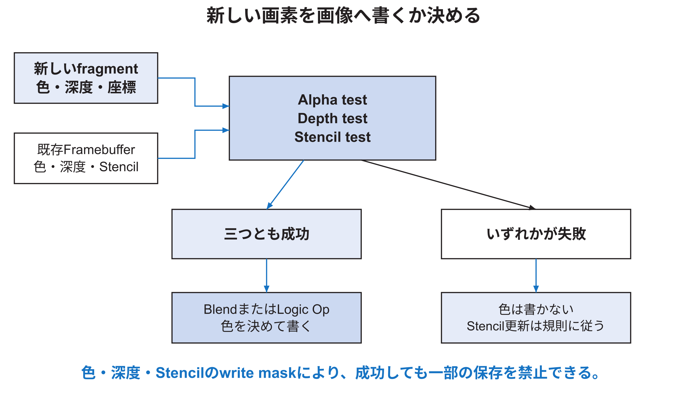

alpha、depth、stencilの三試験が成功し、`keep`が有効なら、色と必要なdepth／stencilを書ける。失敗時もstencil operationは、stencil失敗、depth失敗、全成功という場合ごとの規則に従う。

<a id="s_U_4"></a>
#### U.4 alpha test

alpha testは、新しいfragmentのalphaとreference値を比較する。比較関数にはnever、less、equal、less-or-equal、greater、not-equal、greater-or-equal、alwaysなどがある。透明部分を完全に捨てる文字やspriteに使える。

alpha testはblendと異なる。alpha testはfragmentを通すか捨てるかの二択、blendは通ったfragmentの色を既存色と混ぜる処理である。半透明を表すには通常blendを使う。

<a id="s_U_5"></a>
#### U.5 depth test

depth testは、新しいdepthと保存済みdepthを比較し、手前にあるものなどを残す。二次元ゲームで描画順を明示し、depthを使わないなら無効化できる。無効化してもdepth buffer回路をparameterで削除したとは限らず、実行時にbypassしている場合がある。

同じdepth値に対して`LESS`を使うか`LEQUAL`を使うかで、共有面や重ね描きの結果が変わる。二次元で同じzの四角形を重ねるなら、depthを無効にしてdraw orderを使うか、zを分けるか、比較関数を意識する。

<a id="s_U_6"></a>
#### U.6 stencil testと三種類のoperation

stencil bufferは各画素に小さな整数を保存し、maskのように使う。testは保存値とreferenceを比較する。さらに、次の三場合で保存する値を変えられる。

| 場合 | operationの例 |
|---|---|
| stencil test失敗 | keep、zero、replaceなど |
| stencil成功・depth失敗 | increment、decrementなど |
| stencilとdepth成功 | replaceなど |

本構成の内部stencilは4 bitである。0から15の範囲を持つ。8 bitの一般的なGPUと同じ範囲だと思い込まない。

<a id="s_U_7"></a>
#### U.7 blending

blendは、新しいsource色と既存destination色へ係数を掛け、加える。単純化すると次である。

```text
output = source × sourceFactor + destination × destinationFactor
```

典型的なalpha blendでは、source factorをsource alpha、destination factorを1−source alphaにする。alpha=1なら新しい色、alpha=0なら既存色、0.5ならほぼ半分ずつになる。

固定bit幅の演算ではroundingとsaturationがある。理想実数の式と完全に同じであるとは限らない。公式software testの`BlendFunc`とRTL出力を比較する。

<a id="s_U_8"></a>
#### U.8 logic operation

logic opは、sourceとdestinationのbitごとにAND、OR、XOR、copyなどを行う。blendと同時に最終色へ適用するのではなく、設定によりlogic op側またはblend側の結果を選ぶ。bit単位の演算なので、知覚的な明るさを混ぜる処理とは異なる。

二次元の選択枠や反転表示にはXORが使える場合がある。しかし同じ場所へ二回描けば元へ戻るなど、描画回数に依存する。通常の半透明spriteにはblendを使う。

<a id="s_U_9"></a>
#### U.9 color、depth、stencilのwrite mask

試験が成功しても、write maskが0なら対応するbufferを更新しない。color maskはcomponentごと、depth maskはdepth書込み、stencil maskはbitごとの書込みを制御する。

例としてdepth prepassではcolor書込みを無効にしてdepthだけ作る。二次元研究では使わなくても、状態が前の描画から残ると「何も描かれない」原因になる。描画前に必要なstateを明示する。

<a id="s_U_10"></a>
#### U.10 処理の並列性

`PerFragmentPipeline`では、blend、logic op、alpha test、depth test、stencil testの候補計算を並列に進め、最後に結果とenableからwriteを決める。ソースコードの行順が、そのまま時間順に一つずつ処理されるわけではない。

Verilogの連続代入や別module instanceは並列回路となる。`always @(posedge aclk)`内でも、nonblocking assignmentは同じclock edgeでregister更新する。C++の逐次実行の読み方をそのまま適用しない。

<a id="s_U_11"></a>
#### U.11 Pipelineを停止する`ce`

出力先Framebufferが受け取れないとき、`m_frag_tready=0`となり、PerFragment内部のpipeline registerを`ce=0`で止める。新しいfragmentの演算値だけでなく、test結果、座標、index、lastを同じ位置に保持する。

この停止が正しいかは、連続入力でreadyを途中だけ0にし、停止前後の出力列がready常時1の結果と同じになるか比較する。出力時刻は遅れてよいが、値と順序と個数は変わってはならない。

<a id="s_U_12"></a>
#### U.12 二次元文字の具体例

白いglyph textureのalphaを使い、文字色を青、背景を黒とする。texture sampleのalphaが0ならalpha testで捨てる。alphaが1なら青を保存する。antialiasされた端で0と1の間を持つなら、alpha testだけでは階段状になり、blendで背景と混ぜる方が滑らかになる。

文字が長方形の背景まで塗る、縁が黒くなる、二回目だけ壊れる場合は、次を分けて確認する。

1. textureのRGBとalphaのformat。
2. TexEnvが頂点色とtexture alphaをどう組み合わせるか。
3. alpha testの比較関数とreference。
4. blend factor。
5. 前のstateが次の文字へ残っていないか。
6. 部分描画で背景を正しく描き直したか。

<a id="s_U_13"></a>
#### U.13 重なる四角形の具体例

最初に赤い四角形、次に半透明青の四角形を重ねる。depth無効、標準alpha blendなら、重なりは紫に近い色になる。順序を逆にすれば別の色になる。blendは可換ではないためである。

部分描画で古いボール位置を黒く塗るだけでは、そこにあった赤いblockも消える。この問題はPerFragmentの誤りではなく、どの図形をどの順で再描画するかというgame renderer側の問題である。hardwareが正しく上書きしているからこそ、背景や重なる物体の再描画が必要になる。

<a id="s_U_14"></a>
#### U.14 PerFragment変更の単体試験

| 変更対象 | 最小入力 | 確認する境界値 |
|---|---|---|
| alpha test | alphaとreference | 直前、等値、直後 |
| depth test | sourceとdestination depth | 0、同値、最大 |
| stencil | 4 bit値とmask | 0、15、overflow、underflow |
| blend | source／destination原色 | alpha 0、1、0.5 |
| logic op | bit pattern `0xAAAA`と`0x5555` | 各truth table |
| write mask | 全componentが異なる色 | 禁止bitが保存値を保つか |

個別演算のsoftware testで期待値を作り、VerilatorでRTLを試し、最後に統合画像を確認する。

<a id="ch_V"></a>
### 付録V 内部Framebuffer、DDR3、表示まで

<a id="s_V_1"></a>
#### V.1 三種類のbufferを分ける

本構成でbufferという語は複数のものを指す。

| buffer | 保存内容 | 主な場所 |
|---|---|---|
| display list buffer | 描画命令列 | CPUが使うDDR3領域 |
| internal framebuffer | 現在の帯のcolor／depth／stencil | FPGA内部BRAM |
| external color buffer | 完成画像 | DDR3 |
| command／response FIFO | 32 bitの転送語 | clock境界のFIFO |
| display reader FIFO | 映像出力前の画素 | 表示回路内部 |

front buffer／back bufferと呼ぶ場合は、多くはexternal color bufferの二枚を指す。internal framebufferの色・depth・stencil三種やdisplay list二組とは別である。

<a id="s_V_2"></a>
#### V.2 `InternalFramebuffer`の二port

各internal framebufferは、通常描画用のread／writeと、clear・commit・readなどのcommand用accessを両立させる。内部RAMはdual-portとして扱われ、一方をfragment pipeline、他方をcommand handlerが使う。

ただし、両者が同じaddressへ同時に異なる操作をした場合の優先順位やRAM primitiveのread-during-write挙動が問題になる。`applied`信号によりcommand中は通常経路を適切に止め、同じ領域を無秩序に操作しない。

<a id="s_V_3"></a>
#### V.3 color、depth、stencilは別々のmemory

`RasterIXCoreIF`は、color、depth、stencilのinternal framebufferを別moduleとしてinstance化する。代表的なbit幅はcolorが内部parameterに応じたRGB、depth 16 bit、stencil 4 bitである。外部color streamはRGB565として扱う。

三つを別memoryにすることで、colorだけ、depthだけ、stencilだけのclearやread/write enableを持てる。一方、同じfragmentについて三つのread結果をそろえる必要があり、`StreamConcatFifo`が使われる。

<a id="s_V_4"></a>
#### V.4 MEMSET、READ、COMMIT、SWAP

内部Framebuffer周辺の四操作を図V.1に示す。

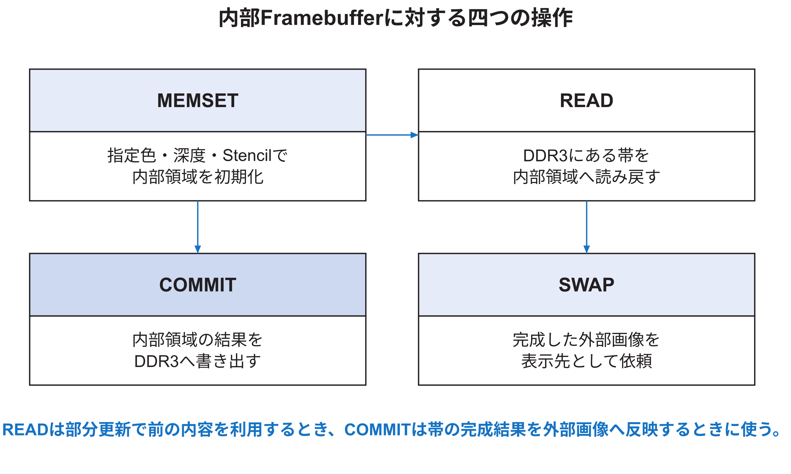

`MEMSET`は内部領域をclear値で埋める。scissorが有効なら対象外を保てる。`READ`はDDR3に残る前の帯を内部へ読み戻す。`COMMIT`は内部の結果をDDR3へ書き出す。`SWAP`は完成したexternal color bufferの表示切替を依頼する。

<a id="s_V_5"></a>
#### V.5 部分描画でREADが必要になる理由

毎frame全画面を描き直すなら、内部帯をclearし、すべての物体を描き、commitできる。変更領域だけを描く場合、変えていない画素を保つ必要がある。external bufferに前の画像があり、内部BRAMは別の帯や別frameに再利用されているため、対象帯の旧画像を`READ`で戻してから一部を上書きする。

ただし本研究の最適化は、二枚のexternal bufferそれぞれに残る状態をsoftwareでも管理する。表示中でないbufferへ次の画像を作るため、そのbufferが何frame前の状態かを考え、必要な物体を描き直す。

<a id="s_V_6"></a>
#### V.6 640×480を五帯へ分ける計算

画面は640×480で307,200画素、internal framebufferは`2^16=65,536`画素である。公式`RenderConfig::getDisplayLines()`は、最大画面が内部sizeと完全一致しない場合、整数除算の商へ1を加える。この設定では`307,200÷65,536=4`余りがあるため5帯になる。

実行時は480行を5帯へ分け、一帯96行とする。一帯は`640×96=61,440`画素で、65,536画素以内に収まる。残る4,096画素はこの帯では使わない。

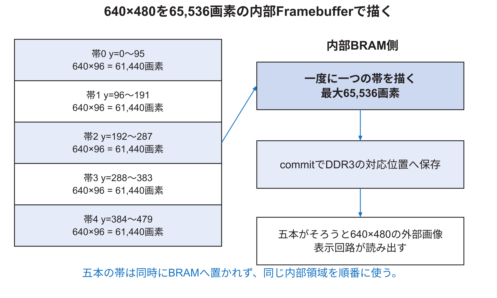

<a id="s_V_7"></a>
#### V.7 一つの図形を帯ごとに扱う

高さ100画素の長方形が帯0と帯1にまたがる場合、各帯のdisplay listに、その帯と重なる三角形を入れる。帯1では、[Q.14](#s_Q_14)で説明したように属性開始値を帯の開始行まで進める。

図形数が同じでも、帯をまたぐ大きな図形は複数帯で処理される。internal framebufferを大きくすれば帯数を減らせるが、BRAM使用量が増える。性能とresourceのtrade-offを測る対象になり得る。

<a id="s_V_8"></a>
#### V.8 external color bufferと二重buffering

表示回路がbuffer Aを読み続ける間に、RasterIXはbuffer Bへ次frameを作る。完成したら表示先をBへ切り替え、その後Aを次の描画先にできる。これにより、表示途中の画像へ書き込み、上半分だけ新frameになるtearingを避けやすい。

`RIX_CORE_COLOR_BUFFER_LOC_1`と`LOC_2`は、texture memory baseからのoffsetとして設定する。本構成では0x01e00000と0x01c00000を使う。CMakeの値、Linux reserved-memory、RTLが見る物理address、表示回路が読むaddressが一致しなければならない。

<a id="s_V_9"></a>
#### V.9 起動直後に両bufferを初期化する

programを再実行してもDDR3上の二枚の外部画像が自動で0になるとは限らない。一枚だけを全画面描画し、その直後から部分描画へ移ると、もう一枚へ切り替えたとき古い実行の画像が現れる。

そのため二枚それぞれに確実な全画面状態を作ってから部分描画へ入る。本研究のrendererが最初の複数回を全体描画にするのは、この二重bufferの履歴をそろえるためである。内部BRAM一個をclearしただけでは、二枚の外部bufferは初期化されない。

<a id="s_V_10"></a>
#### V.10 commitのmemory転送

`InternalFramebufferCommandHandler`は、内部RAMから順に画素を読み、外部streamへ出す。後段のadapterがAXI write burstを作る。color、depth、stencilは選択bitに応じて個別にcommitできる。

転送先が止まれば、内部readの結果を失わないようstreamを停止・bufferする。commit完了は、最後の画素を内部から読んだだけではなく、定義された外部受渡しが完了した状態で判断する。

<a id="s_V_11"></a>
#### V.11 readのmemory転送

READは外部memoryからAXI readを行い、返ったdataを内部RAMへ書く。requestを出した順とresponseのID、burstのlast、画素packingを一致させる必要がある。本構成のAXI data幅は64 bitで、RGB565なら一beatに複数画素が入る。

address alignment、末尾の有効画素、帯の実画素数61,440と内部最大65,536を区別する。使わない残り4,096画素まで誤ってcommitすると、次のmemory領域を上書きする危険がある。

<a id="s_V_12"></a>
#### V.12 表示切替handshake

RasterIXは`swap_fb`と`fb_addr`で新しい表示先を要求する。表示回路は安全な時点でaddressを取り込み、`fb_swapped`で完了を返す。本研究ではこのhandshakeから`GPUFrameDone`を作り、clock境界を越えてCPU側`FRAME_COUNT`を増やす。

完了countが増えたことは、回路が定める表示先切替を受理したことを示す。ディスプレイが全画面を実際に表示し終えた時刻や、人が見た時刻までは示さない。映像captureによる確認とcounter測定を分ける。

<a id="s_V_13"></a>
#### V.13 DVI送信とRasterIXの境界

公式RasterIXの内部Framebufferは完成画素を作り、外部DDR3へ置く。本研究の標準構成では、別の表示回路がDDR3を読み、HDMI OUT端子からDVI形式を送る。したがって映像timing、TMDS serialization、aspect ratioは表示回路側の責務であり、triangle Rasterizerの責務ではない。

画面が横長に伸びる場合、まずcaptureまたはmonitor側が640×480の4:3を16:9へ引き伸ばしていないか確認する。Framebuffer内で正方形の幅・高さを画素数で数え、映像表示後の見た目と分ける。

<a id="s_V_14"></a>
#### V.14 memory帯域を概算する

640×480のRGB565一枚は`640×480×2=614,400 byte`である。60 frame/sで表示回路が読むだけなら約36.9 MB/sとなる。描画側のcommitも毎frame全画面なら同量のwriteが加わる。READを毎frame行えばさらに同量のreadが加わる。

これは最小限のcolor trafficの概算であり、texture、depth、stencil、AXI overhead、burst境界、CPU accessは含まない。理論DDR帯域より小さいというだけで、stallがないとは言えない。瞬間的な競合、arbitration、latency、短いburstを測る必要がある。

<a id="s_V_15"></a>
#### V.15 内部Framebuffer sizeを増やす判断

`FRAMEBUFFER_SIZE_IN_PIXEL_LG`を16から17へ増やすと、65,536から131,072画素になり、640×480を三帯程度に減らせる。一方、color、depth、stencilの各memoryが増え、BRAM使用量とroutingが変わる。texture bufferもBRAMを使うため、単にresource表の「空きBRAM」がそのまま利用可能とは限らない。

変更前に次を比較する。

| 観点 | 期待される変化 |
|---|---|
| 帯数 | 減る |
| 同じ図形の再処理 | 帯をまたぐ回数が減る可能性 |
| commit回数 | 減る |
| 一回のcommit長 | 増える |
| BRAM | color、depth、stencil分増える |
| timing | 大きなRAMとroutingで悪化する可能性 |
| software ABI | 同じparameterで再buildが必要 |

resourceに余りがあることだけで最善とは決めない。実際のframe時間、帯別命令数、stall、timing slackを比較する。

<a id="s_V_16"></a>
#### V.16 IFからEFへ変える場合

EFへ変えると、内部帯のclear／read／commitという流れが変わり、fragmentごとに外部Framebufferへaccessする。software設定、top module、memory port、性能特性が大きく変わるため、単純なparameter変更ではない。

比較実験を行うなら、同じresolution、同じgame state、同じtexture、同じclock、同じexternal memory条件をそろえ、frame timeだけでなくAXI request数、stall、resourceを測る。IFの結果からEFの優劣を推測して結論にしない。

<a id="ch_W"></a>
### 付録W RasterIXを変更・検証できる開発手順

<a id="s_W_1"></a>
#### W.1 読んだことと確認したことを分ける

開発者は、sourceから分かる設計意図、simulationで確認した論理、合成で確認した回路成立、実機で確認した外部挙動を分ける。

| 証拠 | 強く言えること | まだ言えないこと |
|---|---|---|
| source読解 | 実装された条件とdata path | そのpathが実機で使われたか |
| software unit test | C++参照処理の例 | RTLの一致 |
| Verilator unit test | 対象RTLの入力出力 | SoC全体とtiming |
| synthesis／timing | resourceと時間制約成立 | game画像の正しさ |
| 実機counter | 定義したeventの回数・時間 | 人が見た映像の完全性 |
| capture画像 | end-to-endの見た目 | 内部で偶然相殺した誤りの不存在 |

「開発者並み」とは、最も強い証拠だけを集めることではなく、疑問に必要な証拠を選べることである。

<a id="s_W_2"></a>
#### W.2 公式unit testを実行する

RasterIXにはC++ software testとVerilator RTL testがある。公式READMEの手順は次である。[RasterIX](#ref_RasterIX)

```bash
cd /path/to/wally-game-console/addins/rasterix

cmake --preset unittest_software
cmake --build build/unittest-software -j8
ctest --test-dir build/unittest-software --output-on-failure

cmake --preset unittest_verilator
cmake --build build/unittest-verilator -j8
ctest --test-dir build/unittest-verilator --output-on-failure
```

Verilatorのversionなど依存関係が合わない場合、失敗を回路不良と断定しない。configure logで「toolがない」「optionが変わった」「compile error」「test assertion」のどこかを分ける。

<a id="s_W_3"></a>
#### W.3 どの試験がどのmoduleを扱うか

| 対象 | 公式試験の例 | 確認内容 |
|---|---|---|
| CPU側Rasterizer | `test_Rasterizer.cpp` | 画素集合、index、帯offset、境界 |
| CPU側属性補間 | `test_AttributeInterpolator.cpp` | 色、depth、texture補間 |
| texture演算 | `test_TextureMap.cpp`、`test_TexEnv.cpp` | samplingと色合成 |
| alpha／depth比較 | `test_TestFunc.cpp` | 比較関数 |
| blend／logic／stencil | 対応software test | 個別演算 |
| FrameStreamingCore | `sim_FrameStreamingCore.cpp` | 転送、停止、長さ、channel |
| fixed補間 | `sim_AttributeInterpolationX.cpp` | 増分command |
| 遠近補正 | `sim_AttributePerspectiveCorrectionX.cpp` | q逆数とformat |
| texture sampler | `sim_TextureSamplerTestModule.cpp` | 四texel読出しとfilter |
| internal FB command | `sim_InternalFramebufferCommandHandler.cpp` | memset、commit、read、停止 |
| FIFO結合 | `sim_StreamConcatFifo.cpp` | 複数streamの対応 |

公式試験に`CommandParser`全体や`PerFragmentPipeline`全体の直接testが見当たらない場合、下位演算のtestがあることをもって全体が完全に検証済みとはしない。変更範囲に応じて統合testを追加する。

<a id="s_W_4"></a>
#### W.4 一つの変更を小さく定義する

「RasterIXを高速化する」は大きすぎる。次のように、入力、変更点、期待出力、非変更条件を一文で定義する。

```text
RGBA=(255,0,0,128)のsourceとRGB=(0,0,255)のdestinationに対し、
標準alpha blendのroundingを変更する。depthとstencilの判定、
valid／ready、出力順序は変えない。
```

この一文から、必要なsoftware期待値、RTL module、境界値、画像testを選べる。

<a id="s_W_5"></a>
#### W.5 開発の確認loop

図W.1の順に、小さなtestから実機へ進み、差が出た段へ戻る。

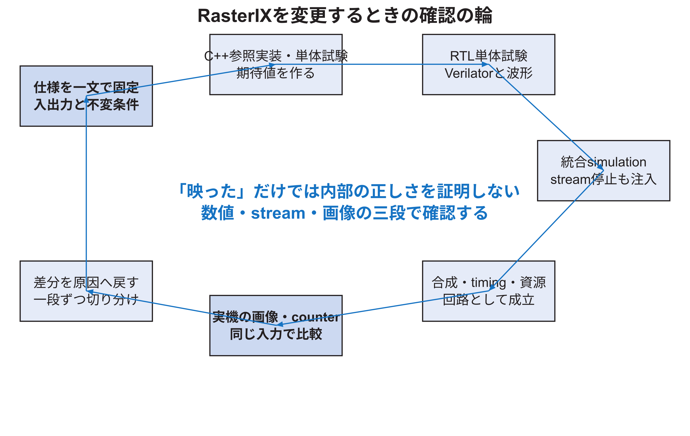

実機で映ったことは重要だが、それだけでは境界値やstall時の正しさを十分に確認できない。反対にunit testだけではWally、DDR3、表示回路まで通ることを示さない。

<a id="s_W_6"></a>
#### W.6 waveformで最初に見る信号

すべてのinternal signalを追加する前に、module境界のhandshakeを見る。

| 境界 | 最初に見る信号 |
|---|---|
| command FIFO→RasterIX | data、valid、ready、last |
| FrameStreamingCore→CommandParser | data、valid、ready、last |
| CommandParser→Rasterizer config | valid、ready、streamCounter |
| Rasterizer→補間器 | x、y、index、command、valid、ready、keep、last |
| 補間器→PixelPipeline | color、depth、s、t、valid、ready |
| Pixel→PerFragment | 新色と旧buffer値のvalid対応 |
| PerFragment→Framebuffer | write enable、index、color、depth、stencil |
| commit→AXI | AW、W、Bの各valid／ready／last |

data busが広すぎる場合、最初はindexとvalid／readyだけを見る。欠落・重複がなければ、異常が出る一indexのdataを詳しく見る。

<a id="s_W_7"></a>
#### W.7 ready停止を意図的に入れる

stream回路のbugは、readyが常に1では現れないことが多い。testbenchで、規則的または擬似乱数的にreadyを0にし、受け渡した要素の列をreferenceと比較する。

確認条件は次である。

```text
受信した要素列 = 送信した要素列
順序は同じ
重複なし
欠落なし
lastの位置は同じ
stall中にdataとcontrolを保持
```

時間が延びることは正常である。要素列が変わることが異常である。

<a id="s_W_8"></a>
#### W.8 新しいrender config registerを追加する例

例として、debug用に出力colorを強制するregisterを追加すると仮定する。

1. 未使用のregister番号とbit配置を決める。
2. C++側に`WriteRegisterCmd`を生成するsetterを作る。
3. `CommandParser`のregister streamが新番号を受けることを確認する。
4. config register bankへ値を保存する。
5. `PerFragmentPipeline`手前へenableとcolorを配線する。
6. disable時は従来出力とbit単位で一致させる。
7. reset後disableとなる既定値を定める。
8. command encode、register decode、color override、stallのtestを作る。

debug機能でも、未使用時にtimingやresourceへ影響し得る。最終版へ残すか、simulation専用にするか決める。

<a id="s_W_9"></a>
#### W.9 blend modeを追加する例

blend factorまたは式を追加する場合、`ColorBlender.v`だけでなく、OpenGL enumからinternal enumへの変換、config bit幅、software reference、RTL truth tableを変更する。

同じ番号を別の意味へ再利用すると、古いprogramが別のblendを実行する。既存番号を保ち、新しい番号を末尾へ追加する。config fieldのbit数が足りなければ、命令ABI変更として扱う。

<a id="s_W_10"></a>
#### W.10 texture formatを追加する例

texture formatは、upload時のbyte列、memory size計算、samplerのunpack、alpha既定値、filter内部bit幅、TexEnv入力へ影響する。次の四画素から始める。

| 位置 | 色 | 目的 |
|---|---|---|
| 左上 | 赤 | channel順 |
| 右上 | 緑 | addressのx方向 |
| 左下 | 青 | addressのy方向 |
| 右下 | 白・半透明 | alphaとfilter |

2×2を整数座標で正しく読めた後、小数座標、端、mipmapへ広げる。

<a id="s_W_11"></a>
#### W.11 internal framebuffer sizeを変える例

size変更では、RTL instanceの`FRAMEBUFFER_SIZE_IN_PIXEL_LG`とC++の`RIX_CORE_FRAMEBUFFER_SIZE_IN_PIXEL_LG`を同じ値にする。帯数、帯高さ、display list buffer数、commit size、BRAM resource、timingを再確認する。

比較表には、少なくとも次を残す。

| 指標 | 変更前 | 変更後 |
|---|---:|---:|
| internal画素数 | 65,536 | 測定値 |
| 帯数 | 5 | 計算値 |
| 一frameのtriangle command数 | 測定値 | 測定値 |
| command送信時間 | 測定値 | 測定値 |
| Rasterizer stall cycle | 測定値 | 測定値 |
| BRAM／LUT／FF | report | report |
| worst slack | report | report |
| end-to-end frame時間 | 測定値 | 測定値 |

<a id="s_W_12"></a>
#### W.12 TMUを二個へ増やす例

TMU数を2へ変えると、第二texture bufferとTMUのresourceが増え、descriptorは39語から48語へ増える。C++ library、hardware parameter、texture state、command sizeを一致させる。第二TMUが無効な描画でも、構成されたpipelineのlatencyやresourceが変わる可能性がある。

試験は、TMU0だけ、TMU1だけ、両方、両方無効の四条件を持つ。二枚のtextureを原色patternにし、TexEnvの前段色との組合せを確認する。

<a id="s_W_13"></a>
#### W.13 performanceを調べるcounter

developerとして性能原因を絞るには、frame全体の時間だけでなく、各段の仕事量と停止を数える。

| counter候補 | 何を分けるか |
|---|---|
| command word数 | CPU送信量 |
| triangle数 | geometry量 |
| candidate fragment数 | Rasterizer仕事量 |
| kept fragment数 | 実際の画素候補 |
| Rasterizer stall cycle | downstream停止 |
| texture load byte | texture転送量 |
| framebuffer read／commit byte | 帯転送量 |
| AXI wait cycle | memory応答待ち |
| swap wait cycle | 表示同期待ち |

counter自体がtimingへ影響するため、幅、reset、読出し方法、overflowを設計する。測定用bitstreamと最終bitstreamを区別する。

<a id="s_W_14"></a>
#### W.14 simulationと実機のreferenceをそろえる

同じ2D sceneを、software rasterizer、RTL simulation、実機で描く。sceneには次を含める。

1. 一様色の二三角形からなる四角形。
2. 三頂点色が異なるgradient。
3. 2×2原色textureの拡大。
4. alpha 0、0.5、1の重なり。
5. 画面端と帯境界をまたぐ図形。
6. scissor内外。

画像比較は完全一致だけでなく、異なるpixel数、最大component差、差の位置を保存する。RGB565や固定小数点のroundingがreferenceと異なる場合、許容差の根拠を明示する。

<a id="s_W_15"></a>
#### W.15 合成後に確認すること

RTL simulationが通っても、FPGAへ実装できるとは限らない。Vivado reportで次を見る。

| report | 確認する点 |
|---|---|
| utilization | LUT、FF、BRAM、DSP、IO |
| timing summary | setup／hold、worst slack、clock domain |
| clock interaction | 非同期clock間の扱い |
| methodology／DRC | unconstrained path、unsafe CDCなど |
| power | 温度・電源の参考値 |

resource使用率が100%未満でも、routing混雑でtimingを満たさないことがある。逆にLUTが多くても、critical pathが短ければclockを満たす。resourceと速度を別々に評価する。

<a id="s_W_16"></a>
#### W.16 実機での段階的な成功条件

| 段階 | 成功条件 |
|---|---|
| bus | IDが`RIX1`、command readyを読む |
| command | 小さなNOP／設定列が完了しbusyが戻る |
| framebuffer | clearした単色がDDR3へcommitされる |
| display | 原色patternが4:3で安定表示される |
| rasterizer | 一様色三角形の位置と境界が正しい |
| interpolation | gradientが期待方向へ変化する |
| texture | 2×2原色patternを正しく拡大する |
| per-fragment | alpha／depth／stencilの小sceneが一致する |
| game | 固定seed・固定入力で同じframe列となる |

段階を飛ばしてgameだけを見ると、異常がAPI、command、Rasterizer、memory、displayのどこか分からない。

<a id="s_W_17"></a>
#### W.17 source変更をしない理解確認

まずコードを変えず、既存moduleで次を説明する。

1. `glVertex2f`の値が保存されるC++配列。
2. `GL_QUADS`が二三角形になる頂点順。
3. `TriangleDescX`のWally構成での語数。
4. 外側`OP_STREAM`と内側`OP_TRIANGLE_STREAM`の違い。
5. `CommandParser`が次のcommandを待つ条件。
6. Rasterizerの`PUSH`／`POP`。
7. `AttributeInterpolatorX`を選ぶgenerate条件。
8. TMUが四texelを読む理由。
9. alpha testとblendの違い。
10. READ、COMMIT、SWAPの違い。

答えをsource pathとsignal名で示せれば、変更へ進む基礎がある。

<a id="s_W_18"></a>
#### W.18 開発者向けの症状別入口

| 症状 | 最初に開くfile | 最初に見る値 |
|---|---|---|
| 図形の位置が違う | `VertexPipeline`、`Rasterizer.cpp` | 変換後頂点、bounding box |
| 三角形に穴がある | software／RTL Rasterizer | 辺関数、境界規則、keep |
| gradientが壊れる | `AttributeInterpolationX.v` | init、X／Y increment |
| textureがずれる | `TextureSampler.v` | s、t、bank address |
| 透明が効かない | `TexEnv.v`、`PerFragmentPipeline.v` | alpha、test、blend factor |
| 前の画像が残る | framebuffer command | memset／read／commit size |
| 数frame後に停止 | command parser／FIFO | state、counter、valid／ready |
| memory trafficで遅い | IF command／AXI | read／commit byte、wait cycle |
| 上下反転 | Rasterizer index／display | y、offset、row address |
| 実機だけ不安定 | timing／CDC／reset | slack、clock、synchronizer |

<a id="s_W_19"></a>
#### W.19 本研究の構成parameter一覧

| parameter | 本研究の値 | 影響 |
|---|---:|---|
| CPU clock | 20 MHz | C++処理とAPB送信速度 |
| RasterIX／DDR clock | 100 MHz | 描画pipelineとmemory interface |
| pixel clock | 25.2 MHz | 640×480映像timing |
| command data width | 32 bit | CPUからのstream語幅 |
| AXI data width | 64 bit | RasterIXのmemory転送幅 |
| framebuffer log2 pixels | 16 | 65,536画素、五帯 |
| TMU count | 1 | descriptor、texture回路、resource |
| display size | 640×480 | 外部画像と帯計算 |
| interpolation | fixed point | `AttributeInterpolatorX`経路 |
| color external format | RGB565 | 2 byte／pixel |
| threaded rasterization | true | command処理threadが頂点変換と記述子生成を担当 |

parameterの説明では値だけでなく、softwareとRTLのどこを一致させるかを書く。

<a id="s_W_20"></a>
#### W.20 公式sourceの索引

| 知りたいこと | 主なsource |
|---|---|
| 全体設計 | `design.md` |
| OpenGL入口 | `lib/gl/opengl`、`RIXGL.cpp` |
| 頂点配列 | `VertexQueue.hpp`、`RenderObj.*` |
| primitive組立て | `transform/PrimitiveAssembler.cpp` |
| CPU側記述子計算 | `renderer/Rasterizer.cpp` |
| command class | `renderer/commands` |
| display list | `renderer/displaylist` |
| 外側転送生成 | `renderer/devicedatauploader` |
| 外側転送RTL | `FrameStreamingCore.v` |
| command／register定義 | `RegisterAndDescriptorDefines.vh` |
| 内側decode | `CommandParser.v` |
| 描画器top | `RasterIXRenderCore.v` |
| 画素列挙 | `Rasterizer.v`、`RasterizerCommands.vh` |
| 属性補間 | `AttributeInterpolationX.v`、`AttributeInterpolatorX.v` |
| 遠近補正 | `AttributePerspectiveCorrectionX.v` |
| texture | `TextureBuffer.v`、`TextureMappingUnit.v`、`TextureSampler.v` |
| 色合成 | `TexEnv.v`、`Fog.v` |
| fragment試験 | `PerFragmentPipeline.v`、`TestFunc.v`、`StencilOp.v` |
| blend／logic | `ColorBlender.v`、`LogicOp.v` |
| 内部画像 | `InternalFramebuffer*.v` |
| IF全体 | `RasterIXCoreIF.v`、`RasterIX_IF.v` |
| test | `unittest/software`、`unittest/verilator` |

<a id="s_W_21"></a>
#### W.21 理解を確認する総合課題

赤い四角形一個について、次を一枚の紙へ描く。

1. 四頂点と二三角形の頂点順。
2. CPU側で作るbounding box、三辺の初期値・増分。
3. Wally APBレジスタ、非同期FIFO、外側command、内側command。
4. `CommandParser`からFramebuffer writeまでのmodule列。
5. valid／readyが0になった場合の保持場所。
6. 一帯のinternal addressと画面全体のDDR3 address。
7. commitとswapの時系列。
8. 各段で失敗したときの観察signalと試験。

この説明を、まずtexture無効の一様色で行う。次にtextureとalpha blendを一つずつ追加する。複雑なsceneを一度に説明するより、機能を一つ追加するたびにdata pathがどこへ増えるかを示す方が、設計を変更できる理解につながる。

<a id="s_W_22"></a>
#### W.22 本付録の限界と次の一次資料

本付録は基準版のsourceを具体的に追える地図であり、すべてのparameter組合せ、OpenGL 1.x互換機能、AXI corner caseを形式検証したものではない。開発者として新しい変更を行う際は、固定版source、付属test、OpenGL ES／OpenGL仕様、AXI仕様、使用FPGAのmemory primitive仕様を一次資料として確認する。

理解の到達点は、「この付録にそう書いてあるから」ではなく、対象sourceで入出力を確認し、小さな再現testを作り、結果から説明できることである。本研究の標準構成を保つ限り、まず本付録の具体例を再現し、その後に一parameterまたは一moduleずつ変更する。

<a id="ch_X"></a>
### 付録X 座標、境界、辺関数を数式と実装で一致させる

<a id="s_X_1"></a>
#### X.1 この章でいう「厳密」の範囲

この章は、RasterIX commit `9fdcf97a31b2e4247594e06d605871980cd5e9e1`と、本研究の統合commit `d3e181ac434a01a1f174549b5fbc7ee03a8875b4`を対象とする。将来のRasterIX、別parameter、別compilerにも無条件で同じ結論が成り立つとは扱わない。 また、E6では、この固定版にも同じ内容で存在した命令解析回路に、合法的な入力間隔と受信停止でページ番地が重複する条件を再現した。本付録の数式や保存済み試験が、回路全体のあらゆる転送条件を証明するものではない。新しい反例と診断用修正候補は技術付録29.13〜[29.14](#s_29_14)節に示す。[E6](#ref_E6)

ここで結果を四種類に分ける。

| 種類 | 意味 | 例 |
|---|---|---|
| 代数的に導出 | 整数がoverflowしないという前提で全入力に成り立つ | 辺関数の三つの和、X・Y増分 |
| 有限集合を全数確認 | 記した範囲内の全組合せを試した | 8 bit色の補間端点65,536組 |
| 決定的な実装試験 | 固定入力で公式sourceを実行した | 4×4四角形の画素集合 |
| 未証明の境界 | sourceまたは試験から一般化できない | 任意sceneでの完全なsoftware／RTL同値 |

「式が正しい」と「有限bitの実装が同じ値を返す」は別である。実数上で正しい式でも、固定小数点化、overflow、丸め、pipelineの停止により実装結果が変わる。本章は、式、表現、実装、試験を順に重ねる。

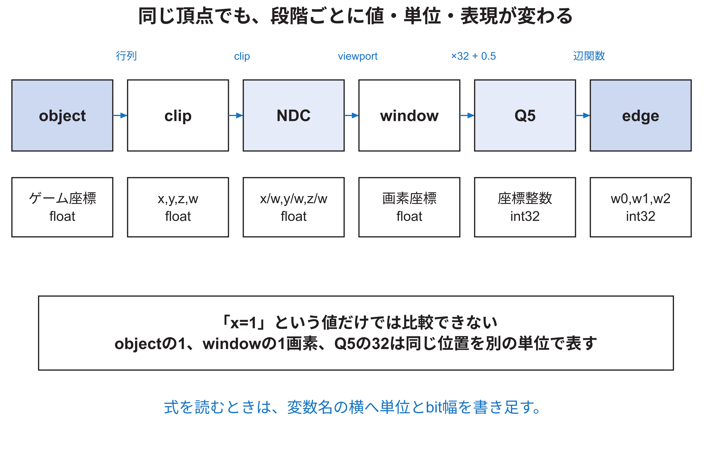

<a id="s_X_2"></a>
#### X.2 記号と単位を固定する

同じ`x`でも段階ごとに単位が違う。数値だけを比べず、必ず単位を添える。

| 記号 | 単位・表現 | 意味 |
|---|---|---|
| `x_obj,y_obj` | application座標、float | Breakoutが渡す位置 |
| `x_clip,y_clip,z_clip,w_clip` | clip座標、float | 行列変換直後 |
| `x_ndc,y_ndc,z_ndc` | 無次元、float | clip座標を`w_clip`で割った値 |
| `x_win,y_win` | 画素座標、float | viewport変換後 |
| `X,Y` | Q5相当の整数 | `x_win,y_win`を32倍して整数化した値 |
| `p=(Px,Py)` | Q5相当の整数 | 辺関数を評価するsample位置 |
| `E(A,B,P)` | Q10相当の整数 | 向き付き辺関数 |
| `A_tri` | Q10相当の整数 | 三角形の向き付き面積の2倍に比例する値 |
| `λ0,λ1,λ2` | float | 正規化したbarycentric weight |

Q5という呼び方は「小数部が5 bit」を表す。座標の保存型そのものは32 bit signed整数である。辺関数は二つのQ5差を乗算するため小数部10 bitに相当するが、sourceは専用のQ10型ではなく`int32_t`を使う。

<a id="s_X_3"></a>
#### X.3 object座標からclip座標まで

頂点`v_obj=(x,y,z,1)`には、model-view行列とprojection行列が適用される。sourceの行列格納順を目で追うと転置が入るため混乱しやすいが、外から見た結果は、設定したOpenGL風の変換を頂点へ適用することである。

Breakoutは次を設定する。

```cpp
glViewport(0, 0, Width, Height);
glOrtho(0, Width, Height, 0, -1, 1);
glTranslatef(-0.5f, 0.5f, 0.0f);
```

`W=Width`、`H=Height`とする。正投影だけなら、application座標`(x,y)`は次のNDCへ写る。

```text
x_ndc =  2x/W - 1
y_ndc = -2y/H + 1
```

`bottom=H, top=0`なのでyの符号が反転し、applicationでは上から下へyが増える。これが、ゲームで自然な左上原点の見方を、OpenGL風の左下原点へ対応させる。

<a id="s_X_4"></a>
#### X.4 Breakoutの半画素移動を最後まで計算する

viewport式は次である。

```text
x_win = (x_ndc + 1) W/2
y_win = (y_ndc + 1) H/2
```

正投影式を代入すると、半画素移動前は`x_win=x`、`y_win=H-y`になる。model-viewの`(-0.5,+0.5)`も含めると次になる。

```text
x_win = x - 0.5
y_win = H - y - 0.5
```

例えばapplication上の左端`x=0`はwindow座標`-0.5`、右端`x=4`は`3.5`になる。RasterIXは整数window座標をsampleするため、0、1、2、3が四つの画素中心に対応する。yも同じ考えだが上下が反転する。

「半画素を足せばよい」という一般論だけでは不十分である。RasterIXのfloatからQ5への変換は負数で非対称なので、`-0.5`は数学的な`-16/32`ではなく`-15/32`として保存される。それでも、この4×4例では画素0から3が選ばれることをsource-level試験で確認した。

ここでの`-0.5`から`3.5`は、Rasterizer単体の境界規則と負数変換を同時に見るためのwindow座標micro exampleである。実際の画面左端をまたぐprimitiveは、その前にclip-spaceで切られるため、この入力だけでclipperを含む画面端経路まで証明したとは扱わない。画面内のapplication座標`[10,14)`を半画素移動したwindow座標`[9.5,13.5)`でも別に試験し、画素10から13の16画素、共有辺4画素、合計20 fragmentという同じ局所形状を確認した。

<a id="s_X_5"></a>
#### X.5 clippingが扱う六つの不等式

perspective divideより前のclip座標は、次の六条件をすべて満たすと視体積内である。

```text
-w_clip <= x_clip <= w_clip
-w_clip <= y_clip <= w_clip
-w_clip <= z_clip <= w_clip
```

`Clipper.hpp`は各平面への符号付き距離を次のように定義する。

| 平面 | 距離`d(v)` | 内側 |
|---|---|---|
| left | `x+w` | `d>=0` |
| right | `w-x` | `d>=0` |
| bottom | `y+w` | `d>=0` |
| top | `w-y` | `d>=0` |
| near | `z+w` | `d>=0` |
| far | `w-z` | `d>=0` |

辺の一方が内側、他方が外側なら、交点の割合を次で求める。

```text
a = d_current / (d_current - d_previous)
v_intersection = (1-a) v_current + a v_previous
```

距離は座標の一次式なので、交点の距離は次のように0になる。

```text
d_intersection
= (1-a)d_current + a d_previous
= d_current - d_current(d_current-d_previous)/(d_current-d_previous)
= 0
```

これは分母が0でない交差辺についての代数的な結論である。実装はfloatを使うため、実際の値には丸め誤差が残る。独立監査では、正負の距離10万組について最大残差を記録した。三角形は六平面を順に通り、一平面で最大一頂点増えるため、保存配列は`3+6=9`頂点である。

<a id="s_X_6"></a>
#### X.6 perspective divideとviewport

`Vec::perspectiveDivide()`は、元の`w_clip`の逆数`r=1/w_clip`を求める。出力は次である。

```text
(x_ndc, y_ndc, z_ndc, r)
= (x_clip*r, y_clip*r, z_clip*r, r)
```

第四成分を1へ置き換えず、逆数`r`を保存する点が重要である。この値を後でtextureの遠近補正に使う。

viewport変換は次である。

```text
x_win = (x_ndc+1) width/2 + viewportX
y_win = (y_ndc+1) height/2 + viewportY
z_win = (depthScale*z_ndc + depthOffset) * 65534/65536
```

既定のdepth rangeが0から1なら、`depthScale=1/2`、`depthOffset=1/2`である。最後の`65534/65536`は、1.0ちょうどを16 bit depthの範囲外へ送らないための縮小である。

<a id="s_X_7"></a>
#### X.7 float座標からQ5整数への正確な変換

`Veci::createFromVec`の式は次である。

```text
Q5(x) = truncTowardZero(32x + 0.5)
```

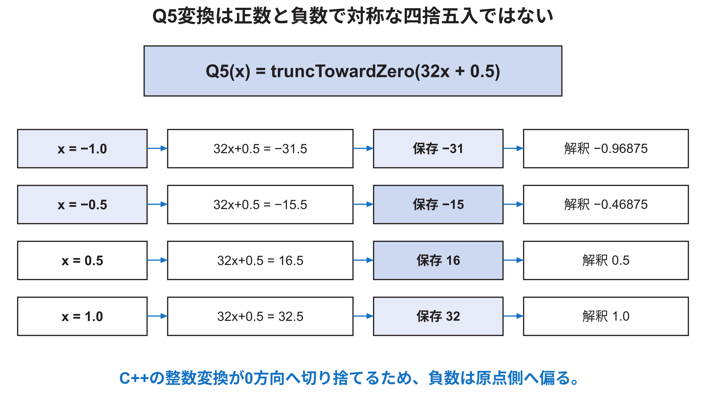

| 入力x | `32x+0.5` | 保存整数 | 保存値÷32 |
|---:|---:|---:|---:|
| -1.0 | -31.5 | -31 | -0.96875 |
| -0.5 | -15.5 | -15 | -0.46875 |
| -0.03125 | -0.5 | 0 | 0 |
| 0 | 0.5 | 0 | 0 |
| 0.03125 | 1.5 | 1 | 0.03125 |
| 0.5 | 16.5 | 16 | 0.5 |
| 1.0 | 32.5 | 32 | 1.0 |

正数の代表例だけを見ると四捨五入に見えるが、負数では原点側へ偏る。これは推測ではなく、公式templateを呼ぶC++監査でも同じ出力を確認した。入力が`int32_t`の表現範囲を越えるfloatの場合のC++変換は保証できないため、座標は変換可能範囲内でなければならない。

<a id="s_X_8"></a>
#### X.8 bounding boxの整数化

三頂点をQ5整数`Xi,Yi`へ変換した後、各軸の最小値と最大値を求める。sourceの式をそのまま書くと次になる。

```text
bbStart = (minQ5 + 16) >> 5
bbEnd   = (maxQ5 + 32 + 16) >> 5
```

RTLは`bbStart <= position < bbEnd`という半開区間で走査する。`bbEnd`自体は候補に含まれない。負のsigned値に対する右shiftは、使用するC++規格とcompilerの動作を確認する必要がある。本研究のGCC環境は算術shiftとなるが、sourceを別環境へ移すときは試験を残す。

4×4例のx座標は、Q5変換後に`-15`と`112`になる。したがって次である。

```text
bbStart = (-15+16)>>5 = 0
bbEnd   = (112+48)>>5 = 5
```

候補xは0、1、2、3、4である。x=4はbounding boxには入るが、辺関数で三角形外となる。bounding boxは「必ず塗る範囲」ではなく「調べる候補範囲」である。

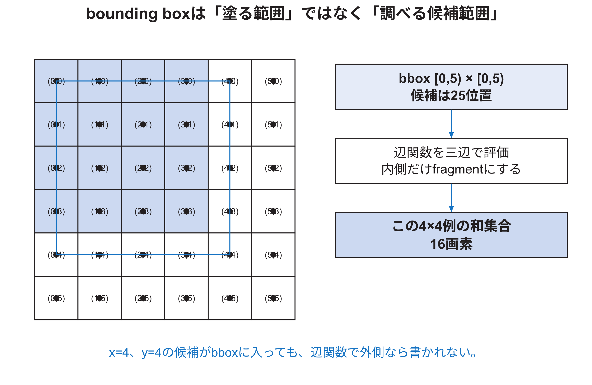

<a id="s_X_9"></a>
#### X.9 辺関数を展開する

向き付き辺`A=(Ax,Ay)`から`B=(Bx,By)`と点`P=(Px,Py)`に対し、RasterIXは次を使う。

```text
E(A,B,P) = (Px-Ax)(By-Ay) - (Py-Ay)(Bx-Ax)
```

これは二次元ベクトル`P-A`と`B-A`の行列式である。`E=0`なら三点は同一直線上、符号はPが辺のどちら側にあるかを表す。頂点順を逆にすると符号も逆になる。

CPU側は`area=E(v0,v1,v2)`を計算し、`area>0`なら`sign=1`、それ以外なら`sign=-1`を選ぶ。その後、areaと三辺の値・増分へ同じsignを掛ける。areaが0なら退化三角形として捨てる。

<a id="s_X_10"></a>
#### X.10 一画素増分を導出する

PをQ5で一画素右へ動かすと`Px`へ32を足す。式の差を取る。

```text
E(A,B,(Px+32,Py)) - E(A,B,(Px,Py))
= ((Px+32)-Ax)(By-Ay) - (Py-Ay)(Bx-Ax)
  - {(Px-Ax)(By-Ay) - (Py-Ay)(Bx-Ax)}
= 32(By-Ay)
```

同様に一画素上へ動かすと次になる。

```text
E(A,B,(Px,Py+32)) - E(A,B,(Px,Py))
= 32(Ax-Bx)
```

これが`Rasterizer.cpp`の`wXInc`と`wYInc`である。毎画素二回の乗算をやり直さず、32 bit加算で更新できる。

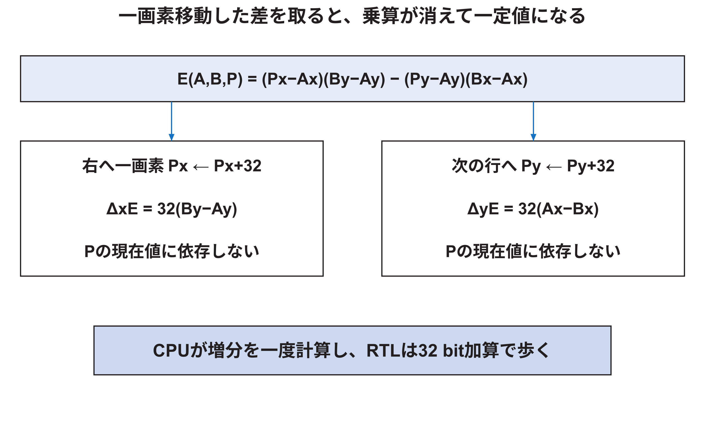

<a id="s_X_11"></a>
#### X.11 三つの辺関数の和とbarycentric weight

三角形`v0,v1,v2`に対し、次を置く。

```text
w0(P)=E(v1,v2,P)
w1(P)=E(v2,v0,P)
w2(P)=E(v0,v1,P)
A=E(v0,v1,v2)
```

各式を展開してPを含む項を集めると相殺し、overflowしない整数演算では次の恒等式が成り立つ。

```text
w0(P)+w1(P)+w2(P)=A
```

向きをそろえた後に`λi=wi/A`とすれば、`λ0+λ1+λ2=1`である。頂点属性`a0,a1,a2`のaffine補間は次になる。

```text
a(P)=λ0 a0 + λ1 a1 + λ2 a2
```

CPU側は開始点Pで`a(P)`をfloat計算し、一画素分のweight増分から`aXInc`と`aYInc`を作る。RTLはその三値を受け、座標移動に合わせて加減算する。独立監査では、辺関数の和とX・Y差分を乱数20万例で照合した。恒等式自体は乱数試験によって成立するのではなく、上の展開によって成立し、乱数試験は実装した監査式の取り違えを探す補助である。

<a id="s_X_12"></a>
#### X.12 RTLが採用するsample格子

CPU側が記述子へ保存する開始点は次である。

```text
p = (bbStartX << 5, bbStartY << 5)
```

つまり辺関数を評価する初期sampleは整数window座標であり、ここへ16を加える処理はない。RTL Rasterizerはxまたはyを1増減するたび、対応する`wXInc`または`wYInc`を属性と一緒に適用する。

Breakoutの半画素移動は、長方形の境界をこの整数sample格子の間へ置くためにapplication側で行う。座標変換側の半画素移動、bounding box側の`+16`、texture samplerのhalf-pixel optionは別の目的であり、一つの「0.5処理」として混同しない。

<a id="s_X_13"></a>
#### X.13 4×4四角形を画素集合まで追う

application上の四頂点を、半画素移動後のwindow座標として次に固定する。

```text
P0=(-0.5,-0.5)
P1=( 3.5,-0.5)
P2=( 3.5, 3.5)
P3=(-0.5, 3.5)
```

`GL_QUADS`は`T0=(P0,P1,P2)`と`T1=(P0,P2,P3)`を作る。公式C++記述子生成器とsoftware rasterizerが返した集合は次である。

| 三角形 | 生成した画素 |
|---|---|
| T0 | (0,0), (1,0), (1,1), (2,0), (2,1), (2,2), (3,0), (3,1), (3,2), (3,3) |
| T1 | (0,0), (0,1), (0,2), (0,3), (1,1), (1,2), (1,3), (2,2), (2,3), (3,3) |

和集合は16画素で、4×4を隙間なく覆う。共通部分は4画素である。

<a id="s_X_14"></a>
#### X.14 top-left規則がなく共有辺を二度生成する

RTLの内側判定は三つのsign bitのORを否定したものであり、数式では次である。

```text
inside = (w0 >= 0) and (w1 >= 0) and (w2 >= 0)
```

`w=0`の辺を特定方向だけ除外する条件はない。共有辺では一方の三角形でも他方でも対応するwが0になるため、両方がそのsampleを含める。

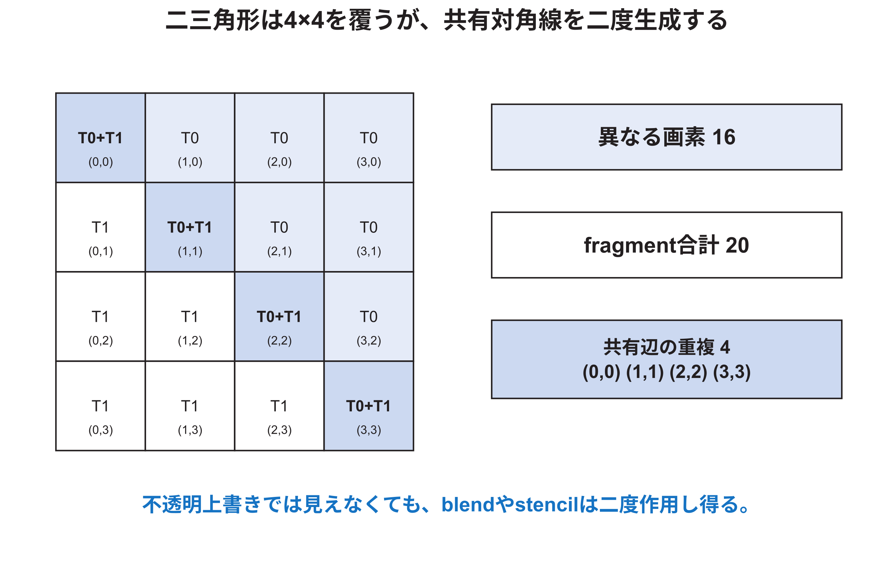

| 指標 | 結果 |
|---|---:|
| 異なる画素数 | 16 |
| 二三角形のfragment数の合計 | 20 |
| 重複fragment数 | 4 |
| 重複位置 | (0,0), (1,1), (2,2), (3,3) |

不透明色を上書きするだけなら同じ色を二度書いても画像は同じである。source-alpha blendなら、最初に混ぜた結果へ二度目を混ぜるため色が変わり得る。stencil incrementなら値が二回変わり得る。このため、将来共有辺を含む透明図形を扱う場合は、top-left規則の追加またはprimitive構成の変更を検討対象にする。

<a id="s_X_15"></a>
#### X.15 scissorは二段階で働く

scissorは、指定長方形の外を描かない機能である。固定sourceでは二つの場所が関係する。

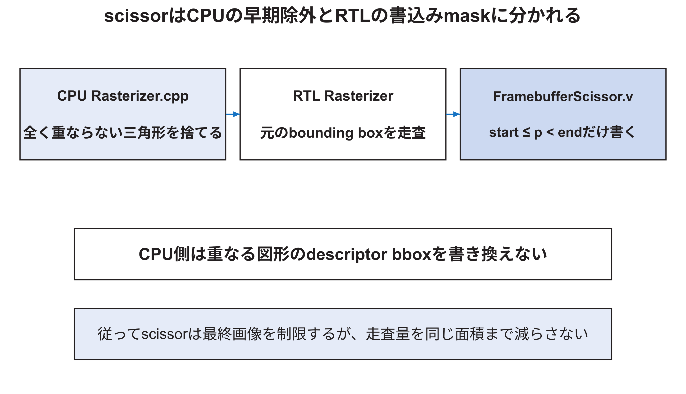

| 段階 | 処理 | しないこと |
|---|---|---|
| CPU `Rasterizer.cpp` | 三角形とscissorが全く重ならなければ`false`を返す | 記述子のbounding boxを書き換えない |
| RTL `FramebufferScissor.v` | `startX<=x<endX`かつ`startY<=y<endY`だけwrite strobeを通す | Rasterizerのfragment生成量を減らさない |

公式sourceを呼ぶ監査では、scissorを有効にしても、重なりのある三角形の`bbStart`と`bbEnd`は無効時と同じだった。したがってscissorは最終書込みを制限するが、現在の記述子経路では重なる三角形の走査仕事をscissor面積まで減らさない。

threaded経路には別の注意がある。`Renderer`はScissorEnd registerへ絶対終端`x+width,y+height`を書く。一方、`ThreadedVertexTransformer`はその値を`Rasterizer::setScissorEnd`へ渡し、この関数は開始座標を再び加える。開始が0でない場合、CPU側早期除外がRTLの半開区間と異なる範囲を見る可能性がある。Breakoutはscissorを使わないため本研究のゲーム結果には作用しないが、公式sourceの一般的なscissor経路としては追加の単体試験が必要である。

<a id="s_X_16"></a>
#### X.16 32 bit辺関数が正しいための範囲

辺関数の差と積は`int32_t`で計算される。C++のsigned overflowは正しい値の下位32 bitを得る操作として保証されず、未定義動作になる。RTLの32 bit registerと加算は上位bitを捨てるため、二の補数のwrapとして現れる。両者はoverflow時の意味が同じとは保証できない。

viewport内の幅W、高さHの長方形に三点A、B、Pがあるとする。辺関数は各座標を一つずつ固定して見ると一次式になるため、長方形上の最大値と最小値は四隅の組合せで達成される。三点について`4^3=64`通りの隅を調べると、向き付き面積の絶対値の最大は`WH`である。Q5では両軸を32倍するため、三頂点の面積上限は次になる。

```text
|A| <= (32W)(32H) = 1024WH
```

| 画面 | 上限`1024WH` | `INT32_MAX`に対する状態 |
|---|---:|---|
| 640×480 | 314,572,800 | 約6.83倍の余裕 |
| 1280×720 | 943,718,400 | 約2.28倍の余裕 |
| 1920×1080 | 2,123,366,400 | ごく小さい余裕 |
| 2048×2048 | 4,294,967,296 | 範囲外 |

正方形ならこの面積上限で一辺1448画素までがsigned 32 bit内、1449画素で超える。RTL edge walkerは右辺探索で最大頂点より一画素右の`bbEndX`までPを動かす場合があるため、中間辺関数には`1024(W+1)H`も確認する。640×480では315,064,320で約6.82倍、1920×1080では2,124,472,320で約1.011倍の余裕があり、2048×2048では4,297,064,448となり範囲外である。

この証明の前提は、Q5化されたA、Bが幅`32W`・高さ`32H`内にあり、走査点Pが横に一画素だけ拡張した範囲内にあることである。任意の画面外記述子、C++で既にoverflowした値、異常なbboxには適用できない。本研究の通常の640×480 clip済み座標には大きな余裕があるが、sourceが許す最大viewport 2048×2048を同じ辺関数幅で安全と断定できない。

<a id="s_X_17"></a>
#### X.17 座標段階で守るべき前提

| 前提 | 破ると起こり得ること | 確認方法 |
|---|---|---|
| clip-space `w_clip`が0でない | perspective divide不能 | clip前の頂点dump |
| Q5変換がint32範囲内 | C++変換の未定義・不定結果 | 変換前座標のrange assertion |
| 辺関数がint32範囲内 | CPUとRTLの不一致 | 64 bit referenceとの比較 |
| bounding boxが解像度内 | index範囲外 | clipping試験とdescriptor dump |
| 半画素規則を一箇所で管理 | 一画素のずれ | 1×1、4×4、画面端scene |
| shared edgeの二重作用を許容 | blend・stencilの線 | overlap counterと画像差分 |

この表の前提を満たさない入力まで含めて「Rasterizerは数学的に正しい」と言うことはできない。研究で使う640×480の二次元sceneに範囲を固定し、その範囲を試験することが必要である。

<a id="ch_Y"></a>
### 付録Y 固定小数点、補間、texture、混色の数値を追う

<a id="s_Y_1"></a>
#### Y.1 Q形式をbit列から読む

本付録では`S整数bit数.小数bit数`を、符号bitを別に数える。32 bit signedの代表形式は次である。

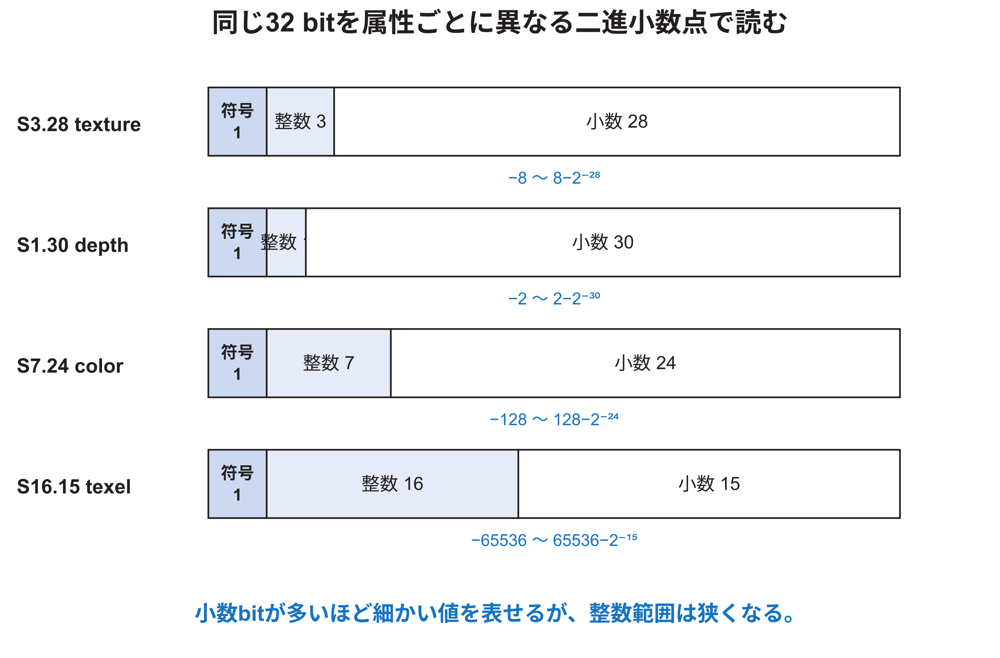

| 形式 | bit構成 | 最小値 | 最大値 | 刻み |
|---|---|---:|---:|---:|
| S3.28 | 符号1、整数3、小数28 | -8 | `8-2^-28` | `2^-28` |
| S1.30 | 符号1、整数1、小数30 | -2 | `2-2^-30` | `2^-30` |
| S7.24 | 符号1、整数7、小数24 | -128 | `128-2^-24` | `2^-24` |
| S16.15 | 符号1、整数16、小数15 | -65536 | `65536-2^-15` | `2^-15` |

同じ32 bitでも、小数部を増やすほど刻みは細かく、整数範囲は狭くなる。bit列`N`をS3.28として読む実数は、Nをsigned 32 bit整数として解釈して`N/2^28`とする。

<a id="s_Y_2"></a>
#### Y.2 float-to-fixed変換の語ごとの動作

`TriangleStreamF2XConverter.v`は三角形streamの語番号を見て、変換する語とその小数bit数を選ぶ。

| 属性 | offset | 出力形式 |
|---|---:|---|
| texture s,t,qと増分 | -28 | S3.28 |
| color r,g,b,aと増分 | -24 | S7.24 |
| depth z,wと増分 | -30 | S1.30 |
| bounding box・辺関数 | 変換なし | 既に整数 |

`FloatToInt.v`はIEEE 754 singleのsign、exponent、mantissaを分け、offsetで二進小数点を移す。右shiftする場合、最初に捨てる一bitを`one_round`として保存し、結果の絶対値へ加える。負数はその後で二の補数にする。

この方式は、保持bitより小さい全bitを使うties-to-evenではない。ちょうど半分でも絶対値を大きくする。overflow判定時は最大値へ飽和せず0になる。したがって、入力範囲を守ることは画質だけでなく、値が突然0になることを避けるために必要である。

さらに、回路はmantissaの手前へ常にhidden bitの1を補う。これは正規化された有限のIEEE 754値に対応する読み方であり、subnormal、NaN、infinityを一般的に正しく変換する回路としては扱えない。非常に大きいshift量は`shiftSize`のbit幅へ切り詰められるため、特殊値を含む全32 bit patternへ通常の数値変換を一般化しない。正規化有限floatでも、非常に小さい非0値にはY.3の追加制約がある。本研究で使う値については、範囲だけでなく、0へ量子化される極小値をそのまま送らないことも入力契約に含める。

<a id="s_Y_3"></a>
#### Y.3 右shift量0の境界と極小値aliasを4値simulationと合成後回路で分ける

正規化有限floatの非負の絶対値を`x`、小数bit数を`F`とすると、意図する固定小数点の絶対値は概ね`round(x×2^F)`である。IEEE 754の非正規化前の仮数整数を`M=2^23+mantissa`、不偏指数を`e`とすれば、変換器内の有効指数は`e+F`となる。有効指数が23以下のときは、次の右shiftを行う。

```text
shiftSize = 23 - (e + F)
number    = M >> shiftSize
```

`shiftSize>0`なら、最初に捨てるbitは`M[shiftSize-1]`である。ところが`shiftSize=0`では捨てるbitが存在しないため、数学上のround bitは0でなければならない。公式`FloatToInt.v`はこの分岐を設けず、同じ式`number[shiftSize-1]`を評価する。この場合のindexは範囲外となる。

この差は、simulationが0と1だけを扱うか、不定値`X`も扱うかで見え方が変わる。Verilatorの通常modelは2値であり、このcaseを期待値どおりに見せる。一方、Vivado XSIMで未変更RTLを4値simulationすると、正の入力では`X`が出力へ伝播し、負の入力も期待する二の補数にならなかった。

次の表は、実行した11 caseから、式との対応を説明しやすい8 caseを抜き出したものである。

| 入力 | offset | `shiftSize` | 未変更RTLの4値simulation | 期待値 |
|---|---:|---:|---:|---:|
| color `+0.5` | -24 | 0 | `xxxxxxxx` | `00800000` |
| color `-0.5` | -24 | 0 | `00000001` | `ff800000` |
| color `1.0未満の最大float` | -24 | 0 | `xxxxxxxx` | `00ffffff` |
| texture `1/32` | -28 | 0 | `xxxxxxxx` | `00800000` |
| depth `1/128` | -30 | 0 | `xxxxxxxx` | `00800000` |
| color `0.25` | -24 | 1 | `00400000` | `00400000` |
| colorの極小正規化値、mantissa bit 0が1 | -24 | 33→5 bitでは1 | `00000001` | `00000000` |
| 上と同じ負値 | -24 | 33→5 bitでは1 | `ffffffff` | `00000000` |

次に、Nexys Videoと同じArtix-7 `xc7a200tsbg484-1`を対象としてVivado 2025.2で合成し、合成後functional netlistを4値simulationした。全11 caseのうち、六つの`shiftSize=0`代表値、`shiftSize=1`、左shift、真のshift量32の計9 caseは期待値と一致した。すなわち、今回の合成器は`shiftSize=0`で「round bitなし」に相当する回路を選んだ。

一方、極小値二件は合成後にも`+1`と`-1`になり、期待する0と一致しなかった。原因は、真のshift量33を5 bitの`shiftSize`へ入れると1になり、`mantissa[0]`を「最初に捨てるbit」と誤認するためである。正規化有限値について、有効指数を`p=e+F`とすると、数学的に正しいunderflow丸めは次だけで足りる。

```text
p = -1 : |x|×2^F は [0.5,1) なので、絶対値1へ丸める
p <= -2: |x|×2^F は 0.5未満なので、0へ丸める
```

現在のsourceは`23-p`を5 bitへ切り詰めるため、`p<-8`では32周期でmantissaまたはhidden bitを再び選び得る。正規化有限floatについて、公式sourceの分岐と今回確認した範囲を`p`ごとに分けると次になる。

| `p=e+F` | 公式sourceの経路 | 今回確定したこと |
|---:|---|---|
| `p<-8` | 真の右shift量が31を超え、5 bitへ切り詰められる | 指数によって仮数またはhidden bitを再選択し得るため、安全を一般化できない |
| `-8<=p<=-2` | underflow、選ぶround bitは`number[30:24]`のいずれか | 全24 bit正規化仮数でround bitが0、出力0 |
| `p=-1` | underflow、hidden bitをround bitにする | 全24 bit正規化仮数で出力絶対値1 |
| `0<=p<=22` | 右shiftし、最初に捨てるbitを加える | 全24 bit正規化仮数で絶対値のhalf-up丸め式と一致 |
| `p=23` | `shiftSize=0`で`number[-1]`を読む | 4値RTLでは未定義、今回のArtix-7合成後代表値は期待値と一致 |
| `24<=p<=30` | 左shift | 全24 bit正規化仮数で数学的な左shiftと一致し、正の大きさは`INT32_MAX`以下 |
| `p>=31` | `one_overflow=1` | 符号にかかわらず0を出すため、通常の飽和変換ではない |

負号は最後に32 bit二の補数として適用される。この操作がbit-vector上の剰余否定と等しいことも全32 bit patternで証明した。ただし、表の`p=23`にあるsource上の範囲外indexは、その証明範囲へ含めていない。

極小値aliasだけを避ける単純で保守的な下限は、値が厳密な0であるか、非0の正規化値について`p>=-8`であることとなる。実数の絶対値で書けば、各形式の下限は次である。上限側では別に`p<=30`が必要であり、sourceとして4値RTLでも定義済みであることまで要求するなら`p=23`を除くか、公式RTLへ明示分岐が必要である。

| 形式 | 非0値をそのまま送る保守的下限 |
|---|---:|
| S7.24 | `2^-32`、約`2.33×10^-10` |
| S3.28 | `2^-36`、約`1.46×10^-11` |
| S1.30 | `2^-38`、約`3.64×10^-12` |

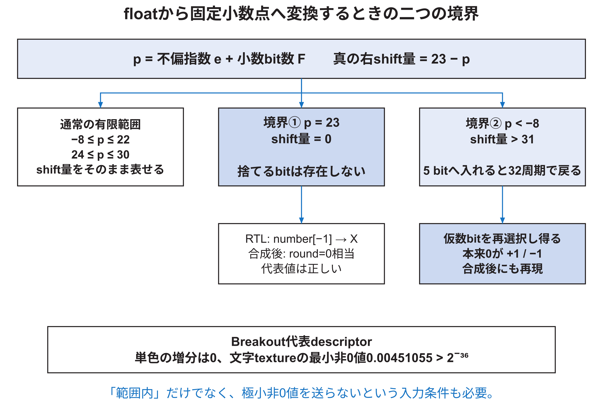

この下限より小さい値は、本来0へ量子化されるため、CPU側で0にするか、RTL側で`p<=-2`を明示的に0へする設計が考えられる。`shiftSize=0`だけを直しても極小値aliasは直らない。

Breakout相当の公式descriptor生成も確認した。単色四角形のcolor・depth増分はbit列になる前のfloat段階で厳密な0だった。8×8文字、64×32 atlasの代表三角形では、texture開始値が`[0.00451055, 0.0090211, 0.57735]`、X増分が`[0.0090211,0,0]`、Y増分が`[0,0.0180422,0]`であり、非0値はS3.28の保守的下限より十分大きかった。この確認範囲では、極小値aliasは現在のBreakout描画へ現れない。

ただし、RTL simulationと合成後simulationが異なるsourceは保守上安全とは言えない。sourceだけを見て`shiftSize=0`を明示する最小変更は次だが、これは極小値aliasまで直す完全な修正ではない。

```systemverilog
one_round <= (shiftSize == 0) ? 1'b0 : number[shiftSize - 1];
```

本研究のrepositoryは公式RasterIX submoduleを変更しない方針なので、この修正は取り込んでいない。結果は`../../experiments/rasterix-math/rasterix-float-to-int-audit.json`、元RTLのlog、合成log、合成後simulation logへ保存した。この試験は代表境界値に対する合成後結果であり、任意のIEEE 754 bit patternについての形式的同値証明ではない。

<a id="s_Y_4"></a>
#### Y.4 属性のincrement更新は有限bitの漸化式である

属性`a`について、CPUが`a_init`、`a_x`、`a_y`を送る。RTL `AttributeInterpolationX.v`は32 bit registerで次を実行する。

```text
INIT  : a <- a_init
X_INC : a <- a + a_x
X_DEC : a <- a - a_x
Y_INC : a <- a + a_y
PUSH  : saved <- a
POP   : a <- saved
```

数学上は開始点から右へi画素、上へj行進んだ値が`a_init+i a_x+j a_y`になる。32 bit RTLでは各加算後に上位bitが保持されないため、範囲を越えるとmodulo `2^32`のbit列になる。色とdepthの出力段にはclampがあるが、補間途中のwrapを元へ戻すことはできない。

<a id="s_Y_5"></a>
#### Y.5 affine補間の開始値と増分

頂点属性`a0,a1,a2`と正規化weightを使うと開始値は次である。

```text
a_init = λ0(P0)a0 + λ1(P0)a1 + λ2(P0)a2
```

一画素のweight差を`Δx λi`、一行の差を`Δy λi`とすると次になる。

```text
a_x = Σ(Δx λi)ai
a_y = Σ(Δy λi)ai
```

三頂点の色が同じCなら、`Σλi=1`、`ΣΔλi=0`なので、無限精度では`a_init=C`、増分は0である。float計算とfixed変換後には微小な非0が生じる可能性があるため、試験では「理論上0」と「bit列が厳密に0」を分けて記録する。

<a id="s_Y_6"></a>
#### Y.6 textureのperspective-correct interpolation

頂点iのclip-space wの逆数を`r_i=1/w_clip,i`、同次texture座標を`(s_i,t_i,q_i)`とする。CPUは次の三値をaffine補間する。

```text
S(P) = Σ λ_i(P) s_i r_i
T(P) = Σ λ_i(P) t_i r_i
Q(P) = Σ λ_i(P) q_i r_i
```

RTLはQの逆数を近似して次を求める。

```text
s(P)=S(P)/Q(P)
t(P)=T(P)/Q(P)
```

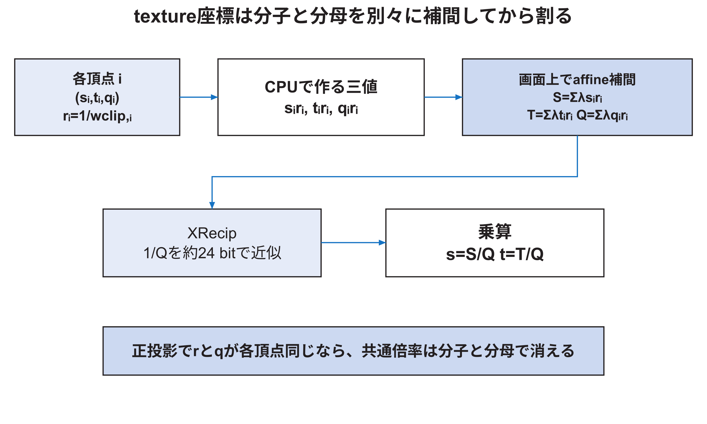

`q_i=1`なら一般的なperspective-correct interpolationである。正投影かつ全頂点の`r_i`が同じなら、その共通値が分子と分母で消え、通常のaffine補間になる。

<a id="s_Y_7"></a>
#### Y.7 CPU側のw正規化が比を変えない理由

固定小数点経路では、CPU側`Rasterizer.cpp`が`(r0,r1,r2)`をEuclidean normで割る。共通倍率を`c`とすると、送る値は`r'_i=c r_i`である。

```text
S'(P)=c Σλ_i s_i r_i
Q'(P)=c Σλ_i q_i r_i
S'(P)/Q'(P)=S(P)/Q(P)
```

実数演算では結果を変えない。目的はS3.28の範囲へ値を収めやすくすることである。ただし、fixedへ量子化すると分子と分母が別々に丸められるため、有限bitでは完全に同じ値とは限らない。共通倍率は数学的な座標を保ちながら数値範囲を変える設計である。

<a id="s_Y_8"></a>
#### Y.8 逆数器の精度と入力前提

`AttributePerspectiveCorrectionX.v`の既定`CALC_PRECISION=25`では、符号用の余裕を除いた`TEXQ_PRECISION=24`を使う。`XRecip.v`は次の構成である。

| 項目 | 値 |
|---|---:|
| 初期推定 | 6 bit |
| Newton反復 | 2回 |
| 説明上の精度 | 約24 bit |
| 逆数段のlatency | `7+3×2=13` cycle |
| 後段 | 乗算・形式変換4 cycle |
| 合計 | 17 cycle |

source commentは入力qが0から1に正規化されることを前提とし、sign bitを外して逆数器へ入れる。q=0を明示的に処理する分岐はなく、公式`AttributePerspectiveCorrectionX`試験にもq=0例はない。したがって正しさの前提は`Q(P)>0`である。clip-space wが0でないだけでは十分でなく、texture qも含む補間後Qが正でなければならない。

<a id="s_Y_9"></a>
#### Y.9 colorとdepthの出力clamp

colorはS7.24の上位16 bitを一度取り出す。その16 bit値について、sign bitが1なら0、8 bitより上の7 bitのいずれかが1なら255、それ以外は下位8 bitを出す。S7.24の整数bit列を`fixedColor`と書けば、概念的には次である。

```text
color8 = clamp(fixedColor >> 16, 0, 255)
```

ただし実装は一回の理想的な実数丸めではなく、先にbit sliceを取ってから判定する。depth zはsign bitが1なら0、bit30が1なら65535、それ以外は`depth_z[14 +: 16]`を出す。これもS1.30から16 bitへbit sliceする具体的な規則である。

<a id="s_Y_10"></a>
#### Y.10 texture座標S16.15からtexel addressを作る

`TextureSampler.v`は1×1から256×256の2のべき乗textureを扱う。入力はS16.15である。texture sizeのregister値はlog2サイズで、0が1画素、1が2画素、8が256画素を表す。

線形filterでhalf-pixel offsetが有効なら、sample位置の左右上下へtextureサイズに応じた0.5 texelを引き足しする。無効なら現在位置と1 texel先を使う。その後、座標の整数側から四address`00,01,10,11`を作り、小数側からQ0.16のsub-coordinateを作る。

addressは概念的に次である。

```text
address(u,v) = mipOffset + v * textureWidth + u
```

RTLでは幅と高さが2のべき乗なので、乗算の代わりにshiftとORで組み立てる。mipmap levelに応じたoffsetも前段で加える。

<a id="s_Y_11"></a>
#### Y.11 repeatとclamp-to-edge

repeatでは座標の下位bitをaddressへ使うことで、texture幅・高さを越えた整数部が周期的に折り返される。clamp-to-edgeでは負座標を0へ、1以上の正規化座標を端側へ制限する。

四texelの右または下が端を越えると、`TextureSampler`は越えた側のtexelを端のtexelで置き換える。例えば右だけ越えた場合、`01=00`、`11=10`となる。これにより、線形filterがtexture外の別addressを混ぜない。

<a id="s_Y_12"></a>
#### Y.12 線形filterの整数式

`TextureFilter.v`はsub-coordinate U、Vを16 bitで受けるが、`ColorInterpolator.v`は上位8 bitだけをweightとして使う。`u8=floor(U/256)`、`v8=floor(V/256)`とする。

一channelについて、RasterIXの補間関数は次である。

```text
mix(A,B,u8)
= min(255, floor((A(255-u8) + B u8 + 255)/256))
```

まず上段`00-01`と下段`10-11`を横に混ぜ、その二結果を縦に混ぜる。

```text
h0  = mix(C00,C01,u8)
h1  = mix(C10,C11,u8)
out = mix(h0,h1,v8)
```

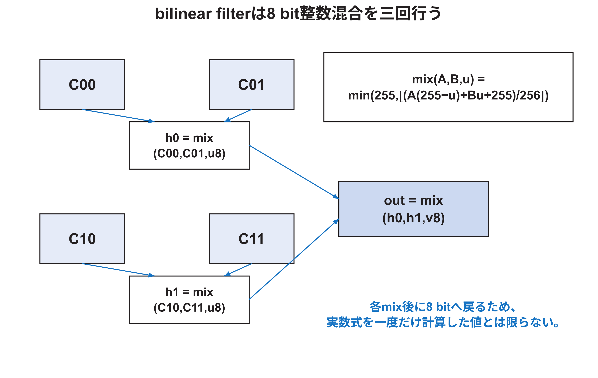

重みの和は255で、分母は256、最後に255を足してからshiftする。理想式`(1-u)A+uB`を実数で一度計算するものではない。各段で8 bitへ戻すため、横方向の量子化誤差が縦方向へ入力される。一方、`u8=0`ならA、`u8=255`ならBを8 bit全組合せで正確に返すことを独立監査で全数確認した。

<a id="s_Y_13"></a>
#### Y.13 ColorMixerの式をbit sliceまで読む

既定の8 bit精度では、`ColorMixer.v`の一channelは二つの積を17 bitで加え、定数255を加える。bit16が1なら255へ飽和し、そうでなければbit15から8を結果にする。従って正確な整数式は次である。

```text
result = min(255, floor((A*B + C*D + 255)/256))
```

独立監査はA、B、C、Dを0から255の乱数20万組で計算し、bit shiftで書いた式と一致すること、結果が0から255に収まることを確認した。この式はtexture filterだけでなくColorBlenderでも使われる。

<a id="s_Y_14"></a>
#### Y.14 alpha blendの具体例

Breakoutの文字は`SRC_ALPHA`と`ONE_MINUS_SRC_ALPHA`を使う。source colorをCs、destination colorをCd、source alphaをAsとすると、各RGB channelは次の整数式になる。

```text
Cout = min(255, floor((Cs*As + Cd*(255-As) + 255)/256))
```

例えば`Cs=255`、`Cd=0`、`As=128`なら次である。

```text
Cout = floor((255*128 + 0*127 + 255)/256)
     = floor(32895/256)
     = 128
```

同じfragmentが共有辺で二度処理されると、二回目のCdは一回目の結果である。従って半透明textureを二三角形で描くと、共有対角線だけ濃くなる可能性がある。これは[付録X.14](#s_X_14)の境界規則と本節の混色式を組み合わせた帰結である。

<a id="s_Y_15"></a>
#### Y.15 test、stencil、logic operationを区別する

PerFragment pipelineには複数の機能がある。

| 機能 | 入力 | 主な出力 |
|---|---|---|
| alpha test | 新fragmentのalphaと基準値 | fragmentを通すか |
| depth test | 新depthと保存済みdepth | fragmentを通すか、depth更新 |
| stencil test | 保存済みstencilと基準値 | 通過判定とstencil更新 |
| blend | 新色、旧色、factor | 算術的に混ぜた色 |
| logic op | 新色、旧色 | AND、OR、XORなどのbit演算色 |

testの比較関数とstencil operationはenumで選び、公式software試験と一部RTL試験がある。blendとlogic opは同時に同じ意味で使う処理ではない。機能enable、比較結果、write maskを順に追わないと、「testに落ちた」「maskで書かなかった」「同じ値を書いた」を区別できない。

<a id="s_Y_16"></a>
#### Y.16 量子化誤差を一つの数字へまとめない

最終画素までには複数の誤差源がある。

| 段階 | 主な誤差・境界 |
|---|---|
| float座標→Q5 | `+0.5`後の0方向切捨て、負数非対称 |
| barycentric計算 | int32 overflow、float除算 |
| float属性→fixed | guard bit丸め、overflow時0 |
| fixed increment | 32 bit wrap |
| reciprocal | 有限初期推定とNewton反復2回 |
| texture座標 | S16.15へのshiftと切捨て |
| filter weight | Q0.16から上位8 bitだけ使用 |
| ColorMixer | `/256`、`+255`、各段8 bit化 |
| external color | RGBA内部値からRGB565へ量子化 |

「誤差は最大1」と一括して断定できない。各段の入力範囲と、誤差が次段で増幅されるかを調べる。二次元Breakoutでは一様色の図形が多く、textureは文字だけなので、座標境界とalpha blendを優先して試験する。

<a id="s_Y_17"></a>
#### Y.17 二次元だから不要になる処理と残る処理

| 処理 | 2D Breakoutでの状態 |
|---|---|
| perspectiveの見た目 | 正投影なので通常は不要 |
| perspective補正回路 | 汎用pipelineとして通る |
| depth test | applicationがdisable |
| depth値の補間 | 記述子・pipelineには残る |
| texture | 文字で使用 |
| bilinear filter | texture設定に従って使用 |
| alpha blend | 文字で使用 |
| shared-edge規則 | 四角形を二三角形にするため関係する |

「2DだからRasterizerの数値問題は関係ない」とは言えない。奥行きの理解を発表の中心にしなくても、四角形の境界、文字texture、alpha blendは本研究の画像へ直接作用する。

<a id="ch_Z"></a>
### 付録Z 数学、source、試験を結び付けた検証記録

<a id="s_Z_1"></a>
#### Z.1 完璧という語を検証可能な主張へ分解する

有限規模の卒業研究で、C++、SystemVerilog、compiler、FPGA、DDR3、displayを含む全状態について誤りが存在しないことを証明するのは現実的でない。本付録では代わりに、主張ごとに前提、導出、試験、未確認範囲を示す。

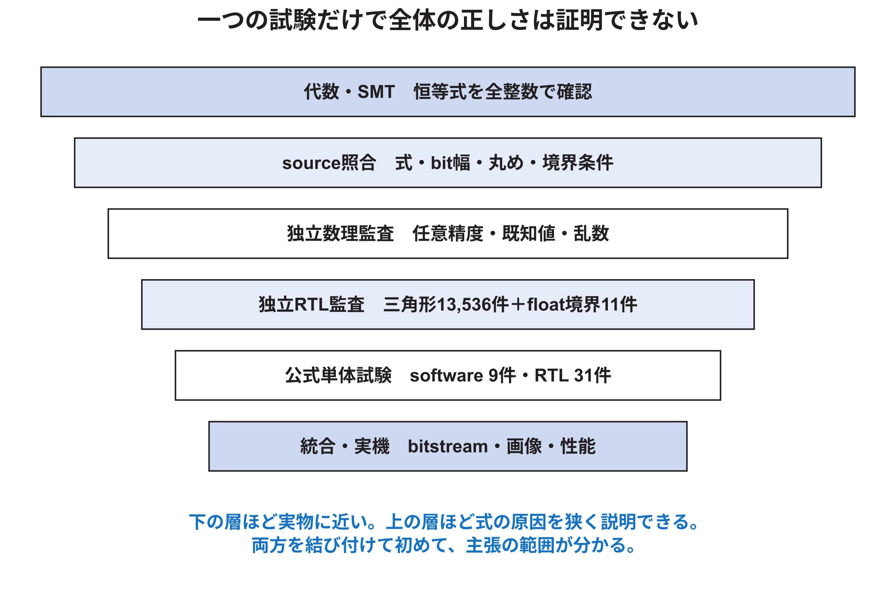

| 証拠 | 強く言えること | それだけでは言えないこと |
|---|---|---|
| 代数導出 | overflow前の式が全入力に成立 | RTLの配線が式どおり |
| SMTによる反例探索 | 論理式と前提の範囲で反例がない | 数式化していない回路状態、tool自体の誤り |
| source inspection | 固定commitの記述内容 | synthesis後の全動作 |
| C++ source harness | そのcompiler・入力での出力 | 他の全入力、RTL同値 |
| official CTest | 登録されたcaseが成功 | 未登録module、実機統合 |
| independent randomized audit | 多数caseで恒等式の実装が一致 | 無限入力の形式証明 |
| FPGA実機画像 | そのbitstream・sceneで表示 | 内部全状態や境界case |

<a id="s_Z_2"></a>
#### Z.2 固定したsourceと変更禁止範囲

| 対象 | commit | 状態 |
|---|---|---|
| Wally統合repository | `d3e181ac434a01a1f174549b5fbc7ee03a8875b4` | 監査開始時clean |
| 公式RasterIX submodule | `9fdcf97a31b2e4247594e06d605871980cd5e9e1` | 監査開始時clean |

監査programとbuild directoryはrepository外へ置き、RasterIX sourceを変更していない。公式sourceを変えずにinclude・linkし、結果だけを研究資料側へ保存した。

<a id="s_Z_3"></a>
#### Z.3 公式software試験

out-of-tree buildでsoftware CTest 9件を実行し、9件すべて成功した。

| test | 結果 |
|---|---|
| attributeInterpolator | pass |
| blendFunc | pass |
| fog | pass |
| logicOp | pass |
| rasterizer | pass |
| stencilOp | pass |
| testFunc | pass |
| texEnv | pass |
| textureMap | pass |

software rasterizer試験には`w==0`の境界を含むcaseがある。これはsoftware modelの境界規則を確認するが、RTL Rasterizerの同値を直接試験しない。

<a id="s_Z_4"></a>
#### Z.4 公式Verilator試験

Verilator 5.026を使うout-of-tree buildで、登録された31件すべてが成功した。数値経路に直接関係する主なtestは次である。

| test | 主に確認する対象 |
|---|---|
| attributeInterpolationX | fixed属性の増分更新 |
| attributePerspectiveCorrectionX | 逆数、texture復元、color・depth出力 |
| triangleStreamF2XConverter | float語からfixed語への変換 |
| textureSampler | 四texel address、clamp、sub-coordinate |
| colorInterpolator | 8 bit色補間 |
| texEnv | textureと前段色の合成 |
| framebufferScissor | 半開区間のwrite mask |
| stencilOp、logicOp | 画素単位operation |

`sim_rasterizer.cpp`という名前のfileは存在するが、内容は有効なRasterizer検証を行わず、CTestにもRTL Rasterizer試験として登録されない。このため31/31成功を「Rasterizerを含む全RTLの証明」と解釈しない。

<a id="s_Z_5"></a>
#### Z.5 公式C++を呼ぶsource-level監査

`../../experiments/rasterix-math/rasterix_descriptor_audit.cpp`は、公式`Rasterizer.cpp`とsoftware rasterizerをrepository外でcompileし、次をassertした。

1. Breakoutと同じ半画素移動をした4×4四角形を二三角形へする。
2. 二つの`TriangleDesc`を公式software rasterizerへ渡す。
3. 画素集合の和が16であることを確認する。
4. 共有辺4画素が重複し、fragment合計が20であることを確認する。
5. scissorが記述子bounding boxを書き換えないことを確認する。
6. `Veci::createFromVec`の負数を含む8入力を確認する。

| 観察値 | 結果 |
|---|---|
| triangle 0 bounding box | [0,0,5,5] |
| triangle 1 bounding box | [0,0,5,5] |
| union | 16画素 |
| overlap | 4画素 |
| fragment合計 | 20 |
| scissorによるdescriptor bbox書換え | false |
| Q5変換 | [-31,-15,0,0,1,16,32,48] |

この試験はRTL Rasterizerを実行していない。しかし、CPU側記述子、software walker、既存境界規則を同じ入力で具体化し、従来説明の誤りを見つける役割を果たした。

<a id="s_Z_6"></a>
#### Z.6 独立したRTL Rasterizer監査

公式repositoryには有効なRTL Rasterizer単体試験が登録されていなかったため、`qa/rtl_rasterizer_audit`にrepository外のVerilator harnessを作った。公式`Rasterizer.v`は変更せず、moduleへbbox、三辺の初期値、X増分、Y増分を直接与えた。

まず、[Z.5](#s_Z_5)で公式C++が作った4×4四角形の二つの記述子を、同じ数値のままRTLへ入れた。software walkerとRTL walkerは同一行を走る順序が一部異なったため、両者については`(x,y,index)`の**多重集合**を比較した。単なる集合ではなく多重集合にしたのは、同じ画素を誤って二度生成した場合も失敗させるためである。二つの三角形はいずれも全fragmentが一致した。

次に、RTL内部の`ready`を周期的に0へし、pipelineの受取り停止を発生させた。この場合はRTLの常時ready実行と、値だけでなく出力順序まで一致した。さらに`w0=w1=w2=0`の1×1境界入力が1画素を生成することを確認した。

最後に、6×6整数格子の36点から異なる三点を選ぶ全組合せを取り、面積0の組を除き、両方の頂点順を試した。各入力について、RTLとは別に三辺の辺関数を全bbox画素で直接評価し、`w0>=0 && w1>=0 && w2>=0`となる参照多重集合を作った。

| 確認 | 結果 |
|---|---:|
| 非退化三角形・両頂点順 | 13,536 case pass |
| 比較したRTL fragment | 86,496 fragment |
| 4×4のsoftware／RTL多重集合 | 二三角形とも一致 |
| 周期ready停止 | 値・順序とも常時ready実行と一致 |
| `w==0`境界 | 1×1の1画素を生成 |

この全数試験は「6×6整数格子から作る三角形」という有限領域では漏れがない。一方、任意の32 bit記述子、画面外座標、全tile offset、算術overflow、synthesis後の回路まで証明するものではない。実行結果は`../../experiments/rasterix-math/rasterix-rtl-rasterizer-audit.json`へ保存した。

Verilatorは`if (rrCmd & RR_CMD_*)`の五箇所に、6 bit値を条件式へ使う`WIDTHTRUNC` warningを出した。現在の定数では、0なら偽、非0なら真という意図どおりにsimulationされ、上記照合も成功した。これは直ちに機能不良を示す結果ではないが、将来のsource整理では`if ((rrCmd & RR_CMD_*) != 0)`と意図を明示できる箇所である。

<a id="s_Z_7"></a>
#### Z.7 FloatToIntの4値RTLとArtix-7合成後監査

`qa/float_to_int_audit`は、公式RasterIX checkoutを変更せず、[Y.3](#s_Y_3)で示した`shiftSize=0`と極小値aliasを二段階で試した。

1. XSIMで未変更`FloatToInt.v`を4値RTL simulationした。
2. 同じsourceをNexys Videoの`xc7a200tsbg484-1`向けにVivado 2025.2で合成し、functional netlistを4値simulationした。

| 層 | case | pass | fail | 読み取れること |
|---|---:|---:|---:|---|
| 未変更RTL、4値XSIM | 11 | 3 | 8 | shift 0の範囲外bit選択と極小値aliasを検出した |
| Artix-7合成後functional netlist | 11 | 9 | 2 | shift 0代表値は正しいが、極小正負値が±1になる |

未変更RTLのshift 0失敗を、そのままNexys Video上の故障件数と読んではならない。この部分は合成後には正しい。一方、極小値二件は合成後にも再現したため、回路の入力契約または公式RTLで対処すべき実在の数値境界である。ここで確定したのは、RTLと合成後netlistの意味がshift 0で一致しないこと、現在の合成後回路にも5 bit shift量の極小値aliasが残ること、Breakout代表記述子はその値域へ入らないことの三点である。

保存物は次である。

| file | 内容 |
|---|---|
| `../../experiments/rasterix-math/rasterix-float-to-int-rtl-four-state.txt` | 未変更RTLのXSIM log |
| `../../experiments/rasterix-math/rasterix-float-to-int-synthesis.txt` | Artix-7合成log |
| `../../experiments/rasterix-math/rasterix-float-to-int-post-synth.txt` | 合成後functional simulation log |
| `../../experiments/rasterix-math/rasterix-float-to-int-audit.json` | caseごとの入力、offset、出力、期待値 |

<a id="s_Z_8"></a>
#### Z.8 独立した数理監査

`../../experiments/rasterix-math/rasterix_math_audit.py`は公式実装を呼ばず、式をPythonの任意精度整数で独立計算した。

| 確認 | case数 | 結果 |
|---|---:|---|
| 辺関数の和とX・Y増分 | 200,000 | pass |
| clip交点の平面距離 | 100,000 | pass |
| ColorMixer式 | 200,000 | pass |
| 8 bit補間の両端 | 65,536組×両端 | pass |
| bilinearの四隅 | 4 | pass |
| fixed形式の範囲 | 4形式 | pass |
| FloatToInt underflow指数分類 | 正規化指数254個×3形式 | counterexampleと安全域を確認 |
| 640×480のint32面積上限 | 1 | pass |

乱数seedは`0x524958`に固定し、同じcaseを再現できる。JSON結果は`../../experiments/rasterix-math/rasterix-mathematical-audit.json`へ保存した。

乱数試験とは別に、`../../experiments/rasterix-math/rasterix_formal_audit.py`をZ3 5.1.0で実行した。各命題の否定をsolverへ渡し、`unsat`、すなわち記した前提の下では反例が存在しないことを確認した。

| 形式的に確認した命題 | 変数領域 | 結果 |
|---|---|---|
| 三辺関数の和が向き付き面積に等しい | 数学的な全整数 | 反例なし |
| X・Y一画素移動の増分式 | 数学的な全整数 | 反例なし |
| 遠近補正で共通非0倍率が比から消える | 分母非0の実数 | 反例なし |
| clipping交点の平面距離が0 | 二距離が異なる実数 | 反例なし |
| 17 bit ColorMixer bit sliceと整数式が同値 | 全有効中間値255から130,305 | 反例なし |
| ColorMixer出力が0から255 | 同上 | 反例なし |
| 8 bit補間の`u=0`と`u=255`が両端値を返す | A、Bの全65,536組に相当する整数制約 | 反例なし |
| FloatToIntの`p=-1`は絶対値1へ丸める | 全24 bit正規化仮数 | 反例なし |
| FloatToIntの`-102<=p<=-2`は数学上0へ丸める | 全24 bit正規化仮数と指数 | 反例なし |
| sourceの`-8<=p<=-2`で選ぶround bitは0 | 全24 bit正規化仮数と指数 | 反例なし |
| sourceの`p=-1`で選ぶround bitはhidden bitの1 | 全24 bit正規化仮数 | 反例なし |
| sourceの`0<=p<=22`は絶対値のhalf-up式と同値 | 全24 bit正規化仮数と23指数 | 反例なし |
| sourceの`24<=p<=30`は正確な左shiftでsigned正値範囲内 | 全24 bit正規化仮数と7指数 | 反例なし |
| 負号の`~magnitude+1`は32 bit剰余否定 | 全32 bit pattern | 反例なし |

Z3では16命題の否定を`unsat`とした。これとは別に、辺関数の長方形上限は多重一次式の極値が隅で得られる性質を使い、各画面について64隅組を任意精度整数で全数確認した。監査JSON上は合計17検証項目であり、結果は`../../experiments/rasterix-math/rasterix-formal-audit.json`へ保存した。Z3の証明も、有限bit C++やRTLが正しく配線されていることを単独で証明しないため、source試験とRTL試験を別に残す。

<a id="s_Z_9"></a>
#### Z.9 主張からsourceと試験への対応表

| 主張 | 主なsource | 検証 |
|---|---|---|
| Q5式は`trunc(32x+0.5)` | `lib/gl/math/Veci.hpp` | C++ harness、Python既知値 |
| bboxは`+16`と`+48`後にshift | `lib/gl/renderer/Rasterizer.cpp` | C++ harnessの[0,0,5,5] |
| 辺増分は一定 | `Rasterizer.cpp` | 代数導出、Z3反例なし、20万case |
| insideは三辺`>=0` | `rtl/RasterIX/Rasterizer.v` | source inspection、software境界test、RTL有限全数試験 |
| top-left規則なし | `Rasterizer.v` | source inspection、software／RTLの4画素重複 |
| scissorは半開区間 | `FramebufferScissor.v` | 公式Verilator test |
| CPU scissorはbboxを書換えない | `Rasterizer.cpp` | C++ harness |
| texture固定形式はS3.28 | `TriangleStreamF2XConverter.v` | 公式converter test |
| shift 0のRTLと合成後挙動は異なる | `FloatToInt.v` | XSIM 4値RTL、Vivado Artix-7合成後simulation |
| 極小floatは5 bit shift量でaliasし得る | `FloatToInt.v` | 代数的分類、正負のRTL・合成後再現、Breakout代表descriptor監査 |
| perspective段は17 cycle | `AttributePerspectiveCorrectionX.v` | source、公式Verilator test |
| ColorMixerは`(+255)/256` | `ColorMixer.v` | Z3で全有効17 bit中間値、20万case、端点全数 |
| Breakoutは半画素移動する | `examples/rasterix/BreakoutRenderer.hpp` | source、画素集合test |

<a id="s_Z_10"></a>
#### Z.10 今回訂正した説明

| 以前の読み方 | source照合後の説明 |
|---|---|
| 辺関数は画素中心へ直接0.5を足して評価する | 辺関数sampleは整数格子。0.5はbbox整数化とBreakout側変換に別々に現れる |
| Q5変換は正負対称な四捨五入 | `value×32+0.5`を0方向へ整数化するため負数で非対称 |
| 共有辺は片方だけが描く | top-left規則がなく、4×4例では4画素を両方が生成 |
| CPU scissorがbboxを切り詰める | CPUは非重複を早期除外するだけで、画素maskはRTL後段 |
| 公式RTL Rasterizer testがある | file名はあるが有効な登録testではないため、repository外の独立Verilator試験を追加した |
| fixed変換は範囲外を飽和する | `FloatToInt` overflowは0を出す |
| Verilatorで通れば4値RTLでも定義済み | `shiftSize=0`は2値Verilatorで見えず、4値RTLでは不定値が現れる。ただしArtix-7合成後代表値は正しい |

訂正を残す理由は、最初から正しかったように見せるためではない。どの思い込みがsourceと一致しなかったかを明示すると、同じ誤読を防げる。

<a id="s_Z_11"></a>
#### Z.11 再実行手順

公式checkoutを変更せず、監査側のPythonを再実行する。

```bash
python ../../experiments/rasterix-math/rasterix_math_audit.py
```

形式監査には`z3-solver`が必要である。

```bash
python ../../experiments/rasterix-math/rasterix_formal_audit.py
```

公式software testの保存済みbuildを再実行する例は次である。

```bash
cd "$RESEARCH_ROOT/build/rasterix-software"
ctest --output-on-failure
```

公式Verilator testは次である。

```bash
cd "$RESEARCH_ROOT/build/rasterix-verilator"
ctest --output-on-failure
```

C++ source harnessの実行結果はJSONとして保存する。

```bash
"$RESEARCH_ROOT/build/rasterix-descriptor/rasterix_descriptor_audit"
```

独立RTL Rasterizer監査は、公式checkoutを変更せず次でbuildして実行する。

```bash
bash qa/rtl_rasterizer_audit/build_and_run.sh
```

FloatToIntの未変更RTL 4値simulationとArtix-7合成後simulationは次である。現在の公式sourceでは、最初のcommandは11件中8件、二番目は11件中2件の`AUDIT_FAIL`を検出し、どちらも非0終了する。これは試験環境の失敗ではなく、前者では`shiftSize=0`の4値RTL問題と極小値alias、後者では合成後にも残る極小値aliasを再現した結果である。case別の期待値と実測値は`../../experiments/rasterix-math/rasterix-float-to-int-audit.json`で照合する。

```bash
bash qa/float_to_int_audit/run_vivado.sh
bash qa/float_to_int_audit/run_post_synth.sh
```

build directoryは再利用物なので、別PCでの再現には同じcommitからCMake configureとcompileをやり直す。成功条件はtest数だけでなく、0 failure、使用commit、compiler、Verilator versionを一緒に保存することである。

<a id="s_Z_12"></a>
#### Z.12 まだ証明していないこと

| 未証明項目 | 現在言える範囲 | 次の検証 |
|---|---|---|
| RTL Rasterizerと参照式の任意入力同値 | 6×6格子の13,536 caseと4×4実記述子は一致 | 形式検証または入力範囲を拡大した差分試験 |
| 全座標でoverflowしないこと | 640×480の単純上限は安全 | 64 bit referenceと全descriptor range assertion |
| q=0、負qの遠近補正 | current testは正q | 入力契約をassertし、異常caseを試験 |
| FloatToIntの任意float bit patternと合成後回路 | 正規化値の`p=-8..22`と`24..30`は全仮数で式を確認し、11境界値では合成後も比較した。`p<-8`のalias反例も確定 | `p=23`について合成後回路の全仮数同値、subnormal・NaN・infinityの仕様化。RTLを修正する場合は修正版との形式的同値 |
| threaded scissorの開始非0 | source上の不整合候補 | register列からdescriptorまでの単体test |
| 全blend・stencil共有辺結果 | 4×4不透明集合だけ確認 | 半透明・stencil sceneのpixel-exact比較 |
| 任意OpenGL programの仕様準拠 | 本研究で使う機能を確認 | 対象APIごとのconformance corpus |
| synthesis後の算術とRTL simulationの同値 | 公式testと実機scene | formal equivalenceまたはILA trace |
| metastabilityやtiming failureがないこと | timing reportは別資料 | CDC、timing、実機長時間試験 |

この表を空にするまで「完全」と言うのではなく、研究の主張に必要な行を選び、その行の検証を完了させる。Breakoutの設計説明に直接必要なのは、640×480、使用API、固定parameter、実際の四角形・文字sceneである。

<a id="s_Z_13"></a>
#### Z.13 RTL Rasterizer監査で固定したものと残る拡張

今回の独立試験は、次のうち1から5を実装した。

1. C++ harnessが作った`TriangleDescX`の全語をtest vectorへ保存する。
2. RTL Rasterizerへ同じbbox、w初期値、X・Y増分を与える。
3. `valid && ready && pixel && keep`のcycleだけ`(spx,spy,index)`を収集する。
4. readyを常時1、周期停止、擬似乱数停止の三条件で実行する。
5. softwareとは画素多重集合を比較し、RTLのready条件間では順序も比較する。
6. `w=0`、1×1、4×4共有辺を個別caseにする。

負座標はmodule portがunsigned画面座標であるため、通常は前段clipping後に現れない。帯offset、空bbox、最大bit幅付近、32 bit wrapは追加余地として残る。現在のtest vectorは、境界規則をtop-leftへ変更したとき、意図した画素差とready停止への耐性をreviewする基礎になる。

<a id="s_Z_14"></a>
#### Z.14 「正しい画像」と「正しい内部処理」を分ける

4×4四角形は最終画像として16画素を正しく塗るが、内部では20 fragmentを生成する。この例は、画像一致だけでは内部効率や副作用を証明できないことを示す。

| 観点 | 4×4不透明例 |
|---|---|
| 覆われた画素集合 | 正しい16画素 |
| 欠け | なし |
| fragment重複 | 4 |
| 不透明な最終色 | 見た目は同じ |
| blend・stencilへの一般化 | 別試験が必要 |
| 性能 | 重複分のpipeline仕事が増える |

発表では「四角形が正しく見えた」と「fragmentが一度ずつ処理された」を同じ結果として述べない。

<a id="s_Z_15"></a>
#### Z.15 本研究で採用できる最終的な主張

現在の証拠から、次は根拠を示して述べられる。

1. 固定した公式RasterIXを変更せずWallyへ結合した。
2. 640×480のBreakoutと同じ半画素規則を使う画面内4×4例は、16画素を隙間なく覆う。
3. RasterIXの辺関数増分とbarycentric恒等式は、overflow前の全整数について代数導出とZ3の反例なし結果が一致した。
4. 固定小数点、遠近補正、texture、混色の実装形式とlatencyをsourceへ対応付けた。
5. 公式software 9件とVerilator 31件は固定環境で全件成功した。
6. 独立RTL Rasterizer監査では、6×6格子の13,536入力と86,496 fragmentが参照式に一致し、4×4実記述子とready停止も一致した。
7. 共有辺の二重fragment、負座標丸め、CPU scissorの役割、任意32 bit入力の形式証明不足を限界として特定した。
8. float-to-fixedのshift 0境界では未変更RTL 4値simulationとArtix-7合成後simulationが異なり、合成後のshift 0代表値は期待値と一致した。
9. 5 bit shift量による極小値aliasをRTLと合成後回路で再現し、現在のBreakout代表descriptorがその値域へ入らないことを確認した。
10. 正規化有限値について、`p=-8..22`と`p=24..30`のsource算術を全24 bit仮数で形式確認し、未定義の`p=23`と誤変換し得る`p<-8`を証明範囲から分離した。

「RasterIX全体を数学的に完全証明した」「任意のOpenGL programで正しい」「すべての境界条件を試験した」とは述べない。主張を狭くすることは成果を弱める行為ではなく、どこまで確認したかを第三者が再現できる形にする行為である。

<a id="part_V"></a>
## 第V部 Nexys Videoへの統合、実験、再現

Nexys Video対応、WallyとRasterIXの結合、Linux image、SDカード、実機試験、測定記録を、固定commitとfileへ対応付ける。前四部の知識を本研究の具体的な変更へ戻し、同じ構成を作り直せる形にする。

<a id="ch_A"></a>
### 付録A 変更を自分で再現するための案内

<a id="s_A_1"></a>
#### A.1 コミットの段階を固定する

完成版にあるファイルを、すべて最初から存在したものとして読むと、何を追加したかが見えにくい。次の段階を順に比べる。付属資料はこの順番と、本文の説明を対応付ける。

| コミット | 内容 | 主に読む章 |
|---|---|---|
| 2345ec2ad | 基板対応前の出発点 | 4、6章 |
| f0764f003 | Nexys Videoへの対応 | 6章、[付録A](#ch_A) |
| e3fa2b94f | 例外処理中のメモリ要求の修正 | [13.2](本文.md#s_13_2)節 |
| 5b6adcd97 | 公式RasterIXの接続 | 7〜10章 |
| 1749fe0ef | 起動時の画像初期化 | 10.4、[11.8](本文.md#s_11_8)節 |
| 4b4e986b1 | 全体描画のブロック崩し | [11.1](本文.md#s_11_1)〜[11.3](本文.md#s_11_3)節 |
| 71364d8b2 | 描画呼び出しの統合 | [11.4](本文.md#s_11_4)節 |
| 46968347e | 部分描画 | [11.5](本文.md#s_11_5)〜[11.6](本文.md#s_11_6)節 |
| d3e181ac4 | sleepを使わない完了確認 | [11.7](本文.md#s_11_7)節 |

git show --stat <コミット>で変更ファイルの概要、git show <コミット> -- <ファイル>で差分を読める。差分の先頭の+は追加、-は削除である。これらの記号はソース本体へ書き込む文字ではない。

<a id="s_A_2"></a>
#### A.2 Nexys Video対応の12ファイル

以下のパスはリポジトリ直下からの相対位置である。同名の生成済みコピーではなく、元のソースを編集する。表の順序は、設定から接続へ進む読み順である。

| ファイル | 変更 | 読み取るべきこと |
|---|---|---|
| config/derivlist.txt | 変更 | 外部メモリ範囲が512 MiBになる値 |
| fpga/generator/Makefile | 変更 | ボード名、部品番号、周波数、生成対象 |
| fpga/generator/xlnx_ddr3-nexysvideo-mig.prj | 追加 | 実物DDR3と配線の設定 |
| fpga/generator/ddr3-nexysvideo.tcl | 追加 | MIGを指定設定から生成する手順 |
| fpga/generator/mmcm-nexysvideo.tcl | 追加 | 100、200、20 MHzの生成 |
| fpga/generator/ahbaxibridge.tcl | 変更 | CPU側の転送とAXIを対応付ける設定 |
| fpga/generator/clkconverter.tcl | 変更 | CPU側とDDR3側のクロック境界 |
| fpga/src/fpgaTopNexysVideo.sv | 追加 | 部品の実体と信号をつなぐ最上位回路 |
| fpga/constraints/constraints-nexysvideo.xdc | 追加 | 実物端子、電気規格、時間条件 |
| fpga/generator/wally.tcl | 変更 | 新しいソースを読み、実装する分岐 |
| linux/devicetree/wally-nexysvideo.dts | 追加 | OSに渡すメモリとクロックの説明 |
| fpga/README.md | 変更 | 利用者が選ぶ生成対象と実機手順 |

<a id="s_A_3"></a>
#### A.3 値を一つ変更するときの練習

練習として、512 MiBの値がどこへ伝わるかを追う。まずderivlist.txtのEXT_MEM_RANGEを見る。次に生成手順がRANGE + 1で容量を求め、起動コードへ渡すことを確認する。さらにデバイスツリーのmemoryに書いた容量と比較する。

ここで、DDR3の実物が512 MiBだから、容量を知らせる設定を512 MiBへ合わせたのである。設定を1 GiBへ増やしても、実物のメモリが増えるわけではない。この区別ができれば、パラメータを書き換える意味を理解できている。

同じようにCPU20 MHzの値を追う。MakefileのSYSTEMCLOCK、Clocking Wizardの出力、UART等の設定、デバイスツリーを対応付ける。どの値が物理回路を作り、どの値がその説明をソフトウェアへ伝えるかを色分けして読むとよい。

<a id="s_A_4"></a>
#### A.4 最上位回路を読む順番

fpgaTopNexysVideo.svの先頭には、外へ出る端子が並ぶ。clkやresetnは基板から入る信号、DDR3の信号は基板上のメモリにつながる信号である。次に内部の配線が宣言され、その後に部品の実体が置かれる。

部品の実体を作る記述は、モジュールの種類、実体の名前、接続する端子の組で読む。例えば回路Aの出力をwire1へつなぎ、回路Bの入力にもwire1を指定すると、両者が接続される。ソフトウェアの関数を順番に呼んでいるわけではなく、これらの回路は同時に存在して動く。

読み順は、外部入力の同期、クロック生成、リセット、Wally本体、AHBからAXIへの変換、クロック変換、DDR3制御とする。一回のメモリ読み出しがCPUから外へ出て戻る経路を、アドレスとデータの両方向に追う。[付録E](#ch_E)では、この初期版の組み立てをファイルごとに説明する。さらに、付属教材の8.1〜[8.10](#s_8_10)節には、この233行の全コードを小さく分けた解説がある。

<a id="s_A_5"></a>
#### A.5 実際の差分と答え合わせ

再現資料/ボード対応には、変更前、変更後、差分、参考_変更しない既存コードを置いた。最初に説明を読み、自分で編集し、その後で変更後と比べる。単にpatchを当てた場合は、同じファイルを作れた確認にはなるが、各行の意味を理解した確認とは分ける。

対応全体.patchは、対応前の版へ12ファイル分の変更を適用するためのものだ。必ず演習用の別クローンを対応前の版にし、git apply --checkで適用可能か確かめてから使う。既に完成版の作業場所へ重ねて当てるものではない。

教材に付属する再現確認.jsonは、2026年9月23日に差分を適用した結果が、対象コミットの内容と一致した記録である。今回の原稿更新で新しいFPGAを生成した記録ではない。ソースの再現、生成の再現、実機の再現はそれぞれ別に記録する。

<a id="s_A_6"></a>
#### A.6 RasterIX導入のファイルを役割で分ける

RasterIX導入コミットは39ファイルを扱う。一度に39個の名前を覚えるより、接続の層ごとに読む方が追いやすい。

| 層 | 主なファイル・場所 | 確認する約束 |
|---|---|---|
| 外部ソースの取得 | .gitmodules、addins/rasterix | 公式URLと固定版 |
| 構成設定 | config、parameter-defs、cvw.sv | 外部I/Oの有効化、番地、範囲 |
| CPUから外への経路 | adrdecs、pmachecker、uncore、wallypipelinedsoc | 番地の判定、属性、APB信号 |
| 描画命令の接続 | rasterix_apb.sv、rasterix.sv | 32 bit命令と終端、待ち、クロック境界 |
| 表示切り替え | rasterixdisplay.sv | アドレス保持、読み出し待ち、完了通知 |
| IP生成 | rasterixmem.tcl、axiscdc.tcl、videoclock.tcl | メモリ共有、FIFO、映像クロック |
| 基板と生成手順 | fpgaTop、XDC、wally.tcl、Makefile | ソース選択と外部端子 |
| OSとアプリ | dts、CMakeLists、WallyBusConnector | メモリ予約、同じ構成値、送信操作 |

付属の接続ソースには、上記の主要ファイルを固定版からコピーした。ソース内の英語コメントはそのまま保持し、日本語の説明は論文側に置く。元のリポジトリへ日本語の解説や測定用ファイルを加えるものではない。

<a id="ch_C"></a>
### 付録C 試験を再実行し、記録を読み直す

<a id="s_C_1"></a>
#### C.1 再現資料の配置

再現資料は論文と同じフォルダに置く。ボード対応には変更前後の全ファイル、接続ソースには現在の主要ソース、試験と測定には接続試験と測定用ソース、実験記録には根拠となるログと数値を置く。manifest.jsonにはコピー元、サイズ、SHA-256を記す。

これらは論文の説明とソースを行き来するための資料であり、既存のリポジトリの変更ではない。実験用スクリプトには過去の装置名や絶対パスを含むものがあるため、保存物をそのまま自動実行するのではなく、各READMEで実行対象を区別する。

<a id="s_C_2"></a>
#### C.2 APBの最小試験を実行する

付属のrun-apb.shは、FPGA実機を使わずに接続回路を試す。引数には、固定版を取得したWallyの場所と、新規の試験出力先を渡す。実行場所はUbuntuであり、VerilatorとC++コンパイラが必要になる。以下を実行する前に、Ubuntuの端末で付属の「再現資料/試験と測定」ディレクトリへ移動する。また、[M.4](#s_M_4)節に従って、固定版のリポジトリを指すWALLY環境変数を設定しておく。

```bash
bash run-apb.sh "$WALLY" "$HOME/apb-reproduce-output"
```

スクリプトはrasterix_apb.svとtb_apb.svから試験用プログラムを作り、実行結果を出力先へ保存する。成功した場合はAPB_PASSで始まる行を表示する。行の後ろには、データ位置、試験側が与えた受取可に対する待ち、応答待ち、識別値、回数を確認したことが記される。

この試験はDVIの電気信号や実機DDR3を動かさない。合格したらAPB接続の検査として記録し、実機まで合格と記さない。今回の原稿に付属する再実行記録も、この限定した範囲で保存する。

<a id="s_C_3"></a>
#### C.3 測定プログラムの引数を読む

E4の測定ソースv009には、全体描画、呼び出し統合、部分描画を選ぶ引数がある。通常のrasterix-breakoutとは別のプログラムである。--frames 180は測る画面数、--warmup 30はその前の準備数、--state-frameはどの状態から始めるか、--waitは待ち方を指定する。

例えば保存計画の序盤・全体描画は、--state-frame 0、--frames 180、--warmup 30、--wait sleepという条件である。呼び出し統合では--groupedを追加する。部分描画の正確な引数は、付属するcontrolled-finalhdmi.jsonのretainedという試行を参照する。すべての引数を新しい文章から推測する必要はない。

測定後の画像を保存する--dumpの出力先は、試行ごとに変える。同じ名前で上書きすると、どの条件の画像だったか分からなくなる。保存した計画ファイルは、実行順とラベルも含めて再現の入力になる。

<a id="s_C_4"></a>
#### C.4 CSVから時間を再集計する

`frames.csv`の一行が一画面分の記録である。`logic_ns`はゲーム処理、`write_ns`は転送、`wait_ns`は完了待ちで、nsをmsへ直すには1,000,000で割る。例えば57,000,000 nsは57 msになる。描画準備は`api_ns + swap_ns - write_ns`で求める。引き算の理由と具体例は12.6節に示した。

列の定義はMETHODS.mdと測定ソースで照合する。準備時間が負になる場合は、範囲の解釈や列の対応を見直し、そのまま結果表へ使わない。一試行180行の平均を求め、同条件三試行の中央値を取る。付属の`summarize-controlled.py`は保存した27試行を再集計するものであり、新たな実機計測ではない。試行数と状態列の一致も出力し、欠けた条件を黙って省かない。

<a id="s_C_5"></a>
#### C.5 画素比較と動画の比較の違い

RGB565ファイル同士なら、同じ場所の16 bit値を厳密に比較できる。動画では、拡大、色の変換、圧縮が入るため、元の16 bit値とそのまま同一にはならない。動画は、映像の有無、縦横比、欠けた行、ボールの移動などを確認するために使う。

例えば録画が一秒60フレームでも、同じゲーム画像を繰り返して取り込んだ可能性がある。録画ファイルのフレーム数をゲームの新画像数と読み替えない。本研究は、切り替え完了の記録と動画の動きを別々の証拠として組み合わせる。

<a id="s_C_6"></a>
#### C.6 新しい実験を記録する書式

新しい確認では、次の項目を一つの実験フォルダへ保存する。これを行えば、後で「どの構成の結果だったか」を思い出して埋める必要が減る。

| 項目 | 記す内容 |
|---|---|
| 問い | 何が正しいか、何の効果を確かめるか |
| 入力 | ソース版、bitstream、DTB、実行ファイルのハッシュ |
| 条件 | クロック、画面、入力、開始状態、回数、順番 |
| 出力 | 生ログ、各画面の記録、画像、必要なら動画 |
| 判定 | あらかじめ決めた一致条件、合格・不合格 |
| 解釈 | その結果から言えること、別途確認が必要なこと |

<a id="ch_D"></a>
### 付録D 用語を図の中の役割で覚える

<a id="s_D_1"></a>
#### D.1 回路とソフトウェアの用語

| 用語 | 本研究での具体的な意味 |
|---|---|
| FPGA | 回路のつながりを設定できるチップ |
| Nexys Video | FPGAとメモリ、端子などを載せた基板 |
| Wally | FPGA内でLinuxとゲームを実行するCPUを含む公開設計 |
| RISC-V | CPUが解釈する命令の約束 |
| RasterIX | 図形の指定から画素を作る公開設計とライブラリ |
| RTL | 信号と記憶素子の動きを表す回路の記述 |
| IP | 生成して組み込める既存の回路部品 |
| Tcl | Vivadoなどへ処理を指示する言語 |
| XDC | 端子や時間条件を記す制約ファイル |
| デバイスツリー | 実機のメモリや周辺機器をLinuxへ伝えるデータ |
| MMIO | 特定の番地の読み書きで回路を操作する方法 |
| FIFO | 先に入れたデータから順に取り出す待ち行列 |
| CDC | 異なるクロックで動く回路同士の境界 |
| バックプレッシャー | 受け取れない側が、送り手を待たせること |

<a id="s_D_2"></a>
#### D.2 画像に関する用語

| 用語 | 何を入れる場所・処理か | 今回の具体例 |
|---|---|---|
| 頂点 | 図形の角の位置 | 四角形の四つの角 |
| テクスチャ | 図形に貼る画像 | 文字の模様 |
| コマンドバッファ | 回路へ渡す命令列 | 帯ごとに準備するリスト |
| 内部作業領域 | 描画途中の画素 | 65,536画素分の内部メモリ |
| フレームバッファ | 表示画像の画素列 | DDR3内の614,400 byte |
| フロントバッファ | いま表示に使う画像 | 二枚のうち表示側の役割 |
| バックバッファ | 次の画像を描く側 | 二枚のうち描画側の役割 |
| ラスタライズ | 図形から塗る画素を決める | 三角形の内側を塗る |
| RGB565 | 2 byteで色を表す形式 | 赤5、緑6、青5 bit |
| 部分描画 | 変化した範囲を描き直す | 古いボールを消して新しい位置を描く |

<a id="s_D_3"></a>
#### D.3 理解を確かめる小さな課題

「ボールのxを100から103へ変えたとき、どこが変わるか」を説明してみる。まずGameの位置が変わり、sceneの四角形の位置が変わり、Rendererが違う頂点を渡し、命令と画素が変わる。最後に表示回路が新しい画像を読む。この順を自分の言葉で追えれば、ゲームの変数と映像がつながる。

次に、「命令FIFOが満杯なら何が起こるか」を説明する。CPU側の書き込みが待ち、空きができたときに同じデータが一度受け取られる。書き込み完了と表示完了は異なる。ここまで言えれば、命令の接続と画面切り替えを区別できている。

最後に、「速くなった結果が正しいと言うには何を比べるか」を説明する。同じゲーム状態、同じ最終画素、同じハードウェア条件を確かめ、その上で時間を比べる。単に数字が大きい、映像が滑らかという印象だけで判断しない理由が分かれば、実験の説明へ進める。

<a id="ch_E"></a>
### 付録E Nexys Video対応をファイルごとに組み立てる

<a id="s_E_1"></a>
#### E.1 この演習で作る段階と、ファイルの開き方

この付録は、WallyだけをNexys Videoへ載せる最初の変更を扱う。出発点は2345ec2ad、答え合わせの対象はf0764f003である。RasterIXを追加した後の完成版へ、以下の変更をさらに加える演習ではない。先にこの段階を分けると、「基板を動かすための変更」と「画像を描くための変更」を混同しなくなる。

ファイル名の先頭にあるfpga/やconfig/は、リポジトリ直下から見たフォルダ名である。例えばfpga/generator/Makefileを開くとは、リポジトリのfpgaフォルダ、その中のgeneratorフォルダ、その中のMakefileを開くことである。Vivadoが後で作るIPフォルダ内のコピーを直接直すと、次の生成で消えることがある。ここでは、生成の入力となるファイルを扱う。

付属する再現資料/ボード対応/変更前と変更後を並べて開く。既存ファイルの編集は両者を比べ、新規ファイルは変更後を参考に作る。さらに詳しい全行の説明は、同じフォルダのNexysVideo対応を変更前から再現する.mdにある。論文では変更理由と接続を順に理解し、その教材では実際の全コードと答え合わせする。

以下のコードは、対象ファイル中の要点を抜き出したものである。断片だけをファイル全体として保存してはいけない。説明用に省いた接続は、付属する変更後の全ファイルで確認する。自分で作業する場合は[第14章](本文.md#ch_14)と同じく、元の作業場所を残した演習用クローンを使う。

<a id="s_E_2"></a>
#### E.2 CPUへ512 MiBの範囲を知らせる

編集するのはconfig/derivlist.txtである。ここにfpganexysvideoという設定を、既存のfpga設定から派生させて追加する。「派生」とは、共通する設定を引き継ぎ、違う値だけを指定することである。CPUの命令セットなどを一から書き直す必要はない。

```text
deriv fpganexysvideo fpga
EXT_MEM_RANGE 64'h1FFFFFFF
```

64'hは、続く値を64 bit幅の16進数として読む記法である。1FFFFFFFは容量そのものではなく、開始番地から最後のbyteまでの差である。先頭を0番と数えるため、容量は1を足した0x20000000 byte、すなわち512 MiBになる。外部メモリの開始番地0x80000000を足すと、最後の番地は0x9fffffffである。

この値を使って、CPUのアドレス判定回路が外部メモリ宛てかを判断する。CPUが0xa0000000へアクセスしたときまで、この512 MiBのメモリへ通してよいわけではない。[第6章](本文.md#ch_6)の範囲の計算と対応させ、生成された構成のEXT_MEM_RANGEが一致することを確認する。

<a id="s_E_3"></a>
#### E.3 実物のDDR3に合うMIG設定を用意する

追加するのはfpga/generator/xlnx_ddr3-nexysvideo-mig.prjである。MIGは、FPGAとDDR3の間の細かい信号制御を作るためのIPである。基板メーカーのNexys Video用mig.prjを元にすることで、DDR3の種類とピンのつながりを引き継ぐ。

引き継いだ設定のうち、FPGA内部のCPU側との接続に関係する値を変更した。外へ出るDDR3のデータ線は16本のままである。一方、内部のAXIは一回に64 bitを運ぶ設定にする。MIGが内部の転送と外部メモリの転送を対応付ける。64 bitへ設定することは、基板の配線を64本へ増やすことではない。

| 設定項目 | 今回の値 | 何と一致させるか |
|---|---|---|
| C0_S_AXI_DATA_WIDTH | 64 | CPU側のAXIデータ幅 |
| C0_S_AXI_ID_WIDTH | 4 | 接続したAXIの識別番号の幅 |
| C0_S_AXI_SUPPORTS_NARROW_BURST | 1 | 幅の狭いアクセスも受け付ける条件 |
| C0_C_RD_WR_ARB_ALGORITHM | ROUND_ROBIN | 読み書き要求の選び方 |
| ModuleName | ddr3 | 最上位回路から呼ぶモジュール名 |
| SystemClock | No Buffer | MMCMの内部出力から受け取る構成 |
| UIExtraClocks | 0 | 追加クロック出力を使わない構成 |

例えばCPUが1 byteだけを書きたい場合でも、64 bitの線全体を一つの値として上書きするとは限らない。どのbyteを有効にするかを示す信号と転送サイズで、書き換える範囲を伝える。幅の狭い転送に対応させる設定は、このようなアクセスを接続先が扱えるようにするためである。

MIGのsys_clk_iを基板のR4へ直接割り当てる設定は外す。今回R4のクロックを最初に受けるのはClocking Wizardであり、その出力をMIGへ渡すからである。電気的な出力強度の指定も含む全9項目の差は、mig-setting-differences.jsonに残してある。出力強度の違いを性能改善の成果とは扱っていない。

<a id="s_E_4"></a>
#### E.4 DDR3制御回路を生成する手順を書く

追加するのはfpga/generator/ddr3-nexysvideo.tclである。prjが「どの構成にするか」という設定なのに対し、Tclは「Vivadoへ何をさせるか」という手順である。create_ipでmig_7seriesを作り、CONFIG.XML_INPUT_FILEに前節のprjを渡し、generate_targetなどで必要な生成物を用意する。

作る部品の名前はddr3でそろえる。設定ファイルではddr3、最上位では別の名前という状態になると、部品を接続できない。後のwally.tclが読むddr3.xciも、この生成結果である。xciはIPの設定をVivadoが管理するファイルであり、CPUが実行するプログラムではない。

この段階の確認は、指定したFPGA部品でMIGが生成され、AXIが64 bit、アドレスが29 bitとなることである。29 bitで表せるbyte位置は0から2の29乗−1までで、512 MiBと一致する。実機のDDR3初期化完了は、生成成功とは別に、FPGAを書き込んだ後で確認する。

<a id="s_E_5"></a>
#### E.5 必要な三つのクロックを作る

追加するのはfpga/generator/mmcm-nexysvideo.tclである。基板から来る100 MHzを受けて、MIG入力用100 MHz、基準用200 MHz、CPU用20 MHzを作る。主要な設定値は次のとおりである。

```tcl
CONFIG.PRIM_IN_FREQ {100}
CONFIG.NUM_OUT_CLKS {3}
CONFIG.CLKOUT1_REQUESTED_OUT_FREQ {100}
CONFIG.CLKOUT2_REQUESTED_OUT_FREQ {200}
CONFIG.CLKOUT3_REQUESTED_OUT_FREQ $SYSTEMCLOCK_MHz
```

これはset_propertyへ渡す設定項目の抜粋である。$SYSTEMCLOCK_MHzは、Makefileから渡したSYSTEMCLOCKを1,000,000で割って求める。20,000,000 Hzが20 MHzになる。CPU用の値だけ違う場所に20と直接書くより、同じ入力値から生成すると設定の不一致を防ぎやすい。

Clocking Wizardはクロック生成回路を作り、XDCのcreate_clockは解析用の時間条件を伝える。この二つは別の仕事である。今回の構成ではClocking Wizard側が基板入力の主クロック制約を供給するため、同じ入力に別名のcreate_clockを追加しない。手動でクロックを定義する構成とは、ここが異なる。

<a id="s_E_6"></a>
#### E.6 AHBとAXIの受け渡し条件を合わせる

編集するのはfpga/generator/ahbaxibridge.tclである。Wallyの外部メモリ側はAHB、MIG側はAXIなので、既存のAHBからAXIへの変換IPを使う。データや番地だけでなく、「いま要求している」「受け取れる」「応答に問題があった」といった条件も変換する。

Nexys Videoのボード名に一致する場合に、CONFIG.C_M_AXI_SUPPORTS_NARROW_BURSTを1にする。MIG側だけ幅の狭い転送を有効にしても、手前の変換部が対応していなければ、CPUから最後まで条件がつながらないためである。他のボードの設定を一律に変更しないよう、ボード名の分岐を使う。

確認では、CPU側のアドレスとサイズを変えたときに、対応するAXIのアドレス、転送サイズ、byteの有効信号になるかを見る。値を一回読めたことと、1、2、4、8 byteなどのアクセスを正しく扱えることは別である。実装コードを読む際も、データ線だけでなくHSIZEやWSTRBなどの制御信号まで追う。

<a id="s_E_7"></a>
#### E.7 20 MHzと100 MHzの間をつなぐ

編集するのはfpga/generator/clkconverter.tclである。S側をCPU側、M側をDDR3側として、Nexys Videoの場合はS側をSYSTEMCLOCK、M側を100,000,000 Hzと設定する。このSとMは接続部の向きを示す名前であり、プログラムを順番に実行する二つの段階という意味ではない。

CPUの一周期は50 ns、DDR3側の回路の一周期は10 nsである。CPU側で変わる複数の信号を、DDR3側が別々の途中時刻で読み取ると、一つの要求が崩れる可能性がある。クロック変換IPに要求と応答を預け、両側で正しく受け渡す。[第7章](本文.md#ch_7)のCDCと同じ問題を、AXI全体について扱う。

確認するのは、周波数の数字だけではない。最上位回路でS側へCPUCLK、M側へDDRCLKを実際につないでいるか、それぞれのリセットを接続しているかを見る。設定ファイルの数値と、RTLの配線の両方が一致して初めて、意図した回路になる。

<a id="s_E_8"></a>
#### E.8 最上位回路で部品を配線する

追加するのはfpga/src/fpgaTopNexysVideo.svである。moduleの端子宣言は、この回路と基板との接点を表す。内部ではWally、クロック生成、リセット制御、AHBからAXIへの変換、クロック変換、DDR3制御の実体を置く。[付録L.2](#s_L_2)の「モジュールは部品の種類、インスタンスは置いた実体」という読み方を使う。

次は、全体にある多数の端子から、クロックのつながりだけを抜き出した読み方である。ピリオドの後は部品側の端子名、括弧内はそこへ接続する信号名である。

```systemverilog
.clk_out1(DDRSysCLK), .clk_out2(DDRRefCLK),
.clk_out3(CPUCLK)

.sys_clk_i(DDRSysCLK), .clk_ref_i(DDRRefCLK),
.ui_clk(DDRCLK)
```

上の二行はClocking Wizardの出力、下の二行はMIGの入力と出力である。DDRCLKは、DDRSysCLKと同じ信号名へ置き換えてよい線ではない。MIGが出すユーザー回路用クロックを、DDR3側のAXIに使うという接続を表している。

リセットでは、ClockLockedがクロックの安定、DDRCalibCompleteがDDR3初期化の完了を伝える。CPUを先に動かしてDDR3を読ませると、まだデータを正しく受け取れない。そのためCPU用のリセット回路は、DDR3が準備できるまでCPUを開始させない。解除の時刻はCPUCLKに合わせる。DDR3側のAXIの解除はDDRCLKに合わせる。

AXIには、書く番地、書くデータ、書き込みの応答、読む番地、読み出しデータの五つの経路がある。すべてを「バス」という一本の線で考えてしまうと、返事の配線を見落とす。付属教材ではAW、W、B、AR、Rという信号名の先頭で分け、各経路を端から端まで並べている。

メモリへの読み出しを一回追う。CPUの0x80000010という物理番地が外部メモリとして選択され、AHBからAXIへ渡り、クロック変換を通る。MIGへはアドレスの下位29 bitが渡るため、メモリ内部の位置は0x00000010になる。これは0x80000000から16 byte先を指す。戻るデータはMIG、クロック変換、AHBへの変換を通ってCPUへ戻る。

上位bitを落としてもよいのは、先に外部メモリ範囲を選別しているからである。任意の番地から上位bitを捨ててよいわけではない。この前提を含めて、[E.2](#s_E_2)の範囲設定と最上位の[28:0]という指定を一緒に読む。

図E.1は、fpgaTopNexysVideo.svの接続を読むため、MMCMとMIGの端子名をそのまま残したものである。端子から出る矢印をたどると、コード中で同じ信号名を渡している相手が見つかる。

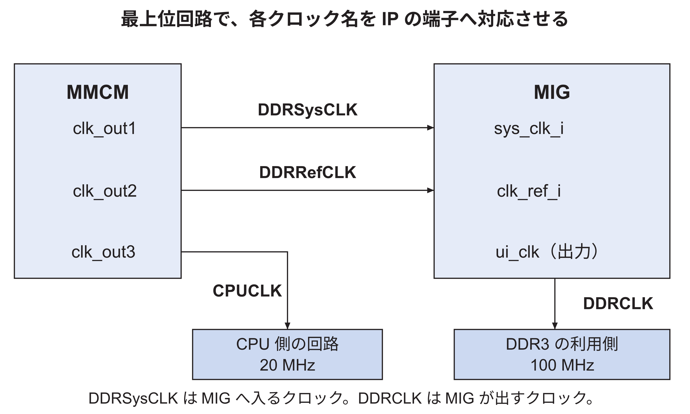

特に、MIGのsys_clk_iへ入るDDRSysCLKと、MIGのui_clkから出るDDRCLKを取り違えない。CPUCLKとDDRCLKは別の利用側のクロックなので、その間の要求を渡すにはクロック変換回路が必要になる。この図はクロックの配線に絞っており、リセットやメモリ要求の線は省いている。


<a id="s_E_9"></a>
#### E.9 XDCで基板の端子と時間条件を指定する

追加するのはfpga/constraints/constraints-nexysvideo.xdcである。例えば基板の発振器につながるR4を、最上位のclkへ割り当てる。次の二行は、「clkという端子をR4に置き、その端子を3.3 VのLVCMOSとして扱う」という意味になる。

```tcl
set_property PACKAGE_PIN R4 [get_ports clk]
set_property IOSTANDARD LVCMOS33 [get_ports clk]
```

get_ports clkは、設計の中からclkという外部端子を選ぶ命令である。PACKAGE_PINは物理的な端子位置、IOSTANDARDは電気的な規格を指定する。名前だけ合っていても別の位置へ割り当てれば発振器とつながらない。位置だけ合っていても電気規格が違えば正しい接続とはいえない。

スイッチ用のGPIはVADJの既定値1.2 Vに合わせてLVCMOS12、LED用のGPOはLVCMOS25、resetnはLVCMOS15である。端子群によって異なるため、clkのLVCMOS33をすべての端子へコピーしてはいけない。DDR3の端子と専用の時間条件はMIGの設定から供給する。担当するファイルを分け、同じ条件を重複して指定しない。

さらに、外部信号が来る時刻や、外へ出すまでに使える時間を記す。SDカード用SPIでは、CPUの周期50 nsのうち、出力とカード側の応答に時間を割り当てた条件を使う。これはカードがどんなに遅くてもよいという指定ではない。選んだカードがその条件で動くことも確認する必要がある。

<a id="s_E_10"></a>
#### E.10 Linuxへ実機の構成を伝える

追加するのはlinux/devicetree/wally-nexysvideo.dtsである。Linuxは、FPGA内部で何MHzのクロックを作ったかや、基板に何byteのメモリが付いているかを、この文章を読まずに自動で全て知るわけではない。起動時にデバイスツリーを渡して知らせる。

```text
memory@80000000 {
  device_type = "memory";
  reg = <0x00 0x80000000 0x00 0x20000000>;
};
```

このregでは、最初の二つが開始番地、次の二つが容量である。各組の先頭の0は上位32 bitで、後ろが下位32 bitになる。開始0x80000000、容量0x20000000 byteと読む。[E.2](#s_E_2)のEXT_MEM_RANGEとは異なり、ここは「容量−1」ではなく容量を書く。

CPU、時刻計数の基準、UARTにも、回路に合う20,000,000 Hzを指定する。例えばUARTが実際と異なる周波数を前提にすると、文字を送る間隔が合わず、受信側で文字化けする可能性がある。DTSを直しただけでは回路の周波数は変わらない。回路の設定と、それをソフトウェアへ知らせる情報をそろえる作業である。

この初期段階には画像用の予約領域はない。RasterIXを追加した最終版では、第10.8節のとおり、Linuxと画像用の領域をさらに分ける。初期版と最終版のDTSを混ぜて使わない。

<a id="s_E_11"></a>
#### E.11 makeの入口とVivadoの読込先を追加する

編集するのはfpga/generator/Makefileとfpga/generator/wally.tclである。Makefileにはnexysvideoという入口を加える。利用者がmake nexysvideoと指定したときに、次の値が生成手順へ渡るようにする。

```make
nexysvideo: export XILINX_PART := xc7a200tsbg484-1
nexysvideo: export XILINX_BOARD := digilentinc.com:nexys_video:part0:1.2
nexysvideo: export board := nexysvideo
nexysvideo: export SYSTEMCLOCK := 20000000
nexysvideo: export MAXSDCCLOCK := 5000000
```

型番にはFPGAの種類だけでなく、パッケージと速度等級も含まれる。違う部品を指定して配置した結果を、実物へそのまま使うことはできない。MAXSDCCLOCKは起動コードで使う上限である。Linux側のSD設定は別なので、両者の値が違う場合に、同じ処理の設定が矛盾していると即断しない。

Makefileの依存関係では、クロック、DDR3、リセット、変換IPなどを先に生成し、それから全体を生成する。wally.tclではboardがnexysvideoの場合に、fpgaTopNexysVideo.sv、DDR3とMMCMのIP、constraints-nexysvideo.xdcを選ぶ。新しいRTLを保存しただけでは、自動で生成対象へ入らないため、この読込先も必要である。

ほかに、出力先のsimフォルダ作成と、このボード向けの配置配線後の物理最適化を有効にした。最初のボード構成では回路内のロジックアナライザーを追加していない。全変更は11-wally.tcl.patchで確認できる。現在の完成版には描画回路用の追加読込もあるため、初期の変更を学ぶときはこの差分を読む。

<a id="s_E_12"></a>
#### E.12 READMEと答え合わせまでを含める

最後にfpga/README.mdへ、Nexys Videoの生成対象と起動条件を書く。READMEは回路を動かすコードではないが、利用者が正しいボード名、SDカード、端末条件を選ぶために必要になる。専用の別説明書を増やす代わりに、ほかのボードと同じ入口へ情報を足す。

ここまでで、[E.2](#s_E_2)の1ファイル、[E.3](#s_E_3)〜[E.10](#s_E_10)の8ファイル、[E.11](#s_E_11)の2ファイル、READMEの1ファイル、合計12ファイルになる。[E.3](#s_E_3)の設定は新規追加、[E.6](#s_E_6)の共通スクリプトは既存編集というように、新規と変更を区別して数える。

答え合わせは三段階に分ける。まずソースを対象コミットと比較し、意図した12ファイルになったことを確かめる。次にVivadoで生成し、端子、クロック、配置配線、時間条件のレポートを見る。最後に実機で起動、メモリ、文字入出力を確かめる。ソースの一致だけで実機動作の確認を省かない。

<a id="ch_F"></a>
### 付録F 発表の前に、理由を含めて答える練習

<a id="s_F_1"></a>
#### F.1 「結局、何を自分で作ったのですか」

短い答えは、「公開CPUをNexys Videoに対応させ、公式の描画回路へ指示を渡す接続と、画像を安全に切り替える接続を加えました」である。詳しくは第5〜10章を使う。CPUやRasterIXの全内部を一から設計したという意味ではない。利用した部分と作った部分を図5.1で指せるようにする。

相手がさらに知りたい場合は、CPUの一回の書き込みが、番地の判定、APBの接続、FIFOを通って描画回路へ届く例を説明する。単なる部品名の一覧より、「相手が忙しい間は書き込みを待たせ、受け取ったときだけ次へ進む」という問題と対処を添えると、接続の仕事が伝わりやすい。

<a id="s_F_2"></a>
#### F.2 「FPGAでなければならないのですか」

二次元ゲームを遊ぶだけなら、一般のパソコンなど別の方法もある。本研究では、CPUと周辺回路の接続を自分で変更し、動作を確かめることが対象なので、内部回路を変更できるFPGAを用いた。パソコン上で同じゲームを作ることと、ゲームを実行する回路の接続を作ることを分けて説明する。

また、FPGAを使うだけで研究上の価値が決まるわけではない。どの接続問題を扱い、どう実装し、どの条件で確認したかが成果である。Wallyの学習者が設計を参照できるという目的は、その具体的な資料と対応させる。教育効果を測っていないのに「学習効率が向上した」とは言わない。

<a id="s_F_3"></a>
#### F.3 「OpenGLなら全部自動でつながるのですか」

OpenGLに沿った関数を使うと、図形や色をプログラムから指定できる。しかし、その呼び出しを回路用の命令へ変え、実機のどの番地へ送るかは別の問題である。今回、その橋渡しをライブラリとWallyBusConnector、APB接続回路が担当する。使いやすい描画の入口と、装置固有の接続の両方が必要だったと答える。

CPUが全画素を直接書く方法との厳密な速度比較は行っていないため、必ずそちらより速いとは言わない。本研究では、図形を指定するプログラムと公開描画回路を使う構成を選び、その接続と動作を示した。別方式との優劣は、条件をそろえた追加比較の問いになる。

<a id="s_F_4"></a>
#### F.4 「命令を送り終わったら、その画像がもう見えていますか」

送信完了だけでは、その画像が表示済みかは分からない。CPUから渡された命令をFIFOが受け取り、描画回路が処理し、画像をメモリへ書き、表示回路が読み出す。先に送った命令の描画は、後の命令をまだ送っている間にも進むので、送信が終わってから初めて描画が始まるわけでもない。送信完了、描画完了、表示先の切り替え完了を別の出来事として確認する。[第7章](本文.md#ch_7)と[第10章](本文.md#ch_10)の図で、この三つの位置を示す。

完了回数が増えたという記録も、ディスプレイの全画素をカメラで確認した記録ではない。本研究では回路の完了記録、メモリ内の画素比較、録画の動きを組み合わせた。異なる確認を組み合わせる理由を、どれか一つが不十分だからというだけでなく、見ている対象が違うからと説明する。

<a id="s_F_5"></a>
#### F.5 「部分描画は、描くものを省いているのですか」

前と同じまま残っている画素を再利用し、変化した結果に必要な場所を描き直している。例えばボールが動いたら、古い位置を消し、新しい位置へ描く。ただし古い位置に壁が重なれば壁も復元する。さらに画像AとBに残る前回の内容が違うので、二枚の履歴を別々に持つ。

同じゲーム状態から、CPU側の比較用プログラムで全体を塗った期待画像を作り、実機の画像と比較する。これにより、速さのために必要な物体を省いていないかを確かめる。期待画像の作り方は12.5節で説明した。確認したのは保存した試行の範囲であり、すべての入力や全時刻について正しさを数学的に証明したという意味ではない。

<a id="s_F_6"></a>
#### F.6 「測定結果のどこまでが確かなのですか」

まず、どの構成の値かを答える。標準DVI構成での実機受け入れ確認と、実験用HDMI構成での方式比較は、第13.1節で分けている。次に、何を数えた値かを答える。例えば一秒当たりの画面切り替え完了数を、そのまま実際に見えた新画像のFPSと言い換えない。

最後に、比較から何が言えるかを答える。同じ状態列で描画準備時間と命令量が減ったことは、仕事量を減らす改善を裏付ける。一方、それだけでCPU内部の全命令やキャッシュの費用まで分かったことにはならない。「結果が分かった部分」と「さらに分けて測る部分」を、[第13章](本文.md#ch_13)の具体的な数字で説明する。

<a id="ch_L"></a>
### 付録L 設計ファイルと開発手順

<a id="s_L_1"></a>
#### L.1 開発用パソコンで行うこと

開発用パソコンでは、回路のソースを編集し、FPGAを設定するファイルを生成する。ゲームのソースも編集し、Wally上で動く実行ファイルを生成する。この二つは異なる生成物である。回路の設定ファイルはFPGAへ送り、ゲームの実行ファイルは実機が使うSDカードへ置く。

今回、開発環境にはWindowsとWSL上のUbuntuを使った。WSLはWindows上でLinux環境を利用するための仕組みである。一方、ゲーム実行中のLinuxは、FPGA内のWallyで動くLinuxである。開発用Ubuntuのターミナルと、実機へつないだ端末では、実行する場所が違う。本稿の作業手順には「開発用Ubuntu」「実機のLinux」などと実行場所を記す。

<a id="s_L_2"></a>
#### L.2 ファイルの種類

| 種類 | 例 | 何を記すか | 使用する道具 |
|---|---|---|---|
| 回路の記述 | .sv、.v | 信号、計算、記憶、部品同士の接続 | Vivado、回路シミュレータ |
| FPGA生成の手順 | .tcl | 部品の生成、ソースの読み込み、配置配線の指示 | Vivado |
| 制約 | .xdc | 外部端子の割り当て、電気規格、時間条件 | Vivado |
| メモリ制御の設定 | .prj | DDR3の種類、幅、配線など | MIGというIP生成機能 |
| Linuxへ渡す説明 | .dts | メモリ範囲、周辺機器の位置、クロック値 | dtc |
| ゲームのソース | .cpp、.hpp | 入力、規則、描画の呼び出し | C++コンパイラ |
| 生成対象の選択 | Makefile、CMakeLists.txt | どの設定とファイルを使って生成するか | make、CMake |

「この値を変える」ときは、どの種類の値なのかを先に決める。例えばCPUのクロックを実際に作る設定と、LinuxへCPUのクロックを知らせる設定は別のファイルにある。片方だけ変えると、実際の回路とソフトウェアが前提とする値がずれる。

<a id="h2225"></a>
##### ファイルと回路部品と信号の名前を区別する

例えば`fpga/src/rasterix_apb.sv`は保存場所を含めたファイル名であり、その中の`module rasterix_apb`は回路部品の種類を定義する名前である。その種類の部品を別の回路の中へ一個置く記述を、インスタンス化と呼ぶ。置かれた一個には、識別するための名前も付く。

説明用の部品Adderを、一個calcという名前で置く例を考える。AdderにA、B、Sumという端子があるとき、`.A(left)`は「この部品のAという端子を、外側のleftという信号へつなぐ」と読む。端子名Aと接続する信号名leftが同じである必要はない。

```systemverilog
// Explanatory example, not the Wally top module.
Adder calc(.A(left), .B(right), .Sum(total));
```

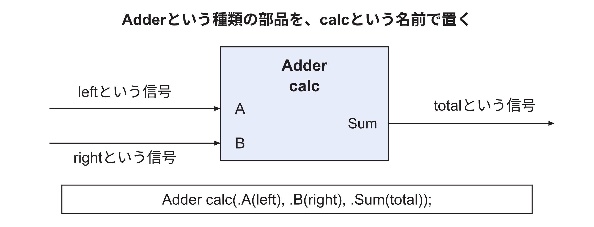

図L.1の枠の内側にあるA、B、Sumが部品の端子名で、枠の外のleft、right、totalが接続先である。この記述を読むと、数百行の最上位回路も「どの部品のどの端子へ、何をつなぐか」の集まりとして分けられる。端子を列挙する順番は、部品を時間順に動かす順序ではない。

IPという言葉は、このように再利用できる回路部品を指す場合に使う。本稿のMIGやClocking WizardはVivadoで生成するIPである。IPの設定を変えるTcl、生成されたIP、IPをつなぐSystemVerilogを別々に確認する。

<a id="s_L_3"></a>
#### L.3 回路をFPGAへ入れるまで

回路のソースを、FPGAで使える論理部品の組合せへ変換する工程を合成と呼ぶ。次に、どの部品をFPGA内のどこへ置くかを決め、配線をつなぐ。これを配置配線と呼ぶ。最後に、その接続を設定するデータを生成する。このデータがビットストリームであり、通常は.bitという拡張子のファイルになる。

FPGAへビットストリームを書き込むと、その設定に従った回路が働く。回路を配置できても、必要な時間内に信号が届くとは限らない。そのため、配置配線後の時間解析も確認する。さらに、時間解析が成功しても、プログラムと回路の約束が一致しているかは別に確かめる。


図L.2では、設計ファイルから実機へ渡すまでを上下二段に分けた。


上段の.bitファイルは、FPGAの中にどの回路を作るかを指定する。下段の実行ファイルは、その回路の中のCPUが順に実行する命令を持つ。青い箱はファイルを変換する道具、白い箱は入出力のファイルを表す。C++をコンパイルしただけでは、FPGAの回路設定は変わらない。逆に、回路を設定しただけではゲームの命令列は用意できない。

<a id="h2238"></a>
##### 同じビルドという言葉で二種類の生成を呼んでいる

ゲームのC++をコンパイルすると、Wallyが順に読み取る機械語命令ができる。CPUの配線はこの操作だけでは変わらない。回路のSystemVerilogをVivadoへ渡すと、FPGAの計算・記憶・配線を設定するデータができる。こちらはCPUや周辺回路そのものの構成を変える。

例えばボールの移動量を変えたい場合は、通常はゲームのソースを変更して実行ファイルを作り直す。一方、命令FIFOの容量を変えたい場合は回路の生成設定を変え、合成と配置配線を行い、FPGAへ新しいbitstreamを設定する。さらに、ソフトウェア側が容量に依存していればその設定もそろえる。

ソフトウェアだけ直したのに古い実行ファイルをSDカードから起動すると、修正は実機へ届かない。同じように回路ソースを直しただけでFPGAを書き換えなければ、動いている回路は以前のままである。再現手順でファイルのハッシュを照合するのは、編集したものと実行しているものを結び付けるためである。

<a id="s_L_4"></a>
#### L.4 Linuxとゲームを準備する

Linuxを起動するには、OS本体、起動時に使うプログラム、ファイル群、実機の構成を説明するデータが必要になる。本研究ではWallyが用意するBuildrootの設定を利用した。Buildrootは、小さなLinuxシステムと、そのCPU向けの開発道具を生成する仕組みである。

ゲームを開発用パソコンでコンパイルするときも、実行先はWallyである。そのため、パソコン用のコンパイラではなく、RISC-V Linux向けのコンパイラを指定する。別の機械向けに実行ファイルを作ることをクロスコンパイルと呼ぶ。ビルドに成功したら、fileなどで実行ファイルの対象がRISC-Vであることを確認する。

<a id="s_L_5"></a>
#### L.5 同じソースの版を使う

ソース管理のGitでは、ある時点の変更をコミットとして記録する。コミットには識別番号があり、その番号を指定すれば、後で更新が入っても同じ版を取得できる。初期版の再現演習はd3e181ac434a01a1f174549b5fbc7ee03a8875b4を基準とする[Console26](#ref_Console26)。接続比較版E6は、[技術付録29.2節](#s_29_2)に示す公開コミットを取得する。

サブモジュールは、別のリポジトリを特定の版で組み込む仕組みである。今回、addins/rasterixには公式RasterIXの9fdcf97a31b2e4247594e06d605871980cd5e9e1を固定した。親のリポジトリを取得しただけで中身がそろっていない場合があるので、サブモジュールも取得する。[第14章](本文.md#ch_14)でそのコマンドを示す。

版をそろえる理由は、同じファイル名でも中身が違えば、接続条件や実行結果が変わり得るからである。再現では、版番号、設定、生成したファイル、実行した入力を一緒に記録する。画像が似ていることだけで、同じ条件を使ったと判断しない。


<a id="s_L_6"></a>
#### L.6 ソースを直したのに回路が変わらない理由

FPGAでは、画面上でソースを書き換えただけでは、基板の回路は変わらない。例えば、CPUのクロックを作るTclの数値を変えても、そのTclからIPを再生成し、回路全体を配置配線し、新しいbitstreamを書き込むまで、基板は以前の回路のまま動く。この途中にある「生成されたファイル」を把握することが、再現作業の出発点になる。

本構成では、編集する設定、生成された設定、実機へ渡すデータを分けて考える。`config/derivlist.txt`は人が編集する派生構成の記述であり、生成後の`config.vh`はその結果である。`fpga/generator/axiscdc.tcl`はFIFOの生成条件であり、`.xci`はVivadoが保存するIPの構成である。最終的な`.bit`はFPGAへ渡す回路設定であり、C++の実行ファイルとは別のものになる。[Console26](#ref_Console26)

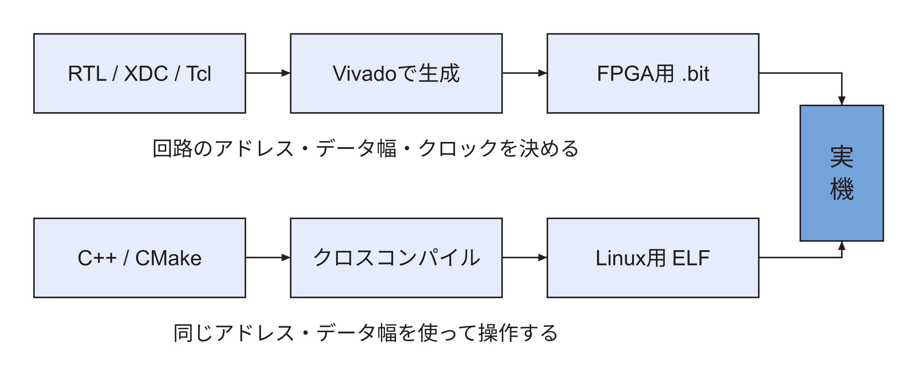

図L.3の上下二本の経路は、回路とアプリケーションを表す。上の経路だけを更新しても、アプリケーションが古いアドレスへ書き込めば動かない。下の経路だけを更新しても、FPGA内のレジスタ配置は変わらない。両経路が合流する場所が、実機上のバス接続である。

| 変更したもの | 作り直すもの | 実機で取り替えるもの |
|---|---|---|
| RTL、XDC、IP生成条件 | FPGA全体の生成物 | bitstream |
| C++、描画ライブラリのコンパイル設定 | ゲーム実行ファイル | SD上などの実行ファイル |
| デバイスツリーの予約領域 | dtb | SDの起動用dtb |
| CPUクロックと起動コードの定数 | IP、回路、起動コード、関連するdtb | bitstreamとdtbなど |

ここで、`CopiedFiles_do_not_add_to_repo`というフォルダ名にも意味がある。元ソースからビルドのためにコピーしたファイルを置く場所なので、そこだけ直しても、次の生成で元の内容へ戻り得る。変更を残す場所は元ソースであり、コピー先は生成結果を確認する場所である。修正が反映されない場合は、まず「編集した元ファイルが、今回の生成で読まれたか」を調べる。

<a id="s_L_7"></a>
#### L.7 どのコードを自分が設計するのか

同じゲーム機を作れるという目標は、CPU、DDR3制御回路、描画器をすべて一から作ることとは異なる。本研究でも、それらの既存部品を利用した。その上で設計者が決めるのは、部品に渡すクロック、使うアドレス、命令の受け渡し方法、メモリの分け方、画面切り替えの完了条件である。

既存部品を使う場合でも、入口と出口の約束を説明する必要がある。例えば「命令を渡せる」という説明を具体化すると、32 bitのデータを渡すこと、最後の語に印を付けること、受け側が止まった間は同じデータを保つことになる。この約束を回路とソフトウェアの両方で満たすのが、接続を設計する仕事である。[第7章](本文.md#ch_7)と[付録G](#ch_G)では、この約束からコードを組み立てる。

<a id="s_L_8"></a>
#### L.8 一つの変更を、編集から実機まで追う

「ボールを速くする」と「CPUのクロックを速くする」は、画面ではどちらも動きに関係しそうに見える。しかし、変える物が違う。ボールの移動量はゲームの計算で使う数であり、CPUクロックは回路を動かす信号である。最初に、どちらを変えたいかを決める。

ボールの移動量なら、まずBreakout.hppのゲーム規則を調べる。変更したC++をRISC-V用コンパイラで実行ファイルへ変換し、実機側のファイルと取り替えて起動する。FPGA内のCPUや描画回路は、同じ回路を使い続けられる。コンパイルするパソコンと、生成したファイルを実行するWallyは別のCPUなので、コンパイラの対象もRISC-Vにする。

CPUクロックなら、まずクロック生成用のTclと、それを使う回路を調べる。IPを再生成し、全回路の合成と配置配線を行い、時間条件を確認してから新しい.bitをFPGAへ渡す。CPUの周波数をソフトウェアへ伝える定数やデバイスツリーも一致させる必要がある。C++をコンパイルし直すだけでは、このクロック信号は変わらない。

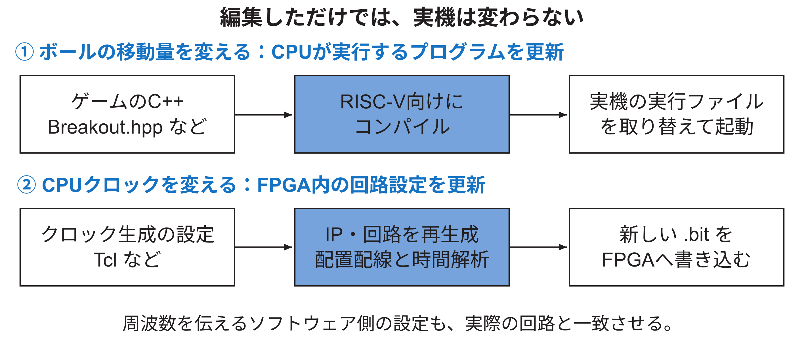

図L.4の上段と下段で、最後に取り替える物を確認する。上段はCPUが読むプログラム、下段はFPGAの回路設定である。実機が変わらないときは、最後の受け渡しまで進めたかを調べる。この図は変更の種類を示す例であり、周波数を上げても必ず動くという実験結果ではない。

<a id="ch_M"></a>
### 付録M 同じゲーム機を作り直す手順

ここからは、これまで説明した接続を同じ版のソースから生成し、実機で確認する順序を示す。コマンドの前に実行場所を確認し、後に何が出来たかを確認する。開発用Ubuntuでの成功、FPGAの設定成功、Wally上のLinux起動、ゲームの画像表示は、それぞれ別の段階である。前段が出来たことを確かめてから次へ進む。

<a id="s_M_1"></a>
#### M.1 再現の二つの進め方

完成した構成を動かす場合は、本章の手順で固定した版を取得し、回路とソフトウェアを生成する。変更そのものを理解して再実装する場合は、[付録A](#ch_A)と付属の「NexysVideo対応を変更前から再現する.md」を使う。後者は、対応前の版から12ファイルを順に変更する演習である。

完成形のクローンだけでは、どこを設計したかは分かりにくい。一方、最初から全差分を手で書くと、動作する基準を持てない。まず完成形のソースと生成物を確認し、その後、別の作業場所で変更を再現すると、誤った箇所を比べやすい。

以下のコマンドは、これから読者が再実行するための手順である。原稿作成時にFPGAを書き換えたりSDカードへ書き込んだりした、という記録ではない。保存済みの実機結果は[第13章](本文.md#ch_13)に区別して示した。


図M.1は、再現作業を進める順序と、この章の該当節を対応させた案内である。


まず同じソースを用意し、次に回路を作る。Linuxの文字出力を確かめてから、ゲームの実行と画像の確認へ進む。各段階の名前と節番号を読めば、色がなくても順番を追える。途中で止まった場合は、その段階に入るファイル、設定、ログを前の段階と比べる。

<a id="s_M_2"></a>
#### M.2 必要な機器と道具

| 用意するもの | 用途 | 確認する点 |
|---|---|---|
| Nexys Videoと12 V電源 | 回路を動かす | 基板の型名と電源仕様 |
| USB PROGへの接続 | FPGAへ回路設定を送る | J12側であること |
| USB UARTへの接続 | 実機Linuxの文字端末 | J13側であること |
| microSDとカードリーダー | 起動データとゲームを保存 | 保存済みデータの扱い |
| 映像を受ける機器とケーブル | HDMI OUTからの映像確認 | 640×480のDVI映像を受けられるか |
| Ubuntuの開発環境 | ソース取得とビルド | 十分な空き容量と必要な権限 |
| Vivado | FPGAの生成と書き込み | 対象Artix-7と基板定義 |
| RISC-V用ツール群 | 起動コードとLinuxアプリの生成 | bare-metal用とLinux用の区別 |

本研究の生成記録にはVivado 2025.2を用いている。別版を用いるとIPの版や配置配線結果が変わる可能性がある。生成前にvivado -versionを保存する。USB共有やSDWire3は特定の作業環境を遠隔操作するための補助であり、ゲーム機の構成に必須ではない。

<a id="s_M_3"></a>
#### M.3 固定したソースを取得する

実行場所は開発用Ubuntuである。新しい空のディレクトリへ取得し、現在使っている開発フォルダを上書きしない。次のwally-reproduceは、この説明で新しく作る作業用フォルダ名である。

```bash
mkdir -p "$HOME/projects"
cd "$HOME/projects"
git clone --recurse-submodules \
  https://github.com/SoshiroFujimori/wally-game-console.git \
  wally-reproduce
cd wally-reproduce
git checkout d3e181ac434a01a1f174549b5fbc7ee03a8875b4
git submodule update --init --recursive
```

cloneは親リポジトリを取得する。checkoutは本稿の版へ合わせる。submodule updateは、親が指定するRasterIXなどの版を取得する。初回のcloneが将来のmainを取っていても、checkout後のsubmodule updateで本稿の指定へそろえる。

次に版を確認する。長いハッシュ値は、その版を特定する識別子である。出力が違う場合は、そのまま「同じ構成」として先へ進まない。

```bash
git rev-parse HEAD
git -C addins/rasterix rev-parse HEAD
git status --short
git submodule status --recursive
```

最初の二行の期待値は8.1節の二つのハッシュである。git status --shortが何も出さなければ、追跡対象ファイルに変更がない。サブモジュールに先頭の+や-がある場合は、指定版との差や未初期化を調べる。

<a id="s_M_4"></a>
#### M.4 開発用の道具を準備する

WALLYは、このリポジトリの場所を示す既存の環境変数である。独自の変数名へ置き換える必要はない。リポジトリの直下で次のように設定する。

```bash
export WALLY="$PWD"
```

まだWally用のツール群がない新規環境では、固定版のREADMEに従い、必要なパッケージとツール群を準備する。利用者権限でツールを入れる場合、既存手順は次の形である。

```bash
sudo "$WALLY/bin/wally-package-install.sh"
"$WALLY/bin/wally-tool-chain-install.sh"
source "$WALLY/setup.sh"
```

最初の行はUbuntuのパッケージを追加する操作である。二行目はコンパイラ、エミュレータ、Buildrootなどを生成する。時間と数十GBの空き領域を使うため、既存のツール群がある環境で無条件にやり直す手順ではない。三行目は、その端末で必要なパスや変数を設定する。[Console26](#ref_Console26)

この導入スクリプトが取得する外部プロジェクトには、ブランチ名による指定もある。親リポジトリの版を固定しただけで、後日生成される全ツールが同一になるとは限らない。再現記録には、Vivado、各コンパイラ、Buildrootのコミット、Linux設定を残す。保存済み数値との完全な再現性を論じるときは、ソースだけでなく道具の版も対象になる。

```bash
command -v vivado
riscv64-unknown-elf-gcc --version
command -v dtc
printf '%s\n' "$WALLY" "$RISCV"
```

ここでunknown-elfは主に起動用のプログラムなどに使う道具である。後でLinux上のゲームを作るときは、別のriscv64-buildroot-linux-gnu-g++を指定する。名前が似ていても、実行環境が違う。

<a id="s_M_5"></a>
#### M.5 FPGAの回路を生成する

Vivadoのsettings64.shを、そのインストール場所から読み込む。保存した環境の例は次の通りである。別のパソコンではインストール先を実際の場所へ合わせる。

```bash
source "$HOME/AMD/2025.2/Vivado/settings64.sh"
cd "$WALLY/fpga/generator"
make nexysvideo-rasterix
```

nexysvideo-rasterixは、Nexys VideoとRasterIXを有効にする生成対象である。描画なしの基板対応だけを確認する場合はmake nexysvideoを使う。生成されるIPのフォルダは共有されるため、同じ作業場所で別の基板設定から切り替える場合は、既存READMEのcleanIPの説明も確認する。新規の再現用クローンでは、他の作業の生成物を消す必要はない。

生成の途中には、構成設定の展開、起動コードの生成、IP生成、合成、配置配線、bitstream生成がある。最後に文字端末がVivadoの入力待ちになる場合もある。単に処理が止まったように見えるだけで失敗と決めず、ログとrunの状態を確認する。

成功の判断は、.bitファイルが存在することだけでは足りない。wally.log内のERROR、配置配線の終了状態、reports以下の時間解析を確認する。生成途中の古い.bitを、今回成功したものと取り違えないよう、生成時刻とハッシュを記録する。

<a id="s_M_6"></a>
#### M.6 実装レポートを保存する

VivadoでWallyFPGA.xprを開き、配置配線結果impl_1を開いた状態で、次のようなレポートを作る。report_timing_summaryは時間条件、report_utilizationは資源使用量、report_drcは設計規則の指摘を保存する。

```tcl
open_run impl_1
report_clocks -file reproduced-clocks.rpt
report_timing_summary -file reproduced-timing.rpt
report_utilization -hierarchical -file reproduced-use.rpt
report_drc -file reproduced-drc.rpt
report_cdc -file reproduced-cdc.rpt
```

CPU20 MHz、描画側100 MHz、画素25.2 MHzなど、意図したクロックが認識されているかを見る。時間余裕が負であれば、その生成物を成功扱いにしない。元のレポートと値が少し違う場合は、ツール版や生成条件を比較する。元の+0.170 nsを、再生成していない結果の欄へ写してはならない。

<a id="s_M_7"></a>
#### M.7 Linuxとデバイスツリーを用意する

Wallyの導入手順でBuildrootが準備できたら、そのoutput/imagesにLinuxのImage、fw_jump.binなどがあるか確認する。新しくLinuxを生成する必要がある場合はlinux/README.mdに従う。既存のlinux/Makefileの既定処理には掃除や移動も含まれるため、既に使用しているBuildrootを無条件に上書きする操作として使わない。

RasterIX付き構成では、wally-nexysvideo-rasterix.dtsを使う。描画なし用のdtsでは画像領域の予約が一致しない。次は作業用ディレクトリへdtbを生成する例である。

```bash
mkdir -p "$HOME/wally-reproduce-output"
cd "$HOME/wally-reproduce-output"
dtc -I dts -O dtb \
  -i "$WALLY/linux/devicetree" \
  -o wally-nexysvideo-rasterix.dtb \
  "$WALLY/linux/devicetree/wally-nexysvideo-rasterix.dts"
```

dtsは人が読む設定、dtbは起動時に渡すバイナリ形式である。生成したdtbを逆変換して、メモリ容量とreserved-memoryを確認できる。32 MiBの予約領域が0x9e000000から始まること、CPU等のクロック値が20,000,000であることを、元のdtsと照らす。

<a id="s_M_8"></a>
#### M.8 SDカードへ起動データを入れる

SDカードへの書き込みは、そのカードの内容を置き換える操作である。まずカードを挿す前後でlsblkを読み、容量と機種名で対象を特定する。本稿では、特定の/dev/sdbなどを正解として固定しない。パソコンによって番号が変わるためである。

```bash
lsblk -o NAME,SIZE,MODEL,TRAN,MOUNTPOINTS
```

対象カードが分かったら、必要な既存データを保存し、そのカード上のファイルシステムをアンマウントする。linux/sdcard/flash-sd.shへ、Buildrootの場所、生成したdtb、カード全体のデバイスを渡す。次は置き換える項目を示した書式であり、山括弧のまま実行するコマンドではない。

```text
sudo "$WALLY/linux/sdcard/flash-sd.sh" \
  -b <Buildrootの場所> \
  -d <wally-nexysvideo-rasterix.dtbの場所> <カード全体>
```

書き込み完了後に同期と取り外しを行い、Nexys VideoのmicroSDスロットへ入れる。操作補助としてSDWire3を使う場合も、共有先の切り替えは実験環境の手順であり、回路ソースへ専用処理を追加する理由にはならない。

<a id="s_M_9"></a>
#### M.9 FPGAを書き込み、文字端末で起動を見る

基板を指定の電源で動かし、JP4はJTAG設定、VADJは標準の1.2 Vとする。USB PROGはJ12、UARTは別のJ13である。VivadoのHardware Managerで対象を開き、今回生成した.bitを指定してFPGAへ書き込む。[NexysVideo](#ref_NexysVideo)[Console26](#ref_Console26)

文字端末は115200 bpsで接続する。Ubuntu側でUARTの実デバイス名を確認してから使う。次の/dev/ttyUSB_UARTは、実際に検出した名前へ置き換えるための表記である。

```text
picocom -b 115200 /dev/ttyUSB_UART
```

CPU RESETを押すと、CPU側が再起動する。FPGA設定を消す操作とは区別する。端末に起動ログが出てLinuxのプロンプトへ到達するか確認する。何も出なければ、まず端子の取り違え、デバイス名、通信速度、書き込んだbitstreamを確認する。いきなり描画ライブラリを変更する段階ではない。

<a id="s_M_10"></a>
#### M.10 ゲームをクロスコンパイルする

実行場所を開発用Ubuntuへ戻す。Buildrootのhost/binをPATHへ加える。次の例はRISCV配下の標準的な場所を使うため、実際の導入場所が異なる場合は合わせる。

```bash
export PATH="$RISCV/buildroot/output/host/bin:$PATH"
cd "$HOME/wally-reproduce-output"
cmake -S "$WALLY/examples/rasterix" -B rasterix-build \
  -DCMAKE_SYSTEM_NAME=Linux \
  -DCMAKE_SYSTEM_PROCESSOR=riscv64 \
  -DCMAKE_C_COMPILER=riscv64-buildroot-linux-gnu-gcc \
  -DCMAKE_CXX_COMPILER=riscv64-buildroot-linux-gnu-g++ \
  -DCMAKE_BUILD_TYPE=Release
cmake --build rasterix-build -j
file rasterix-build/rasterix-breakout
```

fileの結果がRISC-V向けELFになっていることを確認する。x86-64などと出た場合は、開発用パソコン向けに作っている。成功した実行ファイルはSDカードの実機から読める領域へコピーし、開発側と実機側でSHA-256を照合する。

ファイルの置き場所とマウント先はカードの構成に依存する。起動用の生データ領域へ、通常ファイルを直接書き込んではならない。実験で使用するフォルダをファイルシステム上に作り、そこへ実行ファイルと記録を置く。

<a id="s_M_11"></a>
#### M.11 実機でゲームを動かす

実行場所はWally上のLinuxである。/dev/memを使える権限で、実行ファイルを置いたフォルダへ移る。まず識別値の不一致やタイムアウトが出ないかを見ながら、時間を区切って実行する。

```bash
./rasterix-breakout --demo --seconds 80
```

--demoは自動操作、--seconds 80は約80秒で終了する指定である。終了時にはscore、lives、frames、ticks、elapsedを含む行が出る。保存した基準実行では400点、残機3でクリアした。ただし、処理時間や完了数まで一文字単位で一致することを期待しない。

手動操作では引数を付けずに実行し、Aで左、Dで右、Sで停止、Spaceで開始、Rで再開始、Qで終了を使う。移動は押した方向へ継続する方式であり、キーを離した瞬間を受け取る方式ではない。Wiiコントローラーをつないだ試験としては扱わない。

<a id="s_M_12"></a>
#### M.12 正しさの確認を段階的に行う

最初に文字端末の起動を確認し、次に描画回路の識別値、単色画像、ゲームの順に進める。単色で色がおかしい場合は、ゲームの当たり判定より先に、画素形式とアドレスを調べる。最終画像を読み戻して期待値と比べ、さらに映像として表示されることを確かめる。

専用の試験コードは、製品リポジトリの通常ソースへ混ぜず、付属の再現資料/試験と測定へ置く。APBの最小試験を再実行するスクリプトと、過去の測定ソース、設定、集計対象ファイルを添えた。試験のREADMEには、何を検査し、どこまでを合格と扱うかを記す。

<a id="s_M_13"></a>
#### M.13 性能比較をやり直すときの順番

まず、測定プログラムの版と出力回路の構成を決める。次に、比較する描き方、場面、入力、準備30画面、測定180画面、反復三回を保存する。試行順も実行前に決め、途中で都合の良い試行だけを選び直さない。

各試行から、時間、命令量、状態列、最終画像を保存する。方式間で状態が同じか、最終画像が同じかを調べてから、時間を比較する。速くても画像が間違っている場合は、性能改善の成功として扱わない。三試行ごとの代表値とばらつきを求め、図表には出力回路の条件も書く。

今回付属させたE4の記録には、実験用HDMI構成の結果が含まれる。標準DVI構成で新たに比較する場合は、新しい実験番号を付け、同じ手順でも別の構成の結果として保存する。元のJSONやCSVへ新しい値を上書きしない。

<a id="s_M_14"></a>
#### M.14 動かないとき、どこへ戻るか

| 症状 | 最初に確認するもの | 次に読む説明 |
|---|---|---|
| Vivadoが対象を見つけない | USB PROG、電源、JTAG設定 | [M.9](#s_M_9)節、基板資料 |
| UARTに何も出ない | UART用USB、速度、bitstream | 6章、[M.9](#s_M_9)節 |
| Linux起動で止まる | SDの起動データ、DTB、DDR3 | [6.6](本文.md#s_6_6)〜[6.7](本文.md#s_6_7)節、[M.7](#s_M_7)節 |
| 識別値が違う | RasterIX付き回路か、MMIO番地 | [7.1](本文.md#s_7_1)節、[7.5](本文.md#s_7_5)節 |
| 命令転送が止まる | FIFO、リセット、応答経路 | [7.3](本文.md#s_7_3)〜[7.4](本文.md#s_7_4)節、[8.5](本文.md#s_8_5)節 |
| 画像は正しいが映らない | 表示の設定、映像形式、受信側 | [10.5](本文.md#s_10_5)〜[10.7](本文.md#s_10_7)節 |
| 起動し直すと古い絵が出る | 内部領域と二枚の初期化 | [10.4](本文.md#s_10_4)節、[11.8](本文.md#s_11_8)節 |
| 部分描画だけ残像が出る | 二枚分の履歴、重なる物体 | [11.5](本文.md#s_11_5)〜[11.6](本文.md#s_11_6)節 |

症状だけから原因を断定するのではなく、表の確認で、どの段階まで正しいかを絞る。例えば映らない場合でも、画像を読み戻せれば「図形を描く段階までは動いた」と分かる。修正対象を小さくしてから変更する。

<a id="h2339"></a>
##### ログが出た場所から、動いている部分を一つずつ確定する

Vivadoで.bitを生成できた時点では、まだボード上でゲームが動いたとは言えない。そのファイルをFPGAへ書き込み、CPUが起動し、UARTから文字が届けば、少なくとも起動処理と文字の送信経路が進んだことが分かる。さらにLinuxのプロンプトまで来れば、Linuxが動き、端末から操作を受けられる段階にある。

ゲームを実行して識別レジスタを読めたら、CPUから描画回路の操作口への往復を確認できる。画像メモリを読み戻して期待する色が得られたら、描画命令からメモリへの保存を確認できる。映像として出たことは、その後に表示と映像経路で確認する。どこまで成功したかを分ければ、映像が出ないという一つの症状でも、先に調べる範囲を絞れる。

新しく作った実行ファイルを開発用Ubuntuで見つけても、実機のLinuxが同じファイルを使っているとは限らない。起動に使うSDカード上のコピー、実機側の実行パス、ファイルのハッシュを照合する。同様にFPGAへ書いた.bitも、今回生成したファイルと同じかを確認する。これは、古い生成物を動かしてからソースを直し続ける取り違えを防ぐためである。

<a id="s_M_15"></a>
#### M.15 FPGAの書き込みからゲーム開始までの起動経路

「SDカードのゲームをCPUが実行する」を実装に結び付けるには、その前に何を実行しているかを見る必要がある。FPGAへbitstreamを書き込むと、CPU、メモリ制御回路、周辺回路と、起動用ROMの内容が用意される。CPUは最初からLinuxを実行できるわけではなく、まず小さな起動プログラムを実行する。

本リポジトリの`fpga/zsbl`がその起動コードである。`boot.c`はUARTを初期化し、SDカードを初期化して、`gpt_load_partitions`を呼ぶ。`gpt.c`はSD上の区画表を読み、デバイスツリー、OpenSBI、Linuxカーネルを、それぞれ指定したDDR3上の場所へコピーする。[Harris26](#ref_Harris26)[Console26](#ref_Console26)

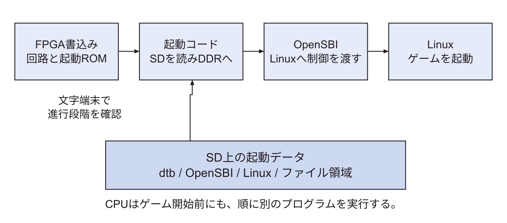

OpenSBIは、RISC-Vの特権機能をLinuxへ提供するファームウェアである。Linuxはデバイスツリーを読み、この機械にあるメモリや周辺機器の配置を知る。その後、Linuxの環境からゲームの実行ファイルを起動する。ゲームの命令は必要に応じてメモリへ読み込まれ、CPUが実行する。「CPUがSD端子へ直接つながり、その場の命令を一語ずつ読む」という接続ではない。

| 段階 | 読むファイルまたは記述 | 確認すること |
|---|---|---|
| 起動ROMを作る | fpga/zsbl/Makefileとbios.S | 対象クロック、メモリ範囲、入口 |
| SDから読む | boot.c、gpt.c、sd.c | SD初期化、区画、コピー先 |
| Linuxへ機械情報を渡す | wally-nexysvideo-rasterix.dts | クロック、メモリ、予約領域 |
| Linuxアプリを作る | examples/rasterix/CMakeLists.txt | RISC-V Linux向けコンパイラ |
| 描画回路へ送る | WallyBusConnector.hpp | MMIOの基点とID |

起動しないときは、この順序のどこまで進んだかをUARTの表示で判断する。SDの読み出し中に止まる状態と、Linuxは起動するがRasterIXのIDが合わない状態では、調べる場所が違う。前者は起動経路、後者は描画用I/Oの構成を先に確認する。

<a id="s_M_16"></a>
#### M.16 デバイスツリーの四つの数字を読む

RasterIXの予約領域の記述には、次の行がある。

```dts
reg = <0 0x9e000000 0 0x02000000>;
no-map;
```

この場所では、アドレスとサイズをそれぞれ二つの32 bitの値で表す。最初の二つが64 bitのアドレス、後ろの二つが64 bitのサイズである。上位がいずれも0なので、開始アドレスは0x9e000000、サイズは0x02000000、すなわち32 MiBになる。「四つの別々のメモリ」を表しているのではない。[Console26](#ref_Console26)

`reserved-memory`は、Linuxが通常のメモリ割り当てでこの領域を他の用途へ渡さないための記述である。`no-map`も指定している。しかし、この記述はFPGAにメモリ保護回路を追加するものではない。RasterIXへ誤ったアドレスを与えたときに、自動で予約範囲内へ丸めてくれるわけではない。

描画レジスタ側の`reg = <0 0x10080000 0 0x100>;`は、開始0x10080000、長さ256 byteを意味する。ソフトウェアのmmapはページ単位のため4096 byteを指定しているが、それによって4096 byteすべてにレジスタが増えるわけではない。この二つの長さの違いを区別する。

図M.3では、四つの数値を左の二個と右の二個に分けて読む。この構成はアドレスにも容量にも32 bitの値を二個ずつ使うため、先頭の0は不要な飾りではなく上位32 bitを表す。

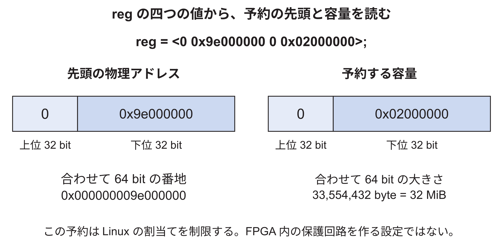

左の組は予約する先頭、右の組は予約する大きさである。右の0x02000000を十進数へ直すと33,554,432 byte、すなわち32 MiBになる。先頭番地と終端番地を二組で書いているわけではない。


<a id="s_M_17"></a>
#### M.17 エラーを一つの部品へ絞っていく実例

例えば`RasterIX register ID does not match`が出た場合、最初に描画の頂点座標を直しても解決につながりにくい。まだ「この番地に期待する周辺回路がいるか」の確認で失敗しているためである。RasterIXを有効にしたbitstreamか、派生構成のEXT_IO_SUPPORTEDが1か、外部APBの基点がソフトウェアと一致するかを順に確認する。

一方、IDは合うが`RasterIX display swap timeout`が出る場合は、命令の受理だけでなく表示完了の経路を見る。CPUのFIFO書き込みが進むか、描画器が切り替えを要求するか、表示側が新アドレスから読むか、FrameCountが増えるかを分ける。回路中の信号を見る場合はシミュレーションやILAなどが必要であり、文字端末の出力だけですべての内部状態を断定しない。

| 観察した症状 | 最初に比較するもの | この段階で結論にしないこと |
|---|---|---|
| UARTに何も出ない | J12/J13、通信速度、reset、bitstream | GPUが遅いからだという推測 |
| IDが違う | FPGA構成、APBアドレス、IDレジスタ | OpenGLの図形指定の誤り |
| 描画の途中で停止 | FIFOの受理、応答待ち、共有DDR経路 | 容量不足とだけ決めること |
| 完了回数は増えるが映らない | 表示回路、出力時刻、映像受信条件 | 外部表示まで正常という判断 |
| 動くが以前の画像が残る | 二枚の履歴、初期化、完了待ち | 処理速度だけの問題 |

この表は診断の出発点であり、症状と原因を一対一に固定するものではない。一つ確認できたら、その観察で除外できた候補を減らし、次の経路へ進む。同じエラーのまま無関係な設定を多数変えると、何が効いたか分からなくなる。

<a id="ch_29"></a>
### 第29章 接続方式を取り替えて評価する

この章は、2026年10月8日のFIFO比較実験[E6](#ref_E6)を、回路、測定プログラム、実機ログへ対応付ける。本文13.10〜[13.16](本文.md#s_13_16)節の表を自分で読み直し、同じ条件の比較を組み立てられることを目標とする。従来のE1〜E5とは使用したソースの版が異なる。数値が新しいという理由で、以前の測定条件まで新しい版へ置き換えない。

<a id="s_29_1"></a>
#### 29.1 問いと比較の範囲を決める

実験の問いは「複数の語を先に預かる接続にすると、CPUの待ち、ゲームの画面更新、回路資源がどう変わるか」である。APBを待たせれば停止に対応できることと、FIFOによって待ちを減らせることを区別する。FIFOがなければ接続不可能だと証明するための実験ではない。

置き換えたのはCPUからRasterIXへ命令を渡す部分である。CPUは20 MHz、RasterIXは100 MHzのままとし、APBレジスタの番地、32ビットの命令データ、終端情報、RasterIX本体、DDR3、表示回路、ゲーム画面640×480を共通にした。RasterIXからCPUへ返る応答用FIFOも512語のままである。

二つのクロックは同じ基準クロックに由来する。ただし、接続方式は立ち上がりの特定の位相関係に依存しないものを比較した。「周波数が違うから物理的に無関係な時計である」「非同期FIFOだけが使える」という前提は置かない。

比較した1語方式は4相ハンドシェイクである。通知を反転させる2相方式、複数語のまとめ転送、DMA、位相関係を保証した同期変換は比較していない。今回の表は、実装した三方式の結果であり、存在するすべての接続方式の順位ではない。

<a id="s_29_2"></a>
#### 29.2 ソースの版と実験記録を対応付ける

本文と付録の基礎説明・再現演習は、従来の固定版を出発点としている。E6の通常版は次の公開コミットから取得できる。実験時の親HEADと差分も保存しており、公開コミットと当時の実装を照合できる。

| 区別する版 | E6で固定した識別子 |
|---|---|
| E6通常版の公開コミット | 261832d48832dd6e26c4971ab8893ce61200688b |
| 実験時の更新前の親HEAD | cdf907bc1752b0f300e4fc70b9a51b2bae983b7f |
| 取り込んだ公式Wally | 2064ca2bb8a88e3e3ec43753be93d00bef49345b |
| 公式RasterIX | 9269a01c9bd4c3342bfa70ef8e3cdd751c15c6d0 |

通常版は、公式Wallyの変更と公式RasterIXの参照先の更新に加え、Wally側のテクスチャページサイズ指定、文字画像の説明コメント、Vivadoの生成設定を含む。公式RasterIXのファイル自体は変更していない。公開コミットの995ファイルと11サブモジュールは、実機試験用の生成時に保存した`fresh-product-source.json`と一致する。

実験時の記録では未コミットだったため、`source-update/product-from-cdf907bc.patch`と`source-update/manifest.json`を保存している。この差分を更新前の親HEADに適用しても、同じ通常版を再現できる。公開コミットには同じ差分が含まれるため、両方を重ねて適用しない。

実験資料は、同梱の`再現資料/実験記録/E6`に整理した。元の実験ルートはUbuntuの`/path/to/research/experiments/fifo-study-20261008`であり、生成プロジェクトや大きなビットストリーム、生ログの原本もそこに保存している。同梱版には、本文の数値を再集計する記録、必要な回路・測定ソース、通常版の差分、単体再現試験を収録した。

| 同梱E6内の場所 | 調べられる内容 |
|---|---|
| report/results/runs.csv | 主比較90回の集計値 |
| board-v2内の三方式 | フレーム別CSV、試行条件、UART出力 |
| board-reconfiguration | 再書き込み後の18回の記録 |
| scripts/command_mailbox.sv | 1語ずつ渡す回路 |
| variants内の各方式 | 接続先と計測カウンタを含む回路ソース |
| measurement-source | 測定プログラムと正解画像の生成 |
| payload-v2/manifest.json | 実行ファイルのハッシュ |
| fresh-product/qualification | 通常版の生成・タイミング・実機検査の要約 |
| report/results/video | 更新版の実機動画とフレーム検査結果 |
| report/results/command-parser-reproducer.zip | FPGAなしで命令解析の問題を追試する一式 |

試験用カウンタ、接続候補、計測・SDカード操作・映像取得のスクリプトは、製品リポジトリへ入れていない。実験のための変更と、ゲーム機を使うための変更を混ぜないためである。

<a id="s_29_3"></a>
#### 29.3 三方式の受け取り条件を読む

通常版の`rasterix_apb.sv`は、命令への書き込み中、`CmdReady`をAPBの完了条件へ返す。この外側の関係を保ち、`CmdReady`が何を意味するかを接続モジュール側で変えた。

| 接続 | CmdReadyが1になる条件 | APB完了時点で分かること |
|---|---|---|
| 1語方式 | RasterIX側の受け取り確認が戻った | その語はRasterIXへ渡った |
| 16語FIFO | FIFO入口が保存できる | その語はFIFOへ入った |
| 512語FIFO | FIFO入口が保存できる | その語はFIFOへ入った |

どの方式でも「一語が渡った」と「一枚の画像を描き終えた」は違う。1語方式が待つのは、その語を命令入力が受け取ったという確認であり、ゲーム画面全体の描画完了ではない。FIFO方式では、その語がRasterIXへ届くより前にAPB書き込みを完了できる。

16語FIFO版は、命令側だけを新しい`axiscommand`というIP実体に交換した。応答側は既存の`axiscdc`を使う。両方向の容量を一緒に変えると、どちらの変更で差が出たか分からなくなるからである。

<a id="s_29_4"></a>
#### 29.4 1語を渡す四つの通知を順番に追う

説明用の一語Dを渡す。回路に出てくる`SourceData`と`DestData`は、同じ一語を安全に渡すための両側の保持レジスタである。二語を同時に別々の命令として受け付ける待ち行列ではない。

1段階目では、CPU側の`SIDLE`状態が有効なDを見つけ、32ビットの値と終端1ビットを`SourceData`へ写す。同時に`Request`を1にする。この段階ではAPBをまだ完了させない。送り手は有効信号とDを保持している。

2段階目では、要求が二段の同期レジスタを通ってRasterIX側へ届く。`DIDLE`状態は安定している`SourceData`を`DestData`へ写し、`DVALID`へ進む。ここで命令出力のVALIDが1になり、RasterIXのREADYを待つ。

3段階目では、RasterIX側のクロック立ち上がりでVALIDとREADYがともに1になり、Dが一回渡る。受け側は`Ack`を1にして`DCLEAR`へ進み、同じDを再度渡さない。AckがCPU側の二段の同期レジスタを通ると、`SACK`状態で`CmdReady`が1になる。ここでAPBの書き込みを完了し、Requestを0にする。

4段階目では、Requestが0へ戻ったことを受け側が確認し、Ackも0へ戻す。CPU側はその0が戻るまで`SCLEAR`で待ち、次の語を取り込める`SIDLE`へ戻る。Requestを上げる、Ackを上げる、Requestを下げる、Ackを下げる、という四つの段階があるため4相と呼ぶ。

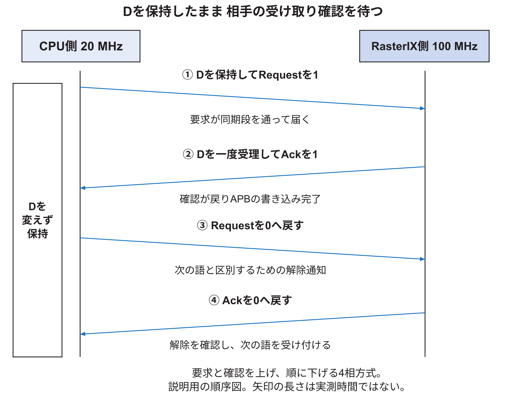

図29.1は、上から下へ時間が進む順序図である。左の縦長の箱は、接続回路内に取り込んだDを変えずに保持する区間を示す。青い矢印は通知が相手へ届く向きであり、長さは実測時間ではない。RasterIXがDを受け取った後にも、通知がCPUへ戻る待ちがある。

この追加の往復があるため、1語方式のAPB待ちをすべてRasterIXの描画の遅さと呼んではいけない。命令入力がすぐ受け取れる場面でも、接続方式そのものの往復時間は発生する。

<a id="s_29_5"></a>
#### 29.5 データ保持とクロック制約とリセット

要求とAckは、それぞれ受け側に二段の同期レジスタを置いた。データの33ビットすべてへ独立の同期レジスタを置いて値をそろえたわけではない。SourceDataを保持したまま、そのデータが利用できることを要求信号で知らせる。

保存した`command_mailbox.xdc`では、要求、Ack、SourceDataからDestDataへの経路に10 nsのデータパス上限を指定した。これは相手へ伝わる要求を待つ間にデータが到着できるよう、実装時にも遅延を評価するための制約である。単に「二段同期を置いたから全ビットが安全」とする説明では不十分であり、保持期間、通知経路、実装後の遅延を組み合わせて確認する。

リセットは両側のリセット要求をまとめて受け、解除は各クロック側で同期した。途中にリセットが入った場合、受け渡し中の語を保存し続ける契約にはしていない。シミュレーションの照合でも、リセット前に残った語をリセット後へ必ず引き継ぐという期待を置かない。

接続単体では、複数のクロック比、受け取り停止、停止解除、リセットを与えて、受け取った語の順序と内容を照合した。実際に生成したAMD FIFOを含む試験も別に行った。論理シミュレーションはアナログ的なメタステーブル状態の発生確率を直接測るものではない。CDCの構造確認、IPの制約、配置配線後のタイミング確認を合わせて扱う。

<a id="s_29_6"></a>
#### 29.6 APBの待ち時間を回路で数える

CPUが命令を送る関数の実行時間だけでは、CPUが計算していた時間と、バスが待たされた時間を分けられない。そこで、比較用の三回路に同じ計測カウンタを追加した。CPU側20 MHzのクロックで数える。

```systemverilog
if (CommandWrite && CmdReady)
  StudyWords <= StudyWords + 1'b1;
if (CommandWrite && !CmdReady)
  StudyWaits <= StudyWaits + 1'b1;
```

`CommandWrite`には、APBの選択、アクセス段階、書き込み、語幅と番地の条件が含まれる。従って、APBが準備段階にいる時間や、別の周辺機器を操作している時間までStudyWaitsへ入るわけではない。1回目の式は受け取った語数、2回目は待ちのクロック周期数であり、単位が違う。

| 実験用レジスタのオフセット | 内容 | 読み方 |
|---|---|---|
| 0x1c | StudyWords | 受理した32ビット語の数 |
| 0x20 | StudyWaits | 命令書き込みを待たせた周期数 |
| 0x24 | StudyLongest | 最も長く連続した待ちの周期数 |
| 0x28 | StudyCycles | 計測カウンタの動作周期数 |
| 0x2c | 実験識別値 | どの比較回路を書いたかを識別 |
| 0x7cへ書き込み | カウンタ初期化 | 慣らし運転後に測定を始める |

20 MHzでは1秒に20,000,000周期ある。待ちをC周期、測ったフレームをN枚とすれば、1枚当たりの待ち時間は、C÷20,000÷Nミリ秒となる。例えばCが3,600,000、Nが180なら、1枚当たり1 msである。この例のCは式を理解するための説明値であり、今回の実測値ではない。

カウンタは32ビットである。動作周期数は約214.75秒で一周するため、任意の長時間実行の値をそのまま差し引いてよいわけではない。今回の比較は一回180フレームで、測定区間ごとに初期化した。5分連続動作の確認には、これらのカウンタを使った待ち時間の集計を流用していない。

これらは製品の標準レジスタではない。通常版は実験識別値を返さず、測定プログラムもカウンタが使えないことを出力する。製品のレジスタ表へ、実験専用オフセットを追加して説明しない。

<a id="s_29_7"></a>
#### 29.7 ソフトウェアで測る時間との関係

測定プログラムは、ゲーム状態の更新、APIによる命令準備、命令を送る処理、画面切り替えの待ちを記録する。関数の中から別の関数を呼ぶため、外側の時間には内側の時間が含まれる。例えば命令送信の時間は、呼び出し元の画面更新処理の時間にも含まれ得る。

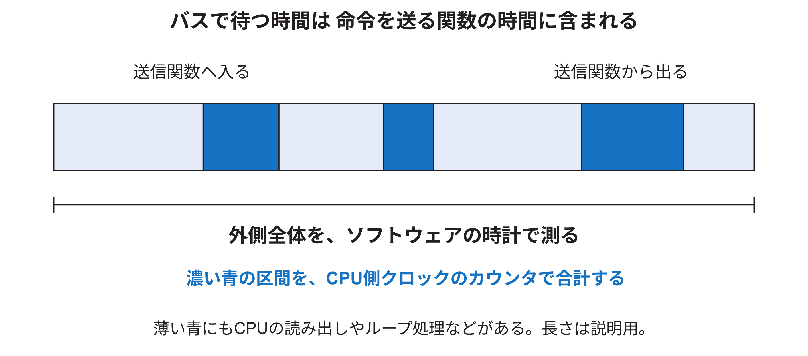

図29.2の外側は、CPUが命令を順に送る関数に入ってから出るまでである。その途中でAPBが何度か止まり、濃い青の待ち区間が現れる。回路のカウンタはこの濃い青の時間を集める。外側と内側を足して全時間としない。

集計では、`write_ns`から命令送信の平均時間を求め、StudyWaitsからAPB待ちの平均時間を求めた。どちらも同じ測定フレーム区間に対応させる。回路カウンタの周期数は20 MHzを使って換算し、ソフトウェアの経過時間はLinuxの時計を使う。ナノ秒の単位で保存した値でも、1 nsの精度で現象を測ったという意味ではない。

APB待ちの原因を、描画の計算、メモリ転送、表示の同期待ちへ完全に分類したわけではない。また、FIFOの全占有量の時系列は記録していない。測ったのは、CPUの命令書き込みが入口の受取可によって止められた期間である。

<a id="s_29_8"></a>
#### 29.8 同じ条件を繰り返す具体的な手順

ゲーム開始状態を0、1,800、3,600ステップに固定した。各状態について、full、grouped、retainedの三描画方式を使う。それぞれ30フレームを先に動かした後、180フレームを測る。同じ実行ファイルの引数で切り替え、描画方式ごとにコンパイラや最適化設定を変えない。

各回路の同じ起動中に3回ずつ繰り返した。描画方式の順序を回ごとに回転させ、常に同じ方式だけが最初になることを避けた。ただし、独立した3回の電源投入ではない。再起動に関する補助比較は29.11節のように別に記録した。

以下はLinuxが起動したFPGA側で、測定用実行ファイルを準備した後に使った一例である。PC側のUbuntuでこのRISC-V実行ファイルを直接起動するコマンドではない。

```bash
/tmp/fifo-bench --frames 180 --warmup 30 \
  --retained --wait spin --state-frame 0 \
  --csv /tmp/fifo-case.csv --dump /tmp/fifo-check.rgb565
```

引数の`--retained`を外すと全体描画、`--grouped`にすると呼び出しを統合した描画になる。`--state-frame`が開始状態である。`--dump`を付けた試行では最終画像を読み出し、正解画像と全画素比較する。初回の27条件でこの検査を実施した。

各フレームの状態ハッシュ列、命令のバイト数、表示完了カウンタの連番を検査した。同じ描き方と開始状態なら、三接続で命令量も一致した。転送語数×4とバイト数の一致は、一語4バイトの転送が計数上対応した確認になる。一方、語数だけが一致しても、内容の取り違えまで否定できないため、画像比較と接続単体の順序検査も行う。

<a id="s_29_9"></a>
#### 29.9 正解画像と動画は別々に確認する

正解画像は、測定終了時のゲーム状態からソフトウェア側で作った。FPGAの画像をそのまま複製して正解としたのではない。読み出したRGB565画像は640×480で307,200画素あり、すべての画素を比較した。画面ハッシュは保存・照合にも使うが、不一致0の判定は全画素比較の結果である。

主比較90回のうち、全画素検査をしたのはゲームの各接続・状態・描画方式の初回27条件である。残りの繰り返しや再送試験まで、全中間画面を比較したとはしない。追加の再書き込み比較で6画面、通常版の新規生成後に4画面を検査したが、これらも主比較とは分けて保存する。

メモリ上の画像が正しくても、映像送信やキャプチャが正しいとは限らない。そのため、通常版の動作中に別途録画した。30.017秒の動画を全復号し、全1,801フレームで壁とボールを検出した。連続する1,800組のうち1,749組で、検出したボール位置が0.9画素以上動いた。これは動きが継続することの検査であり、圧縮された動画全画素が正解と完全一致するという検査ではない。

録画時はキャプチャの横長画像を4:3へ整えた。元画像640×480を1440×1080として置き、1920×1080の左右に240画素ずつ黒い余白を残した。回路の描画座標を変えて見た目を合わせたのではない。自動プレイであり、Wiiコントローラーの試験でもない。

<a id="s_29_10"></a>
#### 29.10 主比較の全条件を読む

下表は画面切り替え完了回数を測定時間で割り、3回の中央値を取った値である。各方式は同じゲーム状態を描く。動画ファイルが毎秒何枚を保存したか、という値ではない。

| 開始ステップ | 描画方式 | 1語ずつ | 16語FIFO | 512語FIFO |
|---|---|---:|---:|---:|
| 0 | 全体 | 11.964 | 13.982 | 14.628 |
| 0 | 呼び出し統合 | 14.953 | 14.953 | 14.953 |
| 0 | 変更領域 | 57.579 | 58.202 | 58.202 |
| 1800 | 全体 | 14.953 | 14.953 | 14.954 |
| 1800 | 呼び出し統合 | 19.611 | 19.647 | 19.648 |
| 1800 | 変更領域 | 58.202 | 58.241 | 58.521 |
| 3600 | 全体 | 19.864 | 19.902 | 19.938 |
| 3600 | 呼び出し統合 | 19.938 | 19.938 | 22.907 |
| 3600 | 変更領域 | 59.488 | 59.161 | 59.819 |

同じ開始状態でも、描く図形を減らすと命令量が減り、接続で待つ時間の影響も小さくなる。特に変更領域描画は表示周期に近く、FIFO容量の差がゲーム全体の更新回数に大きく表れなかった。表のわずかな差だけから、どの条件でも同じ順位になるとは結論しない。

用意済み命令列を繰り返す試験では、1語ずつ47.849、16語FIFO58.518、512語FIFO58.837回/秒であった。この試験は命令の生成処理を省いている。通常のゲームもこの回数で同じ処理をできる、と読み替えない。

<a id="s_29_11"></a>
#### 29.11 再書き込み後の結果と表示周期

512語、1語ずつ、16語の順でFPGAを書き込み直し、Linuxを起動し直した。同じ実行ファイルのハッシュを確認した後、開始状態0の全体描画と変更領域描画を各3回実行した。合計18回、3,240フレームである。

| 全体描画の追加比較 | 1語ずつ | 16語FIFO | 512語FIFO |
|---|---:|---:|---:|
| APB待ちの中央値 [ms/枚] | 4.387 | 2.267 | 0.469 |
| 送信処理の中央値 [ms/枚] | 11.931 | 9.564 | 7.419 |
| 切り替え完了回数の中央値 [回/秒] | 11.963 | 13.424 | 14.628 |

主比較の値と混ぜて再集計せず、追加の一組として保存した。送信待ちがFIFOで減る傾向は再現した。一方、16語FIFOの切り替え完了回数は主比較より低く、追加3回の中でも13.03〜13.87回/秒に変動した。

公式DVI回路の設定名には60 Hzが使われているが、確認したカウンタは横0〜800、縦0〜525まで進む。0を含むため、各方向は801周期と526行になる。画素クロック25.2 MHzで割ると、801×526÷25,200,000秒、すなわち約16.7193 ms、約59.811 Hzである。640×480の可視画素数だけを掛けて周期を求めてはいけない。

16語FIFOのログでは、更新間隔が表示4周期か5周期かの比率が試行ごとに変わった。送信時間が同じ程度でも、次の切り替え時刻に間に合わなければ、さらに1周期待つ場合がある。どの割り込みやキャッシュ状態がこの差を作ったかまでは、この記録では分解していない。

測定ログの`late_60hz`は厳密な1/60秒を基準にした項目である。標準DVI回路の約16.7193 msに追従している更新も、16.6667 msより長いため「遅れ」に数えてしまう。E6の結論にはこの件数を使用しない。ゲーム状態の60 Hz刻み、表示回路の約59.811 Hz、録画形式の60枚/秒は別の値である。

<a id="s_29_12"></a>
#### 29.12 ページサイズの不一致をどう切り分けたか

更新後のソースをそのまま組み合わせた最初の試行では、文字を描いた画面の519画素が正解と違った。回路はテクスチャを2,048バイトのページとして扱い、ソフトウェアの既定値は4,096バイトだった。

ページは、画像全体を何バイトずつの単位として番地を伝えるか、という区切りである。例えば64×32画素を1画素2バイトで持つ文字画像は4,096バイトになる。2,048バイトのページなら2ページである。4,096バイトのページなら1ページである。画像の大きさが同じでも、ページ数と次の番地の意味が変わる。

Wally側の`examples/rasterix/CMakeLists.txt`へ次の値を設定した。

```cmake
set(RIX_CORE_TEXTURE_PAGE_SIZE 2048 CACHE STRING
    "Texture page bytes")
```

このコード例は設定の意味を短く示したものであり、周囲のCMakeコードを省略している。正確な差分はE6の`source-update/product-from-cdf907bc.patch`で確認する。同じ16語FIFOのビットストリームに対し、設定をそろえた実行ファイルでは全307,200画素が一致した。画像が違っていた修正前の性能値は主比較から除外した。

以前のCMakeキャッシュが残ると、ソースの既定値を変えても古い値が使われる場合がある。新しいビルドディレクトリを使うか、設定時に`-DRIX_CORE_TEXTURE_PAGE_SIZE=2048`を明示する。旧版を再現する演習へ、今回の値だけを無条件に移植しない。対応する回路のページサイズと組にして確認する。

<a id="s_29_13"></a>
#### 29.13 命令解析回路の重複を単体で再現する

ページサイズをそろえた後にも、大きいテクスチャで画像不一致が残った。32×32は2,048バイトで1ページ、64×64は8,192バイトで4ページ、256×256は131,072バイトで64ページになる。ここでは1画素2バイト、ミップマップを使わない試験画像として数えている。

1語方式と16語FIFOでは64×64で2,048画素、256×256で31,744画素の不一致を確認した。512語FIFOでは最初の3回は全サイズが一致したが、4回目の256×256で9,216画素が一致しなかった。成功例だけを選んで512語FIFOなら正常と判断してはいけない。

原因を絞るため、公式の`CommandParser.v`だけをVerilatorで動かした。Wally、APB、外部FIFO、DDR3、画素処理は含めない。テクスチャページ番地を8個渡し、入力の間隔を0、5、20、100周期、受け取り側の停止を0、100、500周期に変え、4×3の12条件で調べた。

入力は、一度VALIDを1にした後、READYと同時に1になって受け渡しが成立するまでデータを変えない。間隔とは、前の語の受け渡しが成立してから、次の語を有効にするまでの待ちである。受け取られる前にVALIDを下げて入力を失わせる試験ではない。

| ページ番号の列 | 観測値 |
|---|---|
| 入力した8語 | 0, 1, 2, 3, 4, 5, 6, 7 |
| 正しく出力されるべき8語 | 0, 1, 2, 3, 4, 5, 6, 7 |
| 間隔5周期、停止100周期の公式版 | 0, 1, 1, 2, 2, 3, 4, 5 |

入力に間隔があり、かつ出力側も停止する6条件で失敗した。回路内には、入力側の受け渡しがまだ成立していないのに、一時レジスタへ語を取り込んだり、処理する個数を進めたりする箇所があった。

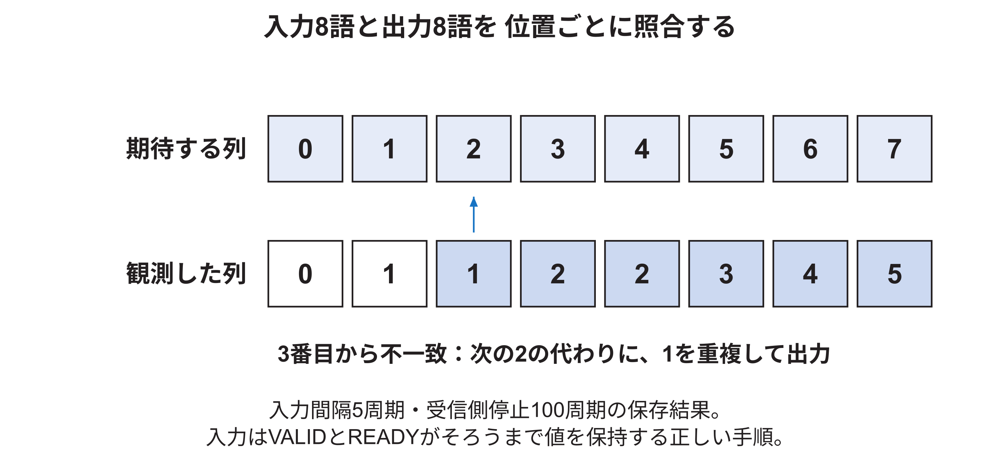

図29.3の上段は渡るはずの番号、下段は実際に出てきた番号である。下段では、期待した番号と違う欄に色を付けた。左から3番目は2になるはずだが、1がもう一度出てきている。これは図解のための想像の列ではなく、保存した単体試験の列である。

入力の受け渡し成立を条件にする修正候補を、実験用コピーだけに適用すると、同じ12条件を通過した。修正候補は原因の説明を検査するためのもので、全命令の網羅検証を済ませた正式な修正ではない。公式サブモジュールには適用していない。実機のDMA入力で修正の有無を比較した結果は30.18節に示す。そこで画像が一致した条件と、本節のAPB送信で生じた間欠的な不一致は区別する。

更新前後の`CommandParser.v`はファイル内容が同じだった。この問題を公式更新で初めて入った不具合と説明しない。実機で見たページの繰り返しは単体試験と整合するが、実機の全不一致の原因をこれだけで確定したとはしない。

<a id="s_29_14"></a>
#### 29.14 FPGAなしで単体再現試験を動かす

`report/results/command-parser-reproducer.zip`を空のフォルダーへ展開する。Python 3、C++コンパイラ、make、Verilatorが使えるLinux環境で、展開先へ移動して次を実行する。本研究ではVerilator 5.026で実行を確認した。

```bash
python3 reproduce.py
```

実行は、公式版と診断用修正候補を別々に生成し、同じ12条件を与える。期待する観察結果は、公式版が12条件中6条件で不一致、修正候補が12条件を通過することである。公式版の不一致は、この再現試験が探している現象であり、再現用スクリプトが失敗して何も測れなかったこととは区別する。

全体スクリプトの終了コード0は、「期待した公式版の失敗と修正候補の通過を再現した」という意味である。「公式版の全試験が通った」という意味ではない。出力されたJSONと各条件のページ列を確認する。スクリプトは公開リポジトリを書き換えず、展開先のコピーを使う。

<a id="s_29_15"></a>
#### 29.15 通常版の再生成と実機確認を結ぶ

比較回路には計測カウンタがあるため、それだけが動いても、通常のゲーム機構成の確認は完了しない。カウンタを含まない通常版を、製品ソースの新しいコピーから作った。生成済みIPを持ち込まず、通常のmake入口でIP生成、合成、配置配線、ビットストリーム生成まで実行した。

生成条件は、合成のretiming、配置のWLDrivenBlockPlacement、物理最適化のAggressiveExplore、配線のExplore、配線後の物理最適化のAggressiveExploreである。CPU20 MHz、RasterIX100 MHz、画素クロック25.2 MHzは維持した。これらはVivadoの実装方法の指定であり、回路の動作仕様を変更するパラメータではない。

最小setup余裕+0.018 ns、hold余裕+0.014 nsでタイミング条件を満たした。余裕は小さいため、周波数をそのまま上げられるという根拠にはしない。内部の未制約端点、配線エラー、DRCエラーは0。CDCの警告は内容を確認したが、警告ゼロとは記録していない。

通常版では300.011秒間に17,853回の画面更新処理を完了し、終了後の描画プログラム再起動でも全画素が一致した。その後、IPから作り直した新規ファイルを読み、日時などのヘッダーを除いた設定データ全5,703,276バイトが先の検査済み回路と完全一致することを確認した。新規ファイルでもLinux起動、実行ファイルのハッシュ、4条件の全画素一致を確認した。

したがって、5分間試験の記録を新規生成版へ対応付ける根拠は、「似たソースだった」ことではなく、設定データそのものの一致である。新規ファイルで5分間を再実行したと記録することはしない。75.003秒の別実行から取得した30秒動画は、新規ファイルを書いた後の追加の証拠である。

<a id="s_29_16"></a>
#### 29.16 保存した数値を再集計する

E6の`report/results/runs.csv`は、90回それぞれの結果を1行にした表である。列`transfer_ms`が1枚当たりの送信時間、`apb_wait_ms_frame`がその中のAPB待ち、`completed_swaps_s`が切り替え完了回数/秒である。`pixel_check`は、その試行で最終画面を全画素比較したかを示す。

以下はE6のフォルダーをカレントディレクトリにし、Python 3で実行する再集計例である。FPGAへのアクセスやSDカードの書き換えは行わない。

```python
import csv
from statistics import median

with open('report/results/runs.csv', encoding='utf-8') as f:
    rows = list(csv.DictReader(f))
assert len(rows) == 90
for variant in ('mailbox', 'fifo16', 'fifo512'):
    selected = [r for r in rows if r['variant'] == variant
                and r['state'] == '0' and r['style'] == 'full']
    assert len(selected) == 3
    values = [float(r['apb_wait_ms_frame']) for r in selected]
    print(variant, f'{median(values):.3f} ms/frame')
```

期待する表示は、順に4.393、2.254、0.465 ms/frameである。さらにフレーム別CSVを調べる場合は、`scripts/analyze-v2.py`の語数、状態ハッシュ列、表示連番の照合を読む。保存した原本スクリプトには実験ルートの絶対パスがあるため、別の場所で使う際は、入出力先をそのコピーの配置に合わせる。元の実験記録を出力先として上書きしない。

<a id="s_29_17"></a>
#### 29.17 E6の通常版ソースをそろえる

[付録M](#ch_M)は初期版を再現する手順として残した。E6を追試する場合は、別の作業ディレクトリへ通常版の公開コミットを取得する。次の手順ではソースだけを用意し、FPGAやSDカードへは書き込まない。

```bash
git clone --no-recurse-submodules \
  https://github.com/SoshiroFujimori/wally-game-console.git \
  wally-e6-reproduction
cd wally-e6-reproduction
git checkout --detach 261832d48832dd6e26c4971ab8893ce61200688b
git submodule update --init --recursive
git -C addins/rasterix rev-parse HEAD
```

RasterIXのHEADが29.2節の値と一致することを確認する。`fresh-product-source.json`には通常版を生成した際の995ファイルのハッシュと11サブモジュールの参照先を保存した。研究リポジトリの`publication/console-source.json`には、公開コミットとの照合結果を記録している。

通常版の回路生成、Linuxの起動、SDカードの準備は[付録M](#ch_M)の各段階を使い、ソースの版とページサイズは本章へ合わせる。比較用の1語回路や16語FIFO、計測カウンタは、その通常版とは別の実験用コピーに追加する。保存した`prepare-variants.py`は変更箇所を示すが、作業ディレクトリと生成済みIPに関する前提を持つため、無条件に一行で全環境を用意するインストーラではない。

<a id="s_29_18"></a>
#### 29.18 実験から説明できることをまとめる

質問が「FIFOが必須なのか」なら、今回の1語方式でも動いたため、必須とは言わない。質問が「なぜ今は512語を使うのか」なら、比較した三方式ではCPUの送信待ちが最も短く、BRAM 1個という小さな容量負担で使えたから、と説明できる。

質問が「512語が最適なのか」なら、16語と512語と1語方式までの比較なので、必要最小容量は未確定である。質問が「20 MHzのCPUでも待つのか」なら、命令書き込みを待たせた周期を実機で数えたため、待つ場面は確認できた。ただし、その原因を描画演算だけへ帰属してはいけない。

質問が「描画は全部正しいのか」なら、検査したブロック崩しの最終画面は一致し、通常版の映像も取得できた一方、大きいテクスチャには未解決の不一致がある、と答える。正しさが確認できた範囲と、次に調べる対象を同時に示すことが、この実験を別の設計へ利用する人に必要な情報である。


<a id="ch_30"></a>
### 第30章 メモリから描画命令を読む方式を検証する

この章では、CPUが一語ずつ描画命令を送る方式と、回路がメモリから命令列を読む方式を区別する。後者がDMAである。実験E7では、転送回路だけの試験と描画回路全体の試験で結果が異なった。その違いを、回路どうしの待ちの関係から説明する。本章では、シミュレーションで調べた転送回路の振る舞いと、実機で確認した結果を区別する。

<a id="s_30_1"></a>
#### 30.1 CPUが転送する方式とDMAの違い

採用済みのゲーム機では、CPUがDDR3上に描画命令を用意する。命令は、画面の位置や色などをRasterIXが解釈できる数値にしたものである。CPUは、その数値列を先頭から読み、命令用のAPBレジスタへ一語ずつ書く。CPUが一語を書けば、その一語が命令FIFOへ入る。FIFOの出口では、RasterIXが受け取れるときに一語を渡す。

DMAでは、CPUが命令列を用意する点は同じだが、列を読み出す仕事を回路へ渡す。例えば「物理番地Aから4,096 byteを読んで描画側へ送る」と回路に指定する。その後はDMA回路がメモリへの読み出し要求を出す。CPUが4,096 byteの全語を命令用レジスタへ書く必要はなくなる。

ただし、DMAを使えば自動的に全処理が速くなるわけではない。回路に見える場所へ命令をコピーする時間、転送を開始するための設定、終了確認が必要になる。短い命令列では、その準備にかかる時間が、減らせたCPUの書き込み時間より長くなる場合もある。したがって、命令を送る部分とゲーム一回分の時間を、別々に測る必要がある。

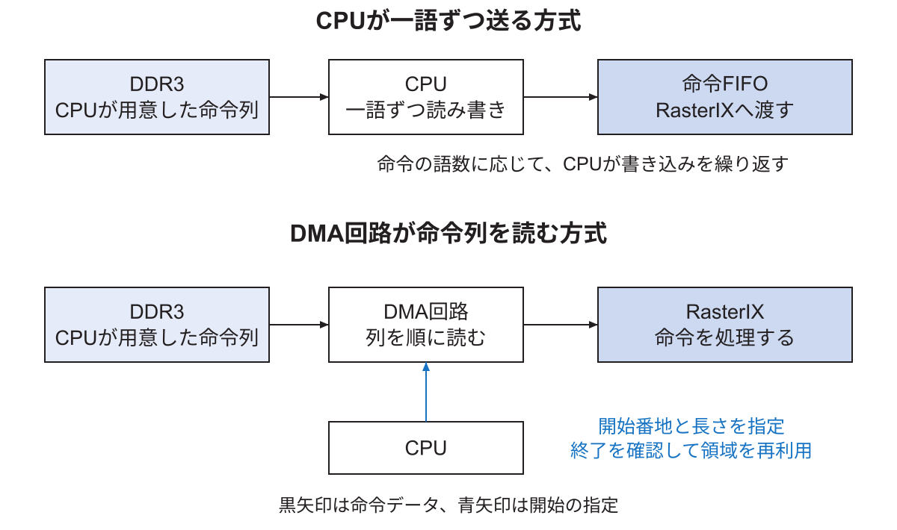

図30.1で「CPUが用意した命令列」と「描画結果の画像」は別のデータである。同じDDR3を使っていても、命令を置く番地と画像を置く番地は区別する。命令をDMAで読むことは、画像の表示方法をDMAへ変更することとも異なる。

<a id="s_30_2"></a>
#### 30.2 RasterIXの二つのDMA経路を区別する

公式RasterIXの`FrameStreamingCore`は、メモリから読み出したデータを命令ストリームへ送る機能を備える。実験E7では、まずこの内部機能を調べた。既存の`RasterIX_IF`に含まれる回路を使えるため、新しい転送IPを組み込まずに比較できるからである。

公式ソフトウェアには`XilCDMABusConnector`もある。こちらはXilinx向けのDMAドライバーを使って転送する接続であり、内部の`FrameStreamingCore`へ読み出し命令を渡す方式と同じ実装ではない。公式にDMAを利用する例があることと、その例をWallyへ設定だけで移せることは別である。CPU、メモリの番地、キャッシュ管理、DMAの制御レジスタ、バスへの接続を対応付ける必要がある。

この章の「DMA」は、特記しない限り`FrameStreamingCore`の内部読み出しを指す。外付けDMA IPとの速度比較を行ったという意味ではない。

<a id="s_30_3"></a>
#### 30.3 DMAへ渡す番地とデータの見え方

Linuxのプロセスが持つポインターは、通常は仮想番地である。CPUのMMUが仮想番地を物理番地へ変換するため、プログラムはそのポインターからデータを読める。一方、このDMA回路は同じMMUを通らず、指定された物理番地を使う。したがって、`malloc`で得たポインターの数値を、そのままDMAへ渡してはいけない。

実機用の比較プログラムは、通常のLinuxメモリと重ならない予約領域の一部を使う。命令の格納先は物理番地`0x9e800000`からの範囲とし、領域の大きさや`/proc/iomem`の予約を確認する。描画画像やテクスチャと重ならない範囲を、最大1 MiBずつに区切って使う。これらの数値は実験用のメモリ配置であり、別の構成へそのまま流用する値ではない。

CPUがデータを書いたつもりでも、キャッシュ内にだけ新しい値が残れば、DMAがDDR3から読む値は古いままになる。そこで実験用コードは、キャッシュしない属性で予約領域を対応付ける。書き込み後に順序をそろえる命令を実行し、その後にDMAを開始する。`volatile`だけでは、MMUの属性やキャッシュの問題まで解決できない。

性能を測る前に、CPUが書いた既知の模様をDMA側から読み返し、同じbyte列を得られるか確認する。先頭だけでなく、ページ境界付近や領域の末尾も対象にする。E7では、領域の先頭、4 KiB境界をまたぐ位置、領域末尾の3か所で、2種類の数値列を各65,536 byte読み戻した。6条件すべてで一致した。この結果は、指定した予約領域と非キャッシュ属性でCPUと描画側が同じデータを読めたことを示す。描画命令の実行や任意のキャッシュ設定まで正しいと確認した結果ではない。

<a id="s_30_4"></a>
#### 30.4 転送が終わる前に命令列を書き換えない

DMA開始レジスタへの書き込みが終わる時点と、命令列を全部読み終わる時点は異なる。開始直後にCPUが同じメモリを次の命令で上書きすると、DMAは古い列の前半と新しい列の後半を読むおそれがある。

比較プログラムでは、DMAによる命令転送の後ろに、識別用の数値を返す命令を並べる。その数値が応答として戻ったことを確認してから、同じ命令格納領域を再利用する。前の転送を追い越して応答できない経路であることが前提である。格納領域を再利用してよいことと、画面に表示されたことも別であり、この応答を映像の更新回数として数えてはいけない。

命令列は64 byte単位へそろえ、余りには無操作を表す語を入れる。個々のAXIバーストが4 KiBの境界を越えないことも検査する。「転送範囲全体が4 KiBの境界をまたぐこと」と「一つのバーストが境界を越えること」は異なる。長い転送は、境界を越えない複数の要求へ分けられる。

<a id="s_30_5"></a>
#### 30.5 転送回路だけを試す

最初の試験は`FrameStreamingCore`だけを対象とする。既知の数値列を読むように命令し、出てきた語の個数、順番、終端を照合した。メモリの応答や受け取り先を意図的に停止し、再開した後も正しく続くかを調べた。

転送長は64、128、192、4,096、4,160、65,536、1,048,576 byteとした。開始位置、乱数の種、停止条件を組み合わせた224条件で、各2回、合計448転送が通過した。受け取り先を停止しても、この回路が保持し、再開後に続きを渡せることを確認した結果である。

しかし、この試験の受け取り先は、試験プログラムが所定の時間後に再開させる。実際の描画回路は、別のメモリ読み出しが終わるまで再開できないことがある。その仕事まで含めないと、二つの回路が互いを待つ状態を見落とす。そのため、次の試験ではRasterIX全体を動かす。

<a id="s_30_6"></a>
#### 30.6 描画回路全体の試験に何を含めたか

全体試験には、公式`RasterIX_IF`、その内部の命令解析・描画・テクスチャ回路・メモリ接続を含めた。Block RAMは汎用のシミュレーション用メモリ、DDR3は要求へ応答する試験用モデルとした。表示回路の代わりに、画像の切り替えを受け付けたことを返すモデルを置いた。

Wally CPU、実際のAPBバス、CPUと描画側のクロック境界、MIG、HDMI端子は含まない。記録中の`apb`というラベルは、CPUからの逐語送信に相当する入力を表す。APBの信号そのものを動かしたという意味ではない。入力間隔を0または16クロックとし、数値列を同じ命令ストリーム入口へ渡した。

DDR3モデルは、読み出し要求を受けた順に応答する。異なるIDの要求に対して常に追い越しを行う必要はないため、この順序もAXIで許される。返すデータが決まったらVALIDを上げ、READYが下がっている間はVALID、データ、ID、終端情報を保持する。受け手が準備できるまでVALIDを出さないモデルにはしていない。[ArmAXI20](#ref_ArmAXI20)

描画の試験では、ブロック崩しの3状態、入力間隔2通り、乱数の種2通りを組み合わせた。各条件で連続4画面を生成し、それぞれ全307,200画素を正解画像と比較する。ここでの文字は四角形へ展開し、テクスチャ転送の試験とは分けた。別の試験で32×32、64×64、256×256のテクスチャを描き、4画面目を全画素比較した。

<a id="s_30_7"></a>
#### 30.7 互いを待って止まった経路

未変更のDMA経路は、ブロック崩しの12条件すべてで停止した。停止時の記録では、DMAが読む「次の命令のデータ」が共有の読み出し応答経路にあり、その後ろに描画側が必要とする「画像のデータ」が並んでいた。

描画回路は画像データが届くまで次の命令を受け取れない。DMAは、描画回路が受け取らないため、次の命令データを受け取り続けられない。メモリモデルは、先頭の命令データが受け取られるまで、後ろの画像データを返せない。この三つが輪になり、待ち続けた。


これは「WallyよりRasterIXが常に遅い」という話ではない。CPUの速さとは別に、描画回路が、その処理に必要なメモリの応答を待つ場面があるという話である。また、単体試験と全体試験の違いは、受け取り先を後から必ず再開させる試験か、再開に別の共有メモリ応答を必要とする試験かにある。

この停止を実機のMIGでも再現したわけではない。実機では要求の並べ方や応答の順序が異なる可能性がある。本実験が示すのは、用意した正当な応答順序の下で、未変更の経路に循環した待ちが生じることである。

<a id="s_30_8"></a>
#### 30.8 DMA読み出し側へバッファを置く理由

対策候補は、DMAの読み出し応答を一度保存するFIFOである。このFIFOは、32 bitの語を64個保存し、描画側と同じクロックで動かした。[第29章](#ch_29)で比べたCPU側の非同期FIFOとは場所も目的も違う。

重要なのは、FIFOを置くだけでなく、要求を出す前に、そのバースト全体を受け取れる空きがあることを確認する点である。これにより、いったん要求した命令データは、描画側が止まっていてもFIFOにすべて受け取れる。共有の応答経路が空き、後ろの画像データを返せるので、描画側も処理を再開できる。

AXI仕様のA3.3節も、読み出しを要求した側は、同じ要求側による別の取引に依存せず、その要求のデータを受け取れることを求めている。[ArmAXI20](#ref_ArmAXI20) バッファによる空きの確保は、今回観測した依存関係を解くための一つの実装である。

実験ではMITライセンスの`axi_fifo_rd`を使い、`FIFO_DELAY=1`を指定した。公式RasterIXのソースは変更せず、実験用コピーに接続を加えた。この候補で、四角形の描画は12条件すべてを通過した。バッファを置かず命令を64 byteずつに分ける試験では、同じ停止が残った。

64語が最小または最適だと確定した結果ではない。また、バッファがあるだけで任意のメモリ接続の停止を防げるという意味でもない。今回の要求長、接続位置、空きの確認を含めた候補について、再現した停止を解消した結果である。

<a id="s_30_9"></a>
#### 30.9 テクスチャの問題は別に残った

DMA読み出しFIFOを入れても、大きなテクスチャには画素不一致が残った。未変更の逐語入力も12条件中8条件の通過にとどまったため、DMAだけの問題として扱わない。

命令解析回路には、入力が有効であることを示すVALIDと、受け取れることを示すREADYがある。一語を受け取ったと判断するのは、その両方が1のクロックである。VALIDが1でもREADYが0なら、同じ語を入口に保持している途中であり、別の新しい語を受け取ったと数えてはいけない。

[第29章](#ch_29)の単体試験で用いた修正候補は、この受け取り条件を、入力保持と一時保存した語の扱いに反映する。E7では、DMA読み出しFIFOに加えてこの候補を適用した。逐語入力とDMAのそれぞれで、四角形12条件とテクスチャ12条件が通過した。変更点と全試行の成功・失敗を残しており、成功した試行だけを選んだ結果ではない。

<a id="s_30_10"></a>
#### 30.10 結果の表を読む

| 実験用の回路 | 逐語入力の四角形 | DMAの四角形 | 逐語入力のテクスチャ | DMAのテクスチャ |
|---|---:|---:|---:|---:|
| 公式のまま | 12/12 | 0/12 | 8/12 | 0/12 |
| DMA読み出しFIFO | 12/12 | 12/12 | 8/12 | 4/12 |
| DMA読み出しFIFOと命令解析の修正候補 | 12/12 | 12/12 | 12/12 | 12/12 |

分母は試験条件の数であり、1秒間の画面数ではない。失敗には、転送が進まない場合と、処理は終わるが画素が一致しない場合がある。前者を解消しても後者が残るため、終了したことだけで正しい描画と判断しない。

ソースを変えた候補が通過しても、配置配線の時間条件、実機のメモリの見え方、映像、長時間動作まで通ったことにはならない。したがって、この表を根拠に製品でDMAを採用したり、何倍高速化したと説明したりすることはできない。

<a id="s_30_11"></a>
#### 30.11 試験を再実行する

研究リポジトリのルートで、固定版のゲーム機ソースを`console`へ取得した状態を使う。以下はホストPC上で動く機能シミュレーションの例であり、FPGAやSDカードには書き込まない。CMake、C++コンパイラ、Verilatorが必要である。

```bash
cmake -S experiments/transport-study-20261009 \
  -B build/transport-reproduction/upstream \
  -DWALLY_REPO="$PWD/console" \
  -DTRANSPORT_BUILD_MODEL=ON \
  -DRIX_CORE_FRAMEBUFFER_SIZE_IN_PIXEL_LG=16 \
  -DCMAKE_BUILD_TYPE=Release
cmake --build build/transport-reproduction/upstream \
  --target gpu-functional gpu-texture -j4
python3 experiments/transport-study-20261009/run_gpu_model.py \
  --binary build/transport-reproduction/upstream/gpu-functional \
  --output build/transport-reproduction/upstream-results
```

未変更の回路ではDMA条件が失敗するため、最後のコマンドは正常終了の番号0ではなく、失敗を表す番号を返す。結果の`passed`だけを見るのではなく、各条件のログと終了理由を読む。既存の結果があるディレクトリは上書きしない。

修正候補は次のように別の場所へ生成する。`console/addins/rasterix`のファイルは書き換えない。

```bash
python3 experiments/transport-study-20261009/make_buffered_dma.py \
  --wally console \
  --output build/transport-reproduction/candidate-source \
  --parser-handshake
cmake -S experiments/transport-study-20261009 \
  -B build/transport-reproduction/candidate \
  -DWALLY_REPO="$PWD/console" \
  -DTRANSPORT_BUILD_MODEL=ON \
  -DTRANSPORT_MODEL_TOP="$PWD/build/transport-reproduction/candidate-source/RasterIX_IF.v" \
  -DRIX_CORE_FRAMEBUFFER_SIZE_IN_PIXEL_LG=16 \
  -DCMAKE_BUILD_TYPE=Release
cmake --build build/transport-reproduction/candidate \
  --target gpu-functional gpu-texture -j4
python3 experiments/transport-study-20261009/run_gpu_model.py \
  --binary build/transport-reproduction/candidate/gpu-texture \
  --texture \
  --output build/transport-reproduction/candidate-textures
```

正確な比較には、READMEにある製品とRasterIXの固定コミットを使う。公式ソースの変更で内部信号や振る舞いが変わると、同じ試験条件を再現できるとは限らない。実験用の生成差分、実行ファイルのハッシュ、試験条件、照合結果を一緒に保存する。

<a id="s_30_12"></a>
#### 30.12 実機の性能評価へ進む条件

実機では、まずCPUが書いた数値列をDMAから同じ値で読めることを確認する。続いて、転送後の命令、ゲーム状態、完成画像を照合する。その後で、CPUによるコピー、開始設定、転送待ち、命令生成、一画面分の時間を比較する。シミュレーションの所要秒数を20 MHzのCPUの性能へ換算しない。

比較候補には、逐語送信ループの展開、コンパイラのリンク時最適化、RasterIX内部作業領域の拡大もある。これらも同じゲームと画像を保っていることが前提である。特に作業領域の拡大は回路量と配線が変わるので、合成で収まっただけで実機へ入れず、配置配線後の時間条件を確認する。

実機では、固定した回路でLinuxを起動し、実行ファイルのハッシュ、予約メモリ、データの読み戻しを確認した。その後、元の回路と実験用回路で命令DMAによる描画を試し、描画できた構成ではゲーム全体の速度も比較した。結果を30.16節に示す。メモリの読み戻しが通っただけでは、命令DMAの描画や性能まで確認したことにはならない。

実験ソースと全条件の結果は、研究リポジトリの`experiments/transport-study-20261009`に保存した。`RESULTS.md`が結果の入口、`results/functional-cases.csv`が条件別一覧、`results/manifest.json`が公開用コピーと元記録のハッシュの対応である。

<a id="s_30_13"></a>
#### 30.13 CPUが一語ずつ送る処理を軽くする

DMAを使わなくても、CPUが同じ数の語を送るために実行する命令を減らせる場合がある。元の送信処理は、一語を読み出し、最後の語かを判断し、書き込み先のレジスタを選んで送る。最後の語だけは、命令列の終わりを伝えるレジスタへ書く必要がある。その後、次の語へ進むために位置を更新し、繰り返しの条件を調べる。

ループ展開版では、通常のレジスタへの書き込みを8回並べ、その8語を一まとまりとして繰り返す。最後の語は、繰り返しの外で終端用レジスタへ書く。これにより、繰り返しの条件判定を減らし、各語で最後かを判断する処理も主なループから外せる。ただし、8語を一回のバス取引で渡すわけではない。32 bitの書き込みは8回行い、送る数値列と終端の指定は変えない。

この変更の入口は`StudyBus.hpp`の`writeData`である。`unrolled`を選ぶと、この送信処理を使う。`apb`を選ぶと、公開済みの`WallyBusConnector`へ処理を渡す。両者は同じ実行ファイルに含まれるため、この二方式の比較でコンパイラ設定まで変わることはない。生成された機械語でも、8回の書き込みの後にループの判定が置かれていることを確認した。

別の比較対象は、リンク時最適化である。通常、コンパイラはソースファイルごとに処理を翻訳し、リンカーが結果を一つの実行ファイルへ結合する。リンク時最適化では、その結合の段階でも複数のファイルにまたがる処理を調べ、関数の呼び出し方などを最適化する。ソース上のゲームの規則を変更する方法ではないが、生成されるCPU命令は変わる。

比較では、GCC 14.2.0の`-O3 -DNDEBUG`を共通とし、通常のビルドと、CMakeの`CMAKE_INTERPROCEDURAL_OPTIMIZATION=ON`を加えたビルドを用いた。後者の生成オプションは`-flto=auto -fno-fat-lto-objects`である。それぞれの実行ファイルで通常送信とループ展開を選び、計4通りを比べる。公式RasterIXのソース、FPGAの回路、CPUと描画側の周波数は変えない。

<a id="s_30_14"></a>
#### 30.14 比較する処理と計測の範囲をそろえる

同じゲームでも、ブロックの数や文字の内容が変われば描く仕事が変わる。そのため、開始状態を自動操作の0、1,800、3,600回目の三つに固定し、それぞれから同じ入力列で進める。毎回全体を描く方式、呼び出しをまとめる方式、変更領域を描く方式は、同じゲーム状態の列にならなければならない。実行記録の状態ハッシュを、全フレームで照合する。

各試行では、初期化と30フレームの準備運転を済ませてから180フレームを記録する。4通りのソフトウェアの実行順をずらして3回ずつ繰り返す。ある方式が常に最初、別の方式が常に最後になることを避けるためである。ただし、これだけであらゆる変動を除去できたとは扱わず、各試行の値と中央値、観測した最小値・最大値を残す。

描画命令の再利用という比較も行う。この条件ではゲームを進めず、最初の状態で作った2枚の描画先用の命令列を交互に送る。毎回の命令生成を省いたときに、残る転送や描画にどの程度の時間がかかるかを見るための条件である。動くゲームと同じ仕事ではないため、その更新回数をゲームの速さとして紹介しない。

さらに、時間を読む操作の影響を区別する。詳細計測では、ゲーム計算、描画APIの呼び出し、命令転送などの前後で時計を読む。軽い計測では、内部処理ごとの時計読み取りを止め、フレームの境界と回数を記録する。軽い計測の集計表で内部時間が空欄になるのは、測っていないためであり、その処理時間が0だったためではない。

例えば、時計を一回読む処理が5 µsで、ある処理中に200回追加すれば、単純な積は1 msになる。この数値は影響を考えるための計算例であり、全フレームで200回読んだという測定結果ではない。表示の切り替えを次の周期まで待つ構成では、小さな処理時間の差で切り替えに間に合うかどうかが変わり、完了間隔の差が大きくなる場合もある。そのため、内部時間の内訳だけでなく、軽い計測でも方式間の違いを確かめる。

画像の照合は、1回目の繰り返しの各条件について、最後の完成画像の307,200画素を正解画像と比較する。全フレームの全画素を調べたという意味ではない。また、DDR3から読み返した画素が正しくても、その画像を外部の表示機器が受信できたことまでは分からない。画素の検査と映像の確認は別の記録として残す。

実行と集計の入口は、実験フォルダーの`METHODS.md`、`run_board_matrix.py`、`analyze_board_matrix.py`である。集計は、状態ハッシュ、転送量、表示完了回数、選択した画像の一致を確認してから行う。検査に失敗した試行や、途中までの測定を、完了した比較としてまとめない。

<a id="s_30_15"></a>
#### 30.15 ソフトウェア比較の結果を読む

詳細計測の120試行で21,600フレーム、軽い計測の48試行で8,640フレームを記録した。共通する48試行について、各フレームのゲーム状態と転送量を計測方法の間でも照合し、一致を確認した。画像の全画素照合は詳細計測で40枚、軽い計測で16枚を対象とし、いずれも正解画像と一致した。

次の表は、軽い計測の初期状態における表示切り替え完了回数である。180フレームを3回実行した中央値を回/sで示す。プログラムから観測した完了回数なので、外部表示機器で受信した画像を数えた値とは区別する。

| ソフトウェア | 全体描画 | 呼び出し統合 | 変更領域 |
|---|---:|---:|---:|
| 通常ビルド・通常送信 | 14.728 | 14.953 | 58.199 |
| 通常ビルド・ループ展開 | 14.850 | 16.796 | 58.190 |
| リンク時最適化・通常送信 | 14.953 | 19.611 | 58.511 |
| リンク時最適化・ループ展開 | 14.974 | 19.682 | 58.195 |

例えば、通常ビルドの全体描画では、ループ展開を行っても14.728回/sから14.850回/sへの変化である。しかし、詳細計測で送信処理だけを見ると7.904 msから6.074 msへ短くなった。この二つは矛盾しない。ゲーム計算、描画命令の準備、描画側の処理、表示切り替えの待ちなども一画面分の時間に含まれるため、送信の短縮分がそのまま更新回数の増加率にはならない。

呼び出し統合では、リンク時最適化の効果が大きかった。通常送信のまま14.953回/sから19.611回/sへ変化しており、比を計算すると約31%の増加である。これは測定値から計算した割合であり、別の描き方や別のCPUでも31%速くなるという意味ではない。変更領域だけを描く条件では、どのソフトウェアでも約58回/sであり、大きな差は得られなかった。

詳細計測と軽い計測の差は、初期状態の16条件のうち15条件で中央値の約0.6%以内であった。残る通常ビルド・ループ展開・呼び出し統合は、詳細計測の中央値16.141回/sに対して軽い計測が16.796回/sであり、約4.1%の差があった。観測範囲はそれぞれ16.141〜16.770回/s、16.563〜16.901回/sで、一部が重なる。試行数は各3回なので、この比較だけから統計的な有意差や、時計読み取りの厳密な費用を求めたとは扱わない。

E7の`results-board/software`には詳細計測、`results-board/frame`には軽い計測と両者の照合結果がある。各試行の`frames.csv`がフレームごとの記録、`uart.log`が実行条件と画素照合結果、`manifest.json`が元記録と公開用コピーのハッシュである。公開用ログは個人情報を除去し、設定中に受信したゼロbyteを文字の`\x00`として示す場合があるため、未加工の通信記録と同じbyte列だとは扱わない。

<a id="s_30_16"></a>
#### 30.16 DMAが動くことと、高速化になることを分ける

元の回路に対して命令DMAを開始した実機試験では、完了確認用の数値が30秒以内に戻らなかった。単に遅い画面が得られたのではなく、試験そのものを完了できなかった。そのため、この試行からDMAの描画速度は計算しない。回路がまだメモリを読み出している可能性が残るため、同じメモリを書き換えて再試行せず、FPGAを再設定してから次の試験へ進んだ。

DMA読み出し用FIFOと命令解析の変更を組み合わせた実験用回路では、APB送信とDMA送信の両方でブロック崩しを描画できた。30フレームの試験後の画像は、双方とも307,200画素すべてが正解画像と一致した。32×32、64×64、256×256画素のテクスチャも、各サイズを4回描いた後の画像が一致した。変更したのは研究用のソースコピーであり、公開製品が参照する公式RasterIXのサブモジュールではない。

この実験用回路は、合成だけでなく配置と配線を終え、setupの余裕0.020 ns、holdの余裕0.014 nsで時間条件を満たした。配線エラーは0であり、クロック、内部の未制約端点、例外指定、クロックをまたぐ接続、バスの信号間のずれも基準回路と比較した。既存の警告は残っているので、警告がすべて消えたという意味ではない。回路全体のBlock RAM使用量は215から216タイルへ変わった。

次に、同じ実験用回路のままで送信方法だけを切り替えた。APB版はCPUが命令を一語ずつ送る。DMA版ではCPUが命令列を予約メモリへコピーし、回路へ先頭の物理アドレスと長さを渡す。64 byte以上の命令列をDMAの対象とした。開始状態、ゲームの規則、画面の大きさ、CPUと描画回路の周波数、実行ファイルは共通である。

| 描き方 | APB送信（回/s） | DMA送信（回/s） |
|---|---:|---:|
| 毎回全体を描画 | 14.728 | 11.844 |
| 描画の呼び出しを統合 | 14.953 | 14.355 |
| 変更領域だけ描画 | 58.512 | 57.883 |
| 同じ命令列を繰り返す参考条件 | 58.831 | 29.823 |

表は、30フレームの準備運転後、180フレームを3回測った中央値である。内部処理ごとの時間計測を止め、表示切り替えの完了間隔を記録した。最後の行はゲームを進めず、初期画像の命令列を再利用するため、動くゲームの性能とは区別する。24試行、4,320フレームのゲーム状態と命令量が対応し、各試行の最終画像も正解画像と一致した。

DMAはCPUの仕事を自動的にゼロにする機能ではない。この実装では、次の仕事が残る。

| 段階 | CPUまたは回路が行うこと |
|---|---|
| 命令の生成 | CPUが通常のメモリ上に、図形や描画設定を表す数値列を作る |
| DMA用メモリへのコピー | CPUが数値列を、描画回路から読める予約メモリへ書き直す |
| 開始設定 | CPUが書き込みの順序を確定し、先頭アドレスと長さを回路へ渡す |
| メモリからの転送 | 回路が命令列を読み、描画側へ渡す |
| 所有権の確認 | CPUが完了確認用の数値を受け取り、その領域を再利用してよいと判断する |

予約メモリは、CPUのキャッシュに古い値が残って描画回路と食い違うことを避けるため、キャッシュを使わない写像で扱う。これは30.3節の共有方法を明確にする一方、CPUからのコピーに時間がかかる。DMAの転送中だけを取り出して測ると、この準備費用を見落とす。表では準備も含む一画面分の時間を比べており、この実装をそのまま採用しても高速化にならなかった。

全体描画を詳細計測した3回の試行では、APBの書き込み処理は一画面平均の中央値で7.916 msだった。DMA版では、予約メモリへのコピーだけで17.530 ms、開始設定で0.051 ms、完了確認の待ちで3.987 msを記録した。各計測区間は呼び出しの内外にまたがるため、これらを別の内訳表の値へ重ねて足さない。ここで重要なのは、DMAを開始する前のコピーだけでも、比較対象のAPB書き込みより長かったことである。

短い命令列でDMAの準備費用が割に合わない可能性も調べた。DMAを使う最小長を64 byte、1,024 byte、8,192 byteとし、それより短い列はAPBで送った。例えば、全体描画では、最小長8,192 byteの設定で一画面当たりのDMA回数が5回から2回へ減った。それでも中央値は11.962回/sで、APBの14.728回/sを上回らなかった。変更領域だけを描く場合は、この設定でDMA転送が0回となり、中央値は58.195回/sだった。3回ずつの測定値には変動があるため、小さい数値差から方式の一般的な優劣や有意差は主張しない。

最小長を変えた比較と詳細計測も合わせた54試行、9,720フレームについて、ゲーム状態と元の命令量を照合し、各試行の最終画像も全画素で照合した。いずれも一致した。DMAへ回す命令量が変わっても、ゲームが違う画像を描いて速くなったわけではないことを、この検査で区別している。

これはDMA一般の優劣ではない。例えば、最初から回路が読める領域へ命令を作る設計や、CPUのキャッシュと回路の読み出しを整合させる別の仕組みなら、費用の分かれ方も変わる。ただし、未実装の方式が速いと予測して測定値へ加えてはならない。今回確認したのは、コピーを伴うこの実装、このCPUと回路、この描き方での結果である。

また、元の実機でタイムアウトし、組み合わせた変更後に動いたという事実だけから、原因の全てを一つの部品へ帰属させない。モデル上で追跡した待ちの輪、受け渡し規則の単体試験、実機での画像照合は、それぞれ観察している範囲が異なる。E7の`results-board/transport-probes`が実機の機能試験、`results-board/dma-frame`が繰り返し測定、`results-board/buffered-parser-qualification`が回路の実装検査である。

<a id="s_30_17"></a>
#### 30.17 内部作業領域を2倍にする比較

ここで増やすのは、RasterIXが描画途中の画素を保存する内部の作業領域である。APBの命令を保存する512語FIFOでも、DMAの応答を保存する64語FIFOでもない。また、外部DDR3に置く表示用画像二枚の容量も変えない。[第9章](本文.md#ch_9)の「一枚の画面を帯に分けて処理する」段階に関係する変更である。

回路側の`FRAMEBUFFER_SIZE_IN_PIXEL_LG`を16から17へ、ソフトウェア側の`RIX_CORE_FRAMEBUFFER_SIZE_IN_PIXEL_LG`も16から17へ変えた。値は画素数そのものではなく、2の何乗かを表す。従って、16は2の16乗、すなわち65,536画素分であり、17は131,072画素分である。回路だけを増やしても、ソフトウェアが小さい容量として命令を作れば、その空きを利用できない。逆に、ソフトウェアだけを増やすと、実際には存在しない容量を使う指定になる。両者を一致させた実行ファイルと設定データを一組で扱う。

公式の`DisplayListDispatcher::setResolution`は、画面の全画素数を内部容量で割り、余りがあれば切り上げて帯の本数を求める。その後、画面の高さを帯の本数で割る。640×480は307,200画素なので、65,536画素分では5本、131,072画素分では3本になる。従って、小さい構成の一帯は480÷5=96行、大きい構成では480÷3=160行である。一帯の画素数はそれぞれ61,440と102,400で、どちらも内部容量に収まる。容量から置ける最大行数を先に求め、最後の帯だけ短くする実装ではない。[第9章](本文.md#ch_9)と同じ分割方法を、大きい容量にも適用した比較である。

比較では、CPU 20 MHz、描画回路100 MHz、640×480画素、APBによる通常送信、通常のO3ビルドを共通にした。公式ソースの版も共通であり、命令解析の実験用修正はこの比較に含めない。容量と、それに対応するソフトウェア設定を変える。各回路は配置・配線を完了し、時間条件、配線、クロックをまたぐ接続、例外指定を検査した後にFPGAへ設定した。

| 資源・時間条件 | 65,536画素分 | 131,072画素分 |
|---|---:|---:|
| LUT | 67,166 | 67,226 |
| FF | 50,890 | 50,914 |
| Block RAMの36 Kbit換算タイル | 215 | 285.5 |
| Block RAMの使用率 | 58.90% | 78.22% |
| DSP | 61 | 61 |
| setupの余裕 | 0.018 ns | 0.081 ns |
| holdの余裕 | 0.014 ns | 0.014 ns |

表はシステム全体の使用量である。増分には配置・配線に伴う最適化も含まれるので、LUTの差をそのまま「作業領域の回路だけの費用」とは扱わない。時間の余裕が正であることは、指定した周波数での時間条件を満たしたという意味であり、動作周波数を高くして試したことを意味しない。

30フレームの準備運転後、初期状態から180フレームを3回実行した。内部処理ごとの時計読み取りを止めた条件である。次の表では、一秒当たりの表示切り替え完了回数を「中央値（観測した最小値〜最大値）」で示す。

| 描き方 | 65,536画素分 | 131,072画素分 |
|---|---:|---:|
| 毎回全体を描画 | 14.728（14.707〜14.748） | 14.748（14.728〜14.829） |
| 描画の呼び出しを統合 | 14.953（14.953〜14.953） | 15.249（15.185〜15.336） |
| 変更領域だけ描画 | 58.199（58.195〜58.512） | 58.196（58.195〜58.512） |
| 固定命令列を繰り返す参考条件 | 58.831（58.831〜58.831） | 59.154（58.831〜59.481） |

最後の行はゲームを進めない参考条件である。小数点以下3桁への丸めで同じ数値に見える場合でも、元のCSVでは区別できる。3回の最小値と最大値は信頼区間ではなく、観測した範囲である。回路ごとにOSを起動しているので、すべての小さな差を容量だけの費用として断定しない。

容量を増やすと、一画面の送信呼び出しは5回から3回に減った。全体描画と呼び出し統合の送信量は、一画面平均30,951.6 byteから28,820 byteへ、変更領域描画では3,578.7 byteから2,595.7 byteへ減った。これらは測った180フレームの平均であり、全フレームが同じ長さの命令列を持つという意味ではない。帯が少なくなることで、帯ごとに用意する命令や同じ図形を扱う仕事が減る。一方、ゲーム計算や画素の描画、表示時刻までの待ちなどは残る。そのため、送信量が減る割合と更新回数が増える割合は一致しない。

大きい構成の12試行、2,160フレームでは、ゲーム状態が小さい構成の対応する試行と一致した。大きい構成の各試行の最終画像12枚は、全307,200画素が正解画像と一致し、小さい構成で照合済みの4枚のハッシュとも一致した。すべての中間画像を読み返したわけではない。命令量は容量変更によって変わるため、同一にする条件から外し、どれだけ変わったかを結果へ記載した。

この範囲では、Block RAMを70.5タイル多く使っても、全体描画と変更領域描画の更新回数はほぼ変わらなかった。呼び出し統合では約2%の増加であり、LTOの比較で得られた変化より小さい。従って、検査したブロック崩しのために製品の容量を増やす根拠は弱く、元の設定を維持する。これは、65,536画素分があらゆるゲームで最適だという証明ではない。

再現には、E7の`build_if17.py`で容量17の実験用ソースを用意し、同フォルダーの`CMakeLists.txt`へ`-DRIX_CORE_FRAMEBUFFER_SIZE_IN_PIXEL_LG=17`を渡して対応する実行ファイルを作る。具体的な引数と生成物の対応は`METHODS.md`にある。`run_board_matrix.py`の`--variant if17-apb /tmp/app-if17 apb 64`と`--pixel-every-repeat`で測定し、`analyze_board_matrix.py`で各試行を検査する。容量間の比較には`compare_buffer_capacity.py`を用いる。状態列と画像を照合し、転送量まで同じであることは要求しない。記録は`results-board/capacity`、配置・配線後の検査は`results-board/if17-qualification`に保存した。

<a id="s_30_18"></a>
#### 30.18 DMAの読み出しと命令解析の変更を分けて確かめる

[30.16](#s_30_16)節の実験用回路は、読み出しFIFOと命令解析の変更を同時に含んでいる。両方を変えた回路が動くだけでは、テクスチャの不一致にどちらが関係したか区別できない。そこで、読み出しFIFOは同じに保ち、命令解析が元のままの回路と、受け渡し条件を修正した回路を実機で比べた。実行ファイル、画像の大きさ、クロック、描画用作業領域の容量は共通である。

両回路について、APB送信とDMA送信を各5回行った。各回では32×32、64×64、256×256画素の模様を順に使う。各サイズを4回描画した後、最後の画面の307,200画素を正解画像と比べた。従って、一つの回路・送信方法につき15枚を検査する。繰り返しの間でAPBとDMAの実行順を入れ替えた。

| 命令解析 | 送信 | 32×32の一致 | 64×64の一致 | 256×256の一致 |
|---|---|---:|---:|---:|
| 元の実装 | APB | 5/5 | 5/5 | 5/5 |
| 元の実装 | DMA | 5/5 | 0/5 | 0/5 |
| 受け渡し条件を修正 | APB | 5/5 | 5/5 | 5/5 |
| 受け渡し条件を修正 | DMA | 5/5 | 5/5 | 5/5 |

分母の5は繰り返し回数であり、画素数やFPSではない。元の命令解析にDMAで送った条件では、各回の64×64で1,024画素、256×256で30,720画素が不一致だった。描画処理が終わっていても、正しい画像とは限らない例である。修正を含む回路は、同じ条件で不一致が0になった。両回路の設定データとソースのハッシュを残し、どちらを動かした結果か区別した。

これにより、検査したDMAのテクスチャ入力については、読み出しFIFOだけでは足りず、命令解析の受け渡し条件にも変更が必要だったと判断できる。ただし、製品のAPB構成で過去に発生した間欠的な不一致について、原因がすべて同じだったと証明したわけではない。この反復では、修正前後のAPB送信が両方とも通過したからである。また、5回の成功を、すべての命令や任意の遅延条件への保証へ拡張しない。

二回路はどちらもLUT 67,251、FF 50,979、Block RAM 216タイルだった。しかし、同じ個数を使うことと同じ回路であることは別である。受け渡し条件を変えても、新しい記憶素子を増やすとは限らない。`source_manifest`の命令解析ファイルのハッシュと、異なる設定データのハッシュで、実装内容を識別する。

再現用の回路生成には、`build_buffered_dma.py`の`--parser-handshake`指定の有無を使う。個々の試験は、同じ`transport-texture`実行ファイルを`/tmp/texture 0 apb`または`/tmp/texture 0 dma`で実行する。途中で転送そのものが止まった場合は、画像不一致と同じ扱いにせず、FPGAを再設定してから続ける。結果は`results-board/parser-comparison`に保存した。


<a id="h2600"></a>
## 参考文献と実験記録

本文では、著者名や資料の略称と年などからなる参照記号を角括弧で示す。例えば[Harris26](#ref_Harris26)はHarrisらの2026年の書籍を指す。刊行年を確認できない継続更新の資料では、年を推測して記号へ付けず、資料名と版の識別情報を示した。ソースの版は記載したコミットを基準とし、Webページの将来の更新とは区別する。

<a id="h2602"></a>
### 外部資料と公開ソース

<a id="ref_Console26"></a>
[Console26] 研究者（非公開）, wally-game-console, 公開ソースコード, 2026. 基準版: d3e181ac434a01a1f174549b5fbc7ee03a8875b4. https://github.com/SoshiroFujimori/wally-game-console/tree/d3e181ac434a01a1f174549b5fbc7ee03a8875b4

<a id="ref_Harris26"></a>
[Harris26] D. Harris, J. Stine, R. Thompson, S. Harris, RISC-V System-on-Chip Design, Morgan Kaufmann, 2026. ISBN 9780323994989. https://shop.elsevier.com/books/risc-v-system-on-chip-design/harris/978-0-323-99498-9

<a id="ref_NexysVideo"></a>
[NexysVideo] Digilent, Nexys Video FPGA Board Reference Manual, ボード仕様・端子・クロック・DDR3の説明. https://digilent.com/reference/_media/reference/programmable-logic/nexys-video/nexys-video_rm.pdf

<a id="ref_RasterIX"></a>
[RasterIX] ToNi3141, RasterIX, ソースコードとREADME. 固定版: 9fdcf97a31b2e4247594e06d605871980cd5e9e1. RasterIX_IF.v、RenderConfigs.hpp、DisplayListDispatcher.hppなどを参照. https://github.com/ToNi3141/RasterIX/tree/9fdcf97a31b2e4247594e06d605871980cd5e9e1

<a id="ref_Thompson25"></a>
[Thompson25] R. Thompson, D. Harris, J. E. Stine, S. L. Harris, “RISC-V System-on-Chip Design Textbook and Course,” 2025 ASEE Annual Conference & Exposition, 2025. DOI: 10.18260/1-2--57147. https://peer.asee.org/57147

<a id="ref_Vivado25"></a>
[Vivado25] AMD, Vivado Design Suite Tcl Command Reference Guide, UG835, version 2025.2, “create_clock.” https://docs.amd.com/r/en-US/Vivado-Design-Suite-Tcl-Command-Reference-Guide-UG835/create_clock

<a id="ref_Wally"></a>
[Wally] OpenHW Foundation, CORE-V Wally, ソースコードとREADME. 本研究の出発点: 2345ec2ad68d9a9073b2dfec0929ce87c90cb0ce. https://github.com/openhwfoundation/cvw/tree/2345ec2ad68d9a9073b2dfec0929ce87c90cb0ce

<a id="ref_AMD085"></a>
[AMD085] AMD, AXI4-Stream Infrastructure IP Suite LogiCORE IP Product Guide, PG085, version 3.0, 2025, Clocking. https://docs.amd.com/r/en-US/pg085-axi4stream-infrastructure/Clocking

<a id="ref_AMDAXI"></a>
[AMDAXI] AMD, Vivado Design Suite AXI Reference Guide, UG1037, AXI4-Streamの転送規則. https://www.amd.com/content/dam/xilinx/support/documents/ip_documentation/axi_ref_guide/latest/ug1037-vivado-axi-reference-guide.pdf

<a id="ref_AMDGray"></a>
[AMDGray] AMD, Vivado Design Suite 7 Series FPGA and Zynq-7000 SoC Libraries Guide, UG953, version 2021.1, XPM_CDC_GRAY, 2021. https://docs.amd.com/r/2021.1-English/ug953-vivado-7series-libraries/XPM_CDC_GRAY

<a id="ref_AMD901"></a>
[AMD901] AMD, Vivado Design Suite User Guide: Synthesis, UG901, version 2025.2, 2025. https://docs.amd.com/r/en-US/ug901-vivado-synthesis/Overview

<a id="ref_AMD903"></a>
[AMD903] AMD, Vivado Design Suite User Guide: Using Constraints, UG903, version 2025.1, 2025. https://docs.amd.com/r/2025.1-English/ug903-vivado-using-constraints/About-XDC-Constraints

<a id="ref_AMD906"></a>
[AMD906] AMD, Vivado Design Suite User Guide: Design Analysis and Closure Techniques, UG906, version 2025.2, 2025. https://docs.amd.com/r/2025.2-English/ug906-vivado-design-analysis/Timing-Field

<a id="ref_AMD949"></a>
[AMD949] AMD, UltraFast Design Methodology Guide for FPGAs and SoCs, UG949, version 2025.2, 2025. https://docs.amd.com/r/2025.2-English/ug949-vivado-design-methodology/Using-This-Guide

<a id="ref_RISCVUnpriv26"></a>
[RISCVUnpriv26] RISC-V International, The RISC-V Instruction Set Manual, Volume I: Unprivileged Architecture, version 20260120, 2026. https://docs.riscv.org/reference/isa/_attachments/riscv-unprivileged.pdf

<a id="ref_RISCVPriv26"></a>
[RISCVPriv26] RISC-V International, The RISC-V Instruction Set Manual, Volume II: Privileged Architecture, version 20260120, 2026. https://docs.riscv.org/reference/isa/_attachments/riscv-privileged.pdf

<a id="ref_RISCVABI"></a>
[RISCVABI] RISC-V International, RISC-V ABIs Specification, calling convention、ELF、linkingの仕様. https://riscv-non-isa.github.io/riscv-elf-psabi-doc/

<a id="ref_Buildroot"></a>
[Buildroot] The Buildroot Developers, The Buildroot User Manual, cross compilation、output directory、project customizationの説明. 固定版repositoryの指定は2026.02.x. https://buildroot.org/downloads/manual/manual.html

<a id="ref_LinuxDT"></a>
[LinuxDT] The Linux Kernel Documentation, Linux and the Devicetree, boot時のhardware descriptionとdriver populationの説明. https://docs.kernel.org/devicetree/usage-model.html

<a id="ref_OpenSBI"></a>
[OpenSBI] RISC-V Open Source Software, OpenSBI Firmware with Jump Address, FW_JUMPの役割と設定. https://github.com/riscv-software-src/opensbi/blob/master/docs/firmware/fw_jump.md

<a id="ref_ArmAXI20"></a>
[ArmAXI20] Arm, AMBA AXI and ACE Protocol Specification, ARM IHI 0022H, 2020, A3.2.1, A3.3, A6.1. https://developer.arm.com/-/media/Arm%20Developer%20Community/PDF/IHI0022H_amba_axi_protocol_spec.pdf

<a id="h2624"></a>
### 本研究で保存した実験記録

E1〜E7は本研究の測定資料を区別する識別子であり、外部文献の著者・年を表す記号ではない。日付、条件、ログを併記し、本文の結果と対応させる。

<a id="ref_E1"></a>
[E1] Wally / official RasterIX integration current qualified results、2026年9月9日。再現資料/実験記録/E1/RESULTS.md。対応するtest-apb.log、test-display.log、reset-test.log、hardware-results.json、timing_summary.rpt。

<a id="ref_E2"></a>
[E2] コミットと追加検証、2026年9月13日。再現資料/実験記録/E2/コミットと追加検証.md。verification/board-dvi-acceptance/results.json、board-dvi-visual/result.json、hdmi-analysis.json、game-dvi.mp4。

<a id="ref_E3"></a>
[E3] 内部作業領域の容量とBRAMの余裕、2026年9月14日。再現資料/実験記録/E3/BRAM容量の確認.md、utilization-standard-dvi.rpt、utilization-hierarchical.rpt、analysis.json。

<a id="ref_E4"></a>
[E4] WallyとRasterIXによる2Dゲームの成果、2026年9月11日。再現資料/実験記録/E4/report/成果と検証範囲.md、METHODS.md、plans/controlled-finalhdmi.json、wait-finalhdmi.json、対応する試行のframes.csvとresult.json。実験用720p HDMI構成。

<a id="ref_E5"></a>
[E5] 描画準備時間の原因を分ける実験、2026年9月10日。再現資料/実験記録/E5/results-ja.md、technical-results.md、METHODS.md、cases.csv、analysis.json。

<a id="ref_E6"></a>
[E6] FIFO接続方式の比較と公式更新後の検証、2026年10月8日。再現資料/実験記録/E6。主比較90回、再書き込み後18回、通常版の新規生成と実機検証。report/結果と判断.md、report/results/runs.csv、board-v2、board-reconfiguration、fresh-product/qualification/qualification.json、report/results/video/validation.json、命令解析回路の単体再現試験。

<a id="ref_E7"></a>
[E7] 描画命令の転送方式と送信処理の比較、2026年10月9日。研究リポジトリのexperiments/transport-study-20261009。RESULTS.md、METHODS.md、results、results-if17、results-board。内部DMAの単体448転送、描画・テクスチャの機能モデル192条件。実機のソフトウェア比較168試行、DMAの送信方法・最小長・内訳の比較54試行、作業領域を2倍にした構成12試行。回路の配置・配線検査と、状態・転送量・完成画像の照合結果を含む。
