# FPGAを用いた二次元ゲーム機の設計と実装

[資料全体の入口](README.md) ｜ [技術付録を開く](技術付録.md)

## ジャンプできる目次

- [要旨](#h0000)
- [読み進めるための案内](#h0005)
- [第1章 研究の目的と成果](#ch_1)
  - [1.1 製作したゲーム機](#s_1_1)
    - [パソコンとゲーム機を置き分けて考える](#h0019)
  - [1.2 公開されている設計を利用する理由](#s_1_2)
  - [1.3 本研究で解決する問題](#s_1_3)
  - [1.4 成果を利用できる人](#s_1_4)
  - [1.5 本稿で示す確認結果](#s_1_5)
    - [この研究で説明する問題と対処の対応](#h0038)
- [第2章 ボールが動くまでの処理](#ch_2)
  - [2.1 位置を数値として覚える](#s_2_1)
  - [2.2 入力とゲームの規則](#s_2_2)
  - [2.3 数値を画像に変える](#s_2_3)
  - [2.4 画像を画面へ出す](#s_2_4)
  - [2.5 同じ処理を繰り返す](#s_2_5)
  - [2.6 この研究で作った接続の位置](#s_2_6)
  - [2.7 ボールを一度動かす間に誰が何を変えるか](#s_2_7)
- [第3章 回路とFPGAの基礎](#ch_3)
  - [3.1 計算する回路と覚える回路](#s_3_1)
  - [3.2 FPGAに回路を作る](#s_3_2)
  - [3.3 FPGAチップと基板を区別する](#s_3_3)
- [第4章 設計ファイルと開発手順](#ch_4)
  - [4.1 回路とプログラムで生成物が違う](#s_4_1)
  - [4.2 固定した版で部品をそろえる](#s_4_2)
- [第5章 ゲーム機全体の構成](#ch_5)
  - [5.1 既存の設計をどこから使うか](#s_5_1)
  - [5.2 CPU、描画回路、表示回路の役割](#s_5_2)
  - [5.3 メモリを共有するとは何か](#s_5_3)
    - [一本のバスという概要図から具体的な二つの道へ進む](#h0148)
  - [5.4 本研究で加えたもの](#s_5_4)
- [第6章 Nexys VideoでWallyを動かす](#ch_6)
  - [6.1 ボード対応で決める四つのこと](#s_6_1)
  - [6.2 端子を割り当てるとは何をすることか](#s_6_2)
  - [6.3 100 MHzから20 MHzを作る](#s_6_3)
  - [6.4 なぜCPUは20 MHzなのか](#s_6_4)
    - [回路が収まる条件と時間に間に合う条件](#h0188)
    - [レジスタ間の経路へ時間の計算を当てはめる](#h0193)
  - [6.5 リセットを解除する順番](#s_6_5)
    - [信号の0と1を実際の接続コードで確かめる](#h0205)
  - [6.6 DDR3制御回路の生成](#s_6_6)
    - [外部の16本と内部の64 bitが一致しなくてもよい理由](#h0217)
  - [6.7 メモリ範囲を計算する](#s_6_7)
    - [末尾の番地を求めるときに1を引く理由](#h0228)
  - [6.8 ボード対応を構成する12ファイル](#s_6_8)
- [第7章 CPUから描画命令を渡す](#ch_7)
  - [7.1 メモリの番地を回路の操作に使う](#s_7_1)
  - [7.2 APBという接続の約束](#s_7_2)
    - [受け取れない一語をクロックごとに追う](#h0255)
  - [7.3 FIFOへの保存とAPB書き込みの完了](#s_7_3)
    - [FIFOに保存する構成と、受け取りまでAPBを待たせる構成](#h0264)
    - [まず一つの時計で動く普通のFIFOを考える](#h0274)
    - [満杯になったらCPUの一回の書き込みを完了させない](#h0280)
    - [APBとAXI4-Streamは接続する場所が違う](#h0283)
    - [一語Dの移動を最初から最後まで追う](#h0289)
    - [RasterIXが受け取れる時点をREADYで確認する](#h0294)
    - [待つ間は同じ語を保ち、一回だけ数える](#h0298)
  - [7.4 なぜ非同期FIFOなのか](#s_7_4)
    - [配線で直結するだけでは受渡し回数を決められない](#h0307)
    - [同期FIFOと非同期FIFOの違い](#h0310)
    - [データ本体を保存し、進んだ位置を相手へ知らせる](#h0315)
    - [値が変わる瞬間に取り込む問題もある](#h0321)
    - [命令FIFOと応答FIFOの実装](#h0326)
    - [一語ずつ要求と応答を交わす接続](#h0330)
    - [受け渡しに用いる各機能の役割](#h0335)
  - [7.5 どの場所へ何を書けばよいか](#s_7_5)
  - [7.6 Linuxのプログラムから書き込む](#s_7_6)
    - [regsの添字を実際の操作番地へ戻す](#h0347)
  - [7.7 32 bitの一語を送る処理を最後まで追う](#s_7_7)
  - [7.8 受け取りを保留している間にデータを失わない条件](#s_7_8)
  - [7.9 受信レジスタを読むことにも副作用がある](#s_7_9)
  - [7.10 volatileとfenceが担当する仕事](#s_7_10)
  - [7.11 書き込みと描画と表示の完了を区別する](#s_7_11)
- [第8章 公式RasterIXを組み込む](#ch_8)
  - [8.1 サブモジュールで版を固定する](#s_8_1)
  - [8.2 RasterIX_IFを使う意味](#s_8_2)
  - [8.3 回路とソフトウェアでそろえる値](#s_8_3)
  - [8.4 既存のWallyへ外部I/Oを通す](#s_8_4)
  - [8.5 DDR3への要求をまとめる](#s_8_5)
  - [8.6 ビルドに必要な接続も追加する](#s_8_6)
  - [8.7 CPUの命令ポートとGPUのメモリポートを混同しない](#s_8_7)
  - [8.8 元のRasterIXを書き換えずに組み込む境界](#s_8_8)
- [第9章 図形の指定から画素を作るまで](#ch_9)
  - [9.1 画面の位置を数で表す](#s_9_1)
  - [9.2 四角形を四つの頂点で渡す](#s_9_2)
  - [9.3 APIを呼ぶと、すぐ画素が変わるのか](#s_9_3)
    - [四つの頂点を渡す短い例を一行ずつ読む](#h0457)
    - [設定とデータを組み合わせるという表現の中身](#h0463)
  - [9.4 コマンドバッファとは何か](#s_9_4)
  - [9.5 文字が欠けた問題と半画素の位置](#s_9_5)
    - [画素の番号と図形の境界を別々に読む](#h0483)
    - [小さな画像で「内側の画素」を実際に選ぶ](#h0487)
  - [9.6 文字の模様を画像として持つ](#s_9_6)
    - [文字の模様を選んで貼るまでの数値例](#h0501)
  - [9.7 五本の帯に分ける計算](#s_9_7)
    - [帯を処理しても画面に横線が残るわけではない](#h0513)
    - [作業領域を使い回すと、ボールのどの部分が残るか](#h0517)
  - [9.8 五本の帯の命令リストを二組用意する](#s_9_8)
  - [9.9 頂点を渡す方法と本研究の選択](#s_9_9)
  - [9.10 五本の帯の処理を実際の配列へ対応させる](#s_9_10)
  - [9.11 描画準備を実行するCPUとスレッド](#s_9_11)
- [第10章 画像メモリと画面の切り替え](#ch_10)
  - [10.1 一画素の色を2 byteで保存する](#s_10_1)
  - [10.2 座標からメモリの番地を求める](#s_10_2)
    - [まず幅4画素の画像で番地を確かめる](#h0555)
  - [10.3 二枚の画像を使う理由](#s_10_3)
    - [フロントとバックは役割であり名前札を貼り替える](#h0566)
  - [10.4 内部作業領域は第三の役割を持つ](#s_10_4)
  - [10.5 切り替えの依頼と完了は違う](#s_10_5)
    - [なぜ「Aをもう読まない設定にした」だけでは足りないか](#h0582)
    - [未完了の読み出しをバースト単位で数える](#h0587)
  - [10.6 回路の状態とクロックをまたぐ通知](#s_10_6)
    - [要求と返事を別のクロックへ渡す](#h0600)
    - [切り替え完了をCPUへ伝える](#h0606)
  - [10.7 HDMI端子から出すDVI映像](#s_10_7)
    - [画像の読み出しはゲームのループと独立して続く](#h0617)
  - [10.8 Linux用の領域と画像用の領域を分ける](#s_10_8)
  - [10.9 アドレスを二進数の幅と結び付ける](#s_10_9)
- [第11章 ブロック崩しを動かすソフトウェア](#ch_11)
  - [11.1 ゲームの状態と描画を分ける](#s_11_1)
    - [UARTの文字をゲームの入力へ変える](#h0642)
  - [11.2 小数の位置を整数で持つ](#s_11_2)
  - [11.3 一秒間のゲーム時間をそろえる](#s_11_3)
  - [11.4 同じ設定の図形をまとめる](#s_11_4)
  - [11.5 変わった領域だけを描く](#s_11_5)
    - [壁まで消えた場合を横一列の数値で追う](#h0674)
    - [描き直す物体がさらに別の物体へ重なる場合](#h0679)
  - [11.6 二枚それぞれに残る画像を覚える](#s_11_6)
    - [間違った履歴で消すと残る三列を計算する](#h0691)
    - [起動直後の描画先と履歴をそろえる](#h0696)
  - [11.7 完了待ちでsleepを使わない](#s_11_7)
    - [sleepで休む間に完了した場合](#h0704)
    - [三つの改善が減らす処理と待ち時間](#h0708)
  - [11.8 起動し直したときの画像をそろえる](#s_11_8)
- [第12章 何を確かめるために実験するか](#ch_12)
  - [12.1 完成した画像だけでは分からないこと](#s_12_1)
  - [12.2 四つの確認を使い分ける](#s_12_2)
    - [実験の入口と観察する場所を先に決める](#h0724)
  - [12.3 命令を待たせる試験](#s_12_3)
  - [12.4 表示先を早く再利用しない試験](#s_12_4)
  - [12.5 正しい画像をどう決めるか](#s_12_5)
    - [画素を比べる試験で何を数えているか](#h0742)
  - [12.6 何に時間がかかるかを分ける](#s_12_6)
    - [記録した一行から準備時間を計算する例](#h0759)
  - [12.7 比較条件をそろえる理由](#s_12_7)
  - [12.8 繰り返し、中央値、ばらつき](#s_12_8)
  - [12.9 時計の単位と測定の精度](#s_12_9)
- [第13章 実験結果と考察](#ch_13)
  - [13.1 評価する項目と実験構成](#s_13_1)
    - [ゲームの継続動作と、同じ画像列を描く速さ](#h0790)
  - [13.2 接続と起動の確認結果](#s_13_2)
  - [13.3 時間条件を満たしたか](#s_13_3)
  - [13.4 FPGAの資源はどれだけ使ったか](#s_13_4)
    - [使用率の表を自分で一行計算する](#h0808)
  - [13.5 標準DVI構成でのゲームの継続動作](#s_13_5)
  - [13.6 同じ状態列で描き方を比べる](#s_13_6)
    - [結果の一行から何が分かるかを順に読む](#h0821)
  - [13.7 どの処理が重いかをさらに調べる](#s_13_7)
  - [13.8 待ち方を変えた結果](#s_13_8)
  - [13.9 描画準備の改善と、命令接続に残る送信待ち](#s_13_9)
  - [13.10 命令接続方式の比較方法](#s_13_10)
  - [13.11 同じゲーム状態と命令量で比較する](#s_13_11)
  - [13.12 CPUの送信待ちはどれだけ減ったか](#s_13_12)
  - [13.13 回路の費用と採用判断](#s_13_13)
  - [13.14 FPGA再設定とLinux再起動後の比較](#s_13_14)
  - [13.15 計測回路を除いた構成の実装と継続動作](#s_13_15)
  - [13.16 テクスチャ描画と映像受信の制限](#s_13_16)
  - [13.17 メモリから命令を読む方式の検証](#s_13_17)
  - [13.18 回路を変えないソフトウェアの比較](#s_13_18)
  - [13.19 描画途中の画像を置く内部メモリの容量](#s_13_19)
- [第14章 再現作業の進め方](#ch_14)
  - [14.1 再現の段階を分ける](#s_14_1)
  - [14.2 設計を自分で作り直す](#s_14_2)
- [第15章 設計の意味と残る課題](#ch_15)
  - [15.1 誰がどの部分を使えるか](#s_15_1)
  - [15.2 接続の条件と検証結果を示す意義](#s_15_2)
  - [15.3 CPUだけで描く案との違い](#s_15_3)
  - [15.4 FPGAを使う理由](#s_15_4)
  - [15.5 Wiiコントローラーを追加する場合](#s_15_5)
  - [15.6 残る不具合の検証と設計条件の比較](#s_15_6)
- [第16章 結論](#ch_16)
- [参考文献と実験記録](#h0945)
  - [外部資料と公開ソース](#h0947)
  - [本研究で保存した実験記録](#h0959)


<a id="h0000"></a>
## 要旨

本研究の目的は、教科書RISC-V System-on-Chip Designで扱われるCPUであるWallyに描画機能を加え、学習者が参照できるゲーム機の拡張例を示すことである。内部の論理回路を設定できるFPGAを用い、Nexys Video基板上にWallyと公開設計の描画回路RasterIXを実装した。基板に合わせた端子・クロック・メモリの設定に加え、CPUから描画命令を渡す接続、画像を保存するメモリの管理、表示画像を切り替える制御を設計した。ゲーム機の標準構成では、公式RasterIXの内部を変更していない。

命令接続には、CPU側の20 MHzと描画回路側の100 MHzの間で、32 bitを一語として、語の順序を保ってデータを渡す非同期FIFOを用いた。FIFOは、受け取った語を一時保存し、先に受け取った語から送り出す回路である。その採用を評価するため、一語ごとに受取確認を待つ接続と、16語・512語を保存するFIFOを実機で比較した。初期状態から画面全体を描く条件では、512語FIFOにより、一語方式に比べてCPUのバス書き込み待ち時間が約89%短くなった。512語FIFOの接続モジュールが使うBlock RAMは18 Kbitを1個であった。ただし、部分描画では画面切り替え回数の差が小さく、待ち時間の減少が同じ割合でゲーム全体の高速化につながるわけではなかった。

二次元ブロック崩しを640×480画素で動かし、同じ設定の図形をまとめる処理と、画面の変わった部分だけを描き直す処理を実装した。検査対象の画像では、各307,200画素が別に作成した期待画像と一致した。計測用回路を含まない構成では、5分間の自動プレイと、30秒間の実機映像を確認した。一方、大きなテクスチャの描画不一致と映像受信の不安定さは残った。専用コントローラーの接続は検証範囲に含めない。

本研究は、Wallyへ周辺機能を加える際の設計理由、変更箇所、検証条件を、ソースコードと実験記録に対応付けて示した。これにより、同様の拡張を行う学習者が、動作を確認した構成とその制限を参照できる。

<a id="h0005"></a>
## 読み進めるための案内

本稿は、WallyというCPUとRasterIXという描画回路をFPGAへ組み込み、二次元ゲームが動くまでを説明する。本文は、画面で起こることから始め、必要な回路、具体的な接続、動作確認の順に進む。実装を作り直すための詳しいコードと手順は、同梱の技術付録に置く。

[第2章](#ch_2)では、白いボールを右へ3画素動かす例を使う。位置の変数、描画命令、画像の色を別々に追うと、CPUと描画回路と表示回路がそれぞれ何をするかが分かる。第3・4章では、それらの回路をFPGAに作る方法と、ゲームプログラムを実行する方法を分けて説明する。

設計の中心は第6〜10章である。[第6章](#ch_6)はNexys Videoの実物に設定を合わせる作業、[第7章](#ch_7)はCPUから描画命令を渡す接続、[第8章](#ch_8)は公式RasterIXの組込み、[第9章](#ch_9)は図形から画素を作る処理、[第10章](#ch_10)は完成画像を表示する手順を扱う。[第11章](#ch_11)からは、ゲームを動かすプログラムと、正しさ・速度の確かめ方を説明する。

文中の[Harris26](#ref_Harris26)などは教科書や公開資料、[E1](#ref_E1)などは保存した実験記録を指す。末尾の資料一覧から確認できる。基準版と接続比較版の実験記録E1〜E6は、本稿と同じフォルダーの[再現資料](再現資料/README.md)に収録している。命令DMAなどを扱うE7は、研究リポジトリ内の[転送方式の実験資料](../../experiments/transport-study-20261009/RESULTS.md)に収録している。小さなFIFOや単純な画像を使う例には「説明用」と明記し、実測値は[第13章](#ch_13)に条件と一緒に示す。図では青系の色を使い、追加した回路や注目する値を区別する。各図の色と矢印の意味は、その図の前後で説明する。

最初から読む場合は[第1章](#ch_1)へ進む。特定の疑問から読みたい場合は、次の入口を使える。WordとMarkdownの両方に、本文と付録の間を移動する参照リンクを設けた。

| 知りたいこと | 本文の入口 | 詳しい実装 |
|---|---|---|
| 位置を変えると画面が変わる仕組み | [第2章](#ch_2) | 第9・10章 |
| FPGAとプログラムの違い | 第3・4章 | [付録K](技術付録.md#ch_K)・L |
| Nexys Videoへ対応させた方法 | [第6章](#ch_6) | [付録E](技術付録.md#ch_E) |
| APBとFIFOと別々のクロック | [第7章](#ch_7) | [付録B](技術付録.md#ch_B)・I |
| 画像メモリと表示の切り替え | [第10章](#ch_10) | [付録J](技術付録.md#ch_J) |
| 何を測り結果をどう読むか | 第12・13章 | [付録J.11](技術付録.md#s_J_11) |
| FIFOを置く利点と費用を比べた実験 | [13.10](#s_13_10)〜[13.16](#s_13_16)節 | [技術付録第29章](技術付録.md#ch_29) |
| メモリから命令を読むDMAの検証 | [13.17](#s_13_17)節 | [技術付録第30章](技術付録.md#ch_30) |
| 回路を変えずにCPUの送信処理を軽くする比較 | [13.18](#s_13_18)節 | 技術付録30.13〜30.15節 |
| 描画用の内部メモリを増やした比較 | [13.19](#s_13_19)節 | [技術付録30.17節](技術付録.md#s_30_17) |
| 手元で同じ構成を作る手順 | [第14章](#ch_14) | [付録A](技術付録.md#ch_A)・G・M |

<a id="ch_1"></a>
## 第1章 研究の目的と成果

<a id="s_1_1"></a>
### 1.1 製作したゲーム機

ここでいうゲーム機は、ゲームの計算と画像の生成をNexys Videoという基板上で行い、HDMI OUT端子から映像を出す装置である。FPGAの中にWallyというCPUとRasterIXの描画回路を作った。ゲームプログラムはWally上のLinuxで動く。Wally、RasterIX、Nexys Videoは、順に「CPUなどの設計の名前」「描画の設計の名前」「実物の基板の名前」であり、同じ種類の物を三つ並べた名前ではない。

製作したのは、画面上の板を左右へ動かし、跳ね返したボールでブロックを消すゲーム機である。この板をパドルと呼ぶ。ボールの位置、ブロックの有無、得点などをプログラムが計算し、その結果を画像にする。計算しただけでは画面は変わらない。画像を作り、その画像を映像端子から送り出すまでの仕組みが必要になる。


図1.1は保存した実機録画から取り出した画像である。ゲームを実行するCPUはFPGA内に作られている。開発用パソコンがゲームを代わりに計算しているわけではない。パソコンは、設計ファイルの編集、FPGAへの設定、実機の文字出力や映像の記録に使う。ゲームを動かす機械と、その機械を作るためのパソコンを分けて考える。

ゲームプログラムは、パソコンの端末から届く文字を入力として使う。また、一定の規則でパドルを動かす自動操作も備える。本稿で示す継続動作と性能比較の試験には、同じ操作を繰り返せる自動操作を用いた。専用コントローラーWii Classic Controller Proの接続は今後の課題である。

<a id="h0019"></a>
#### パソコンとゲーム機を置き分けて考える

机の上に、開発用パソコン、Nexys Video、映像を受ける機器の三つがあると考える。プログラムを書くのはパソコンである。できたプログラムを実行するのは、Nexys VideoのFPGA内に作ったWallyである。映像を受ける機器は、届いた色の信号を画面にする。

USBケーブルにも別々の用途がある。USB PROG側はFPGAの回路設定を送る経路、USB UART側は起動メッセージやキー入力の文字をやり取りする経路である。ゲーム画面はHDMI OUT側から出る。USBで文字が届いても、映像用の配線が動いた証拠にはならない。

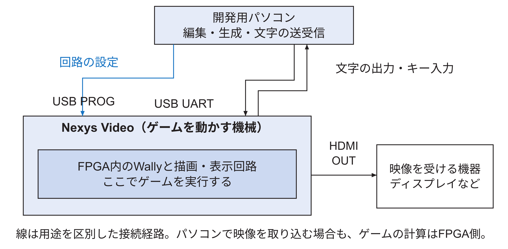

図1.2では、線に何を送るかを書いた。上のパソコンは回路の設定と文字の送受信を行い、下のFPGA内のCPUがゲームを実行する。映像をパソコンで取り込む場合でも、取り込み機器がゲームの位置計算を代わりに行うわけではない。

<a id="s_1_2"></a>
### 1.2 公開されている設計を利用する理由

CPUには、すでに設計が公開されているWallyを使う。Wallyは、教科書RISC-V System-on-Chip Designで説明されるCPUと周辺回路の設計である[Harris26](#ref_Harris26)[Thompson25](#ref_Thompson25)[Wally](#ref_Wally)。以下では、この教科書をRVSOCと略す。教科書を読んだ人が、CPUの外へ機能を追加する例を追えるように、同じ基盤を用いる。

画像を作る部分にはRasterIXを使う[RasterIX](#ref_RasterIX)。RasterIXは、描画回路と、その回路へ命令を送るソフトウェアのソースコードを公開している。そのため、接続する信号やデータの形式を実装まで調べられる。利用には各部品のライセンスに従う。

公開部品がそろっても、そのまま二つを並べるだけでは動かない。例えば、CPUは「ある番号の場所へ数値を書く」という形で外部へ指示する。一方、描画回路は、順に並んだ描画用データを受け取る。両者が使う信号や手順をつなぐ部分が必要である。さらに、どのメモリに画像を置くか、表示をいつ切り替えるかも決める必要がある。

<a id="s_1_3"></a>
### 1.3 本研究で解決する問題

最初の問題は、Nexys Videoという基板でWallyを動かすことである。基板ごとに、FPGAの型番、取り付けられたメモリ、配線、発振器の周波数が違う。既存の別基板向け設定を、そのまま使えるとは限らない。基板の仕様に合わせて、回路の接続と生成条件を変更する。

次の問題は、CPUと描画回路の受け渡しである。描画回路が次のデータをまだ受け取れない場合には、受け取れるようになるまで、そのデータを保持する必要がある。また、CPUと描画回路は異なるクロックで動くため、CPUが一度送ったデータを、相手も一度だけ受け取るようにする。本研究では、先に受け取ったデータから送り出すFIFOを用いる。一語ずつ受取確認を待つ方式とも比較し、CPUが送信で待つ時間と、接続に使う回路の量を調べた。

さらに、メモリの使い方と表示の切り替えを決める。Linuxがプログラム用に使っている場所へ画像を書けば、プログラムのデータを壊してしまう。表示回路が読んでいる最中の画像を書き換えると、新旧の画像が混ざることがある。こうした問題を避けるため、領域と利用時刻を管理する。

<a id="s_1_4"></a>
### 1.4 成果を利用できる人

想定する利用者は、RVSOCやWallyを学び、CPUへ別の回路を追加したい人である。本研究は、その人が見比べられる接続コード、設定値、動作の確認方法を提供する。例えば、画像処理以外の回路をつなぐ場合でも、相手が受け取れない間の待ち方や、Linuxと装置のメモリを分ける考え方を参照できる。

提供するのは、接続の実装と検証方法を調べられる設計資料である。授業での利用や学習時間の測定は行っていないため、教育上の効果の評価は今後の課題となる。

<a id="s_1_5"></a>
### 1.5 本稿で示す確認結果

本稿では、接続回路をコンピュータ上で模擬動作させる試験、FPGA内への配置、実機でのゲーム動作を順に扱う。接続回路の試験では、相手の応答を意図的に遅らせたときの振る舞いも調べる。実機では、ゲームの進行、メモリ内の画像、記録した映像を確かめる。

一枚の画像を作る時間が長いと、一秒間に見せられるボールの位置が少なくなり、動きが粗く見える。そこで、CPUが描画命令を準備・送信する時間を測り、図形の呼び出しをまとめる方法と、変化した領域だけを描く方法を評価した。接続回路の設計と、それを利用するプログラムの両面から、二次元ゲームが動く条件を示す。

<a id="h0038"></a>
#### この研究で説明する問題と対処の対応

「つないだ」という結果の中には、異なる問題への対処が含まれる。例えば、CPUが書いた一つの値を描画回路が取りこぼす問題と、正しくできた画像を表示中に書き換える問題は、直す場所が違う。次の表を全体の案内として使う。

| 動かすために必要な条件 | 条件を満たさないと起こる例 | 本研究での対処 | 詳しく読む場所 |
|---|---|---|---|
| 実物の基板と設計が一致する | DDR3が初期化できずCPUが起動しない | 型番、端子、クロック、メモリ設定を合わせる | [第6章](#ch_6)、[付録E](技術付録.md#ch_E) |
| 命令を受け取るまで値を保つ | 図形を描く指示が抜ける | FIFOと書き込み待ちを接続する | [第7章](#ch_7) |
| Linux用データと画像の保存先を重ねない | Linuxのデータを画像で上書きする | 画像用に32 MiBを予約する | [5.3](#s_5_3)節、[10.8](#s_10_8)節 |
| 古い画像を使い終えてから再利用する | 表示途中の色が新旧で混ざる | 読み出しの返事を待って完了を通知する | [10.5](#s_10_5)〜[10.6](#s_10_6)節 |
| 次の画像を短い間隔で用意する | ボールの動きが粗く見える | 呼び出し統合と部分描画を使う | 第11〜13章 |

この表の対処を説明した後、実験で何を観察したかを示す。設計の意図と、実際に確かめられた範囲を対応させることで、別の回路へ応用するときにも、どの条件を確認すべきかが分かる。

<a id="ch_2"></a>
## 第2章 ボールが動くまでの処理

画面上のボールが右へ動くとき、ゲーム機の中では何が変わるのだろうか。本章では、白い四角形を右へ3画素動かす一回の処理を追う。最初はボールだけを考え、ブロックや得点の処理は省く。以下の100、200、8という値は、処理を説明するために選んだ値である。

<a id="s_2_1"></a>
### 2.1 位置を数値として覚える

画面を方眼紙のようなマスの集まりとして考える。一つのマスに一つの色を付ける。このマスが画素である。本ゲームの画像は横640画素、縦480画素なので、横に640個の画素を並べた行が、上から下へ480行ある。

場所を指定するため、左端の列に0、その右に1、2、3と番号を付ける。上端の行にも0、その下に1、2、3と番号を付ける。横の番号をx、縦の番号をyと書く。(100, 200)は、横の番号が100、縦の番号が200の場所を表す。画面全体の番号は、横が0〜639、縦が0〜479となる。

ボールは、左上が(100, 200)、幅が8、高さが8の白い四角形とする。左上の場所だけ覚えておけば、幅と高さを使って残りの場所も求められる。ゲームプログラムは、この横位置100を、例えばballXという名前の変数に保存する。変数とは、プログラムが後で使う値に名前を付けたものである。メモリは、そのような値を保存しておく部品である。

CPUは、プログラムに書かれた計算や読み書きを実行する回路である。ここではWallyがそのCPUに当たる。右へ3画素進める処理では、CPUがballXの100を読み、3を足して103を求め、ballXへ保存し直す。

```text
変更前の位置  ballX = 100
右へ進む量    velocityX = 3
次の位置      ballX = ballX + velocityX
変更後の位置  ballX = 103
```

上の代入では、右辺を先に計算する。現在のballXが100なら、右辺は100+3である。その結果103を左辺のballXに保存する。等号の左右が同時に同じ値でなければならない、という数学の等式とは読み方が違う。

この時点で変わったのは、プログラムが覚えている横位置だけである。画面に出す色の並びは、まだ書き換えていない。次節以降で、この位置の値を使って画像を作る。

<a id="s_2_2"></a>
### 2.2 入力とゲームの規則

ブロック崩しでは、ボールの位置に加えて、パドルの位置、ボールが進む向き、残っているブロック、得点を覚える。これらの値をまとめてゲームの状態と呼ぶ。例えば「ボールの横位置は100、右向きに進む、あるブロックはまだ残っている」という情報が状態に当たる。

CPUは現在の状態とプレイヤーの入力を使って、次の状態を計算する。パドルを右へ動かす入力があれば、その位置を右へ進める。ボールと壁が重なる位置まで来たら、次に進む向きを反対にする。ブロックに当たったら、そのブロックを「残っていない」という状態にし、得点を増やす。この段階では、画像の色を決める前に、ゲームとして何が起きたかを計算している。

現在の実装では、パソコンの端末から受け取ったDを右移動、Aを左移動、Sを停止に対応させている。届いた文字によって移動方向を切り替える方式であり、Dキーから指を離したことは端末の一文字だけでは分からない。停止にはSを送る。実験では、パドルの動かし方を同じ条件にできる自動操作も用いた。専用のWiiコントローラーの接続は、まだ実装していない。

<a id="s_2_3"></a>
### 2.3 数値を画像に変える

画像を保存するメモリには、画素ごとの色が並ぶ。例えば横位置100のボールを表す画像では、横100〜107、縦200〜207の8×8個の画素が白い。周囲を黒くすれば、黒い背景の上に白い四角形が見える。横位置を103に変えた画像では、白くする範囲が横103〜110へ変わる。

ballXの103と、画像に保存する白色は、役割の違う値である。ballXを読むのはゲームを実行するCPUであり、その値を次の位置計算や描く場所の指定に使う。画像の色を読むのは後述の表示回路であり、読み取った順に外へ送る。表示回路はballXという変数を見に来ない。そのため、ballXを書き換える処理とは別に、画像の色を作り直す処理が必要になる。

図2.1は、ボールがある行を取り出した図である。上段では100〜107番のマスが白く、下段では103〜110番のマスが白い。横の番号が同じマス同士を比べると、100〜102は白から黒へ、108〜110は黒から白へ変わる。103〜107は白のままでよい。縦方向にも8行分、同じ変更が必要になる。

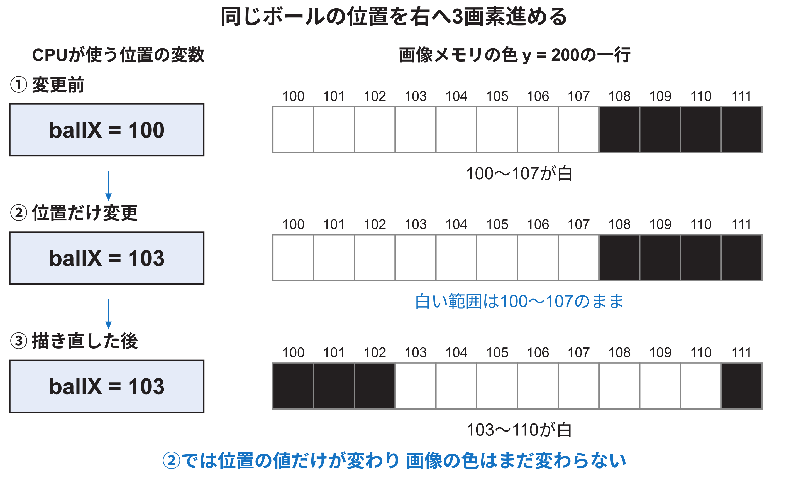

この画像を作るため、ゲームプログラムは「左上(103, 200)、幅8、高さ8、白」という図形の指定を用意する。描画ライブラリは、その指定を描画回路が実行できる数値列へ変換するプログラムである。ライブラリを実行するのも、ゲームの位置を計算するのと同じWallyのCPUである。

ここで作る数値列を描画命令と呼ぶ。描画命令には、回路に行わせる処理や、その処理で使うデータが含まれる。C++に書いた「四角形を描く」という関数名そのものが回路へ届くわけではない。ライブラリのプログラムが、回路の読み方に合う数値列を作る。その数値列をメモリに保存する場所がコマンドバッファである。命令の具体的な作り方は[第9章](#ch_9)で扱う。

次にCPUは、コマンドバッファに保存した数値を順に読み、描画回路へつながる専用の入口へ書く。これが命令の送信である。本構成では、描画回路がCPU用のコマンドバッファを自動的に読みに来るのではなく、CPUが読み出して渡す。

命令を受け取った描画回路は、指定された図形に含まれる画素を求め、その色を作る。本構成のRasterIXは、まずFPGA内部の作業用メモリで画像の一部分を作り、その結果を基板上のDDR3メモリへ保存する。このDDR3にある完成画像を表示に使う。内部の作業用メモリを使い回す手順は9.7節で説明する。

ここまでに出た「位置を覚える」「命令を保存する」「画像を保存する」は、すべてメモリを使うが、保存する中身が違う。位置には103のような場所の値、命令には回路へ行わせる処理の値、画像には画素ごとの色の値が入る。これらを同じ一つの値だと考えると、CPUが位置を変更しただけで画面も変わるように見えてしまう。実際には、位置から図形を指定し、命令を送り、画素の色を作るところまで進む。

| 段階 | この例での内容 | 作業するもの |
|---|---|---|
| 位置の計算 | 100+3を計算し、ballXを103にする | WallyのCPU |
| 図形の指定 | (103, 200)に8×8の白い四角形を描くと指定する | 同じCPUがゲームを実行 |
| 命令の準備 | 図形の指定を回路向けの数値列にし、メモリへ保存する | 同じCPUがライブラリを実行 |
| 命令の送信 | 保存した数値列を読み、回路の入口へ書く | 同じCPUが送信処理を実行 |
| 画素の作成 | 指定範囲の色を作り、表示用の画像へ保存する | RasterIXの描画回路 |

毎回画像全体を黒くしてから白いボールを描けば、古い位置の白い画素も消せる。一部だけを書き換える方法では、古い位置に残っている白い画素も消す必要がある。[第11章](#ch_11)では、この仕事を少なくする方法を説明する。

<a id="s_2_4"></a>
### 2.4 画像を画面へ出す

DDR3に完成画像を保存したら、表示回路がその色を読み出す。左上の色から右へ進み、一行の終わりまで来たら次の行へ進む。この順に読んだ色を、映像の信号としてHDMI OUT端子から送り出す。受け取った表示機器は、その信号を画面の各位置の色に対応させる。

ここで表示回路に必要なのは、どこに画像があり、横と縦にいくつの画素が並ぶかである。ボールの速度やブロックの得点は必要ない。完成画像に白い四角形があれば、その場所を白く表示する。その四角形がボールなのか文字の一部なのかも判断しない。

画像をメモリに作る仕事を描画、画像を読み出して映像として送る仕事を表示と呼ぶ。ゲームが新しい画像を作らなくても、表示回路は同じ画像を繰り返し送る。このとき、画面には同じ位置のボールが映り続ける。静止画を映す場合にも、表示回路は動き続けている。

<a id="s_2_5"></a>
### 2.5 同じ処理を繰り返す

ゲームは、位置を一回変えて終わりではない。入力とゲームの状態から次の位置を求め、その状態の画像を作る処理を繰り返す。役割だけを取り出すと、次のように書ける。

```text
終了していない間、繰り返す
    入力を読む
    ボールやパドルの位置を計算する
    現在の状態を描くための指示を作る
    指示を描画回路へ送る
    次の画像への表示切り替えを待つ
```

一枚の画像や一回の画面更新をフレームと呼ぶ。ただし、位置を計算する回数と、新しい画像を作る回数は分けて考える必要がある。例えば、一秒間に60回位置を進めるゲームなら、一回の間隔は1÷60秒、約16.7ミリ秒である。ミリ秒は一秒の千分の一を表す。

画像一枚を作るのに約33ミリ秒かかる場合、その間に位置を進める時刻が約二回分来る。次に描く前に二回分の位置計算を進めれば、ボールが実際の一秒間に進む距離を保ちやすい。ただし表示される新しい位置は途中の一つを飛ばすので、見た目の動きは粗くなる。本ゲームでも、経過した時間に応じて必要な回数だけ状態を進める。

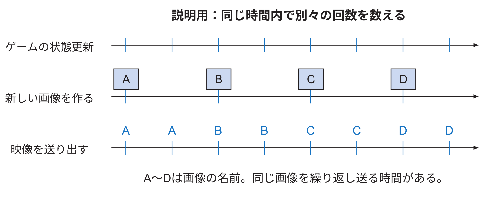

図2.2では、位置の計算が八回、新しい画像の作成が四回、画像の送信が八回ある。表示回路は、次の画像Bができるまで画像Aを二回送っている。同じ画像を二度送っても、画像の中のボールがさらに進むわけではない。この回数は仕組みを示す例であり、保存した実験の実測値ではない。

実験記録のticksは状態を進めた回数、framesはプログラムが描画と切り替えの処理を進めた回数を示す。録画ファイルの画像数は、さらに別に、取り込み側が記録した回数である。速度を比べる際には、どの回数を数えたかをそろえる。

<a id="s_2_6"></a>
### 2.6 この研究で作った接続の位置

ここまでの流れを既存の部品へ当てはめると、計算を実行する部分がWally、図形の命令を作るプログラムと画素を作る回路がRasterIXに含まれる部分である。RasterIXには、画像を外へ送る表示回路も含まれる。既存の設計を使いつつ、Wallyから命令を渡す接続、DDR3の使い方、表示画像を切り替える制御を本研究で組み合わせた。

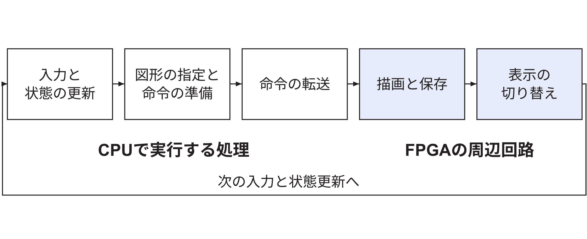

図2.3のソフトウェア側の各処理は、Wallyという一つのCPUがプログラムを実行して行う。描画ライブラリが別のCPUなのではない。図形を塗る回路へ命令を渡したところからは、CPU以外の回路も仕事を進める。以後は、この受け渡しをどのように作ったかを説明する。

<a id="s_2_7"></a>
### 2.7 ボールを一度動かす間に誰が何を変えるか

位置の値と表示中の画像が別物であることを、時間の順にもう一度確かめる。表示用画像の保存場所は二つあり、AとBと呼ぶ。最初は、横位置100のボールが描かれたAを表示しているとする。次の画像は、表示していないBへ作る。

CPUがballXを103にした直後も、表示回路はAを読むため、画面のボールは横位置100にある。次に、CPUが命令を送り、RasterIXがBに横位置103のボールを描く。このときも、Aを読んでいる間は古い位置のままである。Bが完成した後、表示回路の読出し先をAからBへ切り替える。Bの色が画面へ届くと、初めて新しい位置のボールが見える。

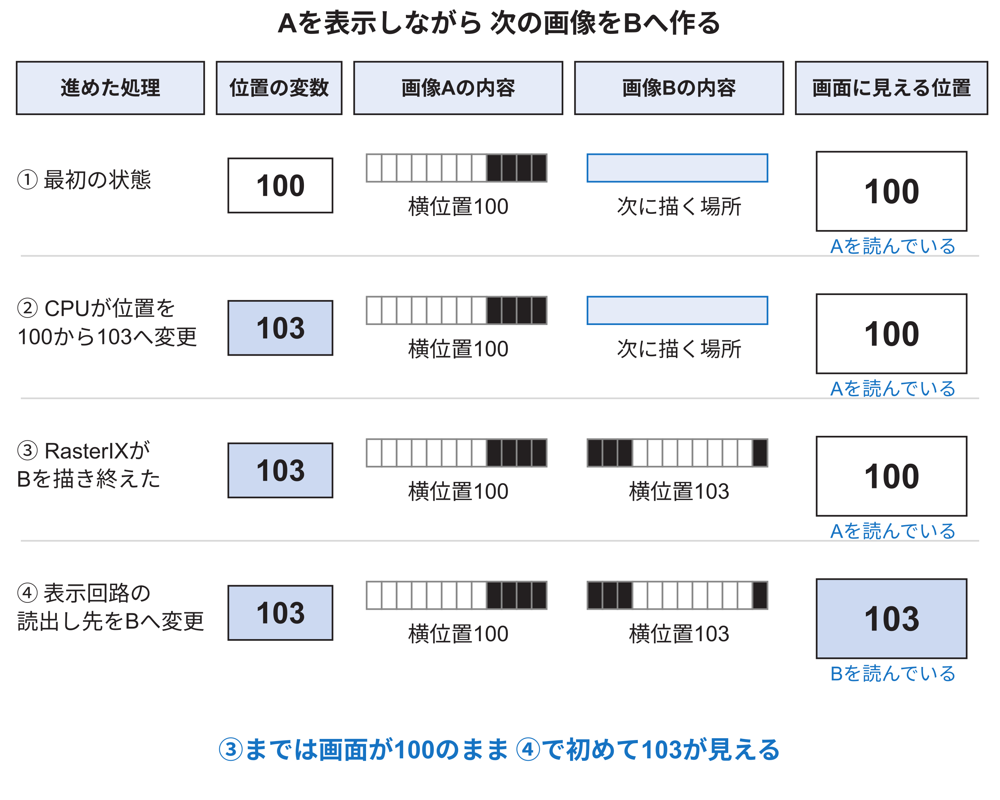

図2.4では、各段階のメモリの内容と、画面に出るボールの位置を横に並べた。画面が変わるのは最下段である。CPUが位置を変えた時点、Bを描き終えた時点、Bを表示した時点が違うことを、同じ列を上から下へ読んで確かめられる。

例えば、処理が終わるのを待っても、ballXが103なのに画面のボールが横位置100に残る場合を考える。Bの画素を読み戻して画像にし、そこでも白いボールが横位置100に描かれていれば、命令の準備・送信・描画を調べる。Bではボールが横位置103に描かれているのに、画面では100のままなら、表示回路がどちらの画像を読んでいるかを調べる。ここでの100と103は、画素に保存された色の値ではなく、ボールの横位置である。このように、途中のメモリも確かめると、画面だけを見ているときより調べる場所を絞れる。

表示中のAと、次に使うBを分ける理由と、安全に切り替える手順は[第10章](#ch_10)で扱う。

<a id="ch_3"></a>
## 第3章 回路とFPGAの基礎

[第2章](#ch_2)で示したCPU、描画回路、表示回路は、いずれも計算する部分と値を記憶する部分を組み合わせて作る。本章では、論理ゲートとレジスタから回路の動きを説明し、その回路をFPGAへ実装する方法につなげる。

<a id="s_3_1"></a>
### 3.1 計算する回路と覚える回路

論理ゲートは、入力の0と1から出力を決める。例えばANDゲートは、二つの入力が両方1のときだけ1を出す。こうしたゲートを組み合わせると、二つの数の足し算や、大小の比較を行う回路を作れる。この種類の回路では、入力の値を変えると、その変化がゲートを通った後で出力も変わる。現在の入力の組合せによって出力が決まるので、組合せ回路と呼ぶ。

0か1かを表す一つ分の情報をbit、八つ分をまとめてbyteと呼ぶ。したがって32 bitは4 byteである。後に出る「32 bitのデータを渡す」は、この32個の0と1を一まとまりとして渡すことを意味する。

ゲームを動かすには、計算結果を後まで覚えておくことも必要である。例えば横位置100に3を足して103を求めたら、次の計算ではその103を使いたい。入力が変わるたびに出力が変わるだけの回路では、前の結果を取り出せない。そこで、値を保持するレジスタを組み合わせる。

レジスタは、決められた時点の入力を取り込み、その値を次に取り込む時点まで出力に保つ。例えば32 bitのレジスタなら、32個の0と1を一組の値として保持する。この取り込み時刻を決める信号がクロックである。クロックは0と1を周期的に繰り返す。ここでは、0から1へ変わる瞬間を立ち上がりと呼び、その瞬間に値を取り込む回路を考える。

図3.1は、現在の値に1を足すカウンタの例である。現在のレジスタの値が3なら、足し算の回路の出力は4になる。まだクロックの立ち上がりが来ていなければ、レジスタが出している値は3のままである。次の立ち上がりで4を取り込むと、レジスタの出力が4になり、足し算の出力は次の5へ向かって変わる。


図3.1の下の表では、レジスタの出力が3、4、5と変わるのに対応して、足し算の出力が4、5、6と変わる。足し算の結果が先に用意され、次の立ち上がりで保存される、という順番を読む。

この一連の動作は、回路の部品を順番に作り直しているのではない。足し算の回路とレジスタはどちらも存在し、レジスタの出力を足し算へ、足し算の結果をレジスタの入力へ配線している。クロックによる保存を挟むことで、3、4、5と順に進められる。

CPUも、計算する回路と値を保存する回路を多数組み合わせて作る。プログラムに書かれた命令に応じて、使う計算や書き込む場所を切り替える。描画回路では、図形のどの位置を処理しているかなどをレジスタに覚え、次の画素を求める処理を進める。二進数からゲートを組み立てる説明は[付録K.1](技術付録.md#s_K_1)〜[K.4](技術付録.md#s_K_4)に示す。

<a id="s_3_2"></a>
### 3.2 FPGAに回路を作る

FPGAは、小さな論理回路、レジスタ、内部メモリと、それらを結ぶ配線を設定できるチップである。例えばFPGAの一部を足し算に使い、別の一部を値の保存に使い、両者を結ぶと、前節のカウンタを作れる。さらに多数の部品を組み合わせれば、CPUや描画回路を作れる。

FPGAの中で論理計算を担当する部品をLUT、複数の値をまとめて記憶する部品をBlock RAM（BRAM）と呼ぶ。本研究では、LUTやレジスタを使ってWallyなどの回路を作り、BRAMを描画途中の画素の保存などに使う。各部品をどれだけ使ったかは[第13章](#ch_13)の資源使用量で示す。

回路はHDLという言語で記述する。本研究で使うSystemVerilogはHDLの一つである。HDLで部品の入出力、計算、保存の条件を記述し、Vivadoという開発ツールに、FPGA内のどの部品と配線を使うか決めさせる。その結果をFPGAへ設定すると、チップの中で記述した回路が働く。

FPGAへ回路を設定する作業と、CPUでゲームを実行する作業は、この順に分かれる。まずFPGAにWallyというCPUを作る。その後、そのWallyがゲームプログラムを読み、計算や読み書きの命令を実行する。ゲームのC++を直接FPGAの各ゲートへ一対一に置いているわけではない。

<a id="s_3_3"></a>
### 3.3 FPGAチップと基板を区別する

Nexys Videoは、FPGAチップと周辺部品を配線した基板の名前である。FPGAの外側に、DDR3メモリ、SDカードを差す場所、HDMI端子などがある。基板上の銅配線によって、これらの部品とFPGAの決められた端子がつながっている。

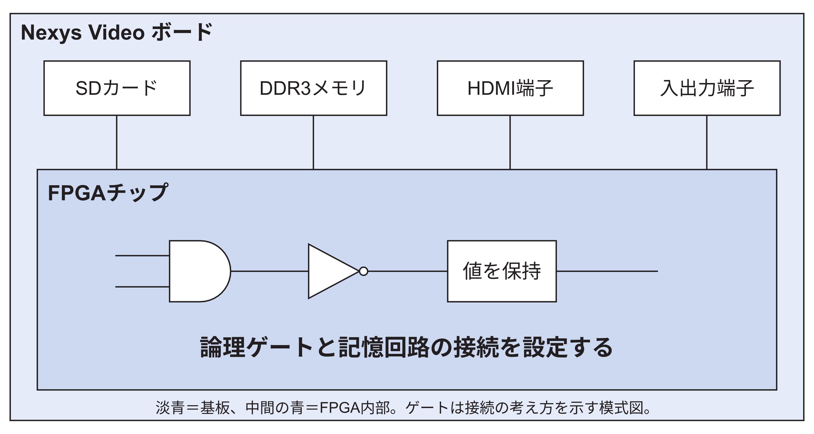

例えばDDR3を使うには、FPGA内部へDDR3制御回路を作り、その回路の信号を、基板上のDDR3へつながる端子に出す必要がある。HDLでDDR3Addrと名前を付けても、その名前だけでは、チップのどの端子から出すべきかVivadoには分からない。そこで端子番号の指定も与える。この指定が、[第6章](#ch_6)のボード対応の一部になる。

図3.2の大きな基板の枠、その内側のFPGAの枠、FPGAの外側に置いた部品を見分けると、設計を変えられる範囲も分かる。FPGA内の接続は設定し直せるが、基板上のDDR3の実容量や銅配線は、設定ファイルを書き換えただけでは変わらない。

<a id="ch_4"></a>
## 第4章 設計ファイルと開発手順

[第3章](#ch_3)の回路を実機へ組み込み、そこでゲームを実行するには、回路用とプログラム用の二種類のファイルを生成する必要がある。本章では、それぞれの生成手順と、実験結果に対応するソースの版の指定方法を説明する。

<a id="s_4_1"></a>
### 4.1 回路とプログラムで生成物が違う

例えばボールの色を白から赤へ変えたい場合、ゲームのC++を編集して新しい実行ファイルを作る。一方、CPUから描画回路へつなぐ配線を変えたい場合、回路のSystemVerilogを編集して新しいFPGA用設定を作る。どちらもパソコンでファイルを編集するが、変更を反映させる相手が違う。

回路を作るためにVivadoへ与えるのは、主に次の三種類のファイルである。SystemVerilogは回路の動作や接続を記述する。TclはVivadoへ作業を指示するスクリプトで、既存の回路部品を生成する操作などを書く。このように再利用する回路部品をIPと呼ぶ。XDCは、信号を出す端子や、クロックの周期などの条件を指定するファイルである。

Vivadoはこれらを読み、FPGAへ回路の構成を設定するbitstreamというファイルを生成する。ゲーム用C++は別のコンパイラで、Wally上のLinuxが実行する機械語のファイルへ変換する。設計やプログラムのソースから使えるファイルを生成する作業は、どちらもビルドと呼ぶ。

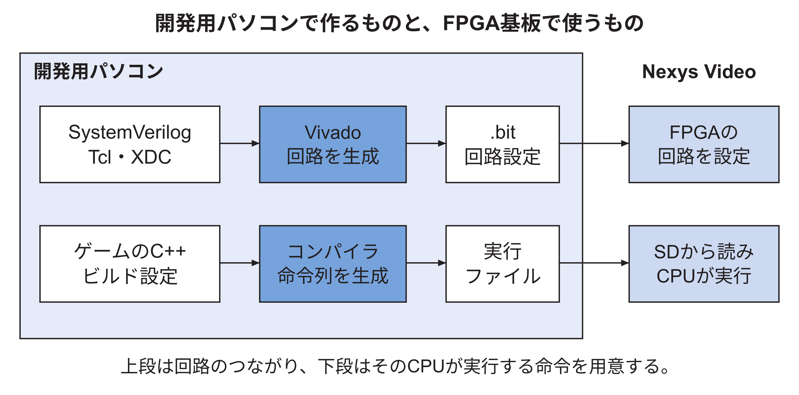

図4.1の上の経路では、Vivadoが回路の設計を読み、FPGAのどの部品と配線を使うかを決める。下の経路では、コンパイラがC++を、Wallyが実行できる機械語の命令へ変換する。回路を変えていなければ、ゲームの色を変えるたびにFPGA全体を作り直す必要はない。反対に、C++だけ作り直しても、FPGAに入っている配線や回路は変わらない。

回路のソースを変えた場合は、その変更を含むbitstreamを作ってFPGAへ設定しなければ実機は変わらない。ゲームを変えた場合は、新しい実行ファイルを実機側へ渡して起動する。古い生成物のままでは、ソースが正しくても変更後の試験にならない。

<a id="s_4_2"></a>
### 4.2 固定した版で部品をそろえる

公開ソースは継続して変更されるため、同じ名前のWallyやRasterIXでも、取得した版によって回路や設定が異なる。実験を再現するには、ゲーム機全体のソースと、部品として参照するRasterIXの版をともに指定する。本稿では、設計説明とゲームの評価に用いるものを「基準版」、命令接続方式の比較に用いるものを「接続比較版」と呼ぶ。

| 版の呼び方 | 対応する実験記録 | 固定したソース |
|---|---|---|
| 基準版 | E1〜E5 | ゲーム機リポジトリの`d3e181ac`、公式RasterIXの`9fdcf97a`を資料一式の基準とする |
| 接続比較版 | E6 | ゲーム機リポジトリの`261832d4`。公式Wallyの`2064ca2b`と公式RasterIXの`9269a01c`を用いる |
| 転送方式・内部メモリの比較版 | E7 | 接続比較版をもとに、DMA用の実験回路、送信ソフトウェア、内部作業領域の容量を個別に変える |

表の英数字は、Gitでソースの版を識別するコミットIDの先頭8文字である。基準版の完全なIDは[Console26](#ref_Console26)[RasterIX](#ref_RasterIX)、接続比較版の完全なIDと差分は[E6](#ref_E6)および[技術付録第29章](技術付録.md#ch_29)に記録した。通常版のソースは表のコミットから取得する。1語方式・16語FIFOや計測回路を使う比較では、対応する実験用の変更を加える。E1〜E5の個々の試験についても、実験記録に示した生成物と設定を用いる。

本文の設計説明は、特に断らない限り基準版を対象とする。接続比較版に固有の設定や結果は、その版を明記する。ゲーム機の標準構成は、公式RasterIXの内部を変更せずに使う。一方、E7のDMA実験では、RasterIXのソースを別の場所へコピーし、その内部に応答を保存する回路と命令解析の修正を加えた。この実験用コピーでの変更は、ゲーム機リポジトリが参照する公式サブモジュールへは反映していない。実験回路・ソフトウェアの対応は13.17〜[13.19](#s_13_19)節と[技術付録第30章](技術付録.md#ch_30)に示す。

映像の条件も区別する。製品の標準構成は、HDMI端子からDVI形式の映像を出す。別に試したHDMI形式の出力回路は、実験用の構成である。端子の形と映像の形式の違いは10.7節で説明する。[第13章](#ch_13)では、どの構成の結果かを明記する。

設計ファイルから生成物を作り、実機へ反映する手順は[付録L](技術付録.md#ch_L)に示す。ソース、bitstream、実行ファイルを対応付けることで、どの設計を実際に動かしたかを確認できる。

<a id="ch_5"></a>
## 第5章 ゲーム機全体の構成

<a id="s_5_1"></a>
### 5.1 既存の設計をどこから使うか

本研究ではCPUの命令実行回路を一から作り直すのではなく、公開されているWallyを使う。WallyにはCPUだけでなく、メモリや周辺回路につなぐための設計、FPGA向けの生成手順、Linuxを準備する設定がある。この土台を、使用するNexys Videoという基板に合わせる。その後、図形を描くRasterIXを追加する。[Harris26](#ref_Harris26)[Wally](#ref_Wally)[RasterIX](#ref_RasterIX)

WallyとRasterIXは別々の開発者による公開設計である。両方のソースを同じフォルダに置くだけでは、一つのゲーム機にはならない。Wallyが出す書き込みをRasterIXの受け取る命令へ渡し、両者が使うメモリの範囲を決め、完成画像を表示する必要がある。本研究で設計した接続は、この間をつなぐ部分である。

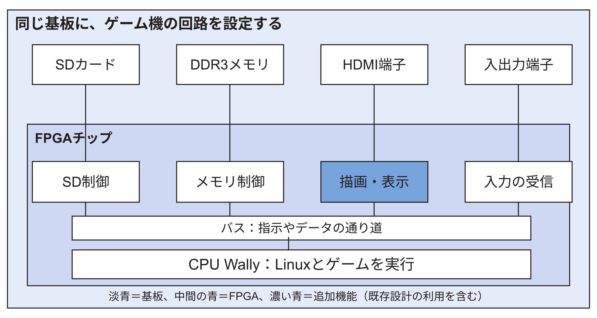

図5.1は、基板上の部品を[第3章](#ch_3)と同じ位置に置き、FPGAの中を実際の役割に対応する回路へ描き換えた概要図である。バスは、回路間で指示やデータを渡す通り道である。実装には命令用とメモリ用の異なる経路があるため、その詳細は図5.2で分けて示す。

<a id="s_5_2"></a>
### 5.2 CPU、描画回路、表示回路の役割

CPUが決めるのは、ゲームの次の状態である。ボールが壁に当たれば進行方向を変え、ブロックに当たればそのブロックを消す状態にし、得点を増やす。続いて、その状態を表す四角形と文字をライブラリへ渡す。このライブラリを実行して、回路向けの命令を作るのもCPUの仕事である。

描画回路は「ボールが壁に当たったか」を自分で判断しない。受け取った図形の位置と色に従って、画像の各点の色を求める。ゲーム側が誤った位置を指定すれば、描画回路が正しく動いていても、その誤った位置にボールが描かれる。ゲーム規則の正しさと、指定どおりに描く正しさを分ける理由はここにある。

表示回路は、出来上がった画像メモリから色を読み、映像端子へ送る。そこにある白い点がボールなのか文字なのかを区別する必要はない。画像メモリから読んだ色を、画面上の順序と映像の時間規則に従って送ることが仕事である。

描画と表示を分けて説明するのは、このように読むデータと仕事が違うからである。RasterIXに両方の回路が含まれていても、描画が済んだ画像を表示回路が読めなければ、画面へは出ない。反対に、新しい描画が止まっていても、表示回路は古い画像を送り続けられる。本研究では、この間の画像の保存と切り替えも接続した。

<a id="s_5_3"></a>
### 5.3 メモリを共有するとは何か

同じDDR3を使うという説明は、「すべてのデータを同じ番地へ入れる」という意味ではない。例えば、一冊のノートの前半を計算に、後半を画像の記録に使うように、一つの物理部品の中で使う範囲を分ける。以下では、この場所の分け方と、複数の回路から来る読み書きを取り次ぐ回路を区別する。

基板上のDDR3は、番地を指定して値を保存したり読み出したりできる大きなメモリで、容量は512 MiBである。MiBは1,048,576 byteを表す単位である。CPUはLinuxやゲームの命令とデータを置き、描画回路は表示用の画像と、図形へ貼る模様の画像（テクスチャ）を使い、表示回路は完成画像を読み出す。三つの回路が同じ物理部品を使うという意味で、「メモリを共有する」と呼ぶ。

ここでは二つの問題を別々に解く必要がある。一つ目は、同時に要求が来たとき、どの要求をメモリへ渡し、どの回路へ返事を戻すかである。これを受け持つ既存回路としてSmartConnectを使う。CPU、描画回路、表示回路がそれぞれ要求を出し、SmartConnectを通してDDR3制御回路へ届く。待たされた要求は、受け付けられるまで所定の信号を保持する。

二つ目は、同じ番地を二つの用途に使ってしまう問題である。例えば、Linuxがある番地に大事な管理データを置いた後、描画回路が同じ番地へ白色の画素を書けば、その管理データは壊れる。SmartConnectが二つの書き込みを順番に正しく届けても、この衝突は防げない。接続が正しいことと、使う場所が重ならないことは別だからである。

そこで、DDR3の末尾32 MiBを画像・テクスチャ用として確保し、Linuxが通常のメモリとして割り当てないように設定する。描画側も、その予約した範囲の中に画像を置く。「要求を取り次ぐ回路」と「使う番地の取り決め」の両方を用意して、同じDDR3を使えるようにした。

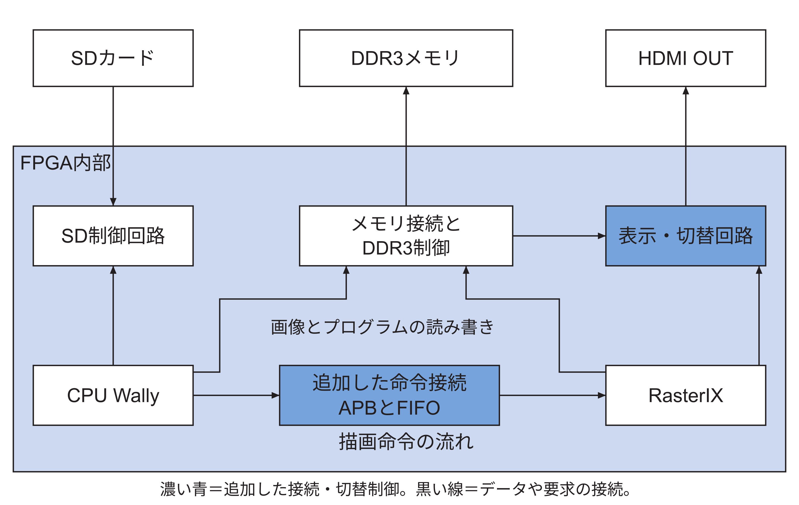

図5.2では、下側のCPUからAPB・FIFOを通ってRasterIXへ向かう接続が、描画を依頼する経路である。中央のメモリ接続網へ向かう接続は、プログラムや画像を読み書きする経路である。濃い青の箱は、本研究で追加した命令接続や表示切り替えの制御を含む部分を示す。黒い線は接続を表し、線の位置と箱の名前から経路を読み分ける。CPUから送る「ここに四角形を描くための命令」と、表示回路が読む「画素の色の並び」は別のデータである。APBとFIFOはこの命令接続に使う仕組みであり、[第7章](#ch_7)で動きを説明する。

<a id="h0148"></a>
#### 一本のバスという概要図から具体的な二つの道へ進む

CPUから「四角形を描くための命令」を送る道と、描画回路から「できた画素をメモリへ書く」道では、運ぶ内容も相手も違う。命令の道では、CPUの番地付き書き込みを、順序付きの32 bitデータ列へ直す。メモリの道では、CPU、描画回路、表示回路が、同じDDR3のどの場所を使うかを指定する。

APB、AXI、AXI4-Streamは、その道で使う約束の名前である。APBは周辺回路の番地を指定して操作するために使う。ここでAXIと呼ぶのは、DDR3へのアクセスで番地と読み書きのデータや返事を受け渡す方式である。AXI4-Streamは、命令FIFOのようにデータを順に渡す方式であり、その一語ごとにメモリ番地が付くわけではない。[第7章](#ch_7)では、この二つの経路のうち命令を渡す側を詳しく説明する。

| 接続の場所 | 運ぶ内容 | 使用する方式 |
|---|---|---|
| CPUの周辺アクセスから命令口 | 操作番地、書く値、完了の返事 | APB |
| 命令口からRasterIX | 32 bitの命令データ、最後かどうか | AXI4-Stream |
| 各回路からDDR3接続網 | メモリ番地、画素やプログラムのデータ | AXI |

これらをすべて「バス」と呼ぶこともあるが、別の約束を使う端子同士を名前だけ合わせても接続できない。どの約束からどの約束へ変換するかを決めることが、接続回路の設計である。WallyからAPBまでの既存の変換と、本研究で作ったAPBから命令列への変換を分けて読む。

<a id="s_5_4"></a>
### 5.4 本研究で加えたもの

| 対象 | 利用した既存部分 | 本研究で合わせた部分 |
|---|---|---|
| CPUを実装する基板 | WallyのCPUと既存のFPGA生成手順 | Nexys Videoの端子、DDR3、クロック、起動設定 |
| 描画 | 公式RasterIXの回路とライブラリ | CPUバスと命令端子の接続、共有メモリへの接続 |
| 画像の表示 | RasterIXに含まれるDVI表示回路 | 表示画像の切り替えと、その完了をCPUへ知らせる制御 |
| Linux上の利用 | Linux、Buildroot、既存の描画API | メモリ予約、命令を書き込む接続クラス、ゲームのビルド設定 |
| ゲームと確認 | RasterIXの描画機能 | 二次元ブロック崩し、動作確認、描画負担の軽減 |

表のBuildrootは、Linuxとそこで使うソフトウェアをまとめて生成するための仕組みである。本研究で合わせたのは、既存部品の仕様に合う接続と制御である。上の表では、利用した部分と作った部分を分けて示した。

<a id="ch_6"></a>
## 第6章 Nexys VideoでWallyを動かす

前章の箱と線を実物にするには、基板の固定された配線と、これからFPGA内に作る回路を合わせる必要がある。本章では、基板の発振器からCPUへクロックを届け、DDR3が使える状態を作り、Linuxへ正しいメモリの広さを知らせるまでを説明する。画面描画を足す前に、CPUが計算とメモリの読み書きをできる土台を作る段階である。

<a id="s_6_1"></a>
### 6.1 ボード対応で決める四つのこと

同じFPGAメーカーの基板でも、FPGAの型番、DDR3の容量、端子の配線、入力クロックは一致するとは限らない。既存の別基板向け設定を名前だけ変えて使うと、実物と違う端子を操作したり、メモリの存在しない範囲へアクセスしたりする。

本研究では、第一に使用するFPGAの型番、第二に外部端子、第三にクロックとリセット、第四にDDR3とLinuxから見えるメモリ範囲を合わせた。基板の事実はDigilentの資料[NexysVideo](#ref_NexysVideo)で確認し、Wallyでの記述方法は既存ボードのファイルに合わせた。

| 決めること | 本構成での値 | 主な記述場所 |
|---|---|---|
| FPGA型番 | xc7a200tsbg484-1 | fpga/generator/Makefile |
| 基板から入るクロック | 100 MHz | mmcm-nexysvideo.tclと基板配線 |
| CPUのクロック | 20 MHz | Makefile、mmcm-nexysvideo.tcl |
| FPGA内部のDDR3接続側のクロック | 100 MHz | mmcm-nexysvideo.tcl、DDR3生成設定 |
| DDR3の基準クロック | 200 MHz | mmcm-nexysvideo.tcl |
| DDR3容量 | 512 MiB | derivlist.txt、MIG設定、デバイスツリー |
| 外部端子 | 基板の配線に対応する端子 | constraints-nexysvideo.xdc |

<a id="s_6_2"></a>
### 6.2 端子を割り当てるとは何をすることか

この節で指定するのは、FPGA内の信号をチップのどの端子につなぐかである。基板の配線は既に決まっている。例えば、基板上の発振器がつながっている端子を、設計中のclk入力へ対応させる。ここを間違えると、HDLに正しい回路を書いても、その回路へ基板のクロックが届かない。

基板の発振器からFPGAのR4端子までは、製造時に銅の配線が作られている。R4はチップの端子位置を識別する名前である。一方、clkは設計者が最上位回路の入口に付けた信号名である。回路ソースにclkと書くだけでは実物の端子は決まらないため、この二つをXDCという制約ファイルで対応させる。

その対応を書く場所は`fpga/constraints/constraints-nexysvideo.xdc`である。次の二行は、clkをR4へ割り当て、その端子をLVCMOS33という電気規格で使う指定である。

```tcl
set_property PACKAGE_PIN R4 [get_ports clk]
set_property IOSTANDARD LVCMOS33 [get_ports clk]
```

`get_ports clk`は最上位回路のclkを指定する。`PACKAGE_PIN R4`は対応する実物の端子を、`IOSTANDARD LVCMOS33`はその端子の電気的な信号規格を指定する。図6.1のように、製造済みの基板配線へ自分の回路の入口を合わせる操作であり、基板上に新しい銅の線を作る操作ではない。別の基板で発振器の接続先が違えば、端子の指定も変える。

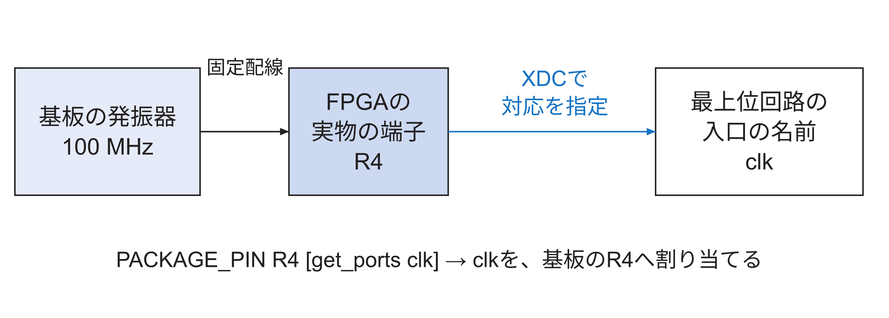

論理の0と1は実物では電圧で表されるため、端子番号だけでなく電気規格も相手の回路と合わせる。UART、SDカード、スイッチ、LEDも同様に割り当てるが、Nexys VideoではLEDとスイッチの端子群で規格が異なる。clkと同じLVCMOS33を全端子へ一括指定してはいけない。正確な一覧は再現資料のXDCで確認できる。

制約を書いた後は、Nexys Video用の生成手順がそのXDCを読み込むことも確かめる。[付録E](技術付録.md#ch_E)では、ファイルへ書く制約と、生成手順への読込先の追加を続けて追う。

本実装のLEDであるLD0〜LD7はGPIOの出力に接続し、ソフトウェアがGPIOへ書いた値に応じて点灯する。クロックの安定やDDR3の初期化状態は、[6.5](#s_6_5)節で説明する内部信号で確認する。

<a id="s_6_3"></a>
### 6.3 100 MHzから20 MHzを作る

MHzは、一秒間のクロックの繰返し回数を百万回単位で表す。基板の100 MHzをCPUへそのまま入れると、CPUのレジスタには10 nsごとに保存の時刻が来る。CPUを20 MHzで動かす場合は、その間隔を50 nsにする。nsは一秒の十億分の一である。このため、入力のクロックから別の周波数のクロックを作る回路を使う。以下では、その回路を用意する設定と、信号の時間を解析するための設定を分けて説明する。

100 MHzは1秒に1億回の周期であり、一周期は10 nsである。CPU用の20 MHzは1秒に2千万回なので、周期は1÷20,000,000秒=50 nsになる。CPUの各回路は、その周期の中で次の記憶素子へ渡す値を計算する。

本実装ではClocking Wizardという生成機能を使い、入力100 MHzからCPU用20 MHzなどのクロックを作る。設定を書く場所は`fpga/generator/mmcm-nexysvideo.tcl`であり、指定した周波数に従ってMMCMを含む回路が生成される。MMCMは、FPGAに内蔵されたクロックの生成・調整用の部品である。

これに対して、次の命令は回路を作らず、時間解析の条件をVivadoへ知らせる。

```tcl
create_clock -period 10.000 -name BoardClock [get_ports clk]
```

意味は「clkには周期10 nsのクロックが入るので、その条件で信号が間に合うか調べる」である。[Vivado25](#ref_Vivado25) 手動で定義する構成なら、生成手順から読み込む`fpga/constraints/constraints-nexysvideo.xdc`などのXDCへ書く。ただし、本構成ではClocking Wizardが入力クロックの制約を供給するため、上の例を追加しない。Nexys Video用XDCにもその旨のコメントがある。[Console26](#ref_Console26)

生成後は`report_clocks`で、IPが供給する制約も含め、Vivadoが認識したクロックを確認する。XDC一枚にcreate_clockが見当たらないだけで未設定とは判断できない。逆に解析の周期だけを50 nsへ変えても、実物の発振器やMMCMの出力は20 MHzにはならない。クロックを作る設定と、そのクロックを前提に解析する設定を一致させる必要がある。

CPUの50 nsの間に、描画回路側100 MHzの10 nsは五周期入る。ただし一周期で行う仕事は回路ごとに違うため、この比だけから描画性能が5倍とは言えない。

図6.2では、上段を実機の信号、下段を設計ツールへ伝える情報として分けた。上段の矢印にはクロック信号が流れ、下段の矢印には解析条件を与えるという関係を表した。

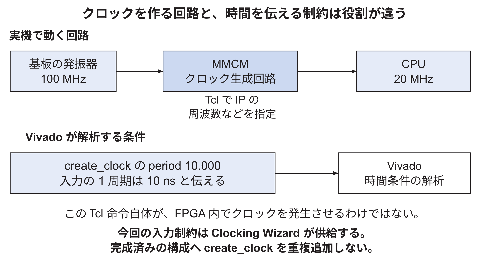

CPUを20 MHzにするには、上段のMMCMの出力をその周波数になるように構成する。下段で入力周期を10 nsと知らせるだけでは、20 MHzのクロックは作られない。本図のcreate_clockは命令の意味を説明するものであり、本構成へそのまま追加する手順ではない。


<a id="s_6_4"></a>
### 6.4 なぜCPUは20 MHzなのか

20 MHzは、本構成の接続を成立させ、Linuxとゲームを確認するために採用した実装設定である。Nexys VideoのFPGAが必ず20 MHzまでしか動かないという意味でも、このCPUの最適な設定を探し切ったという意味でもない。

FPGAの論理部品が多いことと、同じ回路が速く動くことは別である。周波数を上げられるかは、演算の段数、回路の配置、配線距離、FPGAの速度等級などに依存する。部品数に余裕があっても、ある一つの長い信号経路が周期内に間に合わなければ、周波数を上げられない。

CPU周波数を変える実験をするなら、クロック生成だけでなく、UARTや起動コードなど周波数を前提にした設定もそろえ、再び配置配線と実機確認を行う。本研究の保存済み比較ではCPUを20 MHzに固定しており、周波数の違いとソフトウェア改善の違いを混ぜていない。

<a id="h0188"></a>
#### 回路が収まる条件と時間に間に合う条件

説明用に、あるレジスタから次のレジスタへ値を送るまでの計算と配線に48 nsかかり、受け取り前に1 nsの準備時間を確保したいとする。周期50 nsなら、50−48−1=1 nsの余裕がある。周期40 nsに変えると40−48−1=−9 nsで、次の合図に間に合わない。この数値は時間余裕の考え方を示す仮の値である。

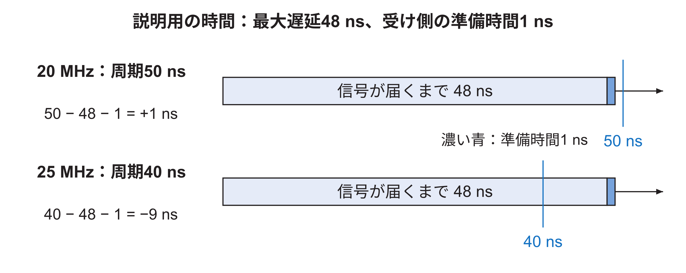

レジスタが値を取り込むには、クロックの立ち上がりより少し前までに入力の値が決まり、その後も短い時間は変わらない必要がある。立ち上がり前に確保する時間をセットアップ時間、立ち上がり後に保つ時間をホールド時間と呼ぶ。図6.3が扱うのは前者である。後者については、取り込んだ直後に次の値が届いてしまわないかを別に調べる。実際の解析では、クロックが各レジスタへ届く時刻の違いや不確かさも含め、両方の条件を確認する。

LUTやBRAMが余っていることは、置ける部品が残っているという意味である。それだけでは、長い配線や計算が一周期に収まるとは分からない。[第13章](#ch_13)で資源使用率と時間余裕の両方を示すのは、別々の条件を見ているからである。

<a id="h0193"></a>
#### レジスタ間の経路へ時間の計算を当てはめる

時間解析で確認するのは、あるクロックの立ち上がりで送り出した値が、受け側のレジスタに必要な時刻までに届くかである。単純な同一クロックの例で、周期50 ns、組合せ回路と配線の合計が32 ns、受け側の準備時間などが3 nsなら、概算の余裕は15 nsになる。この数値は説明用であり、実機レポートの値ではない。実際の解析には、クロックが各レジスタへ届く時刻の差なども含まれる。

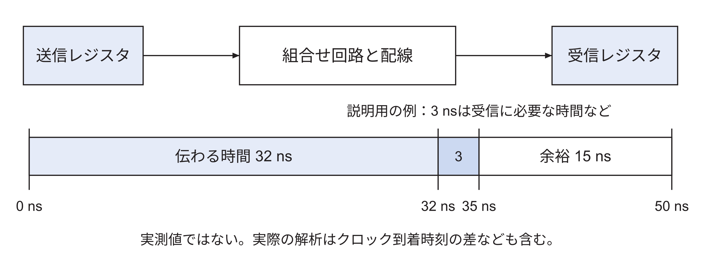

図6.4で回路を追加すると、組合せ回路や配線の時間が増えることがある。同じArtix-7でも、配置場所や混雑、使う回路が違えば、この時間は同じにならない。したがって、CPU20 MHzは「Artix-7の最高速度」という値ではなく、本構成で配置配線結果を確認した動作条件である。

<a id="s_6_5"></a>
### 6.5 リセットを解除する順番

リセットは、回路が記憶している状態を決められた初期値へ戻す操作である。CPUを動かし始めるには、クロックが安定し、命令やデータを置くDDR3が読み書きできる必要がある。そこで、基板のリセットボタンを離しただけではCPUをすぐに動かさず、クロックの安定とDDR3の初期化完了を確認してからリセットを解除する。

fpga/src/fpgaTopNexysVideo.svでは、クロックの安定をClockLocked、DDR3の初期化完了をDDRCalibCompleteで受け取る。CPU向けリセット回路とDDR3側のリセット回路を、それぞれのクロックで動かす。これにより、停止を解除するタイミングを各回路のクロックに合わせる。

ボタンや外部信号は、内部クロックと同時に変化するとは限らない。レジスタが取り込む瞬間に入力が変わると、出力が0か1へ落ち着くまでに通常より長い時間がかかる場合がある。そこで、最初に取り込んだ結果をすぐに広く使わず、後段のレジスタを通して使う同期回路を設ける。リセットの解除も、対象となる回路のクロックに合わせて伝える。この問題とクロック間の受け渡しは7.4節で詳しく説明する。

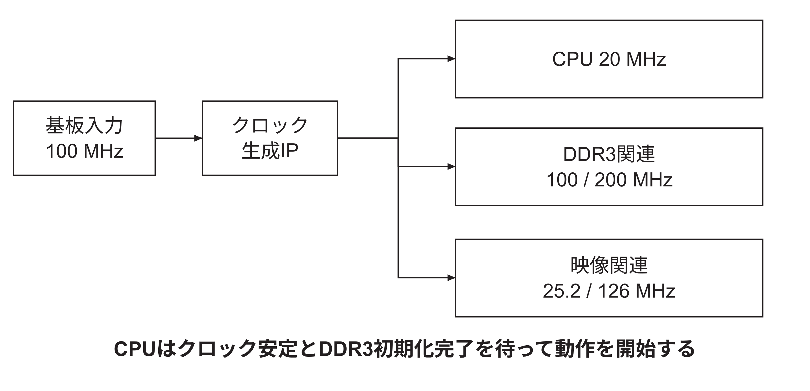


図6.6は、起動条件が順にそろう様子を表す。線の低い部分を「まだ満たさない」、高い部分を「満たした」と読む。

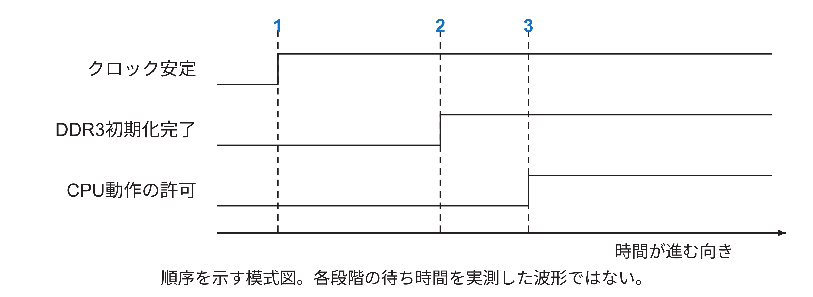

まずクロックの安定を確認し、次にDDR3の初期化完了を確認する。その両方がそろってからCPUが動作できる。図はこの順序を示すもので、線の長さから実際の起動時間を求めることはできない。具体的な信号名やリセット条件は、クロック生成IPと最上位回路で確かめる。

<a id="h0205"></a>
#### 信号の0と1を実際の接続コードで確かめる

同じ「リセット」という名前でも、1の間に初期化する入力と、0の間に初期化する入力がある。信号名の末尾の`n`は、通常、0で有効になることを表す。本実装の`CPUReset`は1で有効、`CPUResetn`は0で有効である。これらを取り違えると、CPUが常に初期化されたままになるか、必要な初期化が行われなくなる。

`fpgaTopNexysVideo.sv`のCPU用リセット回路では、外部ボタンが押されている、DDR側がリセット中、クロックが安定していない、のいずれかでリセットを要求する。さらに`dcm_locked`へDDR初期化完了を渡し、DDR3の準備ができるまでCPUの開始を待たせる。次はその接続の一部である。[Console26](#ref_Console26)

```systemverilog
.slowest_sync_clk(CPUCLK),
.ext_reset_in(~resetn | DDRSyncReset | ~ClockLocked),
.aux_reset_in(1'b0), .mb_debug_sys_rst(1'b0),
.dcm_locked(DDRCalibComplete),
```

`~`は0と1の反転、`|`はどれか一つが1なら1になる演算である。例えばボタンを離して`resetn=1`になっても、`ClockLocked=0`なら`~ClockLocked=1`なのでリセット要求は残る。この論理により、「ボタンを離した時刻」と「CPUが動き始める時刻」が必ずしも一致しなくなる。

| resetn | ClockLocked | DDRCalibComplete | この例でのCPUの扱い |
|---:|---:|---:|---|
| 0 | 任意 | 任意 | 外部リセットを要求する |
| 1 | 0 | 任意 | クロック安定を待つ |
| 1 | 1 | 0 | DDR3初期化完了を待つ |
| 1 | 1 | 1 | DDRSyncResetも0なら、CPUCLKに合わせて解除へ進む |

最後の行でも、その瞬間に全出力が変わるという意味ではない。使用するリセットIPが、対象クロックに合わせて解除する。CPU用にはCPUCLK、DDR側用にはDDRCLK、表示用にはPixelCLKを指定する。別のクロックの途中で解除すると、その領域のレジスタがそろって通常動作へ戻るという前提を満たしにくくなるためである。

リセットとクロックの役割、制御状態の初期化と画像を消す処理の違いは、[付録J.2](技術付録.md#s_J_2)で具体的に分けて説明する。

<a id="s_6_6"></a>
### 6.6 DDR3制御回路の生成

DDR3は、単純な配列のように一つのアドレスだけを渡せば読み書きできる端子構成ではない。初期化、行と列の選択、読み書きのタイミングなどを扱う制御回路が必要になる。本実装では、VivadoのMIGという既存機能でその制御回路を生成する。

fpga/generator/xlnx_ddr3-nexysvideo-mig.prjは、使用メモリと基板配線に関する設定を保持する。fpga/generator/ddr3-nexysvideo.tclは、その設定を使ってIPを生成する。prjの端子一覧を、別のボードのものへ置き換えてはならない。FPGAとDDR3の間の配線は、実物の基板上で固定されているからである。

本接続では、DDR3の外部データ線は16本である。一方、CPUからメモリ制御側へ渡す内部のデータ経路は64 bit幅である。「DDR3が16 bit幅なのにCPUは64 bit」は矛盾ではない。制御回路が外部メモリの転送をまとめ、内部の幅に合わせて受け渡す。

<a id="h0217"></a>
#### 外部の16本と内部の64 bitが一致しなくてもよい理由

データ幅は、一度の受け渡しで並べるbit数を表す。64 bitの値を運ぶ内部の端子には、データの位置が64個ある。基板上のDDR3とのデータ端子は16本なので、同じ64 bitをそのまま一回で並べて渡す幅ではない。制御回路が、DDR3の転送方式と速度に合わせてデータをまとめたり分けたりする。

説明用に64 bitを16 bitずつ四つに分けると、A、B、C、Dという四部分になる。これらを順に運べば、最終的に64 bit分の情報を渡せる。実際のDDR3にはクロックの両側を使う転送や、複数のデータをまとめる約束があるため、「CPUの四周期で必ず終わる」という意味ではない。幅が違うことと情報が欠けることを区別するための例である。

MIGはこの外部メモリ特有の制御を担当する。内部のAXI側は、読みたい番地や書く値を渡し、受け付けと返事を待つ。回路設計者がDDR3の各端子へゲームの画素を手作業で順番に出す必要はないが、MIGへ渡すメモリ型番、幅、配線、クロックの設定は実物に合わせる必要がある。

図6.7は、64 bitと16 bitの関係を、一つのデータを四つに分けた形で示す。左はFPGA内部のインタフェース、右は基板上のDDR3へつながるDQ端子である。

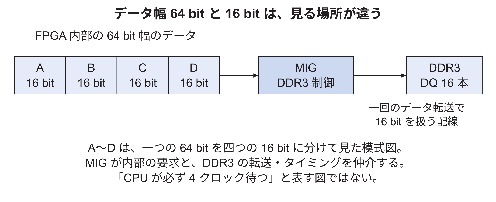

MIGは、内部から受けた要求をDDR3の規則に従う転送へ変換する。したがって、両側のデータ幅が同じである必要はない。A〜Dは幅を説明するための区切りであり、実機の転送順や一回の要求にかかるクロック数を測った結果ではない。


<a id="s_6_7"></a>
### 6.7 メモリ範囲を計算する

以下では、先頭に0xを付けた数を16進数で表す。Wallyから見たDDR3の先頭は0x80000000である。容量512 MiBは、512×1,048,576 = 536,870,912 byteであり、16進数では0x20000000 byteになる。したがって最後の1 byteのアドレスは、先頭に容量を加えて1を引いた0x9fffffffとなる。

config/derivlist.txtのfpganexysvideoでは、EXT_MEM_RANGEを0x1fffffffにする。ここでのRANGEは「byte数そのもの」ではなく、先頭から最後までの差である。そのため容量より1小さい値になる。別のファイルが容量を求めるときはRANGE + 1を使う。

Linuxへ渡すデバイスツリーにも、同じ512 MiBを記載する。デバイスツリーは、メモリの位置や容量、周辺機器など、使うハードウェアの構成をOSへ知らせるデータである。その元になるファイルがlinux/devicetree/wally-nexysvideo.dtsである。回路側だけ容量を増やしても、Linuxがその範囲を知らなければ利用しない。逆に、Linuxへ存在しない容量を知らせると、実際に使ったときに壊れる。

<a id="h0228"></a>
#### 末尾の番地を求めるときに1を引く理由

小さな例で、先頭番地100に4 byteの記憶領域があるとする。使える番地は100、101、102、103の四つである。最後は100+4−1=103になる。100+4=104は、この領域の直後の番地である。

同じ数え方で、先頭0x80000000、容量0x20000000なら、最後は0x9fffffffになる。EXT_MEM_RANGEは先頭から最後までの差なので0x1fffffffとなる。ソフトウェアへ知らせる容量0x20000000と、RANGEの0x1fffffffは、異なる数え方で同じ範囲を表している。

ここを混同していると、ファイル間で値が一つ違うだけで誤りと判断したり、逆にすべて同じ値へ書き換えて壊したりする。値を比較するときは、その項目が「容量」「最後の番地」「先頭からの差」のどれを求めているかも読む。

<a id="s_6_8"></a>
### 6.8 ボード対応を構成する12ファイル

ボード対応のコミットf0764f003は、6ファイルの追加と6ファイルの変更からなる。新規ファイルには基板固有の配線と回路構成を置き、既存の生成手順にはNexys Videoを選ぶ分岐を加えた。これにより、Nexys Video固有の設定を、他のボードでも使う共通の生成手順から分けて管理する。

最初にMakefileでnexysvideoという生成対象を確認する。次にmmcmとddr3の生成設定を読む。その後、fpgaTopNexysVideo.svで生成した部品をどう接続するかを見る。最後にXDCとデバイスツリーを読み、外部の基板とソフトウェアへ同じ前提が渡っているか確かめる。

[付録A](技術付録.md#ch_A)と付属の再現資料は、この順番で12ファイルの変更前、変更後、差分を対応付けた。完成した長いソースだけを読むのではなく、一つの変更によって何が変わるかを確認できる。

<a id="ch_7"></a>
## 第7章 CPUから描画命令を渡す

<a id="s_7_1"></a>
### 7.1 メモリの番地を回路の操作に使う

[第2章](#ch_2)では、CPUが描画命令をメモリに保存した後、その命令を読み出して描画回路へ渡すと説明した。この章では、その「渡す」という操作を具体的に追う。最初に、保存した数値を普通のメモリから読む操作と、回路へ数値を渡す操作を区別する。

メモリには、どの場所を読むか、どの場所へ書くかを指定する番号がある。この番号を番地、またはアドレスと呼ぶ。CPUがメモリへ書き込むときは、書込み先の番地と、保存する値を別々に指定する。例えば「番地100へ値7を書け」という操作では、100が行き先、7が中身である。

本研究の接続では、特定の番地を指定した書き込みを、メモリへの保存の代わりに、描画回路へ渡す操作として扱う。CPUが出した番地を調べる回路によって、DDR3へ届ける要求と、周辺回路へ届ける要求を振り分ける。このように番地を使って回路を操作する方式が、メモリマップドI/O、略してMMIOである。

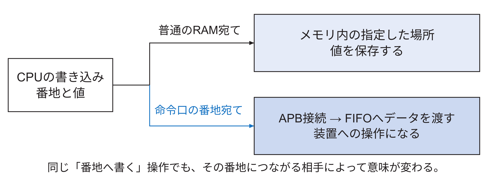

図7.1では、同じ場所へ7、その次に8を書いた場合を比べている。普通のメモリなら、その場所の中身が7から8へ置き換わる。本接続の命令口では、最初の7を回路へ渡し、次に8を渡す。同じ入口を繰り返し使って、数値の列を送れる。7と8は書込み方を示す説明値であり、実機に送って使える描画命令ではない。

本研究では、0x10080000から始まる256 byteの番地を、描画回路の操作に割り当てた。先頭の0xは、その後の値を16進数で表した印である。ここでは長い数字を暗記する必要はなく、同じ数値がソフトウェアの行き先と回路の判定条件の両方に現れることに注目する。

0x10080000は、命令の一部を入れる入口である。CPUはコマンドバッファから32 bit、つまり4 byteの値を読み、この入口へ書く。次も同じ入口へ次の4 byteを書く。この4 byte単位を、本章では一語と呼ぶ。一語が一つの四角形や一画面を丸ごと表すわけではない。描画命令の数値列を、一回に渡せる大きさへ区切った単位である。

通常の語を入れる入口のほかに、最後の語を入れる入口、状態を読む入口などもある。例えば0x1008000cを読むと、接続先を識別する値0x52495831が返る。この読出しを確かめると、CPUから操作が届いて返事が戻るところまでを確認できる。各入口の番地と役割を7.5節にまとめる。

この操作範囲は、Wallyの設定でも通常のメモリとは区別する。CPUには、一度使ったメモリの値を近くの小さな記憶領域に残し、次のアクセスを速くするキャッシュがある。しかし装置の現在の状態を読みたい場合に、昔の値を返されては困る。また、命令口への書き込みは、値を手元へ保存するだけで終わらず、回路へ届ける必要がある。このため、外部I/Oとして扱う番地の範囲を設定する。

<a id="s_7_2"></a>
### 7.2 APBという接続の約束

CPUが番地と値を指定しても、回路同士は、そのC++の文章を読んで受け渡すわけではない。番地を表す電気信号、データを表す電気信号、書き込みを行うことを示す電気信号を、配線を通して送る。送り手と受け手の間で、各信号の意味と、いつ値を受け取るかをそろえる必要がある。

本接続のCPU側で使う約束がAPBである。例えばPADDRという信号のまとまりに番地を出し、PWDATAに書き込む値を出す。受け手はPREADYという信号で、その転送を完了してよいかを返す。PREADYが0なら待ち、1なら決められた条件で完了する。APBは一つの配線の名前ではなく、こうした信号の組と使い方の名前である。

WallyのCPUから出た要求は、既存のAHB–APBブリッジを通ってAPBの形になる。ブリッジとは、一方の方式の要求を受け、もう一方の方式で要求し直し、返事も元へ戻す回路である。本研究では、そのAPB側へrasterix_apbという回路を追加した。この追加回路が命令口への書き込みを受ける。

| 信号 | 誰が出すか | 何を示すか |
|---|---|---|
| PADDR | CPU側のブリッジ | 操作する番地 |
| PWDATA | CPU側のブリッジ | その番地へ書く値 |
| PWRITE | CPU側のブリッジ | 1なら書き込み、0なら読出し |
| PSEL | CPU側のブリッジ | この回路を操作の対象にしていること |
| PENABLE | CPU側のブリッジ | 準備の次のアクセス段階に入ったこと |
| PREADY | rasterix_apb | この転送を完了してよいこと |
| PRDATA | rasterix_apb | 読出し操作に対する返答の値 |

図7.2は、一語の書き込みを行う時間の流れである。最初に対象と値を用意する準備段階がある。次にアクセス段階へ入り、受け手のPREADYを確認する。PREADYが0なら、番地と値を変えずにアクセス段階を続ける。

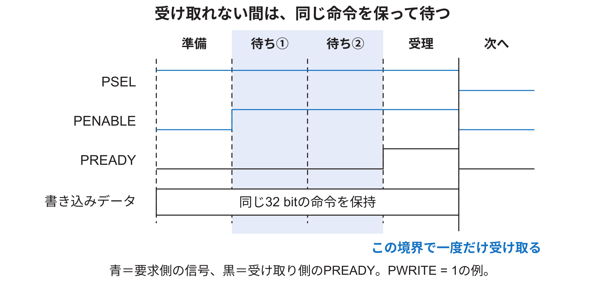

図の青い信号はCPU側、黒いPREADYは受け手が出す。時間は左から右へ進む。薄い背景の区間ではPREADYが0なので、送り手は同じ値を保つ。「受理」と示した区間の終わりのクロック立ち上がりで、PSEL、PENABLE、PREADYがすべて1となり、一回の転送が完了する。これはPWRITEが1の書き込みを説明する図である。

<a id="h0255"></a>
#### 受け取れない一語をクロックごとに追う

説明用の値0x11111111を一度だけ送りたい場合を考える。これは一語がいつ受け取られたかを見るための値であり、描画を実行する有効な命令として示すものではない。

| 段階 | PSEL | PENABLE | PREADY | 書き込み値 | この段階の終わり |
|---|---:|---:|---:|---|---|
| 準備 | 1 | 0 | この説明では不問 | 0x11111111 | 対象と値を用意する |
| アクセス1 | 1 | 1 | 0 | 0x11111111 | 未完了なので同じ値を保つ |
| アクセス2 | 1 | 1 | 0 | 0x11111111 | まだ同じ値を保つ |
| アクセス3 | 1 | 1 | 1 | 0x11111111 | 一度受け取り、転送が完了する |

同じ値が三つのアクセス期間に出ていても、書き込みが三回起きるわけではない。PREADYが0だった二回は未完了であり、三回目にだけ一度受け取る。信号の値が見えていることと、受け渡しが成立することを分けて数える。

追加回路は、次に説明するFIFOに一語を保存できるとき、PREADYを1にする。その状態のクロック立ち上がりで、FIFOへの保存とAPB書き込みの完了を同時に成立させる。保存できないのにPREADYを1にすると、CPU側は送れたつもりで次の語へ進んでしまう。反対にCPU側を待たせている間、同じ値を何度もFIFOへ入れると重複する。そのため、保存と書き込み完了を同じ一回として数える。

<a id="s_7_3"></a>
### 7.3 FIFOへの保存とAPB書き込みの完了

前節で説明したAPB書き込みの受け取り先には、描画命令を一時保存するFIFOを置く。FIFOはFirst In First Outの略で、先に受け取った語から順に送り出す回路である。CPU側はFIFOの入口へ語を書き、RasterIXは出口から語を受け取る。CPUから受け取る時点と、RasterIXへ渡す時点を分けられることが、この保存場所の役割である。

本構成では、FIFOが一語を保存した時点で、そのAPB書き込みを完了とする。RasterIXがすぐに受け取れなくても、FIFOに空きがあればCPUは次の語へ進める。満杯になった場合は、前節のPREADYを0にしてAPB書き込みを待たせる。したがって、FIFOを置いた構成でもAPBの待ち機能を利用する。

FIFOを置くと、RasterIXがまだ受け取っていない語を、接続回路の中へ預けられる。以下では、CPUがA、B、Cの三語を順に送りたい場面で、この違いを確かめる。A、B、Cは一語ずつを区別するための名前であり、有効な描画命令の具体値ではない。実機ではCPU側が20 MHz、RasterIX側が100 MHzで動くが、まずは両側が同じクロックで動く場合を比べる。これにより、クロックをまたぐ方法をまだ知らなくても、途中に保存場所を設けると何が変わるかを追える。実機のクロックへの対応は7.4節で説明する。

<a id="h0264"></a>
#### FIFOに保存する構成と、受け取りまでAPBを待たせる構成

CPUが最初のAを書こうとした時点で、RasterIXはしばらく新しい語を受け取れないとする。ここで「受け取れない」とは、入口のREADYを0にしていることであり、RasterIXのクロックや内部処理全体が停止することではない。受け取りを待つ間に、CPUが次のBへ進めるかを、FIFOを置かない場合と置く場合で比べる。

FIFOを置かない接続では、Aの行き先はRasterIXである。接続回路は、RasterIXが受け取れない間はAPBのPREADYを0にし、CPU側のバス回路にAを保持させる。Aの書き込みが未完了なので、CPUの送信処理はBの書き込みへ進めない。RasterIXがAを受け取れるようになって初めて、Aの書き込みを完了する。その後でBを送る。この方法でも、Aを捨てずに待つことはできる。APB仕様は、PREADYを0にしてこのように転送を延長する手順を定めている。[ArmAPB23](#ref_ArmAPB23)

FIFOを置く接続では、CPUから見たAの行き先をFIFOの入口にする。FIFOに空きがあれば、RasterIXが受け取れない間でもAを保存できる。そこでAのAPB書き込みを完了し、CPUは次のBへ進む。空きが残っていれば、B、Cも順に保存できる。RasterIXが再び受け取れるようになったら、FIFOはA、B、Cの順に渡す。ただし、FIFOが満杯になれば、この接続でもAPB書き込みを待たせる。

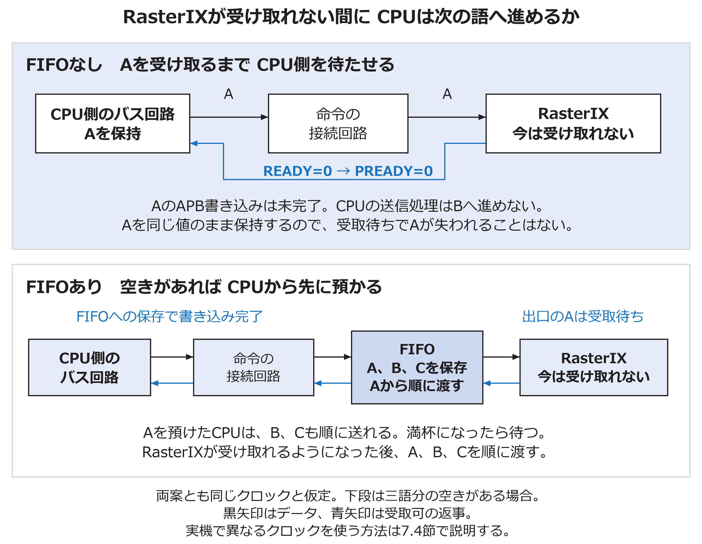

図7.3の上段では、AがRasterIXに届くまでCPU側の送信処理が待つ。下段では、AをFIFOに預けた後、CPU側はB、Cの送信へ進める。下段が示すのは、FIFOに三語分の空きがある場合である。FIFOを置いたからといって、RasterIXがAを実行する時刻そのものが早くなるとは限らない。

| 比較する構成 | RasterIXがAを受け取れない間 | AのAPB書き込みが完了する条件 |
|---|---|---|
| FIFOを置かない説明用の接続 | CPU側がAを保持し、Bの送信へは進まない | RasterIXがAを受け取る |
| FIFOを置く説明用の接続 | 空きがあればAを保存し、CPUはBへ進む | FIFOがAを保存する |

両方の接続で、受け取られる前のAを保持して失わないようにしている。違うのは、Aを保持する場所と、CPUがBへ進める時点である。APBで待たせる方法は、現在のAをCPU側に持たせ続ける。FIFOを置く方法は、Aを途中へ預かることで、RasterIXがAを受け取る前でもCPU側を次の書き込みへ進められる。このため、受け取り待ちに対応するだけならFIFOは必須ではないが、後続の語も預けたい場合にはFIFOの保存場所が役立つ。

以上は、保存場所の有無を説明するために同じクロックを仮定した例である。実機では、20 MHzのCPU側と100 MHzのRasterIX側との間で、同じ語を一度だけ渡す仕組みも必要になる。本研究では、保存とクロック間の受け渡しを行うAMDの非同期AXI4-Stream Data FIFOを使った。[AMD085](#ref_AMD085) APB側とRasterIX側で異なる接続方式をどうつなぐかは本節の後半で、二つのクロックをどう扱うかは7.4節で説明する。FIFOによってCPUの待ち時間が実際にどれだけ減ったかは、[13.10](#s_13_10)〜[13.14](#s_13_14)節の実験で確かめる。

以下では、CPUからRasterIXへ向かう命令FIFOを追う。逆方向に結果を返す応答FIFOについては、[7.4](#s_7_4)節と7.9節で説明する。

<a id="h0274"></a>
#### まず一つの時計で動く普通のFIFOを考える

保存した語をどの順番で取り出すかを、三語まで入る小さなFIFOで確かめる。ここでは入口と出口を一つのクロックで動かし、語の保存と取り出しだけを追う。実機の容量は512語であり、図7.4の三語は説明用である。

7、8、9の順に語を入れ、出口からはまだ一つも取り出していないとする。FIFOには7、8、9が残り、最初に取り出せるのは7である。次の10を入れようとしても、三語分が埋まっているので入れられない。入口は「今は受け取れない」と返し、送り手は10を持ったまま待つ。

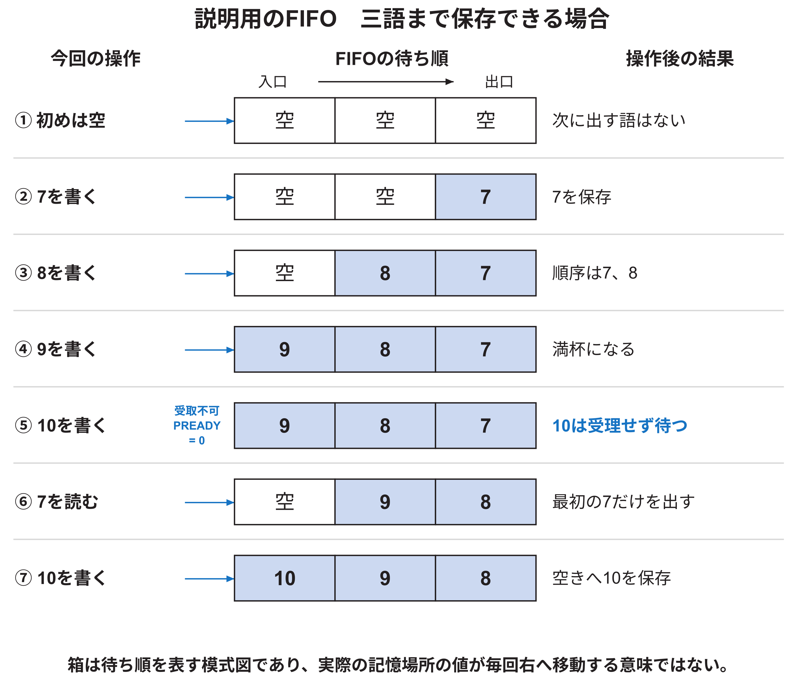

図7.4は、左から右へ語が進むように並べた待ち行列の模式図である。満杯のとき、10はFIFOの中へ入っていない。CPU側が10を保持している。7が取り出され、その空きが入口側へ伝わった後に、10を一度だけ受け取る。箱は待ち順を表し、実際のメモリ内で毎回すべての語が右へ移動することを意味しない。

実装では32 bitの語を512個保存する。データ部分は512×4 byte、すなわち2,048 byteであり、データ列の終端を示すTLASTという信号も各語と対応付けて保持する。512語は本構成で採用した容量である。その使用量と送信待ち時間の評価は13.10〜[13.14](#s_13_14)節に示す。

<a id="h0280"></a>
#### 満杯になったらCPUの一回の書き込みを完了させない

実際の接続では、FIFOの入口側がCPU側、出口側がRasterIX側につながる。RasterIXが一時的に語を受け取れなくても、FIFOに空きがあれば、CPU側は語を入れられる。FIFOの空きがなくなった時点で、CPU側も待つ。このため「RasterIXがREADYを0にした時刻」と「CPUのAPB書込みが待たされる時刻」は、FIFOに残る空きの分だけずれることがある。

追加回路rasterix_apbでは、APB書込み中のCmdValidをFIFO入口のVALIDへ、FIFO入口のCmdReadyをAPBのPREADYへ結び付ける。PREADYを0にすると、CPU側のブリッジは番地と値を保持し、そのAPB転送をまだ完了したことにしない。空きができ、CmdReadyとPREADYが1になったクロック立ち上がりに、FIFOへの受理とAPB書込みの完了を同じ一回として数える。

<a id="h0283"></a>
#### APBとAXI4-Streamは接続する場所が違う

CPU側では、番地を指定して命令口へ書き込むので、APBを使う。一方、FIFOからRasterIXへ渡すときは、順に並ぶ語を渡せばよく、一語ごとにMMIOの番地を付け直す必要はない。この側で公式RasterIXが使う方式がAXI4-Streamである。

AXI4-Streamでは、送り手が「このデータは有効」と示し、受け手が「受け取れる」と返す。両方が1であるクロック立ち上がりに、一語が渡る。有効をVALID、受取可をREADYと呼ぶ。READYが0の間、送り手はVALIDと現在の語を保つ。

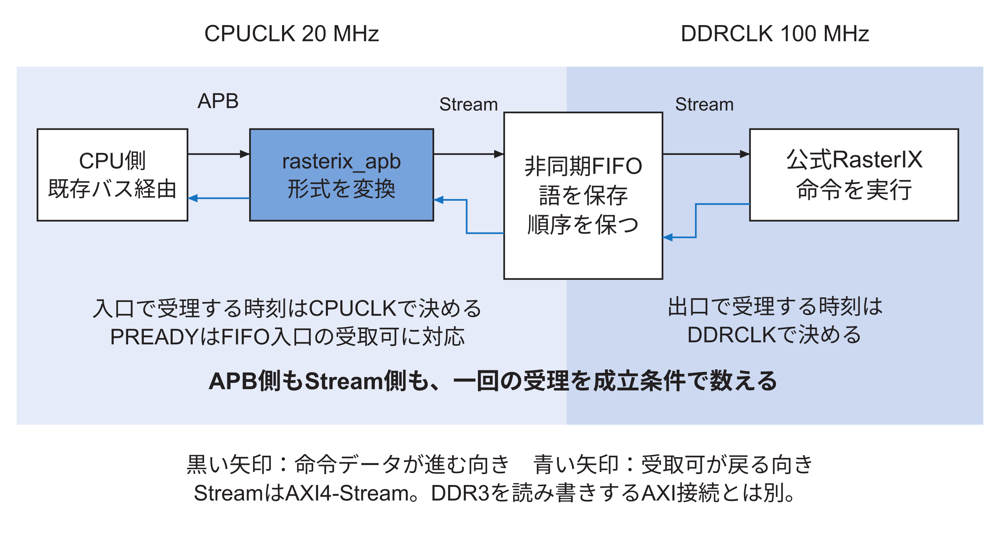

図7.5を左から追うと、CPU側のAPB書き込みをrasterix_apbが受け、FIFOの入口へAXI4-Streamの語として渡し、FIFOの出口から公式RasterIXへ渡している。rasterix_apbが変えているのは受け渡しの方式であり、ソフトウェアが作った描画命令の内容そのものではない。

黒い矢印は語が進む向き、青い矢印は受け取れるかどうかの返答である。CPUへ返すPREADYはFIFO入口の空きに対応し、RasterIXから返るREADYはFIFO出口で現在の語を受け取れるかを示す。両方とも「進めてよい」という返事だが、別の境界にある別の信号である。

<a id="h0289"></a>
#### 一語Dの移動を最初から最後まで追う

図7.6では、説明用の一語DをCPUからRasterIXまで追う。Dは一つの32 bit値を表す名前であり、それだけで完成した図形を意味するものではない。

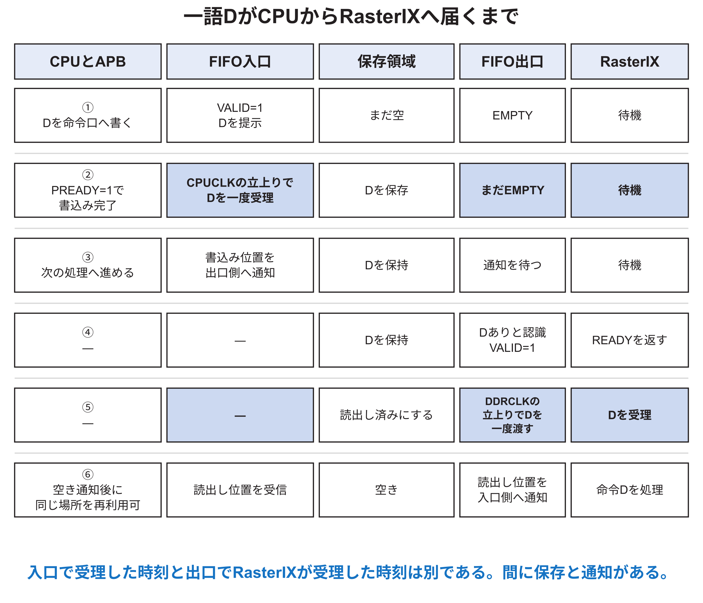

図7.6の②で、CPUCLKの立ち上がりにFIFO入口のVALIDとREADYがともに1になる。この一回でDが保存され、PREADYも1なのでCPUのAPB書込みが完了する。ここではまだRasterIXはDを受け取っていない。入口側が書込み位置を進め、その進み具合が出口側へ安全に伝わった後、出口側はDがあると認識する。

④ではFIFO出口がDとVALIDを提示する。⑤でRasterIXのREADYも1なら、DDRCLKの立ち上がりにRasterIXがDを一度受け取る。次に、出口側が読出し位置を進め、その情報が入口側へ戻る。入口側は、その場所が再利用できることを後から知る。このように、CPU側で書込みが完了する時刻と、RasterIX側が同じ語を受け取る時刻は一致しなくてよい。

<a id="h0294"></a>
#### RasterIXが受け取れる時点をREADYで確認する

RasterIXは、受け取った命令の種類と内部の処理状態に応じて、次の語を受け取れるかを決める。公式のCommandParser.vでは、リセット直後にREADYを0とし、フレームバッファ処理、ラスタライズ、テクスチャ処理などが所定の状態になったときに1とする。また、命令の種類によってWAIT_FOR_IDLEへ移る際にもREADYを0とする。[RasterIX](#ref_RasterIX)

そのため、CPUの周波数が描画回路より低くても、ある一語を書こうとする時点で受け取れるとは限らない。周波数はクロックの繰り返し回数であり、ある命令を処理して次の語を受け取れるまでの時間とは異なる。送り手は、周波数の大小から受け取り可否を推測する代わりに、READYを確認して語を渡す。

本構成では、RasterIXが受け取るまでFIFOが出口の語を保持する。さらにFIFOが満杯になれば、CPU側もAPB書き込みを待つ。これにより、CPU側とRasterIX側のそれぞれで、受け取れる時点に一語ずつ転送する。

<a id="h0298"></a>
#### 待つ間は同じ語を保ち、一回だけ数える

送りたい語をDと書く。有効が1、受取可が0の間はDを保つ。受取可も1になった立ち上がりでDが一度渡り、その後に次の語を出せる。

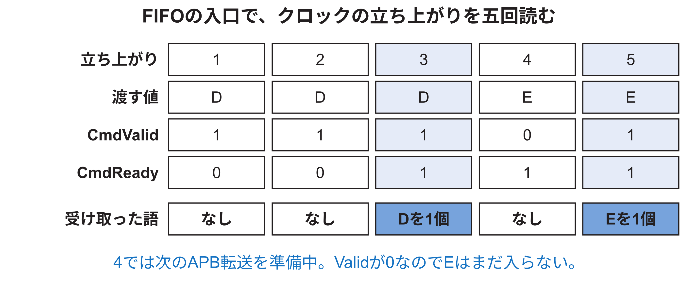

図7.7は、一語を何周期も保持しても、一回しか受け取らない場合を示す。立ち上がり1と2はVALID=1でもREADY=0なので受理はない。立ち上がり3で両方が1となり、Dを一個だけ受け取る。立ち上がり4では次のAPB転送を準備しておりVALID=0なので、READY=1でも語は増えない。信号が1だった期間の長さではなく、VALIDとREADYが同時に1だった立ち上がりを数える。

<a id="s_7_4"></a>
### 7.4 なぜ非同期FIFOなのか

命令FIFOの入口はCPU側のCPUCLK、出口はRasterIX側のDDRCLKで動く。DDRCLKという名前だが、本構成ではDDR3との接続だけでなくRasterIXもこのクロックを使う。CPUCLKは20 MHzなので50 nsごと、DDRCLKは100 MHzなので10 nsごとに立ち上がる。

CPU側は50 nsごとの立ち上がりで「一語を渡した」と数え、RasterIX側は10 nsごとの立ち上がりで「一語を受け取った」と数える。この二つを対応させる必要がある。本接続では、どちらの立ち上がりが相手のどの立ち上がりに重なるかという位置関係を使わず、各側で一語を受け渡す方法を選んだ。

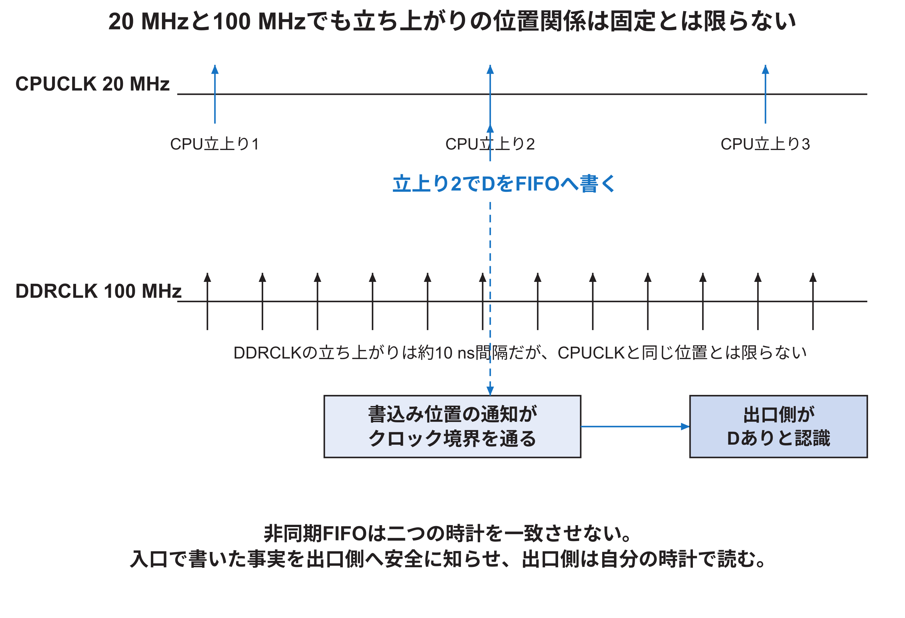

図7.8では、CPUCLKの一つの立ち上がりでDを書いた後、書込み済みであることがクロック境界を通ってDDRCLK側へ伝わる。DDRCLK側は、その通知を自分の立ち上がりで受け取った後にDを読める。非同期FIFOは二つの時計を同じ時刻へ合わせる装置ではない。各側が自分の時計で動いたまま、書込み済みと読出し済みの情報を相手側へ安全に知らせる。

<a id="h0307"></a>
#### 配線で直結するだけでは受渡し回数を決められない

CPU側がVALIDを50 nsだけ1に保つと、その間にDDRCLKの立ち上がりはおよそ五回来る。出口側がVALIDのレベルだけを見て毎回新しい語と数えれば、同じDを複数回受け取る。反対向きにDDRCLK側が10 nsだけ完了通知を出した場合、CPUCLK側の立ち上がりと立ち上がりの間に通知が始まり、終わる可能性がある。するとCPU側は通知を一度も観測できない。

両クロックは同じ基準クロックに由来するが、本接続は両側の立ち上がりの位置関係を利用せず、非同期の境界として扱う。位置関係を利用する接続では、クロック生成回路、配線遅延、リセット解除、時間制約を含めて受け渡し条件を保証する必要がある。周波数の比が整数であることだけでは、その条件は決まらない。[E6](#ref_E6)

<a id="h0310"></a>
#### 同期FIFOと非同期FIFOの違い

同期FIFOは、入口の書込みと出口の読出しを一つのクロックで管理する。入口と出口の回路も、その同じ立ち上がりを基準にVALIDとREADYを判定する。一つのクロック領域内なら、この方式でよい。

非同期FIFOは、入口の書込みを入口側のクロックで管理し、出口の読出しを出口側のクロックで管理する。本構成では、CPU側から受け取る一回はCPUCLKで決め、RasterIXへ渡す一回はDDRCLKで決める。

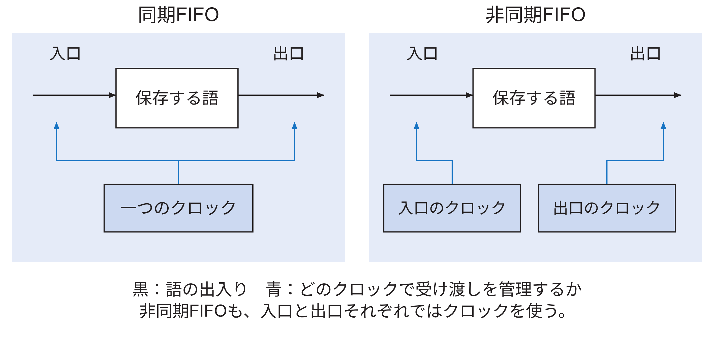

図7.9の左右で、語を保存するというFIFOの基本は同じである。違うのは、入口と出口の状態をどの時計で更新するかである。非同期FIFOでは、入口側だけで分かる書込み位置を出口側へ、出口側だけで分かる読出し位置を入口側へ伝える必要がある。

<a id="h0315"></a>
#### データ本体を保存し、進んだ位置を相手へ知らせる

一般的な非同期FIFOでは、データ本体を二つの側から使える記憶領域に置く。入口側は次に書く位置、出口側は次に読む位置をそれぞれ覚える。入口側が一語を書き終えると書込み位置を進め、その進み具合を出口側へ同期して知らせる。出口側は、書込み位置が先へ進んだことを知ると、新しく保存された語があると判断し、自分が覚えている読出し位置から読む。

反対向きには、出口側が読出し位置を入口側へ知らせる。入口側は、その通知を受けてから、読出し済みの場所を新しい語の保存に再利用する。

通知には時間がかかる。例えば入口へAを保存しても、その通知がまだ届かなければ、出口側は「まだ空」と判断して待つ。反対に、出口からAを取り出して空きができても、その通知がまだ届かなければ、入口側はその場所へ次の語を書かずに待つ。どちらも、相手の進み具合を確認できるまで操作を保留する。これにより、まだ保存されていない値を読んだり、まだ取り出していない値を上書きしたりすることを防ぐ。

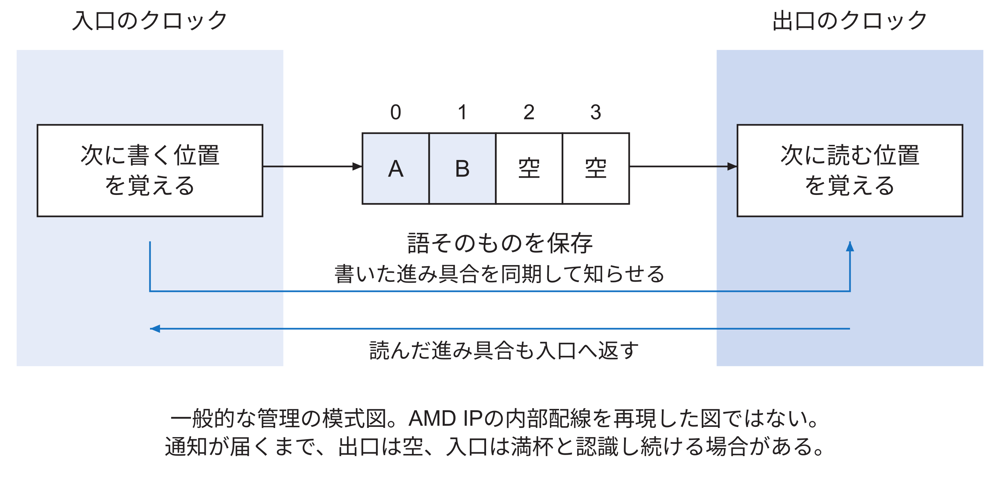

図7.10は一般的な非同期FIFOの管理方法を示す模式図であり、採用したAMD IPの内部配線図ではない。データ本体は記憶領域に置き、書込み済み・読出し済みの位置を相手側へ伝える。この役割分担によって、一語を構成する複数のbitをまとまりとして扱う。

<a id="h0321"></a>
#### 値が変わる瞬間に取り込む問題もある

レジスタの入力は、クロック立ち上がりの直前と直後に一定時間安定している必要がある。別のクロック側で値が変わる瞬間と立ち上がりが重なると、0と1のどちらとして安定するかがすぐには決まらない場合がある。これをメタステーブル状態という。クロックをまたぐ管理情報は同期用レジスタを通し、この状態が後続回路へ広がる確率を十分小さくする。[AMD085](#ref_AMD085)

32本のデータ線をそれぞれ別々に同期するだけでも、一語を守れるとは限らない。二ビットで考えると、01から10へ変わる際、右のビットだけが先に新しい0として見えれば、受け手には途中の00が現れる。00は送りたかった旧値01でも新値10でもない。

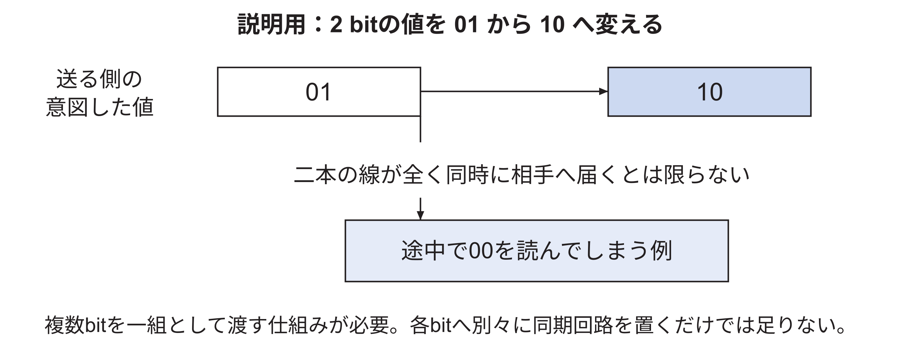

非同期FIFOは、データ本体を記憶領域へ保存し、その書込みが終わった位置を相手へ知らせることにより、一語を構成する各bitを別々の更新として扱わずに渡す。書込み位置や読出し位置を安全に知らせる一般的な方法は、[付録I.9](技術付録.md#s_I_9)〜[I.11](技術付録.md#s_I_11)でさらに説明する。

<a id="h0326"></a>
#### 命令FIFOと応答FIFOの実装

本研究は非同期FIFOの内部を自作せず、AMDのAXI4-Stream Data FIFOを使った。axiscdc.tclのIS_ACLK_ASYNC=1が、入口と出口で別々のクロックを使う指定である。TDATA_NUM_BYTES=4なので一語は32 bit、FIFO_DEPTH=512なので512語、HAS_TLAST=1なので終端情報も運ぶ。

| FIFOの実体 | 語が進む向き | 入口クロック | 出口クロック | 用途 |
|---|---|---|---|---|
| commandfifo | CPUからRasterIX | CPUCLK | DDRCLK | 命令語とTLASTを送る |
| responsefifo | RasterIXからCPU | DDRCLK | CPUCLK | RasterIXの応答語をCPUへ戻す |

rasterix.svでは、commandfifoの入口にCmdValid、CmdReady、CmdLast、CmdDataを接続し、出口を公式RasterIXの命令端子へ接続する。responsefifoは反対向きに接続し、RasterIXから返った語をCPUが読むまで保持する。二つのFIFOは同じIP設定を使うが、データの方向と用途が異なる。

<a id="h0330"></a>
#### 一語ずつ要求と応答を交わす接続

異なるクロック間で一語を渡す方法として、一語をレジスタに保持し、要求と受取確認を往復させる接続もある。送り手は「この語を受け取ってほしい」という要求を相手のクロック側へ伝える。相手は一度だけ受け取り、確認を返す。CPU側は確認が戻るまでAPB書き込みを待たせる。この方法では、現在の一語を保持する場所と通知回路を用意し、後続の語をためるFIFOは置かない。

本研究の比較実験では、要求を0から1にする、確認が1になるのを待つ、要求を0に戻す、確認も0に戻るのを待つ、という四段階を用いた。この方式を4相ハンドシェイクと呼ぶ。[第13章](#ch_13)では、この一語方式と16語・512語の非同期FIFOを、同じ20 MHzと100 MHzの構成で比べる。[7.3](#s_7_3)節の同一クロックを仮定した説明用の案とは異なり、三方式ともクロック間の受け渡しを実装した比較である。

| 方式 | 成立させるために必要な条件 | 本構成との関係 |
|---|---|---|
| 直結 | 同じクロック、または位相関係と受渡し条件を厳密に保証する | 本構成ではその保証を前提にしていない |
| 一語レジスタと要求・応答の握手 | 一語を保持し、要求と受取確認を両方向のクロックへ安全に渡す | 20 MHzと100 MHzのままで実装可能。E6で4相方式を比較した |
| 同期FIFO | 入口と出口を同じクロックで管理する | 単体では二つのクロックをつなげない。別のクロック変換回路と組み合わせるか、両側を同じクロックにする |
| 非同期FIFO | 入口と出口を別クロックで管理する | 本構成の標準方式。16語と512語を比較する |

周波数が違っていても、立ち上がり同士の位置関係を保証する同期式の変換は候補になる。[AMD085](#ref_AMD085) 本研究では、CPUCLKとMIGが出すDDRCLKの特定の位相関係に依存しない接続を評価する。一語方式とFIFO方式の違いは、通知の往復を待つ間に後続の語をどれだけ預かれるかにある。その効果と必要な回路量を比較することで、接続方式を選ぶ根拠を得る。

<a id="h0335"></a>
#### 受け渡しに用いる各機能の役割

| 機能 | 受け持つこと | 本構成での実装 |
|---|---|---|
| APBの待ち | 現在の書き込みを未完了として、番地と値を保持させる | FIFOが受け取れない間はPREADYを0にする |
| FIFOの一時保存 | 語を順序どおりに預かり、後から送り出す | 命令用と応答用に各512語を確保する |
| クロック間の受け渡し | 各側のクロックで数える転送を、一語ずつ対応付ける | 非同期FIFOの書込み・読出し管理を使う |
| AXI4-Streamの転送規則 | 有効な語を受け取り可能な立ち上がりで一度渡す | FIFOの各側でVALIDとREADYを判定する |

APBの待ちとFIFOへの保存を組み合わせると、保存できる間はCPU側を進め、保存できなくなった時点で待たせられる。非同期FIFOはこの保存に加え、入口と出口が別々のクロックで動くための管理を行う。容量512語の評価と、比較していない容量に関する制限は13.13節に示す。

<a id="s_7_5"></a>
### 7.5 どの場所へ何を書けばよいか

次の表の番地は、先頭0x10080000からの差である。例えば0x0cは、実アドレスでは0x1008000cになる。アクセスは32 bit単位にそろえる。64 bitを一度に書くという使い方を前提にしていない。

| 差 | 操作 | 意味 |
|---|---|---|
| 0x00 | 書く | 送るデータ列の途中の32 bitデータを送る |
| 0x04 | 書く | 送るデータ列の最後の32 bitデータを送る |
| 0x08 | 読む | 送信可、応答あり、処理中などの状態を読む |
| 0x0c | 読む | 識別値0x52495831を読む |
| 0x10 | 読む | 表示切り替え完了の累積回数を読む |
| 0x14 | 読む | 完了した表示先アドレスを読む |
| 0x18 | 読む | RasterIXから返った32 bitデータを取り出す |

最後だけ0x04へ書くのは、値そのものとは別に「今回送るデータはここで終わる」と知らせるためである。ここでのデータ列は、接続用プログラムのwriteDataへ渡された範囲を指す。一画面分の描画がすべて完了したという通知ではない。FPGA側は番地の違いをTLASTという信号へ変換する。命令の値の一部を勝手に書き換えて終端にしているわけではない。

このような操作口も装置のレジスタと呼ぶが、すべてが「書いた値をそのまま保存して、後で読める場所」ではない。例えば0x00への書き込みはFIFOへ一語を渡す操作であり、0x18からの読み出しは応答を一語取り出す操作である。0x10のように、回路が保持している回数を読む場所もある。番地ごとに意味を確認する必要がある。

<a id="s_7_6"></a>
### 7.6 Linuxのプログラムから書き込む

examples/rasterix/WallyBusConnector.hppが、RasterIXのライブラリとこの接続回路の間をつなぐ。起動時に/dev/memを開き、0x10080000の範囲をプログラムから操作できるように対応付ける。識別値を確認し、想定した回路がある場合だけ処理を続ける。

ライブラリがCPUのメモリに用意した32 bitデータの配列から、指定された範囲を順に読み出す。そして最後以外の要素を通常の命令口へ、最後の要素を終端用の命令口へ書く。この書き込みに対して、回路側のFIFOが満杯なら7.2〜[7.3](#s_7_3)節で説明した待ちが働く。アプリケーションが独自に満杯のたびに命令を捨てて再送する設計ではない。

レジスタを操作するコードにはvolatileとfenceを使う。前者がコンパイラの省略を、後者がCPUのアクセス順序を扱う理由は7.10節で、転送と描画の完了の違いは7.11節で説明する。

<a id="h0347"></a>
#### regsの添字を実際の操作番地へ戻す

ソースのregsは、`volatile uint32_t*`という型で扱う。uint32_t一個は32 bit、すなわち4 byteである。この型の一つ隣へ進む操作は、番地を1ではなく4だけ進める。したがって、regs[0]は先頭、regs[1]は先頭+4、regs[3]は先頭+12である。

| C++での表記 | 先頭からの差 | 回路から見た操作番地 | 使い方 |
|---|---:|---|---|
| regs[0] | 0 byte | 0x10080000 | 途中の命令語を書く |
| regs[1] | 4 byte | 0x10080004 | 最後の命令語を書く |
| regs[3] | 12 byte | 0x1008000c | 識別値を読む |
| regs[4] | 16 byte | 0x10080010 | 完了回数を読む |
| regs[6] | 24 byte | 0x10080018 | 応答の一語を読む |

Linuxのプログラムからは、通常、そのまま物理番地を指すポインタを作るだけでは装置を操作できない。mmapは、装置の物理番地の範囲を、そのプログラムが使うアドレスへ対応付けるために使う。返されたポインタの数値と0x10080000が同じとは限らないが、対応付けを通った先の装置は同じである。

ここでは回路の操作範囲が256 byteで、mmapの指定は4,096 byteになっている。前者は装置が解釈する番地の範囲、後者はOSへ要求するマッピングの長さである。マッピングを4,096 byteにしたことで、残りにも新しい装置レジスタが生まれるわけではない。表で決めた操作場所だけを使う。

図7.12は、regs[1]の書き込み先を追う例である。まず上段で、mmapが返した先頭Vと、物理アドレス0x10080000との対応を見る。次に下段で、どちらの住所にも4 byteを加える。

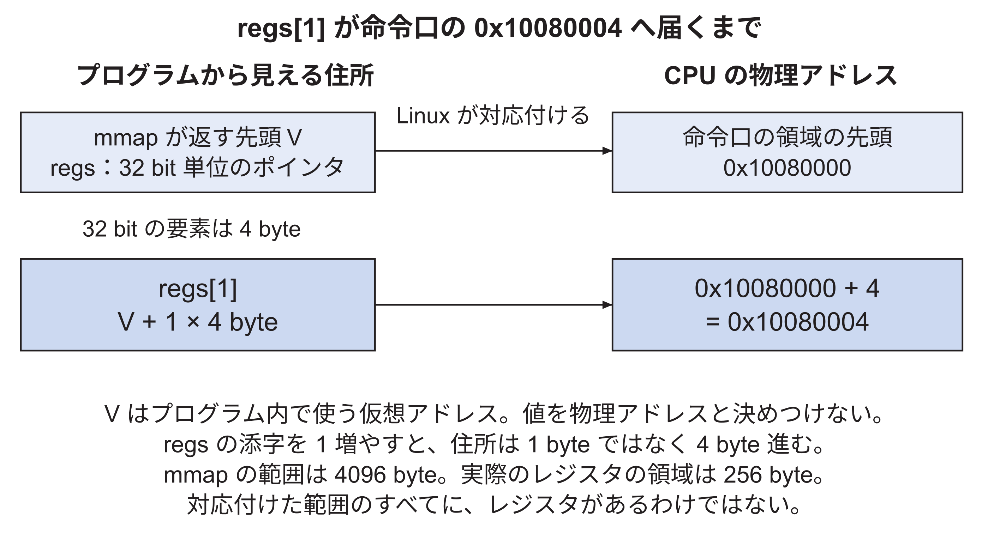

ここで添字の1は、先頭から1 byteの意味ではない。regsは32 bitを一要素とするため、要素一個分の4 byteだけ進む。この計算により、regs[1]への書き込みがCMD_LASTの物理アドレス0x10080004に対応する。


<a id="s_7_7"></a>
### 7.7 32 bitの一語を送る処理を最後まで追う

ここでは、CPUから値`0x12345678`を一語だけ渡す例を使う。この値は受け渡しを説明するための仮のデータであり、有効なRasterIXの描画命令ではない。実機へそのまま送る手順ではない。目的は、データの内容を描画命令と切り離して、どこを通るかを見ることである。

[7.6](#s_7_6)節の表で示したとおり、`regs[1]`は、対応付けた先頭の物理アドレス`0x10080000`から4 byte先の`0x10080004`を操作する。この終端用の入口へ最後の一語を書く。[Console26](#ref_Console26)

最後の一語はCMD_LASTへ書く。書き込み命令を実行したCPUは、Wallyのアドレス判定を経て、外部APBの番地を選ぶ。`uncore.sv`にあるAHB–APBブリッジが、CPU側の要求をAPBの信号へ変える。`rasterix_apb.sv`は下位8 bitのアドレスを受け取り、0x04への書き込みだと判断する。

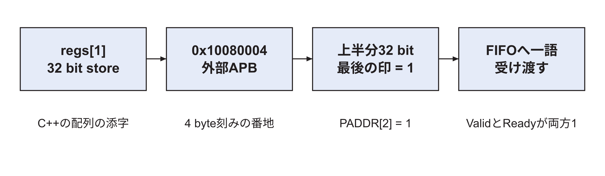

ここでAPBは64 bit幅だが、ソフトウェアは32 bitを書いている。そのため、0x04なら上半分の`PWDATA[63:32]`を選び、対応する4 byteの有効印`PSTRB[7:4]`を調べる。これを省いて常に下半分を使うと、CPUが正しい値を書いても別の32 bitを描画回路へ渡してしまう。

```systemverilog
assign WriteData = PADDR[2] ? PWDATA[63:32] : PWDATA[31:0];
assign WordWrite = PADDR[2] ? &PSTRB[7:4] : &PSTRB[3:0];
```

この二行は`rasterix_apb.sv`の64 bit構成からの抜粋である。`条件 ? A : B`は、条件が1ならA、0ならBを選ぶ。`&PSTRB[7:4]`の先頭の`&`は四つのbitをすべてANDし、全部1なら1を返す。すなわち、この実装は選んだ32 bit全体が書かれる場合に限り、命令として受け付ける。

命令口への32 bit書き込みで、`PSEL=1`、`PENABLE=1`、`PWRITE=1`がそろうと、`CmdValid`が1になる。FIFOに空きがあって`CmdReady=1`でもあるクロックの立ち上がりで、FIFOへ一語が入る。この立ち上がりではAPBの`PREADY`も1なので、CPU側のその書き込みも完了する。立ち上がりの後で新たに`PREADY`を1にして知らせる、という順番ではない。CPUの命令が完了することと、描画回路がその語の内容を実行し終わることは、ここでは別の出来事である。

<a id="s_7_8"></a>
### 7.8 受け取りを保留している間にデータを失わない条件

送信側の`Valid`は「今のデータを渡したい」、受信側の`Ready`は「今なら受け取れる」を表す。受け渡しが起こるのは、両方が1になったクロックの立ち上がりだけである。Readyが0の間もValidを1に保つことがあるが、その間に同じデータが何回も入るわけではない。

| 段階 | PSEL | PENABLE | CmdReady | PREADY | FIFOへ入った回数 |
|---|---:|---:|---:|---:|---:|
| 宛先とデータを提示 | 1 | 0 | 0 | この段階では完了判定しない | 0 |
| 受け取り待ち1 | 1 | 1 | 0 | 0 | 0 |
| 受け取り待ち2 | 1 | 1 | 0 | 0 | 0 |
| 受け取り可能 | 1 | 1 | 1 | 1 | この立ち上がりで1 |
| 転送を終え、次の要求がない | 0 | 0 | 任意 | 任意 | 合計1 |

待っている間、アドレス、書き込む値、最後の語かどうかを変えてはいけない。例えば値Aを待たせている途中で値Bへ変えると、受け側が実際に受け取れるようになった時点ではBになり、Aが消える。本実装ではCPU側のバスとブリッジが値を保持し、APB側は受け取れるまでPREADYを下げる。[Harris26](#ref_Harris26)[Console26](#ref_Console26)

最小試験`tb_apb.sv`はこの性質を見る。CmdReadyを7クロック低く保ち、その間にデータと最後の印が変わらないことを検査する。その後CmdReadyを1にし、2回の書き込みに対して受信回数がちょうど2であることを検査する。見た目の画像だけでは発見しにくい「命令が一語だけ消える」「同じ一語が二度入る」という問題を、画像を作る前に切り分ける試験である。[E1](#ref_E1)

<a id="s_7_9"></a>
### 7.9 受信レジスタを読むことにも副作用がある

普通のメモリでは、同じ番地を二度読んでも通常は同じ値を読める。一方、この回路のRESPを読むことは、受信FIFOから一語を取り出す操作である。一度取り出した語は消費され、次は次の語になる。このように、アクセスすること自体で回路の状態が変わるものを、副作用のあるI/Oという。

RESPへのアクセスでは、`RespValid=0`なら`PREADY=0`として待つ。`RespValid=1`になり、読み出し要求も有効な立ち上がりで、CPUへ返す語を確定して消費する。STATUSを読む操作はFIFOの語を消費しないので、ソフトウェアは先にSTATUSのbit 1を見てからRESPを読む。[Console26](#ref_Console26)

現在の回路は、整列した32 bitのアクセスを前提とする。CMDへ1 byteだけ書いても`WordWrite`が成立しないため命令にはならない。また未定義番地の読み出しは0を返す。接続したブリッジは常に正常応答を返す実装なので、これらをすべてソフトウェアへバスエラーとして通知する設計ではない。この制限を把握した上で、`checkRange`によって転送サイズとオフセットを4の倍数に制限している。

図7.14では、応答FIFOにA、B、Cの三語が入っていると仮定する。各行は、一回前のRESP読出しが完了した後の状態である。箱列の右端が先頭で、そこから取り出す。

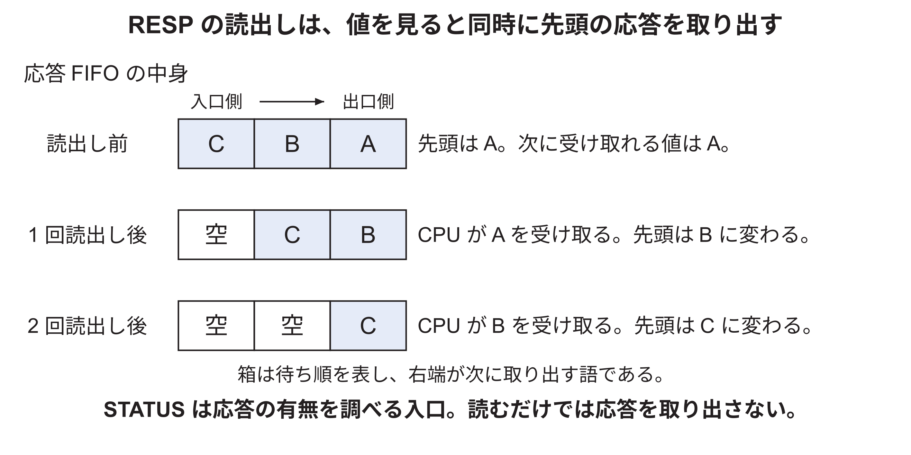

最初にRESPを読むとAを受け取り、次に同じRESPを読むとBを受け取る。最初の値を確認するためにもう一度読むつもりでも、次の応答を消費してしまう。Aを後で使うなら、最初に受け取った値をソフトウェア側の変数へ保存する。


<a id="s_7_10"></a>
### 7.10 volatileとfenceが担当する仕事

`volatile`は、装置レジスタへの読み書きを普通の変数と同じように省略しないよう、コンパイラへ伝える。例えば完了回数を繰り返し調べるとき、最初に読んだ値をずっと再利用されては、回路の変化を知ることができない。

CPUには、メモリの値のコピーを手元へ置き、次の読み書きを速くするキャッシュがある。しかし、装置の状態を読むときに以前の値をそのコピーから返せば、コンパイラが読み出し命令を残していても、装置の変化が分からない。命令FIFOへの書き込みも、キャッシュ内だけに残っては描画回路へ届かない。このため、Wally側では外部I/Oを通常のメモリと区別する。`pmachecker.sv`の`CacheableRegion`と`IdempotentRegion`が、その領域の扱いを定める。[Harris26](#ref_Harris26)[Console26](#ref_Console26)

さらに、転送の区切りで`fence iorw, iorw`を実行し、I/Oとメモリのアクセス順序をそろえる。volatile、領域の属性、fenceは、それぞれ「コンパイラがアクセスを残す」「CPUがI/Oに合う扱いをする」「必要な順序を守る」という別の条件を担当する。どれか一つの名前を書けば、残りも自動で満たされるわけではない。

<a id="s_7_11"></a>
### 7.11 書き込みと描画と表示の完了を区別する

`writeData`が命令列を送り終えたとき、各語は受信側のFIFOへ渡っている。しかし、RasterIXがまだFIFOの語を実行していない場合がある。一語が渡っただけでは後続の語が足りず、図形を描き始められない場合もある。APBのPREADYはその転送の返事であり、一画面の完成を表すFrameDoneではない。

`blockUntilTransferIsComplete`も、この実装ではMMIO転送の区切りを扱う関数である。volatileやfenceも、画素を何個処理し終えたかを数える機能ではない。命令の準備、転送、画素の保存、表示先の切り替えは、それぞれ完了条件を持つ。

特に古い表示領域へ次の画像を描くには、表示側がその領域を使い終えたことを確かめる必要がある。本実装では`frameCount`と`waitForFrame`を使い、切り替え完了回数が前の値から変わるまで待つ。[第10章](#ch_10)では、その回数を増やしてよい条件を、メモリの要求と返事から説明する。

図7.15は、完了という言葉の対象を三つに分けたものである。左の箱で何が終わったのかを読み、右の箱でそれを確かめる条件を見る。三行を等しい長さの時間として読まない。

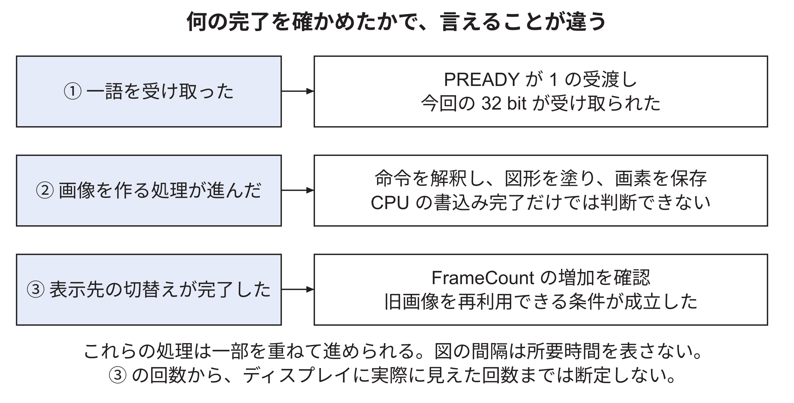

一語を受け取る条件を満たしても、画像全体ができたとは限らない。また、FrameCountの増加は、本実装が定めた表示切り替えの完了条件を確認した結果である。実際の映像を確かめる試験は、それとは別に必要になる。


<a id="ch_8"></a>
## 第8章 公式RasterIXを組み込む

[第7章](#ch_7)で示した命令の経路に加え、RasterIXが画像を保存するメモリ接続と、ソフトウェアの設定を用意する。本章では、ゲーム機の標準構成で利用する公式設計と、本研究でその外側へ設ける接続部分を対応付ける。

<a id="s_8_1"></a>
### 8.1 サブモジュールで版を固定する

RasterIXはaddins/rasterixにGitサブモジュールとして置く。サブモジュールは、別のリポジトリを特定の版で参照する仕組みである。ここでは公式のToNi3141/RasterIXを参照し、その内部に本研究用の変更を加えない。親のリポジトリには、どの版を使うかという記録を残す。

参照する版は4.2節の基準版と接続比較版で区別する。サブモジュールに記録したコミットを取得すれば、公式リポジトリの開発が進んでも同じ入力ソースを用意できる。設定や結果は、その固定した版に対応付ける。

<a id="s_8_2"></a>
### 8.2 RasterIX_IFを使う意味

例えば、黒い背景の上へ白いボールを重ねる場合を考える。まず画素を黒にし、その後、ボールの内側だけ白へ変える。描画回路は、こうして途中まで作った色を保存しながら、次の図形を重ねる。この描画途中の保存場所を、どこに置くかという選択がIFとEFの違いに関係する。

RasterIXには、作業中の画素をFPGA内部のメモリで扱うIFと、外部メモリで扱うEFという構成がある。[RasterIX](#ref_RasterIX) ここでいう内部と外部は、FPGAチップの内側と外側を指す。

本研究が使うのはRasterIX_IFである。IFの内部作業領域はFPGA内のBRAMを利用する。完成した画像をディスプレイへ送るための保存先は、これとは別に基板上のDDR3へ置く。「IFだから画像を一切DDR3に置かない」という構成ではない。

本構成の内部作業領域は65,536画素分であり、横640、縦480の全307,200画素を一度には置けない。そこで画像を五本の帯に分け、一つの帯を内部で扱ってからDDR3へ保存し、同じ作業領域を次の帯に使う。[第9章](#ch_9)では、実際に一帯61,440画素になる計算を行う。

この構成で二次元ゲームの動作を確認した。IFとEFの比較は行っていないため、IFが最善とは結論しない。IFの内部作業領域を65,536画素分から131,072画素分へ増やした比較は13.19節に示す。製品を再現する場合は、IFと65,536画素分の設定にそろえる。

<a id="s_8_3"></a>
### 8.3 回路とソフトウェアでそろえる値

同じ作業領域を、回路が65,536画素だと思い、ソフトウェアが別の大きさだと思って使うと、帯の分け方が一致しない。次の値は、回路側のパラメータとソフトウェア側のCMake設定で対応させる。

| 決めること | 回路側 | ソフトウェア側 |
|---|---|---|
| 作業領域の画素数 | FRAMEBUFFER_SIZE_IN_PIXEL_LG = 16 | RIX_CORE_FRAMEBUFFER_SIZE_IN_PIXEL_LG = 16 |
| テクスチャ処理部の個数 | TMU_COUNT = 1 | RIX_CORE_TMU_COUNT = 1 |
| ゲーム画面 | 表示回路640×480 | MAX_DISPLAY_WIDTH = 640、HEIGHT = 480 |
| 外部メモリの利用範囲 | DDR3へ接続 | GRAM_MEMORY_LOCと各画像のオフセット |

LGの値16は、16画素という意味ではない。2の16乗、すなわち65,536画素を表す。TMUは、画像の模様を参照して図形に貼る処理を担当する部分である。二次元ゲームでも文字用の模様を使うため、テクスチャの処理を利用する。

図8.1では、上段の二つの箱が同じ容量を表すことを確認し、下段でその容量に収まる帯を作る。640×480の画面を高さ96の帯五本に分けると、一帯は61,440画素になる。

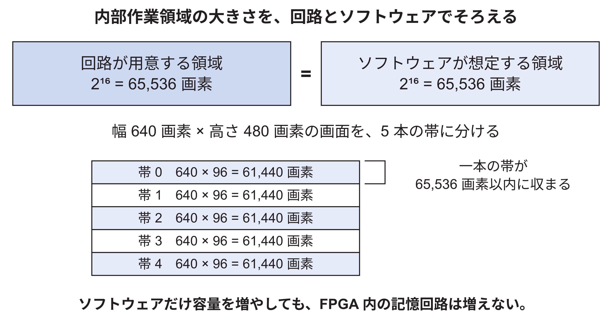

回路側のFRAMEBUFFER_SIZE_IN_PIXEL_LGと、ソフトウェア側のRIX_CORE_FRAMEBUFFER_SIZE_IN_PIXEL_LGをともに16とすることで、65,536画素という約束をそろえる。二つの値は別のファイルにあるため、片方の編集だけで両方が自動的に変わるとは考えない。帯の順次処理は9.7節で詳しく追う。

テクスチャを転送する際のページサイズも、両側でそろえる。ページは、画像データを分けて扱う際の一単位である。接続比較版では回路側が2,048 byteなので、ソフトウェア側にも`RIX_CORE_TEXTURE_PAGE_SIZE=2048`を指定した。ソフトウェアの既定値4,096 byteを使うと文字画像が欠けたためである。このページサイズは、上で説明した画素用作業領域の容量とは別の設定である。設定の一致による画像の変化は13.15節と[技術付録29.12節](技術付録.md#s_29_12)に示す。


<a id="s_8_4"></a>
### 8.4 既存のWallyへ外部I/Oを通す

RasterIXを使う構成と使わない構成でWally本体を共用できるよう、外部I/Oの有効・無効を選ぶEXT_IO_SUPPORTED、先頭番地のEXT_IO_BASE、範囲のEXT_IO_RANGEを用意した。名前は既存のEXT_MEMなどに合わせ、特定の実験機器ではなく回路の役割を表す。

ただし、パラメータへ番地を書くだけでは外へ信号は届かない。まずその番地を外部I/Oとして判定し、次に要求と返事の信号を上位の回路へ通し、最後にNexys Video側で命令接続部へつなぐ。図8.2は、その作業で読むファイルを順に示す。

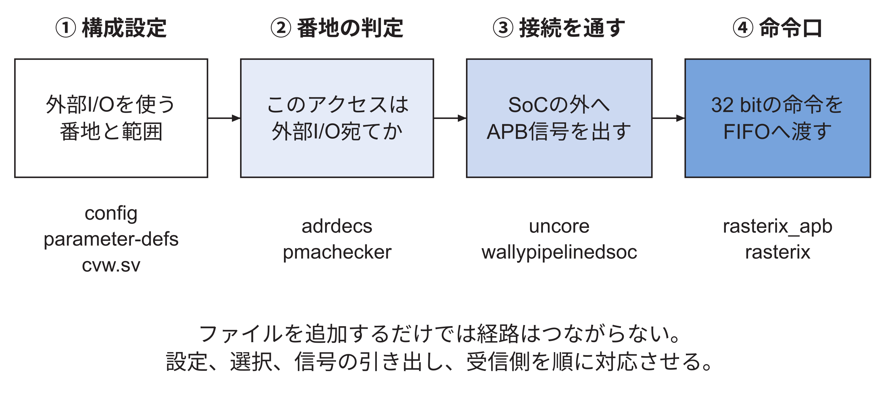

`src/mmu/adrdecs.sv`は番地の選択を、`pmachecker.sv`はその領域で許すアクセスの性質を扱う。周辺部の`src/uncore/uncore.sv`から最上位の`wallypipelinedsoc.sv`を通してAPB信号を外へ出し、`fpgaTopNexysVideo.sv`でRasterIXとの接続回路へつなぐ。図はファイルの担当を示しており、全信号を載せた配線図ではない。

番地判定と信号の通り道を用意したうえで、基板用の最上位回路の中に接続回路を組み込み、その端子を結ぶ。さらに生成時の設定を有効にすると、CPUの操作が命令口へ届く。このように、ある回路を別の回路の部品として組み込み、端子を結ぶ記述をインスタンス化と呼ぶ。[付録G](技術付録.md#ch_G)ではこの順に、実際に書き加える内容を追う。

<a id="s_8_5"></a>
### 8.5 DDR3への要求をまとめる

`fpga/generator/rasterixmem.tcl`は、CPU、RasterIX、表示回路がDDR3を共有する接続を生成する。CPUとRasterIXの内部経路は64 bit、表示側は32 bitで、クロックも異なる。接続用IPが幅とクロックの違いを扱う。各ポートの具体的な対応は8.7節に示す。

共有するときは、互いに待って進めなくなる条件も考える。CPUは次の命令やデータを渡すためにDDR3を読む。一方、RasterIXがDDR3との転送を途中まで始めたまま、CPUからの残りのデータを待つ場合を考える。その転送がメモリ側を占有してCPUの読み出しを止めると、CPUもRasterIXも相手が進むまで進めない。図8.3の矢印はデータの流れではなく、この待ちの依存関係を表す。

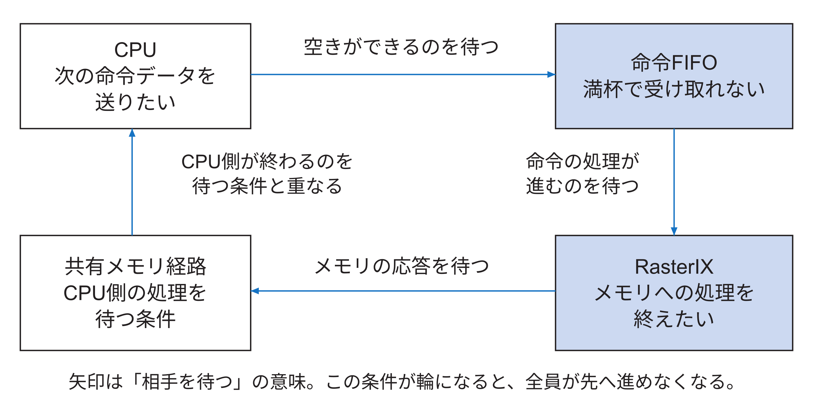

この条件への対処として、RasterIXのAXIメモリ端子とSmartConnectの間にAXI Data FIFOを置く。Tcl中の名前は`gpubuffer`で、読み書き両方を512語とし、バースト単位の保存を有効にする。バーストとは、連続する複数のデータを一まとまりとして転送する方法である。[Console26](#ref_Console26)

共有DDR3へ転送を進める前に、そのまとまりをFIFOへ蓄える。これにより、CPUから追加データが来るのを待つ都合を、進行中の共有メモリ転送へ持ち込みにくくする。読み出し側にも返ってきたデータを保存する設定がある。図8.4は、この待ち関係をCPU、GPU、メモリの間でたどり直した図である。

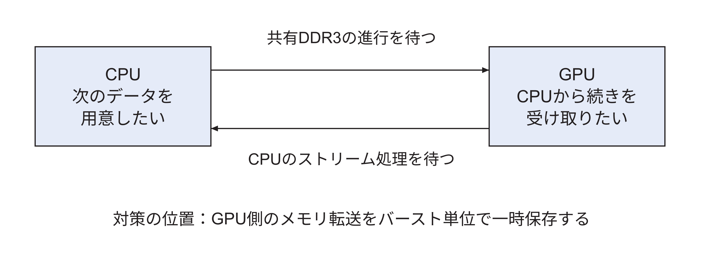

両図は設計で避けたい条件の説明であり、任意のAXI転送で必ず停止するという実測結果ではない。Tclにもこの設計意図をコメントで記した。命令FIFOはAPBとRasterIXの間で語の順序とクロックの違いを扱い、ここでのメモリ用FIFOは共有DDR3へ渡す転送のまとまりを保存する。置く場所と目的が異なるため、単に「FIFOを増やすと速い」と一般化しない。

<a id="s_8_6"></a>
### 8.6 ビルドに必要な接続も追加する

SystemVerilogで書いた回路のファイルを保存しただけでは、Vivadoが自動的に使うとは限らない。fpga/generator/wally.tclへソースとIPを取り込む処理を加え、Makefileにnexysvideo-rasterixの生成対象を用意する。描画を使わないnexysvideoも残す。

表示クロックの生成、HDMI OUTの端子制約、Linuxの予約メモリ、C++のビルド設定もそろえる。本研究の統合は、回路だけ、ソフトウェアだけという一方の変更ではない。同じ画面サイズ、メモリ位置、データ形式を、複数の層で一致させる作業である。

[付録A](技術付録.md#ch_A)の変更対応表では、39ファイルからなるRasterIX導入コミットを役割別に分けている。公式RasterIXの内部変更ではなく、呼び出す側・接続する側・生成する側の変更として追える。


<a id="s_8_7"></a>
### 8.7 CPUの命令ポートとGPUのメモリポートを混同しない

RasterIXへ入る命令の経路と、RasterIXが画像を保存する経路は別である。命令の経路ではCPUが送り手であり、APB、命令FIFO、RasterIXの順に進む。画像メモリの経路ではRasterIX自身が要求を出し、共有接続回路を通じてDDR3を読み書きする。表示回路も、自分でDDR3へ画像の読み出しを要求する。

例えばCPUが「長方形を塗る」という指定を送った後、長方形の中の各画素を書き込む要求を出すのは描画回路である。CPUが各画素の書き込みを一回ずつ代行しているわけではない。図8.5は、命令と画像を別の矢印で示す。[Console26](#ref_Console26)

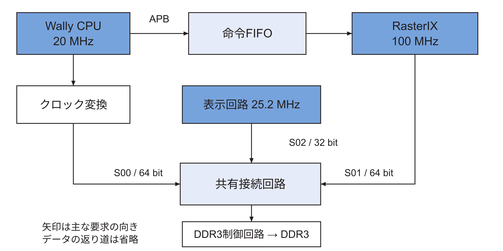

`rasterixmem.tcl`はSmartConnectの入力を三つ、出力を一つに設定する。S00にはCPU側、S01にはRasterIX側、S02には表示側が入る。ここでS00などのSは、この接続回路から見た入力側ポート名である。CPUや描画器が要求を発行する側であることとは矛盾しない。部品の内側から見た入出力なのか、システム全体で見た役割なのかを区別する。

| ポート | 要求元 | データ幅 | 接続位置でのクロック |
|---|---|---:|---:|
| S00_AXI | クロック変換後のCPU側 | 64 bit | 100 MHz |
| S01_AXI | RasterIX | 64 bit | 100 MHz |
| S02_AXI | 表示回路 | 32 bit | 25.2 MHz |
| M00_AXI | DDR3制御回路へ送る側 | 64 bit | 100 MHz |

CPU本体は20 MHzである。表の100 MHzは、CPU側要求がクロック変換を通過した後の接続位置の値であり、CPUが100 MHzへ高速化されたという意味ではない。

<a id="s_8_8"></a>
### 8.8 元のRasterIXを書き換えずに組み込む境界

公式RasterIXの外側に、回路側では`rasterix_apb.sv`によるAPBと命令ストリームの変換、および`rasterixdisplay.sv`による画面切り替えの変換を置く。ソフトウェア側は`WallyBusConnector`が公式の`IBusConnector`を実装する。[RasterIX](#ref_RasterIX)[Console26](#ref_Console26)

IBusConnectorは、公式ライブラリへ「送る」「読む」「送信用の領域を借りる」という操作を提供し、転送方法を実装側へ任せる。本研究ではWallyのAPBへ32 bitずつ書くため、公式内部へWally専用の番地を埋め込まずに済む。`RasterIX_IF #(...)`による設定も公式の入口である。公式版を更新するときは、接続の約束や既定値の変更を確認する。

図8.6は、描画命令がソフトウェアから回路へ渡る経路に絞った図である。上段では左から右へ進み、MMIOの書き込みを経て下段へ入り、下段では左側のRasterIX_IFへ命令が届く。

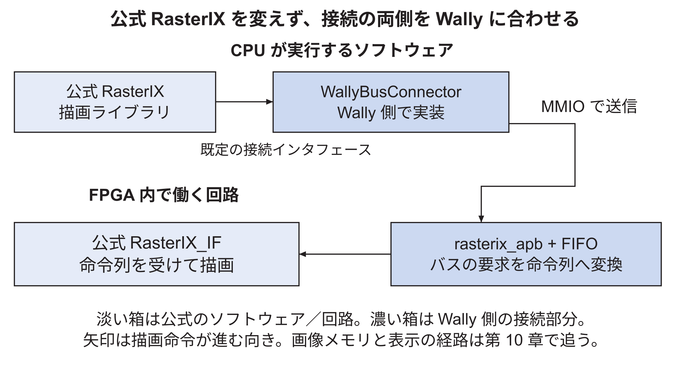

公式ライブラリが要求する接続の仕事をWallyBusConnectorが引き受け、Wallyのバス要求をrasterix_apbとFIFOが描画回路の受け取れる形へ渡す。公式部分と接続部分を分けることで、何を本研究で設計したかを確認できる。この図には、応答、画像メモリ、表示の全配線を詰め込んでいない。それらは[第7章](#ch_7)および[第10章](#ch_10)の図と対応させる。


<a id="ch_9"></a>
## 第9章 図形の指定から画素を作るまで

[第7章](#ch_7)では命令を失わずに渡す方法、[第8章](#ch_8)では描画回路とメモリをつなぐ方法を説明した。本章では、その命令が何のために作られるのかを、四角形一個で追う。最初は位置と色だけを扱い、次に文字の模様、最後に画像を帯へ分ける処理へ進む。三次元の物体や視点の計算は、この説明の前提にしない。

<a id="s_9_1"></a>
### 9.1 画面の位置を数で表す

[第2章](#ch_2)では8×8の白いボールを使った。ここでは幅と高さを見分けやすくするため、説明用に幅20、高さ10の赤い四角形を使う。座標の読み方は同じで、左上を(100, 200)とする。画面の横位置は右ほど大きく、縦位置は下ほど大きくなるように、ゲーム側で描画の座標系を設定している。

四角形を指定する情報は、左上の横位置x、縦位置y、幅w、高さh、色である。Rect{100, 200, 20, 10, 0xff0000}という例なら、それぞれ100、200、20、10、赤に対応する。xだけを103へ変えれば右へ3移り、幅だけを40へ変えれば左端はそのままで右端が20先へ延びる。

まず「四角形の端がどこか」と「どの画素を塗るか」を二段階で考える。左端100から幅20だけ進んだ右端は120である。100、101、…、119という20個の画素を塗ることと、図形の右端を120という座標で表すことは矛盾しない。最後に塗る画素119のマスは、座標119から120までの幅を占めるためである。[9.5](#s_9_5)節では、この関係をマスの中心まで描いた図で確認する。

<a id="s_9_2"></a>
### 9.2 四角形を四つの頂点で渡す

描画ライブラリへは、四角形の四つの角を渡す。左上を(x, y)、幅と高さをw、hとすると、四つの角は次のようになる。

| 角 | 座標 | 数値例 |
|---|---|---|
| 左上 | (x, y) | (100, 200) |
| 右上 | (x + w, y) | (120, 200) |
| 右下 | (x + w, y + h) | (120, 210) |
| 左下 | (x, y + h) | (100, 210) |

BreakoutRenderer.hppのquad関数は、この四つの位置をglVertex2fで順に渡す。glBegin(GL_QUADS)からglEnd()までの指定により、ライブラリは四つの頂点を一つの四角形として扱う。点を四つ置くだけで点同士の関係が伝わるのではなく、図形の種類も指定している。

RasterIXの描画処理は三角形を扱うため、四角形を必要な三角形へ組み立てる。四角形の対角線を一本引けば、二つの三角形になる。例えば左上・右上・右下を結ぶ三角形と、左上・右下・左下を結ぶ三角形で、同じ四角形を覆える。これは平面の図形を塗る手段であり、三次元ゲームの計算を導入することではない。


図9.1では、左の四角形を、右で二つの三角形に分けた。

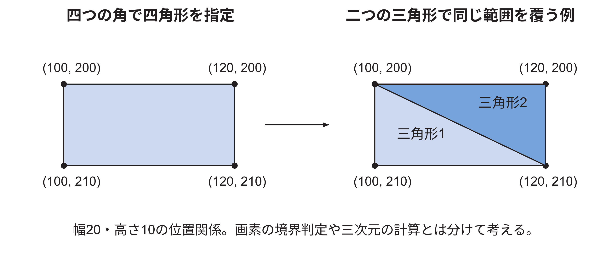

右の二つの三角形は同じ四角形を隙間なく覆う。色の濃さは二つの三角形を区別するためであり、実際のゲームで指定した色とは無関係である。対角線の上にも画素の中心が来ることがある。その画素を両方の三角形で重ねて塗ったり、両方とも塗らずに穴を作ったりしないために、境界をどちらの三角形が担当するかという規則が必要になる。[9.5](#s_9_5)節で、画素の中心と境界の関係を説明する。

<a id="s_9_3"></a>
### 9.3 APIを呼ぶと、すぐ画素が変わるのか

プログラムの中で関数を呼ぶと、CPUはその関数の処理へ進み、処理を終えると呼出し元へ戻る。例えば「現在の色を赤にする」という関数の処理が、ライブラリ内部の色の値を赤に書き換えるだけなら、その時点で画面全体が赤くなるわけではない。その色を使う図形を後で指定し、描画命令を回路へ送るところまで進める必要がある。

APIは、プログラムから機能を呼び出すための入口である。本ゲームのglColor4ubやglVertex2fは、RasterIXのソフトウェアライブラリにある関数を呼ぶ入口になる。呼び出すプログラムも、その関数の中身も、WallyのCPUが実行する。

例えばglColor4ubで赤を選ぶと、ライブラリは「これから渡される頂点の色は赤」という設定を覚える。次にglVertex2fで位置(100, 200)を渡すと、「位置は(100, 200)、色は赤」という組の情報を、その頂点のデータとして保持する。

glBegin(GL_QUADS)は、これからの頂点を四個ずつ四角形として扱う指定である。glEndは、この一組の図形の指定を終える関数である。ライブラリは、指定された頂点から三角形を組み立て、設定した座標変換を適用し、回路向けの命令を作る。glEndまで呼んだことは、画面への表示完了という意味ではない。

位置、図形の種類、色は、どれか一つだけでは描く内容を決められない。例えば同じ四頂点でも、点を描く指定なら角の点、四角形を描く指定なら囲まれた面になる。色を青へ変えれば、同じ場所でも青くなる。このように別々に渡した設定を一つの図形へ対応させる仕事が、CPU側の描画準備に含まれる。

<a id="h0457"></a>
#### 四つの頂点を渡す短い例を一行ずつ読む

次は、本ゲームで利用するAPIの呼び方を示す例である。単独で起動できるプログラムではなく、座標系や回路の初期化が済んでいる場面を取り出している。

```cpp
glColor4ub(255, 0, 0, 255);
glBegin(GL_QUADS);
glVertex2f(100, 200);
glVertex2f(120, 200);
glVertex2f(120, 210);
glVertex2f(100, 210);
glEnd();
```

一行目は赤、緑、青、不透明度を順に指定する。赤255、緑0、青0で赤色を選び、最後の255で完全に不透明にする。二行目は、これから四角形の頂点を渡すと知らせる。次の四行が四つの角で、最後の行がその組の指定を終える。

この七行はCPUで実行される。ライブラリは、例えば「今の色は赤」という設定を覚え、その後の頂点へ対応させる。最初の頂点を受け取っただけでは、この四角形の残り三つの角はまだそろっていない。頂点のまとまりを作り、座標変換や図形の組み立てを行って、回路用の命令を準備する。

ここでのCPUの仕事は、画面の307,200点へ一つずつ直接色を書く処理とは違う。一方、「APIを七行呼ぶだけだから計算量も七命令だけ」という意味でもない。関数の中では複数の処理が実行される。[第13章](#ch_13)で測る描画準備には、その内側の仕事も含まれる。

<a id="h0463"></a>
#### 設定とデータを組み合わせるという表現の中身

例えば、先に赤を選び、その後に位置(100, 200)を渡すと、ライブラリは「位置が(100, 200)で、色が赤である頂点」として扱う。次に青を選んで位置(120, 200)を渡せば、その頂点は青になる。同じ色設定をすべての頂点へ使いたければ、赤を選んだ後、色を変えずに四つの位置を渡す。

座標変換も、入力した数字を何に対応させるかという計算である。本ゲームは、画面の左上を(0, 0)、右方向をxの正、下方向をyの正として図形を指定する。ライブラリの計算にも、この座標と描画先との対応を設定しておく。したがって、設定も含めて初めて、指定した(100, 200)が意図した画面位置へ対応する。四角形の指定値だけを抜き出し、別の座標設定で実行すると、同じ位置になるとは限らない。

最後に、ライブラリは計算した図形を描画回路へ渡す数値列にする。関数名を文字列で送るのではなく、回路側が命令の種類や後続データを読み取れる並びにする。次節では、この数値列を保存して送る部分を扱う。

この対応から、glColor4ubの引数を変えると図形の色が変わり、glVertex2fの引数を変えると図形の位置や形が変わることが分かる。APIを呼んで数値列を準備するところまでは、CPUがライブラリのプログラムを実行する。その数値列を命令口へ送ると、受け取った描画回路が命令の処理を進める。

図9.2では、先ほどの七行のAPI呼出しで何が用意されるかを上から追う。「赤」という設定と四つの位置が、③で位置と色の組になる。その組を使い、④で図形を組み立て、⑤で回路へ渡す形式を用意する。

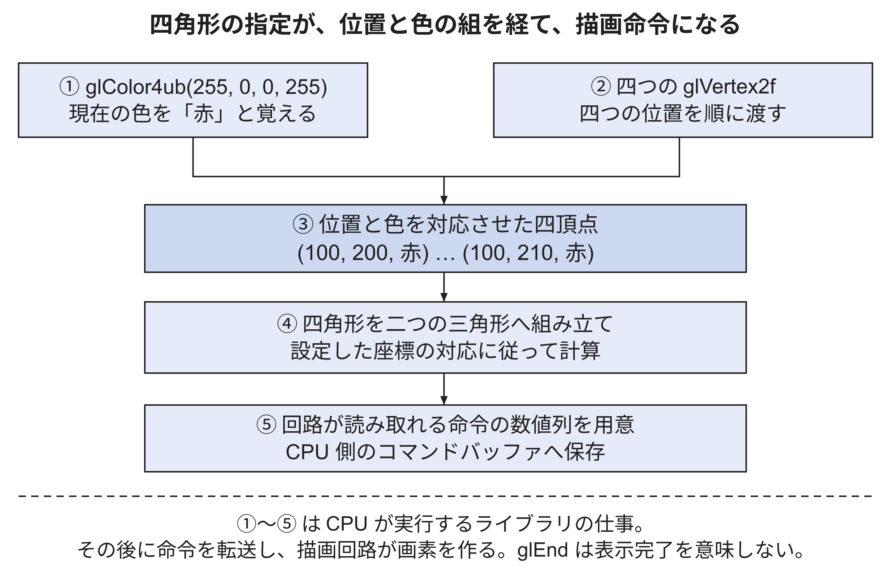

③の「(100, 200, 赤)」は、「最初の頂点の位置は横100、縦200で、その頂点の色は赤」と読む。色の設定を青へ変えてから同じ位置を渡せば、位置は同じまま色だけが青になる。⑤で用意するのは完成画像の画素配列ではなく、回路に画像を作らせるための数値列である。次の9.4節では、この数値列を置くコマンドバッファから回路へ渡すまでを追う。


<a id="s_9_4"></a>
### 9.4 コマンドバッファとは何か

ライブラリは、CPUが扱う四角形の情報を、そのままC++の関数呼び出しとして回路へ送れない。描画回路はC++の関数を実行するCPUではないため、受け取る命令の種類と、後に続く数値の並びをあらかじめ決めている。ライブラリはその約束に合わせて、「設定を変える」「三角形を描く」「画素を保存する」などの命令を作る。

作った命令をCPU側のメモリへ順に並べ、転送まで保持する場所がコマンドバッファである。ここへ入っているのは、画面の白や黒を307,200個並べた完成画像ではない。完成画像を作るための手順を表す数値列である。命令には順序があり、例えばある図形で使う設定が、その図形を処理するときに有効になるように並べる必要がある。

WallyBusConnectorは、この数値列から32 bitずつ取り出し、MMIOの命令口へ書く。これは2.3節の「保存した命令をCPUが読み出して送る」処理である。[第7章](#ch_7)のFIFOはその後にある小さな待ち場所である。したがって、コマンドバッファとFIFOは両方とも命令を保持するが、別の場所で働く。前者はCPUのプログラムが使う通常のメモリ領域にあり、本ボードではDDR3がその保存を担う。後者はCPUから回路へ渡す途中のFPGA内の回路である。[5.3](#s_5_3)節で示した描画回路用の32 MiBの予約領域と、CPU側のコマンドバッファも、別の領域である。

この方式は公式RasterIXのソフトウェアと回路が持つ接続の約束を利用している。Wally側がそれに合わせることで、公式RasterIXを書き換えずに組み込める。CPUが一語ずつ書く代わりに、転送専用回路がメモリから命令列を読むDMAという方法もある。製品の標準構成はMMIOによるCPU転送を使い、DMAは別の実験構成で比較した。その動作確認と性能の結果を13.17節に示す。

<a id="s_9_5"></a>
### 9.5 文字が欠けた問題と半画素の位置

画素を塗るときは、画素のどの位置を代表点として図形の内外を判定するかが関わる。幅1の画素を、横方向の区間0〜1を占める小さな四角と考えると、その中心は0.5である。整数0は、その四角の左端になる。端と中心を同じものとして扱うと、図形の境界で選ばれる画素が変わる。

基準版のRasterIXの整数位置での判定と、アプリケーション側の画素中心の対応を合わせるため、BreakoutRenderer.hppにglTranslatef(-0.5f, 0.5f, 0.0f)を置いている。x方向は-0.5、y方向は+0.5である。アプリケーションのyを下向きにした座標変換も含めた符号なので、両方を同じ符号へ置き換える修正ではない。

文字は細い線や透明部分を持つため、このずれが目立つ。文字の線を描くはずの場所で、文字の模様から隣の透明な点を選ぶと、そこには背景が残り、線の一部が欠けて見える。見た目だけで「だいたい文字に見える」と判断せず、期待する画素と読み戻した画素を比べた。ここは処理速度の改善とは別の、画像の正しさの修正である。


0.5という値がどこから出るかを、図9.3で横方向だけに注目して示す。

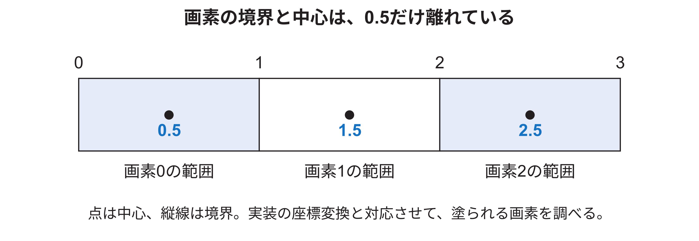

例えば画素0が0から1までの区間に対応すると、その中心は0.5である。境界の0と中心の0.5を同じ位置として扱うと、図形を一つの画素へ対応させるときにずれが生じる。青い数値は中心の座標、黒い数値は境界の座標である。実装では縦方向の向きも変えているため、横と縦の補正の符号を含めてソースと照らし合わせる。

<a id="h0483"></a>
#### 画素の番号と図形の境界を別々に読む

横方向だけを考え、画素番号0、1、2があるとする。画素0の範囲を0以上1以下の幅として描けば、中心は0.5になる。画素1の中心は1.5、画素2の中心は2.5である。「画素番号1」と「境界の座標1」は同じ対象を指していない。

幅1の模様を貼るとき、どの位置を代表点として模様から色を取るかが一つ隣へずれると、白い点を選びたい場所で透明な点を選ぶことがある。大きな一色の四角形では一部のずれが目立たなくても、細い線でできた文字では欠けとして見えやすい。

この補正は、使用したRasterIXの座標計算とアプリの設定を合わせるためのものである。すべての描画回路で同じ半画素補正を入れるという規則ではない。別の描画回路へ移植するときは、整数の境界、代表点、テクスチャ参照の対応を確認する。本稿では、補正後の画像を期待画像と比較した結果を根拠にする。

<a id="h0487"></a>
#### 小さな画像で「内側の画素」を実際に選ぶ

説明用に、横6個、縦4個のマスを並べる。各マスの幅と高さを1とし、左上の境界を(0, 0)とする。画素番号(1, 1)のマスは、xが1から2、yが1から2の間を占め、その中心は(1.5, 1.5)である。番号(1, 1)と中心(1.5, 1.5)は、同じマスに関する二つの位置の表し方である。

ここに、左上(1, 1)、右下(4, 3)の四角形を置く。この説明ではマスの中心が四角形の内側にあれば塗るとする。横方向では中心1.5、2.5、3.5の三つ、縦方向では1.5、2.5の二つが入るので、塗るマスは3×2=6個になる。右端の境界4に対し、画素番号4の中心は4.5なので、そこは外側である。

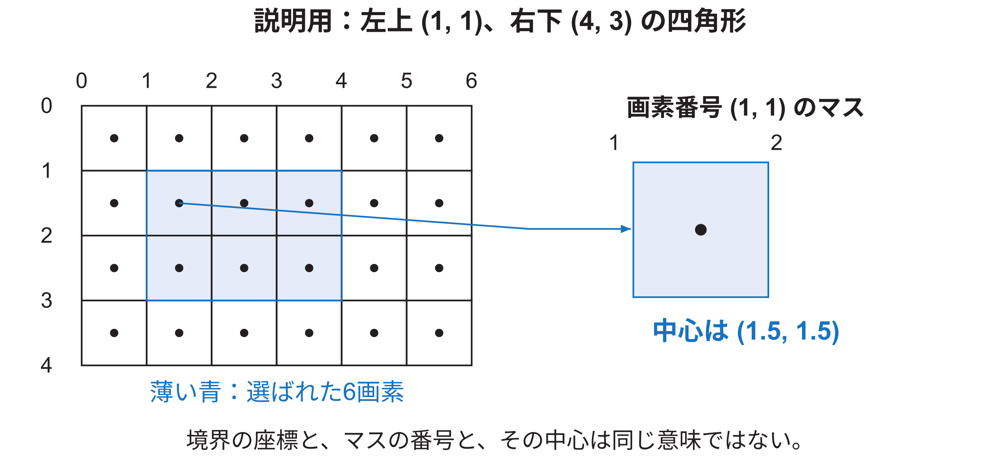

図9.4の黒い点は判定に使う中心、薄い青の六つのマスは選ばれた画素である。中心がちょうど図形の線に重なる場合は、「どちら側へ含めるか」という追加の規則が必要になる。本例では中心が境界と重ならない数を選び、その問題を一旦外している。

文字の欠けを調べる際には、このような画素の位置関係と、ライブラリに設定した座標変換の両方を確認した。本節で説明した半画素補正は、その実装で図形と画素の位置を合わせる処置である。すべての描画APIへ同じ補正を入れればよい、という一般則ではない。補正後の正しさは実機から画素を読み戻して確かめる。

<a id="s_9_6"></a>
### 9.6 文字の模様を画像として持つ

本ゲームの文字は、小さな画像の模様を四角形に貼って描く。図形へ貼る模様の画像をテクスチャと呼ぶ。文字ごとに輪郭を新しく計算するのではなく、「Aの模様」「0の模様」などを一枚の画像に並べておく。

実装では64×32画素の画像を作り、その中に8×8画素の枠を横8個、縦4個並べる。一つの枠の中に、5×7の点で文字を表す。点がある場所は不透明、ない場所は透明にする。最大32枠あり、本ゲームで必要な文字だけを登録する。

例えば数字0を描くときは、0の模様を置いた枠を選び、その範囲を画面上の四角形へ対応付ける。拡大率2なら、8×8の枠を16×16の四角形へ貼る。模様の外側の透明部分では背景が残る。文字の色は、同じ白い模様に指定色を組み合わせて変える。

createFont関数のpixelsはCPU側で作る画像データである。glTexImage2Dでライブラリへ渡し、その後の描画で利用できるようにする。文字ごとに毎回この画像全体を作り直しているわけではない。


図9.5は、createFontで作る文字画像の配置を説明する。左の青い枠は、数字0が入る枠を示す。

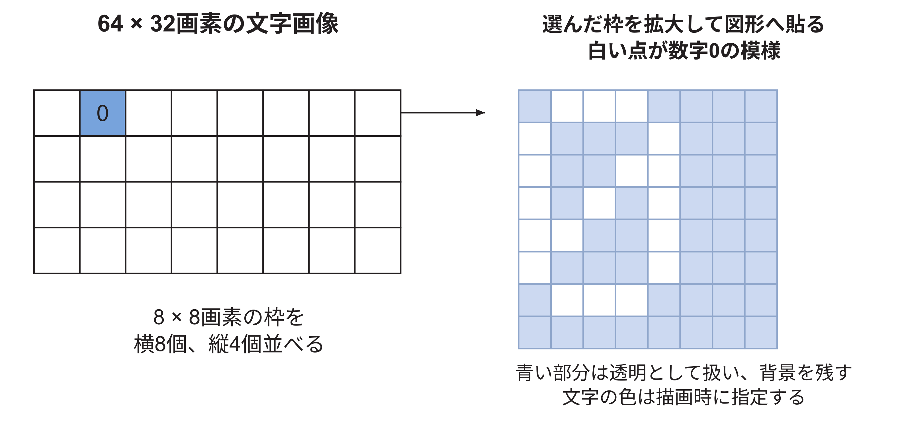

枠一つは8×8画素、その中で文字の模様に使うのは5×7画素である。右は数字0の枠を拡大した図で、白いマスだけが不透明になっている。青いマスは透明部分を図で見えるように塗ったもので、青色が画面へ描かれるわけではない。文字を置く四角形にこの模様を対応させ、透明部分には背景を残す。模様の行ごとの値はBreakout.hppのglyph関数で14、17、19、21、25、17、14と定義されている。

<a id="h0501"></a>
#### 文字の模様を選んで貼るまでの数値例

数字0は、文字画像の二番目の枠にある。枠番号は0から始めるので、番号1である。横に8枠あり、一枠の幅が8画素なので、番号1の枠は画像の左から8画素進んだ場所にある。縦方向は最初の行なので0画素である。

この枠を選ぶとき、横位置を画像全体の幅64で割った8/64=0.125、枠の横幅を8/64=0.125、縦幅を8/32=0.25として渡す。u、vはこの模様側の位置を表す。x、yは画面に置く四角形の位置を表す。模様側の場所と、画面側の場所にそれぞれ二つの座標がある。

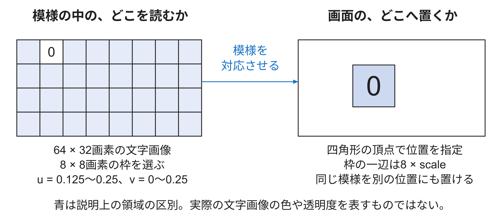

図9.6の左は元の文字画像、右はゲーム画面である。左の枠を選び、右の四角形へ貼る。例えばscale=2なら、元の8×8画素の枠を16×16画素の大きさにする。本ゲームの拡大・縮小の指定はGL_NEARESTであり、近くの模様の画素を選ぶ方式を使う。

元の文字画像では文字の点を白、それ以外を透明にしている。文字色を変えるときは、その白い模様に指定色を反映する。透明な点では背景を残す。従って、「文字の周りも白い四角で塗りつぶす」動作とは違う。図中で透明部分を青く塗っている箇所があっても、それは紙の上で区別するための色である。

<a id="s_9_7"></a>
### 9.7 五本の帯に分ける計算

640×480の画面には307,200画素ある。一方、内部の作業領域は65,536画素分である。307,200 ÷ 65,536は約4.69なので、画面全体を扱うには少なくとも五つの部分が必要になる。

固定した公式版のDisplayListDispatcher.hppでは、必要な分割数を求め、その数で画面の高さを分ける。高さ480は5で割り切れるため、一本の帯は640×96 = 61,440画素になる。これは65,536画素の作業領域に収まる。ここでの分け方は、高さ480を五等分して各帯の高さを96にそろえるものである。

| 帯 | 説明用の画面上の範囲 | 画素数 |
|---|---|---:|
| 1 | 上から0〜95行 | 61,440 |
| 2 | 96〜191行 | 61,440 |
| 3 | 192〜287行 | 61,440 |
| 4 | 288〜383行 | 61,440 |
| 5 | 384〜479行 | 61,440 |

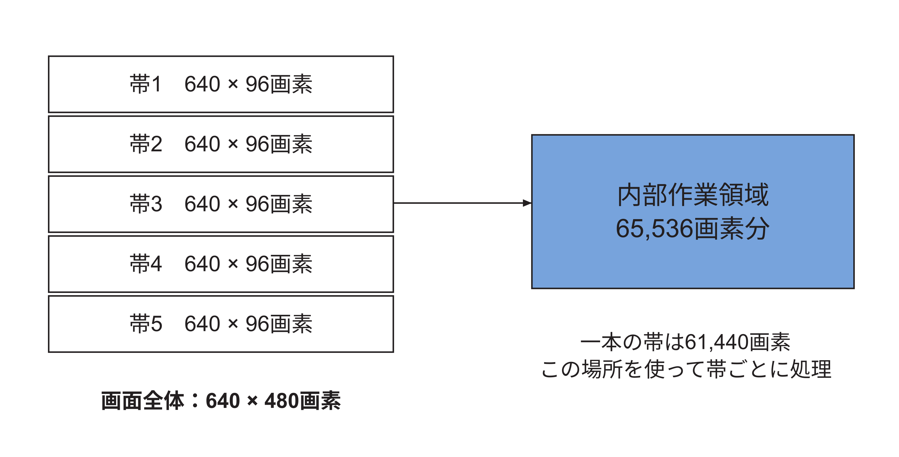

表と図は画面上で範囲を理解するための並べ方である。ライブラリ内部の命令リスト番号は反転して扱う箇所もある。実装を追うときは、画面上の上からの番号と配列の添字を同じと決めつけず、reverseDisplayListIndexを確認する。

<a id="h0513"></a>
#### 帯を処理しても画面に横線が残るわけではない

五本に分けるのは内部作業領域へ収めるためであり、表示する画像を五つの独立したウィンドウへ分けるわけではない。一本目の結果をDDR3内の対応する場所へ保存し、次の帯を同じ内部作業領域で処理する。五本分を保存すると、一枚の640×480画像になる。

一つの四角形が二本の帯にまたがる場合、その帯で扱う範囲に従ってそれぞれの処理が必要になる。従って、APIで一つの四角形を指定したことと、回路内部で一回だけ仕事をすることは同じではない。このような準備や分割も、ライブラリが扱う仕事に含まれる。

計算を小さく確認する。一本61,440画素を五本処理すると、61,440×5=307,200画素である。内部領域65,536画素から一本分を引くと4,096画素分の余りがある。この余りはこの分け方で領域内に残る容量であり、画面に描かない穴ができるという意味ではない。

<a id="h0517"></a>
#### 作業領域を使い回すと、ボールのどの部分が残るか

[第2章](#ch_2)のボールはy=200から始まるので、画面上の192〜287行を扱う帯に入る。その帯の中では、上から200−192=8行進んだ位置になる。横位置103はそのまま使い、画面全体での縦位置と、帯の中での縦位置を区別する。これが、同じ図形でも描画先に合わせた位置の計算が必要になる具体例である。

描画回路がその帯を処理したら、帯の画素をDDR3上の一枚の画像の192〜287行に当たる場所へ保存する。次に内部作業領域を別の帯で使っても、先に保存した画素はDDR3側に残る。表示回路は、すべての帯が置かれた一枚の画像を読むため、内部で作業領域を使い回したことを知る必要はない。

説明用にボールがy=190から8行分ある場合は、190〜191行と192〜197行にまたがる。ライブラリと描画回路は、二つの帯でそれぞれ該当範囲を扱う必要がある。ゲーム側は一つのボールを指定しただけでも、その後の仕事が必ず一回で済むわけではない。帯ごとに必要な命令を作る理由はここにある。実際の内部番号の上下方向は9.10節でソースへ対応させる。

<a id="s_9_8"></a>
### 9.8 五本の帯の命令リストを二組用意する

五本の帯それぞれについて、実行する命令を入れる場所を用意する。これが5個で一組になる。さらに、二組を切り替えて使うため、5個の組をもう一つ持つ。合計は10個である。

例えば一組目に、ある時点のボールやブロックを描く命令が入っているとする。次の命令を準備するときはもう一組を使い、一組目の内容を準備途中で壊さないようにする。同じ5個のリストを二重に数えているのではなく、内容を保存する場所が10個ある。

WallyBusConnectorは、これにデータ転送用の1個を加えた11個のバッファを確保する。各バッファは1 MiBである。これらはCPUが使うDDR3上のメモリであり、内部作業領域の65,536画素分とは別である。「二組の命令」「二枚の完成画像」「一つの内部作業領域」を混同しないことが、この構成を理解する要点になる。


図9.8では、画面を五本の帯に分けたことと、命令リストが二組あることを分けて示す。

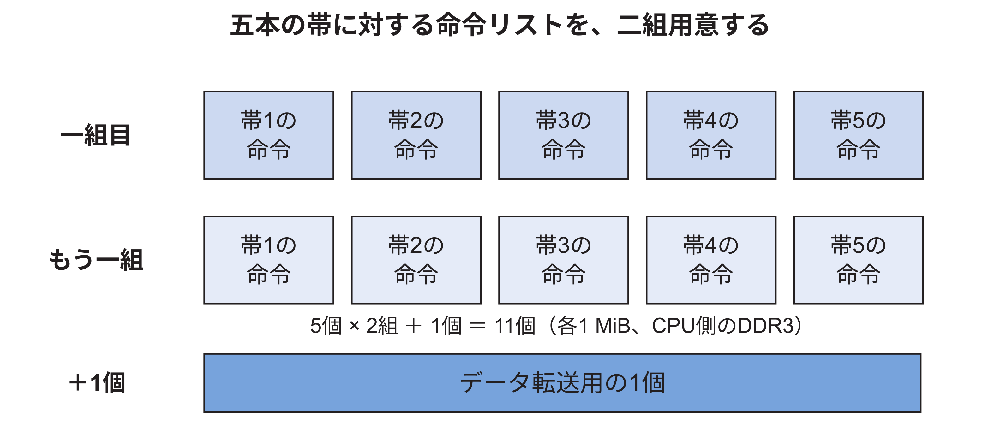

横方向の五つは画面の上から下までの五本の帯に対応する。上段と下段はその五本分の命令を別々に保持できる二組であり、帯が十本になるわけではない。色の濃さは二組を区別するためである。さらに転送用の一つを加え、確保する領域は合計11個になる。ここはCPU側のDDR3に置く命令の領域で、BRAM内の画素の作業領域とは別である。

<a id="s_9_9"></a>
### 9.9 頂点を渡す方法と本研究の選択

本ゲームは、[9.2](#s_9_2)節で示したように、四角形の頂点をglVertex2fで順に渡す方法を用いる。これに対し、頂点データをバッファとして扱うOpenGLの仕組みにVBOがある。同じ頂点列を繰り返し使う場合などに利用できる。

本研究では、実装した呼び出し方式についてCPU側の描画準備時間を測り、同じ設定の図形をまとめる方法と、変化した領域だけを描く方法を評価した。VBOとの同条件比較は行っていないため、両方式の性能上の優劣は評価範囲に含まれない。VBOを検討する場合も、頂点データの保存場所と、CPU側に残る変換・命令生成処理を確認する必要がある。

<a id="s_9_10"></a>
### 9.10 五本の帯の処理を実際の配列へ対応させる

本設定の最大画面は640×480で307,200画素、内部作業領域は65,536画素である。公式`RenderConfigs.hpp`の`getDisplayLines`は、この設定では整数除算307,200÷65,536の商4に1を加え、帯の領域を5組用意する。実行時の`DisplayListDispatcher::setResolution`も必要な帯数を切り上げて求め、480÷5=96行を一つの帯の高さにする。[RasterIX](#ref_RasterIX)

「Lines」という名前が使われているが、ここで求める5は走査線5本という意味ではない。96行ずつの五つの帯である。一つの帯の画素数は640×96=61,440なので、65,536画素の作業領域に入る。残り4,096画素は、この分割では使わない。

`ThreadedVertexTransformer::initDisplayLists`は、各帯について二組分のバッファ番号を交互に割り当てる。最初の帯には番号0と1、次は2と3、以降も同様に8と9までを使う。そのため「一組目は0から4、二組目は5から9」と思い込むと、ソース上の番号と合わなくなる。

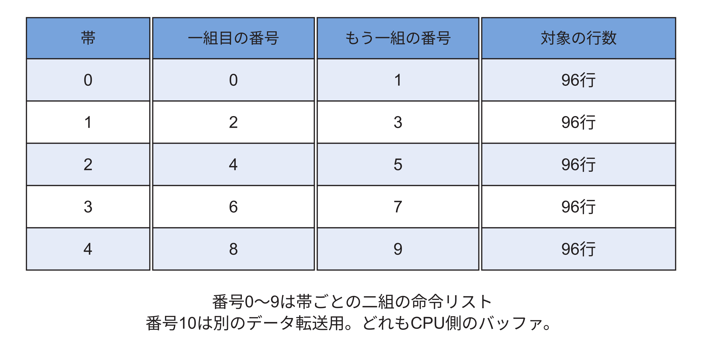

もう一つの番号10は、装置とのデータ転送用に用意する領域である。`WallyBusConnector`が確保する各1 MiBの領域は、C++の`std::vector`で作るCPU側のメモリである。65,536画素の内部作業領域や、DDR3上の二枚の画面画像とは違う。合計11 MiBという計算はこのコネクタが確保するバッファだけの値であり、アプリケーション全体の使用メモリ量ではない。

命令を送る順番は、常に図の上から下とは限らない。公式Dispatcherは帯の番号を逆順にたどる。その理由はストリーム表示にも使えるようにするためとコードに記されており、アドレス指定で画面を保存する本構成では、保存先が合っていれば上下の順番そのものを画面の位置と同一視する必要はない。

<a id="s_9_11"></a>
### 9.11 描画準備を実行するCPUとスレッド

`breakout.cpp`は、帯ごとの命令を管理する`ThreadedVertexTransformer`に、実行方法として`NoThreadRunner`を渡す。この組み合わせでは、描画準備を別のOSスレッドへ任せず、ゲームからの呼び出しと同じ実行の流れの中で処理する。[RasterIX](#ref_RasterIX)[Console26](#ref_Console26)

この構成により、複数の帯へ命令を配る公式の処理を利用しながら、一つのCPUでゲームと描画準備を進める。図形の準備と命令生成に使う時間は、そのCPUの処理時間に含まれる。[第13章](#ch_13)では、この時間を転送や表示切り替え待ちと分けて測定する。

<a id="ch_10"></a>
## 第10章 画像メモリと画面の切り替え

前章までで、図形の指定から画素を作るところまで進んだ。本章では、出来た色をどの番地へ置き、表示回路がいつからその場所を読むかを説明する。最初に一画素の保存を確認し、その後で一枚の画像、二枚の切り替えへ広げる。画面が崩れない条件は、描く色だけでなく、古い保存場所をいつ再利用するかにも関係する。

<a id="s_10_1"></a>
### 10.1 一画素の色を2 byteで保存する

表示画像にはRGB565形式を使う。赤に5 bit、緑に6 bit、青に5 bitを割り当て、合計16 bit、すなわち2 byteで一画素を表す。各成分の最大値は、赤31、緑63、青31である。例えば赤だけを最大にすると0xf800、緑だけなら0x07e0、青だけなら0x001fになる。

画像一枚は640×480×2 = 614,400 byteである。1 KiBは1,024 byteなので、これは600 KiBに相当する。二枚なら1,228,800 byteになる。32 MiBの予約領域全部を、この二枚だけで使い切るわけではない。テクスチャなどのための範囲も含めて予約している。


図10.1は、一画素の色を入れる16 bitの内訳を示す。

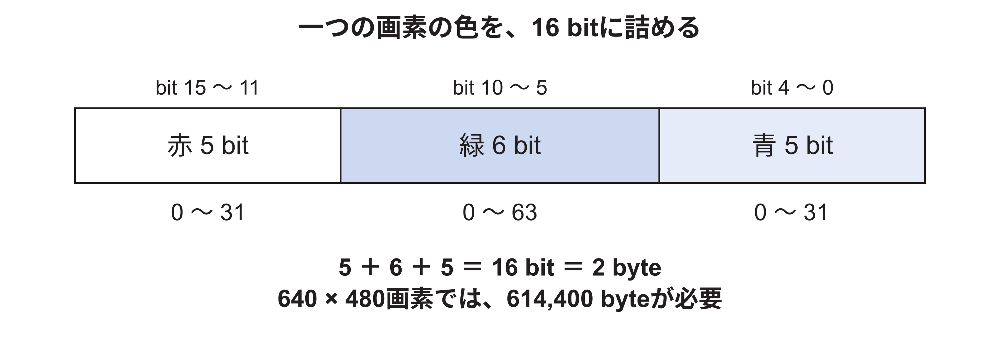

図中の塗り分けはビットの区切りを見やすくするもので、画素の表示色ではない。三つの成分を合わせた2 byteが640×480個並ぶと、上で計算した614,400 byteになる。

<a id="s_10_2"></a>
### 10.2 座標からメモリの番地を求める

画素を左から右、上から下へ並べて保存すると、一行には640画素、1,280 byteが必要になる。画像の先頭をAとすると、座標(x, y)の画素の番地は、A + 2×(640×y + x)で求められる。

例えば(x, y) = (10, 20)なら、前にある画素は640×20 + 10 = 12,810個である。byte数に直すと25,620 byte、16進数では0x6414である。A = 0x9fe00000なら、その画素は0x9fe06414から始まる。座標とメモリの関係が分かると、読み戻した画像のどの位置が壊れたかを追える。


図10.2は、上の式に座標(10, 20)を入れた計算を図にしたものである。

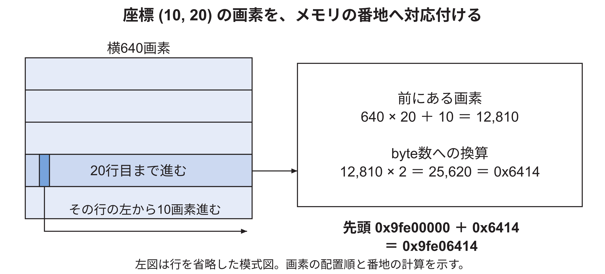

最初の行から20行分を進むと640×20画素、その行の左端からさらに10画素進む。対象の画素より前に合計12,810画素が並び、一画素が2 byteなので、先頭からの距離は25,620 byteとなる。青い行は注目している行、濃い青の細い枠は注目する画素である。図の行数や幅は省略して描いており、正確な距離は右側の式で求める。

<a id="h0555"></a>
#### まず幅4画素の画像で番地を確かめる

640という数で分かりにくい場合、説明用に横4画素、縦3画素へ小さくする。各画素が2 byteなら、一行は4×2=8 byteである。先頭の画素は先頭+0、右隣は+2、その右隣は+4となる。二行目の左端は+8になる。

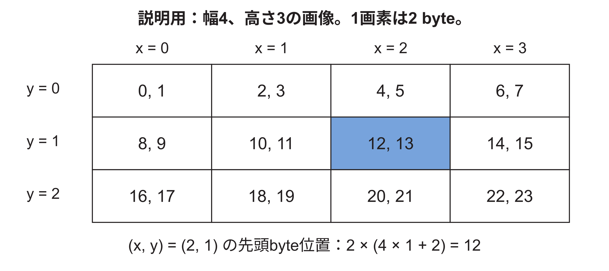

図10.3の数字は色ではなく、先頭からのbyte数である。座標(2,1)なら、一行分の8 byteを進み、さらに二画素分の4 byteを進むので+12となる。式では2×(4×1+2)=12である。この幅4を640へ置き換えると、本実装の式になる。

一画素に2 byte使うため、画素の先頭は二つずつ進む。画素番号をそのままbyteの差として足すと、意図した場所の半分の位置を指してしまう。「画素数からbyte数へ直す」という一段階が必要になる理由である。

<a id="s_10_3"></a>
### 10.3 二枚の画像を使う理由

表示回路は、一枚の画像を左上から順に読む。この途中で同じ画像を描き換え始めると、すでに読んだ上側は古い画像、これから読む下側は新しい画像になることがある。例えばボールが上側から下側へ移った途中の画像が混ざると、その一枚だけボールが二つ見えたり、欠けたりする可能性がある。そこで、表示回路が読む画像と、描画回路が作る次の画像を分ける。

表示用の保存場所をAとBの二つ用意する。Aを表示回路が読んでいる間、描画回路はBへ次の画像を作る。Aの画素を変えないので、その間の表示は保てる。Bができたら、表示回路へ「次はBから読んでほしい」と知らせる。切り替えが安全な段階まで進めば、今度はAを次の描画先へ使える。

表示に使っている側をフロントバッファ、次の画像を作る側をバックバッファと呼ぶ。AとBという二つの物理的な保存場所に対して、役割の名前が入れ替わる。「Aの全画素をBへコピーする」という意味での切り替えではない。表示回路が読む先頭番地を切り替える。

本構成の二枚の保存先は0x9fe00000と0x9fc00000である。どちらも予約した画像用領域に置く。ソフトウェアの設定では、この領域の先頭0x9e000000からの差を使う。例えば0x01e00000という差を足せば、0x9e000000+0x01e00000=0x9fe00000となる。

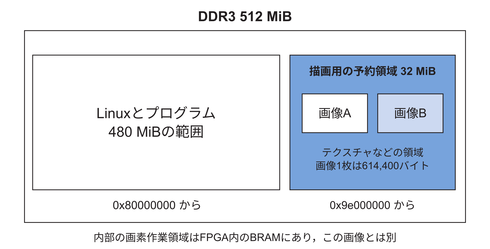

<a id="h0566"></a>
#### フロントとバックは役割であり名前札を貼り替える

最初にAを表示しながらBへ次の画像を描いたとする。その間、Aはフロント、Bはバックである。切り替えが完了してBを表示し始めると、Bがフロントになり、次に描くために使えるAがバックになる。AとBの物理番地が互いに移動するわけではない。

| 時点 | Aに対して行うこと | Bに対して行うこと |
|---|---|---|
| 次の画像を準備中 | 表示回路が読む | 描画回路が書く |
| 切り替えを依頼した直後 | 古い読み出しが残る可能性がある | 新しい表示先として依頼する |
| 切り替え完了を確認した後 | 次の描画先として再利用できる | 表示回路が読む |

二行目を省いて「アドレスを書いたからすぐAへ描く」とすると、Aの古い読み出しに新しい色が混ざる可能性がある。[10.5](#s_10_5)節の完了待ちは、この境目を回路の応答で決めるためにある。

<a id="s_10_4"></a>
### 10.4 内部作業領域は第三の役割を持つ

ここまでのフロントとバックは、DDR3に保存する二枚の表示用画像である。一方、RasterIX_IFが図形を塗る途中で使うBRAMの領域は、別にある。この領域には一帯分の画素を扱わせ、結果をDDR3へ保存する。したがって内部作業領域は、二枚の画像のどちらか一方の別名ではない。

保存場所を、その中身で区別する。CPU側のコマンドバッファには、描くための命令が入る。BRAMの作業領域には、いま処理している帯の画素が入る。DDR3の画像A・Bには、表示用の一枚の画像を構成する画素が入る。表示回路が読み続けるのは、このA・Bのうち表示先に選ばれた側である。

ゲームのプログラムを終了しても、FPGAをリセットしたことにはならない。内部のBRAMにある色が、プログラムの終了だけで必ず消えるとは限らない。そのため再起動時には、最初の処理が前の色を前提にしないよう初期化する必要がある。本実装では解像度を設定する前にglClearを呼ぶ対処を行った。

この順番が必要なのは、使用しているライブラリでは解像度の設定時に最初の命令列を送り出すためである。先にglClearで画素を消去する命令を用意しておけば、その命令も最初の命令列に含まれる。glClearを呼んだ瞬間にCPUがBRAM全体へ直接0を書き込むという意味ではない。また、内部の作業画素を消す処理と、表示用画像A・Bの両方を描き直す処理も別である。AとBの役割を入れ替えるだけでは、内部に残った色の問題は解決しない。

図10.5は、命令、途中の画素、表示用画素の三つの保存場所を並べた図である。それぞれの中身と、読み書きする回路を対応させて読む。

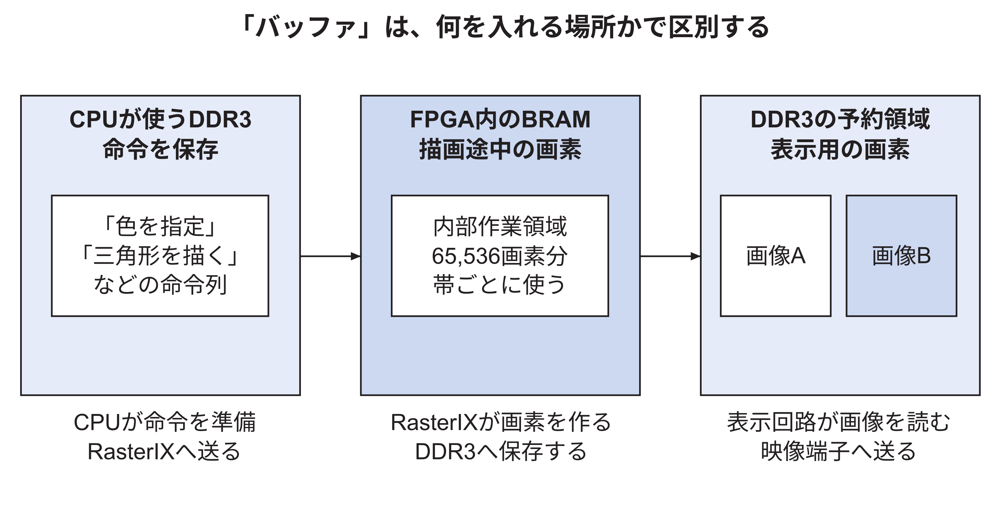

左に入るのは「どの図形を描くか」という命令、中央と右に入るのは色の点である画素である。中央はFPGA内のBRAM、左右は基板上のDDR3を使う。箱の大きさは容量の比ではない。右側の白いAと淡い青のBは、別々の番地に置く二枚の画像を表す。命令用のバッファ、内部作業領域、フロント・バックの画像を同じものと考えないよう、入る内容と置き場所を対応させて読む。

<a id="s_10_5"></a>
### 10.5 切り替えの依頼と完了は違う

「次はBを表示してほしい」と伝えることと、「Aをもう使っていない」と分かることは別である。例えば表示回路がAの読出しをメモリへ依頼済みで、その返事を待っている場合を考える。この時点でAを次の描画に使うと、まだ必要なAの画素を変更してしまう可能性がある。そのため完了の返事を出す条件まで決める。

本実装では、切り替えを依頼した後、表示回路が新しい画像の先頭を読む要求を出し、その要求がメモリ側に受け付けられたことを確認する。さらに、先に出ていた読み出しの返事と、新しい画像の最初のまとまった読み出しの返事が戻るまで待つ。その後、完了を返す。古い画像を次の描画で再利用するための条件を、メモリのやり取りまで含めて定めた。

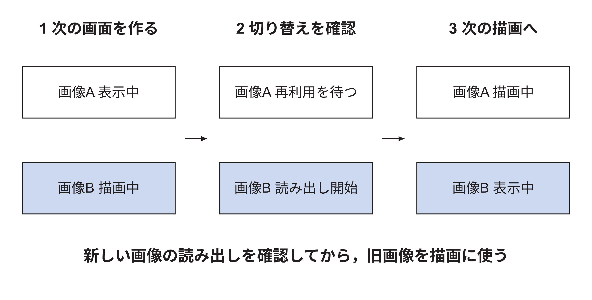

<a id="h0582"></a>
#### なぜ「Aをもう読まない設定にした」だけでは足りないか

読む先をBへ変える設定は、これから出す要求を変える操作である。変更前に出して、まだ返事を受け取っていないAの要求を消す操作ではない。例えば表示回路がAの一部を読みたいと依頼し、その要求がメモリ側で待っている間に、CPUが「次はB」と設定した場合を考える。

この直後にAを描き直してしまうと、まだ残っているAの読み出しが新しい値を拾う可能性がある。表示側が古い画像の続きとして使いたいデータを、描画側が次の画像の色で変えてしまうのである。そこで、Bへの切り替え依頼だけで完了を返さず、旧画像について受け付けられた要求の返事も待つ。

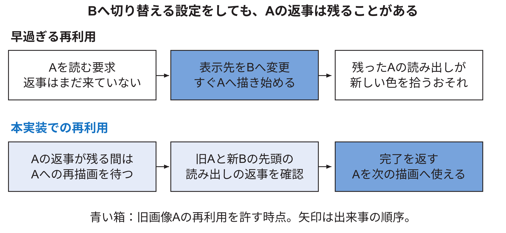

図10.7の上段は、Aの返事が残っているのに再描画を許す場合、下段は返事がそろうまで再利用を待つ場合を示す。青い箱は再利用を許す時点である。本実装ではさらにBの最初の読み出しの返事も確認して完了を返す。これはメモリ側の受け渡しの確認であり、その瞬間にディスプレイ全体の光が新しくなったという意味ではない。

<a id="h0587"></a>
#### 未完了の読み出しをバースト単位で数える

一定時間だけ待つ方法では、他の回路からのメモリ要求で遅れたときに待ち時間が足りなくなる。そのため、読み出しを受け付けた事実と、その返事が最後まで戻った事実を数える。`rasterixdisplay.sv`では、ARVALIDとARREADYがそろうと依頼を受理し、RVALIDとRREADYとRLASTがそろうと一件の返事が完了したと判断する。[Console26](#ref_Console26)

```systemverilog
assign ReadAccepted = ARVALID & ARREADY;
assign ReadCompleted = RVALID & RREADY & RLAST;
```

`RLAST`は、一つのバーストの最後のデータを表す。RVALIDだけを数えると、複数語のバーストを何回も完了したと数えてしまう。Outstandingは「要求は出したが、最後のデータがまだ返っていないバーストの数」である。

新しい画面の先頭を要求した時点で、古い要求が2個残っている例を考える。同じ周期で返却完了がなければ、Remainingには2+1=3が入る。その後に3個の返却完了を数えてAckを上げる。同じ周期に古い要求が1個完了したなら、2+1−1=2となる。

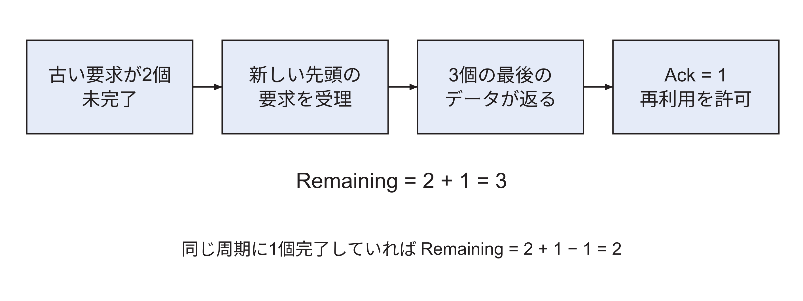

この数え方は、接続した表示回路の要求方法と返却順序を前提にしている。任意のAXIマスタを差し替えてよいという保証ではない。表示回路を別のものへ交換する場合は、IDの使い方、返却の順序、先読みの仕方を調べ、完了判定を再検討する。

Remainingが最後の一件になり、その返事が完了したところでAckを返す。[付録B](技術付録.md#ch_B)には、同じ例を一件ずつ減る表と図に対応させた説明がある。

<a id="s_10_6"></a>
### 10.6 回路の状態とクロックをまたぐ通知

`fpga/src/rasterixdisplay.sv`は、いま何を待つかを状態として保持する。要求側はIDLEで依頼を待ち、依頼が来るとアドレスを記憶してWAITACKへ移る。返事が来るまでそのアドレスを変えず、返事を得るとFrameDoneを一周期だけ出す。

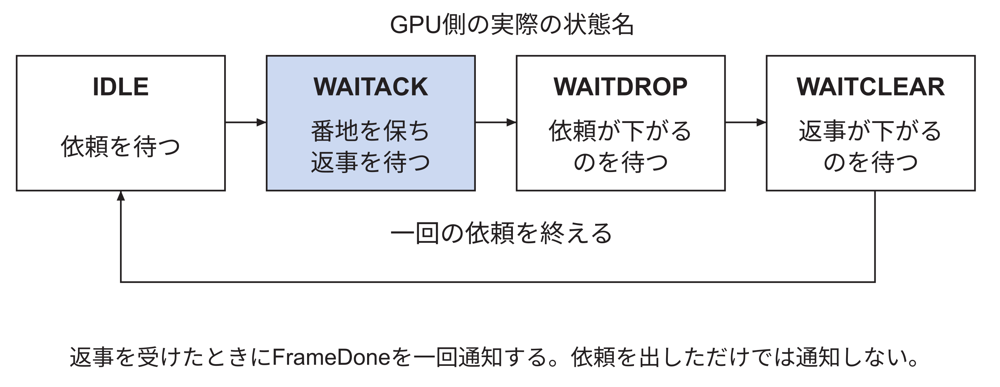

図10.9では返事の後にも二段階ある。WAITDROPは元の依頼Swapが0へ戻るのを待ち、WAITCLEARは同期された返事Ackも0へ戻るのを待つ。すぐIDLEへ戻すと、1のまま残る古い依頼を新しい依頼として二度受け取るおそれがあるためである。

コードのcaseは現在の状態に応じて次の動きを選ぶ。状態名を一周期ずつ順に通るわけではなく、返事がなければWAITACKに複数周期とどまる。表示側も、要求の取込み、アドレスの設定、表示の有効化、実際の読み出しの確認を順に進める。状態名と、その状態を抜ける条件を一緒に読む。

<a id="h0600"></a>
#### 要求と返事を別のクロックへ渡す

描画回路は100 MHz、表示回路は25.2 MHzで動く。100 MHz側で1クロックだけ出した信号は10 nsしか続かない。25.2 MHz側の周期は約39.68 nsなので、その10 nsが二つの立ち上がりの間に収まると、表示側が一度も1を読み取れないことがある。そこで切り替え要求を、返事が来るまで1のまま保つ。

`rasterixdisplay.sv`では、要求Requestを上げる、応答Ackが上がるのを待つ、Requestを下げる、Ackが下がるのを待つ、という四段階を使う。次の要求は、この一往復が終わってから受け付ける。[Console26](#ref_Console26)

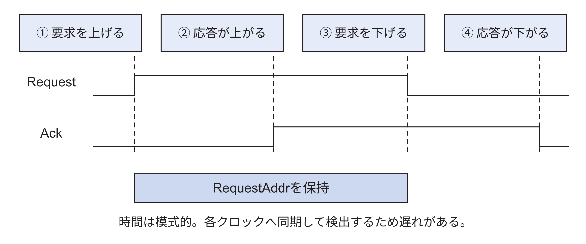

アドレスRequestAddrは、要求を出すときに保存し、応答が返るまで変えない。要求の1 bitだけを二段のレジスタに通し、表示側が要求を認識した時点で、安定しているアドレスを取り込む。32本のアドレス線を別々に二段同期するだけでは、更新前後のbitが混ざった値を受け取る可能性があるため、この「値を保つ約束」が必要になる。

二段の同期レジスタは、非同期信号を取り込んだ直後の不安定さが後段へ伝わる確率を減らすために使う。値をいつ変更してよいかという約束の代わりにはならない。本実装のXDCでは、要求・応答・保持したアドレスの各経路を10 ns以内のデータ経路遅延に制約し、同期レジスタ同士の通常の時間解析は残している。

<a id="h0606"></a>
#### 切り替え完了をCPUへ伝える

表示側のAckが描画側へ戻るとFrameDoneを一回出し、さらにCPUのクロック領域へ伝えてFrameCountを増やす。100 MHzの短いパルスをそのまま20 MHz側へ送ると取りこぼし得るため、ここでは完了するたびに0と1を反転する信号を使い、CPU側でその変化を検出する。

この変化を伝える間に次々と反転させれば、二回分が元の値に戻って見えなくなる可能性は残る。本用途では表示切り替えがCPUクロックに対して十分遅く、ソフトウェアも完了を待って進む。その用途の条件と、一般の高速イベントカウンタの設計を混同しない。

FrameCountが増えたときに分かるのは、定めた回路内の切り替え完了条件が成立したことである。外部ディスプレイが画像全体を表示し終わった時刻、液晶の応答時間、操作から人が見るまでの遅延までは分からない。本稿が画面切り替え完了回数と映像確認を分けて記録するのは、このためである。

<a id="s_10_7"></a>
### 10.7 HDMI端子から出すDVI映像

コネクタの形と、そこを流す映像の形式は同じ意味ではない。標準構成は、Nexys VideoのHDMI OUT端子からDVI形式の映像を送る。音声を送る構成ではない。映像は640×480、画素クロック25.2 MHzである。

実験用には、別の送信回路で720pのHDMI信号を出す構成も用いた。これは、使用した映像取り込み機器がDVI信号を認識できない場合に、ゲームの動作を記録するための構成である。標準DVI構成と実験用HDMI構成では表示経路が異なるため、[第13章](#ch_13)の性能比較では、どちらを使った結果かを明記する。

画像の縦横比も確認する必要がある。640×480は4:3である。この画像を1920×1080全体へ引き伸ばすと、横方向に長く見える。1920×1080の中で4:3を保つなら、画像部分は1440×1080で、左右に各240画素の余白を置く。取り込み側の拡大による変形と、FPGAが描く画素の誤りを分けて調べる。

図10.11は、同じ元画像を二通りに拡大した例である。青い図形は、元の640×480画像では正方形として描かれている。左では縦と横の倍率が異なり、右では同じ倍率になる。

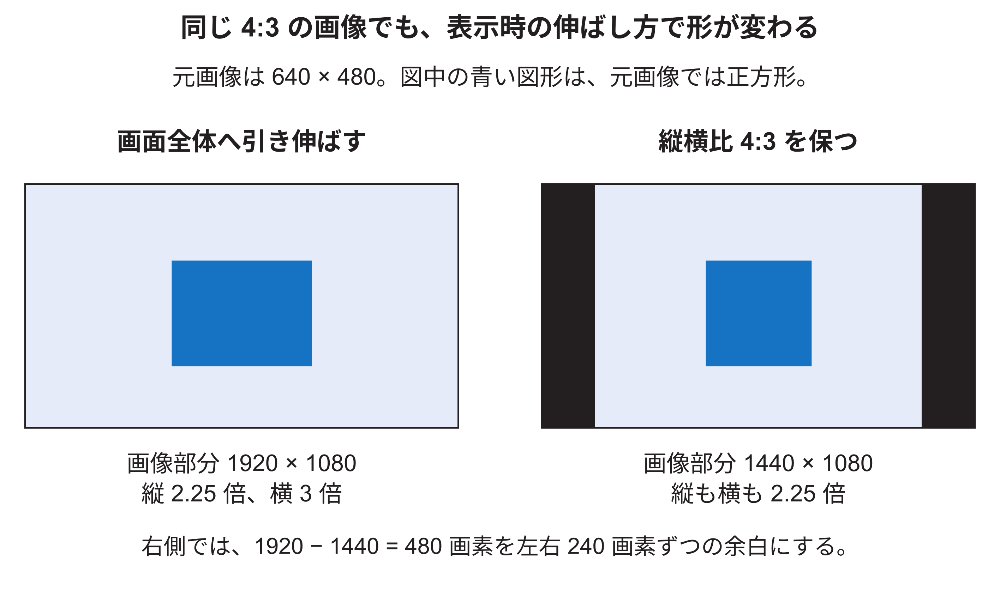

左のように見えた場合、見た目だけからFPGAが横長の図形を描いたとは決められない。保存された画像の幅と高さを調べ、次に取り込み側の拡大方法を調べる。右の黒い部分は縦横比を保つための余白であり、元画像の画素の欠落を表すものではない。


<a id="h0617"></a>
#### 画像の読み出しはゲームのループと独立して続く

ゲームが新しい位置をまだ計算していなくても、表示回路は映像の時間条件に合わせて色を送り続ける。次に使う画像が届くまでは、同じ画像を再び読む。このため、ゲーム側の描画が毎秒60回に達していない場面でも、映像信号自体は一定の表示周期で出せる。

画素クロック25.2 MHzを640×480で割るだけでは表示周期を求められない。映像信号には、見える画素の時間に加え、行や画面の区切りを示す時間があるためである。表示IPには幅、高さ、更新設定を指定し、その回路が行・画面の時間構造を作る。接続比較版の標準DVI回路を調べると、一周期は801画素クロック×526行であった。[E6](#ref_E6) したがって、25.2 MHzでは801×526÷25,200,000秒、すなわち約16.719 ms、約59.811 Hzとなる。性能値を解釈するときは、設定名の60 Hzではなく、この表示周期と照合する。

<a id="s_10_8"></a>
### 10.8 Linux用の領域と画像用の領域を分ける

DDR3全体は0x80000000から512 MiBで、その末尾32 MiBが0x9e000000からの領域になる。最初の480 MiBをLinux等が使い、末尾を描画用に確保する。画像Aの0x9fe00000も画像Bの0x9fc00000も、この末尾32 MiBに含まれる。

図10.12は、左でDDR3全体を見て、右で末尾32 MiBの内側を拡大したものである。画像Aと画像Bは、その予約領域内の別々の番地に置かれる。図では位置関係を読みやすくするため、容量の比率は実寸にしていない。

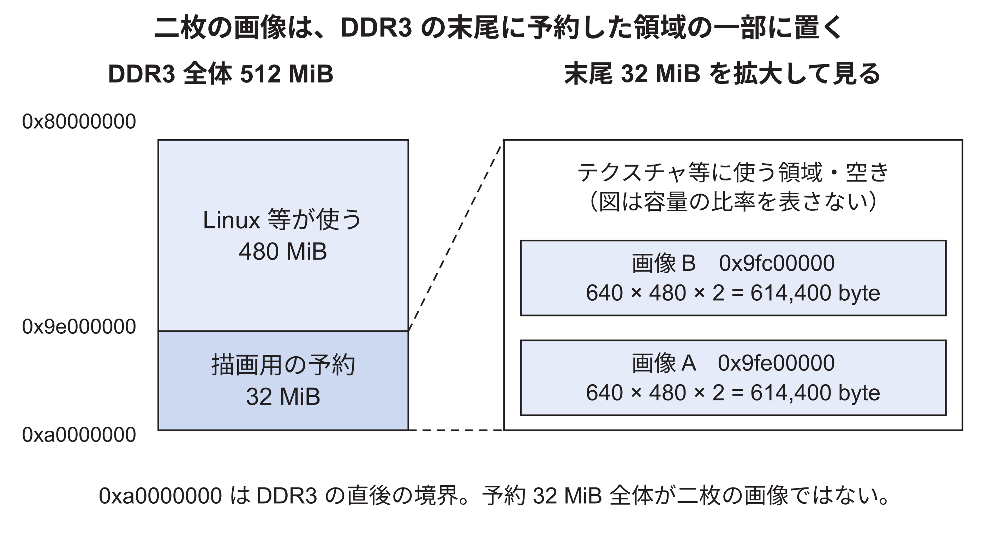

画像一枚は640×480×2で614,400 byteなので、二枚を合わせても予約領域の32 MiB全体にはならない。また、二枚の先頭は隣り合う画素のように連続しているわけではない。Linuxへ予約を知らせる範囲と、表示回路へ渡す画像一枚の先頭アドレスを区別して設定する。


デバイスツリーのreserved-memoryは、その領域をLinuxの普通の割り当て先から外すための説明である。例えばLinuxが同じ場所を別のプログラムの配列として割り当てると、描画回路が色を書いたときにその配列を壊す。予約によって、この使い道の衝突を避ける。

| 決める場所 | 決めていること | 互いにそろえる理由 |
|---|---|---|
| DDR3制御とWally設定 | 物理的にアクセスできる容量 | 存在しないメモリを使わないため |
| デバイスツリー | Linuxが普通の用途に使わない範囲 | 描画とOSの上書き競合を避けるため |
| RasterIX側のソフトウェア設定 | テクスチャや画像の置き場所 | 回路に正しい物理アドレスを渡すため |
| 表示切り替え回路 | 次に読み始める画像の先頭 | 描いた画像と表示する画像を一致させるため |

この予約によって、Linuxはその領域を別のプログラムへ割り当てなくなる。ただし、すでに入っている画素が消えるわけではないので、起動時の消去は10.4節の処理で行う。また、予約は表示回路の読み出しを待つ操作でもないので、画像を再利用するときは10.5節の完了を確認する。CPUのキャッシュや読み書きの順序については、[7.10](#s_7_10)節の設定も必要である。このように、領域を確保した後も、そこへ何を書くか、いつ書き換えるかを決める処理が残る。

仮想番地と物理番地の対応、およびCPUがコピーする方式とDMAへ転送を任せる方式の違いは、[付録J.3](技術付録.md#s_J_3)〜[J.4](技術付録.md#s_J_4)に示す。

<a id="s_10_9"></a>
### 10.9 アドレスを二進数の幅と結び付ける

CPUから見たDDR3は`0x80000000`から始まる。一方、512 MiBのメモリ内部では先頭を0とするオフセットが必要になる。512 MiBは2の29乗byteなので、先頭からの位置を表すには29 bitを使う。例えば画面AのCPU側アドレス`0x9fe00000`は、DDR3の先頭から`0x1fe00000`byte先を意味する。

```text
0x9fe00000 - 0x80000000 = 0x1fe00000
```

本接続では、DDR3へ渡すときに下位29 bitでオフセットを表す。CPU側ではその前段でアクセス先が正しいメモリ範囲か判定される。したがって「下位29 bitだけ同じなら、どんなアドレスでも同じ場所へ書いてよい」という意味ではない。GPU側にも、予約した領域の中に収まる正しいアドレスを渡すことが必要である。[Console26](#ref_Console26)

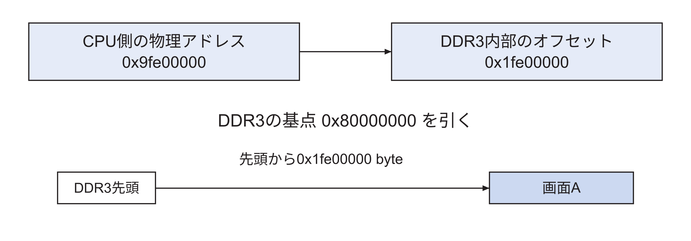

RGB565画像一枚は`0x96000`byteである。画面Aの範囲は`0x9fe00000`以上`0x9fe96000`未満となり、予約領域の末尾`0xa0000000`を超えない。末尾を「未満」で書くのは、サイズをそのまま足して範囲を表せるからである。最後のbyteの番地を知りたい場合だけ、さらに1を引く。

<a id="ch_11"></a>
## 第11章 ブロック崩しを動かすソフトウェア

<a id="s_11_1"></a>
### 11.1 ゲームの状態と描画を分ける

この章では、[第2章](#ch_2)で追ったボールの動きを、実際のプログラムへ対応させる。まず役割の異なる三つのデータを分ける。Gameが持つのはボールの位置や得点などの状態、sceneが返すのは四角形や文字として描く内容、Rendererが用意するのは描画回路へ渡す命令である。

例えば「ブロックに当たった」という一回の出来事を考える。Game::stepがボールとブロックの重なりを調べ、そのブロックを消す状態にし、得点を増やす。次にsceneは、消えたブロックを含めず、新しい得点の文字を含めた描画一覧を作る。Rendererは、その一覧の図形と文字を描く関数を呼ぶ。三つは同じCPUで実行されるが、変えるデータが違う。

この分け方なら、描き方を変えるために衝突判定や得点計算まで変更する必要がない。同じGameの状態から作った同じ描画一覧を使い、「毎回全部を描く」「同じ設定の呼び出しをまとめる」「前の画像から変わった所を描く」を比較できる。以下では、この描画側の仕事を減らす実装を説明する。

表のファイルはすべて`examples/rasterix/`にある。何を変えたいかに応じて、対応する役割のファイルから読み始める。

| ファイル | 担当すること | 変更を考えるときの例 |
|---|---|---|
| Breakout.hpp | 状態更新、当たり判定、図形一覧 | ボールの速さやブロック配置を変える |
| BreakoutRenderer.hpp | 四角形と文字の描画 | 図形の渡し方、文字画像を変える |
| BreakoutDamage.hpp | 変更領域と再描画対象の計算 | 部分描画が何を描き直すか調べる |
| WallyBusConnector.hpp | 命令転送と完了待ち | バス操作やタイムアウトを調べる |
| breakout.cpp | 起動、入力、時間管理、ループ | 手動・自動操作や終了条件を変える |

<a id="h0642"></a>
#### UARTの文字をゲームの入力へ変える

ゲームへの入力にはUARTの文字端末を用いる。`Terminal::poll`が文字を読み、Aなら`move=-1`、Dなら`move=1`、Sなら`move=0`を保存する。Aを一回送ると、SやDを送るまで左移動が継続する。端末は通常のゲームパッドのような「ボタンを離した」という情報を送っていないためである。[Console26](#ref_Console26)

Spaceを受けたときの`start=true`は、`takeInput`で一度取り出すとfalseへ戻す。この違いにより、方向は継続し、開始は一回の合図として扱える。後からWiiコントローラーを付ける場合も、ゲームの規則そのものを書き換える前に、この`Input`の値をどう作るかを決めればよい。ただし実機接続と電気的な条件の検証は、別途必要である。

`Game::step`は、受け取ったInputから次のゲーム状態を計算する。例えばパドル中央が320画素、右入力が1なら、一回の更新で6画素右へ進む。ただし右端を越えないように上限を設ける。コードでは位置を256倍の整数で持つので、計算する値は320×256から326×256への更新になる。

図11.1は、ボールがブロックに当たった一回を例にしている。①ではゲームの規則に従って状態を変え、②で次に見せる対象を取り出し、③でその対象を描く命令を準備する。

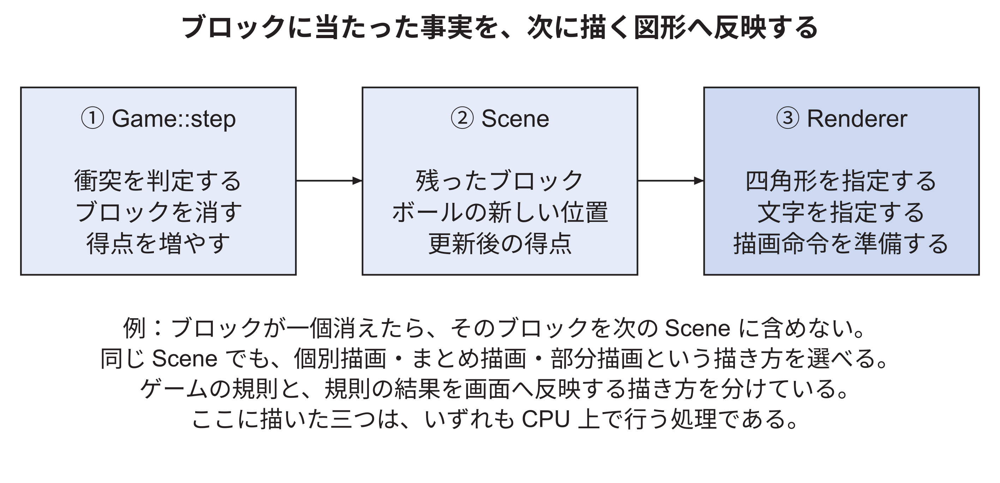

例えば描画方式を変えても、①でブロックが消えた事実まで変えてはいけない。同じSceneを異なる描き方へ渡せる構造にしておくと、ゲームの結果を保ちながら描画の実装だけを比較しやすくなる。ここでSceneは専用チップではなく、CPU上のプログラムが作るデータである。


<a id="s_11_2"></a>
### 11.2 小数の位置を整数で持つ

ボールの位置が毎回整数画素ずつしか変えられないと、細かい速度を表しにくい。本ゲームは、位置を256倍した整数として保持する。例えば画面上の100.5に相当する位置は、100.5×256 = 25,728として持つ。Q = 256がこの倍率である。

描画するときはQで割って画面上の位置を得る。ゲームの計算に使う細かな位置と、最終的に描く整数位置を分ける方法である。

図11.2では、説明用の位置100.5を256倍して25,728として持つ。0.5だけ進めるなら、同じ倍率で表した128を加える。単位をそろえて加算することが重要である。

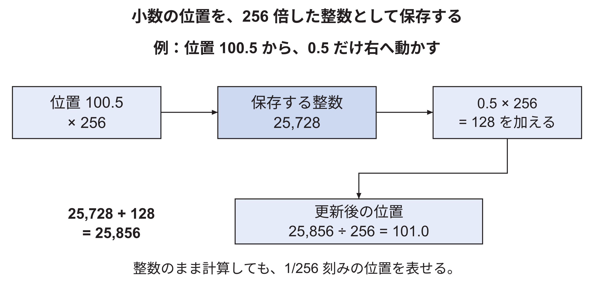

結果は25,856であり、256で割ると位置101.0に戻る。実装ではGameがこの形式の位置を保持し、Sceneを作るときに画面の整数座標へ直す。図の100.5は数の表し方を示す例であり、その位置を実機で測定した結果ではない。


<a id="s_11_3"></a>
### 11.3 一秒間のゲーム時間をそろえる

描画するたびに状態を一回だけ進める作りでは、描画が遅くなるとゲーム自体も遅くなる。本実装は、経過した実時間から必要な更新回数を決め、一秒60回の状態更新を目標にする。

説明用に、一回の更新でボールを右へ3画素進めるとする。壁に当たらなければ一秒で3×60=180画素進む。描画が毎秒30回しか間に合わなくても、一回描く前に二回分の状態更新をすれば、移動距離は同じ180画素になる。ただし画面に見せる位置は6画素おきになる。毎秒60枚描ける場合は3画素おきとなり、一秒の移動距離を変えずに途中の位置を多く見せられる。この値は仕組みの説明用であり、実ゲームの速度測定値ではない。

実コードでは、`breakout.cpp`が経過ナノ秒を60倍して`accumulated`へ加え、1,000,000,000以上になるたびにGame::stepを一度呼んで10億を引く。1/60秒を整数ナノ秒へ丸め続ける誤差を避けるためである。例えば50,000,000 ns、つまり50 ms経過したなら、60倍で3,000,000,000となり、三回更新してから一回描く。[Console26](#ref_Console26)

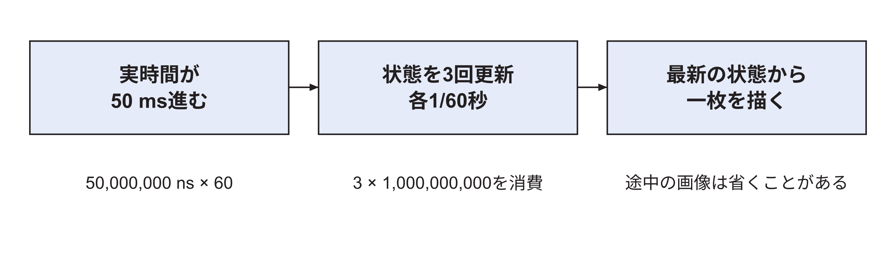

約33 ms経過した場合なら、およそ二回分を進める。同じように、描けなかった途中の画像を省く場合も、途中の衝突などは各状態更新で計算する。状態更新のticksと、描画と切り替えを進めたframesが一致するとは限らない理由である。[第13章](#ch_13)の約80秒の試験でも、両者と経過秒数を別々に記録した。CPUが長く止まれば追いつくための計算も増えるので、この方法だけであらゆる負荷に耐えられるわけではない。

ボールの移動は、一回の状態更新の中でも四回に分けて衝突を調べる。初期速度`vx=2×256`、`vy=−4×256`なら、一小段階ではxへ128、yへ−256を加える。画素でいえば右へ0.5、上へ1である。大きく飛び越えてから調べるより、途中の薄い壁やブロックを見つけやすくする。これは四角形の重なりを用いた本ゲームの判定であり、一般の物理シミュレータではない。

<a id="s_11_4"></a>
### 11.4 同じ設定の図形をまとめる

毎回一つずつ図形を描く方式では、四角形Aを描き始めて終え、次にBを描き始めて終え、さらにCを描く。同じ設定で描けるA・B・Cを一つのまとまりにできれば、開始と終了を三回繰り返す代わりに、一回の開始から終了までに三つを指定できる。完成する画像をそろえたまま、関数呼出しや設定に伴う仕事を減らすという考え方である。

説明用に、同じ設定で描ける四角形が三個あるとする。最初の方式は「開始、四角形A、終了」「開始、四角形B、終了」「開始、四角形C、終了」と呼ぶ。まとめた方式は「開始、A、B、C、終了」と呼ぶ。どちらも三個を渡すが、開始と終了の組が三回から一回になる。赤いブロックが10個の場合も、10組を一組へまとめる考え方は同じである。

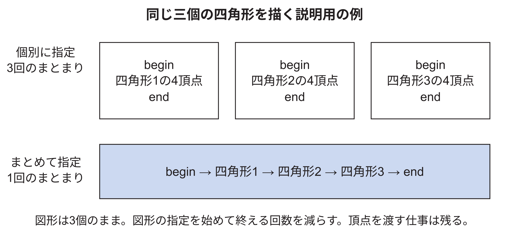

本ゲームでは、まず色だけの四角形をまとめる。その後、文字用のテクスチャと透明度の設定へ切り替え、文字をまとめる。設定が違う物を無条件に一組にはせず、各組の中の順番も保つ。順番を変えると、重なったところの色が変わる場合があるためである。

減らすのは描く物体数ではなく、同じ物体を渡すために開始と終了を繰り返す回数である。色や頂点を渡す仕事は残る。次節の部分描画は描き直す物体や範囲も減らすため、別の段階の改善になる。図形数に伴って残る負担は13.7節で測定した。

<a id="s_11_5"></a>
### 11.5 変わった領域だけを描く

画像メモリの色は、別の値を書かない限り、その場所に残る。この性質を使えば、変わっていない背景やブロックを毎回描き直さずに済む。例えば位置100のボールを位置103へ動かすとき、画像全体が初めから空になるわけではない。変わった場所を調べ、必要な色だけを書き直す方法を部分描画と呼ぶ。

最も単純な例として、周りがすべて黒で、ボールと重なる物がない場合を考える。まず古いボールの範囲を黒く塗り、次に新しい位置へ白いボールを描けばよい。「ボールという物を取り除く」機能が画像メモリにあるのではなく、古い場所の白色を黒色へ書き換えている。

しかし壁や文字が重なっていたら、黒で塗った場所にあった壁や文字の色も消える。画像メモリは各点の色を覚えるだけで、その色を誰が描いたかを覚えていないからである。そこで本実装は、消す範囲に重なる物体を調べ、その物体も描き直す。

BreakoutDamage.hppは、以前描いた図形一覧と今回の一覧を比べ、消す範囲と描き戻す物体を求める。Rendererは、背景色で消した後、現在の四角形、文字の順に描く。この方法で省くのは、最終画像を同じにするために不要な描き直しである。物体を勝手に消してゲームを軽くする変更ではない。

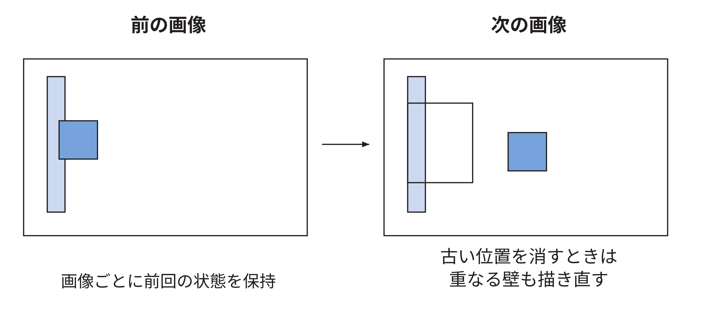

<a id="h0674"></a>
#### 壁まで消えた場合を横一列の数値で追う

説明用に横方向だけを見る。壁がx=12〜15、古いボールがx=14〜21、新しいボールがx=20〜27にあるとする。古いボールのx=14〜21を背景色で消すと、壁の14〜15も同時に消える。そのため、壁の12〜15を元の色で描き戻す必要がある。

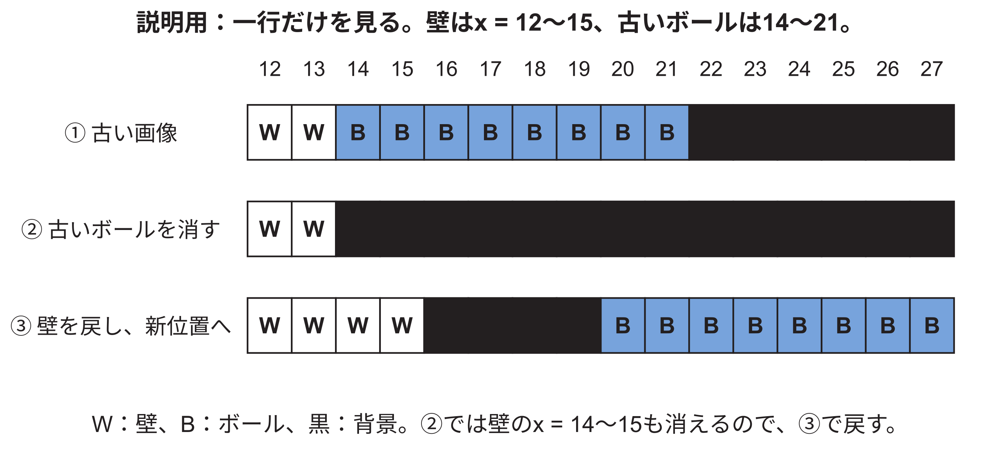

図11.6の各マスは、説明用に横方向の位置を一つずつ表す。消去はボールという物体を取り外す操作ではなく、その範囲の画素を背景色へ書き換える操作である。画素メモリには「この白はボールの所有物」という名札がないので、壁と重なった部分も一緒に消える。

BreakoutDamage.hppのchangedBoundsは変わった物体を見つけ、addDamageは画面内へ範囲を切り詰め、damageSceneは重なりを調べて描き戻す一覧を作る。overlapsは二つの四角形が重なるかを返す。関数の名前を覚える前に、「変更を見つける」「範囲を集める」「重なりを広げる」「描く一覧を戻す」という順に読む。

<a id="h0679"></a>
#### 描き直す物体がさらに別の物体へ重なる場合

具体例として、消す領域Dがx=10以上20未満、物体Aがx=18以上30未満、物体Bがx=28以上40未満にあり、y方向はすべて重なるとする。DはAと重なるが、最初はBと重ならない。Aを図形全体として描き直すことにすると、x=28以上30未満でBにも重なる。元の画像でBをAより後に描いていた場合、この重なり部分はBの色である。しかしAだけを描き直すと、その部分をAの色で上書きしてしまう。元の見た目を保つにはBも対象に加え、Aの後にBを描き直す必要がある。

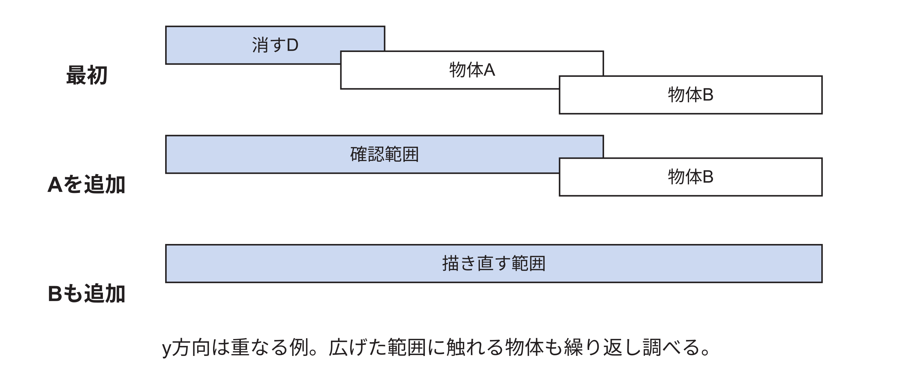

`damageScene`は、消す領域をまとめ、重なる物体を追加し、新しい追加がなくなるまで同じ確認を繰り返す。最後は黒い四角形で対象領域を消し、現在の四角形と文字を元の順番で描き直す。物体全体を描く代わりに、一つずつ細かく切り取る方法も考えられるが、この実装は図形をまとめて描く処理と組み合わせるため、物体全体の範囲へ広げている。[Console26](#ref_Console26)

この処理には計算の手間もあり、場合によっては変更範囲が広くなる。したがって「部分描画なら必ず最速」とはしない。本研究のブロック崩しでは、背景と多数のブロックがしばらく変わらず、主にボールとパドルが動く。その条件で、描画準備量の削減を実測した。

<a id="s_11_6"></a>
### 11.6 二枚それぞれに残る画像を覚える

画像AとBを交互に使う場合、描き直す側に残るのは、直前に表示した画像より一回古い画像である。図11.8では、Aへ位置100のボール、Bへ位置103のボールを描き、次にAへ位置106を描く。Aから消すべき古い位置は100であり、直前に描いたBの103ではない。このため、直前の画面だけでなく、AとBのそれぞれに何を描いたかを記録する。

図のAは白、Bは淡い青、青い枠は描き直す対象のAを示す。図と以下の表では、この同じ順序を追う。

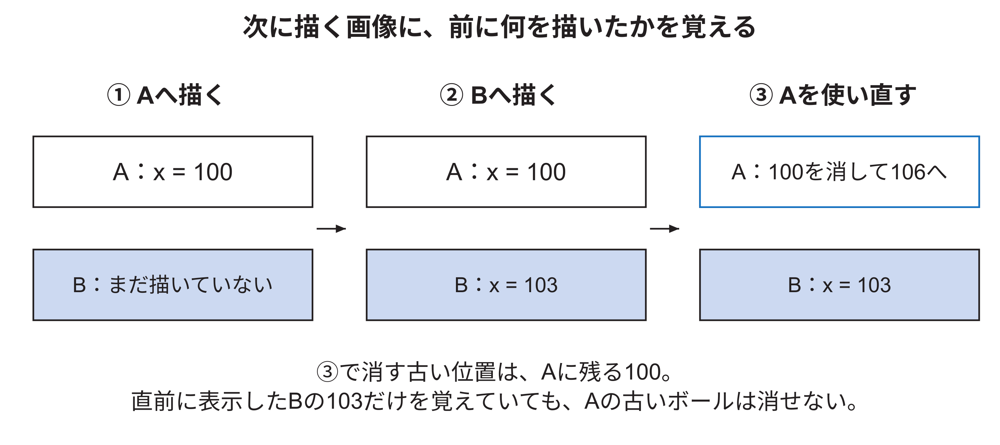

安定してA、Bを交互に使う段階の履歴は次のようになる。前回とは「直前に表示したもの」ではなく、「その保存先へ前に描いたもの」である。

| 描く順序 | 今回描く場所 | その場所に以前描いた位置 | 今回の位置 |
|---:|---|---:|---:|
| 1 | A | 初期化済みの背景 | 100 |
| 2 | B | 初期化済みの背景 | 103 |
| 3 | A | 100 | 106 |
| 4 | B | 103 | 109 |

Rendererの`previous[slot]`は、その保存先ごとの履歴である。`previous[0]`と`previous[1]`には、全画素のコピーではなく、描いた四角形と文字の一覧を覚える。その一覧を今回の一覧と比べ、消す範囲と描き戻す物体を求める。


<a id="h0691"></a>
#### 間違った履歴で消すと残る三列を計算する

8画素幅のボールで確かめる。Aに位置100のボールが残っているなら、白い範囲は横100〜107である。Bに最後に描いた位置103のボールは、横103〜110である。今からAへ位置106のボールを描きたいとする。

誤ってBの履歴を使い、Aの103〜110だけを黒くすると、Aの100〜102は白いまま残る。新しいボールを106〜113へ描いても、その三列は消えない。正しくはAの履歴100〜107を使って古い像を消す。新しい106〜113と一部が重なるので、消去を先にし、新しいボールを後に描く。

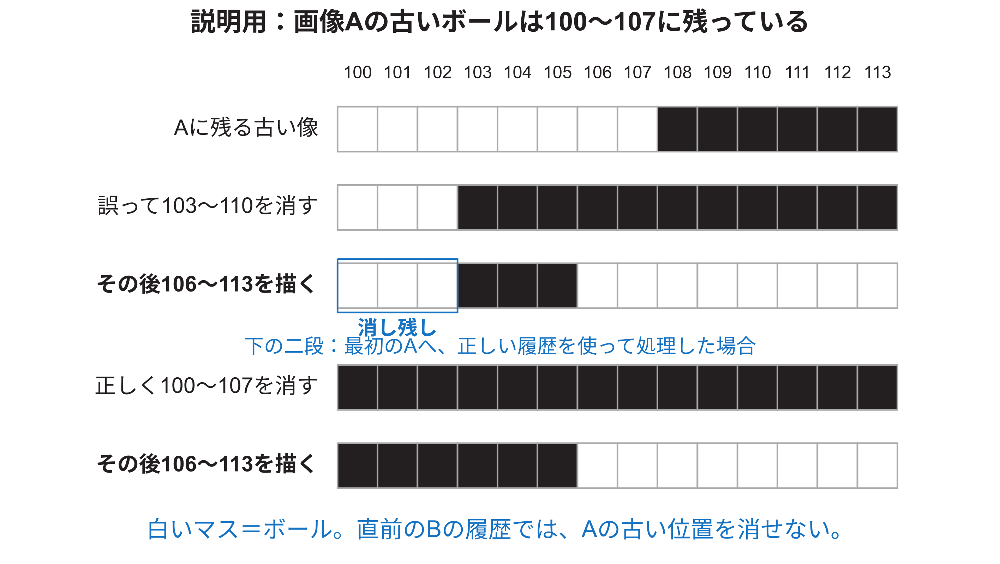

図11.9は高さ一行だけを取り出した説明図で、周りは黒、他の物体はないものとする。白いマスがボールである。上の三段は誤った履歴を使う経路、下の二段は元のAへ正しい履歴を使う別の経路を示す。青い囲みで示す100〜102の三列が、誤った履歴を使うと残る箇所である。実際には壁や文字との重なりも含め、図形一覧から同様の消去対象を計算する。

<a id="h0696"></a>
#### 起動直後の描画先と履歴をそろえる

`Renderer::draw`は、`drawn % 2`で二つの履歴を使い分ける。ただし公式の描画先は、起動直後から単純なA、B、A、Bとはならず、最初はLOC_1が二回続いてからLOC_2とLOC_1を交互に使う。このため本実装は最初の三回を全体描画とし、その後で部分描画へ移る。[RasterIX](#ref_RasterIX)[Console26](#ref_Console26)

| 描画番号drawn | 実際の描画先 | 書き換える履歴 | 描き方 |
|---:|---|---:|---|
| 0 | LOC_1 | 0 | 全体 |
| 1 | LOC_1 | 1 | 全体 |
| 2 | LOC_2 | 0 | 全体 |
| 3 | LOC_1 | 1 | 履歴1との差分 |
| 4 | LOC_2 | 0 | 履歴0との差分 |

番号0で履歴0に入れた内容は、その後、番号2でLOC_2の全体描画結果へ更新される。番号3以降は、履歴1がLOC_1、履歴0がLOC_2に対応する。こうして、これから上書きする実物の画像と、その画像の履歴が一致する。

なお、`main`側では起動直後に`present`を4回呼んでから、通常の繰り返し処理へ進む。起動直後に終了指示が届いても、この初期化を途中でやめず、両方の画像を用意してから終了するためである。三回という値はRendererが全体描画を選ぶ条件、四回という値は起動処理が先に描画と表示切り替えを行う回数を指す。四回目以降は、部分描画を選んだ場合、履歴を使った描画へ移れる。

<a id="s_11_7"></a>
### 11.7 完了待ちでsleepを使わない

sleepは、プログラムの実行を指定した時間だけ休止する処理である。画面の切り替えを待つとき、sleepしてから状態を確認すると、その間に完了していても気付くのが遅れる。次の画像の準備開始が遅れ、表示周期に間に合わなくなる場合がある。本実装の接続クラスは、完了回数が変わるまで繰り返し読む方法を使う。

この方法にも代償がある。待っている間もCPUが繰り返し読み出しを行うため、CPU使用率は高くなる。完了待ちの比較では、時間の短縮とCPU使用率の上昇を一緒に記録した。割り込みで完了を通知する別方式を実装したわけではなく、省電力化を示す結果でもない。

<a id="h0704"></a>
#### sleepで休む間に完了した場合

説明用に、待ち始めて2 ms後に回路が完了するとする。5 ms眠ってから状態を読むなら、完了を知るのはおよそ5 ms以降になる。途中の3 msは回路が未完了だった時間ではなく、CPUが確認しなかった時間である。連続して読めば、この確認の遅れを小さくできる。

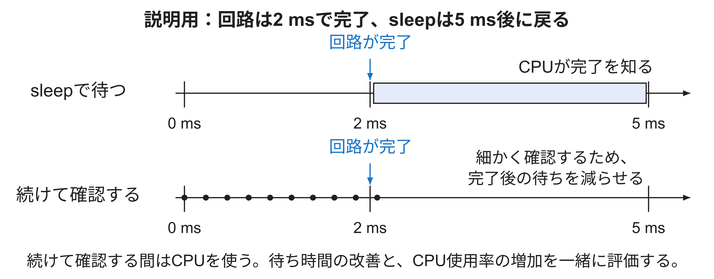

図11.10の時刻は説明用で、実測したsleepの長さではない。実際のOSでは再開時刻が指定時間と完全に一致するとは限らない。次の画像の準備を早く始められる一方、連続確認はCPUを使うため、[第13章](#ch_13)では速さとCPU使用率を並べて読む。

<a id="h0708"></a>
#### 三つの改善が減らす処理と待ち時間

呼び出しをまとめる改善では、同じ図形を渡しながら、描画の開始・終了などを繰り返す回数を減らす。部分描画では、前の画像に残っている正しい色を利用し、描き直す図形や範囲を減らす。完了待ちの変更では、描画命令の量を減らすのでなく、回路が終わった後にCPUがそれへ気付くまでの待ちを短くする。

そのため、この三つは同じ処理の別名ではない。最初の二つは主に「仕事を用意する量」に関係し、三つ目は「完了を見つける時点」に関係する。ゲームの実装では三つを組み合わせて使い、実験では描画方式と待ち方を分けて変更し、それぞれの効果を確かめた。[第13章](#ch_13)でその結果を示す。

<a id="s_11_8"></a>
### 11.8 起動し直したときの画像をそろえる

FPGAを設定した直後と、Linux上のゲームだけを終了して起動し直した場合では、メモリに残っているものが違う。ゲームの変数が初期値になっても、描画回路内部やDDR3の画像まで自動で消えるとは限らない。

修正では、内部の古い画素を初期化する順番と、表示用画像のアドレス設定を合わせた。その上で、両方の物理画像へ必要な全体描画を行う。保存した確認では、以前の緑色の画像を残した後、修正前のデモに赤色を一画面だけ要求すると古い色が残る問題を再現した。修正後は、赤色を一画面、青色を二画面、緑色を三画面要求する各試験で、終了後の表示先の画素が期待値と一致した。[E2](#ref_E2)

この一・二・三という数は、初期化処理とは別にデモへ要求した画面数である。[11.6](#s_11_6)節の「起動時に三回全体描画する」という回数を測った結果ではない。初期化後に長く動かしてから見るだけでは、起動直後の誤りが後の描画で隠れることがあるため、短い実行で終わる条件も確認した。


<a id="ch_12"></a>
## 第12章 何を確かめるために実験するか

<a id="s_12_1"></a>
### 12.1 完成した画像だけでは分からないこと

ブロック崩しの静止画を一枚見ただけでは、その後もボールが進むか、入力でパドルが動くか、何秒待ってできた画像かは分からない。また、その画像が正しくても、別のタイミングで命令を失う不具合がないとは言えない。このため、回路の信号、保存された画素、ゲームの進行、映像、処理時間を、それぞれ見る試験を用意した。

ここまでの設計には、「相手が受け取れないときは待つ」「表示が使い終わるまで古い画像を上書きしない」「描き方を変えても同じ画面にする」という具体的な条件がある。本章では、各条件を本当に満たしたか、何を入力し、何を記録し、何と比べて判断したかを説明する。

例えば一枚の画像が正しく見えても、そのときFIFOに十分な空きがあっただけかもしれない。満杯のときの接続を確認したいなら、受け取りをわざと止め、CPU側が同じ語を保って待ち、再開後に一度だけ渡す場面を作る必要がある。画面を長く眺める試験と、待ち条件を狙って作る試験では、調べられる問題が違う。

また、改善版の表示回数が増えても、完成画像から本来あるはずのブロックが半分消えていれば、同じ結果を速く作ったとは言えない。前の画像の画素を再利用して描き直す量を減らすことと、必要な物体を完成画像から省くことは違う。そこで、ゲーム状態、描くべき図形、最後の画素を照合する。その上で時間を比べる。本研究の実験は、こうした設計上の条件に対応させて行った。

<a id="s_12_2"></a>
### 12.2 四つの確認を使い分ける

| 確認 | 具体的に行うこと | 分かること |
|---|---|---|
| 回路シミュレーション | 受信やメモリ応答を意図的に遅らせる | 待ちがある場合のデータと制御の動き |
| 配置配線後の解析 | 部品使用量と信号の到着時間を調べる | 選んだFPGAとクロックで実装できるか |
| 実機の読み戻し | 実際の画像メモリを期待値と比べる | 描画された画素が合っているか |
| 映像・ゲーム実行 | 動画を取得し、ゲーム終了記録も見る | 実際の映像経路とゲームの継続動作 |

これらは互いの代わりにはならない。画像メモリが正しくても映像端子へ届かない場合がある。映像が見えても、まれな待ち条件で命令を失う場合がある。確認したい設計上の問題に対応する試験を選ぶ。

<a id="h0724"></a>
#### 実験の入口と観察する場所を先に決める

回路シミュレーションでは、パソコン上で回路の時間変化を計算する。CPUの代わりに要求を出す部分や、メモリの代わりに返事を出す部分を試験用に用意できるので、「七クロック受け取らない」「返事を遅らせる」といった条件を繰り返せる。試験用の回路を含めたものをテストベンチと呼ぶ。実物のボードへ七回ボタンを押す操作ではない。

実機の画素比較では、動作している描画回路がDDR3へ保存した色を読み戻す。一方、映像確認では、その色を映像信号へ変換して外へ送り、取り込んだ動画を見る。読み戻した色が正しくても映像の配線が誤っていれば画面は出ないので、二つを別々に確認する。

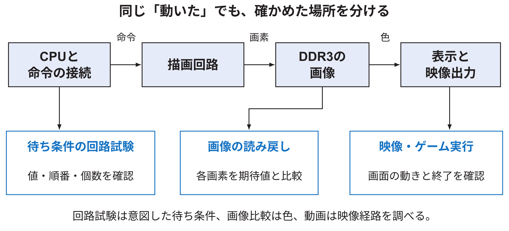

図12.1の上段は製作したゲーム機の経路、下段は試験で調べる場所である。例えば「307,200画素が一致」は画像メモリでの比較、「動画でボールが移動」は映像経路での確認に対応する。観察する場所が異なるため、それぞれの結果から確認できる範囲も異なる。

<a id="s_12_3"></a>
### 12.3 命令を待たせる試験

調べるのは「受け側が受け取りを保留している間、CPUから来た一語を失わず、受け取り再開後に一度だけ渡せるか」である。そこでテストベンチの受け側を一定期間受け取り不可にし、CPU役から書き込みを出す。待つ間は番地とデータを保ち、転送が完了してしまわないことを確認する。

再開後は値、順番、個数を照合する。A、B、Cを送ったのにA、Cなら欠落、A、B、B、Cなら重複である。一語の値だけを確認しても、この二つは分からない。保存したAPB試験は七クロック待たせる条件を含み、二回の書き込みに対して二語が正しく届くことを確認した。[E1](#ref_E1)

32 bitの上下のデータ位置、応答待ち、識別値、完了回数も検査した。結果が示すのは、試験で与えた条件における値と制御の一致であり、全信号列の数学的証明ではない。ゲーム映像が見えたという確認とも範囲が異なる。

<a id="s_12_4"></a>
### 12.4 表示先を早く再利用しない試験

表示の試験では、GPU側と表示側のクロックを異なる周期にし、メモリからの返事も遅らせる。新しい画像への読み出しが始まる前、または必要な返事が戻る前に、完了信号が出ないことを確認する。

もし返事を常に即座に返す試験だけなら、古い読み出しが残る問題を見逃す。実際のメモリでは他の要求により待たされるので、試験でもその場面を作る。保存した記録では四回の切り替えと、別のリセット試験を確認した。[E1](#ref_E1)

<a id="s_12_5"></a>
### 12.5 正しい画像をどう決めるか

期待画像は、ゲーム状態から作った図形と文字を、別のCPU側の塗りつぶし処理で画像へ変換して用意する。RasterIXで作った画像を基準にコピーするだけでは、同じ誤りを正解にしてしまうためである。

実機の画像はRGB565として読み出し、640×480の全307,200画素を比較する。例えば赤であるべき場所が青なら、その画素を不一致として数える。読み出したファイルの大きさは614,400 byteでなければならない。


図12.2では、同じゲーム状態から二通りの経路で画像を用意する。

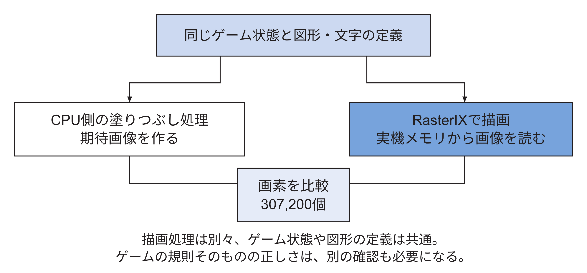

左はCPU側の比較用描画処理、右の青い箱は調べたいRasterIX側の描画と読み出しである。同じ位置同士を比較する手順を、次の小さな画像で確かめる。

<a id="h0742"></a>
#### 画素を比べる試験で何を数えているか

説明用に、横3画素・縦2画素の画像を比べる。期待画像の右上が白、実機画像の右上が黒なら、その一画素を不一致として数える。ほかの五画素が同じなら不一致数は1である。画像全体の平均の明るさや、ファイルの大きさが同じだけでは、この一画素の間違いは見つからない。

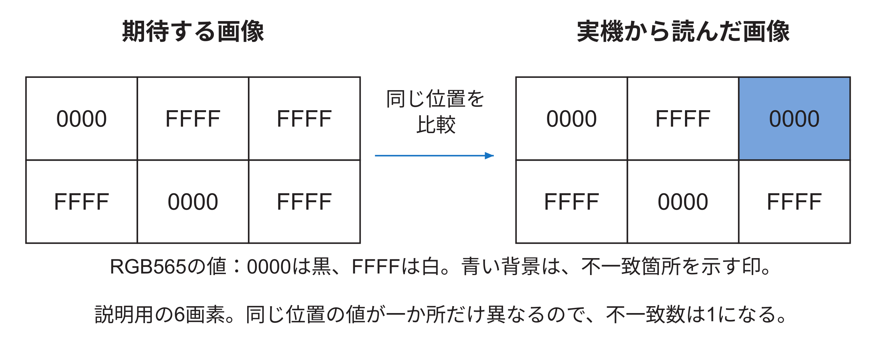

図12.3は比較の手順を示す説明用の画像である。実機ではこれを640×480=307,200画素について行う。不一致が0なら、比較したその画像の全画素が、比較に用いた期待画像と一致したことになる。

期待画像を作るCPU処理にも間違いがある可能性はある。そのため、実機と同じ描画回路で作った画像をそのまま正解にすることは避け、別の塗りつぶし処理を使った。ただし、ゲーム状態や図形の定義は共通なので、ゲームの規則そのものの誤りまで、この比較一つで発見できるとは限らない。例えば両方へ誤った得点を渡せば、同じ誤った数字が描かれて一致することはあり得る。

この理由から、ゲームの終了状態や得点、メモリの画素、実際の映像を別々に確かめる。それぞれが違う範囲の誤りを見つけるための確認である。

<a id="s_12_6"></a>
### 12.6 何に時間がかかるかを分ける

ここで知りたいのは、「次の画像が遅いとき、どの仕事を減らせば待ち時間を短くできるか」である。CPUが描画命令を作る時間、送る時間、完成を待つ時間を分けて記録すれば、改善したい処理を選ぶ根拠になる。以下では、処理の開始・終了時刻をどう引き算したかを説明する。

画面更新が遅い原因を調べるには、処理のどこで時間を使ったかを記録する。例えばCPUが命令を用意するまでに50 ms使っていたら、描画回路だけを少し速くしても、その50 msは残る。逆に、命令はすぐ渡せてもFIFO待ちが長ければ、受け側やメモリの進み方を調べる必要がある。これは原因を説明するための例であり、実測値は[第13章](#ch_13)で示す。

測定用プログラムは、ある処理へ入る直前の時刻を読み、その処理から戻った直後の時刻を読む。終了時刻から開始時刻を引いた値が、その区間に経過した時間である。例えば開始10 ms、終了65 msなら、区間は65−10=55 msになる。その間にCPUがメモリを待った時間も、処理が終わるまでに要した時間へ含まれる。

一画面分を、ゲームの計算、命令の準備、命令の転送、画像切り替え完了の待ちへ分けて記録する。ただし関数が別の関数を呼ぶため、測った時間が重なって入る箇所がある。後で引き算する理由を、表と具体例で確かめる。

| 項目 | 開始から終了までに行う仕事 | 取り違えやすい点 |
|---|---|---|
| ゲーム処理 | 入力に応じた位置や当たり判定 | 描画回路の時間ではない |
| 描画準備 | API呼び出し、頂点処理、命令生成など | ここにもCPUのメモリ待ちが含まれる |
| 転送 | CPUが命令を書き出す経路 | バスやFIFOの待ちも含まれる |
| 完了待ち | 切り替え完了回数が変わるまで | GPUの演算だけの時間ではない |
| 全体 | 一画面分の開始から終了まで | 小さな管理処理も含まれる |

一部の描画APIは内部で転送処理を呼ぶ。図12.4は、その合計60 msの内側に転送5 msが含まれる説明例である。重なりを二度足さないように、下段の準備55 msと転送5 msへ分ける。

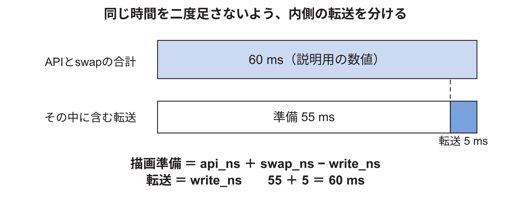

棒の長さは説明値の比であり、実測値ではない。保存した測定ファイルには、次の名前で時間を記録した。末尾の`_ns`は、単位がナノ秒であることを表す。

| 記録欄 | 時間を測る区間 | 転送時間との関係 |
|---|---|---|
| `api_ns` | 一画面の図形を描画APIで指定する処理 | 途中で命令を送る場合は、その時間も含む |
| `swap_ns` | 準備した描画命令を送り出し、画像の切り替えを依頼する処理 | この区間で行う命令転送の時間を含む |
| `write_ns` | 接続用プログラムが命令を送る処理の合計 | 上の二つの区間の内側で測る |
| `wait_ns` | 依頼後に、回路の切り替え完了を確認するまで | `swap_ns`とは別に記録する |

したがって、描画APIと切り替え依頼の合計から、その中で命令を送っていた時間を引くと、転送以外の描画準備時間が得られる。測定欄の名前で書くと、`api_ns + swap_ns - write_ns`となる。

<a id="h0759"></a>
#### 記録した一行から準備時間を計算する例

説明用に、api_nsが50,000,000、swap_nsが10,000,000、write_nsが5,000,000だったとする。単位nsをmsへ直すには1,000,000で割るので、それぞれ50 ms、10 ms、5 msである。

このAPIとswapの実行中に転送処理が含まれているなら、合計60 msの中の5 msは転送に使った時間である。転送以外の準備を求めると、50+10−5=55 msになる。準備55 msと転送5 msに分ければ、合計は元の60 msに戻る。

もしさらに完了待ちが20 ms、ゲーム処理が1 msなら、説明用の総時間は55+5+20+1=81 msとなる。60+5+20+1=86 msとすると、転送を二回数えたことになる。実際の記録には小さな管理処理や測定区間の境目もあるため、この説明の四項目が常に測定した総時間へぴったり一致するとは限らない。各区間の厳密な定義は、実験記録[E4](#ref_E4)のMETHODS.mdに示す。

なお、CPUがMMIOを書いている間に、描画回路も前の命令を処理できる。CPUで測った各区間を、独立した部品が順に一つずつ働く時間と解釈しない。完了待ちが短いことだけから、GPUの処理時間が短いとは結論できない。GPUの仕事が転送中に進んでいた可能性があるためである。

<a id="s_12_7"></a>
### 12.7 比較条件をそろえる理由

描き方を変えた効果を知るために、まず比較するゲーム状態を同じにする。例えば一方には「ブロックが40個残る場面」、もう一方には「2個しか残らない場面」を渡すと、描き方だけでなくゲームの場面まで違う。そこで両方へ、同じ40個のブロック、同じボール位置、同じ得点を渡し、完成させる画像をそろえる。

そろえるのは、画面に存在する物体と、その位置・色である。実際に描き直す物体の数まで同じにするわけではない。全体描画は変わらない物体も毎回描くが、部分描画は前に保存した画素を再利用できる。例えば40個のうち2個だけを描き直しても、残る38個が正しい画素として保存され、完成画像が同じなら、意図した仕事量の削減である。この削減も含めて描き方の違いを比較する。

時間に合わせて自由にゲームを進めるだけでは、速い方式は途中の画像を多く描き、遅い方式は途中を飛ばす。そこで方式比較用のプログラムでは、描くゲーム状態の順番を固定し、同じ180状態を各方式へ与えた。速い方式は、同じ順番を描き終えるまでの時間が短くなる。通常のゲームが動くかを調べる約80秒の試験とは、目的も進め方も違う。

描画方式の比較実験E4では、さらにCPU周波数、解像度、映像出力構成、入力、準備回数、測定回数をそろえた。描き方は同じ実行ファイルへ`--grouped`などの引数を渡して選ぶ。別々に生成したプログラムを使い、片方だけコンパイラの設定が違っていたという条件を避けやすくするためである。

比べたい変更そのものまで同じにするわけではない。呼び出しをまとめれば、実行するCPU命令の順序や回数が変わり、キャッシュの使われ方も変わる。この変化は、その実装方式を選んだ効果に含む。一方、片方だけ解像度を下げるなど、調べたい変更と無関係な違いは入れない。

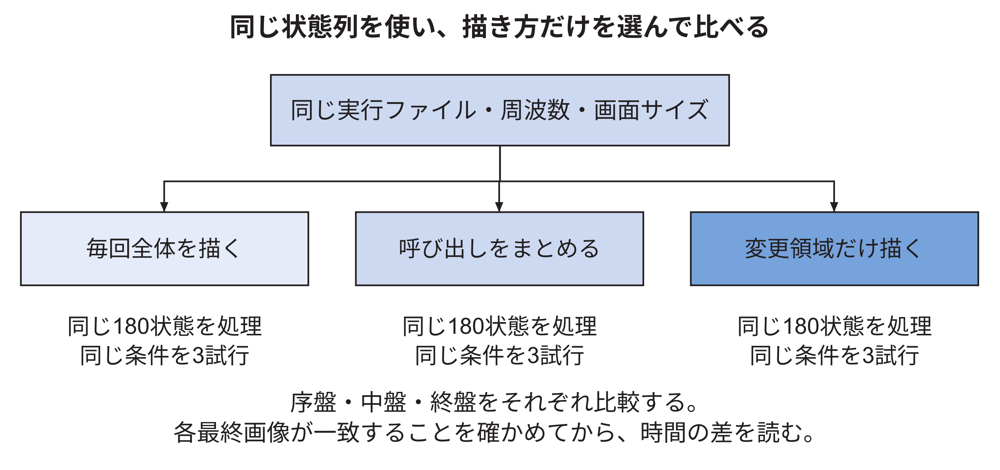

方式が違っても同じ180状態を順に描き、最後の画像が一致することを確認する。序盤、中盤、終盤の各場面で、それぞれ三回ずつ測る。ボールの位置や残るブロックまで違う実行を比べると、描き方の効果と場面の違いを区別しにくくなる。共通の入力条件を先に決めるのは、このためである。

<a id="s_12_8"></a>
### 12.8 繰り返し、中央値、ばらつき

ここでは描画方式の比較実験E4を例に、実行回数の数え方と結果のまとめ方を説明する。一回の試行では、準備用の30画面を処理してから、測定対象の180画面を続けて処理する。準備の30画面は、起動直後だけの状態を比較から外すために置く。180画面分の時間と状態を記録して、一回の試行の結果を求める。

同じ条件でも、OSの他の処理や待ちの入り方によって結果が多少変わる。そのため、プログラムを実行する試行を三回繰り返す。例えば毎秒の処理回数が12.1、12.4、12.3だったら、小さい順は12.1、12.3、12.4であり、中央の12.3を中央値と呼ぶ。最小12.1と最大12.4も残せば、三回がどれだけ違ったかを確認できる。

平均と95百分位は、また別の問いに使う。一画面の処理時間を平均すると、全体として一画面にどれだけ時間を使ったかを読める。95百分位は、処理時間を短い順へ並べたとき、おおむね95%がその値以下になる位置の値であり、ときどき遅くなる側を調べる指標になる。平均だけが小さくても、一部で長く待つ現象は残り得る。

同じ試行内の180画面は前の処理結果を引き継ぐ。例えば一度読んだデータがキャッシュに残り、部分描画では前に描いた画像も次の処理へ影響する。そのため、180画面をそれぞれ独立に起動し直した180回の実験と数えない。本研究では三試行を反復の単位として結果をまとめた。

描画方式の比較実験[E4](#ref_E4)の27試行は、三場面×三方式×三回である。一試行180状態なので、27×180=4,860状態の記録になる。この数は「4,860枚の実機画面をすべて全画素比較した」という意味ではない。状態列の一致と、各試行の最後の画像の全画素一致を分けて確認している。

図12.6は、E4の試験を外側の組合せと、実行一回の内側に分けて示す。まず上段の掛け算で27回の実行を数え、次に下段で一回から何を記録したかを見る。

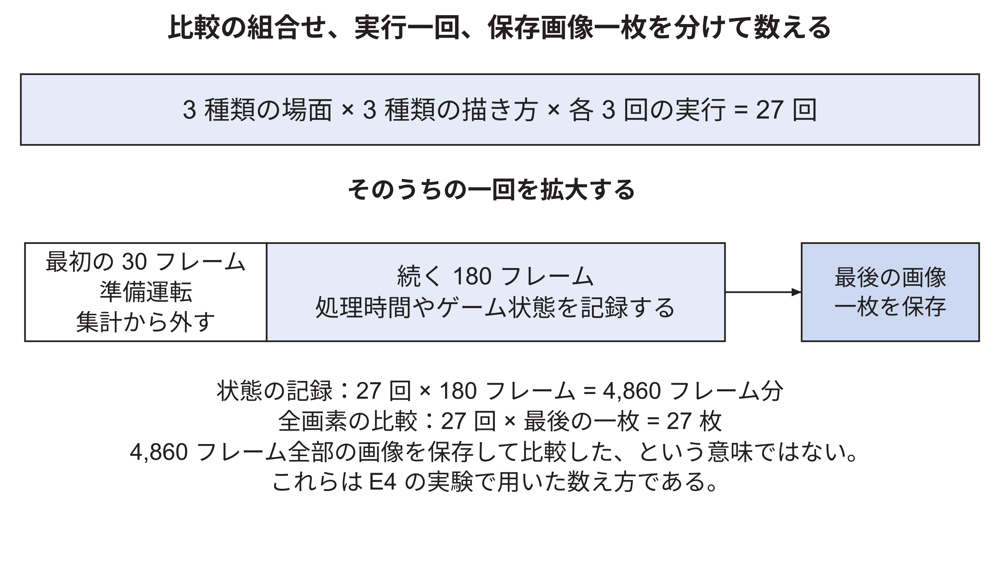

時間や状態の記録を4,860フレーム分持つことと、4,860枚の画像を全画素比較することは異なる。本実験の全画素比較は各実行の最後の一枚について行ったため27枚である。この図の回数を、別条件で行ったE5などへそのまま当てはめない。


<a id="s_12_9"></a>
### 12.9 時計の単位と測定の精度

1 msは1秒の千分の一、1 nsは1秒の十億分の一である。ただしns単位の整数を記録できても、1 nsの差を正確に区別できるとは限らない。例えば説明用に、10 nsごとにしか更新されない時計なら、値は0、10、20と飛び飛びに変わる。記録欄に一桁単位で書けることと、その一桁を実際に測り分けられることは違う。

また、開始・終了の時刻を読む処理自身もCPUを使う。短い処理へ何度も測定を挟むと、時計を読む負担が目立つ。本研究では数十msの区間を比べたが、実行位置の採取を頻繁に追加する診断では処理時間が増えた。[E5](#ref_E5) 各関数や各CPU命令が全体の何%を占めるかを、この診断だけから精密に断定していない。より細かな区間へ分ける場合には、時計の更新間隔と計測の負担を別に調べる必要がある。

<a id="ch_13"></a>
## 第13章 実験結果と考察

<a id="s_13_1"></a>
### 13.1 評価する項目と実験構成

[第12章](#ch_12)の方法を用い、接続の動作、FPGAへの実装、ゲームの継続動作、描画負担の改善、命令接続方式の選択を評価した。本章では、まずゲーム機全体が動くことを確認し、次にソフトウェアと接続回路を変更した効果を示す。

実験には、[4.2](#s_4_2)節の基準版と接続比較版を用いた。また、映像出力には標準DVI構成と実験用720p HDMI構成がある。以下の表は、各実験の目的と使用した構成を対応付けたものである。E1〜E7は、末尾の実験記録一覧に対応する識別子である。E7では、命令転送の機能シミュレーションに加え、実機で送信処理、内部DMA、描画用作業領域の容量を比較した。モデルによる検証と実機測定の条件・結果は分けて示す。

| 記録 | 使用した版と構成 | 評価する項目 |
|---|---|---|
| E1 | 基準版に対応する標準DVI構成 | APB接続、表示切り替え、CPU、配置配線後の時間条件 |
| E2 | 基準版に対応する標準DVI構成 | 四段階のゲーム実装の継続動作、最終画像、映像 |
| E3 | 基準版に対応する標準DVI構成 | FPGA資源の使用量 |
| E4 | 基準版に対応する実験用720p HDMI構成 | 同じゲーム状態での描画方式と待ち方の比較 |
| E5 | 基準版に対応する描画準備の診断用構成 | 呼び出し回数と図形数が準備時間に与える影響 |
| E6 | 接続比較版、標準DVI出力 | 命令接続の比較、計測回路を除いた構成の動作、テクスチャ描画と映像受信の制限 |
| E7 | 通常構成と実験用回路の実機、機能シミュレーション | CPUの送信処理、内部DMA、共有メモリでの待ち、描画の修正候補、作業領域の容量 |

E1〜E5は2026年9月9〜14日、E6は同年10月8日、E7は同年10月9日の記録である。比較する方式の間では、ソースの版と映像出力をそろえた。異なる実験群の数値を直接比較して、公式ソースの変更による高速化や映像形式の優劣を判断することはできない。各実験の生成物と設定は、それぞれの記録に示す。

<a id="h0790"></a>
#### ゲームの継続動作と、同じ画像列を描く速さ

ゲームの動作確認では、通常のプログラムを実時間に合わせて進める。描画が遅い場合もゲームの時刻は進むため、方式によって表示まで作れた途中の画像数が異なる。[13.2](#s_13_2)〜[13.5](#s_13_5)節では、接続、実装条件、ゲーム終了状態、画素と映像を確認する。

一方、描画方式の性能比較では、全方式へ同じゲーム状態を同じ順番で与える。これにより、描く内容をそろえたうえで処理時間を比較する。[13.6](#s_13_6)〜[13.8](#s_13_8)節で、描画方式、準備する仕事、完了の待ち方を変更した結果を示す。

命令接続の評価では、ゲームとクロックをそろえ、CPUからRasterIXへ語を渡す部分を取り替える。[13.10](#s_13_10)〜[13.14](#s_13_14)節で、送信待ち時間と必要な回路量を比べる。[13.15](#s_13_15)節では計測回路を除いた構成の動作を、[13.16](#s_13_16)節ではブロック崩しの試験だけでは分からなかった描画と映像受信の制限を示す。さらに13.17〜[13.19](#s_13_19)節では、命令を送るDMA、CPUが実行する送信処理、描画用の内部メモリ容量をそれぞれ変えた場合を比較する。

<a id="s_13_2"></a>
### 13.2 接続と起動の確認結果

E1では、APBの書き込み待ちと応答待ちの試験を通過した。表示切り替えでは、異なるクロックと遅れたメモリ応答を与えた四回の切り替えを通過した。リセット解除を扱う別試験も通過した。

実機では赤、緑、青の画像について、それぞれ307,200画素を照合した。また、64、256、4,096、65,536 byteのデータ転送を確認した。Linux起動と4 MiBのメモリ試験も行った。ただし、4 MiBの試験から512 MiBの全番地を検査済みとは言わない。[E1](#ref_E1)

統合作業中にはCPU側の例外処理に関連する問題も修正した。例外に入る処理が遅れた条件で、失敗したメモリ要求が余分に外へ出る問題である。保存試験では10個の要求に対して20回だった外部転送が、修正後は10回になった。修正対象は、Wally側の例外処理とメモリ要求の制御である。関連する整数命令50件とSv39の37件の試験も保存されている。[E1](#ref_E1)

<a id="s_13_3"></a>
### 13.3 時間条件を満たしたか

配置配線後の最小のsetup余裕は+0.170 ns、hold余裕は+0.008 nsであった。[E1](#ref_E1) setupは次のクロックで値を受け取るために十分早く届くか、holdは受け取った直後に値が早く変わり過ぎないか、という条件である。正の余裕は、指定した条件の範囲内に収まったことを示す。

この余裕は小さく、他の周波数でも問題ないことを示す値ではない。また、制約が抜けた信号は、正しく評価されない可能性がある。レポートの数値とともに、クロック認識、未解析経路、配線、設計規則も見る。保存した結果では配線違反0、DRC（回路の接続や配置などの設計規則検査）のエラー0、CDC（異なるクロックをまたぐ接続）の解析における重大な指摘0であった。DRC警告は220件残っていた。エラー0という結果と、警告が残ることを区別して評価する。

資源が空いていることと、時間条件に余裕があることの違いは[付録J.9](技術付録.md#s_J_9)で説明する。制約の指定を変えただけで物理的な受け渡しが安全になるわけではない。

<a id="s_13_4"></a>
### 13.4 FPGAの資源はどれだけ使ったか

以下のBlock RAMの使用量は、36 Kbit分を1個として数える。18 Kbit分だけ使う場合は0.5個に相当する。後の命令FIFO単体の表では18 Kbit単位を使うため、個数を比較するときは単位も合わせる。

| 資源 | 使用量 | FPGA全体 | 使用率 |
|---|---:|---:|---:|
| LUT | 64,835 | 134,600 | 48.17% |
| レジスタ | 47,916 | 269,200 | 17.80% |
| Block RAM | 210 | 365 | 57.53% |
| DSP | 61 | 740 | 8.24% |

LUTは小さな論理の計算、レジスタは状態の記憶、Block RAMはまとまったデータの保存、DSPは乗算などに使う専用資源である。表は標準DVI構成全体の配置配線後の結果であり、RasterIXを加えたことによる増加量だけを測った表ではない。[E3](#ref_E3)

この構成ではBlock RAMが155個分残る。しかし、空きがあることと、内部作業領域を増やせば速くなることは別である。配置・配線の時間条件、ライブラリの帯分割、実際に減る処理を確認する必要がある。[13.19](#s_13_19)節では接続比較版を基に容量を2倍へ変更し、速度と資源使用量を比べる。二つの容量の比較であり、65,536画素分があらゆる条件で最適とは主張しない。

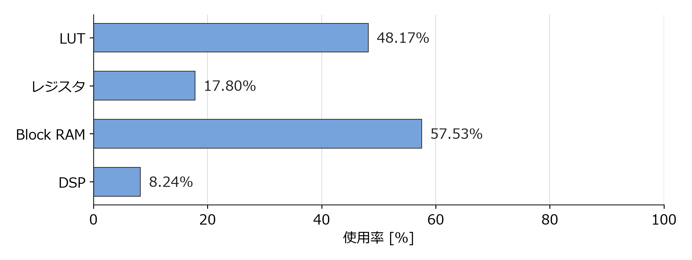

<a id="h0808"></a>
#### 使用率の表を自分で一行計算する

LUTの48.17%は、使った64,835個を全体の134,600個で割り、100を掛けた値である。BRAMも210÷365×100で約57.53%になる。「余裕がある」と言うとき、何の資源にどれだけ余裕があるかをこのように分ける。

LUT、レジスタ、BRAM、DSPは別の種類の資源なので、四つの使用率を足して「FPGA全体の使用率」とはしない。例えばDSPが余っていても、そのまま不足するBRAMへ自由に置き換えられるわけではない。また、この表はCPUや表示、メモリ接続を含む全体の結果である。RasterIX単体の使用率や、追加による増加量を求めるには、対応する階層や比較用の構成を別に確認する。

<a id="s_13_5"></a>
### 13.5 標準DVI構成でのゲームの継続動作

基準版の標準DVI構成で、描画と完了待ちの処理を段階的に変更した四種類の実装を、それぞれ約80秒自動操作した。すべて400点、残機3でクリアし、最終画像の不一致は0画素であった。[E2](#ref_E2)

| 段階 | 切り替え完了数 | 状態更新数 | 実行時間 | 最終画素不一致 |
|---|---:|---:|---:|---:|
| 全体を毎回描く | 1,293 | 4,798 | 80.020 s | 0 |
| 呼び出しをまとめる | 1,432 | 4,798 | 80.020 s | 0 |
| 変更領域だけ描く | 3,956 | 4,799 | 80.000 s | 0 |
| 完了を連続して確認する | 4,654 | 4,799 | 80.002 s | 0 |

この試験は、実時間に合わせてゲームを進める通常のプログラムを使う。状態更新数が近く、描画完了数が異なるのは、時間の進み方をそろえながら、描けた画像の数が増えたためである。ただし、各方式が描いた全中間状態の列まで同じではない。方式の性能を厳密に比べるための試験は、次節で別に示す。

三つの改善を組み合わせた実装では、4,654 ÷ 80.002 = 約58.17回/秒で、回路の切り替え完了を確認した。これは画面上の異なる画像を光学的に数えたFPSではない。約94.97秒の録画も全フレームを復号し、エラー0を確認した。複数の時間帯でボールが移動し、ゲームが見えている5,389録画フレームで左右の壁を検出した。全中間画像の全画素一致を検査したという意味ではない。[E2](#ref_E2)

<a id="s_13_6"></a>
### 13.6 同じ状態列で描き方を比べる

E4では、同じゲーム状態を一画面ずつ進める測定専用プログラムを用いた。準備30画面の後に180画面を測定し、序盤・中盤・終盤の三場面、三方式、各三回で、合計27試行を行った。待ち方はすべてsleepに固定した。

| 場面 | 全体描画 | 呼び出し統合 | 変更領域の描画 |
|---|---:|---:|---:|
| 序盤 | 12.44回/秒 | 14.88回/秒 | 48.65回/秒 |
| 中盤 | 15.00回/秒 | 19.04回/秒 | 55.97回/秒 |
| 終盤 | 19.82回/秒 | 20.00回/秒 | 58.37回/秒 |

値は各条件三試行の中央値であり、切り替え完了数を経過時間で割ったものである。序盤では、全体描画から変更領域の描画へ変えることで、描画準備が53.57 msから6.57 msへ、命令量が一画面当たり30,912 byteから3,558 byteへ減った。27試行で得た合計4,860件の状態記録を照合し、同じ場面を与えた方式間で状態列の一致を確認した。さらに、各試行の最後の画像、計27枚について307,200画素すべての一致を確認した。4,860枚すべての画像を全画素比較したという意味ではない。[E4](#ref_E4)

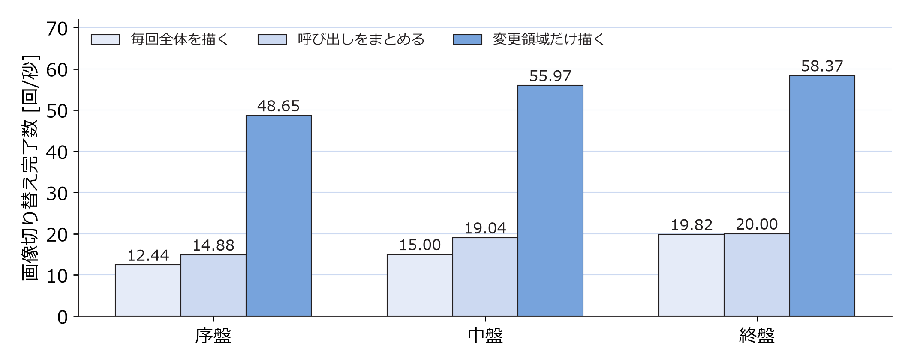

<a id="h0821"></a>
#### 結果の一行から何が分かるかを順に読む

序盤の行では、全体描画が12.44回/秒、変更領域の描画が48.65回/秒である。比は48.65÷12.44で約3.91となる。この条件では、切り替え完了の平均的な速さが約3.91倍になったと読める。CPUの動作周波数を約3.91倍にしたという意味ではない。

同じ行の準備時間は53.57 msから6.57 msへ減った。差は47.00 msで、元の準備時間に対して約87.7%の減少である。命令量も30,912 byteから3,558 byteへ減った。図形を準備する仕事と、送る量が減ったことが、速くなった仕組みの説明になる。

この比較では、同じゲーム状態を描き、最後の画像が一致することを確認した。従って、ボールの計算を飛ばしてゲームの内容を省いた結果と区別できる。一方、数値は実験用HDMI構成で測ったものである。標準DVI構成の動作確認には、その構成で別に実行した13.5節の記録を使う。

<a id="s_13_7"></a>
### 13.7 どの処理が重いかをさらに調べる

区間ごとの測定からCPU側の描画準備が長いと分かったため、E5では準備する仕事を変えて原因を絞った。まず同じ静止画像の78個の四角形について、画像と命令量をそろえ、呼び出しを78回から二回へまとめた。準備時間は57.958 msから47.883 msへ減った。差の57.958−47.883=10.075 msは、呼び出しをまとめる変更で減らせた負担である。[E5](#ref_E5)

それでも47.883 msが残った。次は呼び出しを二回に固定し、各ブロックの四角形を4個または16個の小さな四角形へ分けた。同じ範囲を同じ色で埋めるため、完成画像は変わらないが、ライブラリへ渡す図形数は増える。78個では47.883 ms、198個では109.816 ms、678個では360.655 msとなった。回数を固定しても時間が増えるため、図形に伴う頂点や命令の処理も改善対象になる。この結果は、部分描画によって準備する図形自体を減らす方針を支持する。

二つの比較は、改善できる仕事として「呼び出しの繰り返し」と「図形の準備量」を絞り込んだものである。各CPU命令やキャッシュミスに何nsかかったかまでは分解していない。得られたのは、同じCPUと描画回路を使いながら、呼び出しと図形の数を減らすことで準備時間を短縮できるという結果である。

図13.3は、E5の保存済みの数値を二つのグラフに分けて表したものである。上は図形数を固定して呼出しのまとまりを変え、下は呼出しのまとまりを固定して図形数を変える。棒が短いほど、一フレームの描画準備にかかった時間が短い。[E5](#ref_E5)

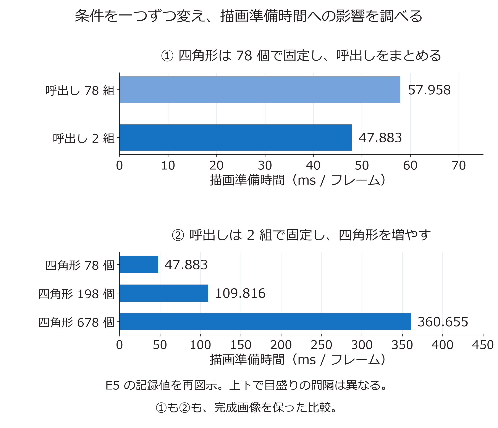

上では57.958−47.883で10.075 ms短くなった。一方、下では二組にまとめても、四角形が増えると準備時間が増える。この二つから、呼出しのまとめ方と、準備する図形の量の両方が改善対象になると分かる。上下は横軸の上限が違うため、棒の長さだけを上下で比べず、数値と目盛りを読む。回路内の個々の処理時間を直接測った図ではない。


<a id="s_13_8"></a>
### 13.8 待ち方を変えた結果

描き方を部分描画に固定し、sleepを使う場合と連続して確認する場合を比較した。序盤・中盤・終盤の3場面について、待ち方2通りを各3回測ったため、合計18試行である。序盤の完了数は47.62回/秒から58.07回/秒へ増え、遅い側の処理時間を表す95百分位は31.93 msから16.74 msへ減った。[E4](#ref_E4)

一方、CPU使用率はsleep側の約85〜87%に対して、連続確認側は約99%になった。この使用率には起動処理も含まれる。結果は「待ち方を変えると次の仕事を早く開始できる」という効果と、そのためにCPUを使い続けるという性質を示す。

<a id="s_13_9"></a>
### 13.9 描画準備の改善と、命令接続に残る送信待ち

[13.5](#s_13_5)〜[13.8](#s_13_8)節では、同じゲームを実行しながら描画負担を減らせることを確認した。呼び出しの統合と部分描画は、CPUが準備する仕事と命令量を減らす。完了の連続確認は、回路の完了に気付くまでの遅れを減らす。ただし、後者にはCPUを使い続ける負担がある。

これらの改善後も、CPUからRasterIXへ描画命令を送る処理は残る。[第7章](#ch_7)で示した接続方式によって、この送信時にCPUを待たせる条件が変わる。以下ではソフトウェアの描画方式をそろえたうえで接続回路を取り替え、待ち時間を減らす効果と、必要な回路量を評価する。

<a id="s_13_10"></a>
### 13.10 命令接続方式の比較方法

命令接続方式の比較実験[E6](#ref_E6)では、一語ごとに受取確認を待つ方式と、FIFOへ複数語を預ける方式を比較した。評価するのは、同じ命令列を渡す際のCPUの待ち時間と、その接続に必要なFPGA資源である。どの方式でも語の順序と個数を保ち、同じゲーム画像を作れることを前提として検査する。

比較したのは次の三方式である。CPUの20 MHz、RasterIXの100 MHz、ゲーム画面の640×480は変えない。CPUからRasterIXへ向かう命令の接続だけを変更し、逆向きの応答FIFOは512語のままとした。

| 命令の接続方式 | CPUの書き込みが完了する条件 | その方式の考え方 |
|---|---|---|
| 1語ずつ渡す | RasterIXが受け取り、その通知がCPU側へ戻った | 現在の1語を保持し、次の語は待たせる |
| 16語FIFO | FIFOの入口へ1語を保存できた | 少量を先に預かる |
| 512語FIFO | FIFOの入口へ1語を保存できた | 最大512語を先に預かる |

1語ずつの方式も、異なるクロックを安全にまたぐ回路を持つ。データを保持し、要求を送り、受け取り確認を待つ。信号線を直接つないだだけの方式ではない。また、保持中の1語はあるが、後続の語をためる待ち行列はない。この方式を本実験での「FIFOなし」とする。

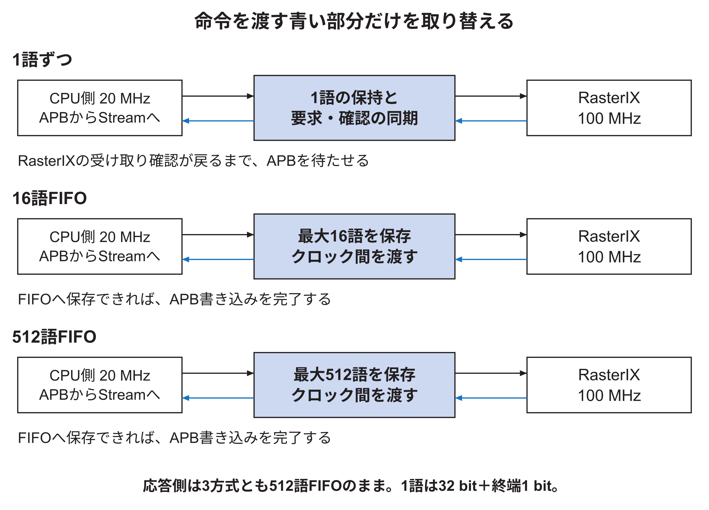

図13.4では、青い部分だけを取り替えた。黒い矢印は命令データ、青い戻り矢印は受け取れることや受け取り完了の通知を表す。FIFOでは、入口に保存できればCPUが次へ進める。1語ずつの方式では、RasterIX側の受け取り確認がCPU側へ戻るまで待つ。この違いがCPUの待ち時間へどう影響するかを測る。

一語方式には、要求と確認を順に上げて下げる4相ハンドシェイクを用いた。通知を反転させる方式など、別の一語転送方式は比較していない。したがって、得られる性能差はここで実装した三方式の間の差である。

<a id="s_13_11"></a>
### 13.11 同じゲーム状態と命令量で比較する

三方式はすべて、[4.2](#s_4_2)節で定義した接続比較版と標準DVI出力を用いる。CPUとRasterIXのソース、クロック、ゲームプログラムを共通にし、命令接続の違いを評価する。

三つの回路で同じ実行ファイルを動かした。ゲームの開始状態を初期状態、1,800ステップ後、3,600ステップ後の三つに固定する。それぞれについて、全体描画、呼び出しを統合した描画、変更領域だけの描画を試した。30フレームの慣らし運転をした後、180フレームを測り、各条件を3回ずつ繰り返した。待ち方は連続確認にそろえた。

ゲームの比較は、3接続方式×3開始状態×3描画方式×3回で81回となる。これとは別に、用意済みの同じ命令列を送り直す試験を各接続方式3回、合計9回行った。接続方式の比較は計90回、16,200フレームである。用意済み命令の再送は、ゲームが毎回命令を作る処理を省くため、ゲーム全体の速さと混ぜない。

全90回について、記録された状態と転送量を、対応する入力条件の間で照合した。同じ開始状態と描画方式では、接続方式を変えても状態列とフレームごとの転送バイト数が一致した。さらに、回路で数えた転送語数の4倍が、ソフトウェアの転送バイト数と一致した。描画方式が異なるゲームの比較でも、同じ開始状態からは同じ状態列を描いた。ただし、部分描画は命令量を減らすため、描画方式間で転送量まで同じにする比較ではない。

画面の確認は、三つの接続方式・開始状態・描画方式の初回、計27条件で行った。各条件の最後の307,200画素すべてを、ゲーム状態から別に用意した正解画像と比較し、すべて一致した。16,200枚すべての画像を読み出して比較したという意味ではない。

<a id="s_13_12"></a>
### 13.12 CPUの送信待ちはどれだけ減ったか

初期状態から毎回全体を描いたときの結果を示す。各値は、一回180フレームの平均を求めた後、3回の中央値を取ったものである。

| 1フレーム当たりの時間 | 1語ずつ | 16語FIFO | 512語FIFO |
|---|---:|---:|---:|
| 命令の送信処理全体 | 11.971 ms | 9.542 ms | 7.481 ms |
| その中に含まれるAPB待ち | 4.393 ms | 2.254 ms | 0.465 ms |

命令の送信処理には、CPUがメモリ上の命令を読み、命令用レジスタへ順番に書く処理が含まれる。APB待ちは、その書き込み中に「まだ完了できない」と返されたクロック周期だけを数えた時間である。したがって、11.971 msと4.393 msを足してはいけない。4.393 msは11.971 msの中に含まれる。

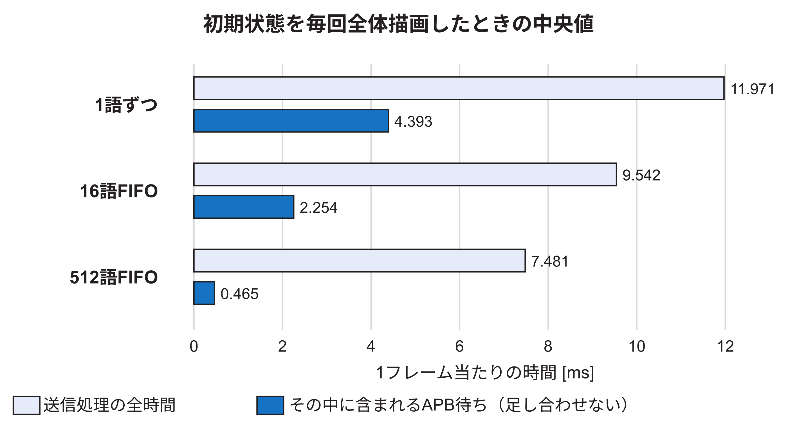

図13.5の淡い青は送信処理全体、濃い青はその中のAPB待ちである。二つの棒を上下に分け、同じ目盛りで表示した。1語ずつの方式から512語FIFOへ変えると、APB待ちは約89%減った。計算は、短くなった時間を元の待ち時間で割る。すなわち、(4.393−0.465)÷4.393×100で約89%となる。

この結果から、20 MHzのWallyでも、接続先の都合で送信が待たされる場面があると分かる。ただし、1語ずつの方式には、要求と確認がクロック間を往復する時間も含まれる。待ち時間のすべてをRasterIXの描画計算時間と解釈することはできない。

同じ条件の画面切り替え完了回数は、1語ずつで11.964回/秒、16語FIFOで13.982回/秒、512語FIFOで14.628回/秒であった。一方、変更領域だけを描く条件では、それぞれ57.579、58.202、58.202回/秒となり、差は小さかった。送信が早く終わっても、次の表示切り替え時刻を待つ場合がある。送信待ちの約89%減少は、ゲーム全体が約89%速くなることを意味しない。

<a id="s_13_13"></a>
### 13.13 回路の費用と採用判断

次は、命令を渡す接続モジュールだけの配置・配線後の使用量である。CPU、描画本体、計測用カウンタを含むシステム全体の使用量ではない。

| 接続方式 | LUT | レジスタ | 18 Kbit BRAM |
|---|---:|---:|---:|
| 1語ずつ | 15 | 80 | 0 |
| 16語FIFO | 85 | 178 | 0 |
| 512語FIFO | 96 | 165 | 1 |

16語FIFOは一部をLUTメモリとして作り、512語FIFOは専用のBRAMを使う。このため、保存容量が大きい512語FIFOの方がレジスタ数は少ない。LUT、レジスタ、BRAMをそれぞれ分けて読む必要がある。

512語FIFOが使う18 Kbit BRAM 1個は、このFPGAのBRAM総容量の約0.14%に当たる。比較した三方式の中でCPUの送信待ちが最も短く、この基板でのBRAMの負担も小さいことから、本構成には512語FIFOが適すると判断した。一方、LUTとレジスタを最も少なく使うのは一語方式であり、回路量を優先する場合には利点がある。

一語方式でもブロック崩しが動いたことから、複数語のFIFOは接続の成立に不可欠ではない。採用の根拠は、本条件で得られた送信待ち時間と資源使用量の関係である。32語、64語、128語などは試していないため、512語が必要最小容量や全候補中の最適容量であるかは未評価である。

<a id="s_13_14"></a>
### 13.14 FPGA再設定とLinux再起動後の比較

[13.11](#s_13_11)〜[13.12](#s_13_12)節の三回の反復は、各回路を設定した後の同じLinux起動中に行った。起動状態を変えても送信待ちの傾向が再現するかを調べるため、512語、一語、16語の順でFPGAを再設定し、Linuxを再起動した。初期状態の全体描画と変更領域描画を各3回測り、3接続方式×2描画方式×3回の18回、3,240フレームを記録した。ここで行ったのは回路の再設定とOSの再起動であり、基板の電源投入の反復ではない。

全体描画のAPB待ちは、1語ずつで4.387 ms、16語FIFOで2.267 ms、512語FIFOで0.469 msとなり、[13.12](#s_13_12)節と同じ傾向だった。この再起動後の試験でも、ゲーム状態、転送量、画面切り替え連番を照合した。各接続・描画方式の初回、計6画面で全307,200画素が一致した。90回の接続比較と再起動後の18回は、それぞれ別に集計した。

ただし、16語FIFOの全体描画は、再起動後の3回で13.03〜13.87回/秒に変動した。送信時間は近い値でも、表示の4周期分で更新できた回数と、5周期分かかった回数の割合が変わっていた。接続比較版の標準DVI回路の表示周期は約16.719 msなので、4周期は約66.9 ms、5周期は約83.6 msである。切り替えに間に合うかどうかで、送信時間の小さな差が更新間隔の1周期分に表れる場合がある。

どの割り込みやキャッシュの状態がこの変動を起こしたかまでは特定していない。3回の最小値・最大値は、測った範囲でのばらつきを示す値であり、統計的な信頼区間ではない。小さな更新回数の差を普遍的な優劣として扱わず、再現した送信待ちの減少と資源量を採用判断の主な根拠とする。

<a id="s_13_15"></a>
### 13.15 計測回路を除いた構成の実装と継続動作

接続方式の比較には、転送語数や待ち周期を数える計測回路を組み込んだ。本節では、それを含まないゲーム機の構成を「通常版」と呼び、生成から起動、画像、継続動作までを確認する。ソースには接続比較版、命令接続には512語FIFO、映像出力には標準DVI回路を用いる。

この版の統合では、[8.3](#s_8_3)節のテクスチャページサイズを合わせる必要があった。回路側の設定は2,048 byte、ソフトウェアの既定値は4,096 byteであった。ソフトウェアが想定する区切りと、回路が読み取る区切りが違うため、文字の一部が欠けた。Wally側のCMake設定へ`RIX_CORE_TEXTURE_PAGE_SIZE=2048`を明記すると、同じ回路で519画素あった不一致が0になった。公式RasterIXのファイルは変更していない。比較実験には、この修正後の同じ実行ファイルを使った。

通常版は、生成済みIPを使い回さず、`make nexysvideo-rasterix`でIP生成から配置配線まで実行した。合成時のレジスタ再配置と配置・配線の設定を調整し、クロック周波数や公式RasterIX内部を変更せずにタイミング条件を満たした。

| 通常版の確認項目 | 接続比較版での結果 |
|---|---:|
| 最小setup余裕 | +0.018 ns |
| 最小hold余裕 | +0.014 ns |
| LUT | 67,166 / 134,600（49.90%） |
| レジスタ | 50,890 / 269,200（18.90%） |
| Block RAM | 215 / 365（58.90%） |
| DSP | 61 / 740（8.24%） |

表は、接続比較版を用いた通常版のシステム全体の値である。[13.4](#s_13_4)節は基準版を対象としており、ソースが異なる。配線エラー、DRCエラー、内部の未制約端点は0だった。CDC解析には警告が残り、既存のMIGリセット回路や、通知によって値を安定させる接続などとして内容を確認した。この結果は、与えた制約と確認対象の経路についての評価であり、あらゆる入力や動作条件の安全性を証明するものではない。

通常版ではLinuxが起動し、検査した画像が期待値と一致した。300.011秒間の自動プレイでは17,853回の画面更新処理を完了した。また、同じソースから回路を再生成し、生成日時などのヘッダーを除く設定データ5,703,276 byteが、連続試験で使ったものと完全に一致することを確認した。再生成したファイルをFPGAへ設定した後も、開始状態と描き方を変えた3条件、および描画プログラムを再起動した1条件で、各画像の全307,200画素が一致した。回路生成の再現性と、各実機試験に用いた回路の同一性をこの照合で確認した。


映像についても、別途75.003秒間の実行中から30秒間を保存し、動画の全1,801フレームを復号した。全フレームでゲーム画面の壁とボールを検出し、継続するボールの移動を確認した。図13.6はその15秒時点である。左右の黒い余白は、640×480の4:3画像を横長に伸ばさず表示するためのものである。動画の記録形式が毎秒60枚であることは、ゲームの更新回数を測った値ではない。

<a id="s_13_16"></a>
### 13.16 テクスチャ描画と映像受信の制限

描画機能の確認範囲を調べるため、32×32、64×64、256×256画素のテクスチャを貼る試験を行った。ここで比べた大きさは、画面全体ではなく図形へ貼る模様の画像の大きさである。1語ずつの方式と16語FIFOでは64×64で画素不一致が生じた。512語FIFOでは最初の3回は各サイズが一致したが、4回目の256×256で9,216画素が一致しなかった。512語FIFOにすれば、この問題も必ずなくなるという結果ではない。

公式の`CommandParser.v`だけを切り出して調べると、正しい送信手順であっても、入力に間隔があり、受け取り先も停止する条件で、テクスチャのページ番号を重複して渡す現象が再現した。12条件中6条件で失敗した。受け取りが成立した場合だけ入力を処理する修正候補を、実験用のソースコピーへ適用すると、同じ12条件を通過した。問題を再現した命令解析回路は、基準版と接続比較版で同じ内容であった。

単体試験は、WallyやAPBや外部FIFOを含めずに命令解析回路の問題を再現した証拠になる。実機では、メモリから命令を読むDMA方式（[13.17](#s_13_17)節）の回路を用い、命令解析の修正を含む場合と含まない場合を比較した。修正なしでは、64×64と256×256のテクスチャがそれぞれ5回とも不一致になり、修正ありでは3サイズすべてが5回とも一致した。同じ二回路のAPB送信では、どちらも3サイズが5回とも一致した。

この結果は、試したDMA条件で修正候補の効果が再現したことを示す。一方、E6のAPB送信で生じた間欠的な不一致まで、すべて同じ原因だったと確定したわけではない。修正候補は実験用コピーだけに適用し、公式RasterIXや製品へは採用していない。全命令や任意のテクスチャ描画の正しさを証明したものでもない。比較条件と各画像の不一致数は[技術付録30.18節](技術付録.md#s_30_18)に示す。

映像取り込みにも残る問題がある。通常版の同一設定データで、形式を認識できない場合と、30秒のゲーム映像を正常に取得できた場合があった。同じ設定でも映像を受信できる場合とできない場合があり、その原因は特定できていない。また、専用コントローラー、音声、三次元ゲームは本研究の検証範囲に含めない。

以上から、本構成は検査したブロック崩しの動作条件を満たす一方、テクスチャ描画と映像受信には未解決の条件がある。命令FIFOの比較結果と、描画機能全体の正しさは分けて評価する必要がある。

<a id="s_13_17"></a>
### 13.17 メモリから命令を読む方式の検証

[13.12](#s_13_12)節の送信では、CPUがメモリ上の命令列を読み、命令用レジスタへ一語ずつ書く。その書き込みを減らす方法として、回路がメモリから命令列を読むDMAがある。公式RasterIXの内部転送回路には、この機能が備わる。そこで、既存の接続を置き換える候補として、正しく描画できる条件を調べた。[E7](#ref_E7)

転送回路だけのシミュレーションでは、受け取りの停止やメモリ応答の遅れを含む224条件、448転送が通過した。しかし、描画回路全体を含めると、DMAを使う四角形描画の12条件すべてで処理が停止した。描画回路が画像データを待ち、命令DMAは描画回路の受け取りを待ち、その命令データが共有の応答経路をふさいで画像データを返せない、という待ちの輪が生じていた。

DMAの読み出し応答を一度保存するFIFOを実験用コピーへ加え、要求する一まとまりのデータを全部受け取れる空きを確保すると、同じ12条件が通過した。ただし、大きなテクスチャの不一致は残った。[13.16](#s_13_16)節の命令解析の修正候補も組み合わせると、逐語入力とDMAの双方で、四角形12条件とテクスチャ12条件が通過した。この二つの変更を加えたのは実験用のRasterIXのコピーであり、標準構成が参照する公式サブモジュールには反映していない。

このモデルには、実機のMIG、Wally CPU、映像出力は含まれない。そこで実機でも検証した。元の回路では、命令DMAの完了を30秒待っても応答が戻らず、描画試験を完了できなかった。FIFOと命令解析の変更を組み合わせた実験用回路は、配置・配線後の時間条件を満たし、APB送信とDMA送信の双方で、ブロック崩しと三サイズのテクスチャの画素照合を通過した。ただし、実機のタイムアウトだけから、内部でもモデルと同じ待ちの輪が生じたと断定はしない。

次に、同じ実験用回路と同じ実行ファイルで、APB送信とDMA送信を比べた。初期状態から180フレームを3回測った表示切り替え完了回数の中央値を示す。内部処理ごとの時計読み取りを止めた条件である。

| 描き方 | APB送信（回/s） | DMA送信（回/s） |
|---|---:|---:|
| 毎回全体を描画 | 14.728 | 11.844 |
| 描画の呼び出しを統合 | 14.953 | 14.355 |
| 変更領域だけ描画 | 58.512 | 57.883 |

このDMA実装では、CPUがキャッシュ上に作った命令列を、DMAから読める予約メモリへコピーしてから転送を開始する。そのコピー、開始設定、完了待ちも測定に含めると、今回の条件では高速化にならなかった。同じ命令列を繰り返す参考条件も含めた24試行、4,320フレームでは、ゲーム状態と命令量が一致し、全24試行の最終画像も307,200画素すべてが正解画像と一致した。これは動作と速度を別々に確認した結果であり、DMA一般が遅いことを示すものではない。製品への採用判断と、実験用コピーで動いたという事実も区別する。接続位置、コピーの内訳、試験条件、全結果は[技術付録第30章](技術付録.md#ch_30)に示す。

<a id="s_13_18"></a>
### 13.18 回路を変えないソフトウェアの比較

命令を送る回数が同じでも、CPUがそのために実行する命令は減らせる場合がある。そこで、送信ループの書き方とコンパイラ設定を変えて比較した。ループ展開版では8語分の書き込みを並べ、繰り返しの判定と終端の判定を減らす。リンク時最適化では、別々のソースファイルから作ったプログラムの部品を結合する段階で、ファイルをまたぐ処理も調べてCPU命令を最適化する。FPGAの回路と公式RasterIXのソースは変更しない。[E7](#ref_E7)

詳細な時間計測では、開始状態3通りと描画方式などを組み合わせ、120試行・21,600フレームを記録した。内部の時計読み取りを減らした比較でも48試行・8,640フレームを記録し、共通する条件のゲーム状態と転送量が一致した。選んだ完成画像は合計56枚で、それぞれ307,200画素が正解画像と一致した。

以下は、初期状態からの180フレームを3回測った中央値である。内部時間の計測を減らした条件の、表示切り替えの完了回数を示す。単位は回/sであり、外部映像を解析して数えたFPSではない。

| ソフトウェア | 全体描画 | 呼び出し統合 | 変更領域 |
|---|---:|---:|---:|
| 通常ビルド・通常送信 | 14.728 | 14.953 | 58.199 |
| 通常ビルド・ループ展開 | 14.850 | 16.796 | 58.190 |
| リンク時最適化・通常送信 | 14.953 | 19.611 | 58.511 |
| リンク時最適化・ループ展開 | 14.974 | 19.682 | 58.195 |

効果は描き方によって異なった。呼び出し統合では、通常送信のままリンク時最適化を有効にすると、14.953回/sから19.611回/sへ増えた。一方、変更領域だけを描く場合は、どの設定でも約58回/sであった。詳細計測では、全体描画の送信処理がループ展開によって7.904 msから6.074 msへ短縮したが、表の全体描画の更新回数は同じ割合では増えなかった。送信処理の時間だけで、ゲーム全体の改善量を判断できないことが分かる。

計測方法による差も記録した。初期状態の16条件のうち、通常ビルド・ループ展開・呼び出し統合では、軽い計測の中央値が詳細計測より約4.1%高く、その他の条件では差は約0.6%以内であった。3回の試行の変動も含むため、差のすべてを時計読み取りだけの費用とみなさない。各試行の値と範囲、生成した機械語、再実行手順は技術付録30.13〜30.15節とE7の記録に示す。

<a id="s_13_19"></a>
### 13.19 描画途中の画像を置く内部メモリの容量

[第9章](#ch_9)で示した描画用作業領域は、画面全体より小さい。そのため、640×480画素の画面を横長の帯へ分け、一帯ずつ描く。この領域を大きくすれば帯を減らせるが、FPGA内のBlock RAMを多く使う。そこで、公式RasterIXの容量パラメータと、それに対応するソフトウェア設定をともに変更し、65,536画素分と131,072画素分を比較した。APB命令FIFOやDDR3上の二枚の表示用画像の容量は変えていない。[E7](#ref_E7)

通常ビルド・通常送信を用い、初期状態から180フレームを3回ずつ測った。次の値は、内部時間の計測を減らした条件での表示切り替え完了回数の中央値である。

| 作業領域 | 全体描画 | 呼び出し統合 | 変更領域 |
|---|---:|---:|---:|
| 65,536画素分 | 14.728 | 14.953 | 58.199 |
| 131,072画素分 | 14.748 | 15.249 | 58.196 |

単位は回/sである。大きい構成では帯の数と一画面当たりの送信呼び出しが5から3へ減り、全体描画の送信量も平均30,951.6 byteから28,820 byteへ減った。しかし、全体描画と変更領域描画の更新回数はほぼ同じで、呼び出し統合での増加も約2%であった。命令を減らした効果と、一画面が完成する速さへの効果は同じ割合ではない。

一方、回路全体のBlock RAM使用量は215から285.5タイルへ増えた。ここで一タイルは36 Kbit分であり、18 Kbit分を使う場合は0.5タイルとして数える。[13.13](#s_13_13)節の命令FIFOの表が18 Kbit単位であるのに対し、本節とシステム全体の使用量は36 Kbit単位で表している。Nexys Videoの365タイルに対する使用率は58.90%から78.22%になる。大きい構成でも配置・配線の時間条件を満たし、ゲーム状態と完成画像が元の構成と一致した。ただし、ここで測ったブロック崩しでは、資源の増加に見合う大きな速度向上は得られなかった。従って、製品の設定は元の容量を維持する。別のゲームや解像度にも同じ判断が当てはまるとは限らない。

大きい構成では、固定画像の命令列を繰り返す参考条件を含めた12試行、2,160フレームを記録し、各試行の最終画像の全307,200画素を照合した。元の構成とはゲーム状態を一フレームずつ対応させた。帯が減るため命令量まで同一にすることは求めず、その変化を比較結果として記録した。3回の観測範囲、回路の検査、再実行手順は[技術付録30.17節](技術付録.md#s_30_17)に示す。

<a id="ch_14"></a>
## 第14章 再現作業の進め方

<a id="s_14_1"></a>
### 14.1 再現の段階を分ける

再現には、同じソースをそろえること、そこから同じ条件の回路とプログラムを生成すること、その生成物を実機に入れて動かすことが含まれる。例えばソースの差分が一致しても、FPGAに古いbitstreamが残っていれば、そのソースの動作確認にはならない。[付録M](技術付録.md#ch_M)の手順では、操作の対象と生成物を段階ごとに示す。

同じゲーム機を作り直すには、固定版の取得、FPGA回路の生成と設定、Linuxの起動、ゲームの生成と動作確認を順に行う。ソースの差分が一致すること、bitstreamを作れること、実機で動くことは、それぞれ別の確認である。

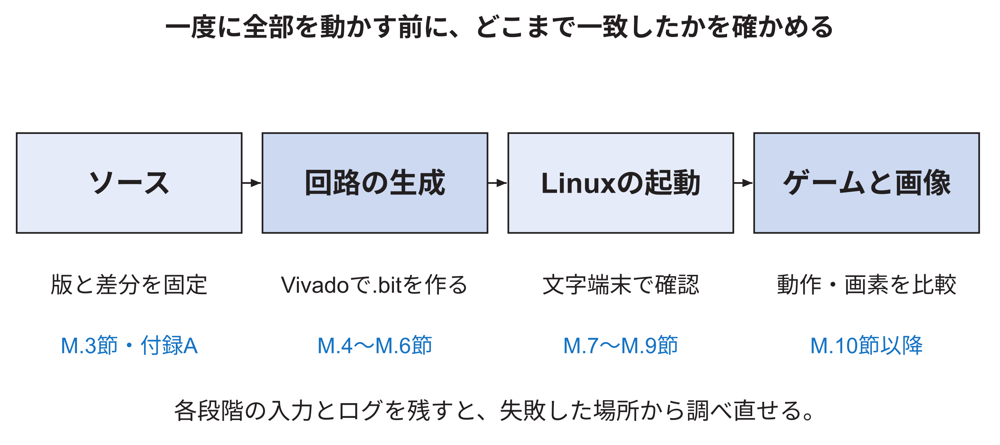

対応する詳しい手順は[付録M.1](技術付録.md#s_M_1)〜[M.17](技術付録.md#s_M_17)にある。各手順には実行する機械、入力、生成物、成功の判断を示す。最初に[付録M.2](技術付録.md#s_M_2)で機器を確認し、[M.3](技術付録.md#s_M_3)以降を順に進める。既存の作業場所やSDカードを上書きする前に、操作対象と保存データを確かめる。

<a id="s_14_2"></a>
### 14.2 設計を自分で作り直す

完成版を動かした後、別の作業場所で変更前の版から組み立てる。Nexys Videoへの対応は[付録E](技術付録.md#ch_E)、RasterIXの接続は[付録G](技術付録.md#ch_G)を使う。各ファイルの変更理由を読んでから編集し、保存した差分と照合する。この順序なら、動く基準と自分の変更を比べられる。

資料一式の`再現資料`には、ソース、パッチ、試験、測定記録E1〜E6を収録している。E7は研究リポジトリの`experiments/transport-study-20261009`にある。基準版の再現は[付録M](技術付録.md#ch_M)、接続比較版の再現は[技術付録第29章](技術付録.md#ch_29)、命令DMAなどを比べるE7の再現は[技術付録第30章](技術付録.md#ch_30)に示す。各手順で指定した版と生成条件を使い、得られた結果を対応する実験記録と照合する。

<a id="ch_15"></a>
## 第15章 設計の意味と残る課題

<a id="s_15_1"></a>
### 15.1 誰がどの部分を使えるか

例えば、Wallyへ別の画像処理回路を接続したい学習者は、[第7章](#ch_7)の「CPUの書き込みがどこへ届くか」を出発点にできる。相手の回路が受け取れる条件を調べ、自分の回路のREADYと、CPU側へ返す完了の条件を対応させる。[第10章](#ch_10)からは、複数の回路が同じ画像を使うとき、何が終わればその場所を上書きできるかという考え方を参照できる。

本研究は、Wallyの学習者がCPUを基板上の周辺機器へ拡張するときの参照例を提供する。基板配線をXDCへ反映する方法、異なるクロック間で命令を渡す方法、OSと描画回路のメモリ使用範囲を分ける方法、表示先を再利用できる時点の決め方を、ソース、設定値、確認条件とともに示した。

これらは本構成でゲームを動かすために必要だった接続であり、読者は同じ条件で試し、自分の変更と比較できる。一方、利用者を対象とする実験は行っていないため、教材として学習成績を向上させる効果は未検証である。

<a id="s_15_2"></a>
### 15.2 接続の条件と検証結果を示す意義

部品の一覧だけでは、同じ部品を使う人が接続の正しさを判断しにくい。本稿は、命令FIFOが満杯の間は書き込みを完了しないこと、画像領域をOSへ割り当てないこと、古い表示先の読み出しが残る間は再利用しないことを設計条件として示した。さらに、それぞれを調べる回路試験、メモリ設定、画像と映像の確認結果を対応付けた。

描画の改善は、この接続を使う二次元ゲームの継続動作を実現する一部である。固定した公開部品の組合せについて、実装と測定の条件を追える点が本成果の特徴となる。WallyとRasterIXの組合せが世界初かどうかは、網羅的な先行例調査を行っていないため断定しない。

<a id="s_15_3"></a>
### 15.3 CPUだけで描く案との違い

四角形だけなら、CPUがフレームバッファへ直接色を書いて描く案もある。その場合、画素を塗る処理、文字の模様、画像の切り替えなどをCPU側で用意する。小さな二次元ゲームでは有力な選択肢になり得る。

本研究は、Wallyに描画回路を接続する拡張例を示すため、既存のRasterIXを使った。図形や模様を指定するAPIと、その処理を行う回路を利用できる。一方、命令の準備と転送にも負担があり、CPU直描きより必ず速い、必ず実装が簡単とする比較は行っていない。

<a id="s_15_4"></a>
### 15.4 FPGAを使う理由

FPGAを使うと、CPUと周辺回路を実際の論理回路として組み合わせ、接続や待ち制御を変更できる。本研究の対象は、既製CPU上でゲームソフトだけを動かすことではなく、公開CPUに回路を接続してゲーム機として成立させる設計である。そのため、回路構成を変更できるFPGAが目的に合う。

本研究でFPGAを使う利点は、回路とソフトウェアの境界を公開設計で追い、接続を変更して実機で確かめられる点にある。既製のゲーム機との速度、価格、消費電力の比較は評価範囲に含めていない。

<a id="s_15_5"></a>
### 15.5 Wiiコントローラーを追加する場合

現在の検証済み入力はUART経由の操作と自動操作である。Wii Classic Controller Proの接続は、専用コントローラーによるゲーム操作を実現するための今後の作業として位置付ける。

接続には、コントローラーの通信と電気的条件を確認し、読み出したボタン状態をゲームのInputへ対応付ける処理が必要になる。まず個々のボタンを正しく読み取れることを確かめ、その後、押下・解放に応じたゲーム操作を検証する。通信回路の動作と、入力からゲーム状態までの対応を段階的に確認することが課題である。

<a id="s_15_6"></a>
### 15.6 残る不具合の検証と設計条件の比較

命令解析の修正候補は、試したDMAのテクスチャ条件で画像を一致させた。一方、元のAPB構成の間欠的な不一致については、内部信号を含む再現条件の切り分けが残る。有限個の画像が一致しても、すべての命令やテクスチャの正しさを確認したことにはならない。映像受信の不安定さも、同じ回路で認識に成功する場合と失敗する場合の接続条件を調べる必要がある。

E7では、コピーを伴う命令DMA、CPUの送信処理、リンク時最適化、描画用作業領域を2倍にする構成を比較した。DMAを使うことやメモリを増やすこと自体が、大きな速度向上につながるとは限らなかった。コピーを減らす別のメモリ管理、命令FIFOの中間の容量、別のハンドシェイク、CPU周波数は未評価である。E6とE7で試していない候補まで含めた最小容量や最高性能は求めていない。異なる設計を比べる場合にも、ゲーム状態と完成画像を対応させ、時間と資源量を併せて判断する。

<a id="ch_16"></a>
## 第16章 結論

本研究では、WallyをNexys Videoへ対応させ、ゲーム機の標準構成として、公式RasterIXを内部変更せずに接続した。CPUからの描画命令の受け渡し、DDR3の共有と画像領域の予約、表示画像の切り替えを実装し、二次元ブロック崩しを動作させた。

命令を待たせる条件と表示切り替えの条件を回路試験で確認し、配置配線後の時間条件と資源使用量を調べた。標準DVI構成では四段階のゲームをそれぞれ約80秒動かし、全段階でクリアと最終307,200画素の一致を確認した。三つの改善を組み合わせた実装の映像では、複数の時間帯でボールの移動を確認した。

また、CPU側の描画準備にかかる負担を調べ、呼び出しの統合、部分描画、完了待ちの変更を実装した。同条件での比較は実験用HDMI構成として区別し、改善の効果と画像の一致を示した。

命令接続の評価では、接続比較版を用い、一語ずつ渡す方式と16語・512語のFIFOを、同じゲーム状態と実行ファイルで比較した。初期状態の全体描画で、512語FIFOは一語方式よりAPB待ち時間を約89%短縮した。検査対象の画像は一致し、512語FIFOの接続モジュールが使う18 Kbit BRAMは1個であった。一語方式でも接続できるが、本構成では送信待ちと資源量の関係から512語FIFOを採用する根拠が得られた。さらに、計測回路を除いた通常版について、回路の再生成、起動、5分間の連続動作、30秒の実機映像を確認した。

命令の送り方と描画用作業領域についても、変更の効果を実機で比較した。命令DMAは、応答を保存する回路と命令解析の変更を施した実験用構成で動いたが、命令のコピーを含めると、試したゲーム条件ではAPB送信より速くならなかった。CPU側のリンク時最適化は呼び出し統合の条件で効果があり、内部作業領域を2倍にする変更は、Block RAMの増加に対して更新回数の改善が小さかった。これらの比較により、部品を追加した効果を、完成画像、処理時間、資源使用量から判断できるようにした。

以上の接続設計、ソース、設定、試験条件を、Wallyを使って周辺機能を追加するための参照例としてまとめた。命令解析の修正候補はDMAの実機試験で効果を確認した一方、元のAPB構成で間欠的に起こるテクスチャ不一致の原因は確定していない。その切り分け、映像認識の不安定さの原因調査、専用コントローラーの接続と入力の検証を今後の課題とする。


<a id="h0945"></a>
## 参考文献と実験記録

本文では、著者名や資料の略称と年などからなる参照記号を角括弧で示す。例えば[Harris26](#ref_Harris26)はHarrisらの2026年の書籍を指す。刊行年を確認できない継続更新の資料では、年を推測して記号へ付けず、資料名と版の識別情報を示した。ソースの版は記載したコミットを基準とし、Webページの将来の更新とは区別する。

<a id="h0947"></a>
### 外部資料と公開ソース

<a id="ref_Console26"></a>
[Console26] 研究者（非公開）, wally-game-console, 公開ソースコード, 2026. 基準版: d3e181ac434a01a1f174549b5fbc7ee03a8875b4. https://github.com/SoshiroFujimori/wally-game-console/tree/d3e181ac434a01a1f174549b5fbc7ee03a8875b4

<a id="ref_Harris26"></a>
[Harris26] D. Harris, J. Stine, R. Thompson, S. Harris, RISC-V System-on-Chip Design, Morgan Kaufmann, 2026. ISBN 9780323994989. https://shop.elsevier.com/books/risc-v-system-on-chip-design/harris/978-0-323-99498-9

<a id="ref_NexysVideo"></a>
[NexysVideo] Digilent, Nexys Video FPGA Board Reference Manual, ボード仕様・端子・クロック・DDR3の説明. https://digilent.com/reference/_media/reference/programmable-logic/nexys-video/nexys-video_rm.pdf

<a id="ref_RasterIX"></a>
[RasterIX] ToNi3141, RasterIX, ソースコードとREADME. 固定版: 9fdcf97a31b2e4247594e06d605871980cd5e9e1. RasterIX_IF.v、RenderConfigs.hpp、DisplayListDispatcher.hppなどを参照. https://github.com/ToNi3141/RasterIX/tree/9fdcf97a31b2e4247594e06d605871980cd5e9e1

<a id="ref_Thompson25"></a>
[Thompson25] R. Thompson, D. Harris, J. E. Stine, S. L. Harris, “RISC-V System-on-Chip Design Textbook and Course,” 2025 ASEE Annual Conference & Exposition, 2025. DOI: 10.18260/1-2--57147. https://peer.asee.org/57147

<a id="ref_Vivado25"></a>
[Vivado25] AMD, Vivado Design Suite Tcl Command Reference Guide, UG835, version 2025.2, “create_clock.” https://docs.amd.com/r/en-US/Vivado-Design-Suite-Tcl-Command-Reference-Guide-UG835/create_clock

<a id="ref_Wally"></a>
[Wally] OpenHW Foundation, CORE-V Wally, ソースコードとREADME. 本研究の出発点: 2345ec2ad68d9a9073b2dfec0929ce87c90cb0ce. https://github.com/openhwfoundation/cvw/tree/2345ec2ad68d9a9073b2dfec0929ce87c90cb0ce

<a id="ref_ArmAPB23"></a>
[ArmAPB23] Arm, AMBA APB Protocol Specification, ARM IHI 0024E, 2023, section 3.1.2 “With wait states,” p.3-21. https://documentation-service.arm.com/static/63fe2c1356ea36189d4e79f3

<a id="ref_AMD085"></a>
[AMD085] AMD, AXI4-Stream Infrastructure IP Suite LogiCORE IP Product Guide, PG085, version 3.0, 2025, Clocking. https://docs.amd.com/r/en-US/pg085-axi4stream-infrastructure/Clocking

<a id="ref_AMDAXI"></a>
[AMDAXI] AMD, Vivado Design Suite AXI Reference Guide, UG1037, AXI4-Streamの転送規則. https://www.amd.com/content/dam/xilinx/support/documents/ip_documentation/axi_ref_guide/latest/ug1037-vivado-axi-reference-guide.pdf

<a id="ref_AMDGray"></a>
[AMDGray] AMD, Vivado Design Suite 7 Series FPGA and Zynq-7000 SoC Libraries Guide, UG953, version 2021.1, XPM_CDC_GRAY, 2021. https://docs.amd.com/r/2021.1-English/ug953-vivado-7series-libraries/XPM_CDC_GRAY

<a id="h0959"></a>
### 本研究で保存した実験記録

E1〜E7は本研究の測定資料を区別する識別子であり、外部文献の著者・年を表す記号ではない。日付、条件、ログを併記し、本文の結果と対応させる。

<a id="ref_E1"></a>
[E1] Wally / official RasterIX integration current qualified results、2026年9月9日。再現資料/実験記録/E1/RESULTS.md。対応するtest-apb.log、test-display.log、reset-test.log、hardware-results.json、timing_summary.rpt。

<a id="ref_E2"></a>
[E2] コミットと追加検証、2026年9月13日。再現資料/実験記録/E2/コミットと追加検証.md。verification/board-dvi-acceptance/results.json、board-dvi-visual/result.json、hdmi-analysis.json、game-dvi.mp4。

<a id="ref_E3"></a>
[E3] 内部作業領域の容量とBRAMの余裕、2026年9月14日。再現資料/実験記録/E3/BRAM容量の確認.md、utilization-standard-dvi.rpt、utilization-hierarchical.rpt、analysis.json。

<a id="ref_E4"></a>
[E4] WallyとRasterIXによる2Dゲームの成果、2026年9月11日。再現資料/実験記録/E4/report/成果と検証範囲.md、METHODS.md、plans/controlled-finalhdmi.json、wait-finalhdmi.json、対応する試行のframes.csvとresult.json。実験用720p HDMI構成。

<a id="ref_E5"></a>
[E5] 描画準備時間の原因を分ける実験、2026年9月10日。再現資料/実験記録/E5/results-ja.md、technical-results.md、METHODS.md、cases.csv、analysis.json。

<a id="ref_E6"></a>
[E6] FIFO接続方式の比較と公式更新後の検証、2026年10月8日。再現資料/実験記録/E6。主比較90回、再書き込み後18回、通常版の新規生成と実機検証。report/結果と判断.md、report/results/runs.csv、board-v2、board-reconfiguration、fresh-product/qualification/qualification.json、report/results/video/validation.json、命令解析回路の単体再現試験。

<a id="ref_E7"></a>
[E7] 描画命令の転送方式と送信処理の比較、2026年10月9日。研究リポジトリのexperiments/transport-study-20261009。RESULTS.md、METHODS.md、results、results-if17、results-board。内部DMAの単体448転送、描画・テクスチャの機能モデル192条件。実機のソフトウェア比較168試行、DMAの送信方法・最小長・内訳の比較54試行、作業領域を2倍にした構成12試行。回路の配置・配線検査と、状態・転送量・完成画像の照合結果を含む。
