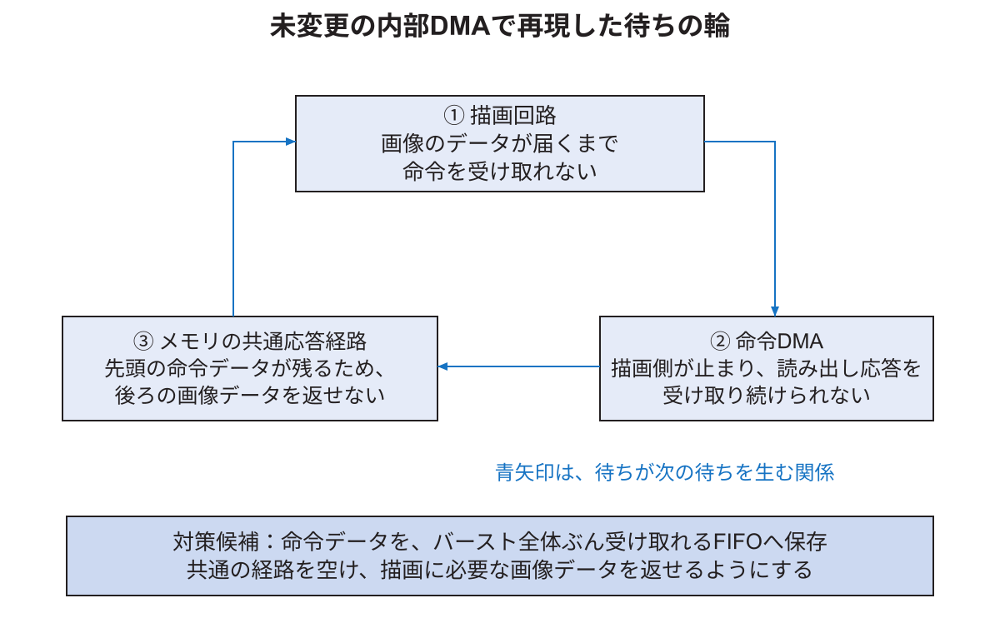

## 第30章 メモリから描画命令を読む方式を検証する

この章では、CPUが一語ずつ描画命令を送る方式と、回路がメモリから命令列を読む方式を区別する。後者がDMAである。実験E7では、転送回路だけの試験と描画回路全体の試験で結果が異なった。その違いを、回路どうしの待ちの関係から説明する。本章では、シミュレーションで調べた転送回路の振る舞いと、実機で確認した結果を区別する。

### 30.1 CPUが転送する方式とDMAの違い

採用済みのゲーム機では、CPUがDDR3上に描画命令を用意する。命令は、画面の位置や色などをRasterIXが解釈できる数値にしたものである。CPUは、その数値列を先頭から読み、命令用のAPBレジスタへ一語ずつ書く。CPUが一語を書けば、その一語が命令FIFOへ入る。FIFOの出口では、RasterIXが受け取れるときに一語を渡す。

DMAでは、CPUが命令列を用意する点は同じだが、列を読み出す仕事を回路へ渡す。例えば「物理番地Aから4,096 byteを読んで描画側へ送る」と回路に指定する。その後はDMA回路がメモリへの読み出し要求を出す。CPUが4,096 byteの全語を命令用レジスタへ書く必要はなくなる。

ただし、DMAを使えば自動的に全処理が速くなるわけではない。回路に見える場所へ命令をコピーする時間、転送を開始するための設定、終了確認が必要になる。短い命令列では、その準備にかかる時間が、減らせたCPUの書き込み時間より長くなる場合もある。したがって、命令を送る部分とゲーム一回分の時間を、別々に測る必要がある。


図30.1で「CPUが用意した命令列」と「描画結果の画像」は別のデータである。同じDDR3を使っていても、命令を置く番地と画像を置く番地は区別する。命令をDMAで読むことは、画像の表示方法をDMAへ変更することとも異なる。

### 30.2 RasterIXの二つのDMA経路を区別する

公式RasterIXの`FrameStreamingCore`は、メモリから読み出したデータを命令ストリームへ送る機能を備える。実験E7では、まずこの内部機能を調べた。既存の`RasterIX_IF`に含まれる回路を使えるため、新しい転送IPを組み込まずに比較できるからである。

公式ソフトウェアには`XilCDMABusConnector`もある。こちらはXilinx向けのDMAドライバーを使って転送する接続であり、内部の`FrameStreamingCore`へ読み出し命令を渡す方式と同じ実装ではない。公式にDMAを利用する例があることと、その例をWallyへ設定だけで移せることは別である。CPU、メモリの番地、キャッシュ管理、DMAの制御レジスタ、バスへの接続を対応付ける必要がある。

この章の「DMA」は、特記しない限り`FrameStreamingCore`の内部読み出しを指す。外付けDMA IPとの速度比較を行ったという意味ではない。

### 30.3 DMAへ渡す番地とデータの見え方

Linuxのプロセスが持つポインターは、通常は仮想番地である。CPUのMMUが仮想番地を物理番地へ変換するため、プログラムはそのポインターからデータを読める。一方、このDMA回路は同じMMUを通らず、指定された物理番地を使う。したがって、`malloc`で得たポインターの数値を、そのままDMAへ渡してはいけない。

実機用の比較プログラムは、通常のLinuxメモリと重ならない予約領域の一部を使う。命令の格納先は物理番地`0x9e800000`からの範囲とし、領域の大きさや`/proc/iomem`の予約を確認する。描画画像やテクスチャと重ならない範囲を、最大1 MiBずつに区切って使う。これらの数値は実験用のメモリ配置であり、別の構成へそのまま流用する値ではない。

CPUがデータを書いたつもりでも、キャッシュ内にだけ新しい値が残れば、DMAがDDR3から読む値は古いままになる。そこで実験用コードは、キャッシュしない属性で予約領域を対応付ける。書き込み後に順序をそろえる命令を実行し、その後にDMAを開始する。`volatile`だけでは、MMUの属性やキャッシュの問題まで解決できない。

性能を測る前に、CPUが書いた既知の模様をDMA側から読み返し、同じbyte列を得られるか確認する。先頭だけでなく、ページ境界付近や領域の末尾も対象にする。E7では、領域の先頭、4 KiB境界をまたぐ位置、領域末尾の3か所で、2種類の数値列を各65,536 byte読み戻した。6条件すべてで一致した。この結果は、指定した予約領域と非キャッシュ属性でCPUと描画側が同じデータを読めたことを示す。描画命令の実行や任意のキャッシュ設定まで正しいと確認した結果ではない。

### 30.4 転送が終わる前に命令列を書き換えない

DMA開始レジスタへの書き込みが終わる時点と、命令列を全部読み終わる時点は異なる。開始直後にCPUが同じメモリを次の命令で上書きすると、DMAは古い列の前半と新しい列の後半を読むおそれがある。

比較プログラムでは、DMAによる命令転送の後ろに、識別用の数値を返す命令を並べる。その数値が応答として戻ったことを確認してから、同じ命令格納領域を再利用する。前の転送を追い越して応答できない経路であることが前提である。格納領域を再利用してよいことと、画面に表示されたことも別であり、この応答を映像の更新回数として数えてはいけない。

命令列は64 byte単位へそろえ、余りには無操作を表す語を入れる。個々のAXIバーストが4 KiBの境界を越えないことも検査する。「転送範囲全体が4 KiBの境界をまたぐこと」と「一つのバーストが境界を越えること」は異なる。長い転送は、境界を越えない複数の要求へ分けられる。

### 30.5 転送回路だけを試す

最初の試験は`FrameStreamingCore`だけを対象とする。既知の数値列を読むように命令し、出てきた語の個数、順番、終端を照合した。メモリの応答や受け取り先を意図的に停止し、再開した後も正しく続くかを調べた。

転送長は64、128、192、4,096、4,160、65,536、1,048,576 byteとした。開始位置、乱数の種、停止条件を組み合わせた224条件で、各2回、合計448転送が通過した。受け取り先を停止しても、この回路が保持し、再開後に続きを渡せることを確認した結果である。

しかし、この試験の受け取り先は、試験プログラムが所定の時間後に再開させる。実際の描画回路は、別のメモリ読み出しが終わるまで再開できないことがある。その仕事まで含めないと、二つの回路が互いを待つ状態を見落とす。そのため、次の試験ではRasterIX全体を動かす。

### 30.6 描画回路全体の試験に何を含めたか

全体試験には、公式`RasterIX_IF`、その内部の命令解析・描画・テクスチャ回路・メモリ接続を含めた。Block RAMは汎用のシミュレーション用メモリ、DDR3は要求へ応答する試験用モデルとした。表示回路の代わりに、画像の切り替えを受け付けたことを返すモデルを置いた。

Wally CPU、実際のAPBバス、CPUと描画側のクロック境界、MIG、HDMI端子は含まない。記録中の`apb`というラベルは、CPUからの逐語送信に相当する入力を表す。APBの信号そのものを動かしたという意味ではない。入力間隔を0または16クロックとし、数値列を同じ命令ストリーム入口へ渡した。

DDR3モデルは、読み出し要求を受けた順に応答する。異なるIDの要求に対して常に追い越しを行う必要はないため、この順序もAXIで許される。返すデータが決まったらVALIDを上げ、READYが下がっている間はVALID、データ、ID、終端情報を保持する。受け手が準備できるまでVALIDを出さないモデルにはしていない。[ArmAXI20]

描画の試験では、ブロック崩しの3状態、入力間隔2通り、乱数の種2通りを組み合わせた。各条件で連続4画面を生成し、それぞれ全307,200画素を正解画像と比較する。ここでの文字は四角形へ展開し、テクスチャ転送の試験とは分けた。別の試験で32×32、64×64、256×256のテクスチャを描き、4画面目を全画素比較した。

### 30.7 互いを待って止まった経路

未変更のDMA経路は、ブロック崩しの12条件すべてで停止した。停止時の記録では、DMAが読む「次の命令のデータ」が共有の読み出し応答経路にあり、その後ろに描画側が必要とする「画像のデータ」が並んでいた。

描画回路は画像データが届くまで次の命令を受け取れない。DMAは、描画回路が受け取らないため、次の命令データを受け取り続けられない。メモリモデルは、先頭の命令データが受け取られるまで、後ろの画像データを返せない。この三つが輪になり、待ち続けた。



これは「WallyよりRasterIXが常に遅い」という話ではない。CPUの速さとは別に、描画回路が、その処理に必要なメモリの応答を待つ場面があるという話である。また、単体試験と全体試験の違いは、受け取り先を後から必ず再開させる試験か、再開に別の共有メモリ応答を必要とする試験かにある。

この停止を実機のMIGでも再現したわけではない。実機では要求の並べ方や応答の順序が異なる可能性がある。本実験が示すのは、用意した正当な応答順序の下で、未変更の経路に循環した待ちが生じることである。

### 30.8 DMA読み出し側へバッファを置く理由

対策候補は、DMAの読み出し応答を一度保存するFIFOである。このFIFOは、32 bitの語を64個保存し、描画側と同じクロックで動かした。第29章で比べたCPU側の非同期FIFOとは場所も目的も違う。

重要なのは、FIFOを置くだけでなく、要求を出す前に、そのバースト全体を受け取れる空きがあることを確認する点である。これにより、いったん要求した命令データは、描画側が止まっていてもFIFOにすべて受け取れる。共有の応答経路が空き、後ろの画像データを返せるので、描画側も処理を再開できる。

AXI仕様のA3.3節も、読み出しを要求した側は、同じ要求側による別の取引に依存せず、その要求のデータを受け取れることを求めている。[ArmAXI20] バッファによる空きの確保は、今回観測した依存関係を解くための一つの実装である。

実験ではMITライセンスの`axi_fifo_rd`を使い、`FIFO_DELAY=1`を指定した。公式RasterIXのソースは変更せず、実験用コピーに接続を加えた。この候補で、四角形の描画は12条件すべてを通過した。バッファを置かず命令を64 byteずつに分ける試験では、同じ停止が残った。

64語が最小または最適だと確定した結果ではない。また、バッファがあるだけで任意のメモリ接続の停止を防げるという意味でもない。今回の要求長、接続位置、空きの確認を含めた候補について、再現した停止を解消した結果である。

### 30.9 テクスチャの問題は別に残った

DMA読み出しFIFOを入れても、大きなテクスチャには画素不一致が残った。未変更の逐語入力も12条件中8条件の通過にとどまったため、DMAだけの問題として扱わない。

命令解析回路には、入力が有効であることを示すVALIDと、受け取れることを示すREADYがある。一語を受け取ったと判断するのは、その両方が1のクロックである。VALIDが1でもREADYが0なら、同じ語を入口に保持している途中であり、別の新しい語を受け取ったと数えてはいけない。

第29章の単体試験で用いた修正候補は、この受け取り条件を、入力保持と一時保存した語の扱いに反映する。E7では、DMA読み出しFIFOに加えてこの候補を適用した。逐語入力とDMAのそれぞれで、四角形12条件とテクスチャ12条件が通過した。変更点と全試行の成功・失敗を残しており、成功した試行だけを選んだ結果ではない。

### 30.10 結果の表を読む

| 実験用の回路 | 逐語入力の四角形 | DMAの四角形 | 逐語入力のテクスチャ | DMAのテクスチャ |
|---|---:|---:|---:|---:|
| 公式のまま | 12/12 | 0/12 | 8/12 | 0/12 |
| DMA読み出しFIFO | 12/12 | 12/12 | 8/12 | 4/12 |
| DMA読み出しFIFOと命令解析の修正候補 | 12/12 | 12/12 | 12/12 | 12/12 |

分母は試験条件の数であり、1秒間の画面数ではない。失敗には、転送が進まない場合と、処理は終わるが画素が一致しない場合がある。前者を解消しても後者が残るため、終了したことだけで正しい描画と判断しない。

ソースを変えた候補が通過しても、配置配線の時間条件、実機のメモリの見え方、映像、長時間動作まで通ったことにはならない。したがって、この表を根拠に製品でDMAを採用したり、何倍高速化したと説明したりすることはできない。

### 30.11 試験を再実行する

研究リポジトリのルートで、固定版のゲーム機ソースを`console`へ取得した状態を使う。以下はホストPC上で動く機能シミュレーションの例であり、FPGAやSDカードには書き込まない。CMake、C++コンパイラ、Verilatorが必要である。

```bash
cmake -S experiments/transport-study-20261009 \
  -B build/transport-reproduction/upstream \
  -DWALLY_REPO="$PWD/console" \
  -DTRANSPORT_BUILD_MODEL=ON \
  -DRIX_CORE_FRAMEBUFFER_SIZE_IN_PIXEL_LG=16 \
  -DCMAKE_BUILD_TYPE=Release
cmake --build build/transport-reproduction/upstream \
  --target gpu-functional gpu-texture -j4
python3 experiments/transport-study-20261009/run_gpu_model.py \
  --binary build/transport-reproduction/upstream/gpu-functional \
  --output build/transport-reproduction/upstream-results
```

未変更の回路ではDMA条件が失敗するため、最後のコマンドは正常終了の番号0ではなく、失敗を表す番号を返す。結果の`passed`だけを見るのではなく、各条件のログと終了理由を読む。既存の結果があるディレクトリは上書きしない。

修正候補は次のように別の場所へ生成する。`console/addins/rasterix`のファイルは書き換えない。

```bash
python3 experiments/transport-study-20261009/make_buffered_dma.py \
  --wally console \
  --output build/transport-reproduction/candidate-source \
  --parser-handshake
cmake -S experiments/transport-study-20261009 \
  -B build/transport-reproduction/candidate \
  -DWALLY_REPO="$PWD/console" \
  -DTRANSPORT_BUILD_MODEL=ON \
  -DTRANSPORT_MODEL_TOP="$PWD/build/transport-reproduction/candidate-source/RasterIX_IF.v" \
  -DRIX_CORE_FRAMEBUFFER_SIZE_IN_PIXEL_LG=16 \
  -DCMAKE_BUILD_TYPE=Release
cmake --build build/transport-reproduction/candidate \
  --target gpu-functional gpu-texture -j4
python3 experiments/transport-study-20261009/run_gpu_model.py \
  --binary build/transport-reproduction/candidate/gpu-texture \
  --texture \
  --output build/transport-reproduction/candidate-textures
```

正確な比較には、READMEにある製品とRasterIXの固定コミットを使う。公式ソースの変更で内部信号や振る舞いが変わると、同じ試験条件を再現できるとは限らない。実験用の生成差分、実行ファイルのハッシュ、試験条件、照合結果を一緒に保存する。

### 30.12 実機の性能評価へ進む条件

実機では、まずCPUが書いた数値列をDMAから同じ値で読めることを確認する。続いて、転送後の命令、ゲーム状態、完成画像を照合する。その後で、CPUによるコピー、開始設定、転送待ち、命令生成、一画面分の時間を比較する。シミュレーションの所要秒数を20 MHzのCPUの性能へ換算しない。

比較候補には、逐語送信ループの展開、コンパイラのリンク時最適化、RasterIX内部作業領域の拡大もある。これらも同じゲームと画像を保っていることが前提である。特に作業領域の拡大は回路量と配線が変わるので、合成で収まっただけで実機へ入れず、配置配線後の時間条件を確認する。

実機では、固定した回路でLinuxを起動し、実行ファイルのハッシュ、予約メモリ、データの読み戻しを確認した。その後、元の回路と実験用回路で命令DMAによる描画を試し、描画できた構成ではゲーム全体の速度も比較した。結果を30.16節に示す。メモリの読み戻しが通っただけでは、命令DMAの描画や性能まで確認したことにはならない。

実験ソースと全条件の結果は、研究リポジトリの`experiments/transport-study-20261009`に保存した。`RESULTS.md`が結果の入口、`results/functional-cases.csv`が条件別一覧、`results/manifest.json`が公開用コピーと元記録のハッシュの対応である。

### 30.13 CPUが一語ずつ送る処理を軽くする

DMAを使わなくても、CPUが同じ数の語を送るために実行する命令を減らせる場合がある。元の送信処理は、一語を読み出し、最後の語かを判断し、書き込み先のレジスタを選んで送る。最後の語だけは、命令列の終わりを伝えるレジスタへ書く必要がある。その後、次の語へ進むために位置を更新し、繰り返しの条件を調べる。

ループ展開版では、通常のレジスタへの書き込みを8回並べ、その8語を一まとまりとして繰り返す。最後の語は、繰り返しの外で終端用レジスタへ書く。これにより、繰り返しの条件判定を減らし、各語で最後かを判断する処理も主なループから外せる。ただし、8語を一回のバス取引で渡すわけではない。32 bitの書き込みは8回行い、送る数値列と終端の指定は変えない。

この変更の入口は`StudyBus.hpp`の`writeData`である。`unrolled`を選ぶと、この送信処理を使う。`apb`を選ぶと、公開済みの`WallyBusConnector`へ処理を渡す。両者は同じ実行ファイルに含まれるため、この二方式の比較でコンパイラ設定まで変わることはない。生成された機械語でも、8回の書き込みの後にループの判定が置かれていることを確認した。

別の比較対象は、リンク時最適化である。通常、コンパイラはソースファイルごとに処理を翻訳し、リンカーが結果を一つの実行ファイルへ結合する。リンク時最適化では、その結合の段階でも複数のファイルにまたがる処理を調べ、関数の呼び出し方などを最適化する。ソース上のゲームの規則を変更する方法ではないが、生成されるCPU命令は変わる。

比較では、GCC 14.2.0の`-O3 -DNDEBUG`を共通とし、通常のビルドと、CMakeの`CMAKE_INTERPROCEDURAL_OPTIMIZATION=ON`を加えたビルドを用いた。後者の生成オプションは`-flto=auto -fno-fat-lto-objects`である。それぞれの実行ファイルで通常送信とループ展開を選び、計4通りを比べる。公式RasterIXのソース、FPGAの回路、CPUと描画側の周波数は変えない。

### 30.14 比較する処理と計測の範囲をそろえる

同じゲームでも、ブロックの数や文字の内容が変われば描く仕事が変わる。そのため、開始状態を自動操作の0、1,800、3,600回目の三つに固定し、それぞれから同じ入力列で進める。毎回全体を描く方式、呼び出しをまとめる方式、変更領域を描く方式は、同じゲーム状態の列にならなければならない。実行記録の状態ハッシュを、全フレームで照合する。

各試行では、初期化と30フレームの準備運転を済ませてから180フレームを記録する。4通りのソフトウェアの実行順をずらして3回ずつ繰り返す。ある方式が常に最初、別の方式が常に最後になることを避けるためである。ただし、これだけであらゆる変動を除去できたとは扱わず、各試行の値と中央値、観測した最小値・最大値を残す。

描画命令の再利用という比較も行う。この条件ではゲームを進めず、最初の状態で作った2枚の描画先用の命令列を交互に送る。毎回の命令生成を省いたときに、残る転送や描画にどの程度の時間がかかるかを見るための条件である。動くゲームと同じ仕事ではないため、その更新回数をゲームの速さとして紹介しない。

さらに、時間を読む操作の影響を区別する。詳細計測では、ゲーム計算、描画APIの呼び出し、命令転送などの前後で時計を読む。軽い計測では、内部処理ごとの時計読み取りを止め、フレームの境界と回数を記録する。軽い計測の集計表で内部時間が空欄になるのは、測っていないためであり、その処理時間が0だったためではない。

例えば、時計を一回読む処理が5 µsで、ある処理中に200回追加すれば、単純な積は1 msになる。この数値は影響を考えるための計算例であり、全フレームで200回読んだという測定結果ではない。表示の切り替えを次の周期まで待つ構成では、小さな処理時間の差で切り替えに間に合うかどうかが変わり、完了間隔の差が大きくなる場合もある。そのため、内部時間の内訳だけでなく、軽い計測でも方式間の違いを確かめる。

画像の照合は、1回目の繰り返しの各条件について、最後の完成画像の307,200画素を正解画像と比較する。全フレームの全画素を調べたという意味ではない。また、DDR3から読み返した画素が正しくても、その画像を外部の表示機器が受信できたことまでは分からない。画素の検査と映像の確認は別の記録として残す。

実行と集計の入口は、実験フォルダーの`METHODS.md`、`run_board_matrix.py`、`analyze_board_matrix.py`である。集計は、状態ハッシュ、転送量、表示完了回数、選択した画像の一致を確認してから行う。検査に失敗した試行や、途中までの測定を、完了した比較としてまとめない。

### 30.15 ソフトウェア比較の結果を読む

詳細計測の120試行で21,600フレーム、軽い計測の48試行で8,640フレームを記録した。共通する48試行について、各フレームのゲーム状態と転送量を計測方法の間でも照合し、一致を確認した。画像の全画素照合は詳細計測で40枚、軽い計測で16枚を対象とし、いずれも正解画像と一致した。

次の表は、軽い計測の初期状態における表示切り替え完了回数である。180フレームを3回実行した中央値を回/sで示す。プログラムから観測した完了回数なので、外部表示機器で受信した画像を数えた値とは区別する。

| ソフトウェア | 全体描画 | 呼び出し統合 | 変更領域 |
|---|---:|---:|---:|
| 通常ビルド・通常送信 | 14.728 | 14.953 | 58.199 |
| 通常ビルド・ループ展開 | 14.850 | 16.796 | 58.190 |
| リンク時最適化・通常送信 | 14.953 | 19.611 | 58.511 |
| リンク時最適化・ループ展開 | 14.974 | 19.682 | 58.195 |

例えば、通常ビルドの全体描画では、ループ展開を行っても14.728回/sから14.850回/sへの変化である。しかし、詳細計測で送信処理だけを見ると7.904 msから6.074 msへ短くなった。この二つは矛盾しない。ゲーム計算、描画命令の準備、描画側の処理、表示切り替えの待ちなども一画面分の時間に含まれるため、送信の短縮分がそのまま更新回数の増加率にはならない。

呼び出し統合では、リンク時最適化の効果が大きかった。通常送信のまま14.953回/sから19.611回/sへ変化しており、比を計算すると約31%の増加である。これは測定値から計算した割合であり、別の描き方や別のCPUでも31%速くなるという意味ではない。変更領域だけを描く条件では、どのソフトウェアでも約58回/sであり、大きな差は得られなかった。

詳細計測と軽い計測の差は、初期状態の16条件のうち15条件で中央値の約0.6%以内であった。残る通常ビルド・ループ展開・呼び出し統合は、詳細計測の中央値16.141回/sに対して軽い計測が16.796回/sであり、約4.1%の差があった。観測範囲はそれぞれ16.141〜16.770回/s、16.563〜16.901回/sで、一部が重なる。試行数は各3回なので、この比較だけから統計的な有意差や、時計読み取りの厳密な費用を求めたとは扱わない。

E7の`results-board/software`には詳細計測、`results-board/frame`には軽い計測と両者の照合結果がある。各試行の`frames.csv`がフレームごとの記録、`uart.log`が実行条件と画素照合結果、`manifest.json`が元記録と公開用コピーのハッシュである。公開用ログは個人情報を除去し、設定中に受信したゼロbyteを文字の`\x00`として示す場合があるため、未加工の通信記録と同じbyte列だとは扱わない。

### 30.16 DMAが動くことと、高速化になることを分ける

元の回路に対して命令DMAを開始した実機試験では、完了確認用の数値が30秒以内に戻らなかった。単に遅い画面が得られたのではなく、試験そのものを完了できなかった。そのため、この試行からDMAの描画速度は計算しない。回路がまだメモリを読み出している可能性が残るため、同じメモリを書き換えて再試行せず、FPGAを再設定してから次の試験へ進んだ。

DMA読み出し用FIFOと命令解析の変更を組み合わせた実験用回路では、APB送信とDMA送信の両方でブロック崩しを描画できた。30フレームの試験後の画像は、双方とも307,200画素すべてが正解画像と一致した。32×32、64×64、256×256画素のテクスチャも、各サイズを4回描いた後の画像が一致した。変更したのは研究用のソースコピーであり、公開製品が参照する公式RasterIXのサブモジュールではない。

この実験用回路は、合成だけでなく配置と配線を終え、setupの余裕0.020 ns、holdの余裕0.014 nsで時間条件を満たした。配線エラーは0であり、クロック、内部の未制約端点、例外指定、クロックをまたぐ接続、バスの信号間のずれも基準回路と比較した。既存の警告は残っているので、警告がすべて消えたという意味ではない。回路全体のBlock RAM使用量は215から216タイルへ変わった。

次に、同じ実験用回路のままで送信方法だけを切り替えた。APB版はCPUが命令を一語ずつ送る。DMA版ではCPUが命令列を予約メモリへコピーし、回路へ先頭の物理アドレスと長さを渡す。64 byte以上の命令列をDMAの対象とした。開始状態、ゲームの規則、画面の大きさ、CPUと描画回路の周波数、実行ファイルは共通である。

| 描き方 | APB送信（回/s） | DMA送信（回/s） |
|---|---:|---:|
| 毎回全体を描画 | 14.728 | 11.844 |
| 描画の呼び出しを統合 | 14.953 | 14.355 |
| 変更領域だけ描画 | 58.512 | 57.883 |
| 同じ命令列を繰り返す参考条件 | 58.831 | 29.823 |

表は、30フレームの準備運転後、180フレームを3回測った中央値である。内部処理ごとの時間計測を止め、表示切り替えの完了間隔を記録した。最後の行はゲームを進めず、初期画像の命令列を再利用するため、動くゲームの性能とは区別する。24試行、4,320フレームのゲーム状態と命令量が対応し、各試行の最終画像も正解画像と一致した。

DMAはCPUの仕事を自動的にゼロにする機能ではない。この実装では、次の仕事が残る。

| 段階 | CPUまたは回路が行うこと |
|---|---|
| 命令の生成 | CPUが通常のメモリ上に、図形や描画設定を表す数値列を作る |
| DMA用メモリへのコピー | CPUが数値列を、描画回路から読める予約メモリへ書き直す |
| 開始設定 | CPUが書き込みの順序を確定し、先頭アドレスと長さを回路へ渡す |
| メモリからの転送 | 回路が命令列を読み、描画側へ渡す |
| 所有権の確認 | CPUが完了確認用の数値を受け取り、その領域を再利用してよいと判断する |

予約メモリは、CPUのキャッシュに古い値が残って描画回路と食い違うことを避けるため、キャッシュを使わない写像で扱う。これは30.3節の共有方法を明確にする一方、CPUからのコピーに時間がかかる。DMAの転送中だけを取り出して測ると、この準備費用を見落とす。表では準備も含む一画面分の時間を比べており、この実装をそのまま採用しても高速化にならなかった。

全体描画を詳細計測した3回の試行では、APBの書き込み処理は一画面平均の中央値で7.916 msだった。DMA版では、予約メモリへのコピーだけで17.530 ms、開始設定で0.051 ms、完了確認の待ちで3.987 msを記録した。各計測区間は呼び出しの内外にまたがるため、これらを別の内訳表の値へ重ねて足さない。ここで重要なのは、DMAを開始する前のコピーだけでも、比較対象のAPB書き込みより長かったことである。

短い命令列でDMAの準備費用が割に合わない可能性も調べた。DMAを使う最小長を64 byte、1,024 byte、8,192 byteとし、それより短い列はAPBで送った。例えば、全体描画では、最小長8,192 byteの設定で一画面当たりのDMA回数が5回から2回へ減った。それでも中央値は11.962回/sで、APBの14.728回/sを上回らなかった。変更領域だけを描く場合は、この設定でDMA転送が0回となり、中央値は58.195回/sだった。3回ずつの測定値には変動があるため、小さい数値差から方式の一般的な優劣や有意差は主張しない。

最小長を変えた比較と詳細計測も合わせた54試行、9,720フレームについて、ゲーム状態と元の命令量を照合し、各試行の最終画像も全画素で照合した。いずれも一致した。DMAへ回す命令量が変わっても、ゲームが違う画像を描いて速くなったわけではないことを、この検査で区別している。

これはDMA一般の優劣ではない。例えば、最初から回路が読める領域へ命令を作る設計や、CPUのキャッシュと回路の読み出しを整合させる別の仕組みなら、費用の分かれ方も変わる。ただし、未実装の方式が速いと予測して測定値へ加えてはならない。今回確認したのは、コピーを伴うこの実装、このCPUと回路、この描き方での結果である。

また、元の実機でタイムアウトし、組み合わせた変更後に動いたという事実だけから、原因の全てを一つの部品へ帰属させない。モデル上で追跡した待ちの輪、受け渡し規則の単体試験、実機での画像照合は、それぞれ観察している範囲が異なる。E7の`results-board/transport-probes`が実機の機能試験、`results-board/dma-frame`が繰り返し測定、`results-board/buffered-parser-qualification`が回路の実装検査である。

### 30.17 内部作業領域を2倍にする比較

ここで増やすのは、RasterIXが描画途中の画素を保存する内部の作業領域である。APBの命令を保存する512語FIFOでも、DMAの応答を保存する64語FIFOでもない。また、外部DDR3に置く表示用画像二枚の容量も変えない。第9章の「一枚の画面を帯に分けて処理する」段階に関係する変更である。

回路側の`FRAMEBUFFER_SIZE_IN_PIXEL_LG`を16から17へ、ソフトウェア側の`RIX_CORE_FRAMEBUFFER_SIZE_IN_PIXEL_LG`も16から17へ変えた。値は画素数そのものではなく、2の何乗かを表す。従って、16は2の16乗、すなわち65,536画素分であり、17は131,072画素分である。回路だけを増やしても、ソフトウェアが小さい容量として命令を作れば、その空きを利用できない。逆に、ソフトウェアだけを増やすと、実際には存在しない容量を使う指定になる。両者を一致させた実行ファイルと設定データを一組で扱う。

公式の`DisplayListDispatcher::setResolution`は、画面の全画素数を内部容量で割り、余りがあれば切り上げて帯の本数を求める。その後、画面の高さを帯の本数で割る。640×480は307,200画素なので、65,536画素分では5本、131,072画素分では3本になる。従って、小さい構成の一帯は480÷5=96行、大きい構成では480÷3=160行である。一帯の画素数はそれぞれ61,440と102,400で、どちらも内部容量に収まる。容量から置ける最大行数を先に求め、最後の帯だけ短くする実装ではない。第9章と同じ分割方法を、大きい容量にも適用した比較である。

比較では、CPU 20 MHz、描画回路100 MHz、640×480画素、APBによる通常送信、通常のO3ビルドを共通にした。公式ソースの版も共通であり、命令解析の実験用修正はこの比較に含めない。容量と、それに対応するソフトウェア設定を変える。各回路は配置・配線を完了し、時間条件、配線、クロックをまたぐ接続、例外指定を検査した後にFPGAへ設定した。

| 資源・時間条件 | 65,536画素分 | 131,072画素分 |
|---|---:|---:|
| LUT | 67,166 | 67,226 |
| FF | 50,890 | 50,914 |
| Block RAMの36 Kbit換算タイル | 215 | 285.5 |
| Block RAMの使用率 | 58.90% | 78.22% |
| DSP | 61 | 61 |
| setupの余裕 | 0.018 ns | 0.081 ns |
| holdの余裕 | 0.014 ns | 0.014 ns |

表はシステム全体の使用量である。増分には配置・配線に伴う最適化も含まれるので、LUTの差をそのまま「作業領域の回路だけの費用」とは扱わない。時間の余裕が正であることは、指定した周波数での時間条件を満たしたという意味であり、動作周波数を高くして試したことを意味しない。

30フレームの準備運転後、初期状態から180フレームを3回実行した。内部処理ごとの時計読み取りを止めた条件である。次の表では、一秒当たりの表示切り替え完了回数を「中央値（観測した最小値〜最大値）」で示す。

| 描き方 | 65,536画素分 | 131,072画素分 |
|---|---:|---:|
| 毎回全体を描画 | 14.728（14.707〜14.748） | 14.748（14.728〜14.829） |
| 描画の呼び出しを統合 | 14.953（14.953〜14.953） | 15.249（15.185〜15.336） |
| 変更領域だけ描画 | 58.199（58.195〜58.512） | 58.196（58.195〜58.512） |
| 固定命令列を繰り返す参考条件 | 58.831（58.831〜58.831） | 59.154（58.831〜59.481） |

最後の行はゲームを進めない参考条件である。小数点以下3桁への丸めで同じ数値に見える場合でも、元のCSVでは区別できる。3回の最小値と最大値は信頼区間ではなく、観測した範囲である。回路ごとにOSを起動しているので、すべての小さな差を容量だけの費用として断定しない。

容量を増やすと、一画面の送信呼び出しは5回から3回に減った。全体描画と呼び出し統合の送信量は、一画面平均30,951.6 byteから28,820 byteへ、変更領域描画では3,578.7 byteから2,595.7 byteへ減った。これらは測った180フレームの平均であり、全フレームが同じ長さの命令列を持つという意味ではない。帯が少なくなることで、帯ごとに用意する命令や同じ図形を扱う仕事が減る。一方、ゲーム計算や画素の描画、表示時刻までの待ちなどは残る。そのため、送信量が減る割合と更新回数が増える割合は一致しない。

大きい構成の12試行、2,160フレームでは、ゲーム状態が小さい構成の対応する試行と一致した。大きい構成の各試行の最終画像12枚は、全307,200画素が正解画像と一致し、小さい構成で照合済みの4枚のハッシュとも一致した。すべての中間画像を読み返したわけではない。命令量は容量変更によって変わるため、同一にする条件から外し、どれだけ変わったかを結果へ記載した。

この範囲では、Block RAMを70.5タイル多く使っても、全体描画と変更領域描画の更新回数はほぼ変わらなかった。呼び出し統合では約2%の増加であり、LTOの比較で得られた変化より小さい。従って、検査したブロック崩しのために製品の容量を増やす根拠は弱く、元の設定を維持する。これは、65,536画素分があらゆるゲームで最適だという証明ではない。

再現には、E7の`build_if17.py`で容量17の実験用ソースを用意し、同フォルダーの`CMakeLists.txt`へ`-DRIX_CORE_FRAMEBUFFER_SIZE_IN_PIXEL_LG=17`を渡して対応する実行ファイルを作る。具体的な引数と生成物の対応は`METHODS.md`にある。`run_board_matrix.py`の`--variant if17-apb /tmp/app-if17 apb 64`と`--pixel-every-repeat`で測定し、`analyze_board_matrix.py`で各試行を検査する。容量間の比較には`compare_buffer_capacity.py`を用いる。状態列と画像を照合し、転送量まで同じであることは要求しない。記録は`results-board/capacity`、配置・配線後の検査は`results-board/if17-qualification`に保存した。

### 30.18 DMAの読み出しと命令解析の変更を分けて確かめる

30.16節の実験用回路は、読み出しFIFOと命令解析の変更を同時に含んでいる。両方を変えた回路が動くだけでは、テクスチャの不一致にどちらが関係したか区別できない。そこで、読み出しFIFOは同じに保ち、命令解析が元のままの回路と、受け渡し条件を修正した回路を実機で比べた。実行ファイル、画像の大きさ、クロック、描画用作業領域の容量は共通である。

両回路について、APB送信とDMA送信を各5回行った。各回では32×32、64×64、256×256画素の模様を順に使う。各サイズを4回描画した後、最後の画面の307,200画素を正解画像と比べた。従って、一つの回路・送信方法につき15枚を検査する。繰り返しの間でAPBとDMAの実行順を入れ替えた。

| 命令解析 | 送信 | 32×32の一致 | 64×64の一致 | 256×256の一致 |
|---|---|---:|---:|---:|
| 元の実装 | APB | 5/5 | 5/5 | 5/5 |
| 元の実装 | DMA | 5/5 | 0/5 | 0/5 |
| 受け渡し条件を修正 | APB | 5/5 | 5/5 | 5/5 |
| 受け渡し条件を修正 | DMA | 5/5 | 5/5 | 5/5 |

分母の5は繰り返し回数であり、画素数やFPSではない。元の命令解析にDMAで送った条件では、各回の64×64で1,024画素、256×256で30,720画素が不一致だった。描画処理が終わっていても、正しい画像とは限らない例である。修正を含む回路は、同じ条件で不一致が0になった。両回路の設定データとソースのハッシュを残し、どちらを動かした結果か区別した。

これにより、検査したDMAのテクスチャ入力については、読み出しFIFOだけでは足りず、命令解析の受け渡し条件にも変更が必要だったと判断できる。ただし、製品のAPB構成で過去に発生した間欠的な不一致について、原因がすべて同じだったと証明したわけではない。この反復では、修正前後のAPB送信が両方とも通過したからである。また、5回の成功を、すべての命令や任意の遅延条件への保証へ拡張しない。

二回路はどちらもLUT 67,251、FF 50,979、Block RAM 216タイルだった。しかし、同じ個数を使うことと同じ回路であることは別である。受け渡し条件を変えても、新しい記憶素子を増やすとは限らない。`source_manifest`の命令解析ファイルのハッシュと、異なる設定データのハッシュで、実装内容を識別する。

再現用の回路生成には、`build_buffered_dma.py`の`--parser-handshake`指定の有無を使う。個々の試験は、同じ`transport-texture`実行ファイルを`/tmp/texture 0 apb`または`/tmp/texture 0 dma`で実行する。途中で転送そのものが止まった場合は、画像不一致と同じ扱いにせず、FPGAを再設定してから続ける。結果は`results-board/parser-comparison`に保存した。
